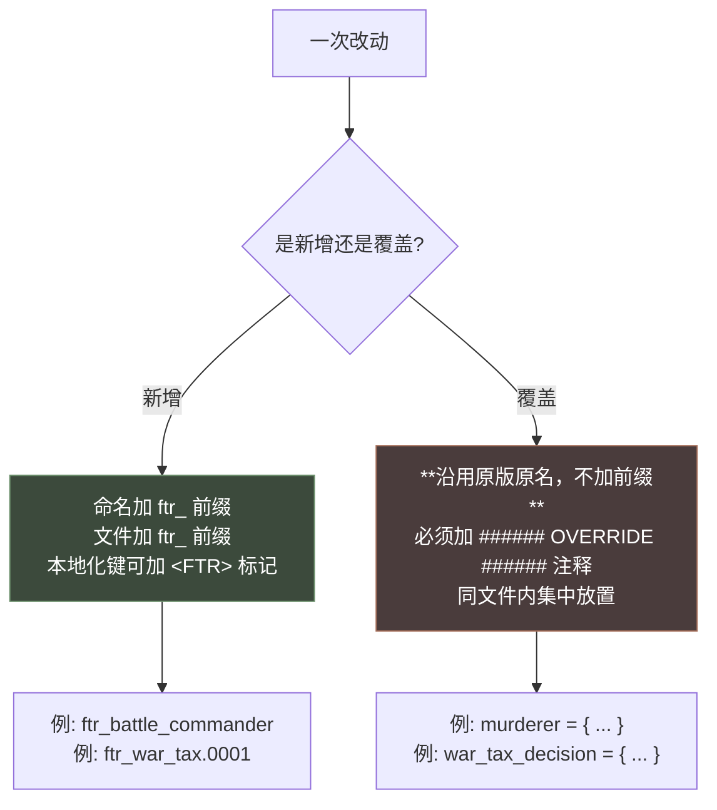

# AGENTS.md — For The Realm (朝野纷争) 开发指导

> 本文件供 AI 编码助手（CodeBuddy / Copilot / Cursor 等）阅读。
> **动手改代码前请先读完本文件**，尤其是「核心约定」与「禁忌」两节。
> 本文件只写**判断规则与项目约定**；P 语言的语法、骨架、陷阱清单统一放在 `document/` 知识库（查阅入口见 §3.8 与 §8）。

---

## 1. 项目速览

| 项 | 值 |
|---|---|
| Mod 名 | For The Realm（中文名：**朝野纷争**） |
| 版本 | `A.L.0` |
| 支持游戏版本 | **CK3 1.19.***（`descriptor.mod` 的 `supported_version`） |
| 定位 | 领地管理 + 个人生活（行政制优化 / 派系内战 / 交互 / 计谋 / 决议 / 特质） |
| 仓库 | https://github.com/FeronCompany/ck3_for_the_realm |
| Steam | `remote_file_id = 2891075410` |
| 脚本语言 | **P 语言**（Paradox Script / Clausewitz Script），非通用编程语言 |

### 1.1 本项目是「覆盖式 Mod」

这是**最重要**的特征：本项目不仅新增内容，还**大量重定义原版对象**（特质 `murderer`、决议、法律、政体、契约…）。

因此开发时必须始终分清两类操作：



> **判断方法**：查 `game/common/<对应目录>/` 里是否已存在同名对象。存在 → 覆盖；不存在 → 新增。

---

## 2. 目录结构

```
for_the_realm/
├── descriptor.mod              # Mod 清单（改版本/标签时改这里）
├── thumbnail.png               # 创意工坊封面
├── readme.md                   # 双语说明（中英各一份，改动功能需同步）
├── AGENTS.md                   # 本文件
│
├── common/                     # 游戏对象定义 + 脚本库（29 个子目录）
│   ├── character_interactions/ # 角色交互（980 行的 ftr_diplomacy_interaction.txt 等）
│   ├── decisions/              # 决议
│   ├── schemes/scheme_types/   # 计谋（combat_guide / coup）
│   ├── laws/                   # 法律
│   ├── governments/            # 政体
│   ├── traits/                 # 特质
│   ├── subject_contracts/contracts/
│   ├── scripted_effects/       # 可复用效果
│   ├── scripted_triggers/      # 可复用条件
│   ├── script_values/          # 可复数值/公式
│   ├── on_action/              # 事件调度（含 schemes/ 子目录）
│   └── modifiers/  opinion_modifiers/  effect_localization/  ...
│
├── events/                     # 事件（9 个文件 + scheme_events/ 子目录）
│   └── scheme_events/{combat_guide,coup}/
│
├── localization/               # 本地化，**english/ 与 simp_chinese/ 严格一一对应**
│   ├── english/      24 个 .yml（含 events/ interactions/ modifiers/ cultures/ custom_localization/ 子目录）
│   └── simp_chinese/ 24 个 .yml（目录结构与 english/ 完全一致）
│
├── gfx/interface/icons/        # 图标（.dds）
├── gui/                        # 界面（.gui + scripted_widgets/）
├── tools/                      # 开发工具（validate_scripts.py 语法校验，见 §5.5）
│
└── document/                   # **P 语言知识库（18 篇，约 15000 行）**
```

### 2.1 `document/` 知识库（重要）

`document/` 下有 18 篇 P 语言完整文档，是**本项目的自建知识库**，遇到语法/系统问题**优先查阅**：

| 编号 | 文档 | 何时查阅 |
|---|---|---|
| 00 | 总览与文档地图 | 不确定看哪篇时；术语对照 |
| 01 | 词法、数据类型与值系统 | 编码、字面量、变量、flag |
| 02 | 作用域 Scope 体系 | **`this`/`root`/`prev`/`scope:` 记不清时** |
| 03 | 触发器与效果 | Trigger / Effect 语法、控制流 |
| 04 | 修饰符与数值计算 | modifier / script value / 权重 |
| 05 | 脚本复用机制 | scripted_* 、`$PARAM$` |
| 06 | 事件系统与 on_action | 事件结构、调度、延迟 |
| 07 | history 与本地化 | yml 语法、方括号取值 |
| 08 | 角色交互与决议 | 改 `character_interactions/` `decisions/` 时 |
| 09 | 故事循环与局势 | 改长线系统时 |
| 10 | 法律与继承 | 改 `laws/` `succession_election/` 时 |
| 11 | 阴谋与派系 | 改 `schemes/` 时 |
| 12 | 活动与战争 | 改 `casus_belli_types/` 时 |
| 13 | 政体、特质与共治 | 改 `governments/` `traits/` 时 |
| 14 | 内阁职位、臣属契约与臣属立场 | 改 `subject_contracts/` 时 |
| 15 | common 目录清单与速查表 | **速查语法、查某个目录是干什么的** |
| 16 | 多系统选型指南与开发实践 | **选型、默认值陷阱、调试、`ftr_` 命名规范** |
| 17 | GUI 界面设计与 scripted_guis | 改 `gui/` `scripted_guis/` 时；GUI 语法、数据同步 |

> 用法：先用 `search_content` 在 `document/` 里搜关键字，再精读对应章节。

---

## 3. 核心约定（必须遵守）

### 3.1 文件编码：UTF-8 with BOM

**所有 `.txt` 与 `.yml` 文件必须带 BOM**（文件头 `EF BB BF`）。不带 BOM 中文会全部乱码、整个本地化文件不加载。

> 项目现有文件**全部**带 BOM（已实测确认）。新建文件务必保持一致；编码细节见 [文档 01 §1](document/01-词法、数据类型与值系统.md)，漏 BOM 可用 `python tools/validate_scripts.py --fix-bom` 补齐（见 §5.5）。

### 3.2 缩进：Tab，宽度 4

```
common/  统一用 Tab，一层 = 一个 Tab
localization/  .yml 用 1 个空格缩进（YAML 语法要求）
```

VS Code 已配置（`.vscode/settings.json`）：

```json
{
  "editor.tabSize": 4,
  "editor.insertSpaces": false,
  "editor.wordWrapColumn": 180
}
```

> ⚠ 已知部分旧文件混用了空格与 Tab（如 `events/ftr_war_tax_events.txt`）。**新写的代码一律用 Tab**；改动旧文件时顺手统一。

### 3.3 命名规则

| 内容类型 | 规则 | 项目内真实例子 |
|---|---|---|
| **新增**对象 ID | `ftr_` 前缀 | `ftr_battle_commander`（特质）、`ftr_end_tyrant_succession_decision`（决议） |
| **新增**脚本效果 | `ftr_` 前缀 + `_effect` | `ftr_buy_land_effect`、`ftr_coup_success_effect`、`ftr_battle_commander_rank_up_effect` |
| **新增**脚本条件 | `ftr_` 前缀 + `_trigger` | 见 `common/scripted_triggers/ftr_scripted_triggers.txt` |
| **新增**脚本值 | `ftr_` 前缀 + `_value` | `ftr_bureaucracy_value`、`ftr_buy_land_cost_value`、`ftr_political_influence_value` |
| **新增**事件命名空间 | `ftr_<模块>` | `namespace = ftr_war_tax` → `ftr_war_tax.0001` |
| **新增**变量 / 标记 | `ftr_` 前缀 | `var:ftr_merit`、`has_character_flag = ftr_is_governor` |
| **新增**文件名 | `ftr_*.txt` | `ftr_realm_decisions.txt`、`ftr_vassal_interactions.txt` |
| **覆盖**原版对象 | **不加前缀，沿用原名** | `murderer`、`war_tax_decision`、`solitude_time_decision` |
| **宏参数** | 全大写 + 下划线 | `$CHARACTER$`、`$SCALE$`、`$VALUE$` |
| **新增**事件 ID | **纯数字**（含字母如 `00A1` 判非法）；按功能**分带**编号、同族相邻、预留空位 | `ftr_court_struggle.0160` |
| **新增**事件选项名 | `<命名空间>.<编号>.<字母>` 三段式 | `ftr_war_tax.0001.a` |
| **新增**交互本地化键 | `<key>` / `<key>_desc` / `<key>_text`（双语成对） | `ftr_gift_interaction_desc` |
| **新增**事件的立绘 | `left_portrait` / `right_portrait` 均带匹配的 `animation` | `animation = scheme` |

> 注意：本地化键**不强制** `ftr_` 前缀，但**新增内容建议加**以便区分。
> 事件分带的具体区间随各系统设计文档维护（如朝堂：`00xx` 生命周期 / `01xx` 继位善后 / `02xx` 站队参与 / `03xx` 暗算链 / `04xx` 调查谋杀 / `05xx` 强出口 / `06xx` 文明争斗）。

### 3.4 `###### OVERRIDE ######` 标记（本项目特色）

覆盖原版对象时，**必须用这对注释把改动包起来**：

```paradox
can_keep_single_heir_succession_law_trigger = {
	# The 'can_keep' triggers are dependent on actually having the law...
	trigger_if = {
		limit = {
			has_realm_law = single_heir_succession_law
		}
		OR = {
			can_have_single_heir_succession_law_trigger = yes
			historical_succession_access_single_heir_succession_law_trigger = yes
			has_variable = purge_oath_previous_law
			###### OVERRIDE ######
			AND = {
				is_independent_ruler = yes
				government_allows = administrative ### OVERRIDE
			}
			###### OVERRIDE ######
		}
	}
}
```

**规则**：
- 块级改动 → 上下各一行 `###### OVERRIDE ######`
- 单行改动 → 行尾追加 `### OVERRIDE`
- 纯新增（原版没有的分支）也可用此标记，便于日后合并上游更新

**例外：on_action 挂载点不适用 override 标记**。`common/on_action/` 下对原版挂载点（如 `random_yearly_everyone_pulse`、`on_birth_child`、`on_death`）**重复定义同名 on_action 只是向 `on_actions` 列表追加回调，是合并式语义**（后定义不覆盖前定义），并非"覆盖重定义原版对象"。因此只需**沿用原名、声明新的 on_action 回调**，无需加 `###### OVERRIDE ######`，加了反而误导（误导为覆盖）。

**当前分布**（共 44 处）：`ftr_governments.txt`(14)、`ftr_realm_laws.txt`(6)、`ftr_override_interations.txt`(6)、`ftr_celestial.txt`(6)、`ftr_override_effects.txt`(4)、`ftr_scripted_triggers.txt`(3)、`ftr_cb_groups.txt`(2)、`ftr_traits.txt`(2)、`ftr_defines.txt`(1)。

### 3.5 本地化 `<FTR>` 前缀标记

新增内容的用户可见文本，**在译文前加 `<FTR>`**，让玩家一眼认出是本 Mod 内容：

```yaml
l_simp_chinese:
 war_tax_decision:0 "<FTR>战争税"
 ftr_clear_bureaucrat_title_law_decision:0 "<FTR>整合官僚头衔"
 ftr_renounce_dynasty_decision:0 "<FTR>创建新宗族"
```

> 覆盖原版已有文本时**不要**加（玩家无需知道这是改过的）。

### 3.6 双语本地化必须同步

`localization/english/` 与 `localization/simp_chinese/` 的**目录结构与文件名严格一一对应**（各 24 个文件）。

**新增或修改任何文本，必须同时改两份，且键名完全一致。**

```
localization/english/ftr_decisions_l_english.yml
localization/simp_chinese/ftr_decisions_l_simp_chinese.yml   ← 必须成对
```

```yaml
# english
l_english:
 my_key:0 "My Text"

# simp_chinese —— 键名必须相同
l_simp_chinese:
 my_key:0 "我的文本"
```

> 子目录也需对应：`events/`、`interactions/`、`modifiers/`、`cultures/`、`custom_localization/`。

### 3.7 注释约定

**注释只写在必要处，小幅度修改一律不加注释**。改数值、调条件、增删一行分支、修拼写、改本地化文案、微调 `ai_will_do` 权重等小改动，直接改完即止——不要写"改了什么/为什么改/与某文档对应"之类的说明性注释，那只会制造噪音。

需要注释的仅有三类：① **新增系统 / 机制**的整体职责说明；② **非显然的取舍或已踩过的坑**（如引擎语义陷阱、必须连写的原版起手式）；③ **跨文件接线的落点指引**（谁在哪个文件调用谁）。

事件内选项用行尾注释标注用途（原版风格，本项目沿用）：

```paradox
option = { # Add a long term tax
	name = ftr_war_tax.0001.a
	...
}
option = { # Ask vassals for donation
	name = ftr_war_tax.0001.b
	...
}
```

### 3.8 语法查哪里（本文件的边界）

**本文件不复制语法**。写脚本前按这张表找归属，不要凭记忆写码：

| 想查什么 | 去哪 |
|---|---|
| 文件骨架、词法、字面量、块与列表、`@` 常量、`$PARAM$` | [文档 01](document/01-词法、数据类型与值系统.md) §12 / §13 |
| Trigger 与 Effect 的分界、控制流、`while` 上限、`random_list` | [文档 03](document/03-触发器与效果.md) §1 / §4 / §5 |
| 带条件的提示（`custom_tooltip` / `custom_description` 的域规则） | [文档 03](document/03-触发器与效果.md) §7.1 |
| 作用域链（`this` / `root` / `prev` / `scope:` / `save_scope_as`） | [文档 02](document/02-作用域Scope体系.md) |
| CK3 里**不存在**的语法（`XOR` / `repeat` / `inline_script` …） | [文档 03](document/03-触发器与效果.md) §1、[文档 05](document/05-脚本复用机制.md) §1 |
| 跨系统陷阱、默认值、调试手法 | [文档 16](document/16-多系统选型指南与开发实践.md) §5 / §9 / §10 |
| 某个目录是干什么的、速查 | [文档 15](document/15-common目录清单与速查表.md) |

> **原则**：语法知识写进 `document/`，`AGENTS.md` 只留判断规则与项目约定。日后在文档里补齐新语法后，本文件最多加一行指向，不再展开。

### 3.9 任务设计文档写作规范（`document/task_design/`）

`document/task_design/*.md` 是各系统的**唯一设计出处**，写作与维护遵守：

- **只保留最终结论** —— 不记录变更历史，不使用「已落地 / 待落地」之类状态标注。
- **不留占位描述** —— 不写「或 / 待权衡 / 预留 / 待接线」这类悬而未决的表述；定不下来先问清楚，不要写进文档。
- **单一职责** —— 语法知识写进 `document/` 语法文档（见 §3.8），项目约定写进本文件；设计文档只写机制、数值、字段清单与验收标准，不复述语言规则。
- **改代码前先读、改完代码同步更新**对应设计文档（每篇开头写明其为唯一出处）。

---

## 4. 常见任务 SOP

> 各对象的标准骨架一律照 `document/` 抄（下方给出落点），本文件只列**步骤与易错约束**。

### 4.1 新增一个决议

1. 在 `common/decisions/` 选文件（按主题：`ftr_realm_decisions.txt` / `ftr_major_decisions.txt` / `ftr_charactor_decisions.txt`）
2. **骨架照 [文档 08](document/08-角色交互与决议.md) 抄**（`desc` / `selection_tooltip` / `cooldown` / `is_shown` / `is_valid` / `cost` / `effect` / `ai_*`）
3. `ai_check_interval` 与 `ai_goal` **必须二选一**，否则报错（语义差异见 [文档 08](document/08-角色交互与决议.md)）
4. **双语本地化 4 个键**：`_desc` / `_tooltip` / `_confirm` + 键本身（写法见 §3.5、§3.6）

### 4.2 新增一个事件

1. `events/` 下建 `ftr_<模块>_events.txt`，**先声明 `namespace`**（结构与调度见 [文档 06](document/06-事件系统与on_action.md)）
2. 双语本地化放 `localization/{english,simp_chinese}/events/ftr_events_l_<lang>.yml`
3. 需要跨事件传递数据时用 `save_scope_as`，**不要用局部变量**（on_action 的 effect 与事件是两条独立域链）

### 4.3 覆盖一个原版对象

1. 在 `game/common/<目录>/` 找到原版定义，**复制其原有内容**
2. 在 Mod 的 `ftr_*.txt` 里重定义同名对象，**保留原版原有条目，只改/加需要的部分**
3. 用 `###### OVERRIDE ######` 包裹改动（标记写法、示例与当前分布见 §3.4）
4. 若只需改其中一处，优先用 scripted_trigger 间接覆盖，减少冲突面

> ⚠ 例外：**on_action 挂载点不是"覆盖"**。原版 on_action 挂载点的重复定义是**追加回调的合并语义**，只需沿用原名声明新回调，**不要加 override 标记**（见 §3.4）。

### 4.4 新增一个特质

1. 字段与骨架见 [文档 13](document/13-政体、特质与共治.md)（`category` / `icon` / `health` / `same_opinion` / `desc` …）
2. 动态描述（`desc` / `name` / `icon`）**第一条必须是兜底 `NOT = { exists = this }`**，否则无根域时报错（见 [文档 13](document/13-政体、特质与共治.md)）
3. 配套：`gfx/interface/icons/traits/` 下的 `.dds` 图标（若用自定义 `icon`）＋ 双语本地化 `ftr_traits_l_english.yml` / `ftr_traits_l_simp_chinese.yml`（键：`trait_<key>` 与 `trait_<key>_desc`）

### 4.5 新增一个计谋

现有参考：`common/schemes/scheme_types/ftr_coup_scheme.txt`、`combat_guide_scheme.txt`
事件放 `events/scheme_events/<模块>/`，on_action 放 `common/on_action/schemes/`。
详见 [文档 11 §1](document/11-阴谋与派系.md)。

---

## 5. 工作流

### 5.1 改动前

```
1. 先查 document/ 语法文档 → 精读对应章节（文档为主）
2. 语法文档没写清或不完整时，再查原版文件（game/，含 .info 与 game/localization/english/）核对写法与语义
3. 在 game/common/<目录>/ 确认原版有无同名对象 → 决定"新增"还是"覆盖"
4. 在 Mod 内找最接近的现有实现作为模板
5. 对于拿不准的需求项，主动提出问题明确需求
```

### 5.2 改动中

```
4. 写脚本（Tab 缩进、ftr_ 前缀、OVERRIDE 标记）
5. 写双语本地化（键名完全一致、新增内容加 <FTR>）
6. 确认文件带 BOM
7. 运行校验脚本（见 §5.5）确认无 Error
```

### 5.3 改动后（人工确认）

```
7. 启动游戏 → 检查 error.log 有无本 Mod 报错，如果error.log有报错而检验脚本没有发现，提醒开发者是否更新脚本
8. 控制台验证对象已加载
9. 用 effect 命令直接触发脚本片段
10. 观察 UI：名称、描述、custom_description 是否正常
11. 快进观察 AI 是否会用到（ai_will_do / ai_accept 是否合理）
12. 若新增/改动了玩家可见功能 → 同步更新 readme.md（中英双语）
```

### 5.4 提交前检查清单

- [ ] 所有 `.txt` / `.yml` 是 **UTF-8 with BOM**
- [ ] 缩进用 **Tab**（`.yml` 用空格）
- [ ] 新增内容加了 `ftr_` 前缀
- [ ] 覆盖原版处加了 `###### OVERRIDE ######`
- [ ] 双语本地化**键名一致、文件成对**
- [ ] 新增的玩家可见文本加了 `<FTR>`
- [ ] 决议写了 `ai_check_interval` 或 `ai_goal`
- [ ] 事件声明了 `namespace`
- [ ] 动态描述第一条是 `NOT = { exists = this }`
- [ ] 改动了功能 → `readme.md` 双语同步
- [ ] 没有提交 `.bak`、空文件、调试残留

### 5.5 语法校验脚本（每次改动后必跑）

`tools/validate_scripts.py` 是本 Mod 的 P 语言语法快速校验器，**每次改脚本/本地化后必须运行**，确保 `error.log` 干净。

```bash
# 校验整个 mod（常用，带原版引用一致性检查——推荐每次都带 --game-path）
python tools/validate_scripts.py --game-path "C:\Program Files (x86)\Steam\steamapps\common\Crusader Kings III\game"

# 只校验某个目录/文件（改动局部时更快）
python tools/validate_scripts.py common/decisions --game-path <游戏路径>
python tools/validate_scripts.py events/ftr_court_struggle_events.txt --game-path <游戏路径>

# 自动为缺失 BOM 的文件补上 BOM
python tools/validate_scripts.py --fix-bom

# 跳过引用一致性检查（不提供游戏目录时自动跳过）
python tools/validate_scripts.py
python tools/validate_scripts.py --no-ref
```

**校验项**（1-9 为硬性 Error，10-14 为 Warning）：

| # | 校验项 | 级别 |
|---|---|---|
| 1 | `.txt`/`.yml` 必须为 **UTF-8 with BOM**（缺 BOM 中文乱码、本地化不加载） | Error |
| 2 | 花括号 `{}` 配对（跳过字符串与注释内的括号） | Error |
| 3 | `.yml` 语言头（`l_english:`/`l_simp_chinese:`）+ 键值 `key:0 "text"` 格式 | Error |
| 4 | 事件文件须声明 `namespace` | Error |
| 5 | **引用一致性**（需 `--game-path`）：`has_trait`/`has_realm_law`/`has_title_law`/`X_effect`/`X_trigger`/`X_value` 引用的对象名须在游戏/本 mod 白名单中 | Error |
| 6 | **已知非法模式**：`starts_enabled = yes`、`send_interface_message type = msg_generic`、`start_scheme target`（应 `target_character`）、`has_army`、`start_story` 等历史踩坑写法 | Error |
| 7 | **GUI 语义**：`Custom()`/`CustomDescription()` data function 不存在、`text = {}` 文本块、`ScriptValue('x')` 引用的非 script value、`gridbox` 放 datamodel | Error/Warning |
| 8 | 决议须写 `ai_check_interval` 或 `ai_goal`（二选一） | Warning |
| 9 | 缩进规范：common 用 Tab、localization 用空格 | Warning |
| 10 | 新增顶层对象须带 `ftr_` 前缀（覆盖原版需 `###### OVERRIDE ######`） | Warning |
| 11 | 双语本地化键名一致性（english 与 simp_chinese 成对） | Warning |

> ⚠ **引用一致性检查能抓"语法过但 error.log 报错"的语义错误**（如引用了不存在的 trait/law/effect/trigger/value）。已实际抓到过：`has_trait = genius`（应 `intellect_good_3`）、`melancholic`（应 `depressed`）、`monastic`（不存在）、性别法 `male_preferred_law`（应 `has_title_law = male_only_law/female_only_law`）。
> **注意事项**：脚本会同时加载 mod 自身定义的 trait/law/effect/trigger/value 进白名单，避免 mod 新增对象误报；未提供 `--game-path` 时引用检查自动跳过。
> **新增 on_action 挂载点**时，须把挂载点名登记进脚本的 `VANILLA_ON_ACTION_HOOKS` 白名单（`tools/validate_scripts.py`），否则会误报；mod 自定义的 `ftr_*` 对象由脚本自动纳入，无需手工登记。

**退出码**：`0` = 全通过；`1` = 有 Error（**必须修复**，会引发加载失败）；`2` = 仅有 Warning（规范提示，建议处理）。

> 该脚本是启发式检查，无法替代实际启动游戏看 `error.log`。遇到脚本未覆盖的语法问题仍以 [文档 01](document/01-词法、数据类型与值系统.md) 与游戏 `error.log` 为准。

---

## 6. 禁忌

### 6.1 语言层（语法清单在文档里，此处只记判断规则）

- **不存在的东西别用** —— `XOR`、`repeat` / `break` / `continue`、`inline_script`、`parameters = { P = { type = … } }` 声明块在 CK3 中**都不存在**（原版全目录 0 命中）。清单与检索证据见 [文档 03 §1](document/03-触发器与效果.md)、[文档 05 §1](document/05-脚本复用机制.md)。
- **Trigger 只读、Effect 只写** —— Trigger 里改状态会报错或静默失败；Effect 里写条件必须包进 `limit = { }`；`while` 必须能让 `limit` 最终变假，或写 `count` 上限。见 [文档 03](document/03-触发器与效果.md) §1 / §4。
- **提示要分域** —— **效果域**的 `custom_tooltip` / `custom_description` 只接受 effects（要条件显示须外套 `if = { limit = { … } custom_tooltip = { text = … } }`）；**判定域**（`is_valid` / `is_shown` / `limit` / `send_option.is_valid`）则直接裸写触发器。见 [文档 03 §7.1](document/03-触发器与效果.md)。

### 6.2 本项目特有

| 禁忌 | 原因 |
|---|---|
| **不带 BOM 建文件** | 中文全乱码、本地化整份不加载 |
| **只改一种语言的本地化** | 破坏双语同步，玩家会看到原键名 |
| **覆盖原版对象时加 `ftr_` 前缀** | 覆盖必须沿用原名，否则变成新增对象、不生效 |
| **覆盖不加 `###### OVERRIDE ######`** | 无法与上游更新合并，维护困难 |
| **无意义地重定义整段原版内容** | 只改需要的部分，最小化冲突面 |
| **用空格缩进新代码** | 项目统一 Tab |
| **提交 `gui/*.bak` 或空文件** | 仓库卫生 |
| **硬编码数值**（AI 权重除外） | 领域常量（成本 / 阈值 / 档位 / 跨文件共用值）抽成 `common/script_values/ftr_*.txt` 的 script value；**例外**：`ai_will_do` / `ai_accept` / 事件选项 `ai_chance`（含其所引用的 scripted_modifiers）内的加减分、乘数与 AI 内部阈值**直接写字面数字**——就地可读、便于调参，不抽常量，替换后也不得残留死常量 |
| **判断「行政类政体」用错 API** | 一律用 `government_allows = administrative`；`government_has_flag = government_is_administrative` 只指行政制本体，会漏掉天朝 / 日本行政 / 官僚制 / 草原行政（见 [文档 13 §4.1](document/13-政体、特质与共治.md)） |
| **业务处散写底层写操作** | 记账 / 状态变更只经唯一的封装 effect（如功勋系统的记账封装），不要在调用点散写 `change_variable` / `add_opinion` |

### 6.3 高风险操作（需先确认）

- 修改 `descriptor.mod` 的 `supported_version` —— 会导致旧版本游戏无法加载
- 修改 `common/defines/ftr_defines.txt` —— 全局影响，defines 只能覆盖已有键
- 删除 `common/on_action/` 里的原版钩子覆盖 —— 可能让整个 Mod 的调度失效
- 改动 `ftr_override_*.txt` —— 这些是与原版差异的集中地，改前先备份

---

## 7. 环境信息

| 项 | 路径 |
|---|---|
| Mod 目录 | `C:\Users\Administrator\Documents\Paradox Interactive\Crusader Kings III\mod\for_the_realm` |
| 游戏原版脚本 | `C:\Program Files (x86)\Steam\steamapps\common\Crusader Kings III\game` |
| 游戏备份 | `D:\ck3_backup\game` |
| 相关 Mod | `../remove-make-up` |
| **报错日志** | `C:\Users\Administrator\Documents\Paradox Interactive\Crusader Kings III\logs\error.log` |

以上路径已配置在 `for_the_realm.code-workspace`（多根工作区），**原版脚本可直接检索**，作为语法文档的补充核对（先查 `document/`，文档没写清再查原版）。

### 7.1 查阅原版的正确姿势

> 适用时机：仅当 `document/` 语法文档没写清或不完整时，才进原版核对（见 §5.1）。

```
1. 先读 game/common/<目录>/_xxx.info     ← 官方语法说明，最权威
2. 再读 game/common/<目录>/00_*.txt      ← 基础定义与注释最全
3. 在 game/events/ 或 game/common/ 里 grep 该对象的引用，看真实用法
4. 在 game/localization/english/ 里搜同名键，理解语义
```

> `game/common/` 下共 **138 个 `.info`** 文件，是 Paradox 官方自带的语法文档。

---

## 8. 查阅指引（语法与陷阱不在本文件）

本文件不再复制语法速查与陷阱清单，统一在 `document/` 维护：

| 要查什么 | 去哪 |
|---|---|
| 文件骨架、词法速记卡 | [文档 01](document/01-词法、数据类型与值系统.md) §13（完整结构图见 §12） |
| 高频陷阱：语言 / 作用域 / 系统三层 | [文档 16](document/16-多系统选型指南与开发实践.md) §9 |
| 默认值陷阱（空 trigger、排序方向、恒真恒假） | [文档 16](document/16-多系统选型指南与开发实践.md) §5 |
| 调试手法（二分、控制台、`send_interface_toast`、`custom_description` 自证） | [文档 16](document/16-多系统选型指南与开发实践.md) §10 |
| 带条件的提示怎么写 | [文档 03](document/03-触发器与效果.md) §7.1 |
| 目录清单与速查 | [文档 15](document/15-common目录清单与速查表.md) |
| 官方 `.info` 索引 | [文档 16](document/16-多系统选型指南与开发实践.md) §11 |

> 调试用交互已集中在 `common/character_interactions/ftr_debug_interaction.txt` 与 `common/decisions/ftr_debug_decisions.txt`，可直接扩展。
> **原则：新增语法知识写进对应 `document/` 文档，不要堆回本文件。**

---

## 9. 行为准则

1. **语法文档优先** —— 任何语法/机制不确定时，先查 `document/` 知识库（自建文档为主）；语法文档没写清或不完整时，再查 `game/` 原版文件（`common/<目录>/*.info`、`00_*.txt`、`events/`、`game/localization/english/`）核对；最后才考虑网络检索；不要凭记忆写码
2. **最小化改动** —— 能抽 scripted_effect 就不复制粘贴；能间接覆盖就不整体重定义
3. **双语同步是硬要求** —— 改任何用户可见文本，两份 yml 一起改
4. **不确定就加 `exists` / `?=`** —— 避免"无效作用域"报错
5. **改动功能同步 `readme.md`** —— 中英双语
6. **不要主动提交 git** —— 除非用户明确要求
7. **不要删除 `document/`** —— 那是本项目的知识库，不是缓存

---

*最后更新：基于 CK3 1.19.* 与 For The Realm A.L.0*
