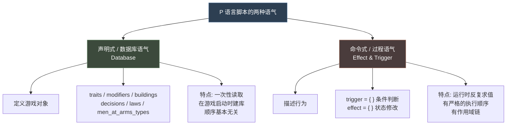
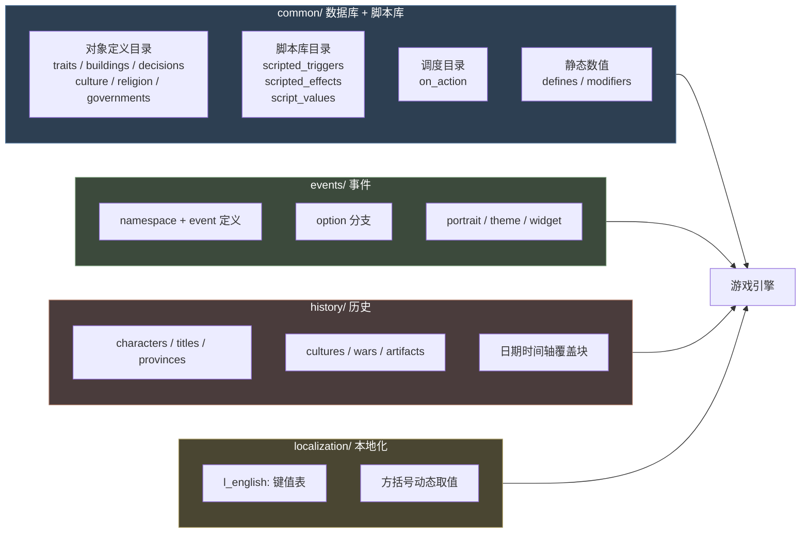
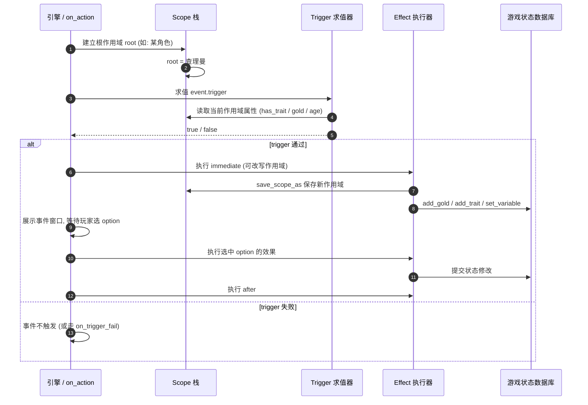
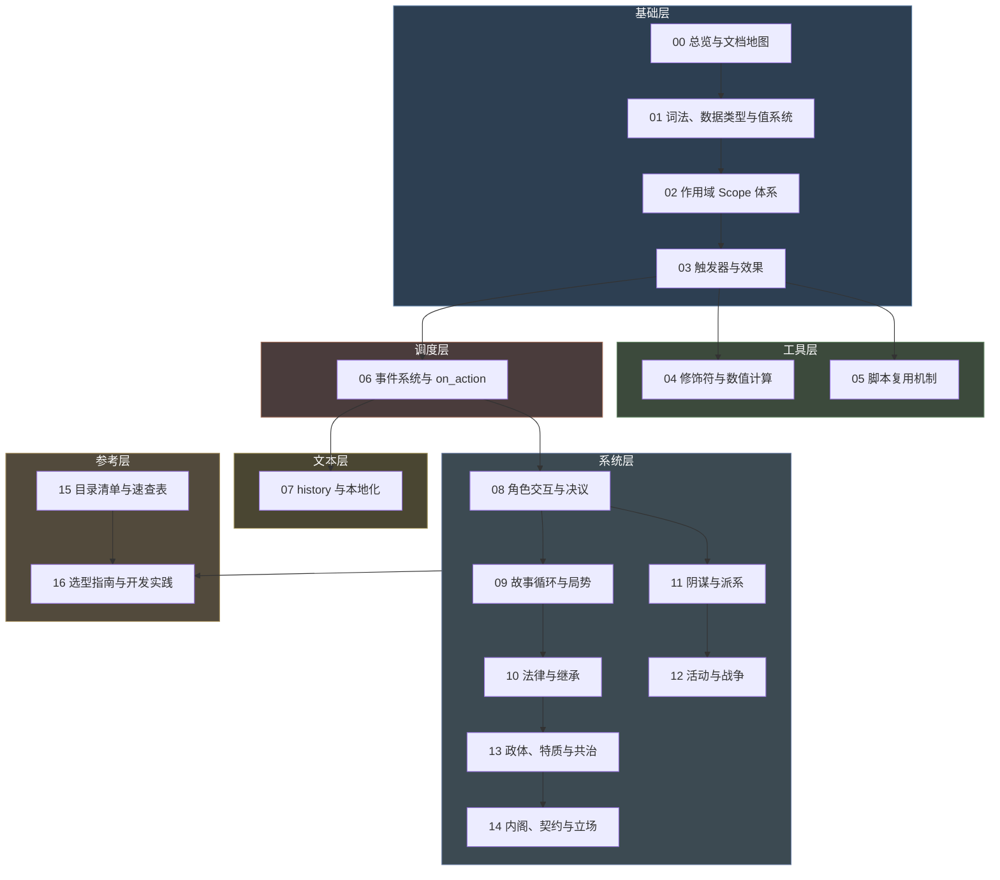
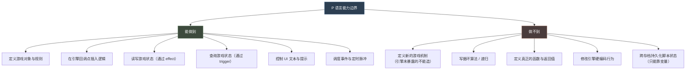
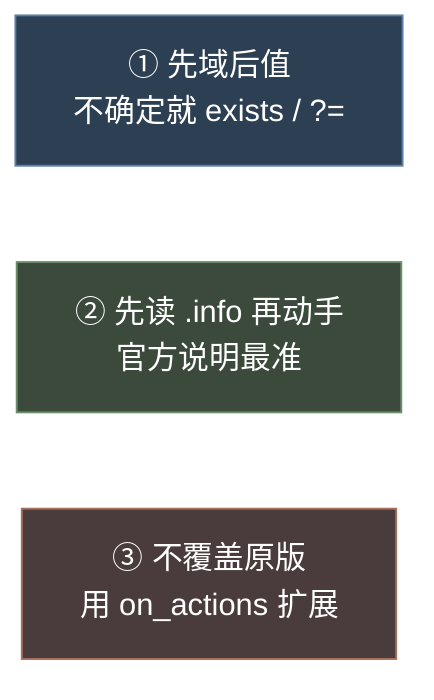
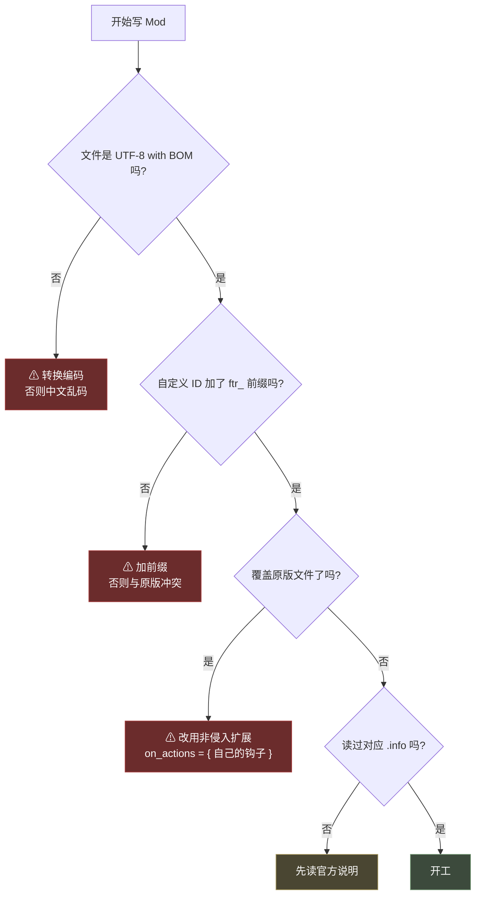
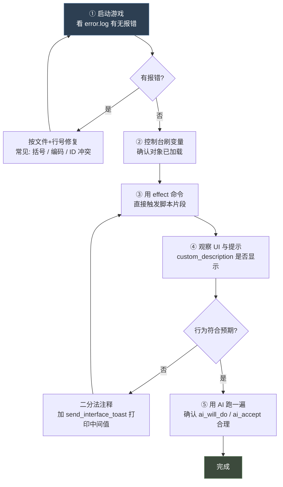

# 00 总览与文档地图

> 本系列基于 `Crusader Kings III\game` 目录下 `common` / `events` / `history` / `localization` 四个目录的原版脚本实证整理。
> 文中所有语法示例均取自官方原版文件，可直接对照查阅；所有属性表均以官方 `.info` 逐条校对。

---

## 1. P 语言是什么

**P 语言**（Paradox 社区俗称 **Clausewitz Script** / **Jomini Script**）是 Paradox 自研的**声明式、数据驱动**脚本语言。它**不是通用编程语言**：

- ❌ 没有函数声明、没有类、没有 `return`
- ❌ 没有传统意义上的"变量作用域"（取而代之的是 **Scope 作用域对象**）
- ✅ 脚本的实质是：**向游戏引擎的数据库注册对象定义**，或**向引擎声明"在什么条件下执行什么"**

因此 P 语言有**两种截然不同的语气**，理解这一点是掌握全语言的关键：



| 维度 | 数据库语气 | 过程语气 |
|---|---|---|
| 典型目录 | `common/traits`、`common/decisions`、`common/buildings` | `common/scripted_effects`、`events/`、`common/on_action` |
| 谁在读 | 游戏启动时的数据库加载器 | 游戏运行时的脚本虚拟机 |
| 执行次数 | 一次 | 每帧 / 每事件 / 每脉冲 |
| 顺序敏感性 | 低（后定义覆盖先定义） | **高**（语句自上而下执行） |
| 核心概念 | 对象 ID + 属性块 | **Scope** + **Trigger** + **Effect** |

---

## 2. 目录 - 语气 映射总览



### 2.1 四大目录的角色

| 目录 | 范式 | 加载时机 | 内容 |
|---|---|---|---|
| `common/` | 对象定义 + 脚本库 + 调度 | 启动建库 | 100+ 个子目录，见 [15 目录清单](15-common目录清单与速查表.md) |
| `events/` | 事件定义（536 个 txt） | 启动建库 | `namespace` + `event = { }` |
| `history/` | **时间轴回放** | 开局时按日期回放 | 基线 + `date = { }` 覆盖块 |
| `localization/` | 键值文本表 | 启动建库 | `l_english:` / `l_simp_chinese:` |

> **`history/` 是唯一使用"时间轴"范式的目录** —— 它不是定义对象，而是按日期回放初始化指令。详见 [07](07-history历史脚本与本地化.md) §1。

---

## 3. 心智模型：三件事

P 语言的运行时只有三件事在循环发生：**"我是谁（Scope）" → "条件是否成立（Trigger）" → "做什么（Effect）"**。



### 3.1 铁律

| 铁律 | 说明 |
|---|---|
| **Trigger 只读** | Trigger 块内**绝对不能**修改游戏状态 |
| **Effect 可写** | Effect 块内裸写条件必须包进 `limit = { }` |
| **块内默认 AND** | 多条 Trigger 并列默认就是 AND，除非显式写 `OR` |
| **执行严格自上而下** | Effect 无例外；script value 的运算顺序直接影响结果 |
| **先查 script value 再查域链** | 数字位置会先查 script value 表，再查 scope 链属性 |

> ⚠ 最后一条导致的经典陷阱：`add_gold = gold` 不是"把变量 gold 加给自己"，而是"把**当前域的金币属性**加给自己"，即翻倍。

---

## 4. 核心概念速查表

| 概念 | 一句话解释 | 详见 |
|---|---|---|
| **Key-Value** | 语言的唯一基本结构 `key = value` | [01](01-词法、数据类型与值系统.md) §1.4 |
| **Block 块** | `key = { ... }`，承载嵌套结构 | [01](01-词法、数据类型与值系统.md) §1.7 |
| **List 列表** | `{ a b c }` 无 key 的裸值序列 | [01](01-词法、数据类型与值系统.md) §1.8 |
| **Scope 作用域** | 当前"正在谈论哪个游戏对象" | **[02](02-作用域Scope体系.md)** |
| **Trigger 触发器** | 只读的条件判断，返回真假 | [03](03-触发器与效果.md) §1 |
| **Effect 效果** | 可写的状态修改动作 | [03](03-触发器与效果.md) §2 |
| **Modifier 修饰符** | 一段带时长的属性加成 | [04](04-修饰符与数值计算.md) §2 |
| **Script Value 脚本值** | 可复用的数值 / 公式 | [04](04-修饰符与数值计算.md) §3 |
| **Variable 变量** | 挂在作用域上的自定义数据 | [04](04-修饰符与数值计算.md) §5 |
| **Flag 标记** | 挂在作用域上的自定义布尔 | [01](01-词法、数据类型与值系统.md) §2.3 |
| **Event 事件** | 带 UI 的交互单元 | [06](06-事件系统与on_action.md) §1 |
| **On Action 动作钩子** | 引擎回调 / 事件调度器 | [06](06-事件系统与on_action.md) §2 |
| **Scripted X** | 可复用脚本片段（触发器 / 效果 / 值…） | [05](05-脚本复用机制.md) |
| **History 时间轴** | 按日期回放的初始化脚本 | [07](07-history历史脚本与本地化.md) §1 |
| **Localization 本地化** | 键值文本 + 动态插值 | [07](07-history历史脚本与本地化.md) §2 |

### 4.1 游戏系统概念

| 概念 | 一句话解释 | 详见 |
|---|---|---|
| **Character Interaction 角色交互** | 角色间的双向外交动作 | [08](08-角色交互与决议.md) §1 |
| **Decision 决议** | 角色单向的一次性大动作 | [08](08-角色交互与决议.md) §2 |
| **Story Cycle 故事循环** | 绑角色的定时长线剧情 | [09](09-故事循环与局势.md) §1 |
| **Situation 局势** | 绑区域的多角色阶段系统 | [09](09-故事循环与局势.md) §2 |
| **Law 法律** | 互斥单选的持续规则 | [10](10-法律与继承.md) §1 |
| **Succession 继承** | 头衔传给谁 | [10](10-法律与继承.md) §2 |
| **Scheme 阴谋** | 秘密行动 + 特工 + 暴露风险 | [11](11-阴谋与派系.md) §1 |
| **Faction 派系** | 封臣抱团施压 | [11](11-阴谋与派系.md) §2 |
| **Activity 活动** | 主客多阶段聚会 | [12](12-活动与战争.md) §1 |
| **War 战争** | CB + 战争分数 | [12](12-活动与战争.md) §2 |
| **Government 政体** | 角色制度类型与机制开关 | [13](13-政体、特质与共治.md) §1 |
| **Trait 特质** | 角色属性标签 | [13](13-政体、特质与共治.md) §2 |
| **Diarchy 共治** | 权力分享安排 | [13](13-政体、特质与共治.md) §3 |
| **Council Position 内阁职位** | 廷臣职务槽位 | [14](14-内阁职位、臣属契约与臣属立场.md) §1 |
| **Subject Contract 臣属契约** | 封臣对领主的义务 | [14](14-内阁职位、臣属契约与臣属立场.md) §2 |
| **Vassal Stance 臣属立场** | AI 封臣对领主的态度 | [14](14-内阁职位、臣属契约与臣属立场.md) §3 |

---

## 5. 文档地图

本系列共 **17 篇**，按"基础 → 工具 → 调度 → 系统 → 参考"五层组织。



### 5.1 完整索引

| 编号 | 文档 | 内容 | 行数 | 前置 |
|---|---|---|---|---|
| **00** | [总览与文档地图](00-总览与文档地图.md) | 心智模型、概念速查、文档地图、学习路径 | ~620 | — |
| **01** | [词法、数据类型与值系统](01-词法、数据类型与值系统.md) | 编码、注释、标识符、运算符、块与列表、值系统 | ~950 | 00 |
| **02** | [作用域 Scope 体系](02-作用域Scope体系.md) | **全语言最核心概念**：域链、`this`/`root`/`prev`/`scope:`、迭代器 | ~640 | 01 |
| **03** | [触发器与效果](03-触发器与效果.md) | Trigger 与 Effect 的完整语法与控制流 | ~1085 | 02 |
| **04** | [修饰符与数值计算](04-修饰符与数值计算.md) | Modifier / Script Value / Variable / 权重计算 | ~645 | 01 |
| **05** | [脚本复用机制](05-脚本复用机制.md) | Scripted X 全家桶、`$PARAM$` 宏替换 | ~630 | 04 |
| **06** | [事件系统与 on_action](06-事件系统与on_action.md) | 事件结构、动态描述、on_action 调度 | ~1140 | 03 |
| **07** | [history 历史脚本与本地化](07-history历史脚本与本地化.md) | 时间轴范式、yml 语法、方括号取值 | ~1065 | 01 |
| **08** | [角色交互与决议](08-角色交互与决议.md) | 五域模型、11 步校验、条件三件套 | ~735 | 03·06 |
| **09** | [故事循环与局势](09-故事循环与局势.md) | `effect_group` 定时脉冲、阶段转移、催化剂 | ~820 | 03·06 |
| **10** | [法律与继承](10-法律与继承.md) | 条件四件套、选举与任命继承 | ~650 | 03·04 |
| **11** | [阴谋与派系](11-阴谋与派系.md) | 四条数值轨道、成员双轨制、实力与不满 | ~850 | 03·04 |
| **12** | [活动与战争](12-活动与战争.md) | 三态状态机、阶段与宾客、CB 与战争分数 | ~1135 | 03·06 |
| **13** | [政体、特质与共治](13-政体、特质与共治.md) | 40+ 机制开关、特质 flag、权力天平 | ~920 | 03·04 |
| **14** | [内阁职位、臣属契约与臣属立场](14-内阁职位、臣属契约与臣属立场.md) | 职务槽位、义务等级、自动生成 modifier | ~750 | 03·04 |
| **15** | [common 目录清单与速查表](15-common目录清单与速查表.md) | 100+ 子目录归类、语法速查、排错对照 | ~920 | — |
| **16** | [多系统选型指南与开发实践](16-多系统选型指南与开发实践.md) | 选型决策树、默认值陷阱、`ftr_` 规范、调试 | ~800 | 08-14 |

---

## 6. 学习路径

### 6.1 新手路径（想快速上手写 Mod）


**最少必需**：00 → 01 → 02 → 03 → 06（★ 为核心）。学会这五篇就能写事件驱动的 Mod。

### 6.2 进阶路径（想做复杂系统）

```
00 → 01 → 02 → 03 → 04（数值） → 05（复用） → 06（调度）
   → 08-14（按需求选读系统专篇）
   → 16（选型与陷阱）
```

**关键补充**：
- [04](04-修饰符与数值计算.md) —— 做任何数值平衡必读
- [05](05-脚本复用机制.md) —— 代码量超过 500 行必读
- [16](16-多系统选型指南与开发实践.md) §5 —— 默认值陷阱汇总，能省下大量调试时间

### 6.3 参考路径（遇到具体问题）

| 问题 | 直接去 |
|---|---|
| "这个语法怎么写？" | [15](15-common目录清单与速查表.md) 第二部 速查表 |
| "这个目录是干什么的？" | [15](15-common目录清单与速查表.md) 第一部 目录清单 |
| "该用哪个系统？" | [16](16-多系统选型指南与开发实践.md) §2 选型决策树 |
| "为什么没生效？" | [16](16-多系统选型指南与开发实践.md) §5 默认值陷阱 + §10 调试 |
| "这个 scope 是什么？" | [16](16-多系统选型指南与开发实践.md) §3 作用域速查 |
| "怎么命名？" | [16](16-多系统选型指南与开发实践.md) §7 `ftr_` 命名规范 |

---

## 7. 最小可用示例：一个完整功能闭环

下面展示一个 Mod 功能从"定义 → 触发 → 执行 → 显示"的完整闭环。

### ① 本地化 — `localization/simp_chinese/ftr_mod_l_simp_chinese.yml`

```yaml
l_simp_chinese:
 ftr_feast_decision_name: "举办盛宴"
 ftr_feast_decision_desc: "花费金币，换取封臣好感。"
 ftr.0001.t: "盛宴开始"
 ftr.0001.desc: "[ROOT.Char.GetTitledFirstName] 的盛宴正式开始。"
 ftr.0001.a: "开席！"
```

> ⚠ 文件必须是 **UTF-8 with BOM**，否则中文全部乱码。

### ② 决议定义 — `common/decisions/ftr_decisions.txt`（数据库语气）

```paradox
ftr_feast_decision = {
	picture = "gfx/interface/illustrations/decisions/decision_lifestyle"

	is_shown = { is_adult = yes }
	can_pick = { gold >= 50 }
	cost = { gold = 50 }

	effect = {
		trigger_event = { on_action = ftr_feast_on_action }
	}
}
```

### ③ 调度钩子 — `common/on_action/ftr_on_actions.txt`

```paradox
ftr_feast_on_action = {
	effect = {
		every_vassal = {
			save_scope_as = ftr_feast_guest     # ← 必须用 save_scope_as，局部变量传不过去
		}
	}
	events = {
		ftr.0001
	}
}
```

### ④ 事件 — `events/ftr_events.txt`

```paradox
namespace = ftr

ftr.0001 = {
	type = character_event
	title = ftr.0001.t
	desc = ftr.0001.desc

	left_portrait = {
		character = root
		animation = personality_honorable
	}

	option = {
		name = ftr.0001.a
		add_opinion = {
			target = scope:ftr_feast_guest
			modifier = banished_opinion
			opinion = 20
		}
	}
}
```

### ⑤ 闭环流向


**五个环节分别对应**：[08 决议](08-角色交互与决议.md) §2 → [06 on_action](06-事件系统与on_action.md) §2 → [02 作用域](02-作用域Scope体系.md) §4 → [06 事件](06-事件系统与on_action.md) §1 → [07 本地化](07-history历史脚本与本地化.md) §2。

---

## 8. 术语约定

本系列文档统一使用以下译名：

| 英文 | 中文译名 | 说明 |
|---|---|---|
| Scope | 作用域 / 域 | 当前讨论的游戏对象。混用"作用域"与"域" |
| Trigger | 触发器 / 条件 | 只读判断 |
| Effect | 效果 | 写操作 |
| Modifier | 修饰符 | 带时长的属性加成 |
| Block | 块 | `key = { }` 结构 |
| List / Array | 列表 | `{ a b c }` |
| Saved Scope | 具名域 / 保存域 | `save_scope_as` 产物 |
| Scope Chain | 域链 | `a.b.c` 形式 |
| Event Target | 事件目标 | 域链上的一环 |
| On Action | 动作钩子 / 回调 | 引擎事件点 |
| Weight | 权重 | 随机选取的倾向值 |
| Pulse | 脉冲 | 周期性 on_action |
| Localization | 本地化 / 本地化文本 | 简称 loc |
| Pulse Action | 脉冲行动 | 阴谋 / 活动的周期性小事件 |
| Catalyst | 催化剂 | 局势中累积点数的事件标记 |
| Mandate | 任务 | 共治者被指派的工作 |
| Intent | 意图 | 活动宾客的隐藏目标 |
| Locale | 场所 | 活动阶段间可去的小场景 |
| Obligation | 义务 | 臣属契约中的税 / 兵等条目 |
| Stance | 立场 | AI 封臣对领主的态度 |
| Parameter（共治） | 参数 | 共治权力等级解锁的开关标记 |

---

## 9. 能力边界与常见误区

### 9.1 P 语言能做什么、不能做什么



**关键认知**：P 语言是**配置 + 钩子**语言，不是编程语言。所有"编程感"都来自：

| 想做的事 | P 语言的替代方案 |
|---|---|
| 函数 | `scripted_effect` / `scripted_trigger` + `$PARAM$` 宏 |
| 参数 | `$PARAM$` 纯文本替换（可拼进标识符中间） |
| 局部变量 | `var:` / `local_var:` / `global_var:` |
| 返回值 | `save_scope_value_as` 或写入变量 |
| 循环 | `while`（带 `count` 上限）+ 迭代器 |
| 分支 | `if` / `else_if` / `else`、`switch` |
| 类 | 数据库对象定义（如 `traits/`、`buildings/`） |
| 异常处理 | `exists` 检查 + `?=` 弱比较 |

### 9.2 常见误区 Top 10

| # | 误区 | 真相 |
|---|---|---|
| 1 | "`add_gold = gold` 是把变量加进去" | 数字位置先查 script value 表，再查域链 —— 这是"把自己金币数加给自己"，**翻倍** |
| 2 | "块内多条件要写 `AND`" | **默认就是 AND**，写 `AND` 反而多余 |
| 3 | "Trigger 里可以 `set_variable`" | Trigger 只读；只有 `save_scope_as` 这类不改状态的才允许 |
| 4 | "`on_pass` 一定会执行" | 法律在 **default 初始化、继承他人** 时都不执行 |
| 5 | "空 trigger 等于无条件通过" | 视属性而定：`can_fire = { }` 是 **yes**，而 `auto_fill = { }` 是 **no** |
| 6 | "局部变量能从 on_action 传到事件" | on_action 的 `effect` 与事件是**两条独立域链**，必须 `save_scope_as` |
| 7 | "`sort_order` 越大越靠前" | 多数系统如此，但**派系相反**（小者在前） |
| 8 | "延迟事件一定会触发" | 延迟到期时**二次校验** trigger，条件可能已不成立 |
| 9 | "`while` 会自己停" | 必须让 `limit` 变假，或加 `count` 上限，否则死循环 |
| 10 | "中文文档不用管编码" | `.txt` 与 `.yml` **都必须是 UTF-8 with BOM**，否则乱码 |

### 9.3 三条黄金法则



1. **先域后值** —— 访问任何 `scope:xxx` 前先 `exists`，或用 `?=` 弱比较。这是避免"无效作用域"报错的第一道防线。
2. **先读 `.info` 再动手** —— `common/` 下共 **138 个 `.info`**，是 Paradox 官方语法文档，比任何二手资料都准。
3. **不覆盖原版文件** —— 扩展原版行为一律用 `on_actions = { 自己的钩子 }`，这是兼容性最好的方式。

---

## 10. 实证方法与免责说明

### 10.1 本系列的实证基础

| 结论类型 | 验证方式 |
|---|---|
| 属性表 | 逐条对照官方 `.info` 原文 |
| 语法示例 | 全部标注原版文件出处（路径 + 行号） |
| "不存在"类结论 | 全目录检索确认 0 命中 |

### 10.2 经实证确认的"不存在"

以下语法在 CK3 中**不存在**，请勿使用：

| 语法 | 检索结果 |
|---|---|
| `XOR` | 全目录 0 命中 |
| `repeat` / `break` / `continue` | 全目录 0 命中（循环只有 `while`） |
| `inline_script` | 全目录 0 命中 |
| `parameters = { P = { type = character } }` 声明块 | 全目录 0 命中 |
| `parameter_1` 老式参数机制 | 仅作为 flag 名字出现 |

### 10.3 版本说明

本系列基于 Crusader Kings III 当前版本的 `game` 目录整理。Paradox 会在版本更新中调整语法，遇到不一致时：

1. **以官方 `.info` 为准**
2. 用 `search_file` 模式 `*.info` 列出全部说明文件
3. 关注各 `.info` 中的版本注释（如特质的 `tracks` 标注为"1.9 版本后的新机制"）

---

## 11. 快速开始检查清单

开始写 Mod 前，确认以下事项：



| # | 检查项 | 详见 |
|---|---|---|
| 1 | 文件编码为 UTF-8 with BOM | [16](16-多系统选型指南与开发实践.md) §12 |
| 2 | 所有自定义 ID 加 `ftr_` 前缀 | [16](16-多系统选型指南与开发实践.md) §7 |
| 3 | 不覆盖原版文件，用非侵入扩展 | [16](16-多系统选型指南与开发实践.md) §8.1 |
| 4 | 读过对应目录的 `.info` | [16](16-多系统选型指南与开发实践.md) §11 |
| 5 | 缩进用 Tab，与官方一致 | [16](16-多系统选型指南与开发实践.md) §12 |
| 6 | 效果超过 15 行考虑抽成 scripted_effect | [05](05-脚本复用机制.md) §4 |
| 7 | 数值不要硬编码，抽成 script value | [04](04-修饰符与数值计算.md) §3 |

### 11.1 写完之后怎么验证



| 步骤 | 做什么 | 看什么 |
|---|---|---|
| ① 启动校验 | 启动游戏 | `error.log` 是否有本 Mod 的报错 |
| ② 加载校验 | 控制台查对象 | 新增的 trait / decision / event 是否已加载 |
| ③ 逻辑校验 | 控制台 `effect` 命令 | 脚本片段能否独立跑通 |
| ④ UI 校验 | 进游戏看界面 | 名称、描述、`custom_description` 是否正常 |
| ⑤ AI 校验 | 快进观察 | AI 是否会用到你的内容，频率是否合理 |

> **调试利器**：`send_interface_toast` 把中间值打到界面上，比翻 log 直观得多。
> 完整排查流程见 [16 多系统选型指南与开发实践](16-多系统选型指南与开发实践.md) §10。

---

## 12. 本系列文档的维护

本系列基于对原版脚本的实证整理，随游戏版本更新可能需要修订。维护时的原则：

| 情形 | 处理 |
|---|---|
| 官方 `.info` 有更新 | 以 `.info` 为准，同步修订对应属性表 |
| 发现新的原版用法 | 补充到对应系统专篇，并标注文件出处 |
| 发现"不存在"的语法 | 记入 §10.2 经实证确认的"不存在" |
| Mod 实践积累的坑 | 记入 [16](16-多系统选型指南与开发实践.md) §9 常见坑总表 |
| 行数超出 600-1200 | 按主题拆分或合并，并同步更新各篇的文档关联章节 |
