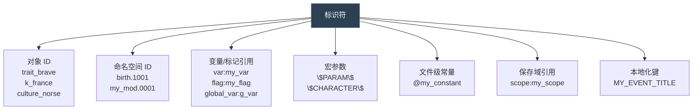
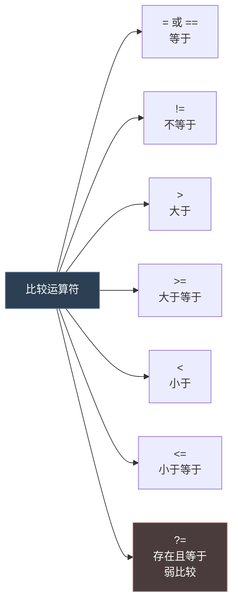
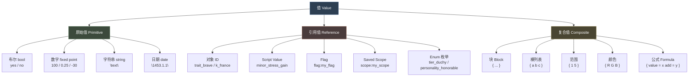
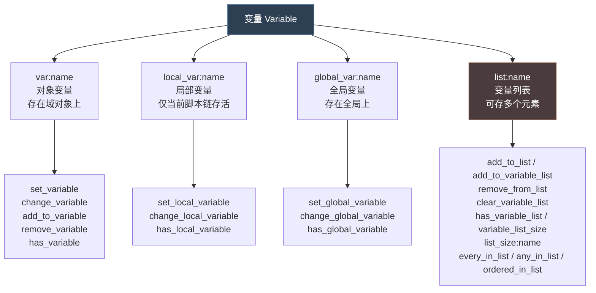
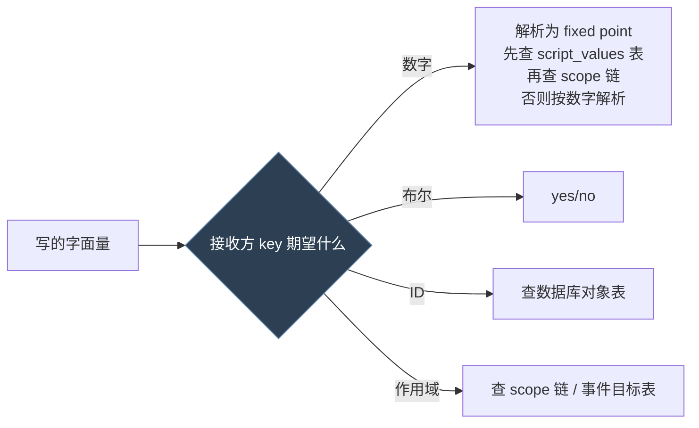
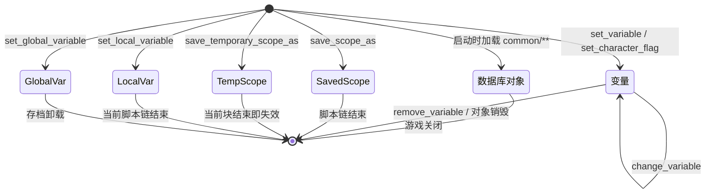

# 01 词法、数据类型与值系统

> P 语言的"字母表与词汇"：文件怎么写、值有哪些种类、值存在哪里、生命周期多长。

## 本篇导读

本篇由两部分组成：

- **第一部 词法与基础语法** —— 文件编码、注释、标识符、字面量、运算符、块与列表、`@` 常量、`$PARAM$` 宏。学完能"读懂"任何 P 语言脚本。
- **第二部 数据类型与值系统** —— 值的分类（原始 / 引用 / 复合）、变量四族（`var` / `local_var` / `global_var` / `list`）、Flag、保存域值，以及各类值的生命周期。

**为什么合并**：词法决定"怎么写"，值系统决定"写的是什么"。二者构成阅读脚本的最小知识集，分开看容易割裂。

## 文档关联

- **前置**：[00 总览与文档地图](00-总览与文档地图.md)
- **核心延伸**：[02 作用域 Scope 体系](02-作用域Scope体系.md) —— 值必须挂在某个域上才有意义
- **应用延伸**：[04 修饰符与数值计算](04-修饰符与数值计算.md)、[05 脚本复用机制](05-脚本复用机制.md)

## 目录

| 部 | 章节 |
|---|---|
| 第一部 词法与基础语法 | 编码与扩展名 · 注释 · 标识符 · Key-Value · 字面量 · 运算符 · 块 · 列表 · `@` 常量 · `$PARAM$` · 语法糖 · 完整语法结构图 |
| 第二部 数据类型与值系统 | 类型系统总览 · 原始值 · 引用值 · 变量系统 · 脚本值 · 保存的值作用域 · 类型转换 · 值生命周期 |

---

# 第一部 词法与基础语法

> 本文覆盖：文件编码、注释、标识符、字面量、赋值、运算符、块、列表。

---

## 1. 文件编码与扩展名

| 类型 | 扩展名 | 编码要求 | 说明 |
|---|---|---|---|
| 脚本文件 | `.txt` | **UTF-8 with BOM** | 无 BOM 会导致非 ASCII 字符乱码 |
| 本地化 | `.yml` | **UTF-8 with BOM** | 同上，这是最常见的失效原因 |
| 语法说明 | `.info` | 任意 | 官方自带的纯文本说明文档 |
| GUI 布局 | `.gui` | UTF-8 | 本系列文档不涉及 |

实测证据（`game/localization/english/editor_l_english.yml`，文件 44 字节，可见文本 41 字节，差 3 字节即 `EF BB BF`）。

> **重要**：`common/landed_titles/00_landed_titles.txt` 第 1 行开头就有 BOM（`\ufeff@correct_culture_primary_score = 100`），说明原版脚本文件同样带 BOM。

---

## 2. 注释

P 语言只有**行注释**，没有块注释。

```paradox
# 这是注释
#每行都要单独写 #

	# 缩进的注释也是合法的
gold = 100	# 行尾注释

## 双井号只是书写习惯，不是语法
```

大量原版文件用注释做**事件编号登记表**（`game/events/birth_events.txt` 第 11-18 行）：

```paradox
# 0001 - Selects visible birth event based on bastard status and complication rolls
# 0002 - Reward event for mother who've had many children
# 1001 - BIRTH: Mother: regular birth
# 1002 - BIRTH: Mother: child secretly a bastard
```

---

## 3. 标识符（Identifier）

标识符是脚本里所有"名字"的总称：对象 ID、脚本效果名、参数名、变量名、本地化键。

**字符集**：字母、数字、下划线 `_`、点 `.`、冒号 `:`、美元符 `$`、艾特符 `@`。



### 3.1 命名约定（强烈建议遵守）

| 前缀/后缀 | 用途 | 示例 |
|---|---|---|
| `has_` / `is_` / `can_` | 触发器（Trigger） | `is_adult`、`has_trait`、`can_marry` |
| `add_` / `set_` / `remove_` / `change_` | 效果（Effect） | `add_gold`、`set_variable` |
| `_trigger` | 脚本触发器 | `can_set_relation_friend_trigger` |
| `_effect` | 脚本效果 | `increment_variable_effect` |
| `_value` | 脚本值 | `minor_stress_gain`、`highest_skill_value` |
| `_modifier` | 修饰符 | `mothered_many_children_modifier` |
| `_on_action` | 动作钩子 | `on_birthday`、`on_specific_birthday` |
| `k_` / `d_` / `c_` / `b_` / `e_` / `h_` | 头衔层级（帝国/王国/公国/伯爵/男爵/霸权） | `k_france`、`c_roma` |

### 3.2 命名空间 ID

事件 ID 采用 `namespace.number` 形式。每个事件文件顶部必须先声明 `namespace`：

```paradox
namespace = birth

birth.1001 = { ... }
birth.1002 = { ... }
```

> 出处：`game/events/_events.info` 第 5-8 行
> ```
> Event IDs are namespaced. In each events file, define a namespace once at the top:
>    namespace = my_events
> Then define events as:
>    my_events.1001 = { ... }
> ```

---

## 4. 基本结构：Key-Value

P 语言只有**一种**基本结构：`key = value`。

```mermaid
graph LR
    A["key"] --> B["="]
    B --> C["value"]

    C --> C1["标量<br/>100 / yes / \"text\" / trait_brave"]
    C --> C2["块<br/>{ ... }"]
    C --> C3["裸列表<br/>{ 1 2 3 }"]
    C --> C4["比较<br/>&gt;= 50"]
    C --> C5["范围<br/>{ 1 5 }"]

    style A fill:#3c4a3c,stroke:#6b8f6b,color:#fff
    style C fill:#2d3f52,stroke:#5b7fa6,color:#fff
```

```paradox
# 标量赋值
gold = 100
female = yes
name = "Charlie"
is_shown = { is_adult = yes }

# 块赋值（最常见的嵌套）
father = {
	is_adult = yes
	has_trait = brave
}

# 比较赋值（无 '='，用比较运算符）
gold >= 50
age <= 16
```

### 4.1 等号两侧的空格

空格**不敏感**但**强烈建议保留**：

```paradox
gold=100      # 合法但不推荐
gold = 100    # 推荐
gold  =  100  # 合法
```

### 4.2 缩进

缩进**完全不敏感**（不像 Python）。原版统一使用 **Tab 制表符**，一个 Tab = 一层嵌套。

```paradox
if = {
	limit = {
		is_adult = yes
	}
	add_gold = 100
}
```

> **Mod 建议**：与官方保持一致用 Tab；团队的 `for_the_realm` 项目亦为 Tab 缩进。

---

## 5. 字面量（Literal）

### 5.1 布尔值

```paradox
yes / no       # 标准写法
true / false   # 部分上下文也可用
```

### 5.2 数字

P 语言内数字统一为 **定点数（fixed point）**，引擎内部以 `1/1000` 为精度单位，但脚本层直接写十进制。

```paradox
100          # 整数
-30          # 负数
0.25         # 小数
0.001        # 精度下限附近
1.242        # fixed_range 可产出
```

### 5.3 字符串

```paradox
name = "Charlie"
texture = "gfx/interface/icons/icon.dds"
END_DATE = "1453.1.1"
```

- 必须用**双引号**
- 支持转义 `\"`（在本地化里有时需要双反斜杠 `\\"` 才能通过校验钩子）
- **引用对象 ID 时不加引号**：`has_trait = brave`（不是 `"brave"`）

### 5.4 范围（Range）

两个数组成的裸列表，表示随机区间：

```paradox
add_gold = { 1 5 }               # 随机 1~5 金币
add_trait_xp = { value = { 5 50 } }
GENERATED_POOL_CHARACTERS = { 2 6 }
delay = { months = { 6 12 } }    # 出处: on_action/_on_actions.info
```

范围里**不能**内联公式（`{ { value = 1 add = 2 } some_named_value }` 非法），需要改用 `fixed_range` / `integer_range`。

### 5.5 颜色

RGB 三元组裸列表：

```paradox
color = { 167 10 0 }        # 出处: common/landed_titles/00_landed_titles.txt
color = { 255 110 0 }
hair = { 0.592 0.314 0.176 }  # 出处: history/_characters.info
```

### 5.6 日期

```paradox
END_DATE = "1453.1.1"     # 字符串形式，格式 年.月.日
```

---

## 6. 运算符

### 6.1 比较运算符（用于 Trigger）



```paradox
gold >= 50
age <= 16
faith = catholic
this != scope:mother
scope:contest_summary_1 ?= this     # 出处: scripted_effects/04_dlc_ep2_tournament_effects.txt
```

> `?=` 是**弱比较**：当左侧不存在（no scope）时返回 false 而不是报错，等价于 `exists = X` 与 `X = Y` 的合体。这是避免"无效作用域"报错的重要工具。

### 6.2 赋值运算符（用于 Effect）

只有 `=`。P 语言**没有** `+=` `-=` `*=` 这类复合赋值。

```paradox
add_gold = 100                    # 加
remove_gold = 100                 # 减（或 add_gold = -100）
set_variable = { name = x value = 5 }
change_variable = { name = x add = 5 }
```

### 6.3 算术运算符

**在语法层没有 `+ - * /`**。算术通过以下三种途径完成：

| 途径 | 语法 | 场景 |
|---|---|---|
| 专用效果键 | `add` / `multiply` / `divide` / `subtract` / `modulo` | script value、变量操作 |
| 修正链 | `add` / `factor` / `mult` | `random` 权重、`ai_chance` |
| 数学块 | `{ value = ... add = ... }` | 内联公式 |

```paradox
# script value 里的算术（出处: common/script_values/_script_values.info）
my_value = {
	value = 10
	add = 5
	multiply = 4
	max = 10
	add = 5
	round = yes
}

# 变量操作
change_variable = { name = house_feud_house_1_score add = house_feud_medium_counter_value }

# 权重修正（出处: events/_events.info）
ai_chance = {
	base = 10
	modifier = { add = 5   <trigger> }
	modifier = { factor = 0.5  <trigger> }
}
```

---

## 7. 块（Block）

块是 `key = { ... }`，承载嵌套数据结构。**块内可放任意条 key-value**。

```paradox
h_roman_empire = {                    # 出处: common/landed_titles/00_landed_titles.txt
	color = { 167 10 0 }
	capital = c_roma
	definite_form = yes
	can_be_named_after_dynasty = no

	can_create = {
		rule_title_creation_imperial_power_projection_title_creation_trigger = yes
	}
}
```

### 7.1 块的重复键

同一个键可以在一个块里出现多次，语义取决于具体上下文：

| 上下文 | 语义 |
|---|---|
| `modifier = {}` 内 | 全部生效（累加） |
| `triggered_desc = {}` | 多个并列，每条独立判定 |
| `if / else_if / else` | 分支 |
| 普通数据库对象 | 后者覆盖前者 |

### 7.2 空块

```paradox
can_destroy = {
}    # 出处: landed_titles/00_landed_titles.txt (h_dar_al_islam)
```

---

## 8. 列表（List / Array）

### 8.1 裸列表（无 key）

```paradox
GAME_SPEED_TICKS = {    # 出处: common/defines/00_defines.txt
	2
	1
	0.5
	0.2
	0.0
}

BENCHMARK_WAYPOINTS = {
	700 3000 2 5
	1000 2500 7 5
}
```

### 8.2 有序列表（带 key 的重复项）

```paradox
random_events = {    # 出处: on_action/_on_actions.info
	100 = event_id_1
	200 = event_id_2
	100 = 0
}
```

### 8.3 加权列表 `random_list`

```paradox
random_list = {    # 出处: scripted_effects/07_dlc_ep3_scripted_effects.txt
	20 = {
		trigger = {
			NOT = { exists = scope:governance_option_b }
		}
		save_scope_value_as = {
			name = governance_option_b
			value = yes
		}
	}
	10 = { ... }
}
```

---

## 9. `@` 文件级常量

在文件顶层用 `@name = value` 定义**全局常量**，供全脚本引用。

```paradox
# 出处: common/landed_titles/00_landed_titles.txt 第 1-4 行
@correct_culture_primary_score = 100
@better_than_the_alternatives_score = 50
@always_primary_score = 1000
@never_primary_score = -1000
```

引用时**不带** `@`：

```paradox
some_score = correct_culture_primary_score
```

> 这是 P 语言里最接近"常量定义"的机制，常用于 `landed_titles` 的文化评分权重。

---

## 10. `$PARAM$` 宏参数

`$大写名$` 是**纯文本宏替换**，不是变量。在调用 scripted_trigger / scripted_effect 时，调用方传的值会被**原样文本替换**进被调方的定义体。

```paradox
# 定义（出处: common/scripted_effects/00_debug_and_shortcut_effects.txt）
increment_variable_effect = {
	if = {
		limit = { NOT = { exists = var:$VAR$ } }
		set_variable = { name = $VAR$  value = $VAL$ }
	}
	else = {
		change_variable = { name = $VAR$  add = $VAL$ }
	}
}

# 调用
increment_variable_effect = { VAR = my_counter  VAL = 1 }
```

参数甚至可以拼进标识符中间：

```paradox
# 出处: common/scripted_effects/00_debug_and_shortcut_effects.txt
log_debug_variable_for_persian_struggle_effect = {
	increment_global_variable_effect = {
		VAR = sp_$VAR$      # 拼接 -> sp_my_counter
		VAL = 1
	}
}
```

详见 [05-脚本复用机制](05-脚本复用机制.md)。

---

## 11. 语法糖与省略形式

| 完整写法 | 简写 | 说明 |
|---|---|---|
| `some_scripted_trigger = yes` | — | 无参调用必须写 `yes` |
| `some_scripted_trigger = { A = 1 }` | — | 带参调用 |
| `NOT = { X = yes }` | — | 取反 |
| `AND = { ... }` | 并列写 | **块内多条件默认就是 AND** |
| `trigger = { ... }` | 裸条件 | 部分上下文可直接写条件 |

### 11.1 默认 AND

这是新手最需要记住的语义：

```paradox
trigger = {
	is_adult = yes      # ┐
	gold >= 50          # ├─ 三者默认 AND
	has_trait = brave   # ┘
}
```

等价于：

```paradox
trigger = {
	AND = {
		is_adult = yes
		gold >= 50
		has_trait = brave
	}
}
```

---

## 12. 完整语法结构图

```mermaid
graph TD
    FILE["脚本文件 *.txt"] --> STMT["语句序列"]

    STMT --> KV["key = value"]
    STMT --> CMP["key OP value<br/>OP ∈ = != &gt; &gt;= &lt; &lt;= ?="]
    STMT --> CONST["@constant = value"]
    STMT --> NS["namespace = name"]

    KV --> V1["标量<br/>number / yes|no / \"string\" / id"]
    KV --> V2["块 { }"]
    KV --> V3["裸列表 { v1 v2 v3 }"]

    V2 --> S1["子语句序列<br/>递归"]
    S1 --> KV

    V3 --> L1["数字列表"]
    V3 --> L2["ID 列表"]
    V3 --> L3["范围 { min max }"]
    V3 --> L4["颜色 { R G B }"]

    style FILE fill:#2d3f52,stroke:#5b7fa6,color:#fff
    style KV fill:#3c4a3c,stroke:#6b8f6b,color:#fff
    style V2 fill:#4a3c3c,stroke:#a6705b,color:#fff
```

---

## 13. 语法速记卡

```paradox
# ───────── 文件骨架 ─────────
# 注释
@CONSTANT = 100              # 文件级常量

object_id = {                # 数据库对象
	key = scalar
	nested_block = {
		key = yes
	}
	bare_list = { 1 2 3 }
	range = { 1 5 }
	color = { 255 0 0 }
	trigger = {
		gold >= 50         # 默认 AND
		OR = { a = yes  b = yes }
		NOT = { c = yes }
	}
	effect = {
		if = {
			limit = { is_adult = yes }
			add_gold = 100
		}
	}
}
```

---

# 第二部 数据类型与值系统

> 本文覆盖：P 语言能表达哪些"值"，以及值是怎么被存储、引用和计算的。

---

## 1. 类型系统总览

P 语言是**弱类型、动态解析**的。同一个 `key` 能接受什么值，完全由**引擎侧该 key 的注册定义**决定，脚本层没有类型声明。



---

## 2. 原始值

### 2.1 布尔 `bool`

```paradox
female = yes
is_shown = { is_adult = yes }
hidden = no
```

### 2.2 数字 `fixed point`

引擎内部用 **CFixedPoint**，以 `1/1000` 为最小单位。脚本层写十进制即可。

```paradox
gold = 100
tax_mult = 0.25
county_opinion_add = -30
probability = 0.001
```

> 精度提示：小于 `0.001` 的值会被截断为 0。做概率乘法时注意别出现 `0.001 * 0.5` 这种。

### 2.3 字符串 `string`

```paradox
name = "Charlie"
reference = "gfx/interface/event_pictures/feast.dds"
END_DATE = "1453.1.1"
```

### 2.4 日期 `date`

两种出现位置：

| 场景 | 语法 | 出处 |
|---|---|---|
| defines 里的常量 | `END_DATE = "1453.1.1"` | `common/defines/00_defines.txt` |
| history 里的时间轴键名 | `867.1.1 = { ... }` | `history/_history.info` |
| 延迟/冷却 | `cooldown = { days/weeks/months/years = X }` | `events/_events.info` |

---

## 3. 引用值

### 3.1 对象 ID 引用

几乎所有"指向某个数据库对象"的地方都写**裸 ID，不加引号**：

```paradox
has_trait = brave
capital = c_roma
faith = catholic
memory_type = ascended_throne_memory
animation = personality_honorable
```

### 3.2 Script Value 引用

Script Value 定义在 `common/script_values/*.txt`，引用时写名字（**可与数字互换**）：

```paradox
# 定义（出处: common/script_values/_script_values.info）
minor_stress_gain = 10

# 使用
add_stress = minor_stress_gain
```

详见 [04-修饰符与数值计算](04-修饰符与数值计算.md)。

### 3.3 Flag 标记 `flag:`

Flag 是挂在**作用域对象**上的自定义**布尔标记**（比变量轻量）。

```paradox
has_character_flag = bastard_pregnancy
has_character_flag = pregnancy_real_father_of_bastard_is_known_flag
set_character_flag = my_custom_flag
clr_character_flag = my_custom_flag
```

Flag 还能作为**值**存进变量，用于 `switch` 分支：

```paradox
# 出处: common/scripted_effects/01_dlc_fp3_scripted_effects.txt:1363
switch = {
	trigger = root.var:skill_to_increase
	flag:stewardship = { add_stewardship_skill = 1 }
	flag:intrigue    = { add_intrigue_skill = 1 }
	flag:diplomacy   = { add_diplomacy_skill = 1 }
}

# 把 flag 存进变量（出处: scripted_effects/01_exp1_historical_artifacts_creation_effect.txt）
save_scope_value_as = { name = christian_relic_name  value = flag:nail }
set_variable = { name = war_cb  value = flag:war_memory_cb_liberty }
```

### 3.4 Saved Scope 引用 `scope:`

见 [02-作用域体系](02-作用域Scope体系.md)。

### 3.5 Enum 枚举值

由引擎注册的固定字面量集合，常见：

| 枚举族 | 取值示例 |
|---|---|
| 头衔层级 | `tier_barony` `tier_county` `tier_duchy` `tier_kingdom` `tier_empire` `tier_hegemony` |
| 事件类型 | `character_event` `letter_event` `court_event` `activity_event` |
| 动画 | `personality_honorable` 等（见 `common/scripted_animations`） |
| 时间单位 | `days` `weeks` `months` `years` |

```paradox
highest_held_title_tier >= tier_duchy
type = character_event
delay = { months = { 6 12 } }
```

---

## 4. 变量系统（Variable）

变量是挂在**作用域对象**上的自定义**数值存储**。这是 P 语言里唯一接近"程序变量"的东西。



### 4.1 变量操作语法

```paradox
# 出处: common/scripted_effects/00_debug_and_shortcut_effects.txt
set_variable = { name = $VAR$  value = $VAL$ }
change_variable = { name = $VAR$  add = $VAL$ }
remove_variable = $VAR$

# 出处: common/scripted_effects/07_dlc_ep3_scripted_effects.txt:2937
change_local_variable = { name = current_value  add = 1 }

# 出处: common/scripted_effects/03_dlc_fp2_scripted_effects.txt:86
set_variable = fp2_struggle_hostility_flag   # 单参简写 = 设置为 1 / 标记存在
```

### 4.2 变量作为值读取

在 Trigger / Script Value 里用 `var:name` 读：

```paradox
# 出处: common/scripted_effects/07_dlc_ep3_scripted_effects.txt:2931
local_var:current_value < list_size:num_of_contracts_after

# 出处: common/scripted_effects/04_dlc_ep2_tournament_effects.txt:1747
switch = {
	trigger = var:contest_versus_progress
	0 = { ... }
	1 = { ... }
	2 = { ... }
}

# 出处: common/scripted_effects/03_bp1_scripted_effects.txt:3563
var:tournament_wager_target = { exists = var:contest_aptitude }
```

### 4.3 变量列表（List）

> ⚠ **易错点：P 语言里「列表」有两种，遍历取值与取大小的字段都完全不同！**
>
> | 类型 | 创建/维护 | 遍历取值字段 | 成员判断 | 成员移除 | 判断存在 | 大小取值字段 | 例 |
> |---|---|---|---|---|---|---|---|
> | **作用域内临时 list**（一个作用域内临时定义，随脚本链存活） | `add_to_list = 名字` | `list = 名字` | `is_in_list = 名字` | `remove_from_list = 名字` | — | `list_size:名字` | 事件里临时攒角色 |
> | **角色/作用域附属的变量列表（variable list）**（作为对象的附属变量持久保存） | `add_to_variable_list = { name = 名字 target = X }` / `clear_variable_list` | `variable = 名字` | `is_target_in_variable_list = { name = 名字 target = X }` | `remove_list_variable = { name = 名字 target = X }` | `has_variable_list = 名字` | `variable_list_size = { name = 名字 value … }` | 记在某个角色身上的名单 |
>
> **两者不可混用**：
> - 遍历：对 variable list 用 `list =`、或对临时 list 用 `variable =`，都会读不到数据。
> - 成员判断/移除：临时 list 用 `is_in_list` / `remove_from_list`；**variable list 用 `is_target_in_variable_list` / `remove_list_variable`（都带 name+target）**。
> - 取大小：临时 list 用 `list_size:X`；**variable list 用 `variable_list_size`（trigger 块）**。原版从不用 `list_size:X` 读 variable list（tour / accolade 等全部用 `variable_list_size`；本地 list 用 `list_size`，如 `num_of_contracts_*` / `defender_valuable_prisoners_list`）。
> - 数值计数：需要「把 variable list 成员数作为数字」时（script value / set_variable / tooltip 文本），先 `has_variable_list` 保护，再用 `every_in_list = { variable = 名字 add = 1 }` 累加（见 document/04 §5.4）。

```paradox
# ── 类型 A：作用域内临时 list（遍历用 list = 名字）──
# 出处: common/scripted_effects/03_dlc_fp2_scripted_effects.txt:246 / :507-520
every_in_de_jure_hierarchy = {
	limit = { fp2_struggle_compromise_transfer_duchy_trigger = yes }
	add_to_list = transferred_duchies
}
while = {
	limit = {
		any_in_list = {
			list = fp2_struggle_compromise_truce_list
			NOT = { has_variable = fp2_struggle_compromise_flag }
		}
	}
	ordered_in_list = {
		list = fp2_struggle_compromise_truce_list
		limit = { NOT = { has_variable = fp2_struggle_compromise_flag } }
		order_by = realm_size
		save_scope_as = realm_scope
	}
}

# ── 类型 B：角色/对象附属的变量列表（遍历用 variable = 名字）──
# 出处: common/scripted_effects/00_accolades_scripted_effects.txt:4747 与
#       common/scripted_triggers/04_ep2_accolade_triggers.txt:1330
# 先写入某个对象的 variable list（对象 = 当前域，如 accolade / 角色）
scope:accolade = {
	add_to_variable_list = {
		name = accolade_squire_chars
		target = scope:squire
	}
	# 之后在**持有该列表的对象域内**读取（注意是 variable =，不是 list =）
	has_variable_list = accolade_squire_chars          # 存在性判断
	any_in_list = {
		variable = accolade_squire_chars
		this = scope:squire_temp
	}
	clear_variable_list = accolade_squire_chars
}

# 全局列表（第三种，另见 variable_list_size 判断大小）
any_in_global_list = { variable = fp2_struggle_ending_culture_list  ... }
ordered_in_global_list = { variable = fp2_struggle_ending_culture_list  order_by = culture_number_of_counties  ... }

# 列表大小（出处: scripted_effects/tgp_imperial_examination_scripted_effects.txt:863）
variable_list_size = { name = imperial_examiners_list  value < examiners_amount }
```

> 注：本项目 `ftr_court_claimants` / `ftr_court_supporters` / `ftr_court_participant_list` 等属于**类型 B**（作为角色的附属变量列表，写入用 `add_to_variable_list`、清空用 `clear_variable_list`），遍历时应写 `variable = 名字`。写代码时注意核对调用处用的是 `list =` 还是 `variable =`，二者对应的是不同类型，混用会导致读不到数据。
> 判断归属的快捷方法：凡用 `add_to_variable_list` / `clear_variable_list` / `has_variable_list` 维护的，都是类型 B；凡只是临时用 `add_to_list` 攒完即丢的，是类型 A。
>
> 若需在 script value / 数值上下文里得到 variable list 的元素个数：**不要裸用 `list_size:X`**（原版从不对 variable list 这么用），先 `has_variable_list` 保护，再用 `every_in_list = { variable = 名字 add = 1 }` 累加计数。

### 4.4 变量 vs Flag 的选择

| | Variable | Flag |
|---|---|---|
| 存数值 | 是 | 否 |
| 存布尔 | 是（0/1） | 是（推荐） |
| 参与算术 | 是 | 否（只能做 switch 分支键） |
| 显示到 UI | 需要配置 | 需要配置 |

---

## 5. 脚本值（Script Value）

Script Value 是"**可命名的数值或数值公式**"，详见 [04-修饰符与数值计算](04-修饰符与数值计算.md)。此处只列出它作为一种"值"的引用形态：

```paradox
add_gold = minor_gold_value            # 静态命名值
add_stress = { value = 10 multiply = 2 }  # 内联公式
add_gold = { 1 5 }                     # 范围
add_gold = { every_child = { add = 1 } }   # 列表聚合
```

---

## 6. 保存的值作用域 `save_scope_value_as`

把**数字或 flag** 存成一个 `scope:name`，之后可以像作用域一样引用：

```paradox
# 出处: common/scripted_effects/00_task_contract_scripted_effects.txt:16
save_scope_value_as = {
	name = task_contract_tier
	value = task_contract_tier
}

# 出处: common/scripted_effects/07_dlc_ep3_scripted_effects.txt:9972
save_scope_value_as = {
	name = current_provisions_max_value_scope
	value = scope:actor.domicile.provisions
}
```

用途：在 `ordered_*` 迭代中把排序键保存下来供后续比较，或把计算结果"固化"成作用域值。

---

## 7. 类型转换与隐式解析

P 语言**没有显式类型转换**。值的解释取决于接收方 key：



**关键陷阱**：由于"数字位置先查 script value 名，再查 scope 链属性"，下面这行的 `gold` 不是变量名而是当前域的金币属性：

```paradox
add_gold = gold        # 把自己当前的金币数，加给自己（即翻倍）
```

同理 `age`、`prowess`、`dread`、`stress` 等同名。

---

## 8. 值的生命周期



| 值种类 | 生命周期 | 跨事件 | 存档 |
|---|---|---|---|
| 数据库对象 | 整个游戏会话 | — | 否（定义来自文件） |
| `var:` 对象变量 | 对象存活期 | 是 | 是 |
| `global_var:` | 存档期 | 是 | 是 |
| `local_var:` | 当前脚本链 | 否 | 否 |
| `scope:` 保存域 | 当前脚本链 | 否 | 否 |
| 临时域 | 当前块 | 否 | 否 |
| `flag:` | 对象存活期 | 是 | 是 |

---

## 9. 值系统速查

```paradox
# ── 原始 ──
yes / no                          # 布尔
100 / -30 / 0.25                  # 数字
"some string"                     # 字符串
"1453.1.1"                        # 日期

# ── 引用 ──
brave                             # 数据库对象 ID
minor_stress_gain                 # Script Value
tier_duchy                        # 枚举
scope:my_scope                    # 保存域
flag:my_flag                      # 标记（作为值）
var:my_var                        # 变量（作为值）
global_var:my_gvar                # 全局变量
local_var:my_lvar                 # 局部变量
list:my_list                      # 变量列表
list_size:my_list                 # 列表大小（数值）

# ── 复合 ──
{ 1 2 3 }                         # 裸列表
{ 1 5 }                           # 范围
{ 255 0 0 }                       # 颜色
{ value = 10  add = 5  round = yes }   # 公式
{ every_child = { add = 1 } }     # 列表聚合公式
```
