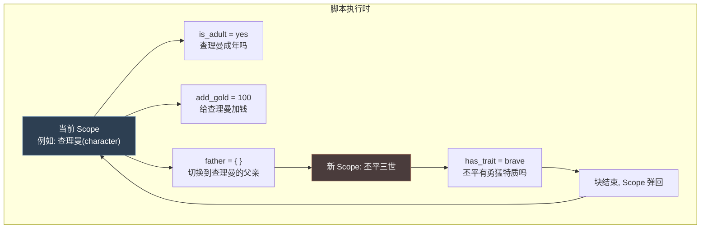
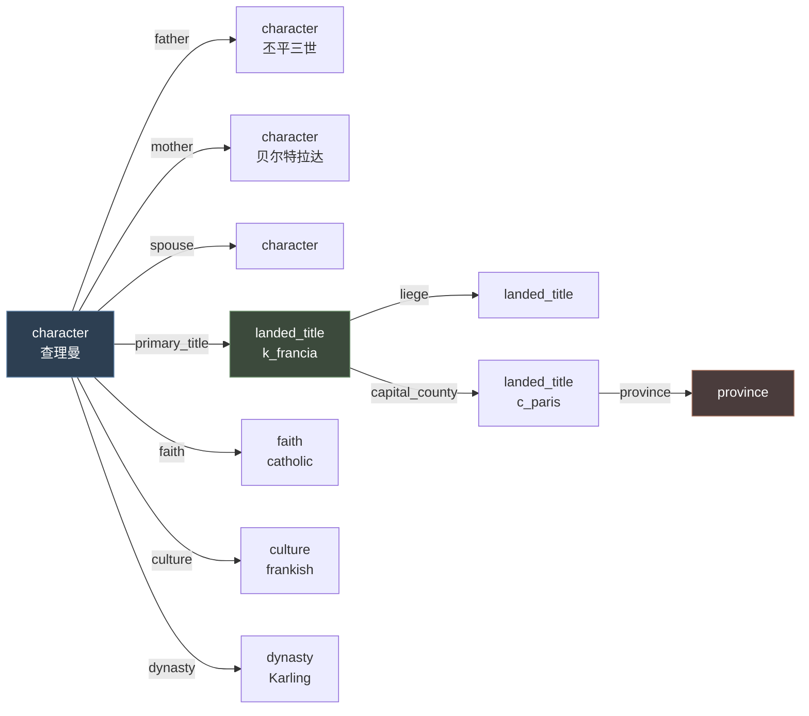
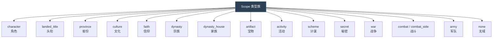
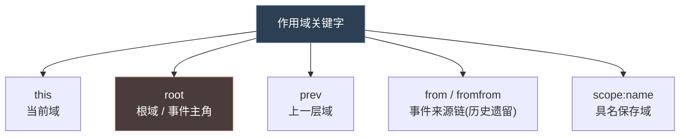
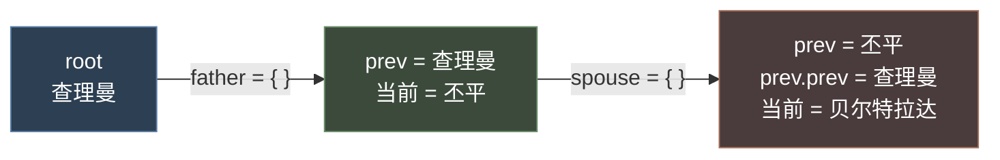
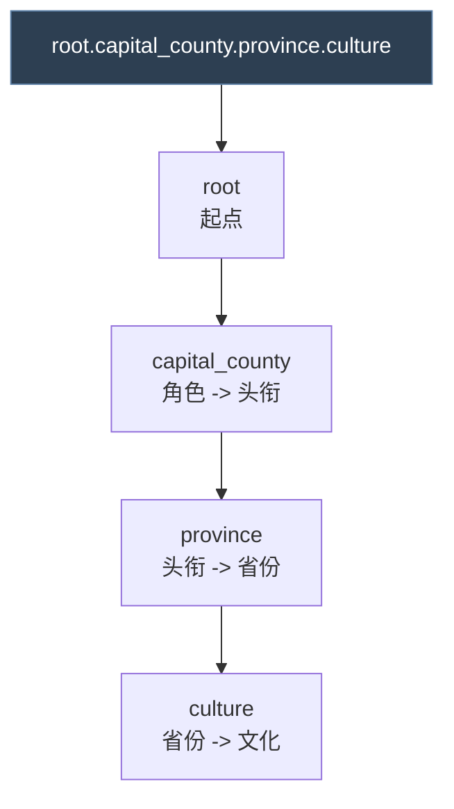
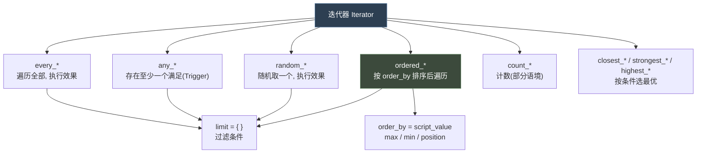
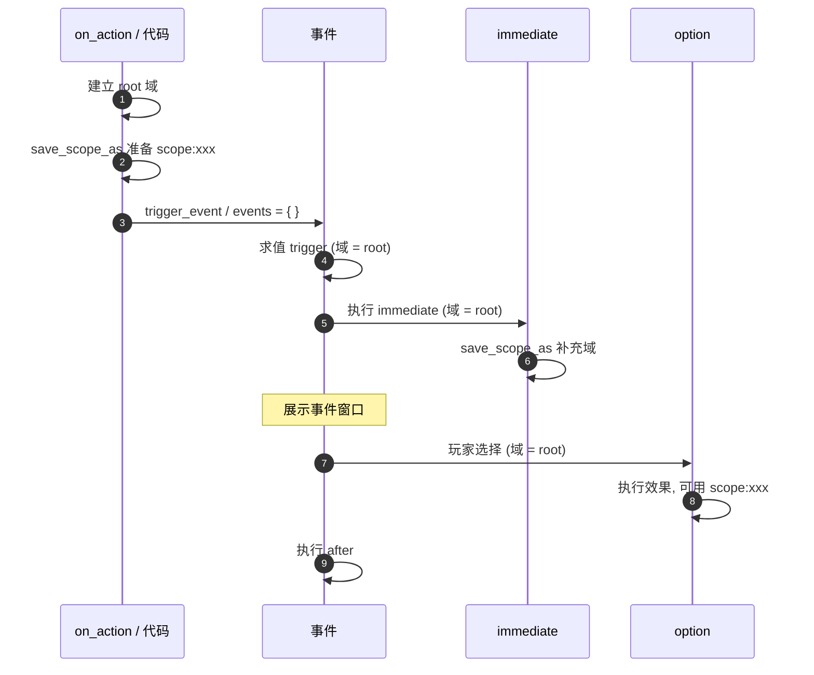
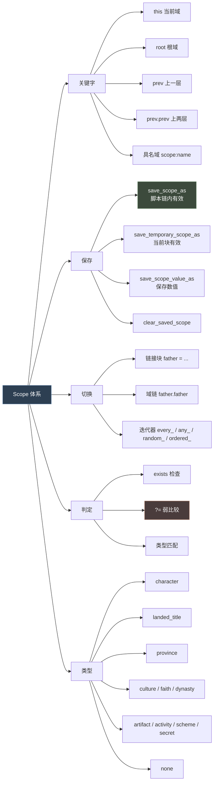

# 02 作用域体系（Scope）

> **P 语言最核心、也是最难的概念。** 一旦理解 Scope，Trigger 与 Effect 就只是"挂在当前 Scope 上的判断 / 动作"。

## 本篇导读

Scope 回答一个问题：**脚本此刻"正在谈论"哪个游戏对象？**

P 语言没有传统编程语言的变量作用域，取而代之的是引擎维护的"当前对象"指针，以及由**事件目标（Event Target）**连接成的**域链**。本文覆盖：

1. Scope 的本质与对象图
2. 作用域类型（`character` / `landed_title` / `province` / …）
3. 关键关键字：`this` / `root` / `prev` / `scope:name`
4. 域链书写规则与四种迭代器
5. 存在性检查与 `?=` 弱比较
6. 事件的 Scope 语义（含 on_action 域链隔离陷阱）

## 文档关联

- **前置**：[01 词法、数据类型与值系统](01-词法、数据类型与值系统.md)
- **直接应用**：[03 触发器与效果](03-触发器与效果.md) —— 所有条件与动作都依托 Scope
- **系统落地**：[08 角色交互与决议](08-角色交互与决议.md)（五域模型）、[12 活动与战争](12-活动与战争.md)（活动专属域）

---


> **这是 P 语言最核心、也是最难的概念。**
> 一旦理解 Scope，Trigger 和 Effect 就只是"挂在当前 Scope 上的判断/动作"而已。

---

## 1. 什么是作用域

**Scope = 脚本当前"正在谈论"的那个游戏对象。**

P 语言里没有普通编程语言的"变量作用域"概念。取而代之的是：脚本引擎维护一个"当前对象"指针，所有 Trigger 和 Effect 都默认作用于它。

```paradox
is_adult = yes        # 判断"谁"是成年人？ —— 当前 Scope
add_gold = 100        # 给"谁"加钱？      —— 当前 Scope
```



---

## 2. Scope 的本质：一棵由"事件目标（Event Target）"连接的对象图

游戏世界里的对象（角色、头衔、省份、文化、信仰、军队…）通过**链接（Link）**互相引用。P 语言把这些链接命名为 **Event Target**，用点号 `.` 串联成**域链（Scope Chain）**。



脚本里这样走链：

```paradox
father = {
	# 现在 Scope 是父亲
}

father.father = {
	# 现在 Scope 是祖父
}

primary_title.capital_county.province = {
	# 角色 -> 主头衔 -> 首都伯爵领 -> 省份
}
```

---

## 3. 作用域类型（Scope Type）

每个 Scope 都有**类型**。类型决定了你可以在这个 Scope 上用哪些 Trigger / Effect / 链接。



> 出处：`common/customizable_localization/_custom_loc.info` 第 1-16 行列出了可作为 `type = X` 的域类型：
> `artifact` `character` `landed_title` `province` `activity` `secret` `scheme` `combat` `combat_side` `title_and_vassal_change` `faith` `dynasty` `all`

**类型不匹配是最常见的报错来源**：在 `province` 域上写 `has_trait`（角色专属 Trigger）会报错。

---

## 4. 关键作用域关键字



### 4.1 `this`

指**当前作用域自身**。常用于：
- 把当前域与某个保存域比较
- 把当前域作为参数传递
- 在链接里指回自己

```paradox
# 出处: common/scripted_effects/03_dlc_fp2_scripted_effects.txt:869
this != scope:host

# 出处: common/scripted_triggers/00_relation_triggers.txt
can_set_relation_friend_trigger = {
	NOR = {
		this = $CHARACTER$          # 当前域 == 传入的角色
		has_relation_friend = $CHARACTER$
		...
	}
}

# 出处: game/events/birth_events.txt:657
NOR = {
	this = scope:child              # 这个孩子不是主角本人
	is_twin_of = scope:child
}

# 出处: events/birth_events.txt:607
NAND = {
	exists = root.player_heir
	this = root.player_heir
}
```

### 4.2 `root`

**根作用域** —— 整条脚本链的起点。事件里 `root` 就是事件的接收者（事件窗口的主人）。

```paradox
# 出处: events/birth_events.txt:607
exists = root.player_heir

# 出处: common/scripted_effects/01_dlc_fp3_scripted_effects.txt:1364
switch = { trigger = root.var:skill_to_increase  ... }

# 出处: events/birth_events.txt:214
scope:mother = {
	every_parent = {
		limit = { NOT = { is_parent_of = scope:child } }
	}
}
```

`root` 的确定规则：

| 场景 | root 是谁 |
|---|---|
| `character_event` | 事件接收角色 |
| `letter_event` | 收信人（`sender` 是发信人） |
| `on_action` 由代码调用 | 代码指定的对象 |
| `trigger_event` 从脚本触发 | 触发时的当前域 |
| `yearly_global_pulse` | **无 root**（见 `on_action/_on_actions.info` 第 5 行） |

> 特别注意：`yearly_global_pulse` "Does not have any scopes attached to itself (i.e. there doesn't exist a root)"。

### 4.3 `prev` / `prev.prev`

**上一层作用域**。每次进入嵌套块，Scope 就下潜一层；`prev` 就是回退一格。



```paradox
# 出处: common/scripted_triggers/00_relation_triggers.txt
can_set_relation_lover_trigger = {
	is_adult = yes
	NOR = {
		this = $CHARACTER$
		has_relation_lover = $CHARACTER$
	}
	is_attracted_to_gender_of = $CHARACTER$
	$CHARACTER$ = {
		is_adult = yes
		is_attracted_to_gender_of = prev      # 回到原角色
	}
}
```

### 4.4 `scope:name` —— 具名保存域

用 `save_scope_as` 给当前域起个名字，之后在**当前脚本链内**任意位置用 `scope:name` 引用。

```paradox
# 保存
scope:mother = { save_scope_as = legitimizer }

# 引用
if = {
	limit = { exists = scope:legitimizer }
	scope:legitimizer = {
		trigger_event = birth.2001
	}
}
```

> 出处：`game/events/birth_events.txt` 第 182-211 行

**保存域的三种变体：**

| 效果 | 生命周期 | 用途 |
|---|---|---|
| `save_scope_as = name` | 当前脚本链 | 最常用 |
| `save_temporary_scope_as = name` | **当前块结束即失效** | 只在非常局部使用，避免污染 |
| `save_scope_value_as = { name = x value = N }` | 当前脚本链 | 保存的是**数值**不是对象 |
| `clear_saved_scope = name` | — | 手动清除 |

```paradox
# 出处: events/birth_events.txt:68
scripted_trigger allow_naming_on_birth_of_dynasty_child_trigger = {
	save_temporary_scope_as = naming_dynasty_member
	...
}

# 出处: common/on_action/birthday.txt:41
any_memory = {
	memory_type = ascended_throne_memory
	has_variable = childhood_memory
	save_temporary_scope_as = throne_memory_temp
}
```

---

## 5. 作用域链（Scope Chain）书写规则



规则：

1. 用 **`.`** 连接链接名
2. **每一跳的类型必须匹配**上一跳能产出的链接
3. 链可以作为 `limit`、作为触发器主体、作为效果主体
4. 链可以用在**赋值右侧**取数值

```paradox
# 链作为块（切换作用域）
faith = {
	has_doctrine_parameter = bastards_none
}

# 链作为取值（出处: scripted_effects/07_dlc_ep3_scripted_effects.txt:9962）
scope:actor.domicile.provisions > 0

# 链作为赋值源（出处: scripted_effects/07_dlc_ep3_scripted_effects.txt:9974）
save_scope_value_as = {
	name = current_provisions_max_value_scope
	value = scope:actor.domicile.provisions
}

# 链作为 switch 分支键（出处: scripted_effects/04_dlc_ep2_tournament_effects.txt:2282）
switch = { trigger = scope:activity.var:contest_versus_progress  ... }

# 链 + 参数拼接（出处: scripted_effects/04_dlc_ep2_tournament_effects.txt:2569）
scope:resign_target.var:contest_qualified_match_$CONTEST$ = { save_scope_as = resign_match }
```

---

## 6. 迭代器：批量切换作用域

迭代器（Iterator）同时也是**列表操作符**。它们遍历一组对象，逐个切换 Scope 并执行块内语句。



### 6.1 `every_*` —— 遍历全部

```paradox
# 出处: events/birth_events.txt:215
scope:mother = {
	every_parent = {                    # 遍历母亲的父母（即孩子的祖父母）
		limit = {
			NOT = { is_parent_of = scope:child }
			trigger_if = {
				limit = { scope:child = { tgp_is_in_ceremonial_house_trigger = yes } }
				tgp_is_in_ceremonial_house_trigger = yes
			}
		}
		send_interface_toast = { ... }
	}
}
```

### 6.2 `any_*` —— 存在性判断（Trigger）

```paradox
# 出处: events/birth_events.txt:653
NOT = {
	any_child = {
		even_if_dead = yes
		NOR = {
			this = scope:child
			is_twin_of = scope:child
		}
	}
}

# 出处: events/birth_events.txt:683
any_child = {
	even_if_dead = yes
	count >= 5                      # 数量条件
}

# 出处: events/birth_events.txt:126
any_child = { is_alive = yes  count > 1 }

# 出处: on_action/birthday.txt:35
any_parent = {
	is_playable_character = yes
	highest_held_title_tier >= tier_duchy
	any_memory = {
		memory_type = ascended_throne_memory
		has_variable = childhood_memory
		save_temporary_scope_as = throne_memory_temp
	}
}
```

### 6.3 `random_*` —— 随机取一个

```paradox
# 出处: on_action/birthday.txt:45
random_parent = {
	limit = {
		is_playable_character = yes
		highest_held_title_tier >= tier_duchy
		any_memory = { ... }
	}
	trigger_event = bp2_yearly.4003
}

# 出处: scripted_effects/07_dlc_ep3_scripted_effects.txt:9967
random_maa_regiment = {
	limit = { maa_regiments_valid_to_refill_trigger = yes }
	save_scope_as = maa_scope
}
```

### 6.4 `ordered_*` —— 排序遍历

```paradox
# 出处: scripted_effects/03_dlc_fp2_scripted_effects.txt:79
ordered_in_global_list = {
	variable = fp2_struggle_ending_culture_list
	limit = { NOT = { has_variable = fp2_struggle_hostility_flag } }
	order_by = culture_number_of_counties
	save_scope_as = culture_scope
	set_variable = fp2_struggle_hostility_flag
}

# 出处: scripted_effects/04_dlc_ep2_tournament_effects.txt:2967
ordered_guest_subset_current_phase = {
	name = semi_finalist
	limit = { NOR = { scope:contest_summary_1 ?= this  ... } }
	...
}

# 出处: script_values/_script_values.info:106
add_gold = {
	ordered_child = {
		order_by = age
		max = 3
		add = age
	}
}
```

### 6.5 `even_if_dead` 修饰符

部分迭代器默认只遍历存活对象，加 `even_if_dead = yes` 可包含死者：

```paradox
any_child = {
	even_if_dead = yes
	count >= 5
}
```

---

## 7. 作用域的存在性检查

访问一个不存在的 Scope 会报错。必须先检查：

```paradox
exists = scope:legitimizer          # 标准检查
NOT = { exists = var:$VAR$ }        # 变量存在性
exists = root.player_heir           # 链的存在性

# 出处: events/birth_events.txt:197
if = { limit = { exists = scope:legitimizer }  ... }

# 出处: events/birth_events.txt:80
$CHILD$.host = scope:naming_dynasty_member
```

**弱比较 `?=`**：左侧不存在时返回 false 而不报错：

```paradox
# 出处: scripted_effects/04_dlc_ep2_tournament_effects.txt:2971
NOR = {
	scope:contest_summary_1 ?= this
	scope:contest_summary_2 ?= this
	scope:contest_summary_3 ?= this
}
```

---

## 8. 事件的 Scope 语义



**关键点：**

1. `on_action` 的 `effect = {}` 与它触发的事件**是两条独立的域链**
   > 出处：`common/on_action/_on_actions.info` 第 95 行：
   > "Effects run here create a separate chain than events the on_action fires, so you can for example not manipulate values in the effect, and then reliably access those in an event that was fired at the same time. Scopes or local variables set in the effect here will not carry over to any event fired by the on_action."

   **所以：想在事件里用某个 scope，必须在 on_action 里用 `save_scope_as` 保存（saved scope 会跨链传递），而不是依赖局部变量。**

2. `immediate` 里保存的 scope，在 `option` 里可用
3. `after` 在 option 效果之后执行

---

## 9. 常见 Scope 链接速查

### 9.1 角色 → 角色

| 链接 | 含义 |
|---|---|
| `father` / `mother` | 父 / 母 |
| `real_father` | 生父 |
| `spouse` | 配偶 |
| `liege` | 领主 |
| `primary_heir` / `player_heir` | 主要继承人 / 玩家继承人 |
| `employer` | 雇主（廷臣） |
| `host` | 宫廷主人 |
| `betrothed` | 未婚夫/妻 |

### 9.2 角色 → 其他

| 链接 | 目标类型 | 含义 |
|---|---|---|
| `primary_title` | landed_title | 主头衔 |
| `capital_county` | landed_title | 首都伯爵领 |
| `faith` | faith | 信仰 |
| `culture` | culture | 文化 |
| `dynasty` | dynasty | 宗族 |
| `house` | dynasty_house | 家族 |
| `location` | province | 所在省份 |
| `court_owner` | character | 宫廷拥有者 |
| `domicile` | domicile | 宅邸 |
| `gold` / `age` / `prowess` | **数值**（非域） | 属性 |

### 9.3 头衔 → 其他

| 链接 | 含义 |
|---|---|
| `liege` / `de_jure_liege` | 直属领主 / 法理领主 |
| `holder` | 持有者（角色） |
| `capital_county` | 首都伯爵领 |
| `title_capital_county` | 首府 |
| `province` | 省份 |
| `county` | 所属伯爵领 |

### 9.4 反查列表型链接

| 链接 | 含义 |
|---|---|
| `vassal` / `every_vassal` | 封臣 |
| `child` / `every_child` | 子女 |
| `sibling` / `every_sibling` | 兄弟姐妹 |
| `courtier` / `every_courtier` | 廷臣 |
| `knight` / `every_knight` | 骑士 |
| `in_de_jure_hierarchy` | 法理层级内所有 |
| `in_list` / `in_global_list` | 变量列表内 |

---

## 10. Scope 调试技巧

| 技巧 | 做法 |
|---|---|
| 打印当前域 | `log_scope = yes`（如果有）或用控制台 |
| 检查域有效性 | 先 `exists = scope:xxx` 再使用 |
| 防报错 | 用 `?=` 代替 `=` |
| 排查类型不匹配 | 报错信息会指出期望类型 vs 实际类型 |
| 临时域污染 | 局部用途一律用 `save_temporary_scope_as` |

---

## 11. 思维导图总结


