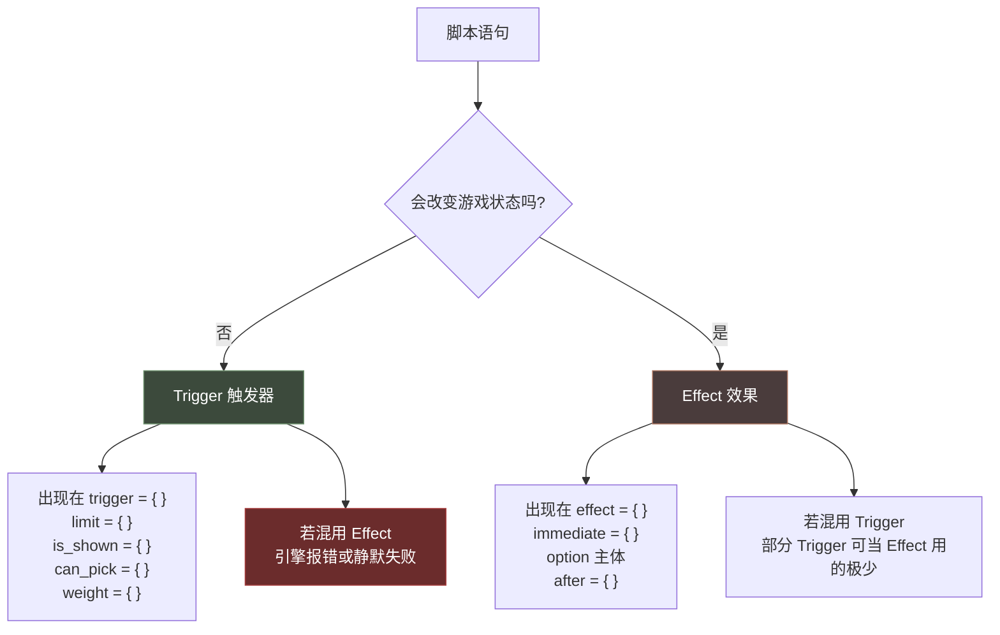
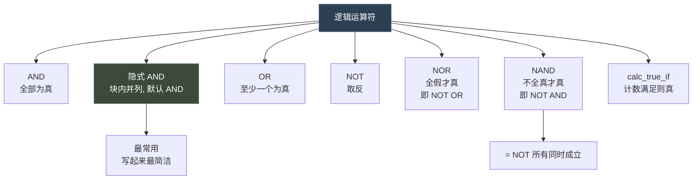
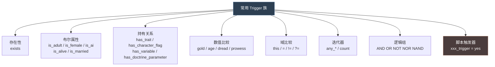
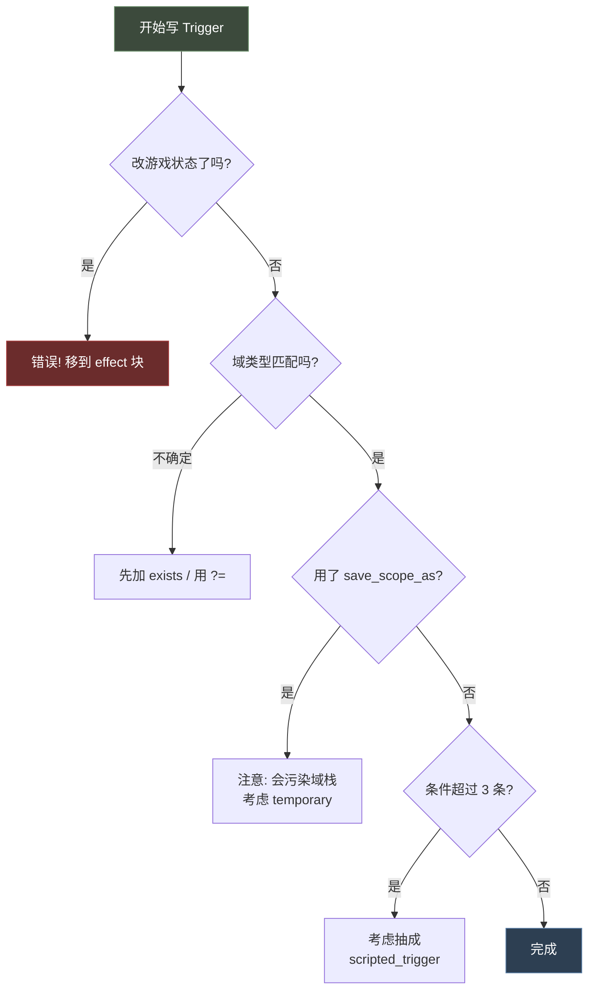
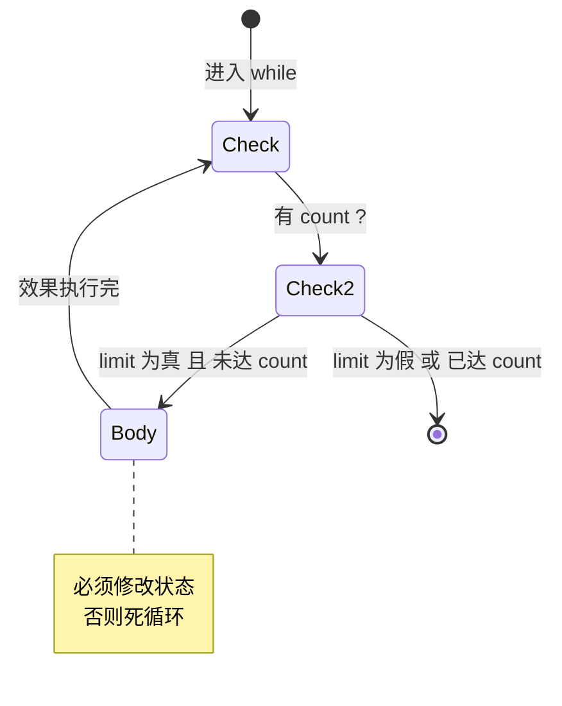
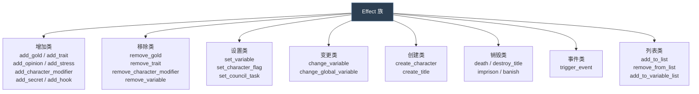
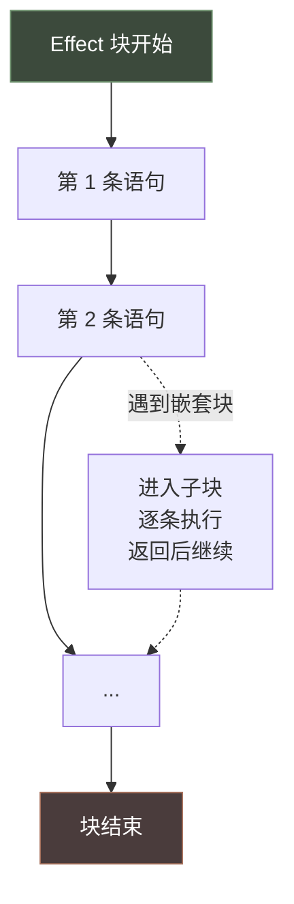
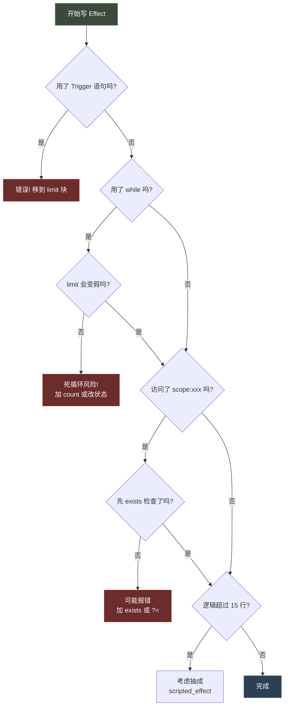

# 03 触发器与效果（Trigger & Effect）

> **Trigger = 只读的条件判断；Effect = 可写的状态修改。** 这是 P 语言唯一的一对"动词"。

## 本篇导读

- **第一部 触发器（Triggers）** —— 逻辑运算符（`AND` / `OR` / `NOT` / `NOR` / `NAND`）、比较类 Trigger、`trigger_if`、计数条件、Trigger 本地化。
- **第二部 效果（Effects）与控制流** —— `if` / `switch` / `while` / `random_list` / `random` / `ai_chance`、迭代器、域操作、UI 与事件调度、执行顺序。

**铁律**：Trigger 块内不能改状态；Effect 块内裸写条件必须包进 `limit = { }`。

**实测结论**（全目录检索）：CK3 **没有** `XOR`、**没有** `repeat` / `break` / `continue`；循环只有 `while` 一种。

## 文档关联

- **前置**：[02 作用域 Scope 体系](02-作用域Scope体系.md)
- **数值延伸**：[04 修饰符与数值计算](04-修饰符与数值计算.md)（权重与 `ai_chance` 计算）
- **调度延伸**：[06 事件系统与 on_action](06-事件系统与on_action.md)

## 目录

| 部 | 章节 |
|---|---|
| 第一部 触发器 | 分界 · 出现位置 · 逻辑运算符 · 比较类 · 常用清单 · `trigger_if` · 脚本触发器 · 本地化 · 检查清单 |
| 第二部 效果与控制流 | 出现位置 · 控制流总览 · 条件分支 · 循环 · 随机选取 · 域操作 · UI 提示 · 事件调度 · 执行顺序 · 速查表 |

---

# 第一部 触发器（Triggers）

> **Trigger = 只读的条件判断，返回真/假。
> 核心铁律：Trigger 内绝对不能修改游戏状态。**

---

## 1. Trigger 与 Effect 的分界



> **唯一的例外**：少量"纯读"语句（如 `save_scope_as`、`save_temporary_scope_as`）在 trigger 上下文里也允许，因为它们不改游戏状态，只改脚本链的 Scope 栈。

---

## 2. Trigger 出现的位置

| 位置 | 上下文 | 作用 |
|---|---|---|
| `event.trigger` | 事件根域 | 事件能否触发 |
| `event.major_trigger` | 事件根域 | 是否为"重大事件" |
| `option.trigger` | 事件根域 | 选项是否可用 |
| `option.show_as_unavailable` | 事件根域 | 选项显示为不可用 |
| `limit = { }` | 任意迭代器/if | 过滤条件 |
| `decision.is_shown` / `can_pick` | 决议 | 显示 / 可点击 |
| `on_action.trigger` | on_action 域 | 钩子是否生效 |
| `weight_multiplier.modifier` | 权重 | 权重修正条件 |
| `scripted_trigger` 定义体 | 定义体 | 复用条件 |

---

## 3. 逻辑运算符



> **实测结论**：原版 `game/common` 全目录检索 `XOR` 命中数为 **0**。CK3 中不存在 `XOR`。

### 3.1 隐式 AND（最常用）

```paradox
trigger = {
	is_adult = yes
	gold >= 50
	has_trait = brave
}
```

### 3.2 AND

```paradox
# 出处: events/birth_events.txt:617
AND = {
	exists = root.player_heir
	this = root.player_heir
}
```

### 3.3 OR

```paradox
# 出处: events/birth_events.txt:170
OR = {
	has_character_flag = bastard_pregnancy
	has_character_flag = unmarried_bastard_pregnancy
}

# 出处: events/birth_events.txt:131
scope:child.father = {
	OR = {
		has_trait = lunatic
		has_trait = possessed
	}
}
```

### 3.4 NOT

```paradox
# 出处: events/birth_events.txt:154
NOT = { has_character_flag = pregnancy_real_father_of_bastard_is_known_flag }

# 出处: events/birth_events.txt:604
scope:child = { NOT = { has_trait = twin } }
```

### 3.5 NOR

```paradox
# 出处: events/birth_events.txt:656
NOR = {
	this = scope:child
	is_twin_of = scope:child
}

# 出处: on_action/birthday.txt:64
NOR = {
	has_trait = strong
	has_trait = weak
	has_trait = physique_bad
}

# 出处: common/scripted_triggers/00_relation_triggers.txt
can_set_relation_friend_trigger = {
	NOR = {
		this = $CHARACTER$
		has_relation_friend = $CHARACTER$
		has_relation_best_friend = $CHARACTER$
		has_relation_rival = $CHARACTER$
		has_relation_nemesis = $CHARACTER$
	}
}
```

### 3.6 NAND

```paradox
# 出处: events/birth_events.txt:605
NAND = {
	exists = root.player_heir
	this = root.player_heir
}
```

### 3.7 运算符嵌套

```paradox
# 出处: events/birth_events.txt:651
triggered_desc = {
	trigger = {
		NOT = {
			any_child = {
				even_if_dead = yes
				NOR = {
					this = scope:child
					is_twin_of = scope:child
				}
			}
		}
		NOT = { has_trait = craven }
	}
	desc = birth.1001.first_birth_good.desc
}
```

---

## 4. 比较类 Trigger

### 4.1 数值比较

```paradox
gold >= 50
age <= 16
dread >= 50
highest_held_title_tier >= tier_duchy
local_var:current_value < list_size:num_of_contracts_after
scope:actor.domicile.provisions > 0
variable_list_size = { name = imperial_examiners_list  value < examiners_amount }
```

### 4.2 作用域比较

```paradox
this = scope:mother                 # 同一对象
this != scope:host                  # 不同对象
scope:child.house = scope:mother.house
$CHILD$.host = scope:naming_dynasty_member
scope:contest_summary_1 ?= this     # 弱比较
```

### 4.3 存在性

```paradox
exists = scope:legitimizer
exists = root.player_heir
exists = var:$VAR$
NOT = { exists = var:my_var }
```

### 4.4 计数条件 `count`

在 `any_*` 迭代器内用 `count` 表达数量要求：

```paradox
# 出处: events/birth_events.txt:683
any_child = {
	even_if_dead = yes
	count >= 5
}

# 出处: events/birth_events.txt:126
any_child = { is_alive = yes  count > 1 }

# count = all 用于 ALL 语义（见 trigger_localization/_trigger_localization.info）
any_child = { count = all  is_married = yes }
```

---

## 5. 常用 Trigger 分类清单



### 5.1 存在性与状态

| Trigger | 含义 | 出处 |
|---|---|---|
| `exists = <scope>` | 域/变量存在 | 全文 |
| `is_adult = yes` | 成年 | `on_action/birthday.txt:24` |
| `is_alive = yes` | 存活 | `events/birth_events.txt:126` |
| `is_female = yes` / `is_male = yes` | 性别 | `events/birth_events.txt:629` |
| `is_ai = yes` / `is_ai = no` | AI / 玩家 | `events/birth_events.txt:70,139` |
| `is_playable_character = yes` | 可玩角色 | `on_action/birthday.txt:36` |
| `is_attracted_to_gender_of = <char>` | 性取向匹配 | `scripted_triggers/00_relation_triggers.txt` |

### 5.2 持有关系

| Trigger | 含义 | 出处 |
|---|---|---|
| `has_trait = brave` | 持有特质 | 全文 |
| `has_character_flag = X` | 持有标记 | `events/birth_events.txt:153` |
| `has_variable = X` | 持有变量 | `on_action/birthday.txt:40` |
| `has_doctrine_parameter = bastards_none` | 信仰教义参数 | `events/birth_events.txt:202` |
| `has_cultural_parameter = strong_traits_more_common` | 文化参数 | `on_action/birthday.txt:62` |
| `has_activity_type = activity_imperial_examination` | 活动类型 | `scripted_effects/tgp_imperial_examination_scripted_effects.txt:874` |
| `has_relation_friend = <char>` | 与目标是好友 | `events/coronation.txt:3272`、`chariot_race.txt:704` |
| `has_relation_best_friend = <char>` | 与目标是挚友 | `00_character_interactions.txt:737/746`、`00_debug_interactions.txt:683` |
| `has_relation_rival = <char>` | 与目标是仇敌 | `events/feast.txt:939`、`activity_invite_rules.txt:55` |
| `has_relation_nemesis = <char>` | 与目标是宿敌 | `chariot_race_intents.txt:130` |
| `has_relation_lover = <char>` | 与目标是情人 | `events/feast.txt:913`、`hunt.txt:2692` |
| `is_parent_of = <char>` | 是某人的父母 | `events/birth_events.txt:217` |

> **敌友关系（relation）触发器**：`has_relation_<类型> = <角色>` 检查当前角色与目标角色是否存在该关系。
> 常用类型：`friend`(好友)、`best_friend`(挚友)、`rival`(仇敌)、`nemesis`(宿敌)、`lover`(情人)。
> 原版未使用 `has_relation_enemy` / `has_relation_grudge`。
> 注意：**不要用** `any_relation = { type = friend ... }` 判断关系——原版统一用 `has_relation_*` 触发器族（出处见上表）。

### 5.3 数值属性（可直接比较）

`gold` `age` `dread` `stress` `prowess` `martial` `diplomacy` `stewardship` `intrigue` `learning`
`highest_held_title_tier` `culture_number_of_counties` `realm_size` `free_external_domicile_building_slots`

---

## 6. `trigger_if` / `trigger_else` —— Trigger 内的条件化

在**条件块内部**再套条件时使用（而非效果里的 `if`）：

```paradox
# 出处: events/birth_events.txt:218
every_parent = {
	limit = {
		NOT = { is_parent_of = scope:child }
		trigger_if = {
			limit = {
				scope:child = { tgp_is_in_ceremonial_house_trigger = yes }
			}
			tgp_is_in_ceremonial_house_trigger = yes
		}
	}
	...
}

# 出处: scripted_effects/tgp_imperial_examination_scripted_effects.txt:872
trigger_if = {
	limit = {
		scope:activity = { has_activity_type = activity_imperial_examination }
	}
	has_character_flag = passed_metropolitan_exam
}
```

**`if` vs `trigger_if` 的区别：**

| | `if` / `else_if` / `else` | `trigger_if` / `trigger_else_if` / `trigger_else` |
|---|---|---|
| 用在 | **Effect** 上下文 | **Trigger** 上下文 |
| 内容 | 效果语句 | 触发器语句 |
| 典型位置 | `effect = {}`, `immediate = {}` | `limit = {}`, `trigger = {}` |

---

## 7. 脚本触发器（Scripted Trigger）

定义在 `common/scripted_triggers/*.txt`，见 [05-脚本复用机制](05-脚本复用机制.md)。调用形式：

```paradox
# 无参
trigger = {
	can_set_relation_friend_trigger = yes
}

# 带参
trigger = {
	can_set_relation_friend_trigger = { CHARACTER = scope:target }
}

# 在 trigger 块里直接内联定义（出处: events/birth_events.txt:67）
scripted_trigger allow_naming_on_birth_of_dynasty_child_trigger = {
	save_temporary_scope_as = naming_dynasty_member
	exists = $CHILD$
	is_ai = no
}
```

---

## 8. Trigger 的本地化

引擎能把 Trigger 自动翻译成人话（用于 UI 提示解锁条件）。配置在 `common/trigger_localization/*.txt`。

```paradox
# 出处: common/trigger_localization/_trigger_localization.info
my_trigger = {
	global = <localization_key>    # 无人称: "Is an adult"
	first  = <localization_key>    # 第一人称: "I am an adult"
	third  = <localization_key>    # 第三人称: "[CHARACTER.GetName] is an adult"
}
```

规则：
- 每个 key 需要提供**肯定版** `KEY` 和**否定版** `NOT_KEY`
- 可用 `<rule>_not` 覆盖否定版，例如 `global_not = TRIGGER_OR`
- 若请求的形式不存在，**回退到列表中最后一个可用项**

数值比较 Trigger 可用 `$COMPARATOR$` 与 `$NUM$`：

```paradox
# 出处: _trigger_localization.info:54
dread = { third = THEIR_DREAD_TRIGGER }
# "[CHARACTER.GetFirstNamePossessiveOrMy] Dread is $COMPARATOR$ $NUM$"
```

比较运算符特化后缀：

| 运算符 | 查找的 key 后缀 |
|---|---|
| `=` | `_equal` |
| `>` | `_greater_than` |
| `>=` | `_greater_or_equal` |
| `<` | `_less_than` |
| `<=` | `_less_or_equal` |

`any_*` 迭代器的本地化后缀：

| 形式 | 后缀 |
|---|---|
| 普通 `any_child` | 无后缀，用 key 本身 |
| `any_child = { count >= 5 }` | `_count` |
| `any_child = { count = 20% }` | `_percent` |
| `any_child = { count = all }` | `_all` |

否定形式会自动反转（见 `_trigger_localization.info` 第 120-140 行）。

---

## 9. 完整 Trigger 示例（带注释）

```paradox
# 出处: events/birth_events.txt:651（节选重组）
trigger = {
	# ── 隐式 AND 开始 ──

	# 1. 这不是第一个孩子（除了主角外还有别的孩子）
	NOT = {
		any_child = {
			even_if_dead = yes
			NOR = {
				this = scope:child
				is_twin_of = scope:child
			}
		}
	}

	# 2. 不是怯懦特质
	NOT = { has_trait = craven }

	# 3. 信仰有某项教义参数
	faith = { has_doctrine_parameter = bastards_none }

	# 4. 使用脚本触发器（带参）
	can_set_relation_friend_trigger = { CHARACTER = scope:mother }

	# 5. 域链比较 + 存在性
	NAND = {
		exists = root.player_heir
		this = root.player_heir
	}
}
```

---

## 10. Trigger 编写检查清单



---

# 第二部 效果（Effects）与控制流

> **Effect = 可写的状态修改动作。
> 核心铁律：Effect 块内除了 `limit` 和少量控制流关键字，其余都是"做事情"。**

---

## 1. Effect 出现的位置

| 位置 | 时机 | 典型用途 |
|---|---|---|
| `event.immediate` | 事件窗口弹出**前** | 准备数据、保存域、结算 |
| `event.option` 主体 | 玩家选择后 | 主要逻辑 |
| `event.after` | 选项效果完成后 | 收尾、连锁事件 |
| `on_action.effect` | 钩子触发时 | 数据维护 |
| `decision.effect` | 决议点击后 | 主要逻辑 |
| `scripted_effect` 定义体 | 被调用时 | 复用逻辑 |
| `interaction.effect` | 交互确认后 | 主要逻辑 |
| `every_* / random_* / ordered_*` 块内 | 迭代时 | 批量操作 |

---

## 2. 控制流总览

```mermaid
graph TD
    CF["Effect 控制流"] --> COND["条件分支"]
    CF --> LOOP["循环"]
    CF --> ITER["迭代"]
    CF --> PICK["随机选取"]
    CF --> SCOPE["域操作"]
    CF --> UI["UI / 提示"]
    CF --> EVT["事件调度"]

    COND --> C1["if / else_if / else"]
    COND --> C2["switch"]
    COND --> C3["limit"]

    LOOP --> L1["while<br/>条件循环"]
    LOOP --> L2["while 带 count<br/>固定次数"]

    ITER --> I1["every_*"]
    ITER --> I2["ordered_*"]
    ITER --> I3["random_*"]

    PICK --> P1["random_list"]
    PICK --> P2["random = { chance = x modifier = {} }"]

    SCOPE --> S1["save_scope_as"]
    SCOPE --> S2["save_temporary_scope_as"]
    SCOPE --> S3["save_scope_value_as"]

    UI --> U1["custom_tooltip"]
    UI --> U2["hidden_effect"]
    UI --> U3["send_interface_toast"]

    EVT --> E1["trigger_event"]
    EVT --> E2["触发 on_action"]

    style CF fill:#2d3f52,stroke:#5b7fa6,color:#fff
```



> **实测结论**：
> - 原版 `game/common` 全目录检索 `repeat` 命中 **0** —— CK3 **没有** `repeat` 语句
> - 检索 `break` / `continue` 命中 **0** —— CK3 **没有** break/continue
> - 循环只有 `while` 一种

---

## 3. 条件分支

### 3.1 `if` / `else_if` / `else`

```paradox
if = {
	limit = { <trigger> }
	<effects>
}
else_if = {
	limit = { <trigger> }
	<effects>
}
else = {
	<effects>
}
```

真实示例（`game/events/birth_events.txt:196`）：

```paradox
if = {
	limit = { exists = scope:legitimizer }
	scope:legitimizer = {
		if = {
			limit = {
				faith = { has_doctrine_parameter = bastards_none }
			}
			trigger_event = birth.2011
		}
		else = {
			trigger_event = birth.2001
		}
	}
}
```

多分支示例（`game/events/birth_events.txt:151`）：

```paradox
# Married mother with secret bastard
else_if = {
	limit = {
		has_character_flag = bastard_pregnancy
		NOT = { has_character_flag = pregnancy_real_father_of_bastard_is_known_flag }
	}
	trigger_event = birth.1002
}
# Unmarried mother with unknown father of child
else_if = {
	limit = {
		has_character_flag = unmarried_bastard_pregnancy
		NOT = { has_character_flag = pregnancy_real_father_of_bastard_is_known_flag }
	}
	trigger_event = birth.1005
}
```

### 3.2 `limit`

`limit` 是**所有控制流共用的条件槽**。注意它在不同上下文里的含义：

| 上下文 | `limit` 的含义 |
|---|---|
| `if = { limit = {} }` | 分支条件 |
| `every_child = { limit = {} }` | 迭代器过滤 |
| `random_list = { 10 = { limit/trigger = {} } }` | 候选有效性 |
| `ordered_x = { limit = {} }` | 排序前的过滤 |

### 3.3 `switch`

**按值分支**，比一长串 `if/else_if` 更清晰。

```paradox
switch = {
	trigger = <返回一个"值"的 trigger>
	<case_value> = { <effects> }
	<case_value> = { <effects> }
}
```

**形式 A：按 flag 分支**（`common/scripted_effects/01_dlc_fp3_scripted_effects.txt:1363`）

```paradox
switch = {
	trigger = root.var:skill_to_increase
	flag:stewardship = { add_stewardship_skill = 1 }
	flag:intrigue    = { add_intrigue_skill = 1 }
	flag:diplomacy   = { add_diplomacy_skill = 1 }
}
```

**形式 B：按对象 ID 分支**（`common/scripted_effects/04_dlc_ep2_tournament_effects.txt:1696`）

```paradox
switch = {
	trigger = has_current_phase
	tournament_phase_joust = {
		tournament_contest_versus_pulse_effect = { CONTEST = joust }
	}
	tournament_phase_duel = {
		tournament_contest_versus_pulse_effect = { CONTEST = duel }
	}
	tournament_phase_wrestling = {
		tournament_contest_versus_pulse_effect = { CONTEST = wrestling }
	}
}
```

**形式 C：按数字分支**（`common/scripted_effects/04_dlc_ep2_tournament_effects.txt:1746`）

```paradox
switch = {
	trigger = var:contest_versus_progress
	0 = { tournament_contest_versus_pair_effect = { CONTEST = $CONTEST$ STAGE = qualified } }
	1 = { tournament_contest_versus_pair_effect = { CONTEST = $CONTEST$ STAGE = semi_finalist } }
	2 = { tournament_contest_versus_pair_effect = { CONTEST = $CONTEST$ STAGE = finalist } }
}
```

**形式 D：按保存域分支**（`common/scripted_effects/04_dlc_ep2_tournament_effects.txt:2429`）

```paradox
switch = {
	trigger = exists
	scope:sabotage_murder_wound = {
		attempted_murder_opinion_effect = { VICTIM = scope:contest_loser MURDERER = scope:contest_winner }
	}
	scope:sabotage_murder_death = {
		murder_opinion_effect = { VICTIM = scope:contest_loser MURDERER = scope:contest_winner }
	}
}
```

> 注意：`switch` 的 `trigger` 必须是**简单赋值型 trigger**（"simple-assign trigger type"），如 `exists`、`var:x`、`has_current_phase`。

---

## 4. 循环

### 4.1 `while`

```paradox
while = {
	limit = { <trigger> }     # 每次迭代前检查，为真才继续
	<effects>                 # 必须包含能让 limit 最终变假的操作！
}
```

**经典模式：条件 + 迭代器消费**（`common/scripted_effects/03_dlc_fp2_scripted_effects.txt:72`）

```paradox
while = {
	limit = {
		any_in_global_list = {
			variable = fp2_struggle_ending_culture_list
			NOT = { has_variable = fp2_struggle_hostility_flag }
		}
	}
	ordered_in_global_list = {
		variable = fp2_struggle_ending_culture_list
		limit = { NOT = { has_variable = fp2_struggle_hostility_flag } }
		order_by = culture_number_of_counties
		save_scope_as = culture_scope
		set_variable = fp2_struggle_hostility_flag   # 打标记 => 保证循环终止
	}
}
```

**模式二：计数器**（`common/scripted_effects/07_dlc_ep3_scripted_effects.txt:2929`）

```paradox
while = {
	limit = { local_var:current_value < list_size:num_of_contracts_after }
	increment_variable_effect = { VAR = contract_passive_spawn_tally  VAL = 1 }
	change_local_variable = { name = current_value  add = 1 }
}
```

**模式三：固定次数 `count`**（`common/scripted_effects/07_dlc_ep3_scripted_effects.txt:4353`）

```paradox
while = {
	count = 5
	limit = { available_charioteers_spots_trigger = { TEAM = $TEAM$ } }
	create_character = {
		template = charioteer_template
		employer = scope:activity.activity_host
		save_scope_as = temp_charioteer
	}
	scope:temp_charioteer = { add_trait = charioteer_$TEAM$  ... }
}
```

> `count` 是**上限**：即使 `limit` 一直为真，也最多迭代 count 次。这是防死循环的安全阀。



---

## 5. 随机选取

### 5.1 `random_list`

**加权随机**。数字是权重，块内 `trigger` 决定候选是否有效。

```paradox
# 出处: common/scripted_effects/07_dlc_ep3_scripted_effects.txt:3677
random_list = {
	# There is no option A, as A should be unlocked for having the Governor trait at rank 2
	20 = {
		trigger = { NOT = { exists = scope:governance_option_b } }
		save_scope_value_as = { name = governance_option_b  value = yes }
		change_local_variable = { ... }
	}
	10 = { ... }
}
```

### 5.2 `random` + `chance` + `modifier`

**概率 + 权重修正**。用于"以 X% 概率发生某事，且该概率受条件修正"。

```paradox
random = {
	chance = 25                    # 基础成功率 25%
	modifier = {                   # 权重修正链
		add = 5                    # 加算
		<trigger>
	}
	modifier = {
		factor = 0.5               # 乘算
		<trigger>
	}
	<effects>                      # 命中后执行
}
```

真实示例（`game/events/birth_events.txt` 第 ~110 行区域）：

```paradox
random = {
	chance = ...
	modifier = {
		opinion = {
			target = scope:child.mother
			min = 0
			max = 10
			multiplier = 0.1
		}
	}
	modifier = {
		any_child = { is_alive = yes  count > 1 }
		add = -5
	}
	modifier = {
		scope:child.father = {
			OR = { has_trait = lunatic  has_trait = possessed }
		}
		add = 15
	}
	modifier = {   # Event is less common for AI rulers.
		scope:child.mother = { is_ai = yes }
		factor = 0.25
	}
	trigger_event = birth.9002
}
```

**权重计算顺序**（重要）：


### 5.3 `ai_chance` 与 `ai_will_select`

`option` 专属，决定 AI 如何选选项。两者**互斥**，同时存在时 `ai_will_select` 优先。

```paradox
# 出处: events/_events.info:187
option = {
	name = X

	ai_chance = {
		base = 10
		modifier = { add = 5     <trigger> }
		modifier = { factor = 0.5  <trigger> }
	}

	ai_will_select = {
		base = 10
		if = {
			limit = { <trigger> }
			add = 5
		}
		else_if = {
			limit = { <trigger> }
			multiply = 0.5
		}
	}
}
```

| | `ai_chance` | `ai_will_select` |
|---|---|---|
| 语法风格 | `modifier = { add/factor + trigger }` | 完整的 script value 语法 |
| 与谁一致 | `common/scripted_modifiers/_scripted_modifiers.info` | `common/script_values/_script_values.info` |
| 优先级 | 低 | 高（同时存在时生效） |

---

## 6. 域操作类 Effect

```paradox
# 保存当前域（脚本链内有效）
save_scope_as = legitimizer

# 保存当前域（当前块结束即失效）
save_temporary_scope_as = naming_dynasty_member
save_temporary_scope_as = throne_memory_temp

# 保存数值为域值
save_scope_value_as = {
	name = task_contract_tier
	value = task_contract_tier
}
save_scope_value_as = {
	name = current_provisions_max_value_scope
	value = scope:actor.domicile.provisions
}
```

---

## 7. UI 与提示类 Effect

| Effect | 作用 | 出处 |
|---|---|---|
| `custom_tooltip = <loc_key>` | 显示自定义提示文本 | `scripted_effects/04_dlc_ep2_tournament_effects.txt:3556` |
| `custom_description = { text = ... subject = ... object = ... }` | 结构化自定义描述 | — |
| `hidden_effect = { ... }` | 执行但不显示提示 | — |
| `show_as_tooltip = { ... }` | 只显示提示不实际执行 | — |
| `send_interface_toast = { ... }` | 发送界面通知 | `events/birth_events.txt:225` |

```paradox
# 出处: events/birth_events.txt:225
send_interface_toast = {
	type = msg_grandchild_born_toast
	title = msg_grandchild_born_toast_title
	left_icon = scope:mother
	right_icon = scope:child
}

# 出处: scripted_effects/04_dlc_ep2_tournament_effects.txt:3554
switch = {
	trigger = var:tournament_wager_target
	scope:contest_loser  = { custom_tooltip = wager_lost_tooltip }
	scope:contest_winner = { custom_tooltip = wager_valid_tooltip }
}
```

---

## 8. 事件调度 Effect

```paradox
# 直接触发事件
trigger_event = birth.2001

# 带延迟
trigger_event = {
	id = birth.2001
	days = 5
}

# 触发 on_action（出处: on_action/_on_actions.info:26）
trigger_event = {
	on_action = on_action_name
	days/months/years = X      # 可选
}
```

> **注意**：`trigger_event` 触发的事件**会重新校验 trigger**。原版注释：`birthday.txt:55`
> `# This event has further triggers, as well as a cooldown, and may still fail.`

---

## 9. 常用 Effect 清单（按族）



### 9.1 从原版里摘录的真实 Effect 调用

```paradox
add_trait_xp = { trait = charioteer_$TEAM$  value = { 5 50 } }
add_trait = charioteer_$TEAM$
create_character = {
	template = charioteer_template
	employer = scope:activity.activity_host
	save_scope_as = temp_charioteer
}
add_random_external_estate_building = yes
add_to_guest_subset = {
	name = semi_finalist
	target = scope:contest_winner
	phase = tournament_phase_$CONTEST$
}
remove_from_guest_subset = { name = semi_finalist  target = scope:contest_winner  phase = tournament_phase_$CONTEST$ }
add_activity_log_entry = { key = tournament_bout_quarter_log  tags = { bout contest } }
increment_variable_effect = { VAR = contract_passive_spawn_tally  VAL = 1 }
```

---

## 10. 执行顺序



**规则：**
1. **严格自上而下**，无例外
2. 嵌套块执行完才继续
3. 迭代器按**内部遍历顺序**（通常不保证稳定，`ordered_*` 除外）
4. 事件 `immediate` → 显示 UI → `option` → `after`

---

## 11. Effect 编写检查清单



---

## 12. 控制流速查表

```paradox
# ── 分支 ──
if = { limit = { ... }  <effects> }
else_if = { limit = { ... }  <effects> }
else = { <effects> }

switch = {
	trigger = <simple trigger>
	<value> = { <effects> }
	<value> = { <effects> }
}

# ── 循环 ──
while = { limit = { ... }  <effects> }
while = { count = N  limit = { ... }  <effects> }

# ── 迭代 ──
every_x = { limit = { ... }  <effects> }
ordered_x = { limit = { ... }  order_by = <script_value>  <effects> }
random_x = { limit = { ... }  <effects> }
any_x = { limit = { ... } }        # 仅 Trigger

# ── 随机 ──
random_list = { 10 = { ... }  20 = { ... } }
random = { chance = 25  modifier = { add = 5 <trig> }  modifier = { factor = 0.5 <trig> }  <effects> }

# ── 域 ──
save_scope_as = name
save_temporary_scope_as = name
save_scope_value_as = { name = n  value = V }

# ── UI ──
custom_tooltip = loc_key
hidden_effect = { ... }
send_interface_toast = { type = t  title = loc  left_icon = scope:a }

# ── 事件 ──
trigger_event = ns.1234
trigger_event = { on_action = my_on_action  days = 5 }
```
