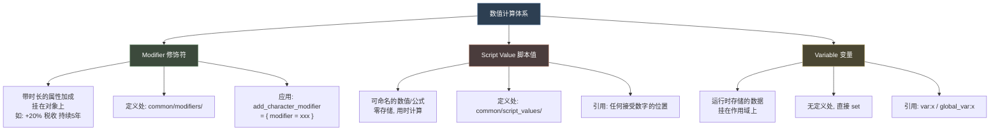
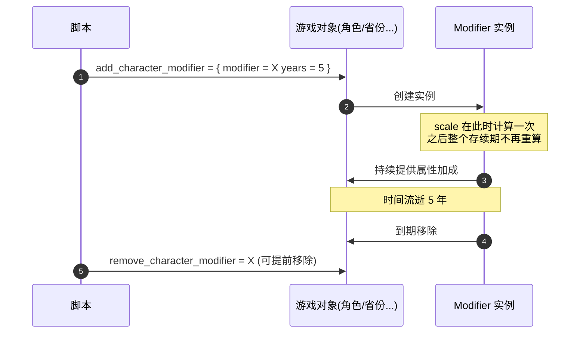
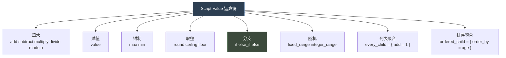
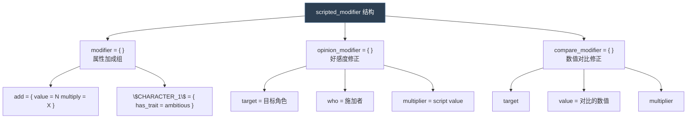
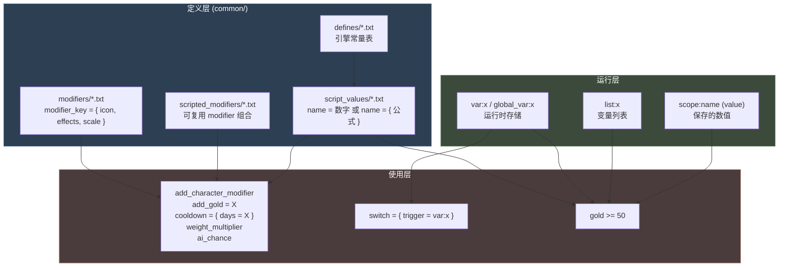

# 04 修饰符与数值计算

> P 语言的"计算器"：Modifier（带时长的加成）、Script Value（可命名公式）、Variable（运行时存储）三套数值子系统。

## 本篇导读

三者分工：

| | Modifier | Script Value | Variable |
|---|---|---|---|
| 本质 | 一组属性加成的**容器** | 一个**计算表达式** | 一个**存储槽** |
| 有时长 | 是 | 否 | 否（持久） |
| 存进存档 | 是 | 否 | 是 |

本文还覆盖**权重计算系统**（`base` → Σ`add` → Π`factor` → clamp），它同时服务于 `random` 的 `modifier`、`ai_chance` 与 `on_action` 的 `weight_multiplier`。

## 文档关联

- **前置**：[01 词法、数据类型与值系统](01-词法、数据类型与值系统.md)
- **姊妹篇**：[05 脚本复用机制](05-脚本复用机制.md) —— script value 本身就是最重要的复用单元之一
- **消费方**：[03 触发器与效果](03-触发器与效果.md)、[06 事件系统与 on_action](06-事件系统与on_action.md)

---


> 本文覆盖三大"数值子系统"：**Modifier（带时长的属性加成）**、**Script Value（可命名公式）**、**Variable（变量运算）**。

---

## 1. 三者的分工



| | Modifier | Script Value | Variable |
|---|---|---|---|
| 本质 | 一组属性加成的**容器** | 一个**计算表达式** | 一个**存储槽** |
| 有名字吗 | 是（定义在文件里） | 是（定义在文件里） | 是（运行时命名） |
| 有时长吗 | 是 | 否 | 否（持久） |
| 会存进存档 | 是 | 否 | 是 |
| 典型用途 | "获得 +20% 税收，持续 5 年" | "少量压力值 = 10" | "记录这次政变的支持者数" |

---

## 2. Modifier 修饰符

### 2.1 定义

定义目录：`common/modifiers/*.txt`

官方语法说明（`common/modifiers/_modifiers.info` 全文）：

```paradox
In this folder, character modifiers are defined

The modifers are on the format:

modifer_key = {
	icon = icon_name

	# Effects, such as
	# tax_mult = 0.25
	# county_opinion_add = -30

	# Modifier can have scale that'll be calculated once when effect assigns a modifier, and later
	# remains unchanged for the entire modifier duration
	scale = {

		# Scripted value - can be named value or direct math here
		# Root scope is the object that's going to get the modifier
		# Scripted value top level description will be added to modifier description
		value = scale_scripted_value

		# Loc key that's used for base level entry, to show alongside with the scaled value
		desc = base_value_description
	}
}

"modifier_key" is the name of the modifier, that is used in effects to apply it
"icon" decides which modifier icon to use. if it ends in positive or negative, the name of the modifier will be colored appropriately
```

### 2.2 应用

```paradox
# 出处: game/events/birth_events.txt:591
add_character_modifier = {
	modifier = mothered_many_children_modifier
}

# 常见变体
add_character_modifier = { modifier = X  years = 5 }
add_province_modifier  = { modifier = X  months = 6 }
add_dynasty_modifier   = { modifier = X }
add_culture_modifier   = { modifier = X }
remove_character_modifier = X
```

### 2.3 生命周期



> **重要**：`scale` 只在**应用时计算一次**，之后固定不变。这是官方明确说明的行为。

### 2.4 图标命名约定

```
若 icon 名以 positive / negative 结尾，修饰符名会自动着色
例：icon = gold_positive  ->  显示为绿色
    icon = gold_negative  ->  显示为红色
```

---

## 3. Script Value 脚本值

### 3.1 两种变体

**变体 A：静态值**

```paradox
# 出处: common/script_values/_script_values.info:6
name_of_scripted_value = value        # E.G., "minor_stress_gain = 10"

# 使用
add_stress = minor_stress_gain
```

**变体 B：公式**

```paradox
name_of_scripted_value = {
	<operations>
}
```

### 3.2 运算符全表

`common/script_values/_script_values.info` 第 19-59 行（官方原文）：

```paradox
name_of_scripted_value = {
	# Mathematical operations
	add = number/scripted value/scope.something
	subtract = ...
	multiply = ...
	divide = ...        # Be careful not to divide by 0
	modulo = ...

	value = ...         # Sets the value to this number

	max = ...           # Sets the value to this number if it is currently higher
	min = ...           # Sets the value to this number if it is currently lower

	round = yes         # Rounds to nearest whole number
	ceiling = yes       # Rounds up (towards positive infinity)
	floor = yes         # Rounds down (towards negative infinity)

	if = {              # These operations are executed if the limit is met
		limit = { some conditions }
		add = 5
		divide = ...
	}
	else_if = { ... }
	else = { ... }

	fixed_range = {     # Gives a random fixed-point number in the range (E.G., 1.242)
		min = ... script value
		max = ...
	}

	integer_range = {   # Gives a random fixed-point number in the range (E.G., 1)
		min = ...
		max = ...
	}
}
```



### 3.3 执行顺序 —— **严格自上而下**

官方示例（`_script_values.info:61-70`）：

```paradox
value = {
	add = 5         # 0  + 5  = 5
	multiply = 4    # 5  * 4  = 20
	max = 10        # min(20, 10) = 10
	add = 5         # 10 + 5  = 15
}
# 结果 = 15
```

> 关键点：`max = 10` 在最后的 `add = 5` **之前**执行，所以结果是 15 而不是 10。

### 3.4 内联（Inlining）

公式可以不命名，直接写在**任何接受 script value 的位置**：

```paradox
# 出处: _script_values.info:75
add_gold = {
	value = gold
	multiply = {           # 是的，运算符里也可以内联公式
		value = 1
		multiply = 0.5
	}
}
```

### 3.5 域链引用（Chaining）

可以通过域链引用另一个对象上的 script value：

```paradox
# 出处: _script_values.info:85
# 定义
example_age = {
	value = age
}

# 使用 —— 母亲的 example_age
add_gold = {
	value = mother.example_age
}
```

### 3.6 切换作用域

```paradox
# 出处: _script_values.info:115
# 这会加"你父亲的孩子数量"那么多的金币
add_gold = {
	father = {
		any_child = { add = 1 }
	}
}
```

### 3.7 列表聚合

```paradox
# 出处: _script_values.info:101
add_gold = { every_child = { add = 1 } }    # 每个孩子 +1

# 出处: _script_values.info:106
add_gold = {
	ordered_child = {
		order_by = age
		max = 3
		add = age
	}
}
```

### 3.8 范围（Range）

```paradox
# 出处: _script_values.info:94
add_gold = { 1 5 }                          # 随机 1~5
add_gold = { named_value another_named_value }   # 解析命名值（含公式）
```

> **限制**：范围里**不能**内联公式。
> `add_gold = { { value = 1 add = 2 } some_named_value }` 是**非法**的。
> 需要时改用 `integer_range` 或 `fixed_range`。

---

## 4. Scripted Modifier（脚本化修饰符）

`common/scripted_modifiers/*.txt` —— 可复用的**修饰符组合**，支持参数。

官方说明全文（`common/scripted_modifiers/_scripted_modifiers.info`）：

```paradox
Scripted modifiers work like scripted effects and triggers.

Can be invoked without parameters using "name = yes", or can take any number of parameters.

== Example modifier ==
example_modifier = {
	modifier = {
		add = { value = 10 multiply = $SCALE$ }
		$CHARACTER_1$ = {
			has_trait = ambitious
		}
	}
	opinion_modifier = {
		target = $CHARACTER_2$
		who = $CHARACTER_1$
		multiplier = { value = 0.25 multiply = $SCALE$ }
	}
	compare_modifier = {
		target = $CHARACTER_1$
		value = stress
		multiplier = $SCALE$
	}
}

== Example invocation ==
random_list = {
	1 = {
		example_modifier = {
			CHARACTER_1 = root
			CHARACTER_2 = root
			SCALE = 0.1
		}
	}
}
```



---

## 5. 变量运算

### 5.1 变量操作效果一览

| 效果 | 作用 |
|---|---|
| `set_variable = { name = X value = V }` | 设置 |
| `change_variable = { name = X add = V }` | 加减 |
| `add_to_variable = { name = X value = V }` | 加（另一种写法） |
| `remove_variable = X` | 删除 |
| `round_variable = { name = X }` | 四舍五入 |
| `clamp_variable = { name = X min = A max = B }` | 钳制 |
| `set_local_variable` / `change_local_variable` | 局部版 |
| `set_global_variable` / `change_global_variable` | 全局版 |

### 5.2 变量算术的写法

变量算术**不使用** `+ - * /`，而是通过 `change_variable` 的运算符键：

```paradox
change_variable = { name = my_var  add = 5 }
change_variable = { name = my_var  subtract = 3 }
change_variable = { name = my_var  multiply = 2 }
change_variable = { name = my_var  divide = 4 }
change_variable = { name = my_var  modulo = 7 }

change_variable = { name = my_var  max = 100 }    # 上限
change_variable = { name = my_var  min = 0 }      # 下限
```

### 5.3 经典模式：安全的变量自增

`common/scripted_effects/00_debug_and_shortcut_effects.txt`：

```paradox
increment_variable_effect = {
	if = {
		limit = { NOT = { exists = var:$VAR$ } }
		set_variable = { name = $VAR$  value = $VAL$ }
	}
	else = {
		change_variable = { name = $VAR$  add = $VAL$ }
	}
}

increment_variable_remove_at_zero_effect = {
	if = {
		limit = { exists = var:$VAR$ }
		change_variable = { name = $VAR$  add = $VALUE$ }
		if = {
			limit = { var:$VAR$ <= 0 }
			remove_variable = $VAR$
		}
	}
}

increment_global_variable_effect = {
	if = {
		limit = { NOT = { exists = global_var:$VAR$ } }
		set_global_variable = { name = $VAR$  value = $VAL$ }
	}
	else = {
		change_global_variable = { name = $VAR$  add = $VAL$ }
	}
}
```

> **为什么需要 `exists` 检查**：对不存在的变量做 `change_variable` 会报错。这是原版的标准防御写法。

### 5.4 变量列表

```paradox
add_to_list = transferred_duchies
add_to_variable_list = { name = X  target = scope:y }
remove_from_list = { name = X  target = scope:y }

list_size:my_list                    # 作为数值读取
variable_list_size = { name = imperial_examiners_list  value < examiners_amount }

any_in_list = { list = X  <triggers> }
every_in_list = { list = X  <effects> }
ordered_in_list = { list = X  order_by = V  <effects> }

any_in_global_list     = { variable = X  <triggers> }
ordered_in_global_list = { variable = X  order_by = V  <effects> }
```

---

## 6. 权重计算系统

权重计算出现在三处：**`random` 的 `modifier`**、**`ai_chance`**、**`on_action.weight_multiplier`**。三者共用同一套 `base + modifier` 语法。

### 6.1 语法

```paradox
weight_multiplier = {          # 出处: on_action/_on_actions.info:39
	base = 1
	modifier = {
		add = 1
		trigger_conditions = yes
	}
}
```

### 6.2 运算符

| 运算符 | 含义 | 阶段 |
|---|---|---|
| `base = N` | 基础值 | 起点 |
| `add = N` | 加算 | 全部 add 累加 |
| `subtract = N` | 减算 | 与 add 同阶段 |
| `factor = N` | 乘算 | 全部 factor 连乘 |
| `mult = N` | 乘算（`ai_will_select` 里的写法） | 连乘 |
| `min = N` / `max = N` | 钳制 | 最后 |

### 6.3 计算流程


### 6.4 实战示例

`game/events/birth_events.txt` 中的权重链（第 ~110-143 行）：

```paradox
random = {
	chance = <基础概率>

	# 1. 基于好感度的连续修正
	modifier = {
		opinion = {
			target = scope:child.mother
			min = 0
			max = 10
			multiplier = 0.1
		}
	}

	# 2. 已有多个孩子 -> 降低概率
	modifier = {
		any_child = { is_alive = yes  count > 1 }
		add = -5
	}

	# 3. 父亲疯狂/着魔 -> 提高概率
	modifier = {
		scope:child.father = {
			OR = { has_trait = lunatic  has_trait = possessed }
		}
		add = 15
	}

	# 4. AI 统治者 -> 概率降到 25%
	modifier = {   # Event is less common for AI rulers.
		scope:child.mother = { is_ai = yes }
		factor = 0.25
	}

	trigger_event = birth.9002
}
```

---

## 7. 数值体系关系图



---

## 8. 数值计算速查

```paradox
# ── Modifier ──
# common/modifiers/my_modifiers.txt
my_modifier = {
	icon = my_icon_positive
	tax_mult = 0.25
	county_opinion_add = -30
	scale = {
		value = my_scale_value
		desc = my_scale_desc
	}
}
# 应用
add_character_modifier = { modifier = my_modifier  years = 5 }

# ── Script Value ──
# common/script_values/my_values.txt
minor_cost = 10
scaled_cost = {
	value = 100
	multiply = 0.5
	if = { limit = { has_trait = greedy }  multiply = 2 }
	min = 10
	max = 500
	round = yes
}
# 引用
gold >= minor_cost
add_gold = -scaled_cost

# ── Variable ──
set_variable = { name = my_var  value = 10 }
change_variable = { name = my_var  add = 5 }
change_variable = { name = my_var  multiply = 2 }
clamp_variable = { name = my_var  min = 0  max = 100 }
remove_variable = my_var

# ── 权重 ──
ai_chance = {
	base = 10
	modifier = { add = 5    has_trait = brave }
	modifier = { factor = 0.5  is_ai = yes }
}
```
