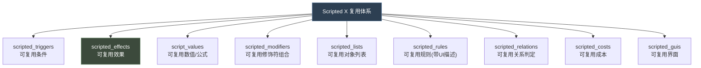
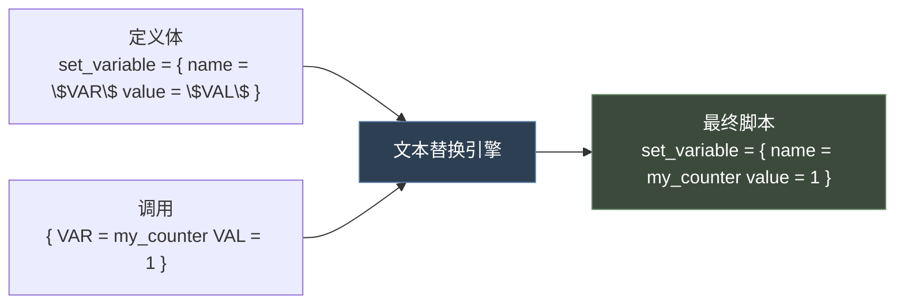
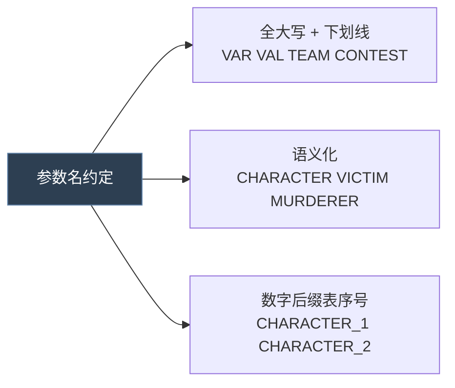
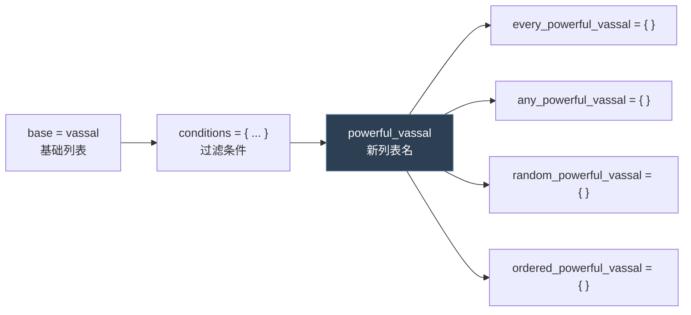
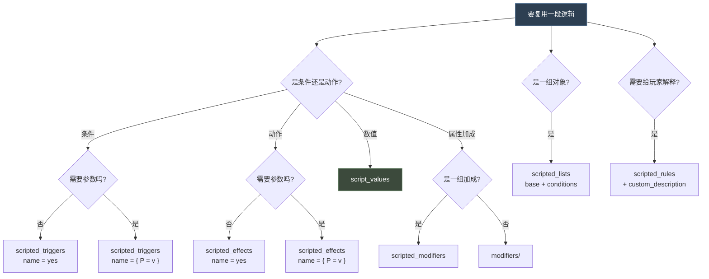
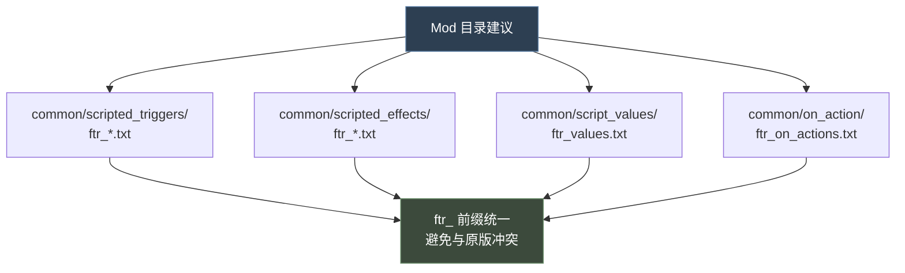

# 05 脚本复用机制（Scripted X 全家桶）

> P 语言没有函数，但有 **8 类脚本化复用单元**，覆盖触发器、效果、数值、修饰符、列表、规则、关系、GUI。

## 本篇导读

| 目录 | 定义关键字 | 调用方式 |
|---|---|---|
| `scripted_triggers/` | `name = { <triggers> }` | `name = yes` 或 `name = { P = v }` |
| `scripted_effects/` | `name = { <effects> }` | 同上 |
| `script_values/` | `name = 数字` 或 `name = { 公式 }` | 任何接受数字的位置 |
| `scripted_modifiers/` | `name = { modifier = {...} }` | `name = { P = v }` |
| `scripted_lists/` | `name = { base = X conditions = {} }` | 作为迭代器名使用 |
| `scripted_rules/` | `name = { <triggers> }` | 由代码 / UI 调用 |

**核心机制**：`$PARAM$` 是**纯文本宏替换**，不是变量 —— 因此可以拼进标识符中间（如 `charioteer_$TEAM$`）。

**实测结论**：原版**没有** `parameters = { P = { type = character } }` 声明块，**没有** `parameter_1`，**没有** `inline_script`。

## 文档关联

- **前置**：[04 修饰符与数值计算](04-修饰符与数值计算.md)
- **规范延伸**：[16 多系统选型指南与开发实践](16-多系统选型指南与开发实践.md)（`ftr_` 命名规范）

---


> P 语言没有函数，但有 **8 类"脚本化复用单元"**，覆盖触发器、效果、数值、修饰符、列表、规则、关系、GUI。

---

## 1. 全家桶总览



| 目录 | 定义关键字 | 调用方式 |
|---|---|---|
| `common/scripted_triggers/` | `name = { <triggers> }` | `name = yes` 或 `name = { P = v }` |
| `common/scripted_effects/` | `name = { <effects> }` | `name = yes` 或 `name = { P = v }` |
| `common/script_values/` | `name = 数字` 或 `name = { 公式 }` | 任何接受数字的位置 |
| `common/scripted_modifiers/` | `name = { modifier = {...} }` | `name = { P = v }` |
| `common/scripted_lists/` | `name = { base = X conditions = {...} }` | 作为迭代器名使用 |
| `common/scripted_rules/` | `name = { <triggers> }` | 由代码/UI 调用 |
| `common/scripted_relations/` | 见目录内定义 | — |
| `common/scripted_costs/` | 见目录内定义 | — |

---

## 2. 参数机制：`$PARAM$` 纯文本宏

### 2.1 核心事实（基于全目录实测）

| 结论 | 证据 |
|---|---|
| **没有** `parameters = { P = { type = character } }` 声明块 | 全目录检索 0 命中 |
| **没有** `parameter_1` 老式机制 | `parameter_1` 仅出现在 flag 名字里 |
| **没有** `inline_script` | 全 `game` 目录检索 0 命中 |
| 参数是**纯文本宏替换** | `increment_variable_effect` 等大量用例 |

### 2.2 定义与调用

```paradox
# ── 定义 ──
# 出处: common/scripted_effects/00_debug_and_shortcut_effects.txt
increment_variable_effect = {
	if = {
		limit = { NOT = { exists = var:$VAR$ } }
		set_variable = { name = $VAR$  value = $VAL$ }
	}
	else = {
		change_variable = { name = $VAR$  add = $VAL$ }
	}
}

# ── 调用 ──
increment_variable_effect = { VAR = contract_passive_spawn_tally  VAL = 1 }
```

替换过程：



### 2.3 参数可拼进标识符中间

```paradox
# 出处: common/scripted_effects/00_debug_and_shortcut_effects.txt
log_debug_variable_for_persian_struggle_effect = {
	if = {
		limit = {
			gather_debug_variables_for_persian_struggle_trigger = yes
			is_struggle_type = persian_struggle
		}
		increment_global_variable_effect = {
			VAR = sp_$VAR$       # 拼接 -> sp_my_counter
			VAL = 1
		}
	}
}
```

```paradox
# 出处: common/scripted_effects/04_dlc_ep2_tournament_effects.txt
add_trait = charioteer_$TEAM$
phase = tournament_phase_$CONTEST$
scope:resign_target.var:contest_qualified_match_$CONTEST$ = { save_scope_as = resign_match }
```

### 2.4 参数可以传递"作用域"而非"值"

```paradox
# 出处: common/scripted_triggers/00_relation_triggers.txt
can_set_relation_potential_friend_trigger = {
	NOT = { has_relation_potential_friend = $CHARACTER$ }
	can_set_relation_friend_trigger = { CHARACTER = $CHARACTER$ }     # 向下传递
}

can_set_relation_friend_trigger = {
	NOR = {
		this = $CHARACTER$
		has_relation_friend = $CHARACTER$
		has_relation_best_friend = $CHARACTER$
		has_relation_rival = $CHARACTER$
		has_relation_nemesis = $CHARACTER$
	}
}
```

调用：

```paradox
can_set_relation_friend_trigger = { CHARACTER = scope:target }
can_set_relation_friend_trigger = { CHARACTER = root }
can_set_relation_friend_trigger = { CHARACTER = prev }
```

### 2.5 参数也可以传"整个块"

```paradox
# 参数作为条件块（出处: scripted_effects/tgp_imperial_examination_scripted_effects.txt）
available_charioteers_spots_trigger = { TEAM = $TEAM$ }
```

### 2.6 命名约定



> `$` 只是标记，**不是**变量引用。写 `$VAR$` 和 `$var$` 是不同参数。

---

## 3. scripted_trigger

### 3.1 官方说明

`common/scripted_triggers/00_scripted_triggers.txt` 顶部注释（官方原文）：

```paradox
#	Example:
#
#	example_trigger = {
#		is_country_type = default
#		free_leader_slots > 0
#	}
#
#
#	In a script file:
#
#	trigger = {
#		example_trigger = yes
#	}
#

minor_gold_value_trigger = {
	short_term_gold >= minor_gold_value
}
```

### 3.2 调用形式

```paradox
# 无参
trigger = {
	my_trigger = yes
}

# 带参
trigger = {
	my_trigger = { CHARACTER = scope:target }
}
```

> **注意**：无参调用必须写 `= yes`，不能省略。

### 3.3 在事件文件里内联定义

事件文件里可以直接用 `scripted_trigger` 关键字定义（作用域仅限该文件）：

```paradox
# 出处: game/events/birth_events.txt:67
scripted_trigger allow_naming_on_birth_of_dynasty_child_trigger = {
	save_temporary_scope_as = naming_dynasty_member
	exists = $CHILD$
	is_ai = no
	#No parent is naming the kid, and it's not your child (at least not officially...)
	$CHILD$ = {
		any_parent = {
			NOR = {
				allow_naming_on_birth_of_child_trigger = { CHILD = $CHILD$ }
				this = scope:naming_dynasty_member
			}
		}
	}
	$CHILD$.host = scope:naming_dynasty_member
}
```

> ⚠ **定义位置不限目录**：带 `scripted_trigger` / `scripted_effect` 关键字的定义可出现在**任意 `.txt` 顶层**
> （原版 `birth_events.txt` / `kurultai_task_events.txt` 等先例），并非只能放 `common/scripted_triggers` / `common/scripted_effects`。
> 代码风格上仍建议集中在 common 目录，但**不要把"某脚本效果报未定义"当成定义漏了——先确认它是不是被写在块内或缩进内**。
> `tools/validate_scripts.py` 的引用检查会扫描整个 mod 的顶层关键词定义，可避免这类误判。

---

## 4. scripted_effect

### 4.1 定义与调用

```paradox
# 定义（出处: scripted_effects/00_debug_and_shortcut_effects.txt）
increment_variable_effect = {
	if = {
		limit = { NOT = { exists = var:$VAR$ } }
		set_variable = { name = $VAR$  value = $VAL$ }
	}
	else = {
		change_variable = { name = $VAR$  add = $VAL$ }
	}
}

# 调用
increment_variable_effect = { VAR = my_counter  VAL = 1 }
```

### 4.2 常见模式

**模式 A：安全初始化 + 修改**

```paradox
increment_variable_remove_at_zero_effect = {
	if = {
		limit = { exists = var:$VAR$ }
		change_variable = { name = $VAR$  add = $VALUE$ }
		if = {
			limit = { var:$VAR$ <= 0 }
			remove_variable = $VAR$
		}
	}
}
```

**模式 B：带默认值的参数（通过 if 判断参数是否存在实现）**

```paradox
my_effect = {
	if = {
		limit = { exists = $OPTIONAL$ }
		# 使用 $OPTIONAL$
	}
	else = {
		# 用默认值
	}
}
```

**模式 C：递归式构造（参数拼接）**

```paradox
log_debug_variable_for_persian_struggle_effect = {
	increment_global_variable_effect = {
		VAR = sp_$VAR$
		VAL = 1
	}
}
```

### 4.3 命名与编号

原版 `common/scripted_effects/` 里的文件命名：

| 前缀 | 含义 |
|---|---|
| `00_` | 基础/通用/系统 |
| `01_` `03_` `04_` `06_` `07_` `09_` `10_` | DLC 归属编号（fp1/fp2/fp3/ep1/ep2/ep3/bp1/bp2/ce1/tgp/mpo 等） |
| `xx_dlc_yyy_` | 明确归属某 DLC |
| `tgp_` / `mpo_` / `ach_` | 内容包/成就专属 |

---

## 5. script_value

详见 [04-修饰符与数值计算](04-修饰符与数值计算.md) 第 3 节。

```paradox
# 静态
minor_stress_gain = 10

# 公式
scaled_value = {
	value = 100
	multiply = 0.5
	if = { limit = { has_trait = greedy }  multiply = 2 }
	min = 10
	round = yes
}
```

---

## 6. scripted_modifier

详见 [04-修饰符与数值计算](04-修饰符与数值计算.md) 第 4 节。

```paradox
# 出处: common/scripted_modifiers/_scripted_modifiers.info
example_modifier = {
	modifier = {
		add = { value = 10 multiply = $SCALE$ }
		$CHARACTER_1$ = { has_trait = ambitious }
	}
	opinion_modifier = {
		target = $CHARACTER_2$
		who = $CHARACTER_1$
		multiplier = { value = 0.25 multiply = $SCALE$ }
	}
	compare_modifier = {
		target = $CHARACTER_1$
		value = stress
		multiplier = $SCALE$
	}
}

# 调用
example_modifier = { CHARACTER_1 = root  CHARACTER_2 = root  SCALE = 0.1 }
```

---

## 7. scripted_list

**作用**：基于已有列表派生出带过滤条件的新列表，之后可像内建迭代器一样使用。

`common/scripted_lists/00_scripted_lists.txt`（全文）：

```paradox
# Vassals
powerful_vassal = {
	base = vassal
	conditions = { is_powerful_vassal = yes }
}

# Governments
theocratic_ruler = {
	base = ruler
	conditions = { government_has_flag = government_is_theocracy }
}
theocratic_vassal = {
	base = vassal
	conditions = { government_has_flag = government_is_theocracy }
}

# Council
normal_councillor = {
	base = councillor
	conditions = { is_normal_councillor = yes }
}

#Titles
held_county = {
	base = held_title
	conditions = {
		tier = tier_county
	}
}

#Adult house members
adult_house_member = {
	base = house_member
	conditions = { is_adult = yes }
}
```



**语法**：

```paradox
my_list_name = {
	base = <已存在的列表名>
	conditions = { <triggers> }
}
```

**使用**：加迭代器前缀 + 列表名。

```paradox
every_powerful_vassal = {
	limit = { ... }        # 可再叠加过滤
	add_gold = 10
}
any_adult_house_member = { has_trait = brave }
```

---

## 8. scripted_rule

**作用**：命名的规则块，通常由代码/UI 调用，用于在界面上解释"为什么能/不能做某事"。

`common/scripted_rules/00_rules.txt` 头部（官方注释齐全）：

```paradox
# Determines who can command troops; filters who shows up in the list
# Root is the potential commander
# scope:army_owner is who owns the army to command
can_command_troops = {
	can_be_commander_basic_trigger = { ARMY_OWNER = scope:army_owner }
}

# Determines who can command troops; will still show up in the list, with a breakdown explaining why they can't command
# Root is the potential commander
# scope:army_owner is who owns the army to command
can_command_troops_now = {
	can_be_commander_now_trigger = { ARMY_OWNER = scope:army_owner }
}

# Determines if a barony should be handed to a GHW beneficiary, or instead have a baron generated. If true, goes to a beneficiary
# Root is barony province
# scope:faith is the faith controlling the GHW
ghw_give_barony_to_beneficiary = {
	has_holding_type = castle_holding
}
```

**关键特性**：用 `custom_description` 为每个子条件提供人话解释。

```paradox
# 出处: common/scripted_rules/00_rules.txt:25
faith_creation = {
	trigger_if = {
		limit = {
			highest_held_title_tier = tier_county
			top_liege != this
		}
		custom_description = {
			text = "faith_creation_duchy_or_higher"
			highest_held_title_tier >= tier_duchy
		}
	}

	is_adult = yes
	is_at_war = no

	custom_description = {
		text = "character_is_not_real_head"
		faith.religious_head != root
	}

	custom_description = {
		text = "character_can_only_create_one_faith"
		NOT = { exists = var:has_created_a_faith }
	}

	trigger_if = {
		limit = {
			faith = { has_doctrine_parameter = unreformed }
		}
		NOT = {
			custom_description = {
				text = faith_has_been_reformed
				object = faith
				exists = faith.var:has_been_reformed
			}
		}
	}
}
```

### 8.1 `custom_description`

```paradox
custom_description = {
	text = <本地化键>
	subject = <域>          # 可选，本地化里的主体
	object  = <域>          # 可选，本地化里的客体
	<实际要检查的 trigger>
}
```

> 它让 UI 显示"为什么这个条件不满足"，而不是干巴巴地列出脚本。

---

## 9. 其他 Scripted X

| 目录 | 用途 | 备注 |
|---|---|---|
| `common/scripted_relations/` | 角色关系的脚本化判定 | 见目录内 `_scripted_relations.info` |
| `common/scripted_costs/` | 可复用成本计算 | 供决议/交互使用 |
| `common/scripted_guis/` | 可复用界面定义 | 与本系列关系较小 |
| `common/scripted_animations/` | 可复用立绘动画序列 | 见 `_scripted_animations.info` |
| `common/scripted_character_templates/` | 角色生成模板 | `create_character = { template = X }` |

### 9.1 scripted_character_templates

```paradox
# 使用（出处: scripted_effects/07_dlc_ep3_scripted_effects.txt:4358）
create_character = {
	template = charioteer_template
	employer = scope:activity.activity_host
	save_scope_as = temp_charioteer
}
```

---

## 10. 复用单元的选择决策树



---

## 11. 组织建议（针对 for_the_realm 项目）



**命名规则建议**：

| 类型 | 前缀 | 示例 |
|---|---|---|
| 脚本触发器 | `ftr_` + 描述 + `_trigger` | `ftr_can_convert_to_feudal_trigger` |
| 脚本效果 | `ftr_` + 描述 + `_effect` | `ftr_grant_merit_effect` |
| 脚本值 | `ftr_` + 描述 + `_value` | `ftr_war_tax_value` |
| on_action | `ftr_` + 描述 | `ftr_vassal_independence` |
| 事件命名空间 | `ftr` | `namespace = ftr` → `ftr.0001` |
| 变量 | `ftr_` 前缀 | `var:ftr_merit_level` |
| 标记 | `ftr_` 前缀 | `has_character_flag = ftr_is_governor` |

**版本兼容建议**：

1. 不覆盖原版文件，用 `on_actions = { ftr_xxx }` 扩展
2. 所有自定义 ID 加 `ftr_` 前缀
3. `.info` 文件里记录版本与变更
