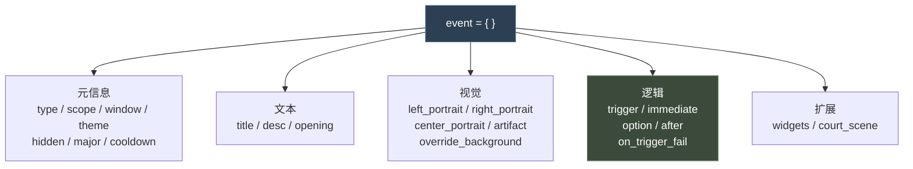
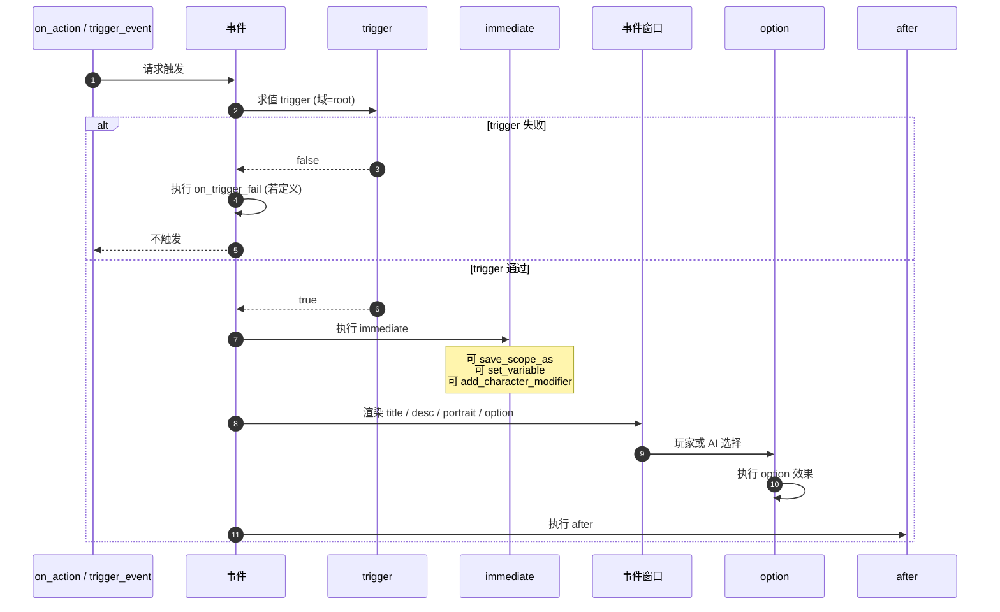
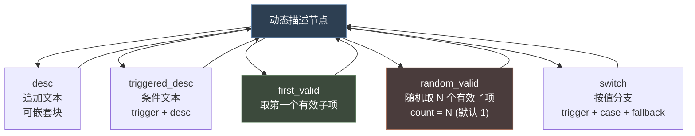
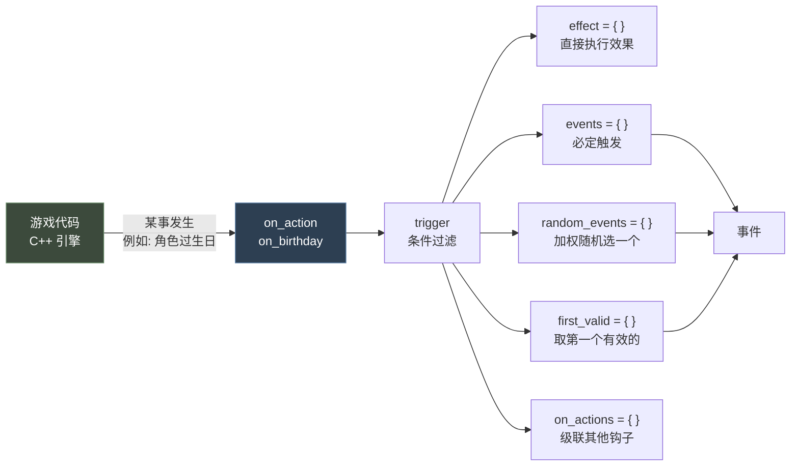
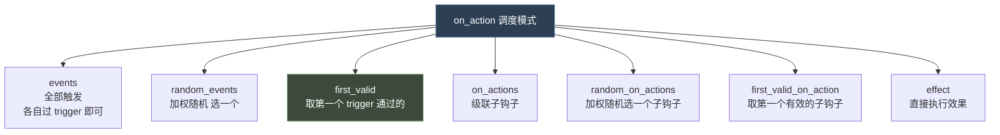
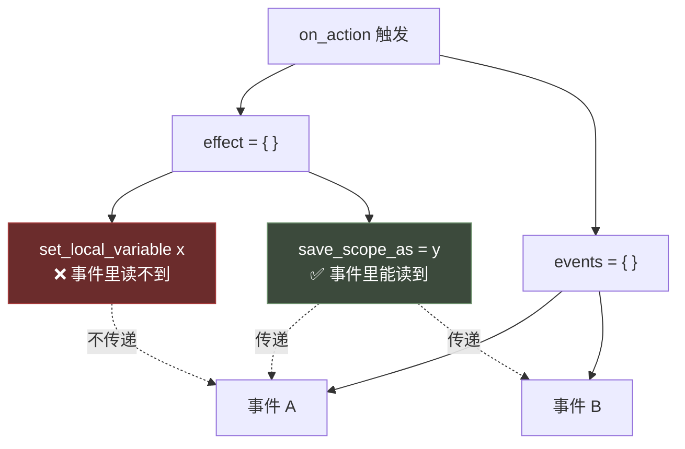
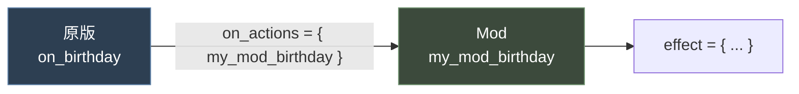

# 06 事件系统与 on_action

> **事件 = 带 UI 的交互单元；on_action = 引擎回调钩子。** 二者构成 CK3 内容驱动的主动脉。

## 本篇导读

- **第一部 事件系统** —— 命名空间、事件类型与窗口、执行时序、动态描述块（`first_valid` / `random_valid` / `switch`）、立绘、`widgets`、宫廷场景、完整骨架。
- **第二部 On Action 与事件调度** —— 引擎回调、周期脉冲、五大调度模式（`events` / `random_events` / `first_valid` / `on_actions` / `effect`）、延迟二次校验、权重系统、非侵入式扩展模式。

### ⚠ 最重要的陷阱

`on_action` 的 `effect` 与它触发的事件是**两条独立的域链**。官方明确说明：

> "Scopes or local variables set in the effect here will not carry over to any event fired by the on_action."

**解法**：用 `save_scope_as`（saved scope 会跨链传递），不要用局部变量。

## 文档关联

- **前置**：[03 触发器与效果](03-触发器与效果.md)
- **文本延伸**：[07 history 历史脚本与本地化](07-history历史脚本与本地化.md)（事件的本地化）
- **系统落地**：[08 角色交互与决议](08-角色交互与决议.md)、[11 阴谋与派系](11-阴谋与派系.md)

## 目录

| 部 | 章节 |
|---|---|
| 第一部 事件系统 | 命名空间 · 类型与根域 · 窗口 · 执行时序 · 核心属性 · 动态描述 · 立绘 · 书信 · 宫廷场景 · widgets · 完整骨架 |
| 第二部 On Action | 概念 · 三种来源 · 周期钩子 · 完整语法 · 五大调度模式 · `fallback` · 延迟 · 权重 · 扩展模式 · 调试 |

---

# 第一部 事件系统（Event）

> 本文基于官方权威说明 `game/events/_events.info` 全文 + 原版事件实证。

---

## 1. 事件是什么

事件 = **带 UI 的交互单元**。它由若干"文本 + 立绘 + 选项"组成，玩家选择后执行效果。



---

## 2. 文件与命名空间

每个事件文件**顶部声明一次** `namespace`，之后用 `namespace.number` 定义事件。

```paradox
# 出处: game/events/_events.info:5
namespace = my_events

my_events.1001 = { ... }
```

```paradox
# 出处: game/events/birth_events.txt:3
namespace = birth
```

原版惯例：用注释登记事件编号表（`birth_events.txt` 第 11-18 行）

```paradox
# 0001 - Selects visible birth event based on bastard status and complication rolls
# 0002 - Reward event for mother who've had many children
# 1001 - BIRTH: Mother: regular birth
# 1002 - BIRTH: Mother: child secretly a bastard
```

---

## 3. 事件类型与根域

官方原文（`_events.info:11-12`）：

```paradox
type = character_event/letter_event/court_event/activity_event
       # Optional, defaults to character_event
scope = scope_type
       # Overrides the events root scope. Optional, defaults to character scope.
       # Use scope = none for no root scope, scope = artifact for events centered around artifacts, etc.
```

| `type` | 用途 | root |
|---|---|---|
| `character_event`（默认） | 标准角色事件 | 接收角色 |
| `letter_event` | 书信（不在同一地点的角色间） | 收信人 |
| `court_event` | 宫廷场景事件 | 宫廷主人 |
| `activity_event` | 活动内嵌事件 | 活动参与者 |

可用的 `scope`（见 `customizable_localization/_custom_loc.info`）：
`artifact` `character` `landed_title` `province` `activity` `secret` `scheme` `combat` `combat_side` `title_and_vassal_change` `faith` `dynasty` `all` `none`

---

## 4. 窗口类型 `window`

官方原文（`_events.info:17-30`）：

| window | 用途 |
|---|---|
| `anonymous_letter_event` | letter_event，但无发信人立绘与纹章 |
| `big_event_window` | task_contracts、bookmark 事件、决议结果、story cycles、黑死病等 |
| `character_event` | 默认 |
| `duel_event` | 单挑事件 |
| `fullscreen_event` | 启动画面队列 |
| `letter_event` | 角色交互的回信（双方不在同一地点） |
| `scheme_conclusion_window` | 计谋结算，含子类型：<br/>`scheme_failed_event`（失败头）<br/>`scheme_preparations_event`（准备部件）<br/>`scheme_successful_event`（成功头）<br/>`scheme_conclusion_event_no_header`（无头） |
| `visit_settlement_window` | 基于 big_event_window，用于 laamp 访问定居点决议 |

```paradox
my_event.0001 = {
	type = character_event
	window = big_event_window
	...
}
```

---

## 5. 事件的执行时序



> `on_trigger_fail` 官方说明（`_events.info:125-129`）：
> "Runs if a queued/instant event fails trigger checks. Events selected from on_actions are filtered by validity before queuing, so this is typically not run for that path."

---

## 6. 核心属性详解

### 6.1 `title` / `desc`

支持**静态本地化键**或**动态描述块（Dynamic Description）**。

```paradox
# 静态
title = my_event_title
desc  = my_event_desc

# 动态（出处: game/events/birth_events.txt:599）
title = {
	first_valid = {
		triggered_desc = {
			trigger = { ... }
			desc = birth.1001.t
		}
		triggered_desc = {
			trigger = { ... }
			desc = birth.1001.heir.t
		}
		desc = birth.1001.children.t       # 兜底
	}
}
```

### 6.2 动态描述块（CDynamicDescription）

官方说明（`_events.info:266-388`），支持 `title`、`desc`、`opening`、option `name`。



**① `desc` —— 追加**

```paradox
desc = {
	desc = my_event.intro
	desc = my_event.outro
}
```

**② `triggered_desc` —— 条件**

```paradox
triggered_desc = {
	trigger = { has_trait = brave }
	desc = my_event.brave_line
}
```

**③ `first_valid` —— 首个有效**

```paradox
first_valid = {
	triggered_desc = { trigger = { has_trait = brave }   desc = my_event.brave }
	triggered_desc = { trigger = { has_trait = craven }  desc = my_event.craven }
	desc = my_event.fallback
}
```

**④ `random_valid` —— 随机若干**

```paradox
random_valid = {
	count = 2
	desc = my_event.random_a
	triggered_desc = { trigger = { has_trait = patient }  desc = my_event.random_b }
	desc = my_event.random_c
}
```

**⑤ `switch` —— 按值分支**

```paradox
# 出处: events/_events.info:352
switch = {
	trigger = scope:rite_memory.var:rites_of_passage_type
	flag:dueling_rite_memory      = { desc = bp2_yearly.7029.desc_duel }
	flag:scarification_rite_memory = { desc = bp2_yearly.7029.desc_scarification }
	fallback = { desc = bp2_yearly.7029.desc }
}
```

**真实示例**（`birth_events.txt:648`，`random_valid`）：

```paradox
desc = {
	#How do I feel?
	random_valid = {
		triggered_desc = { #First child and it was cool
			trigger = {
				NOT = {
					any_child = {
						even_if_dead = yes
						NOR = { this = scope:child  is_twin_of = scope:child }
					}
				}
				NOT = { has_trait = craven }
			}
			desc = birth.1001.first_birth_good.desc
		}
		triggered_desc = { #Had a lot of babies
			trigger = { any_child = { even_if_dead = yes  count >= 5 } }
			desc = birth.1001.many_births.desc
		}
	}
}
```

> **官方编写建议**（`_events.info:383-388`）：
> - 永远保留兜底路径
> - 长文本拆成语义块再组合
> - 确定性分支用 `first_valid`，变体用 `random_valid`

### 6.3 `trigger`

```paradox
trigger = {
	is_adult = yes
	gold >= 50
}
```

### 6.4 `immediate`

窗口弹出前执行。常用于准备域与结算。

### 6.5 `option`

```paradox
option = {
	name = X                          # 本地化键 或 动态块
	trigger = {}                      # 选项可用条件
	show_as_unavailable = {}          # 不可用时显示为灰
	fallback = yes/no                 # 无常规可用选项时才考虑
	exclusive = yes/no                # 有 exclusive 选项可用时忽略非 exclusive
	highlight_portrait = scope:a_char
	skill = diplomacy                 # 标记技能相关性（UI）
	trait = some_trait                # 标记特质相关性（UI）
	reason = <flag>
	show_unlock_reason = yes/no
	is_cancel_option = yes/no
	clicksound = "sound_event"

	ai_chance = { base = 10  modifier = { add = 5 <trigger> } }
	ai_will_select = { base = 10  if = { limit = {...} add = 5 } }

	# 效果直接写在 option 主体里
	add_gold = 100
}
```

**option `name` 的动态形式**：

```paradox
# 出处: events/_events.info:363
name = my_option_text_key
name = { text = <loc_key 或 动态块>  trigger = { ... } }
```

> 可以有多个并列 `name = { }`（**注意**：不能在一个 `name` 块里嵌套多个 `name`）。
> 多个候选有效时**随机选一个**；都无效时用**第一个**兜底。

### 6.6 `after` / `on_trigger_fail`

```paradox
after = { ... }             # 所有 option 效果之后执行
on_trigger_fail = { ... }   # trigger 失败时执行
```

### 6.7 `hidden` 与 `major`

```paradox
hidden = yes/no     # 不显示窗口（纯逻辑事件）
major  = yes/no
major_trigger = { ... }
```

> 官方提示（`_events.info:42`）："Non-character scoped events generally need to be hidden or major."

### 6.8 `cooldown`

```paradox
# 出处: events/_events.info:47
cooldown = {
	days/weeks/months/years = script value
}
```

> 官方说明（第 44-46 行）："If you have a cooldown, the recipient root gets a saved variable with that duration. The variable name is based on the event ID. Trigger legality checks include cooldown."

```paradox
cooldown = { years = 5 }
cooldown = { months = { 6 12 } }
```

### 6.9 `content_source`

```paradox
content_source = X    # 该事件归属的 DLC / Mod，会显示在事件窗口
```

### 6.10 `orphan`

```paradox
orphan = yes    # 引擎不会因"该事件未被引用"而报错，适合调试事件
```

### 6.11 `theme` 与 override 系列

```paradox
theme = ""                            # 事件主题
override_background = { trigger = {}  reference = "" }
override_transition = { trigger = {}  reference = "" }
override_effect_2d  = { trigger = {}  reference = "" }
override_icon       = { trigger = {}  reference = "" }
override_header_background = { trigger = {}  reference = "" }
override_sound      = { trigger = {}  reference = "" }
```

> 规则：多个 override 时**取第一个 trigger 通过的**；全不通则回退到 theme 自带的。

---

## 7. 立绘（Portrait）

### 7.1 位置

`left_portrait` `right_portrait` `center_portrait` `lower_left_portrait` `lower_center_portrait` `lower_right_portrait`（`center_portrait` 并非所有事件类型都支持）。

`letter_event` 必须定义 `sender`。

### 7.2 两种写法

```paradox
# 简写：直接给事件目标
left_portrait = scope:child

# 完整块
left_portrait = {
	character = root
	trigger = { ... }             # 控制该立绘是否显示
	animation = personality_honorable
	scripted_animation = key_of_scripted_animation

	triggered_animation = {       # 第一个 trigger 通过的会被使用
		trigger = { ... }
		animation = animation_name
		scripted_animation = key_of_scripted_animation
		camera = camera_name
	}
	triggered_animation = { ... }

	triggered_outfit = {          # 第一个 trigger 通过的会被使用
		trigger = { ... }
		outfit_tags = { ... }
		remove_default_outfit = yes
	}
	triggered_outfit = { ... }

	camera = camera_key
	override_imprisonment_visuals = yes/no
	animate_if_dead = yes/no

	outfit_tags = { tag1 tag2 }   # 升序优先级，tag2 覆盖 tag1
	remove_default_outfit = yes/no
	hide_info = yes/no            # 只显示立绘，隐藏 CoA/提示/点击
}
```

### 7.3 宝物立绘

```paradox
artifact = {
	target = event target
	position = lower_left_portrait/lower_center_portrait/lower_right_portrait
	# 不能与立绘占同一位置
	trigger = { ... }
}
```

---

## 8. 书信事件 `opening`

```paradox
opening = my_letter_opening    # 本地化键 或 动态描述块
```

---

## 9. 宫廷场景 `court_scene`

```paradox
court_scene = {
	button_position_character = scope:a_character
	court_owner = scope:a_character
	court_event_force_open = yes/no
	show_timeout_info = yes/no
	should_pause_time = yes/no
	roles = {
		scope:a_character = {
			role = some_court_scene_role
			# 或 group = some_court_scene_group
			animation = some_animation
			scripted_animation = some_scripted_animation
		}
	}
}
```

---

## 10. 自定义部件 `widgets`

```paradox
widgets = {
	widget = {
		is_shown = {}                  # 默认 always = yes
		gui = "<widget_name>"          # <event_window_widgets>/<widget_name>.gui
		container = "<container_name>" # 事件窗口中的父容器名

		controller = <controller_type>
		# 或结构化形式：
		# controller = { type = <controller_type>  data = { ... } }

		setup_scope = {}               # 控制器所需的域准备
	}
}
widget = { ... }    # 单个 widget 的简写
```

### 10.1 可用控制器

| Controller Type | Data Context Name | 说明 |
|---|---|---|
| `default` | `EventWindowWidget` | 默认，无特殊行为 |
| `name_character` | `EventWindowWidgetNameCharacter` | 改名，需 `name_character_target` 保存域 |
| `text` | `EventWindowWidgetEnterText` | 输入文本，可用 `controller = { type = text data = {...} }` + `setup_scope` 设置 `text_target` |
| `event_chain_progress` | `EventWindowWidgetChainProgress` | 事件链进度，需 `event_chain_length` 与 `event_chain_progress` 域值 |
| `struggle_info` | `EventWindowCustomWidgetStruggleInfo` | 局势信息，需 `start` 域值 |
| `situation_info` | `EventWindowCustomWidgetSituationInfo` | 情境信息 |

---

## 11. 完整事件骨架（整合版）

```paradox
namespace = my_mod

my_mod.0001 = {
	# ── 元信息 ──
	type = character_event
	scope = character
	window = character_event
	content_source = my_mod
	theme = my_theme
	orphan = no

	# ── 触发控制 ──
	hidden = no
	major = no
	major_trigger = { ... }
	cooldown = { years = 5 }

	# ── 文本 ──
	title = my_mod.0001.t
	desc = {
		first_valid = {
			triggered_desc = { trigger = { has_trait = brave }  desc = my_mod.0001.brave }
			desc = my_mod.0001.fallback
		}
	}
	opening = my_mod.0001.opening        # 仅 letter_event

	# ── 视觉 ──
	left_portrait = {
		character = root
		animation = personality_honorable
		triggered_animation = {
			trigger = { has_trait = craven }
			animation = fear
		}
	}
	right_portrait = scope:guest

	# ── 逻辑 ──
	trigger = {
		is_adult = yes
		gold >= 50
	}

	immediate = {
		save_scope_as = event_owner
		set_variable = { name = feast_cost  value = 50 }
	}

	option = {
		name = my_mod.0001.a
		trigger = { gold >= 50 }
		ai_chance = {
			base = 10
			modifier = { add = 5  has_trait = generous }
		}
		add_gold = -50
		add_opinion = { target = scope:guest  modifier = feast_opinion  opinion = 20 }
	}

	option = {
		name = my_mod.0001.b
		fallback = yes
	}

	after = {
		remove_variable = feast_cost
	}

	on_trigger_fail = { }
}
```

---

## 12. 事件 ID 规划建议


原版 `birth_events.txt` 的编号规划（第 8-63 行）值得借鉴：

```
0001-1999: "Ordinary" births and bastard births
2001-2999: Legitimization events for bastards
3000-3999: Problematic childbirth (miscarriages, mother deaths, sickly child, ill mother)
8001-8999: Misc birth management
9001-9999: Special naming events
```

---

# 第二部 On Action 与事件调度

> 本文基于官方权威说明 `game/common/on_action/_on_actions.info` 全文 + 原版 on_action 实证。

---

## 1. On Action 是什么

**On Action = 引擎回调钩子**。当游戏里发生特定事情时，引擎调用对应的 on_action；on_action 再决定触发哪些事件、运行哪些效果。



---

## 2. On Action 的三种来源

### 2.1 代码调用（绝大多数）

`_on_actions.info` 第 1 行：

> "A lot of on_actions are called from code when different things happen in-game. (Hence the name)"

### 2.2 代码定时脉冲（Pulse）

`_on_actions.info` 第 4-21 行列出的周期钩子：

| on_action | 触发时机 | root |
|---|---|---|
| `yearly_global_pulse` | 每年 1 月 1 日 | **无 root** |
| `on_yearly_playable` | 每年（按角色生日，各角色日期不同） | 可玩角色 |
| `three_year_playable_pulse` | 每三年 | 可玩角色 |
| `five_year_playable_pulse` | 每五年 | 可玩角色 |
| `quarterly_playable_pulse` | 每季度（相对生日，非自然季度）<br/>带 `scope:quarter` 值 1-4 | 可玩角色 |
| `random_yearly_playable_pulse` | 每年随机时刻 | 可玩角色 |
| `random_yearly_everyone_pulse` | 每年随机时刻 | 所有角色 |
| `five_year_everyone_pulse` | 每五年 | 所有角色 |
| `three_year_pool_pulse` | 每三年 | 角色池角色 |

```paradox
# 使用 scope:quarter 的例子
quarterly_playable_pulse = {
	trigger = { scope:quarter = 2 }
	...
}
```

### 2.3 脚本调用

```paradox
# 出处: _on_actions.info:26
trigger_event = {
	on_action = on_action_name
	days/months/years = X      # 可选
}
```

---

## 3. 完整语法结构

官方原文（`_on_actions.info:34-100`）：

```paradox
on_action_name = {
	trigger = {			# On_actions can have triggers. If an on_action fires and its trigger returns false, nothing happens
		trigger_conditions = yes
	}

	weight_multiplier = {	# Used to manipulate the weight of this on_action if it is a candidate in a random_on_actions list (see below)
		base = 1
		modifier = {
			add = 1
			trigger_conditions = yes
		}
	}

	events = {		# Events listed in "events" brackets will always fire as long as their trigger evaluates to true
		event_id_1
		delay = { days = 365 }		# A delay will mean that all events listed after it will only be fired after the delay has passed.
		event_id_2
		delay = { months = { 6 12 } }	# Setting a new delay overrides a previous delay. Delays support random ranges
		event_id_3
	}

	random_events = {	# A single event will be picked to fire
		chance_to_happen = 25	# A percentage chance determining whether the events involved will be evaluated at all
		chance_of_no_event = { 	# An entry that can be formatted as a script value (and therefore have conditional entries)
			value = 0
			if = {
				limit = { trigger_conditions = yes }
				add = 10
			}
		}
		100 = event_id_1 	# The number is the weight for picking a specific event
		200 = event_id_2
		100 = 0			# "0" entry means there is a chance no event fires
	}

	first_valid = {		# Pick the first event for which the trigger returns true
		event_id_1
		event_id_2
		fallback_event_without_trigger
	}

	on_actions = {	# An on_action can fire other on_actions, following the same rules as with events
		on_action_1
		on_action_2
	}

	random_on_actions = {	# Same as with events. On_actions are also factored by their weight_multipliers, which defaults to 1
		100 = on_action_1
		200 = on_action_2
		100 = 0
	}

	first_valid_on_action = {
		on_action_1
		on_action_2
	}

	effect = { 	# An on_action can run effects...
		effects = yes
	}

	fallback = another_on_action 	# If no events/on_actions are run, the fallback gets called instead
}
```

---

## 4. 五大调度模式



### 4.1 `events` —— 并行全部

```paradox
my_on_action = {
	events = {
		ns.0001
		delay = { days = 365 }    # 之后的事件都延后 365 天
		ns.0002
		delay = { months = { 6 12 } }  # 覆盖之前的 delay，并支持随机范围
		ns.0003
	}
}
```

> **关键陷阱**：延迟触发的事件会**二次校验**。官方说明：
> "an event will only successfully fire if it is valid both when the on_action is executed AND once the delay is complete."

### 4.2 `random_events` —— 加权随机

```paradox
my_on_action = {
	random_events = {
		chance_to_happen = 25            # 25% 概率才评估下面的内容
		chance_of_no_event = {           # 无事件的概率（可写成 script value）
			value = 0
			if = { limit = { ... }  add = 10 }
		}
		100 = ns.0001                    # 权重
		200 = ns.0002
		100 = 0                          # 权重给 0 表示"可能什么都不发生"
	}
}
```

> `100 = 0` 的作用（官方注释）：
> "Having a '0' entry means that there is a chance no event fires, even if there are other valid events. Good for making sure that rare events don't always fire just because every other possible event is invalid."

权重计算：`条目权重 × 事件的 weight_multiplier`（事件未定义 `weight_multiplier` 时按 1 计）。

### 4.3 `first_valid` —— 首个有效

```paradox
my_on_action = {
	first_valid = {
		ns.0001
		ns.0002
		ns.9999        # 通常放一个无 trigger 的兜底事件
	}
}
```

### 4.4 `on_actions` / `random_on_actions` / `first_valid_on_action` —— 级联

```paradox
# 出处: game/common/on_action/birthday.txt:3
on_birthday = {
	on_actions = {
		on_specific_birthday
		on_birthday_childhood
		on_birthday_adulthood
		on_graceful_aging_birthday
	}
}

# 出处: game/common/on_action/birthday.txt:12
on_specific_birthday = {
	first_valid_on_action = {
		on_3rd_birthday
		on_6th_birthday
		on_10th_birthday
		on_15th_birthday
		on_16th_birthday
	}
}
```

### 4.5 `effect` —— 直接执行

```paradox
# 出处: game/common/on_action/birthday.txt:32
on_birthday_childhood = {
	trigger = {
		is_adult = no
		age >= childhood_education_start_age
	}
	on_actions = {
		on_birthday_education_events
		on_action_add_sexuality
		reincarnation_toy_pulse
	}
	effect = {
		if = {
			limit = {
				any_parent = {
					is_playable_character = yes
					highest_held_title_tier >= tier_duchy
					any_memory = {
						memory_type = ascended_throne_memory
						has_variable = childhood_memory
						save_temporary_scope_as = throne_memory_temp
					}
				}
			}
			random_parent = {
				limit = {
					is_playable_character = yes
					highest_held_title_tier >= tier_duchy
					any_memory = {
						memory_type = ascended_throne_memory
						has_variable = childhood_memory
						save_temporary_scope_as = throne_memory_temp
					}
				}
				trigger_event = bp2_yearly.4003
				# This event has further triggers, as well as a cooldown, and may still fail.
			}
		}
	}
}
```

> ### ⚠ 最重要的陷阱：effect 与事件是**两条独立域链**
>
> 官方原文（`_on_actions.info:95`）：
> "Note that it happens concurrently to events triggered by the on_action, NOT before. Effects run here create a separate chain than events the on_action fires, so you can for example not manipulate values in the effect, and then reliably access those in an event that was fired at the same time. **Scopes or local variables set in the effect here will not carry over to any event fired by the on_action.**"
>
> **解决方案**：用 `save_scope_as`（saved scope 会跨链传递到事件）。



---

## 5. `fallback`

```paradox
my_on_action = {
	events = { ns.0001 }
	fallback = another_on_action
}
```

> 官方警告（`_on_actions.info:99`）："Avoid creating infinite fallback loops, or the game may be prevented from advancing time!"

---

## 6. Mod 开发的核心模式：非侵入式扩展

**问题**：不能给同一 on_action 追加多个 `trigger` 或 `effect` 块。

官方原文（`_on_actions.info:104`）：

> "You can declare data for on-actions in multiple files, however, you cannot have multiple triggers or effect blocks for a given named on-action. In particular, you cannot append an effect block directly to an on_action which already has an effect block, as this creates a conflict."

**官方推荐解法**（`_on_actions.info:106-115`）：

```paradox
some_vanilla_on_action = {
	on_actions = {some_modded_on_action}
}

some_modded_on_action = {
	effect = {
		some_fun_modding_effect = yes
	}
}
```

> "This makes the vanilla on-action call the modded on-action whenever it fires."



**这是 `for_the_realm` 这类 Mod 扩展原版行为的首选方式** —— 不覆盖原版文件，兼容性最好。

---

## 7. 延迟（Delay）

```paradox
events = {
	ns.0001                        # 立即
	delay = { days = 365 }
	ns.0002                        # 365 天后
	delay = { months = { 6 12 } }  # 覆盖前值，随机 6~12 个月
	ns.0003
}
```

规则：
1. `delay` 影响**其后所有**条目
2. 新的 `delay` **覆盖**旧的
3. 支持范围随机
4. 所有条目（事件和 on_action）都支持 delay
5. **延迟到期时会二次校验 trigger**

---

## 8. 权重系统

### 8.1 事件侧 `weight_multiplier`

```paradox
ns.0001 = {
	weight_multiplier = {
		base = 1
		modifier = { add = 1  has_trait = brave }
		modifier = { factor = 0.5  is_ai = yes }
	}
	...
}
```

> 未定义时按 **1** 计。

### 8.2 钩子侧 `weight_multiplier`

用于 `random_on_actions` 里的候选权重。

```paradox
my_on_action = {
	weight_multiplier = {
		base = 1
		modifier = { add = 1  trigger_conditions = yes }
	}
}
```

---

## 9. On Action 目录结构

```
common/on_action/
├── _on_actions.info          # 官方语法说明
├── birthday.txt              # 生日相关
├── death.txt                 # 死亡相关
├── child_birth_on_actions.txt
├── marriage_concubinage.txt
├── pregnancy_*.txt
├── title_on_actions.txt
├── war_on_actions.txt
├── culture_on_actions.txt
├── religion_on_actions.txt
├── yearly_on_actions.txt
├── game_start.txt
├── activities/               # 活动相关
├── dlc/                      # DLC 专属
├── lifestyles/
├── relations/
├── schemes/
└── story_cycles/
```

---

## 10. On Action 编写模板

```paradox
# ── 模式 A：Mod 扩展原版钩子（推荐）──
on_birthday = {
	on_actions = { ftr_birthday }
}

ftr_birthday = {
	trigger = { is_adult = yes }
	effect = {
		ftr_my_custom_birthday_effect = yes
	}
}

# ── 模式 B：条件 + 加权随机 ──
ftr_yearly_choice = {
	trigger = {
		is_playable_character = yes
		gold >= 100
	}
	random_events = {
		chance_to_happen = 30
		70 = ftr.1001
		30 = ftr.1002
		100 = 0              # 有概率什么都不发生
	}
}

# ── 模式 C：首个有效（做分支路由）──
ftr_death_router = {
	first_valid = {
		ftr.2001             # 死于战场
		ftr.2002             # 死于疾病
		ftr.2099             # 兜底
	}
}

# ── 模式 D：带延迟的连锁 ──
ftr_chain_start = {
	effect = {
		save_scope_as = ftr_chain_target
	}
	events = {
		ftr.3001
		delay = { days = 30 }
		ftr.3002
		delay = { months = { 3 6 } }
		ftr.3003
	}
}
```

---

## 11. 调试建议

| 问题 | 排查方向 |
|---|---|
| 事件从不触发 | 检查 on_action 的 `trigger`；检查事件自身 `trigger`；检查 `cooldown` |
| 延迟事件不触发 | 延迟到期时**二次校验** trigger，条件可能已不成立 |
| 事件里读不到 scope | on_action 的 `effect` 里用 `save_scope_as`，不要用局部变量 |
| 游戏卡住 | 检查 `fallback` 是否形成死循环 |
| 稀有事件总触发 | 在 `random_events` 里加 `100 = 0` 条目 |
| 覆盖原版报错 | 改用 `on_actions = { 自己的钩子 }` 扩展模式 |
