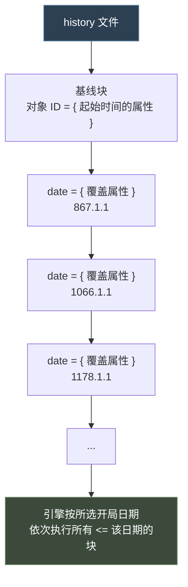
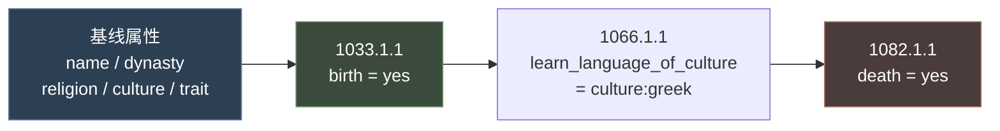
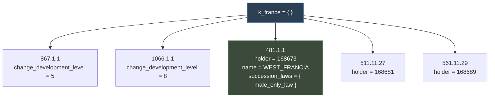
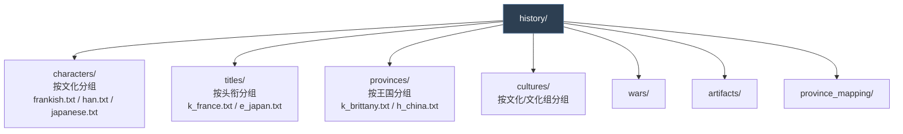

# 07 history 历史脚本

> `history/` 是唯一使用**时间轴范式**（基线 + 日期覆盖块）的目录；本篇覆盖角色 / 头衔 / 省份 / 文化四类历史文件与组织约定。

## 本篇导读

- **范式**：文件先写「基线」，再按日期插入覆盖块；越晚的块覆盖越早的。
- **四类文件**：`history/characters/`、`history/titles/`、`history/provinces/`、`history/cultures/`。
- **约定**：新增历史一律放 `ftr_` 前缀文件，避免与官方文件撞名。

## 文档关联

- **前置**：[01 词法、数据类型与值系统](01-词法、数据类型与值系统.md)
- **配套**：[20 本地化与 yml](20-本地化与yml.md)、[15 common 目录清单](15-common目录清单.md)

---
## 1. 核心范式：基线 + 日期覆盖块

官方原文（`history/_history.info` 全文）：

```paradox
=== Structure ===

All history files have the same format:

<basic key-value pairs that denote the beginning of time>

date = {
	<overriding key-value pairs>
}

date = {
	<overriding key-value pairs>
}

...

Which key-value pairs are available depends on the type of history.
```



**执行语义**：玩家选择一个开局日期（如 1066.9.15），引擎**从头到尾**执行所有 `日期 <= 开局日期` 的块。选择较早的开局日期时，后面的块不会执行。

---

## 2. 与 `common/` 的语法差异

| 维度 | `common/` | `history/` |
|---|---|---|
| 范式 | 定义数据库对象 | 时间轴指令序列 |
| 顶层结构 | `object_id = { 属性 }` | `object_id = { 属性 + date = { } ... }` |
| 顺序 | 基本无关（后覆盖前） | **严格按日期递增** |
| 内容 | 静态属性 | 属性 + 效果 + 生命周期事件 |
| 加载时机 | 启动时建库 | 开局时回放 |

---

## 3. `history/characters/` —— 角色历史

### 3.1 官方语法说明

`history/_characters.info` 全文：

```paradox
=== Structure ===

1001 = {	# character id
	name = ...
	dna = ...
	female = ...
	martial = ...
	prowess = ...
	diplomacy = ...
	intrigue = ...
	stewardship = ...
	learning = ...
	trait = ...
	father = ...
	mother = ...
	disallow_random_traits = ...

	faith = ...
	culture = ...
	dynasty = ...
	dynasty_house = ...
	give_nickname = ...
	sexuality = ...
	health = ...
	fertility = ...
	set_house = ...
	set_culture = ...
	set_character_faith_no_effect = ...
	add_spouse/add_matrilineal_spouse/add_same_sex_spouse = ...

	portrait_override = {	# Will override the character's appearance
		portrait_modifier_overrides={
			modifier_category_1 = modifier_1 # E.g. clothes=western_low_nobles
			modifier_category_1 = modifier_2
			...
		}
		hair={ R G B }	# hair color, e.g. hair={ 0.592 0.314 0.176 }
	}
}

1002 = ....
```

### 3.2 真实示例

`history/characters/albanian.txt`（全文）：

```paradox
komiskortes_of_dyrrachion = {
	# Komiskortes, a native of Dyrrachion, attested in Anna Comnene's writings as active in 1081
	name = "Komiskortes"
	dynasty = durres_dynasty
	religion = orthodox
	culture = albanian
	trait = education_martial_2
	1033.1.1 = {
		birth = yes
	}
	1066.1.1 = {
		learn_language_of_culture = culture:greek
	}
	1082.1.1 = {
		death = yes
	}
}
```



### 3.3 关键语法要点

| 要点 | 说明 |
|---|---|
| **顶层键是角色 ID 字符串** | 不是数字 ID（引擎会自动分配数字 ID） |
| `birth = yes` | 在日期块里标记出生 |
| `death = yes` | 在日期块里标记死亡 |
| `trait` / `add_trait` | 添加特质 |
| `disallow_random_traits = yes` | 禁止引擎随机补特质（历史人物必备） |
| `dna = ...` | 外貌 DNA 字符串 |
| `effect = { ... }` | 可执行任意效果块 |
| `template = X` | 引用 `common/scripted_character_templates/` |
| `religion` / `faith` | 信仰（注意 `_characters.info` 里两者都列了） |

### 3.4 日期格式

```
年.月.日
1033.1.1     # 1033 年 1 月 1 日
1066.9.15    # 1066 年 9 月 15 日（黑斯廷斯战役）
```

---

## 4. `history/titles/` —— 头衔历史

### 4.1 真实示例

`history/titles/k_france.txt`（开头部分）：

```paradox
k_france = {
	867.1.1 = { change_development_level = 5 }
	1066.1.1 = { change_development_level = 8 }
	1178.1.1 = { change_development_level = 24 }

	#Merovingians
	481.1.1 = {
		holder = 168673 #Clovis Ier
		name = WEST_FRANCIA
		succession_laws = { male_only_law }
	}
	511.11.27 = {
		holder = 168681 #Clotaire Ier
	}
	561.11.29 = {
		holder = 168689 #Chilpéric Ier
	}
	...
}
```



> **注意**：块可以**不按日期顺序书写**，引擎会自行排序。但为了可读性，建议按日期递增。

### 4.2 常用键

| 键 | 含义 |
|---|---|
| `holder = <char_id>` | 持有者（数字 ID 或角色 ID 字符串） |
| `holder = 0` | 空置（无持有者） |
| `liege = <title>` | 直属领主 |
| `de_jure_liege = <title>` | 法理领主 |
| `name = NAME_KEY` | 覆盖头衔显示名 |
| `succession_laws = { ... }` | 继承法 |
| `government = X` | 政体 |
| `capital = c_xxx` | 首都 |
| `change_development_level = N` | 发展度 |
| `heir = <char_id>` | 指定继承人 |
| `destroy_title_if_invalid_holder = yes` | 持有者非法则销毁 |

---

## 5. `history/provinces/` —— 省份历史

### 5.1 官方语法说明

`history/_provinces.info` 全文：

```paradox
=== Structure ===

== Mapped History ==
(These entries get copied from the source province if there is a mapping in history/province_mapping.)

culture = norse
faith = norse_pagan
terrain = arctic

== Main Province History ==
(These entries will NOT get copied to mapped provinces.)

# Set which holding type to use in the province. Default = auto.
# <holding_type> can be any holding type in common/holdings.
# none will not auto-generate any holding in that province
# auto will select a holding for the province automatically to fill the county with different holdings. See required_county_holdings in common/governments.
holding = <holding type> / none / auto

# To script Special Buildings, use 'special_building_slot = building_type' for just the slot, and 'special_building = building_type' for actually building the building.

# Set buildings in the holding (requires an explicit holding to be present - auto doesn't work).
# In a later history entry, this overrides all previous buildings.
buildings = { ... }

special_building_slot = X		# Enables and sets the special building slot for building X
special_building = X			# Same as special_building_slot, but also builds the actual building in the slot
duchy_capital_building = X		# Builds the capital duchy building X (only for duchy capitals)
```

### 5.2 真实示例

`history/provinces/k_brittany.txt`（开头部分）：

```paradox
#k_brittany
##d_brittany ###################################
###c_vannes
2154 = {	#VANNES
	culture = breton
	religion = catholic
	holding = castle_holding
}
2163 = {	#PORHOET
	holding = church_holding
}
2160 = {	#ROHAN
	holding = none
	1104.1.1 = {
		holding = city_holding
	}
}

###c_nantes
2152 = {	#NANTES
	culture = breton
	religion = catholic
	holding = castle_holding
}
2151 = {	#RAIS
	holding = city_holding
}
2153 = {	#GUERANDE
	holding = church_holding
}
2166 = {	#CHATEAUBRIANT
	holding = none
	1100.1.1 = {
		holding = castle_holding
	}
}
```

**要点**：

- 顶层键是**省份数字 ID**（如 `2154`），不是字符串
- 文件按王国/帝国组织（一个文件含多个省份）
- `holding = none` + 后续日期块 → 表示该地块**开局时无建筑，到某年才建**
- 注释里的行尾标注（`#VANNES`）帮助定位

### 5.3 常用键

| 键 | 含义 |
|---|---|
| `culture = X` | 文化 |
| `religion = X` / `faith = X` | 信仰 |
| `terrain = X` | 地形 |
| `holding = <type> / none / auto` | 地产类型 |
| `buildings = { ... }` | 建筑列表 |
| `special_building_slot = X` | 特殊建筑槽位 |
| `special_building = X` | 特殊建筑（含实际建造） |
| `duchy_capital_building = X` | 公国首府建筑 |
| `change_development_level = N` | 发展度 |
| `title = c_xxx` | 关联头衔 |

---

## 6. `history/cultures/` —— 文化历史

### 6.1 官方语法说明

`history/cultures/_culture.info` 全文：

```paradox
Name of the file is the culture key that should get the history.
Culture groups can be used too; if a file exists for an individual culture that'll be used rather than the group.
E.G., if "north_germanic_group.txt" and "norwegian.txt" both exist, Norwegian culture will use "norwegian.txt" while Swedish culture will use "north_germanic_group.txt".

date = {									# When is executed
	discover_innovation = innovation_key	# Discovers this innovations. There can be multiple per date.
	add_innovation_progress = {				# Advances a % defined on the defined innovation. There can be multiple per date.
		culture_innovation = innovation_key # Innovation
		progress = 50						# How much progress dos it gains
	}
	join_era = culture_era_key				# Joins the defined era. Only one per date.
	progress_era = 50						# Progress inthe current era. Only one per date.
}

##################################
Everything is executed in the order specified before
```

### 6.2 示例

```paradox
# history/cultures/norwegian.txt
800.1.1 = {
	discover_innovation = innovation_mustering_1
}
1000.1.1 = {
	add_innovation_progress = {
		culture_innovation = innovation_shipbuilding_2
		progress = 50
	}
}
1100.1.1 = {
	join_era = culture_era_2
}
```

> **文件粒度规则**：文件名即文化 key。可为文化组写一份（如 `north_germanic_group.txt`），也可为单个文化写一份；**单个文化的文件优先**于文化组文件。

---

## 7. 其他 history 子目录

| 目录 | 内容 | 说明 |
|---|---|---|
| `history/wars/` | 开局时已在进行/已结束的战争 | 时间轴定义宣战与停战 |
| `history/artifacts/` | 历史宝物 | 定义宝物及其持有者沿革 |
| `history/situations/` | 开局情境 | 见 `_situations.info` |
| `history/struggles/` | 开局局势 | 定义局势状态 |
| `history/province_mapping/` | 省份映射 | 用于随机世界的省份数据复用 |

---

## 8. History 文件的组织约定



> **Mod 建议**：新增历史内容时，**新建自己的文件**而不是修改原版文件。例如加角色就建 `history/characters/ftr_my_characters.txt`。

---

## 9. 常见错误

| 症状 | 原因 |
|---|---|
| 开局人物不存在 | 缺 `birth = yes` 或 `birth` 日期晚于开局日期 |
| 人物开局已死 | `death` 日期早于开局日期 |
| 头衔无人持有 | 缺 `holder` 或 `holder = 0` |
| 地块没有建筑 | `holding = none` 且后续日期块晚于开局 |
| 文化革新全解锁 | `discover_innovation` 日期设得太早 |
| 角色被随机加特质 | 缺 `disallow_random_traits = yes` |
| 历史文件整体失效 | 编码不是 UTF-8 with BOM |
| 覆盖无效 | 后加载的 Mod 覆盖先加载的；检查 `descriptor.mod` 的 load order |

---

## 10. 完整模板

```paradox
# ── history/characters/ftr_characters.txt ──
ftr_my_historical_char = {
	name = "My Character"
	dynasty = ftr_my_dynasty
	faith = catholic
	culture = frankish
	disallow_random_traits = yes
	trait = brave
	trait = education_martial_3
	martial = 15
	prowess = 12
	diplomacy = 10
	stewardship = 8
	intrigue = 6
	learning = 7
	female = no

	900.1.1 = { birth = yes }
	930.1.1 = { effect = { add_trait = ambitious } }
	950.1.1 = { add_spouse = ftr_my_spouse }
	980.1.1 = { death = yes }
}

# ── history/titles/ftr_titles.txt ──
k_my_kingdom = {
	867.1.1 = {
		holder = ftr_my_historical_char
		change_development_level = 10
		succession_laws = { male_only_law }
	}
	1066.1.1 = { change_development_level = 20 }
}

# ── history/provinces/ftr_provinces.txt ──
# k_my_kingdom
## d_my_duchy
### c_my_county
9001 = {	#MY_CAPITAL
	culture = frankish
	religion = catholic
	holding = castle_holding
	buildings = { barracks_01 }
}
9002 = {	#MY_SECOND
	holding = none
	1100.1.1 = { holding = city_holding }
}
```

---

