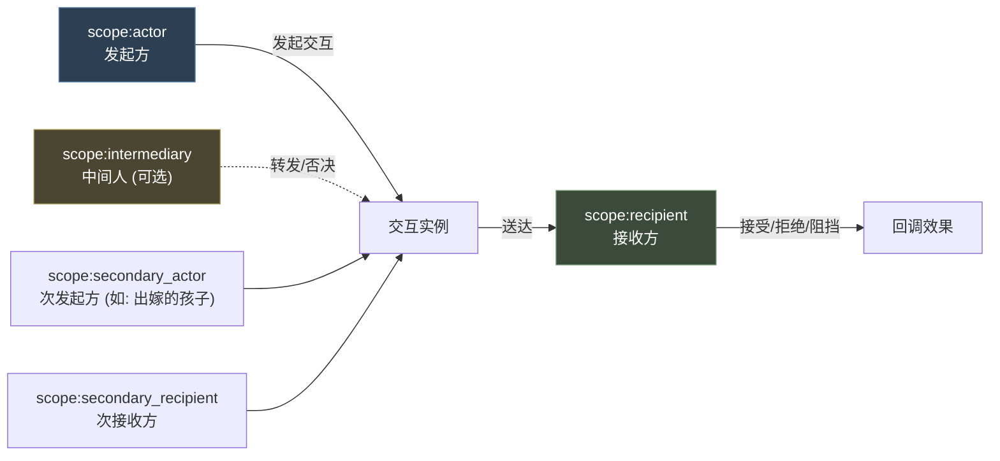
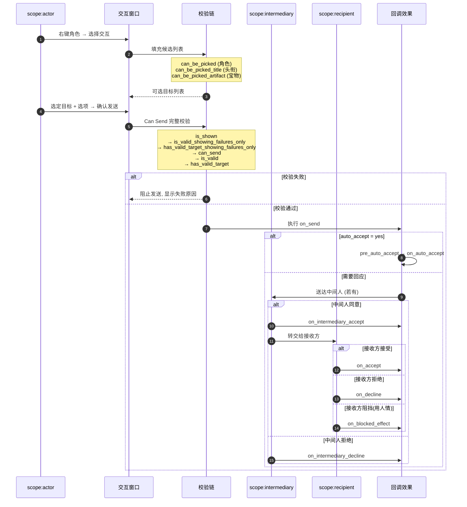
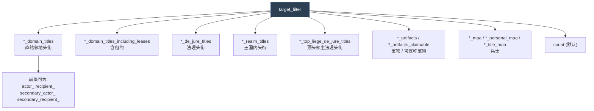
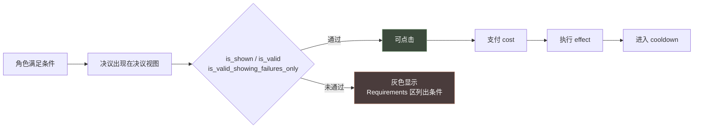
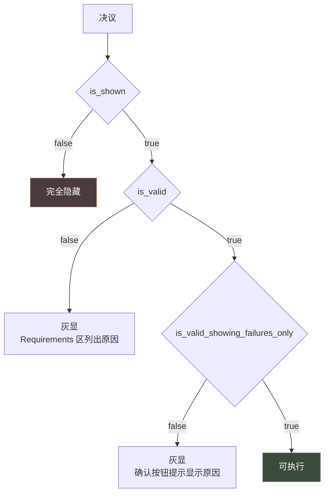

# 08 角色交互与决议

> 两个"玩家主动发起"的系统：**角色交互**需要对方回应，**决议**自己决定即可。

## 本篇导读

| 维度 | 角色交互 `character_interactions/` | 决议 `decisions/` |
|---|---|---|
| 绑定 | 角色 ↔ 角色 | 角色 |
| 需要对方同意 | **是**（除非 `auto_accept`） | 否 |
| 生命周期 | 一次性 | 一次性 |
| 成本 | 可在 `cost` 里扣 | `cost` / `minimum_cost` |
| AI 必填 | `ai_targets` + `ai_frequency` | `ai_check_interval` 或 `ai_goal` |

### 角色交互的五域模型

```
scope:actor              发起方
scope:recipient          接收方（决定接受 / 拒绝）
scope:secondary_actor    次发起方（如联姻中出嫁的孩子）
scope:secondary_recipient 次接收方
scope:intermediary       中间人（廷臣 / 配偶转发时才存在）
```

### 决议的条件三件套

`is_shown`（是否显示）→ `is_valid`（能否执行，列在 Requirements 区）→ `is_valid_showing_failures_only`（失败原因只塞进确认按钮 tooltip）。

## 文档关联

- **前置**：[03 触发器与效果](03-触发器与效果.md)、[06 事件系统与 on_action](06-事件系统与on_action.md)
- **同类**：[09 故事循环与局势](09-故事循环与局势.md)（长线系统）、[10 法律与继承](10-法律与继承.md)
- **选型**：[16 多系统选型指南与开发实践](16-多系统选型指南与开发实践.md)

## 目录

| 章 | 章节 |
|---|---|
| 第一章 角色交互 | 概念 · 五域模型 · 执行时序（11 步校验）· 8 类属性全表 · 赠送礼物实例 |
| 第二章 决议 | 概念 · Major vs Minor · 属性全表 · 真实示例 |

---

# 第一章 角色交互（Character Interaction）

## 1.1 概念

**角色交互 = 一个角色（actor）向另一个角色（recipient）发起的、需要对方回应的外交动作。**

它是 CK3 外交系统的骨架：联姻、送礼、授予头衔、要求臣服、派系邀请……全部由交互驱动。



**五个预置作用域**（这是交互系统最重要的约定）：

| 作用域 | 含义 | 备注 |
|---|---|---|
| `scope:actor` | 发起方 | 根域 |
| `scope:recipient` | 接收方 | 决定接受/拒绝 |
| `scope:secondary_actor` | 次发起方 | 如联姻中出嫁的孩子 |
| `scope:secondary_recipient` | 次接收方 | — |
| `scope:intermediary` | 中间人 | 廷臣/配偶转发时才存在 |

> 出处：`common/character_interactions/_character_interactions.info:281-289`
> ```
> # Effect changes character interaction scopes - replace any of actor, secondary actor, recipient,
> # secondary recipient and intermediary with any other character
> redirect = {}
> ```

## 1.2 执行时序



**官方定义的 Can Send 校验顺序**（`_character_interactions.info:679-691`）：

```
1. 检查是否已做好发送准备（所有目标与次角色都已选定）
2. 检查外交范围（若 use_diplomatic_range 未关闭）
3. special_interaction 决定的特殊 is_shown 检查
4. Trigger: is_shown
5. 检查接收方是否已在考虑另一个交互
6. Trigger: is_valid_showing_failures_only
7. Trigger: has_valid_target_showing_failures_only
8. Trigger: can_send
9. Trigger: is_valid
10. Trigger: has_valid_target
11. special_interaction 决定的特殊 can send 检查
```

> **关键约束**：需要对方接受的交互，**不能发给不会接受的 AI**。
> 官方原文第 691-692 行：
> "If it passes all the above, then we check if the interaction needs to be accepted... interactions that need acceptance cannot be sent to the ai unless it will accept."

## 1.3 属性全表

### ① UI 呈现

| 属性 | 作用 | 出处 |
|---|---|---|
| `category = interaction_category_hostile` | **必需**，菜单分类 | info:18 |
| `interface_priority = 65` | 排序权重，高者在前 | info:10 / gift:6 |
| `common_interaction = yes/no` | 常驻交互，不折叠进 "更多..." | info:14 / gift:5 |
| `filter_tags = { t1 t2 }` | 过滤标签，本地化用 `_filter_tag_desc` | info:26 |
| `icon = key` | 图标，默认取 `gfx/interface/icons/character_interactions/<key>.dds` | info:36 |
| `icon_small = path` | 小图标 | info:148 |
| `alert_icon = path` | 提醒图标 | info:144 |
| `extra_icon` / `should_use_extra_icon` | 附加图标（如"用人情"标志） | info:152-155 |
| `override_background = { reference = relaxing_room }` | 交互窗口背景，可用 trigger | info:46 |
| `interface = call_ally/marriage/grant_titles/...` | 指定专用界面 | info:68 |
| `special_interaction = type` | 特殊 GUI 类型 | info:61 |
| `custom_character_sort = { candidate_score governor_efficiency obedience merit }` | 自定义排序下拉，最后一个定义显示在最前 | info:79 |
| `prompt = loc_key` | 立绘下方的提示文字（如"选择监护人"） | info:195 |
| `hidden = yes` | 隐藏交互 | info:104 |
| `diarch_interaction = no` | 是否允许共治者使用 | info:140 |

### ② 目标选择

| 属性 | 作用 |
|---|---|
| `target_type = title/artifact/men_at_arms/court_position_type/count` | 目标类型，默认 `count`（角色） |
| `target_filter = <见下表>` | 目标过滤范围 |
| `populate_actor_list = {}` | 填充发起方候选列表 |
| `populate_recipient_list = {}` | 填充接收方候选列表 |
| `can_be_picked = trigger` | 该角色能否被选为目标 |
| `can_be_picked_title = trigger` | 该头衔能否被选 |
| `can_be_picked_artifact = trigger` | 该宝物能否被选 |
| `can_be_picked_regiment = trigger` | 该军团能否被选 |
| `secondary_scopes_optional = yes/no` | 次作用域是否可选 |
| `needs_recipient_to_open = yes` | 是否必须有接收方才开窗（**几乎不要改**） |

**`target_filter` 全部可选值**（info:610-643）：



### ③ 有效性判定

| 属性 | 作用 | 默认 |
|---|---|---|
| `is_available` | 对 actor 是否可用（AI 与玩家都判） | 恒真 |
| `is_shown` | 是否显示在菜单 | 恒真 |
| `is_valid_showing_failures_only` | 是否可点（只显示失败原因） | 恒真 |
| `is_valid` | 是否可点（详情视图 Requirements） | 恒真 |
| `has_valid_target_showing_failures_only` | 目标是否有效（只显示失败） | 恒真 |
| `has_valid_target` | 目标是否有效 | 恒真 |
| `can_send` | 能否发送 | 恒真 |
| `can_be_blocked` | 接收方能否用人情阻挡 | — |
| `is_highlighted` | 是否在菜单高亮 | — |
| `highlighted_reason` | 高亮提示（支持动态描述） | — |
| `needs_confirmation` | 是否需要确认窗（**已废弃**） | yes |

> **性能优化要点**（info:227-228）：
> "Avoid putting here triggers that only test actor or globally visible state. Put those triggers in is_available instead - this will make AI faster and better"
> —— 只测 actor 或全局状态的条件放 `is_available`，不要放 `is_shown`。

### ④ 接受度计算

| 属性 | 作用 |
|---|---|
| `auto_accept = yes/no/trigger` | 是否自动接受（跳过对方决策） |
| `ai_accept = mtth` | AI 是否接受（权重计算） |
| `ai_intermediary_accept = mtth` | 中间人是否转发 |
| `ai_maybe = yes` | AI 回答是否随机化 |
| `ai_intermediary_maybe = no` | 中间人回答是否随机化 |
| `ai_min_reply_days = 4` / `ai_max_reply_days = 9` | AI 回复延迟区间 |
| `ai_instant_response = yes/no` | AI 是否立刻回复 |
| `ai_accept_negotiation = yes/no` | 被拒后是否开启谈判（走事件链） |
| `can_send_despite_rejection = yes` | 明知会被拒也能发送 |

`ai_accept` 的 `modifier` 写法（出处 `00_character_interactions.txt:168`）：

```paradox
# PERKS
modifier = { # Perk boost
	desc = offer_vassalization_true_ruler_perk_tt
	add = 10
	<trigger>
}
modifier = {
	desc = "LOW_LEGITIMACY_REASON"
	factor = 0.5
	has_legitimacy_flag = very_reduced_vassalization_acceptance
}
```

> 每个 `modifier` 的 `desc` 会在 UI 上显示为**接受度明细条目**，这是交互系统的关键 UX 特性。

### ⑤ 回调效果（Effect 钩子）

| 钩子 | 触发时机 | 出处 |
|---|---|---|
| `on_send` | 交互发出时**立即**执行 | info:361 |
| `pre_auto_accept` | 自动接受时，**在其他副作用之前** | info:378 |
| `on_auto_accept` | 自动接受时 | info:382 |
| `on_intermediary_accept` | 中间人放行 | info:387 |
| `on_intermediary_decline` | 中间人拒绝（**接收方任何效果都不会执行**） | info:392 |
| `on_accept` | 接收方接受 | info:365 |
| `on_decline` | 接收方拒绝 | info:369 |
| `on_blocked_effect` | 接收方用人情阻挡 | info:373 |

> **注意 `on_auto_accept` 与 `on_accept` 不是互斥关系**：`on_auto_accept` 是额外执行的钩子。

### ⑥ 发送选项 `send_option`

```paradox
send_option = {
	is_shown = trigger           # 是否显示
	is_valid = trigger           # 是否可选
	current_description = desc   # 悬浮提示
	flag = flag_name             # 选中后 scope:flag_name 被设为 yes
	localization = loc_key       # 选项标签
	starts_enabled = trigger     # 打开时的默认状态
	can_be_changed = trigger     # 能否修改默认值
	can_invalidate_interaction = bool   # 让 AI 做完整校验（有性能代价，慎用）
}
send_options_exclusive = yes/no
options_heading = loc_key
```

> **官方警告**（info:349）："Options should avoid preventing an interaction from sending (except by the recipient refusing), as we assume that to be the case in the AI for performance reasons"
> 且非互斥选项**最多 4-5 个**同时通过 `is_shown`，否则损害 AI 性能。

### ⑦ AI 配置

```paradox
ai_targets = {
	ai_recipients = <列表类型>
	max = 10
	chance = 0.25           # 随机排除部分目标以省性能
	parameter = ""          # 仅 situation_participant_group 需要，填 situation key
}
ai_target_quick_trigger = {
	adult = yes
	attracted_to_owner = yes
	owner_attracted = yes
	prison = yes
}
ai_frequency = 42                    # 月
ai_frequency_by_tier = {             # 按最高头衔层级
	barony = 0   county = 10   duchy = 2
	kingdom = 1  empire = 1    hegemony = 1
}
ai_will_do = mtth                    # 0-100 百分比，会被 clamp
ai_set_target = {}
ai_potential = trigger               # 已废弃，改用 is_available
```

**`ai_recipients` 全部可选值**（info:714-755）：

| 类别 | 列表 |
|---|---|
| 关系 | `scripted_relations` `hooked_characters` `known_secrets` `contacts` `scheme_targets` |
| 地理 | `neighboring_rulers` `neighboring_rulers_including_tributary_borders` `neighboring_top_overlords_including_tributary_borders` `neighboring_top_overlords_connected_by_land` |
| 层级 | `liege` `top_liege` `vassals` `peer_vassals` `tributaries` `suzerain` `top_suzerain` `sub_realm_characters` `realm_characters` |
| 宫廷 | `courtiers` `councillors` `guests` `prisoners` |
| 亲缘 | `dynasty` `family` `children` `spouses` `self` |
| 宗教 | `head_of_faith` |
| 战争 | `primary_war_enemies` `war_enemies` `war_allies` |
| 活动 | `activity_host` `activity_guests` |
| 宅邸 | `domicile_location_top_ruler` `domicile_location_top_realm_vassals` `domicile_location_neighboring_top_rulers` `domicile_location_neighboring_top_realm_vassals` `top_realm_domicile_owners` `sub_realm_domicile_owners` `nearby_domicile_owners` |
| 邦联 | `confederation_house_heads` |
| 局势 | `situation_participant_group`（需 `parameter`） |

### ⑧ 冷却

```paradox
cooldown = { years = x }                        # 全局冷却
cooldown_against_recipient = { years = x }      # 针对该接收方的冷却
ignore_recipient_recieve_cooldown = trigger     # 什么情况下无视上述冷却
category_cooldown = { years = x }               # 同类别所有交互一起冷却
category_cooldown_against_recipient = { years = x }
```

> **冷却合并规则**：若交互已有冷却，取**较长的**那个。

### ⑨ 其他

| 属性 | 作用 |
|---|---|
| `use_diplomatic_range = yes/no/trigger` | 是否检查外交范围，默认 yes |
| `popup_on_receive = yes` | 接收方收到时弹窗 |
| `pause_on_receive = yes/no` | 收到时暂停游戏 |
| `force_notification = yes/no` | 即使 auto_accept 也强制产生外交条目 |
| `ignores_pending_interaction_block = yes` | 已有待回复交互时能否再发 |
| `scheme = elope/murder/etc.` | 该交互启动的计谋类型 |
| `show_effects_in_notification = no` | 是否在通知里显示效果 |
| `localization_values = {}` | 供本地化取值的域（如 `RANSOM_COST = scope:secondary_recipient.ransom_cost_value`） |
| `reply_item_key` / `answer_*_key` / `pre_answer_*_key` | 各类按钮与提示的本地化键 |
| `cost = { piety prestige gold renown }` | 发送成本，付不起则禁用 |
| `redirect = {}` | 重定向五个作用域中的任意一个 |

## 1.4 真实示例解析：赠送礼物

出处：`common/character_interactions/00_gift.txt`

```paradox
#Give characters money to improve their opinion of you
gift_interaction = {
	icon = icon_gold
	category = interaction_category_friendly
	common_interaction = yes
	interface_priority = 65
	desc = gift_interaction_desc

	greeting = positive
	notification_text = SEND_GIFT_PROPOSAL
	answer_accept_key = SEND_GIFT_ACCEPT
	answer_reject_key = SEND_GIFT_REJECT

	# ── AI 目标池（可定义多组）──
	ai_targets = {
		ai_recipients = scripted_relations
		ai_recipients = liege
		ai_recipients = head_of_faith
	}
	ai_targets = {
		ai_recipients = neighboring_rulers
		ai_recipients = peer_vassals
		max = 10
	}
	ai_target_quick_trigger = { adult = yes }
	ai_frequency_by_tier = {
		barony = 120   county = 60  duchy = 60
		kingdom = 36   empire = 36  hegemony = 36
	}

	# ── 显示条件 ──
	is_shown = {
		scope:recipient != scope:actor
		# 优先还债
		scope:actor = {
			trigger_if = {
				limit = {
					exists = var:loan_amount_owed
					exists = var:loan_holder
				}
				NOT = { var:loan_holder = scope:recipient }
			}
		}
	}

	# ── 高亮条件 ──
	is_highlighted = {
		scope:recipient = {
			OR = {
				house ?= {
					OR = {
						is_dominant_family = yes
						is_powerful_family = yes
					}
				}
			}
		}
	}
	highlighted_reason = HIGHLIGHTED_FAMILY_RATING

	# ── 可发送条件（只显示失败原因）──
	is_valid_showing_failures_only = {
		scope:actor.gold >= gift_value
		scope:recipient = {
			NOT = { is_imprisoned_by = scope:actor }
		}
	}

	# ── 自动接受时的额外钩子 ──
	on_auto_accept = {
		scope:recipient = { trigger_event = char_interaction.0100 }
	}

	# ── 接受后 ──
	on_accept = {
		scope:recipient = {
			# 验证是否能成为朋友
			if = {
				limit = {
					NAND = {
						has_relation_friend = scope:actor
						has_relation_lover = scope:actor
						has_relation_soulmate = scope:actor
						has_relation_best_friend = scope:actor
					}
				}
				gifting_leads_towards_friendship_effect = yes
			}
		}
		# 家族关系
		if = {
			limit = {
				scope:actor = { is_house_head = yes }
				scope:recipient = {
					is_house_head = yes
					NOT = {
						has_opinion_modifier = {
							target = scope:actor
							modifier = gift_opinion
						}
					}
				}
			}
			scope:recipient.house = {
				change_house_relation_effect = {
					HOUSE = scope:actor.house
					VALUE = house_relation_improve_medium_value
					REASON = sent_a_gift
					CHAR = scope:actor
					TARGET_CHAR = scope:recipient
					TITLE = scope:dummy_gender
				}
			}
		}
		scope:actor = {
			# 重复赠送警告
			if = {
				limit = {
					scope:recipient = {
						has_opinion_modifier = {
							target = scope:actor
							modifier = gift_opinion
						}
					}
				}
				custom_tooltip = ALREADY_SENT_GIFT_WARNING
			}

			send_interface_message = {
				type = event_gold_neutral
				title = gift_interaction_notification
				right_icon = scope:recipient
				pay_short_term_gold = {
					gold = gift_value
					target = scope:recipient
				}
				stress_impact = { greedy = medium_stress_impact_gain }
				...
			}
			...
		}
	}
}
```

**要点解读**：

1. `ai_targets` 定义了**三组**目标池，AI 会分别考虑
2. `ai_frequency_by_tier` 让小领主更少送礼（barony 120 个月 vs kingdom 36 个月）
3. `is_shown` 里用 `trigger_if` 做了"优先还债"的嵌套条件
4. `house ?=` 是弱比较 —— 家族不存在时返回假而不报错
5. `on_accept` 里同时动用了 `custom_tooltip`、`send_interface_message`、`pay_short_term_gold`

---

# 第二章 决议（Decision）

## 2.1 概念

**决议 = 角色主动发起的一次性大额动作，无需他人同意。**

与交互的最大区别：**决议是单向的**。建国、改宗、修奇观、举办大典，都是决议。



## 2.2 Major vs Minor

官方原文（`_decisions.info:5-6`）：

> "Major decisions are highlighted in the list, and will be considered important by default.
> Important decisions will spawn an Action when they can be taken. The player can change whether or not a decision type is important to them."

| | Major | Minor |
|---|---|---|
| 归属 | `decision_group_type = major` | 默认 `decisions` |
| 显示 | 列表中**高亮** | 普通 |
| 提醒 | 默认"重要"，可触发 Action 提醒 | 无 |
| 典型 | 建立帝国、改革信仰 | 举办宴会、日常决策 |

## 2.3 属性全表

### ① 文本与呈现

| 属性 | 说明 | 默认值 |
|---|---|---|
| `title = <key> \| { ... }` | 标题 | `<key>` |
| `desc = <key> \| { ... }` | 描述 | `<key>_desc` |
| `selection_tooltip = <key> \| { ... }` | 列表选中时的提示 | `<key>_tooltip` |
| `confirm_text = <key> \| { ... }` | 确认按钮文本 | `<key>_confirm` |
| `picture = { trigger = {} reference = "" soundeffect = "" }` | 插图，可多个，**取第一个 trigger 通过的** | — |
| `extra_picture = "x.dds"` | 附加图（如 Struggle 决议按钮） | — |
| `decision_group_type = <key>` | 可折叠分组 | `decisions` |
| `sort_order = integer` | 排序，大者在前 | 定义顺序 |

> **重要**：`title` / `desc` / `selection_tooltip` / `confirm_text` **全部支持动态描述**（`first_valid` / `triggered_desc` / `random_valid` / `switch`），作用域是**角色**。

```paradox
desc = {
	first_valid = {
		triggered_desc = { trigger = { has_trait = brave }  desc = my_decision_brave_desc }
		desc = my_decision_fallback_desc
	}
}
```

### ② 条件三件套

| 属性 | 作用 | 默认 |
|---|---|---|
| `is_shown` | 是否显示给该角色 | `{ always = yes }` |
| `is_valid_showing_failures_only` | 能否执行（失败原因显示在**确认按钮提示**里） | `{ always = yes }` |
| `is_valid` | 能否执行（条件显示在详情视图的 **Requirements** 区） | `{ always = yes }` |
| `should_create_alert` | 是否为其产生提醒（叠加在常规要求之上） | — |

**三者分工图**：



> **`is_valid` vs `is_valid_showing_failures_only` 的区别**：
> - `is_valid` —— 条件列在详情视图的 Requirements 区，**玩家看得到完整说明**
> - `is_valid_showing_failures_only` —— 只把失败原因塞在确认按钮的 tooltip 里
>
> 用法惯例：需要长文本解释的放 `is_valid`；只是"你钱不够"这类放 `is_valid_showing_failures_only`。

### ③ 成本

```paradox
cost = {           # 会被实际扣除
	gold = 42
	piety = 42
	prestige = 42
}
minimum_cost = {}  # 不实际扣除，但付不起就禁止执行
```

> `minimum_cost` 的用途（info:134）："For use in places that apply the cost after the fact based on player input and the like"
> —— 成本要在玩家做出选择之后才计算的情况。

### ④ 效果

```paradox
effect = { ... }   # 作用域 = 角色
```

### ⑤ AI 配置

| 属性 | 说明 |
|---|---|
| `ai_potential = { ... }` | AI 是否考虑该决议（Trigger） |
| `ai_will_do = { ... }` | **返回 0-100 的执行概率**；同时也决定**玩家的默认选项** |
| `ai_check_interval = 42` | 每多少个月检查一次；`0` = 永不检查 |
| `ai_check_interval_by_tier = { barony/county/duchy/kingdom/empire/hegemony = N }` | 按头衔层级 |
| `ai_goal = yes/no` | 视为"目标"，与建国、建造同级做预算；**忽略 `ai_check_interval`** |

> **必填约束**（info:109）："`ai_check_interval` Has to be set (or `ai_check_interval_by_tier`), except if `ai_goal = yes` is set."
> 两个都不写 → 报错。
>
> **`ai_goal` 的性能警告**（info:107）："It is less performant than using a high `ai_check_interval`... Should only be used for things with such major costs that budgeting for it is important"
> —— 只给真正需要存钱的大额决议用。

### ⑥ 进度与建议（Ruler Objective）

```paradox
progress = <scripted value>        # 0-100，进度条

advice = {
	region = <geographical region>
	per_title_hint = {
		is_valid      = { debug_only = <yes/no> }
		is_doing      = { always = <yes/no> }   # 结果存入 scope:doing
		relevance     = <script value>           # 相关性，低于 ADVICE_RELEVANCE_LIMIT 则忽略
		summary       = <dynamic desc>           # 按钮上的短文案
		description   = <dynamic desc>           # 详细说明
	}
}
```

> 注：`per_title_hint` 官方已标记 **Deprecated**（info:65），建议迁移到 ruler objective type database。

### ⑦ 自定义部件 Widget

```paradox
widget = {
	gui = "<widget_name>"               # 位于 <decision_view_widgets>/<widget_name>.gui
	controller = "<controller_type>"    # 默认 default
	show_from_start = yes

	item = {                            # 仅 controller = decision_option_list_controller
		value = entry_name              # 在 effect 中引用
		is_shown = trigger
		is_valid = trigger
		current_description = desc
		localization = loc_key
		is_default = bool
		icon = "icon/file/path.dds"
		flat = no
		ai_chance = score               # 取最高分，不随机
	}
}
widget = "<controller_type>"            # 简写
```

**可用控制器**（info:186-190）：

| Controller Type | Data Context Name | 说明 |
|---|---|---|
| `default` | `EventWindowWidget` | 默认，无特殊行为 |
| `create_holy_order` | `DecisionViewWidgetCreateHolyOrder` | 定制新骑士团 |
| `decision_option_list_controller` | `DecisionViewWidgetOptionList` | 选项列表，通过 flag 传给 effect |

> **`ai_chance` 的重要说明**（info:167-169）：
> "The highest scoring item is selected - there is no randomization. This is also used to select the default option for players. To get a proper 'decision available' notification for each item, make sure that the item has the highest score if it is available!"

## 2.4 真实示例

出处：`common/decisions/dlc_decisions/tgp/tgp_tribute_mission_decisions.txt`

```paradox
tribute_mission_decision_mandala = {
	picture = {
		reference = "gfx/interface/illustrations/decisions/xxx.dds"
	}
	desc = tribute_mission_decision_desc_mandala
	cooldown = { years = 5 }

	is_shown = {
		...
	}

	effect = {
		...
	}

	ai_potential = {
		...
	}
	ai_will_do = {
		base = 0
		modifier = { add = 10  <trigger> }
	}
}
```

---
