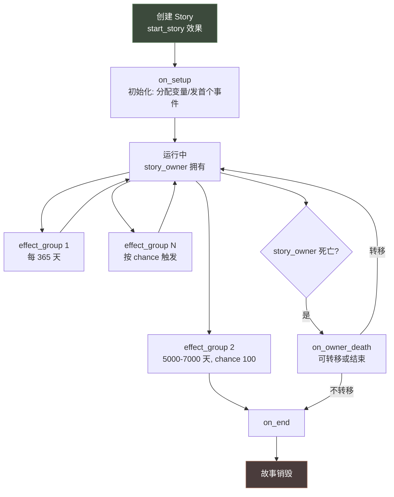
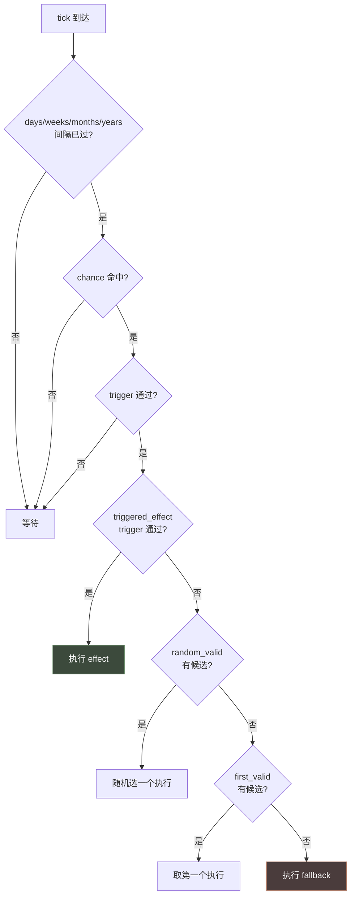
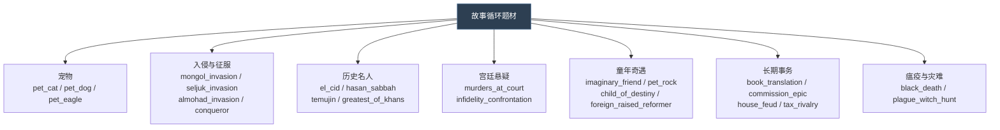
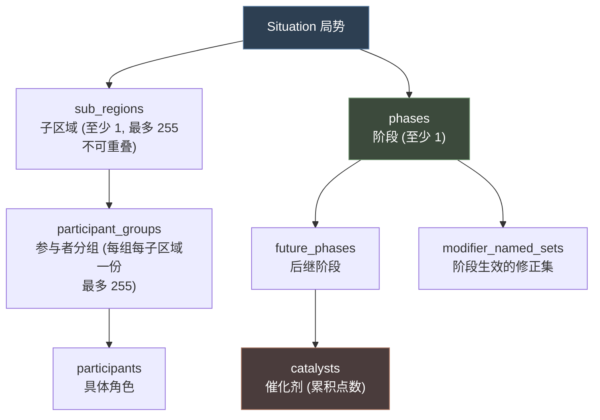
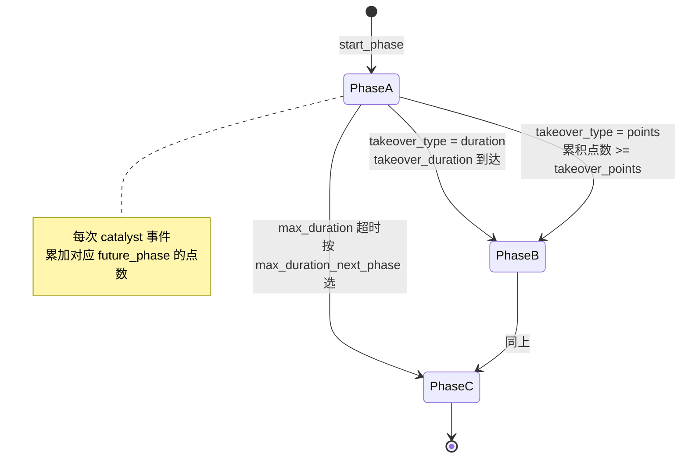
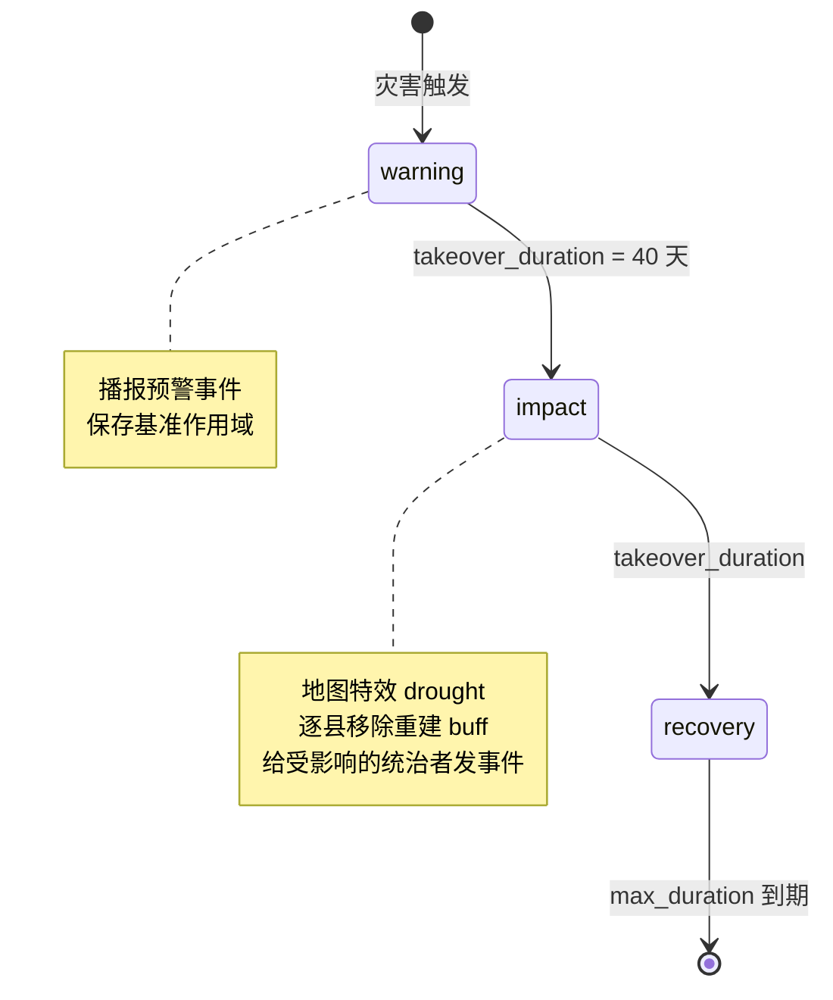

# 09 故事循环与局势

> 两个**长线容器**系统：**故事循环**绑角色、**局势**绑地理区域。

## 本篇导读

| 维度 | 故事循环 `story_cycles/` | 局势 `situation/` |
|---|---|---|
| 绑定对象 | **角色**（`story_owner`） | **地理区域**（`sub_regions`） |
| 推进方式 | 自带 `effect_group` **定时脉冲** | **阶段 `phase` 转移** |
| 状态存储 | 变量 + 专门的 Story 域 | 阶段 + 催化剂点数 |
| 可视化 | 侧栏故事条目 | 局势窗口 + 地图模式 |
| 多角色 | owner 单人驱动 | 参与者分组（多组） |

### 两者的共同点

都需要**兜底路径**：故事循环的 `icon` 最后放 `always = yes`；局势的 `future_phases` 需要 `max_duration_next_phase` 兜底。

## 文档关联

- **前置**：[03 触发器与效果](03-触发器与效果.md)、[06 事件系统与 on_action](06-事件系统与on_action.md)
- **同类**：[08 角色交互与决议](08-角色交互与决议.md)（一次性系统）
- **对照**：[12 活动与战争](12-活动与战争.md)（同样是"阶段"概念，但活动是演出、局势是区域状态）

## 目录

| 章 | 章节 |
|---|---|
| 第一章 故事循环 | 概念 · 特殊作用域 · 属性全表 · `effect_group` 定时脉冲 · 宠物猫实例 · 题材分类 |
| 第二章 局势 | 概念 · 三层嵌套 · 全局属性 · `sub_regions` · `participant_groups` · `phases` 与接管 · 催化剂 · 大草原与自然灾害实例 · 专属语法 |

---

# 第一章 故事循环（Story Cycle）

## 1.1 概念

**故事循环 = 挂在角色身上的、自带定时器的长线剧情容器。**

它与"事件"的区别：

| | 事件 Event | 故事循环 Story Cycle |
|---|---|---|
| 生命周期 | 一次性 | **长期存在**，直到 `end_story` |
| 驱动方式 | 外部触发 | **自带 `effect_group` 定时器** |
| 状态存储 | 靠变量 | 靠变量 + 专门的 Story 域 |
| 可视化 | 事件窗口 | **侧栏故事条目**（icon + 进度 + 参与角色） |
| 所有者 | root | `story_owner`，死亡可转移 |



## 1.2 特殊作用域

| 域 | 含义 | 出处 |
|---|---|---|
| `root` | 活跃的 story cycle 本体 | info:6 |
| `scope:story` | 同 `root` | info:7 |
| `story_owner` | 故事的所有者（角色） | 实证 `story_cycle_pet_cat.txt:69` |

```paradox
# 出处: story_cycle_pet_cat.txt:69
story_owner = { exists = var:cat_eye_color }
story_owner = { var:cat_eye_color = flag:blue }
story_owner = { add_character_flag = is_naming_cat }
```

## 1.3 属性全表

### ① 生命周期钩子

| 钩子 | 时机 | 作用域 |
|---|---|---|
| `on_setup = {}` | 刚被创建时 | root / scope:story |
| `on_end = {}` | 被 `end_story` 结束时 | root / scope:story |
| `on_owner_death = {}` | 所有者死亡时（**适合转移所有者**） | root / scope:story |

### ② 外观

```paradox
visible = yes/no          # 是否在界面显示，默认 no

icon = {                  # 可重复，取第一个 trigger 通过的
	trigger = {}
	reference = "gfx/interface/icons/story_cycles/xxx.dds"
}
# 若未定义，默认查找 gfx/interface/icons/story_cycles/<story_cycle_key>.dds

background = {
	trigger = {}
	reference = "gfx/interface/illustrations/event_scenes/xxx.dds"
}
# 若未定义，使用 00_graphics.txt 中 STORY_CYCLE_TYPE_FALLBACK_BACKGROUND
```

### ③ `visualization` —— 侧栏展示

```paradox
visualization = {
	# 从 Story 域上的变量取角色/头衔/宝物展示
	character      = { variable_name = "cool_dude_1"       label = "COOL_DUDE" }
	character_list = { variable_name = "list_of_cool_dudes" label = "COOL_DUDES" }
	title          = { ... }
	title_list     = { ... }
	artifact       = { ... }
	artifact_list  = { ... }

	# 自定义字符串（可用 STORY 域）
	custom_string_key = "LOC_KEY"

	# 计数器可视化
	basic_counter = {
		variable_name = "some_value_variable"
		min = 0   max = 10
		label = "MY_COOL_VALUE"
		min_label = "MIN_VALUE_LABEL"
		max_label = "MAX_VALUE_LABEL"
	}
	tug_of_war_counter = {      # 拉锯条，可为负
		variable_name = "some_value_variable"
		min = -10  max = 10
		...
	}

	# 展示关联内容
	decisions = { decision_1 decision_2 }
	modifiers = { modifier_1 modifier_2 }
	traits    = { trait_1 trait_2 }
}
```

> **注意**：变量名必须匹配类型，否则**不显示并抛错**（info:66-67）。

### ④ `effect_group` —— 定时脉冲（核心机制）

```paradox
effect_group = {
	# 间隔：固定值 或 随机范围
	days/weeks/months/years = <int>/{<int> <int>}

	# 触发概率 [0..100]，不填 = 必定触发
	# 未命中则在下一个 tick 再次尝试
	chance = <fixed_point>

	# 整体前置条件（root / scope:story）
	trigger = {}

	# 单分支：只有一条 trigger 通过才执行
	triggered_effect = {
		trigger = {}
		effect = {}
	}

	# 随机选一个有效的执行
	random_valid = {
		triggered_effect = {}
		triggered_effect = {}
	}

	# 取第一个有效的执行
	first_valid = {
		triggered_effect = {}
		triggered_effect = {}
	}

	# 以上都没触发时才执行
	fallback = {}
}
```



> **关键语义**：
> - `chance` 未命中**不会跳过整个 group**，只是"本次不触发，下次 tick 再试"
> - `triggered_effect` **只能有一条**（info:131："Only one independent triggered_effect can be defined"）
> - `random_valid` 与 `first_valid` 里可以放**任意多条** `triggered_effect`
> - `fallback` 仅当上述都没触发时执行

## 1.4 真实示例解析：宠物猫

出处：`common/story_cycles/story_cycle_pet_cat.txt`

```paradox
story_cycle_pet_cat = {
	visible = yes

	# ── 条件化图标：按毛色选图 ──
	icon = {
		trigger = { var:cat_fur_color ?= flag:orange }
		reference = "gfx/interface/icons/pets/artifact_cat_ginger.dds"
	}
	icon = {
		trigger = { var:cat_fur_color ?= flag:black }
		reference = "gfx/interface/icons/pets/artifact_cat_black.dds"
	}
	# ... brown / gray / white ...
	icon = {
		trigger = { always = yes }          # 兜底
		reference = "gfx/interface/icons/pets/artifact_cat_calico.dds"
	}

	background = {
		reference = "gfx/interface/illustrations/event_scenes/garden.dds"
	}

	# ── 侧栏展示 ──
	visualization = {
		custom_string_key = "CAT_INFORMATION_STRING"
		modifiers = {
			cat_story_modifier
			cat_story_allergy_modifier
			rat_hunting_cat_modifier
			adventurous_pet_modifier
			# ... 共 13 个
		}
		decisions = { pet_cat_decision }
	}

	# ── 创建时初始化 ──
	on_setup = {
		assign_cat_gender_effect = { GENDER = random }
		assign_cat_fur_color_effect = { COLOR = random }

		# 眼睛颜色是否已指定？
		if = {
			limit = { story_owner = { exists = var:cat_eye_color } }
			if = {
				limit = { story_owner = { var:cat_eye_color = flag:blue } }
				assign_cat_eye_color_effect = { COLOR = blue }
			}
			else_if = {
				limit = { story_owner = { var:cat_eye_color = flag:yellow } }
				assign_cat_eye_color_effect = { COLOR = yellow }
			}
			# ... copper / emerald ...
		}
		else = {
			assign_cat_eye_color_effect = { COLOR = random }
		}

		set_variable = { name = cat_age_variable  value = 0 }

		story_owner = {
			add_character_modifier = { modifier = cat_story_modifier }
			add_character_flag = had_cat_story
			# 已经有过敏 modifier 则重置
			if = {
				limit = { has_character_modifier = cat_story_allergy_modifier }
				remove_character_modifier = cat_story_allergy_modifier
				add_character_modifier = { modifier = cat_story_allergy_modifier }
			}
		}

		# 给猫起名！
		if = {
			limit = {
				story_owner = { NOT = { has_character_flag = is_naming_cat } }
				NOT = { exists = story_owner.var:story_cycle_cat_name }
			}
			story_owner = {
				add_character_flag = is_naming_cat
				trigger_event = { id = pet_animal.0001  days = 2 }
			}
		}
	}

	# ── 结束清理 ──
	on_end = {
		story_owner = {
			remove_cat_story_modifiers_effect = yes
			remove_cat_name_effect = yes
		}
	}

	# ── 所有者死亡则结束 ──
	on_owner_death = {
		scope:story = { end_story = yes }
	}

	# ── 定时器 1：猫每年长大一岁 ──
	effect_group = {
		days = 365
		trigger = { exists = var:cat_age_variable }
		triggered_effect = {
			trigger = { always = yes }
			effect = {
				change_variable = { name = cat_age_variable  add = 1 }
			}
		}
	}

	# ── 定时器 2：猫的寿命到了 ──
	effect_group = {
		days = { 5000 7000 }
		chance = 100
		triggered_effect = {
			trigger = { exists = story_owner.var:story_cycle_cat_name }
			# ... 触发死亡事件 / end_story ...
		}
	}
}
```

**设计要点**：

1. **条件化图标**：多个 `icon` 块按 trigger 择优，最后放 `always = yes` 兜底
2. **`visualization` 汇总**：把散落各处的 modifier 与 decision 集中展示
3. **参数化脚本效果**：`assign_cat_eye_color_effect = { COLOR = blue }` 用 `$PARAM$` 机制
4. **双定时器**：一个年度递增年龄，一个随机天数决定寿命
5. **`on_owner_death` 结束**：猫随主人而去

## 1.5 常见故事循环题材

原版 51 个故事循环可归为几类：



---

# 第二章 局势（Situation）

## 2.1 概念

**局势 = 绑定在地理区域上的、有阶段（phase）推进的、多角色参与的长线系统。**

它与故事循环的关键区别：**局势绑区域，故事循环绑角色**。



**三层嵌套关系**：

```
局势 (Situation)
├── 子区域 A (sub_region)  ── 有自己的当前阶段
│   ├── 参与者组 1 (participant_group)
│   │   ├── 角色甲
│   │   └── 角色乙
│   └── 参与者组 2
│       └── 角色丙
└── 子区域 B (sub_region)  ── 有自己的当前阶段
    └── ...
```

> **关键**：每个子区域**独立推进阶段**，但用的是同一套 phases 定义与流转规则。

## 2.2 全局属性

### ① 窗口与外观

```paradox
window = situation / the_great_steppe / silk_road / dynastic_cycle   # 代码功能集
gui_window_name = "window_situation"                                  # GUI 文件
gui_participation_window_name = "window_situation_participation"
gui_tooltip_group_focused = no        # 提示按参与者组显示而非修正集
illustration = "path/to/image.dds"

icon = {
	trigger = { ... }                 # 基于 Situation 域
	reference = "icon_path.dds"
}

situation_group_type = <key>          # 可折叠分组，默认 minor
sort_order = integer                  # 组内排序，大者在前，默认 0
map_mode = participant_groups / sub_regions    # 地图模式，默认 participant_groups
```

### ② 参与与唯一性

```paradox
is_unique = yes/no          # 全世界只能存在一个，可用 scope `situation:<type_name>` 直接访问
keep_full_history = yes/no  # 保留完整催化剂历史（数据量大，按需开启）
migration = yes/no          # 启用迁徙 AI
start_phase = my_phase_key  # 创建时未指定阶段则用这个
use_situation_phase_flat_icons = yes/no
```

### ③ 生命周期钩子

| 钩子 | 时机 | 作用域 |
|---|---|---|
| `on_start = {}` | 局势启动且初始设置完成后 | root = situation |
| `on_end = {}` | 局势结束 | root = situation |
| `on_monthly = {}` | 每月 | root = situation |
| `on_yearly = {}` | 每年 | root = situation |
| `on_join = {}` | 角色加入 | root = **character** |
| `on_leave = {}` | 角色离开（**局势结束时不触发**） | root = **character** |

## 2.3 子区域 `sub_regions`

```paradox
sub_regions = {
	my_sub_region_key = {
		illustration = "path/to/image.dds"      # 可选
		icon = "path/to/image.dds"              # 可选
		map_color = { 1 0.5 0.2 }               # 可选
		geographical_regions = {
			world_mesopotamia
			special_mongol_empire_start_region
		}
	}
}
```

> 约束：**至少 1 个**，**最多 255 个**，**不可重叠**。

## 2.4 参与者分组 `participant_groups`

```paradox
participant_groups = {
	my_group_key = {
		icon = "path/to/image.dds"
		map_color = { 1 0.5 0.2 }

		# 自动纳入规则
		auto_add_rulers = yes            # 自动考虑子区域内的所有统治者，默认 yes
		auto_add_landless_rulers = yes   # 自动考虑宅邸在子区域内的无地者，默认 yes

		# 地理要求
		require_capital_in_sub_region = no      # 首都要在区域内？默认 no
		require_domain_in_sub_region = no       # 直辖要在区域内？默认 no
		require_realm_in_sub_region = yes       # 王国要在区域内？默认 yes
		require_domicile_in_sub_region = no     # 宅邸要在区域内？默认 no

		# 有效性判定
		is_character_valid = {}    # root = character
		                           # scope:situation
		                           # scope:situation_sub_region

		# 回调
		on_join = {}               # root = character，另有 scope:situation_participant_group
		on_leave = {}              # 局势结束时不触发
	}
}
```

> **分组归属规则**（info:102）："Characters being considered for participation will be placed in the **first** group they are valid for."
> —— 按定义顺序，第一个满足的组胜出。

## 2.5 阶段 `phases`（核心机制）

```paradox
phases = {
	my_phase_key = {
		parameters = {                  # 任意参数，GUI 用 SituationPhaseType.HasParameter('x')
			some_parameter = yes        # 本地化需 "situation_parameter_<key>"
		}

		illustration = "path/to/image.dds"
		icon = "path/to/image.dds"

		map_province_effect = map_province_effect_key     # 地图省份特效
		map_province_effect_intensity = 1.0               # 0.0-1.0

		# 阶段起始/结束
		on_start = {}    # root = situation, scope:situation_sub_region
		on_end = {}      # 下一阶段已确定后执行

		# 最大时长（超时后按 max_duration_next_phase 选下一阶段）
		max_duration = { days = 1234 }      # root = situation
		max_duration_next_phase = weighted_random_points

		future_phases = { ... }             # 见下

		modifier_named_sets = { ... }       # 见下
	}
}
```

### ① `max_duration_next_phase` 的选择策略

| 值 | 行为 |
|---|---|
| `highest_points`（默认） | 选 `future_phases` 中累积**点数最高**的 |
| `weighted_random_points` | 按当前点数**加权随机** |
| `random_non_takeover` | 等权重随机，只从 `takeover_type = none` 的里选 |
| `weighted_non_takover` | 选 `weight` **值最高**的 |

### ② `future_phases` 与接管

```paradox
future_phases = {
	my_future_phase_key = {
		# 接管方式
		takeover_type = none / points / duration     # 默认 none

		# 方式 A：累积催化剂点数达标则接管
		takeover_points = 1234

		# 方式 B：当前阶段已持续某时长则接管
		takeover_duration = { days = 1234 }          # 不能与 takeover_points 同用

		# 权重（用于 weighted_non_takover / weighted_random_points）
		weight = 10

		# 哪些催化剂贡献点数
		catalysts = {
			catalyst_betrayed_alliance = 25
			catalyst_something_something = 30
		}
	}
}
```



### ③ 催化剂 `catalysts`

定义目录：`common/situation/catalysts/`

官方定义（`_catalysts.info` 全文）：

```paradox
##############################################################
# Catalysts
##############################################################

catalyst_name = {
	# No entries required inside, we only need the name to have a database entry and to use catalysts in the situation database
}
```

> **催化剂是一个空壳数据库对象** —— 只需要"存在"这个条目，脚本里通过 `add_catalyst` 之类的效果累积点数，再由 `future_phases.catalysts` 映射成点数权重。

### ④ `modifier_named_sets`

```paradox
modifier_named_sets = {
	war_effects_and_stuff_set = {        # 名字即本地化键
		icon = "path/to/image.dds"

		# 作用于所有参与者组
		all = {
			county_modifier = {}
			character_modifier = {}
			parameters = {}
			doctrine_character_modifier = {}
		}

		# 作用于特定参与者组
		my_participant_group_type_key = {
			character_modifier = {}              # 角色修正
			county_modifier = {}                 # 直辖伯爵领修正
			parameters = {
				cheaper_to_convert_to_struggle_faith = yes
				county_faith_conversion_in_region_proceeds_faster = yes
			}

			# 按教义施加不同修正（可多条）
			doctrine_character_modifier = {
				name = name_of_doctrine_localization_key
				doctrine = doctrine_theocracy_lay_clergy
				same_faith_opinion = 3
			}
			doctrine_character_modifier = {
				name = name_of_other_doctrine_localization_key
				doctrine = doctrine_theocracy_temporal
				same_faith_opinion = -3
			}
		}
	}
}
```

## 2.6 真实示例解析：大草原

出处：`common/situation/situations/the_great_steppe.txt`

```paradox
the_great_steppe = {
	illustration = "gfx/interface/illustrations/event_story/mpo_steppe_region.dds"
	situation_group_type = major

	window = the_great_steppe
	gui_window_name = "window_the_great_steppe"
	map_mode = sub_regions

	is_unique = yes       # 全世界只有一个，可用 situation:the_great_steppe 访问
	migration = yes

	##################################################
	# Regions
	##################################################
	sub_regions = {
		steppe_west = {
			map_color = { 205 169 0 }
			geographical_regions = { world_steppe_west }
		}
		steppe_central = {
			map_color = { 14 122 25 }
			geographical_regions = { world_steppe_central dlc_mpo_steppe_central_siberia_addon }
		}
		steppe_east = {
			map_color = { 10 47 202 }
			geographical_regions = {
				world_steppe_east
				dlc_mpo_steppe_east_buryatia_addon
				dlc_mpo_steppe_east_andong_addon
				dlc_mpo_steppe_east_china_addon
			}
		}
	}

	##################################################
	# On Actions
	##################################################
	on_monthly = {
		trigger_event = { on_action = mpo_the_great_steppe_monthly_pulse }
	}
	on_yearly = {
		trigger_event = { on_action = mpo_the_great_steppe_yearly_pulse }
		trigger_event = { on_action = mpo_generic_nomadic_region_yearly_pulse }
	}

	##################################################
	# Groups
	##################################################
	participant_groups = {
		nomad_rulers_capital = {
			require_capital_in_sub_region = yes
			auto_add_landless_rulers = no

			is_character_valid = {
				has_government = nomad_government
				highest_held_title_tier >= tier_county
			}

			on_join = {
				if = {
					limit = {
						is_ai = no
						NOT = { has_character_flag = mpo_the_great_steppe_events_0001_var }
					}
					trigger_event = mpo_the_great_steppe.0001
				}
			}

			map_color = { 255 127 80 }
		}

		nomad_rulers_realm = {
			require_capital_in_sub_region = no
			# ...
		}
	}
}
```

## 2.7 真实示例解析：自然灾害的 phase 流转

出处：`common/situation/situations/tgp_natural_disaster.txt:96`

```paradox
phases = {
	warning = {
		max_duration = { days = 40 }
		icon = "gfx/interface/icons/icon_event_effect.dds"
		illustration = "gfx/interface/illustrations/event_scenes/mountains.dds"
		on_start = {
			natural_disaster_save_base_scopes_effect = yes
			natural_disaster_fire_warning_event_effect = yes
		}
		future_phases = {
			impact = {
				takeover_type = duration
				takeover_duration = { days = 40 }
			}
		}
	}

	impact = {
		max_duration = { days = 30 }
		icon = "gfx/interface/icons/situation_types/natural_disaster_earthquake.dds"
		illustration = "gfx/interface/illustrations/situation_phase/impact.dds"
		map_province_effect = drought
		map_province_effect_intensity = 1.0
		on_start = {
			natural_disaster_save_base_scopes_effect = yes
			# Do not change order
			every_situation_county = {
				remove_county_modifier = tgp_natural_disaster_reconstruction_development_growth
			}
			situation_participant_group:affected_ruler = {
				every_situation_group_participant = { trigger_event = natural_disaster.5901 }
			}
			natural_disaster_fire_spaced_impact_events_effect = yes
		}
		modifier_sets = {
			impact_effects = {
				icon = "gfx/interface/icons/modifiers/county_modifier_development_negative.dds"
			}
		}
		future_phases = {
			recovery = {
				takeover_type = duration
				...
			}
		}
	}
	# recovery ...
}
```



**要点解读**：

1. `warning → impact → recovery` 是**纯 duration 驱动**的线性流程
2. `every_situation_county` / `situation_participant_group:<key>` / `every_situation_group_participant` 是**局势专属迭代器**
3. `map_province_effect = drought` 让地图上有视觉表现
4. 注释 `# Do not change order` 强调效果执行顺序敏感

## 2.8 局势专属语法

| 语法 | 含义 |
|---|---|
| `situation:<type_name>` | 访问唯一局势（`is_unique = yes` 时） |
| `scope:situation` | 当前局势 |
| `scope:situation_sub_region` | 当前子区域 |
| `scope:situation_participant_group` | 当前参与者组 |
| `situation_participant_group:<key>` | 按 key 访问参与者组 |
| `every_situation_county` | 遍历局势内所有伯爵领 |
| `every_situation_group_participant` | 遍历该组内所有参与者 |
| `Situation.GetIcon` / `SituationSubRegion.GetIllustration` / `SituationPhaseType.GetIllustration` | GUI 取值 |

---
