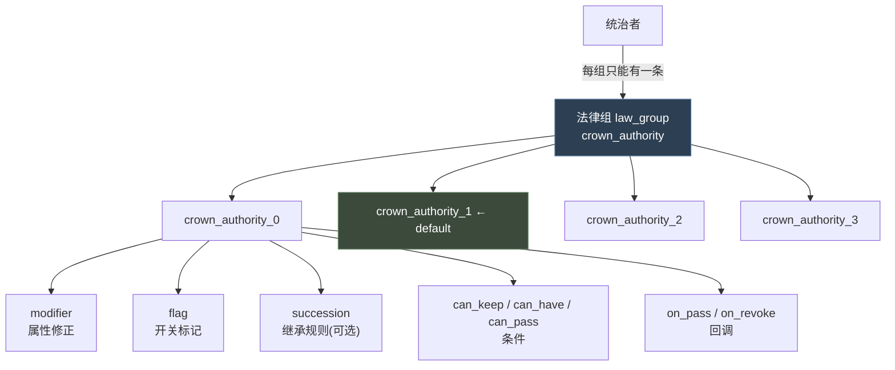
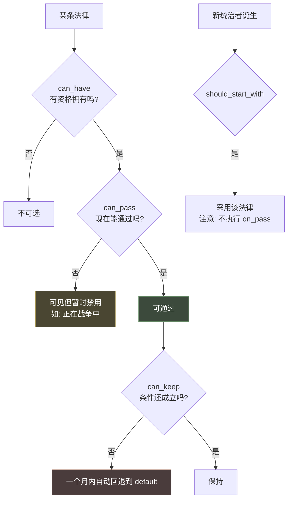
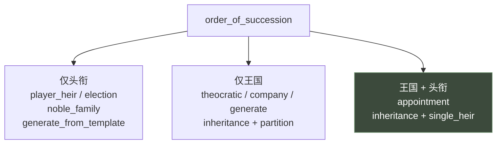
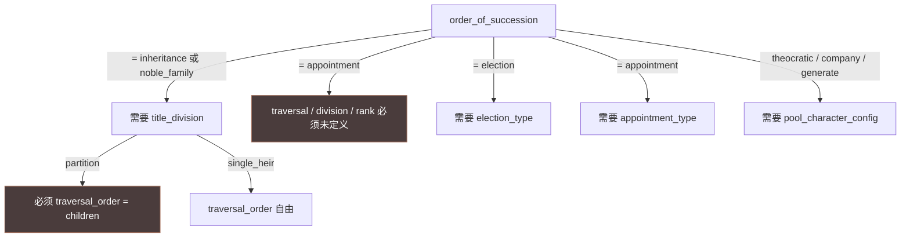
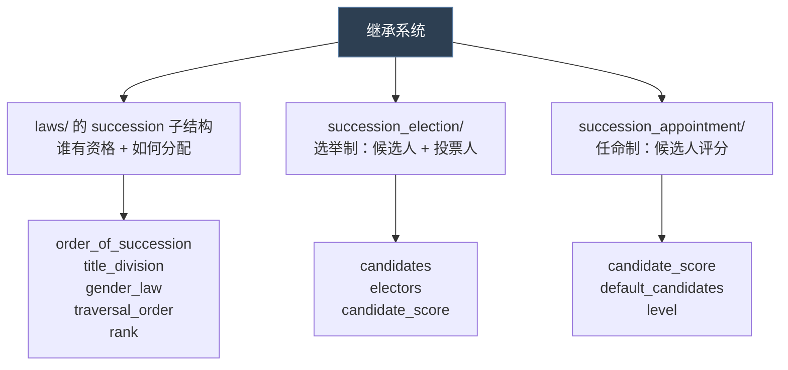
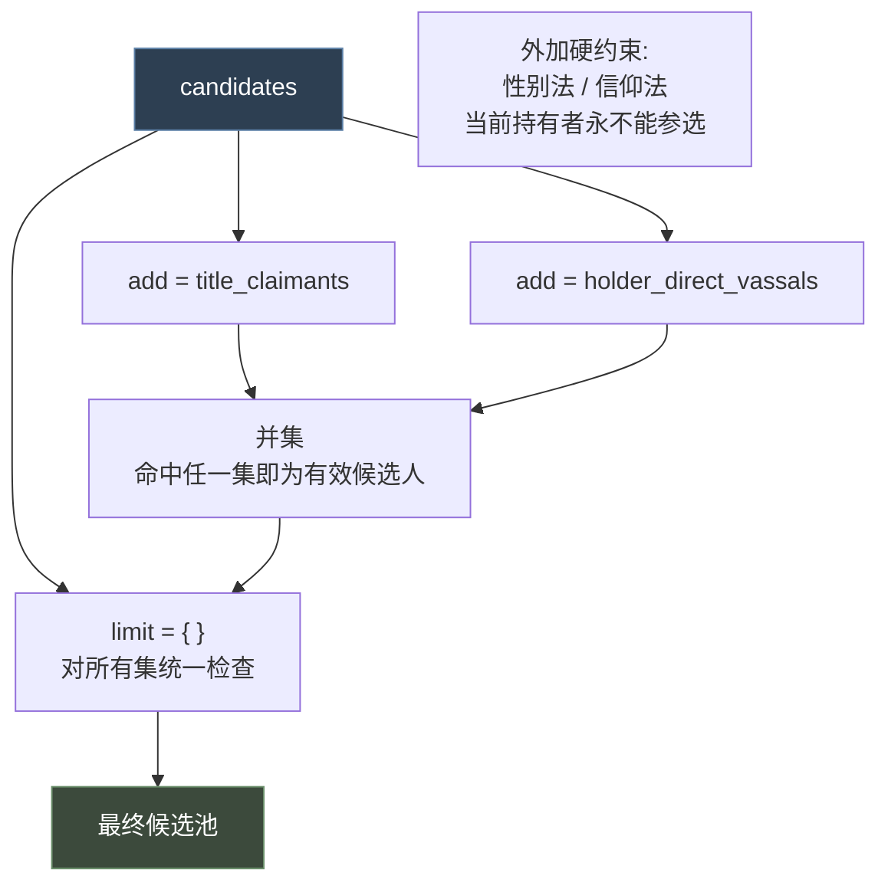
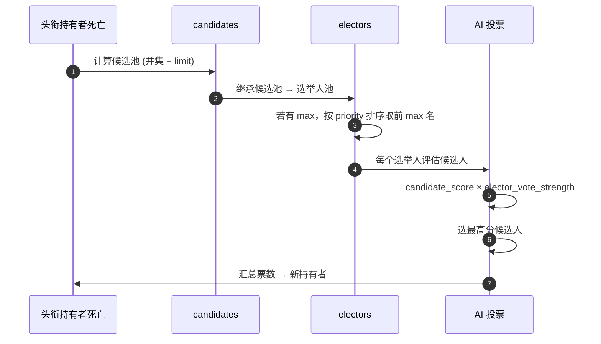
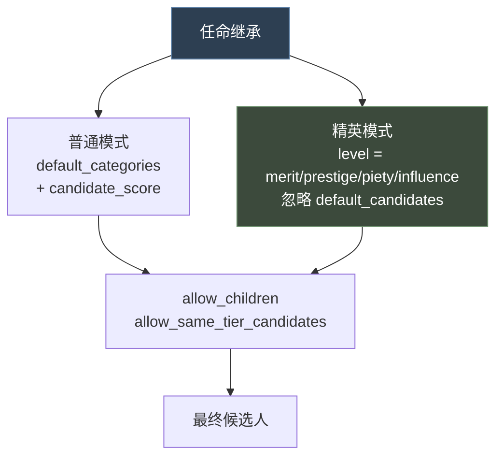

# 10 法律与继承

> **法律 = 从法律组中互斥单选、持续生效的规则；继承 = 头衔传给谁。** 二者通过法律里的 `succession` 子结构天然耦合。

## 本篇导读

### 法律的核心规则

> "All rulers have a single law from each group... **When a default law is set, `on_pass` is *not* executed**"

条件四件套的分工：

```
can_have                     根本资格（通过则显示为"可用"）
  └─ can_pass               临时条件（"我能有，但现在不能通过"，如正在战争中）
       └─ can_keep          成立后持续检查（失效则一个月内回退到 default）
should_start_with            新统治者是否以此开局（不触发 on_pass）
```

### 继承的三层结构

| 层 | 位置 | 决定 |
|---|---|---|
| 血缘规则 | `laws/` 的 `succession` 块 | `order_of_succession` / `title_division` / `gender_law` / `traversal_order` / `rank` |
| 选举 | `succession_election/` | 候选集类型、投票人、AI 评分 |
| 任命 | `succession_appointment/` | 候选类别、评分、精英模式的等级来源 |

## 文档关联

- **前置**：[03 触发器与效果](03-触发器与效果.md)、[04 修饰符与数值计算](04-修饰符与数值计算.md)
- **交叉**：[13 政体、特质与共治](13-政体、特质与共治.md)（政体的 `government_rules` 决定哪些继承机制可用；特质的 `culture_succession_prio` 影响排序）
- **交叉**：[14 内阁职位、臣属契约与臣属立场](14-内阁职位、臣属契约与臣属立场.md)（契约的 `appointment_trait_flag` 影响任命继承资格）

## 目录

| 章 | 章节 |
|---|---|
| 第一章 法律 | 概念 · `law_group` 与 `cumulative` · `law` 属性全表 · `succession` 子结构 · 硬编码标记 · 本地化 · 王权法与继承法实例 |
| 第二章 继承 | 三层结构 · 选举继承（候选集 / 投票人 / 流程）· 任命继承（候选类别 / 精英模式）· 三种模式对比 |
| 附 实践 | 落点 · 命名 · 常见坑 · 调试 |

---

# 第一章 法律（Law）

## 1.1 概念

**法律 = 从"法律组（law group）"中单选一条、持续生效的规则。**



**核心规则**（`_laws.info:319-324`）：

> "All rulers have a single law from each group.
> If a group has a default set, that law will be checked first.
> Otherwise, or if it is invalid, the laws are checked in definition order.
> The first checked law where `should_start_with` returns true (or does not exist) gets used.
> Note that `can_pass` is ignored entirely when determining a default law.
> **When a default law is set, `on_pass` is *not* executed**"

## 1.2 法律组 `law_group` 属性

```paradox
law_group_name = {
	default = law_name                    # 新统治者默认采用（需 should_start_with 通过或未定义）
	cumulative = yes/no                   # 后续法律继承前一条的全部效果，默认 no
	flag = some_arbitrary_flag            # 组级标记
	is_treasury_budget_group = yes/no     # 是否属于财政预算组
	can_change_law_group = { }            # 能否修改该组（失败则可见但不可改）

	law_name = { ... }
	another_law_name = { ... }
}
```

**`cumulative` 的语义**（info:10）："If set, each subsequent law in the group will provide all effects of the previous law"
—— 比如王权 3 级 = 0 级 + 1 级 + 2 级 + 3 级的效果总和。

```mermaid
graph LR
    subgraph 非累积 cumulative = no
        A1["选 L2<br/>只有 L2 的效果"]
    end
    subgraph 累积 cumulative = yes
        B1["选 L2<br/>= L0 + L1 + L2"]
    end

    style B1 fill:#3c4a3c,stroke:#6b8f6b,color:#fff
```

## 1.3 法律 `law` 属性

### ① 条件四件套

| 属性 | 作用 | 默认 | Root |
|---|---|---|---|
| `can_keep` | 能否**保留**该法律。失效则一个月内被换成 default | 恒真 | 统治者 |
| `can_have` | 能否**拥有**（拥有资格） | 恒真 | 统治者 |
| `can_pass` | 能否**现在**通过（临时条件，如正在战争） | 恒真 | 统治者 |
| `should_start_with` | 新统治者是否**以此开局**（总是包含 `can_keep`） | 未定义即通过 | 统治者 |
| `can_title_have` | 头衔能否有此法律 | **恒假** | 头衔 |
| `can_realm_have` | 能否在王国层面应用 | **恒假** | 角色 |
| `should_show_for_title` | 是否在头衔 UI 显示 | — | 头衔 |

**四者的分工**：



> **`can_have` vs `can_pass`**（info:47-58）：
> - `can_have` —— 根本资格。通过则法律显示为"可用"
> - `can_pass` —— 临时条件。"I can have the law, but can't pass it right now"

### ② 成本与效果

```paradox
pass_cost   = { gold/piety/prestige = ... }    # 颁布成本，root = 统治者
revoke_cost = { gold/piety/prestige = ... }    # 废除成本，root = 统治者

modifier = { }                                  # 生效时施加给统治者的修正
```

### ③ 标记

```paradox
flag = some_arbitrary_flag          # 可用 has_realm_law_flag = X 检查

triggered_flag = {                  # 条件化标记（trigger 与 flag 都必须写）
	trigger = { ... }               # root = 统治者
	flag = some_arbitrary_flag
}
```

### ④ 回调

| 钩子 | 时机 | Root | 特殊说明 |
|---|---|---|---|
| `on_pass` | 法律添加的**前一刻** | 统治者 | **default 初始化不执行**；**继承他人不执行** |
| `on_after_pass` | 法律添加的**后一刻** | 统治者 | 同上 |
| `on_revoke` | 法律移除时 | 统治者 | **因继承他人而移除时不执行** |

> 头衔法律时，头衔可通过 `scope:title` 访问。

### ⑤ AI

```paradox
ai_will_do = { ... }    # 统治者域的 script value
```

> **决策规则**（info:301-303）："If above 0, the AI will enact this law if able. Law enactment is checked in the RARE_TASK_TICK. If multiple laws are possible, the AI will enact the one with the highest score."

### ⑥ 其他

```paradox
shown_in_encyclopedia = yes/no      # 是否在百科显示，默认 yes
```

## 1.4 继承规则子结构 `succession`

这是法律系统里最复杂的部分。

```paradox
succession = {
	order_of_succession = inheritance        # 见下表
	title_division      = partition/single_heir
	traversal_order     = children/dynasty_house/dynasty
	rank                = oldest/youngest

	pool_character_config = key    # 仅 theocratic/company/generate
	election_type        = key    # 仅 election
	appointment_type     = key    # 仅 appointment

	# ── 通用规则 ──
	gender_law = male_only/male_preference/equal/female_preference/female_only
	faith      = same_faith/same_religion/same_family
	create_primary_tier_titles = yes/no
	primary_heir_minimum_share = 0.5
	exclude_rulers    = yes/no
	limit_to_courtiers = yes/no
}
```

### ① `order_of_succession` 与适用范围

| 值 | 适用范围 | 出处 |
|---|---|---|
| `player_heir` | **仅头衔** | info:331 |
| `election` | **仅头衔** | info:332 |
| `noble_family` | **仅头衔** | info:333 |
| `generate_from_template` | **仅头衔** | info:334 |
| `inheritance`（`title_division = partition`） | **仅王国** | info:336 |
| `theocratic` | **仅王国** | info:337 |
| `company` | **仅王国** | info:338 |
| `generate` | **仅王国** | info:339 |
| `inheritance`（`title_division = single_heir`） | **王国 + 头衔** | info:341 |
| `appointment` | **王国 + 头衔** | info:342 |



### ② 约束关系



### ③ 覆盖规则

> "Any new law with a rule set will override the previous law's rule set. Overriding is in law definition order."

## 1.5 硬编码标记

**法律组级**（info:355）：

| flag | 效果 |
|---|---|
| `realm_law` | 显示在 "My Realm" 窗口 |

**法律级**（info:358-362）：

| flag | 效果 |
|---|---|
| `titles_cannot_leave_realm_on_succession` | 禁止头衔因继承流出王国，相关继承人被取消资格 |
| `men_can_have_multiple_spouses` | 男性可多配偶（仍需信仰允许） |
| `men_can_have_consorts` | 男性可有伴侣 |
| `women_can_have_multiple_spouses` | 女性可多配偶 |
| `women_can_have_consorts` | 女性可有伴侣 |

## 1.6 本地化约定

```
<law_key>                       # 法律名
<law_key>_effects               # 效果描述（可选，覆盖自动生成）
<law_key>_effects_not_in_prev   # 不应包含在前序法律效果列表中的部分
```

GUI 取值函数（info:349）：

```
CHARACTER.GetActiveLawInGroupWithFlag('realm_law')
```

> 注意：**对死亡角色无效**。

## 1.7 真实示例解析：王权法

出处：`common/laws/00_realm_laws.txt:19`

```paradox
@crown_authority_cooldown_years = 20        # 文件级常量

crown_authority = {
	default = crown_authority_1
	cumulative = yes                        # 高级王权继承低级效果
	flag = realm_law                        # 显示在 My Realm 窗口

	crown_authority_0 = {
		modifier = {
			belligerent_opinion = -10
			barons_and_minor_landholders_opinion = 20
			glory_hound_opinion = 10
			parochial_opinion = 10
			courtly_opinion = 5
		}
		flag = uses_crown_authority

		can_keep = {
			realm_law_use_crown_authority = yes
			trigger_if = {
				limit = {
					government_allows = administrative
					top_liege != this
				}
				liege = { has_realm_law = crown_authority_0 }
			}
		}

		on_pass = {
			# Remove modifiers.
			remove_law_related_modifiers_effect = yes
		}
	}

	crown_authority_1 = {
		modifier = {
			belligerent_opinion = 5
			barons_and_minor_landholders_opinion = -30
			glory_hound_opinion = -15
			parochial_opinion = -15
			courtly_opinion = -5
			minority_opinion = -10
		}
		flag = title_revocation_allowed
		flag = vassal_retraction_allowed
		flag = can_have_tributaries
		flag = can_change_partition_succession_laws
		flag = diarchs_want_to_subsidise_without_this_flag

		can_keep = {
			realm_law_use_crown_authority = yes
			trigger_if = { ... }
		}
	}
}
```

**要点解读**：

1. `@crown_authority_cooldown_years = 20` —— 文件级常量，引用时不带 `@`
2. `cumulative = yes` —— 王权 1 级自动包含 0 级的效果
3. `flag = title_revocation_allowed` —— 这些 flag 被游戏代码读取，**是王权法真正的"功能"**
4. `trigger_if` 在 `can_keep`（Trigger 上下文）里使用，而非 `if`
5. `on_pass` 清理旧 modifier —— 因为法律切换时 modifier 不会自动移除

## 1.8 继承法示例

出处：`common/laws/00_succession_laws.txt:1`

```paradox
succession_order_laws = {
	flag = succession_order_laws

	can_change_law_group = {
		custom_tooltip = {
			text = CANT_CHANGE_LAW_TOOLTIP
			NOR = {
				has_realm_law = mandala_succession_law
				government_has_flag = government_is_japan_administrative
			}
		}
	}

	confederate_partition_succession_law = {
		can_keep = {
			trigger_if = {
				limit = {
					government_has_flag = government_is_japan_feudal
					tgp_realm_has_ceremonial_liege_trigger = yes
				}
				is_independent_ruler = no
			}
			trigger_else = { always = yes }   # for readability
		}

		can_pass = {
			can_change_partition_succession_law_trigger = yes
			trigger_if = {
				limit = { exists = primary_title }
				is_confederation_member = no
			}
		}

		can_have = {
			can_have_confederate_partition_succession_law_trigger = yes
			trigger_if = {
				limit = { exists = primary_title }
				is_confederation_member = no
			}
		}

		should_start_with = { ... }
	}
}
```

**要点**：

1. `can_change_law_group` 用 `custom_tooltip` 给玩家解释"为什么不能改"
2. `trigger_else = { always = yes }` 只是可读性写法（默认就是恒真）
3. `can_pass` 与 `can_have` 内容高度相似，但语义不同（临时 vs 资格）

---

# 第二章 继承（Succession）

## 2.1 继承系统的三层结构

CK3 的继承不是一个单独目录，而是**三个层次协作**：



> 第一层（`laws/` 的 succession 子结构）已在 [10-法律与继承](10-法律与继承.md) §1.4 详述，本文聚焦后两层。

## 2.2 选举继承 `succession_election`

定义目录：`common/succession_election/`（2.25 KB info）

```paradox
feudal_elective = {
	candidates = {                     # 谁可以被选
		add = {
			type = holder_direct_vassals   # 候选集类型
			limit = {}                     # 额外条件
			                               # root = 候选角色
			                               # scope:title = 选举中的头衔
			                               # scope:holder = 当前持有者
		}
		add = holder_direct_vassals        # 简写

		limit = {}                         # 对所有候选集统一检查
	}

	electors = {                       # 谁可以投票（继承 candidates 的所有元素）
		max = 10                       # 最多多少选举人，<0 = 无限制，默认 -1
		priority = {}                  # MTTH，仅在有 max 时相关
	}

	elector_vote_strength = {}         # 选举人一票的分量
	                                   # root = 选举人, scope:title, scope:holder

	candidate_score = {}               # AI 投票行为
	                                   # root = 选举人
	                                   # scope:candidate = 被考虑的候选人
	                                   # scope:title, scope:holder
	                                   # scope:holder_candidate = 持有者支持的候选人
}
```

### ① 候选集类型全表

| 类型 | 含义 |
|---|---|
| `title_claimants` | 该头衔的所有宣称者 |
| `title_dejure_vassals` | 该头衔法理层级下的直接与间接封臣，最低到**伯爵领** |
| `holder` | 当前持有者 |
| `holder_direct_vassals` | 当前持有者的直接封臣 |
| `holder_spouses` | 持有者的配偶 |
| `holder_close_family` | 持有者的近亲 |
| `holder_close_or_extended_family` | 近亲或远亲 |
| `holder_dynasty` | 持有者的宗族 |
| `holder_council_members` | 持有者的内阁成员 |
| `holder_tributaries` | 持有者的朝贡国 |



> **三条硬约束**（info:5-6）：
> "In addition to the scripted limitations, the gender and faith laws are taken into account. Also the current title holder can never be a candidate."

> **选举人限制**（info:19）："Note that only rulers can be electors." —— 只有统治者能投票。

### ② 选举流程



## 2.3 任命继承 `succession_appointment`

定义目录：`common/succession_appointment/`（1.61 KB info）

```paradox
key = {
	candidate_score = {          # root = 任命候选人, scope:title = 待任命头衔
		value = 0
	}

	default_candidates = { holder_close_family landed_vassal }   # 默认合格的候选人类别

	# 精英任命：默认候选人为符合某等级的所有人
	# 支持的等级来源为带等级的货币
	# 若设置了 level，则忽略 default_candidates
	level = merit / prestige / piety / influence

	allow_children = no                  # 是否允许评估儿童
	allow_same_tier_candidates = no      # 是否允许已持有同层级头衔者
}
```

### ① 候选人类别全表

| 类别 | 含义 |
|---|---|
| `holder_close_family` | 持有者的近亲 |
| `holder_close_extended_family` | 持有者的近亲或远亲 |
| `holder_house_member` | 持有者的家族成员 |
| `landed_vassal` | 有地封臣（**含持有者自己的封臣与同级封臣**） |
| `landed_vassal_close_family` | 有地封臣的近亲 |
| `landed_vassal_close_extended_family` | 有地封臣的近亲或远亲 |
| `landed_vassal_house_member` | 有地封臣的家族成员 |
| `unlanded_noble_house_head` | 无地贵族家族长（含持有者自己的贵族封臣与同级封臣） |
| `unlanded_noble_close_family` | 无地贵族的近亲 |
| `unlanded_noble_close_extended_family` | 无地贵族的近亲或远亲 |
| `unlanded_noble_house_member` | 无地贵族的家族成员 |
| `holder_councilor` | 持有者的内阁成员 |
| `holder_court_position` | 持有者的宫廷职位持有者 |
| `direct_subject` | 直接臣属 |



## 2.4 三种继承模式对比

| | 血缘继承 `inheritance` | 选举 `election` | 任命 `appointment` |
|---|---|---|---|
| 配置位置 | `laws/` 的 `succession` 块 | `succession_election/` | `succession_appointment/` |
| 决定者 | 规则自动计算 | 选举人投票 | 持有者/官员任命 |
| 可配参数 | 性别法、分配方式、遍历顺序 | 候选集、投票人、评分 | 候选类别、评分、等级来源 |
| 适用 | 王国 + 头衔 | **仅头衔** | 王国 + 头衔 |
| 玩家干预 | 低（改法律） | 中（拉票） | 高（直接选） |

---

## 附 实践：法律与继承的 Mod 开发

### A. 落点建议

| 想做的事 | 落点 |
|---|---|
| 新增一组法律 | `common/laws/ftr_laws.txt` |
| 新增选举继承制 | `common/succession_election/ftr_elections.txt` |
| 新增任命继承制 | `common/succession_appointment/ftr_appointments.txt` |
| 在法律里挂继承规则 | `common/laws/` 中该法律的 `succession` 块 |

### B. 命名规范

```
法律组：    ftr_<类别>
法律：      ftr_<类别>_<等级>
继承参数：  ftr_<规则名>
选举制：    ftr_<类型>_elective
任命制：    ftr_<类型>_appointment
```

### C. 常见坑

| 坑 | 规避 |
|---|---|
| 以为 `on_pass` 总会执行 | **default 初始化、继承他人、因继承被移除时都不执行** |
| `can_title_have` / `can_realm_have` 没写 | 默认**恒假**，不写等于禁用 |
| 法律切换后旧 modifier 残留 | 在 `on_pass` 里显式清理 |
| 期望当前持有者参与选举 | 硬规则：持有者**永不**成为候选人 |
| 期望非统治者能投票 | 只有**统治者**能当选举人 |
| `cumulative = yes` 的效果重复计算 | 确认是否真的想让高级法律继承低级效果 |
| 任命继承选不到人 | 检查 `default_categories` 或 `level`；检查 `allow_children` |

### D. 调试建议

| 症状 | 排查 |
|---|---|
| 法律不出现 | 检查 `is_shown`（若有）、`can_have`、`can_pass` |
| 法律自动回退 | `can_keep` 失败 → 一个月内回退到 `default` |
| 法律效果没生效 | 检查 modifier 是否合法；检查是否因继承而未执行 `on_pass` |
| 继承顺序不符预期 | 检查 `gender_law`、`traversal_order`、`rank`、`faith` |
| 选举无候选人 | 检查候选集类型与 `limit`；确认把持有者排除在外 |
| 任命继承报错 | 检查 `level` 与 `default_candidates` 是否同时设置（`level` 优先并忽略后者） |
