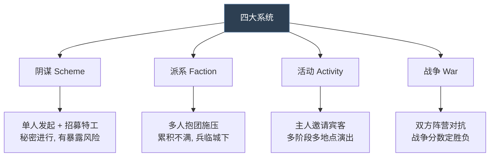
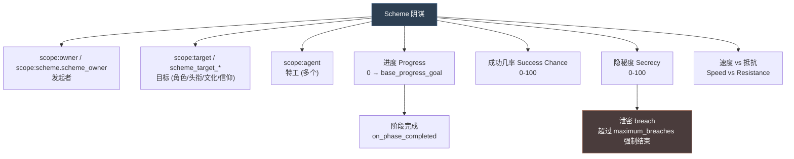
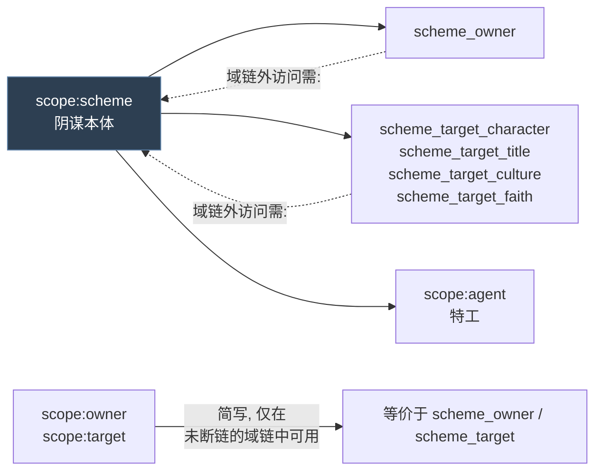
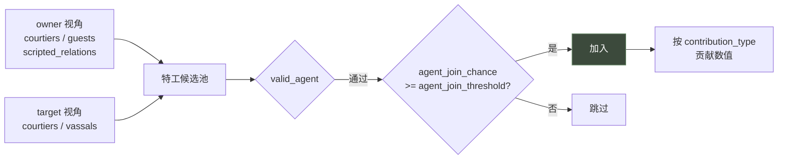
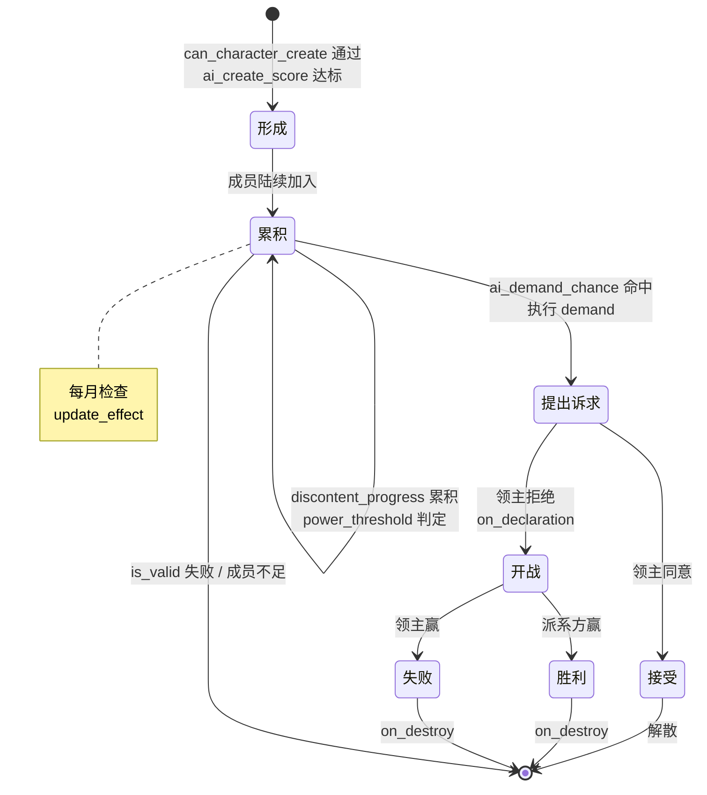
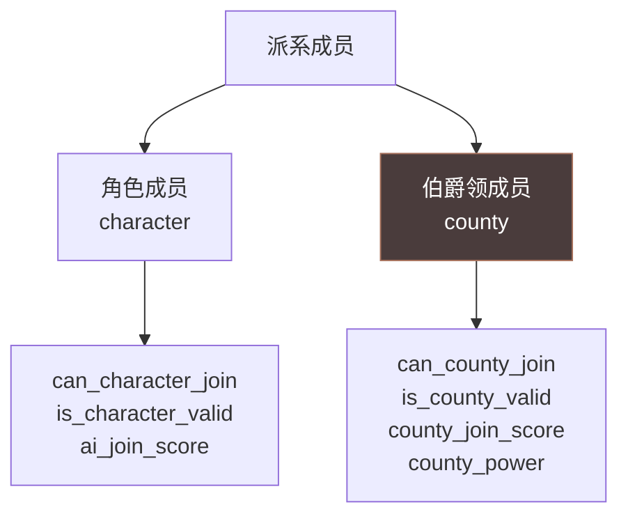

# 11 阴谋与派系

> 两个**多角色 + 状态推进**系统：**阴谋**是单人发起的秘密行动，**派系**是多人抱团的政治施压。

## 本篇导读

| 维度 | 阴谋 `schemes/` | 派系 `factions/` |
|---|---|---|
| 发起者 | 单人（owner）+ 可招募特工 | 多人自发形成 |
| 核心数值 | 进度 / 成功几率 / 隐秘度 | **实力（power）** + 不满（discontent） |
| 秘密性 | **有**（secrecy + 泄密次数） | 公开 |
| 结束条件 | 阶段完成 / 暴露 / 失效 | 达成诉求 / 解散 / 战争 |
| 主要威胁 | 被发现 → 强制结束 | 被目标镇压 |

### 阴谋的四条数值轨道

```
进度概率 = 阴谋速度 − 阴谋抵抗
隐秘度   = clamp(base_secrecy + 成功几率 + 修正, 0, 100)
成功几率 = 由 base_success_chance 的 modifier 链累加
进度阶段 = 0 → base_progress_goal
```

### 派系的两种成员

CK3 派系有**角色成员**与**伯爵领成员**双轨制，各有独立的 create / join / valid / score 配置。

## 文档关联

- **前置**：[03 触发器与效果](03-触发器与效果.md)、[04 修饰符与数值计算](04-修饰符与数值计算.md)
- **同类**：[12 活动与战争](12-活动与战争.md)（活动是公开聚会、战争是派系的常见终点）
- **交叉**：[08 角色交互与决议](08-角色交互与决议.md)（派系可用 `character_interaction` 替代创建按钮）
- **选型**：[16 多系统选型指南与开发实践](16-多系统选型指南与开发实践.md)

## 目录

| 章 | 章节 |
|---|---|
| 第一章 阴谋 | 概念 · 四条数值轨道 · 作用域 · `category` · 属性全表（特工 / 数值 / 脉冲 / 回调 / 旅行）· Modifier 全表 · `agent_types` · 反制措施 · 本地化函数 · 谋杀阴谋实例 |
| 第二章 派系 | 概念 · 状态机 · 作用域与列表 · 成员双轨制 · 属性全表 · 本地化函数 · 独立派系实例 · 原版派系类型 |

---

## 0. 四者定位对比



| 维度 | 阴谋 | 派系 | 活动 | 战争 |
|---|---|---|---|---|
| 目录 | `schemes/` | `factions/` | `activities/` | `casus_belli_types/` |
| 文件数 | 39 + 4 info | 5 + info | 62 + 6 info | 26 + info |
| 发起者 | 单人（owner） | 多人自发形成 | 单人（host） | 攻方（attacker） |
| 参与方 | owner + agents（特工） | members（成员）+ leader | host + guests（宾客） | attacker vs defender + 盟友 |
| 核心数值 | 成功几率 / 隐秘度 / 进度 | **实力（power）** + 不满（discontent） | 阶段进度 + 宾客满意度 | **战争分数（warscore）** |
| 结束条件 | 阶段完成 / 暴露 / 失效 | 达成诉求 / 解散 / 战争 | 最后阶段完成 | 胜利 / 失败 / 白和 / 失效 |
| 秘密性 | **有**（secrecy 机制） | 公开 | 公开 | 公开 |
| 主要威胁 | 被发现 → 强制结束 | 被目标镇压 | 宾客不足 → 失效 | 战败 |

---

# 第一章 阴谋（Scheme）

## 1.1 概念

**阴谋 = 由一名角色发起、可招募特工协助、按阶段推进、有暴露风险的长期秘密行动。**



**四条数值轨道**（官方 `_schemes.info:4-7`）：

```
Success Chance  —— 0-100   成功几率
Secrecy         —— 0-100   隐秘度
Progress Chance —— 0-100   月度进度概率
Scheme Progress —— 0-10    进度阶段
```

> 脚本里访问成功几率与隐秘度用 `scheme_success_chance` 和 `scheme_secrecy`。

## 1.2 作用域体系



> **官方建议**（`_schemes.info:145-146`）："If in doubt about how to use these, just use `scope:scheme.scheme_owner = { }`"

## 1.3 分类 `category`

| category | 含义 | 受哪些 modifier 影响 |
|---|---|---|
| `personal` | 个人阴谋（勾引、交友、提升正统性…） | `personal_scheme_resistance/speed_add/mult` |
| `contract` | 契约阴谋 | 同上 |
| `hostile` | 敌对阴谋（谋杀、绑架、窃取…） | `hostile_scheme_resistance/speed_add/mult` |

```paradox
category = personal/contract/hostile
```

## 1.4 属性全表

### ① 基础设定

| 属性 | 说明 | 默认 |
|---|---|---|
| `skill = intrigue` | 基于哪项能力计算速度 | — |
| `target_type = character/title/culture/faith/nothing` | 目标作用域类型 | — |
| `icon = key` | 图标 | scheme key |
| `illustration = "path"` | 窗口插图 | — |
| `hostile = yes` | **已废弃**，用 `category` 代替 | — |
| `is_basic = no` | 基础阴谋：无成功几率增长、无特工、无机遇 | no |
| `is_secret = yes` | 是否使用隐秘机制（否则恒 100% 隐秘） | yes |
| `uses_resistance = no` | 是否把目标的能力/间谍首脑/头衔层级计入抵抗 | yes |
| `hide_target_name = no` | 显示阴谋名时是否隐藏目标名 | no |

### ② 条件

```paradox
allow = {}    # 何时可以发起
valid = {}    # 持续条件, 每日检查; 不满足则结束
```

> `valid` **每天检查**，与 `on_invalidated` 配合。

### ③ 特工（Agent）系统

```paradox
agent_join_threshold  = 5     # AI 想加入的意愿达到此值才实际加入
agent_leave_threshold = 1     # 低于此值则自动退出

valid_agent = {}              # 特工有效性 (此检查很频繁, 慎用)

agent_groups_owner_perspective = { courtiers guests scripted_relations }
agent_groups_target_character_perspective = { courtiers vassals }

agent_join_chance = {         # AI 想加入的程度 (root = agent)
	base = 0
	modifier = { add = 10  always = yes }
}

agent_success_chance = {}     # 每个特工为成功几率贡献多少 (root = agent)
```



> 可用列表与 `character_interaction.info` 的 `ai_targets` 章节**完全相同**（官方说明第 39 行）。

### ④ 数值参数

```paradox
# 成功几率
base_success_chance = {}              # root = scheme, scope:target, scope:target_title
base_maximum_success_chance = 100
minimum_success = 0

# 隐秘度
maximum_secrecy = 100
minimum_secrecy = 0
base_secrecy = -20                    # 月度暴露检查基数
use_secrecy = {}                      # trigger; 返回 false 则隐秘度设为 100%
maximum_breaches = 7                  # 泄密几次后强制结束

# 进度
base_progress_goal = 20

# 速度
speed_per_skill_point = 0.1                       # 每点技能给的速度
speed_per_target_skill_point = 0                  # 目标每点技能给的速度
success_chance_growth_per_skill_point = 0.1       # 每点技能给的几率增长
spymaster_speed_per_skill_point = 1
target_spymaster_speed_per_skill_point = 1
tier_speed = 1

# 冷却
cooldown = { days = 0 }               # 结束后多久才能对同一目标再用
```

**进度概率公式**（官方第 117 行）：

```
月度进度概率 = 阴谋速度 − 阴谋抵抗
例：速度 50，抵抗 25 → 25% 概率
```

**隐秘度公式**（官方第 82 行）：

```
隐秘度 = clamp(base_secrecy + success_chance + scheme_modifiers, 0, 100)
```

**胜率预测**（`odds_prediction`）：0-100 的 script value，UI 显示为
abysmal / low / medium / high / excellent（阈值在 `DEFAULT_ODDS_PREDICTION_LEVEL_BREAKPOINTS`）。

### ⑤ 脉冲行动 `pulse_actions`

```paradox
pulse_actions = {
	entries = { <pulse action key 列表, 空格分隔> }
	chance_of_no_event = 0        # 0-100, 不触发任何 pulse 的概率
}
```

**pulse action 定义**（`schemes/pulse_actions/_pulse_actions.info` 全文）：

```paradox
key = {
	icon = "icon"             # 默认用 key
	hud_text = "LOC_KEY"      # 阴谋 HUD 上显示的极短文本

	# root = the scheme
	# scope:activity = the scheme
	# scope:owner = owner of the scheme

	is_valid = { }            # 能否被选中
	weight = { }              # 相对权重
	effect = { }              # 被选中时执行
	                          # 若保存 scope:first / scope:second
	                          # 可在活动窗口通知里显示 (角色/头衔/宝物)
}
```

> 注意：pulse action 的 `.info` 里注释写的是 `scope:activity = the scheme` —— 这是 activities 与 schemes 共用 pulse action 机制留下的历史痕迹。

### ⑥ 回调钩子

| 钩子 | 时机 |
|---|---|
| `on_phase_completed` | 阶段完成（进度达上限） |
| `on_hud_click` | 在底部 HUD 点击该阴谋时 |
| `on_monthly` | 每月 |
| `on_semiyearly` | 每半年（**AI 默认在此分配特工**） |
| `on_invalidated` | `valid` 检查失败时 |

```paradox
on_hud_click = {
	scheme_owner = {
		trigger_event = test_compose.0001
	}
}

on_monthly = {
	scheme_owner = {
		trigger_event = { on_action = compose_ongoing }
	}
}
```

### ⑦ 旅行交互

```paradox
freeze_scheme_when_traveling             = yes/no   # 发起者旅行时冻结
freeze_scheme_when_traveling_target      = yes/no   # 目标旅行时冻结
cancel_scheme_when_traveling             = yes/no   # 发起者旅行时取消
cancel_scheme_when_traveling_target      = yes/no   # 目标旅行时取消
```

> 默认全部为 **no**。

## 1.5 相关 Modifier 全表

**作用于阴谋本体**（在 scheme 上）：

| Modifier | 作用 |
|---|---|
| `scheme_phase_duration` | 阶段时长 |
| `scheme_resistance` | 抵抗 |
| `scheme_secrecy` | 隐秘度 |
| `scheme_success_chance` | 成功几率 |
| `scheme_success_chance_growth` | 成功几率增长 |

**作用于角色**：

| Modifier | 作用 |
|---|---|
| `hostile_scheme_phase_duration_add` | 参与敌对阴谋时 ±阶段天数 |
| `personal_scheme_phase_duration_add` | 参与个人阴谋时 ±阶段天数 |
| `owned_personal_scheme_success_chance_add` | 自己发起的个人阴谋初始成功率 |
| `owned_hostile_scheme_success_chance_add` | 自己发起的敌对阴谋初始成功率 |
| `enemy_personal_scheme_success_chance_add` | 针对自己的个人阴谋成功率 |
| `enemy_hostile_scheme_success_chance_add` | 针对自己的敌对阴谋成功率 |
| `owned_*_success_chance_growth_add` | 每轮循环后的成功率增长 |
| `enemy_*_success_chance_growth_add` | 同上（针对自己） |
| `enemy_scheme_secrecy_add` | 影响针对自己的阴谋隐秘度（**想要降低对方隐秘度应设负值**） |

**数量上限与专名 Modifier**：

```paradox
max_<scheme_name>_schemes_add = x     # 该种阴谋同时运行上限
max_hostile_schemes_add = x           # 敌对阴谋上限
max_personal_schemes_add = x          # 个人阴谋上限

<scheme_name>_speed_add = x.x
<scheme_name>_speed_mult = x
<scheme_name>_resistance_add = x.x
<scheme_name>_resistance_mult = x
```

## 1.6 特工槽位 `agent_types`

定义目录：`common/schemes/agent_types/`（`_agent_types.info` 全文）

```paradox
slot_name = {
	# root - The Agent character
	# scope:owner - The owner of the scheme.
	# scope:target - The target of the scheme.
	valid_agent_for_slot = { ... }

	contribution_type = secrecy/speed/success_chance   # 贡献给哪条轨道

	# root - The Agent character
	# scope:owner - The owner of the scheme.
	# scope:scheme - The scheme
	# scope:target - The target of the scheme.
	contribution = { ... }        # script value, 结果即贡献量
}
```

## 1.7 反制措施 `scheme_countermeasures`

定义目录：`common/schemes/scheme_countermeasures/`（`_scheme_countermeasures.info` 全文）

```paradox
countermeasure_type = {
	# root: ruler
	is_shown = {}
	is_valid_showing_failures_only = {}

	on_activate = {}
	activation_cost = { gold/piety/prestige }

	owner_modifier = {}          # 只作用于统治者本人, 不含廷臣与宾客

	ai_will_do = {}              # AI 定期重评, 取最高分

	parameters = {               # 任意参数
		some_parameter = yes     # 用 has_scheme_countermeasure_parameter 检查**存在性**
		                         # 注意: 只检查存在, 设 yes 或 no 都一样
	}
}
```

## 1.8 本地化函数

| 函数 | 返回 |
|---|---|
| `[SCHEME.GetName]` | 阴谋类型名，如 "Seduction Scheme" |
| `[SCHEME.GetAction]` | 动作名，如 "Seduce" |
| `[SCHEME.GetFullActionName]` | 动作 + 目标，如 "Seduce Duke William" |
| `[SCHEME.GetTypeDescription]` | 类型描述 |
| `[SCHEME.GetSecrecy]` | 隐秘度数值 |
| `[SCHEME.GetOwner]` | 发起者 |
| `[SCHEME.GetTarget]` | 目标 |
| `[SCHEME.GetSpeed]` | 速度数值 |
| `[SCHEME.GetResistance]` | 抵抗数值 |
| `[SCHEME.GetSpeedDifference]` | 速度 − 抵抗 |
| `[SCHEME.IsOwnerExposed]` | 发起者是否已暴露 |
| `[SCHEME.GetProgress]` | 进度数值 |
| `[SCHEME.IsFrozen]` / `[SCHEME.IsUnfrozen]` | 是否冻结 |
| `[SCHEME.IsSecret]` | 是否机密 |
| `[SCHEME.GetChangeDesc]` | 进度变化描述 |

## 1.9 真实示例解析：谋杀阴谋

出处：`common/schemes/scheme_types/murder_scheme.txt`

```paradox
murder = {
	# ── 基础设定 ──
	skill = intrigue
	desc = murder_desc_general
	success_desc = "MURDER_SUCCESS_DESC"
	discovery_desc = "MURDER_DISCOVERY_DESC"
	icon = icon_scheme_murder
	illustration = "gfx/interface/illustrations/event_scenes/corridor.dds"
	category = hostile
	target_type = character
	is_secret = yes
	maximum_breaches = 5
	cooldown = { years = 10 }

	# ── 参数（全部引用 script value）──
	speed_per_skill_point = t2_spsp_owner_value
	speed_per_target_skill_point = t2_spsp_target_value
	base_progress_goal = t2_base_phase_length_value
	maximum_secrecy = 95
	base_maximum_success = t2_base_max_success_value
	phases_per_agent_charge = 1
	success_chance_growth_per_skill_point = t2_scgpsp_value

	# ── 能否发起 ──
	allow = {
		age >= 14
		is_imprisoned = no
		any_held_title = { tier >= tier_barony }
	}

	# ── 持续有效性 ──
	valid = {
		is_incapable = no

		# 没有对应特质就不能杀亲生子女
		trigger_if = {
			limit = {
				is_parent_of = scope:target
				NOT = { has_trait_with_flag = can_murder_own_children }
			}
			NOT = { is_parent_of = scope:target }
		}

		custom_description = {
			object = scope:target
			text = "I_have_imprisoned_target"
			scope:target = { imprisoner != scope:owner }
		}

		custom_description = {
			object = scope:target
			text = i_have_been_caught_trying_to_murder_target
			scope:target = {
				NOT = {
					has_opinion_modifier = {
						target = prev
						modifier = murder_personal_grudge_opinion
					}
				}
			}
		}

		scope:target = {
			OR = {
				exists = location
				in_diplomatic_range = scope:owner
			}
		}

		# AI 特殊例外
		NOT = {
			scope:owner = {
				is_ai = yes
				has_opinion_modifier = { target = scope:target  modifier = repentant_opinion }
			}
		}

		custom_tooltip = {
			text = guilt_fever_tt
			NOT = { has_character_flag = guilt_fever_murder_cd }
		}
	}

	# ── 特工配置 ──
	agent_leave_threshold = -25
	agent_join_chance = {
		base = 0
		ai_agent_join_chance_basic_suite_modifier = yes
		ai_agent_join_chance_hostile_grievous_modifier = yes
	}
	agent_groups_owner_perspective = { courtiers guests scripted_relations }
	agent_groups_target_character_perspective = { courtiers vassals }
	valid_agent = { is_valid_agent_standard_trigger = yes }

	# ── 胜率预测 ──
	odds_prediction = {
		add = hostile_scheme_base_odds_prediction_target_is_char_value
		add = odds_skill_contribution_intrigue_value
		add = agent_groups_owner_perspective_value
		add = agent_groups_target_character_perspective_value
		add = odds_variables_contribution_murder
		add = odds_murder_scheme_misc_value
		min = 0
	}

	# ── 基础成功几率 ──
	base_success_chance = {
		base = 0
		scheme_type_skill_success_chance_modifier = { SKILL = INTRIGUE }
		hostile_scheme_base_chance_modifier = yes
		apply_calculated_scheme_success_chance_adjustments_modifier = yes   # 反制措施

		# 每个剧情加成的 modifier 都带 desc，UI 上会逐条显示
		modifier = {
			add = 15
			desc = "ACHMACH_MURDER_BONUS"
			scope:owner = {
				has_variable = achmach_murder_help_var
				any_councillor = { has_variable = achmach_murder_help_councillor_var }
			}
		}
		modifier = {
			add = 50
			desc = "TEMUJIN_JAMUKHA_MURDER_BONUS"
			scope:owner = {
				exists = var:temujin_jamukha_murder_var
				var:temujin_jamukha_murder_var = scope:target
			}
		}
		# ... 假想朋友 / 愚人节仇敌 / 发现逃生隧道 / 埃特图布鲁图 等
		modifier = {
			add = 10
			scope:owner = { has_trait = lifestyle_herbalist }
			desc = MURDER_HERBALIST_BONUS
		}
	}
}
```

**设计要点**：

1. **所有数值参数都抽成 script value**（`t2_spsp_owner_value` 等），便于全局调平衡
2. `valid` 里的 `trigger_if` 实现"条件化的禁止规则"
3. **`custom_description` 让 UI 能解释"为什么这条不满足"**
4. `base_success_chance` 里每个 `modifier` 都带 `desc` —— 玩家能在界面上看到"为什么这次谋杀成功率高"
5. `agent_leave_threshold = -25` 是**负数** —— 意思是特工要非常不想干才会退出（比默认的 1 宽松得多）
6. 大量剧情变量挂钩（铁木真誓言、发现逃生隧道、假想朋友…），每个给 50-100 的巨额加成

---

# 第二章 派系（Faction）

## 2.1 概念

**派系 = 一群封臣自发抱团，累积实力与不满，最终向领主提出诉求（demand），被拒则开战。**



## 2.2 作用域体系

| 事件目标 | 含义 | 出处 |
|---|---|---|
| `faction_target` | 被针对的角色（领主） | info:353 |
| `faction_leader` | 派系领袖 | info:354 |
| `faction_war` | 派系战争 | info:355 |
| `special_character` | 特殊角色（如宣称者） | info:356 |
| `special_title` | 特殊头衔 | info:357 |
| `leading_faction` | 该角色领导的派系（角色域） | info:358 |
| `joined_faction` | 该角色所在的派系（角色域） | info:359 |

**相关列表**：

| 列表 | 含义 |
|---|---|
| `targeting_faction` | 针对该角色的所有派系 |
| `faction_member` | 派系内的角色成员 |
| `faction_county_member` | 派系内的伯爵领成员 |

## 2.3 成员类型

CK3 派系有**两类成员**，这是理解派系系统的关键：



| 角色相关 | 伯爵领相关 |
|---|---|
| `can_character_create` | `can_county_create` |
| `can_character_join` | `can_county_join` |
| `is_character_valid` | `is_county_valid` |
| `ai_create_score` | `county_create_score` |
| `ai_join_score` | `county_join_score` |
| `character_allow_create` | `county_allow_create` |
| `character_allow_join` | `county_allow_join` |
| `requires_character` | `requires_county` |

> **`county_power`**（info:130-134）："Script value defining the absolute power of a single county member. The final power is calculated as ratio of this power and the target's military strength."
> —— 单个伯爵领的绝对实力，最终实力 = 该值 ÷ 目标的军事力量。

## 2.4 属性全表

### ① 文本

```paradox
name             = <loc_key 或 动态描述>    # 默认 <faction key>
description      = <loc_key 或 动态描述>    # 默认 <key>_desc
short_effect_desc = <loc_key 或 动态描述>   # 诉求效果简述
special_character_title = <loc key>        # 特殊角色的称谓
```

> **重要**：派系的 identifier 本身就用作本地化键。不写 `name` 就用 key。

### ② 回调函数（root = the faction）

| 钩子 | 时机 | 额外域 |
|---|---|---|
| `on_creation` | 派系创建 | — |
| `on_destroy` | 派系销毁 | — |
| `demand` | 诉求触发 | — |
| `update_effect` | 每 `NFaction::UPDATE_INTERVAL_DAYS` 天 | — |
| `on_declaration` | 宣战时 | — |
| `character_leaves` | 成员离开 | `faction_member` |
| `leader_leaves` | 领袖离开 | `faction_member` |

> **注意**：`update_effect` 是**每隔 N 天**执行，不是每月。N 由 define `NFaction::UPDATE_INTERVAL_DAYS` 控制。

### ③ 判定 Trigger

| Trigger | Root | 额外域 | 说明 |
|---|---|---|---|
| `is_valid` | faction | — | 派系是否仍有效 |
| `is_shown` | player | — | 是否显示给玩家 |
| `is_character_valid` | member character | `faction` | 成员是否仍合格 |
| `is_county_valid` | county | `faction` | 伯爵领是否仍合格 |
| `can_character_join` | character | `faction` | **自动包含 `is_character_valid`** |
| `can_character_create` | character | `SCOPE:target` | — |
| `can_character_create_ui` | character | `target` | 空则回退到 `can_character_create` |
| `can_character_become_leader` | character | `faction` | — |
| `can_county_join` | landed title | `faction` | **自动包含 `is_county_valid`** |
| `can_county_create` | title | `target` | — |

> **不要重复写条件**：`can_character_join` 已自动包含 `is_character_valid`，`can_county_join` 已自动包含 `is_county_valid`（info:197、235 明确说明）。

### ④ AI 评分（全部为 MTTH）

| 属性 | Root | 额外域 |
|---|---|---|
| `ai_join_score` | character | `faction`（= 目标派系） |
| `ai_create_score` | character | `SCOPE:target`；宣称派系另有 `claimant` 与 `title` |
| `county_join_score` | title | `faction` |
| `county_create_score` | title | `target` |
| `ai_demand_chance` | faction | — |

> **重要**（info:95-96、109）："Note that the score is then modified by code to weigh in the effects of Boldness/Dread, Energy and Rationality."
> —— 脚本给出的分数会被代码按 AI 的**胆量/恐惧值、精力、理性**二次调整。

### ⑤ 进度与阈值

```paradox
discontent_progress = <mtth>   # root = faction, 不满进度变化
power_threshold     = <mtth>   # root = faction, 不满开始累积的实力阈值
                               # 不设则用 NFaction::DEFAULT_POWER_THRESHOLD
```

### ⑥ 开关

| 属性 | 默认 | 说明 |
|---|---|---|
| `character_allow_create` | yes | 角色能否创建 |
| `character_allow_join` | yes | 角色能否加入 |
| `county_allow_create` | yes | 伯爵领能否创建 |
| `county_allow_join` | yes | 伯爵领能否加入 |
| `leaders_allowed_to_leave` | yes | 领袖能否离开（用于"创造领袖"型派系） |
| `player_can_join` | yes | 玩家能否加入（否则隐藏加入按钮） |
| `multiple_targeting` | **no** | 能否对同一目标存在多个同类派系 |
| `ignore_soft_block` | no | 无视派系软性阻止 |
| `inherit_membership` | yes | 继承人继承派籍 |
| `requires_county` | no | 至少需要一名伯爵领成员，否则销毁 |
| `requires_character` | **yes** | 至少需要一名角色成员，否则销毁 |
| `requires_leader` | no | 需要有效领袖，否则销毁 |
| `county_can_switch_to_other_faction` | no | 伯爵领是否会跳槽到更优派系 |
| `show_special_title` | no | 界面是否显示特殊头衔 |
| `claimant` | no | 是否为宣称者派系（需角色 + 头衔） |
| `sort_order` | 0 | UI 排序，**值小者在前** |

```paradox
character_interaction = <key>   # 用角色交互替代派系按钮创建派系
casus_belli = <key>             # 派系战争使用的 CB
```

> **`character_interaction` 的作用**（info:29-32）："Enabling this will replace the original behaviour of the faction buttons in the faction window. Instead of starting a faction it will pop up a window for a character interaction."

## 2.5 本地化函数

| 函数 | 返回 |
|---|---|
| `[Faction.GetName]` | 类型名，如 "Independent Faction" |
| `[Faction.GetDescription]` | 类型描述 |
| `[Faction.GetDiscontent]` | 当前不满度 |
| `[Faction.IsAtWar]` | 是否处于战争 |
| `[Faction.GetPower]` | 当前实力 |
| `[Faction.GetTarget]` | 目标角色 |
| `[Faction.GetLeader]` | 领袖 |
| `[Faction.GetSpecialCharacter]` | 特殊角色 |
| `[Faction.GetSpecialTitle]` | 特殊头衔 |
| `[Faction.GetSpecialCharacterTitle]` | 特殊角色称谓，如 Claimant / Leader |
| `[Faction.HasSpecialCharacter]` | 是否有特殊角色 |
| `[Faction.HasSpecialTitle]` | 是否有特殊头衔 |

## 2.6 真实示例解析：独立派系

出处：`common/factions/00_factions.txt`

```paradox
independence_faction = {
	casus_belli = independence_faction_war
	short_effect_desc = independence_faction_short_effect_desc
	sort_order = 2

	is_shown = {
		NAND = {
			tgp_is_ceremonial_liege_trigger = yes
			tgp_is_ceremonial_regent_trigger = no
		}
	}

	# 不满累积进度
	discontent_progress = {
		base = 0
		common_discontent_progress_modifier = yes
	}

	# 实力阈值：达到此实力不满才开始涨
	power_threshold = {
		base = 80
		modifier = {
			add = 20
			desc = "FACTION_POWER_HARD_RULE"
			faction_target = { has_perk = hard_rule_perk }
		}
		dynamic_power_threshold_scripted_modifier = {
			FACTION_TYPE1 = claimant_faction
			FACTION_TYPE2 = liberty_faction
			FACTION_TYPE3 = populist_faction
		}
	}

	# 提出诉求
	demand = {
		save_scope_as = faction

		faction_leader  = { save_scope_as = faction_leader }
		faction_target  = { save_scope_as = faction_target }

		# 先通知派系内的人类玩家
		every_faction_member = {
			limit = {
				is_ai = no
				this != scope:faction.faction_leader
			}
			trigger_event = faction_demand.0005
		}

		# 5 天后正式向领主发出诉求
		faction_target = {
			trigger_event = {
				id = faction_demand.0001
				days = 5
			}
		}
	}

	# AI 何时提出诉求
	ai_demand_chance = {
		base = 0
		# 实力达到阈值(80%)时 40% 基础概率，之后线性增长
		compare_modifier = {
			value = faction_power
			multiplier = 0.5
		}
	}
}
```

**设计要点**：

1. `power_threshold` 用 `base = 80` + `modifier` —— 领主有 `hard_rule_perk` 时阈值提到 100
2. `demand` 里先 `save_scope_as = faction`，再用 `scope:faction.faction_leader` 跨域访问 —— **保存域后才能从其他域访问派系**
3. **两步通知**：先通知派系内的玩家成员（5 天前），再正式向领主发诉求
4. `ai_demand_chance` 用 `compare_modifier` 做"实力越高越敢提"的连续映射

## 2.7 原版派系类型

`common/factions/` 下的 5 个文件：

| 文件 | 内容 |
|---|---|
| `00_factions.txt` | 通用派系（独立、宣称者、降低王权…） |
| `00_nation_fracturing_faction.txt` | 国家分裂派系 |
| `00_nomadic_faction.txt` | 游牧派系 |
| `00_peasant_faction_new.txt` | 农民派系 |
| `00_populist_faction.txt` | 平民派系 |
| `10_tgp_factions.txt` | TGP（东亚）专属派系 |

---
