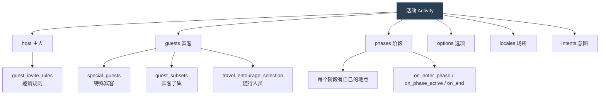
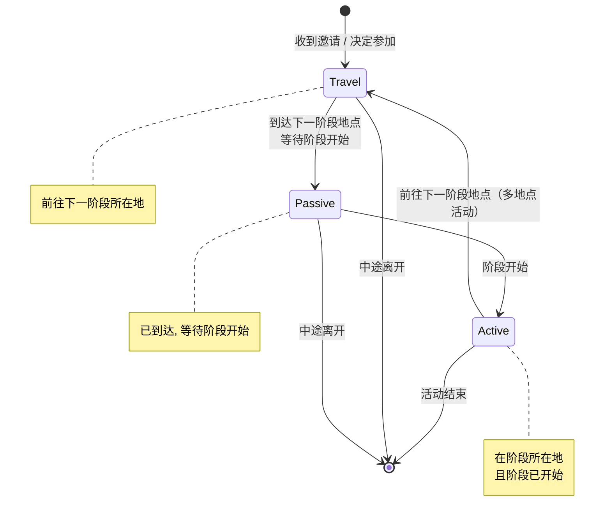
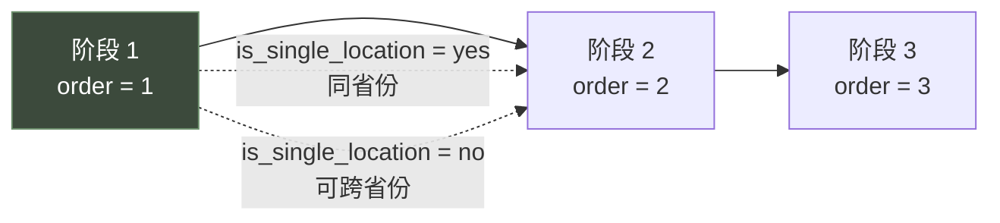

# 12 活动

> **活动**是主客多阶段聚会系统：`activity_types` 定义模板，参与者在规划期选选项、在阶段里推进、按意图获得结局。

## 本篇导读

- **生命周期**：规划期（planning）→ 进行期 → 结束冷却。
- **核心部件**：`options` / `phases` / `intents` / `locales` / 宾客系统 / 表现层 / AI 配置。
- **本 Mod**：`common/activities/` 暂无自定义活动。

## 文档关联

- **前置**：[03 触发器与效果](03-触发器与效果.md)、[06 事件系统与 on_action](06-事件系统与on_action.md)
- **战争部分已拆出** → [21 战争与宣战理由](21-战争与宣战理由.md)

---
## 1.1 概念

**活动 = 由一名主人（host）发起并邀请宾客（guest）的、分阶段、可跨地点的多角色社交事件。**

活动是 CK3 里**体量最大**的系统 —— `activity_types/_activity_type.info` 有 **1021 行**，是全游戏最长的语法说明。



## 1.2 角色状态机

**活动的参与者有三种状态**（官方 `_activity_type.info:1-4`）：



**每种状态都有进/出/脉冲三类钩子**：

| 状态 | 进入 | 离开 | 脉冲 |
|---|---|---|---|
| Travel | `on_enter_travel_state` | `on_leave_travel_state` | `on_travel_state_pulse` |
| Passive | `on_enter_passive_state` | `on_leave_passive_state` | `on_passive_state_pulse` |
| Active | `on_enter_active_state` | `on_leave_active_state` | `on_active_state_pulse` |

> 这些钩子的 root 都是**处于该阶段的角色**，另有 `scope:activity`、`scope:host`。

## 1.3 生命周期钩子

| 钩子 | Root | 时机 |
|---|---|---|
| `on_start` | activity | 活动创建时 |
| `on_complete` | character in phase | 最后阶段完成后 |
| `on_invalidated` | activity | `is_valid` 失败时 |
| `on_host_death` | activity | 主人死亡时 |

> **官方注意**（info:821-822）："AI-only activities will not persist more than 1 day after this."
> —— 纯 AI 活动在 `on_complete` 后只会保留 1 天。

## 1.4 规划期（Planning）

### ① 可见与可办

```paradox
is_shown = {}                        # root = character 想办此活动
can_start = {}                       # 显示每条 trigger 的通过/失败
can_start_showing_failures_only = {} # 只显示失败原因
can_plan = {}                        # 能否规划（空则取 can_start_showing_failures_only）
can_always_plan = bool               # 需求未满足时是否仍允许规划，默认 yes
```

> **`can_always_plan` 的作用**（info:47-51）："Do we prevent the player to start planning an activity when additional requirements (i.e. not costs or cooldown) have not been met."

### ② 地点选择

```paradox
province_filter = capital        # 玩家可候选的省份范围
ai_province_filter = capital     # AI 可候选的（应与上者配套）
province_filter_target = ""      # landed_title / geographical_region 需要指定目标
```

**全部 `province_filter` 取值**（info:80-95）：

| 值 | 含义 |
|---|---|
| `capital` | 规划者首都（**默认**） |
| `domain` | 直辖省份 |
| `realm` | 王国省内 |
| `top_realm` | 顶头领主的王国内 |
| `holy_sites` | 信仰圣地 |
| `holy_sites_domain` | 圣地 或 直辖 |
| `holy_sites_realm` | 圣地 或 王国 |
| `domicile` | 宅邸所在地 |
| `domicile_domain` | 宅邸 且 直辖 |
| `domicile_realm` | 宅邸 且 王国 |
| `top_liege_border_inner` | 顶头领主境内与他国接壤的省份 |
| `top_liege_border_outer` | 与顶头领主接壤的境外省份 |
| `landed_title` | 某头衔下的法理省份（需 `province_filter_target`） |
| `geographical_region` | 某地理区域（需 `province_filter_target`） |
| `all` | **全世界所有省份** |

> **官方警告**（info:79）："WARNING: Using all is going to be noticeably slower, you almost certainly do not need to use it..."
> 对 AI 更严厉（info:102）："You really definitely do not want the AI using all..."

```paradox
is_location_valid = {}   # root = province, scope:host, scope:special_option
province_score = {}      # root = province, scope:host, 评分
max_province_icons = 5   # 地图上最多显示几个候选图标
```

### ③ 时间

```paradox
wait_time_before_start = { days = N }        # 主人到达后额外等待多久才开始，默认 0
max_guest_arrival_delay_time = { days = N }  # 为等宾客最多推迟多久，默认 0
                                             # 不适用于 required special guest（会一直等）
max_route_deviation_mult = 2.0               # 玩家可绕路的最大倍率
cooldown = { days/weeks/months/years = X }   # 冷却
```

### ④ 成本

三个层级**都可以**定义成本：

```paradox
cost = {                 # 活动整体（root = character）
	gold = {}
	piety = {}
	prestige = {}
	renown = {}
}
ui_predicted_cost = {}   # UI 显示的预估成本（不一定等于实际）

options.<category>.<option>.cost = {}    # 选项级
phases.<phase>.cost = {}                 # 阶段级（root = character, scope:province, scope:previous_province）
```

## 1.5 选项 `options`

```paradox
options = {
	option_category = {          # 可多个类别，名字唯一
		option_1 = {             # 可多个选项，名字唯一
			is_shown = {}        # root = character
			is_valid = {}        # root = character
			on_start = {}        # root = activity, scope:activity, scope:host
			default = { }        # 第一个为真的成为默认；或 default = yes 恒为默认
			cost = { gold/piety/prestige/renown = {} }
			ai_will_do = { value = 10 }      # 加权随机

			blocked_intents = { murder kidnap }   # 阻断哪些意图
			blocked_phases = { archery joust }    # 移除哪些阶段

			travel_entourage_selection = {
				weight = { value = 10 }   # root = 宫廷角色, scope:host, scope:owner
				max = 2
				ai_max = 2
				invite_rule_order = 3
			}
		}
	}
}

special_option_category = option_category   # 若有, 玩家须先选这个类别再选地点
```

> **为什么需要 `blocked_intents`**（info:165-167）："This is required because when planning an activity some intents are blocked by certain options, but the activity does not yet exist properly for the intent's definition itself to check the activity's current options"

## 1.6 阶段 `phases`

```paradox
phases = {
	archery = {
		is_predefined = yes          # 预定义阶段：始终存在, 不可移除
		number_of_picks = <script value>   # 可被选几次（仅 is_predefined = no 时有效）
		order = 1                    # 执行顺序

		location_source = pickable   # pickable / first_picked_phase / last_picked_phase / scripted

		select_scripted_location = { # location_source = scripted 时使用
			save_scope_as = province
		}

		ai_will_do = { }             # root = character, scope:province
		is_shown = { }               # root = character
		can_pick = { }               # root = character, scope:province
		is_valid = { }               # root = activity, scope:host, scope:province

		on_enter_phase = { }         # root = character in phase
		on_phase_active = { }        # root = character in phase
		on_end = { }                 # root = character in phase
		on_monthly_pulse = { }       # root = character in phase
		on_weekly_pulse = { }        # root = character in phase
		on_invalidated = { }         # root = character in phase, scope:province

		cost = { gold/piety/prestige/renown = {} }
	}
}
```

**阶段数量控制**：

```paradox
num_pickable_phases = <script value>            # 玩家可挑几个阶段，默认 0
max_pickable_phases_per_province = <script value>  # 每个省份最多几个，默认同上
is_single_location = bool                       # 所有阶段是否同一省份，默认 yes
```



## 1.7 宾客系统

### ① 人数与邀请

```paradox
max_guests = {              # 可参加的宾客数
	value = 10
	if = {
		limit = { scope:option_category ?= flag:option_1 }
		add = 20
	}
}
reserved_guest_slots = 5    # 为效果/事件添加的宾客预留的名额
allow_zero_guest_invites = yes/no   # 能否零邀请开局，默认 no
```

> **性能警告**（info:506-507）："be very careful if you raise this value too high it will cause performance impacts due to too many people travelling to activities and too many possible intent targets"

> **`max_guests` 里的 flag 提醒**（info:509-510）："`scope:<option_category_key>` = for every option category defined, will have a flag of the selected option. warning: these flags may not be set, so usage of `?=` is advised."
> —— 必须用**弱比较 `?=`**，因为这些 flag 可能不存在。

### ② 邀请规则

```paradox
guest_invite_rules = {
	rules = {          # 左边是优先级，数字小者优先，必须 >= 1
		1 = friends
		2 = rivals
		1 = lovers
		3 = witches
		4 = vassals
	}
	defaults = {       # 玩家默认启用的规则，会追加到 rules 并按优先级插入
		1 = best_friends
		4 = fellow_vassals
	}
}
open_invite = no       # 开放邀请：任何人达标即可参加（AI 会等 rules 处理完才开始自行加入）
```

### ③ 宾客子集与特殊宾客

```paradox
guest_subsets = { guest_subset_1  guest_subset_two }   # 可被阶段引用的宾客子集

special_guests = {
	<key> = {
		is_shown = {}        # root = host
		is_required = yes/no # 必需？拒绝则活动自动失效（死亡不失效，需在 is_valid 里处理）

		select_character = { }   # root = host, 用 save_scope_as = character 指定
		can_pick = {}            # root = character, scope:host
		ai_will_do = { value = 10 }
		on_invite = {}           # root = character, 发出邀请时（接受前）
	}
}
```

> **本地化**：特殊宾客的 key 直接本地化；给主人看的名字用 `<key>_for_host`。

### ④ 宾客资格与加入概率

```paradox
can_be_activity_guest = { }   # root = character, scope:host
                              # 在基础 can_be_activity_guest 脚本规则之上追加

guest_join_chance = {
	base = 10
	modifier = { add = 10 }
}
# root = character 被邀请者
# scope:host, scope:minimal_travel_time, scope:activity_start_diff_days
# scope:<special_guest_key>, scope:<option_category_key>, scope:special_guests
```

## 1.8 意图 `intents`

定义目录：`common/activities/intents/_intents.info`

**意图 = 参与者在活动中可以偷偷进行的隐藏目标**（如"谋杀某位宾客"、"偷金币"）。

```paradox
befriend = {
	is_shown = {}    # root = character, scope:magnificence, scope:special_option
	is_valid = {}
	is_target_valid = {}   # root = character, scope:target（定义了 target trigger 就必须选目标）

	on_invalidated = {}          # root = character who picked
	on_target_invalidated = {}

	ai_will_do = {}              # root = character, scope:activity
	ai_targets = {               # 与 character_interaction.info 的 ai_targets 完全一致
		ai_recipients = type
		max = integer
		chance = 0-1
	}
	ai_target_quick_trigger = {
		adult = yes
		attracted_to_owner = yes
		owner_attracted = yes
		prison = yes
	}
	ai_target_score = {}         # root = character, scope:target

	icon = "file_name"
	scripted_animation = "animation_key"
	# 或内联：
	scripted_animation = { <inline scripted animation> }
}
```

**在活动类型里配置**：

```paradox
host_intents = {
	intents = { befriend murder kidnap steal_gold }
	default = befriend                        # 必须永远有效
	player_defaults = { murder befriend }     # 玩家优先尝试的顺序
}

guest_intents = {
	intents = { befriend murder kidnap steal_gold }
	default = befriend
	player_defaults = { steal_gold befriend }
}
```

> **本地化**：`key`（名字，可用 `CHARACTER` 与 `TARGET_CHARACTER`）、`key_desc`（描述）。

## 1.9 场所 `locales`

定义目录：`common/activities/activity_locales/_activity_locales.info`

**场所 = 活动阶段之间可以去的小场景**（酒馆、教堂、铁匠铺…）。

```paradox
activity_locale_type = {
	is_available = { }        # root = Character, scope:host, scope:activity
	chance = { }              # 加权随机选中概率
	on_enter_locale = { }     # root = Character, scope:host, scope:activity
	ai_will_do = { }
	cooldown = { days = 7 }   # 进入后多久不能再次进入

	visuals = {               # 可多条, 取第一个 trigger 通过的
		trigger = {}
		reference = "name"    # gui/activity_locales/<name>
	}
	visuals = "name"          # 简写
}
```

**在活动类型里配置**：

```paradox
locales = {
	<slot_key> = {
		is_available = { }        # root = Activity, scope:host, scope:activity
		locales = { tavern church blacksmith }
	}
}

locale_cooldown = { days = 7 }                 # 进入任一场所后全局冷却
auto_select_locale_cooldown = { days = 14 }    # 玩家自动访问场所的间隔
early_locale_opening_duration = { days = 14 }  # 阶段开始前多久开放场所
```

## 1.10 表现层

```paradox
activity_group_type = <key>       # 可折叠分组，默认 'activities'
sort_order = integer              # 组内排序，大者在前
planner_type = province/holder    # 规划器显示省份名 / 持有者信息

map_entity = {
	trigger = {}
	reference = "name"
}
map_entity = "name"               # 简写

background = {
	trigger = {}
	texture = "texture_path"
	environment = "environment name"
	ambience = "ambience_event_path"
	music = "music_cue_track_name"
}
locale_background = { ... }       # 场所窗口专用背景

window_characters = {
	key = {                       # 本地化为 activity_window_character_key
		camera = camera_name
		effect = { add_to_list = characters }   # 通过 add_to_list 挑人
		scripted_animation = { triggered_animation = { ... } }
	}
}

activity_window_widgets = { name = "parent_container" }
activity_planner_widgets = { name = "parent_container" }
```

> **背景约定**（info:843）："The background for the activity is defined in event_backgrounds and looks up an entry with the same key as the activity"
> —— 活动背景在 `event_backgrounds` 里定义，键名与活动相同。

## 1.11 描述文本

```paradox
province_description    = { first_valid = { desc = xxx } }   # 默认 <key>_province_desc
host_description        = { first_valid = { desc = xxx } }   # 默认 <key>_host_desc
conclusion_description  = { first_valid = { desc = xxx } }   # 默认 <key>_conclusion_desc
```

三者**都支持动态描述块**，作用域各不相同。

## 1.12 AI 配置

```paradox
ai_will_do = { value = 10 }        # 举办意愿; 须超过 define ACTIVITY_SCORE_THRESHOLD
                                   # 该值同时作为"是否举办"的百分比概率
ai_check_interval = 1              # 每多少个月检查一次
ai_check_interval_by_tier = {      # 按头衔层级, 0 = 永不考虑, 所有层级都要写
	barony = 0  county = 10  duchy = 2
	kingdom = 1  empire = 1  hegemony = 1
}
ai_will_select_province = {}       # root = province, scope:host, scope:score
ai_select_num_provinces = {}       # root = host, 多地点活动用
notify_player_can_join_open_activity = no   # 开放活动可否加入时是否提醒
```

## 1.13 真实示例解析：童年玩伴聚会

出处：`common/activities/activity_types/playdate.txt`

```paradox
activity_playdate = {
	# ── 谁能办 ──
	is_shown = {
		highest_held_title_tier > tier_barony

		# 伯爵的话必须有领主
		trigger_if = {
			limit = { highest_held_title_tier = tier_county }
			top_liege != this
		}

		is_landed_or_landless_administrative = yes

		# AI 的限制
		trigger_if = {
			limit = { is_ai = yes }
			is_at_war = no
			NOT = { has_variable = conqueror }
			trigger_if = {           # 限制伯爵的社交频率
				limit = { highest_held_title_tier = tier_county }
				ai_sociability >= 100
			}
		}

		is_adult = no                # 只有未成年能办！
		age < less_than_two_years_to_adulthood_value

		# 未加冕的 AI 必须先加冕
		trigger_if = {
			limit = { is_ai = yes  age >= 12 }
			NOT = { has_realm_law = uncrowned }
		}
	}

	can_start_showing_failures_only = {
		NOT = { is_activity_type_on_cooldown = activity_playdate }
		is_available = yes
		age >= 4
	}

	# ── 活动进行中的有效性 ──
	is_valid = {
		scope:host = {
			is_imprisoned = no
			is_landed_or_landless_administrative = yes
			NOT = { is_incapable = yes }
		}
		# 如果没人来
		trigger_if = {
			limit = { is_current_phase_active = yes }
			has_attending_activity_guests = yes
		}
	}

	# ── 失效处理（分情况给不同事件）──
	on_invalidated = {
		if = {    # 主人被囚禁
			limit = { scope:host = { is_imprisoned = yes } }
			every_attending_character = {
				limit = { this != scope:host }
				trigger_event = playdate.0022
			}
			scope:host = { trigger_event = playdate.0021 }
		}
		if = {    # 主人失去领地
			limit = { scope:host = { is_landed_or_landless_administrative = no } }
			scope:activity = {
				activity_type = { save_scope_as = activity_type }
			}
			every_attending_character = { trigger_event = activity_system.0320 }
		}
		if = {    # 主人失去行为能力
			limit = { scope:host = { is_incapable = yes } }
			scope:activity = { activity_type = { save_scope_as = activity_type } }
			scope:host = { trigger_event = activity_system.0330 }
			every_attending_character = {
				limit = { this != scope:host }
				trigger_event = activity_system.0331
			}
		}
		if = {    # 没人来
			limit = { has_attending_activity_guests = no }
			scope:host = { trigger_event = playdate.2003 }
		}
	}

	is_location_valid = {
		exists = province_owner
		province_owner.top_liege = scope:host.top_liege
	}

	on_host_death = {
		every_attending_character = { trigger_event = playdate.0020 }
	}

	province_filter = capital
	ai_province_filter = capital
	max_province_icons = 5
}
```

**设计要点**：

1. `is_shown` 用**三层嵌套 `trigger_if`** 表达复杂的条件树
2. `is_valid` 里用 `trigger_if` + `is_current_phase_active` 做"仅在阶段进行时检查"
3. **`on_invalidated` 按不同失效原因给不同事件** —— 这是活动系统的标准做法
4. `every_attending_character` 是活动专属迭代器
5. 用 `scope:activity = { activity_type = { save_scope_as = activity_type } }` 把活动类型存成域

## 1.14 活动专属语法

| 语法 | 含义 |
|---|---|
| `every_attending_character` | 遍历所有在场的角色 |
| `has_attending_activity_guests = yes/no` | 是否有宾客到场 |
| `is_current_phase_active = yes/no` | 当前阶段是否进行中 |
| `is_activity_type_on_cooldown = <key>` | 该活动类型是否在冷却 |
| `scope:activity` | 活动本体 |
| `scope:host` | 主人 |
| `scope:magnificence` | 活动华丽度（intents 里可用） |
| `scope:special_option` | 已选特殊选项的 flag |
| `scope:<special_guest_key>` | 已选的特殊宾客 |
| `scope:<option_category_key>` | 已选选项的 flag（**可能不存在，用 `?=`**） |
| `add_to_guest_subset` / `remove_from_guest_subset` | 宾客子集增删 |
| `every_guest_subset_current_phase` | 遍历当前阶段的某个宾客子集 |

---

