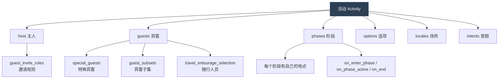
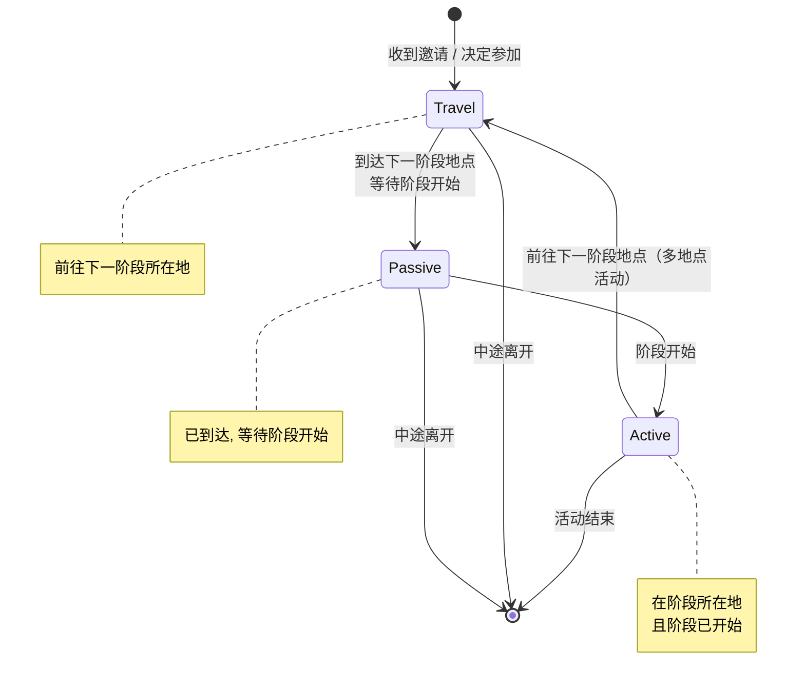
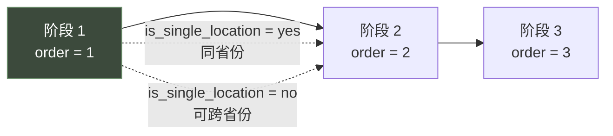
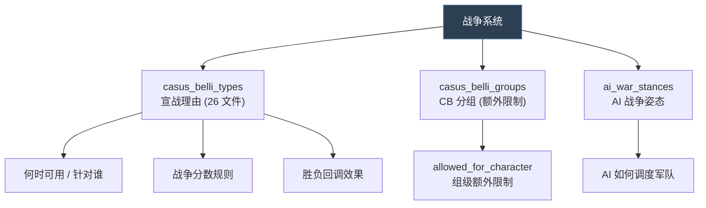
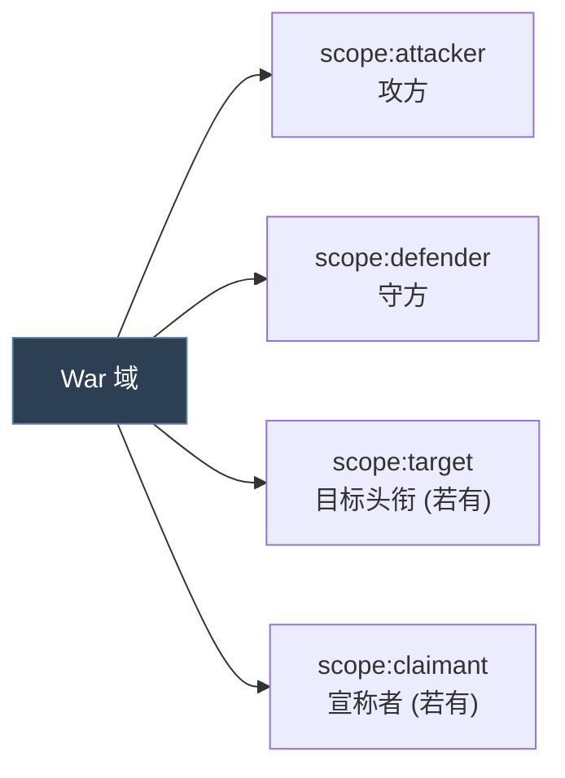
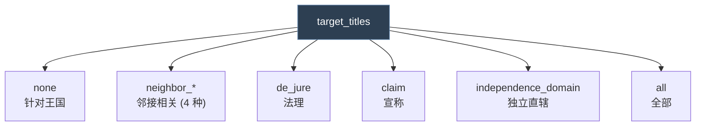
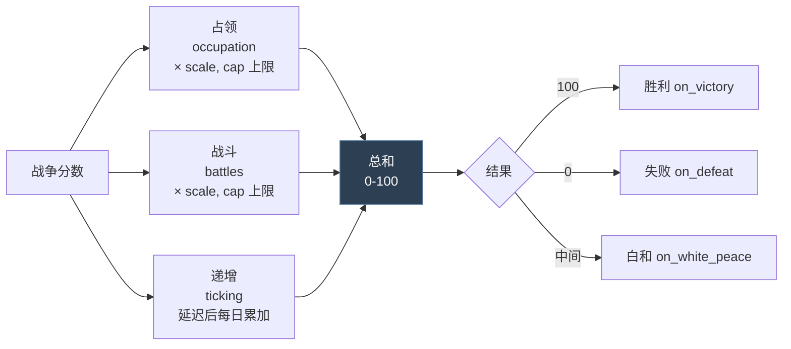
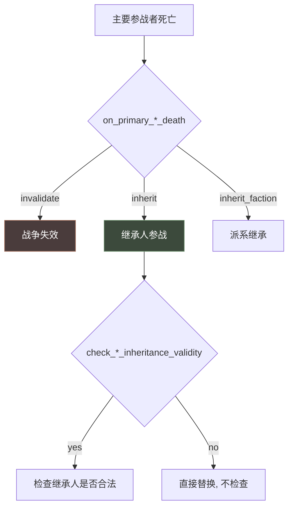
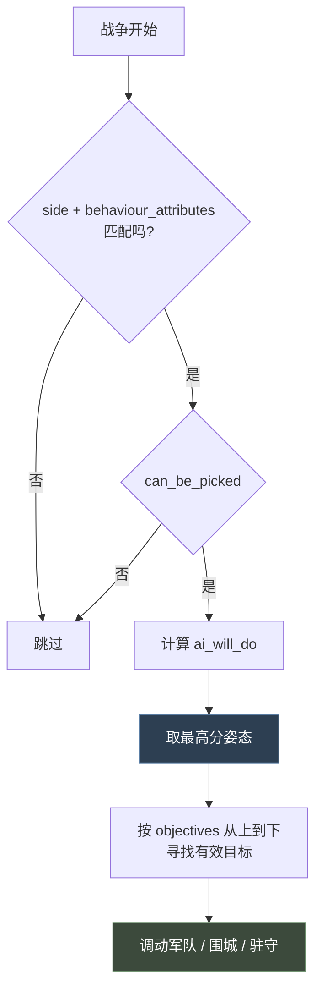

# 12 活动与战争

> 两个**体量最大**的系统：**活动**是主客多阶段聚会（`.info` 有 1021 行，全游戏最长），**战争**没有独立定义文件、由 CB 驱动。

## 本篇导读

| 维度 | 活动 `activities/` | 战争 `casus_belli_types/` |
|---|---|---|
| 定义文件 | `activity_types/*.txt` | **无独立 war 定义**，由 CB 承载全部规则 |
| 参与方 | host + guests（各有 intent） | attacker vs defender + 盟友 |
| 推进 | 阶段 `phase` 顺序执行 | 战争分数 0-100 |
| 状态机 | Travel / Passive / Active 三态 | 无（连续数值） |
| 配置量 | 极大（62 文件 + 6 info） | 中等（26 文件 + info） |

### 活动的三态角色状态机

```
Travel   前往下一阶段所在地
   ↓
Passive  已到达，等待阶段开始
   ↓
Active   在阶段所在地且阶段已开始
   ↓（多地点活动则回到 Travel）
```

每种状态各有 进入 / 离开 / 脉冲 三类钩子，共 **9 个**。

### 战争的分数三来源

```
战争分数 = 占领分（× scale，有 cap）
         + 战斗分（× scale，有 cap）
         + 递增分（延迟后每日累加）
→ 100 = 胜利 on_victory ／ 0 = 失败 on_defeat
```

## 文档关联

- **前置**：[03 触发器与效果](03-触发器与效果.md)、[06 事件系统与 on_action](06-事件系统与on_action.md)
- **同类**：[11 阴谋与派系](11-阴谋与派系.md)（派系战争通过 `casus_belli` 接到战争系统）
- **对照**：[09 故事循环与局势](09-故事循环与局势.md)（同样有"阶段"，但局势是区域状态机）
- **交叉**：[13 政体、特质与共治](13-政体、特质与共治.md)（政体的 `government_rules` 影响战争与活动）

## 目录

| 章 | 章节 |
|---|---|
| 第一章 活动 | 概念 · 三态状态机 · 生命周期钩子 · 规划期 · `options` · `phases` · 宾客系统 · `intents` · `locales` · 表现层 · 描述文本 · AI 配置 · 童年玩伴聚会实例 · 专属语法 |
| 第二章 战争 | 概念与三件套 · 三方作用域 · 目标选择 · 战争分数规则 · 回调 · 死亡与继承 · 名称界面 · 宗教战争 · AI 配置 · CB 分组 · 宣称战争实例 · AI 战争姿态 |

---

# 第一章 活动（Activity）

## 1.1 概念

**活动 = 由一名主人（host）发起并邀请宾客（guest）的、分阶段、可跨地点的多角色社交事件。**

活动是 CK3 里**体量最大**的系统 —— `activity_types/_activity_type.info` 有 **1021 行**，是全游戏最长的语法说明。



## 1.2 角色状态机

**活动的参与者有三种状态**（官方 `_activity_type.info:1-4`）：



**每种状态都有进/出/脉冲三类钩子**：

| 状态 | 进入 | 离开 | 脉冲 |
|---|---|---|---|
| Travel | `on_enter_travel_state` | `on_leave_travel_state` | `on_travel_state_pulse` |
| Passive | `on_enter_passive_state` | `on_leave_passive_state` | `on_passive_state_pulse` |
| Active | `on_enter_active_state` | `on_leave_active_state` | `on_active_state_pulse` |

> 这些钩子的 root 都是**处于该阶段的角色**，另有 `scope:activity`、`scope:host`。

## 1.3 生命周期钩子

| 钩子 | Root | 时机 |
|---|---|---|
| `on_start` | activity | 活动创建时 |
| `on_complete` | character in phase | 最后阶段完成后 |
| `on_invalidated` | activity | `is_valid` 失败时 |
| `on_host_death` | activity | 主人死亡时 |

> **官方注意**（info:821-822）："AI-only activities will not persist more than 1 day after this."
> —— 纯 AI 活动在 `on_complete` 后只会保留 1 天。

## 1.4 规划期（Planning）

### ① 可见与可办

```paradox
is_shown = {}                        # root = character 想办此活动
can_start = {}                       # 显示每条 trigger 的通过/失败
can_start_showing_failures_only = {} # 只显示失败原因
can_plan = {}                        # 能否规划（空则取 can_start_showing_failures_only）
can_always_plan = bool               # 需求未满足时是否仍允许规划，默认 yes
```

> **`can_always_plan` 的作用**（info:47-51）："Do we prevent the player to start planning an activity when additional requirements (i.e. not costs or cooldown) have not been met."

### ② 地点选择

```paradox
province_filter = capital        # 玩家可候选的省份范围
ai_province_filter = capital     # AI 可候选的（应与上者配套）
province_filter_target = ""      # landed_title / geographical_region 需要指定目标
```

**全部 `province_filter` 取值**（info:80-95）：

| 值 | 含义 |
|---|---|
| `capital` | 规划者首都（**默认**） |
| `domain` | 直辖省份 |
| `realm` | 王国省内 |
| `top_realm` | 顶头领主的王国内 |
| `holy_sites` | 信仰圣地 |
| `holy_sites_domain` | 圣地 或 直辖 |
| `holy_sites_realm` | 圣地 或 王国 |
| `domicile` | 宅邸所在地 |
| `domicile_domain` | 宅邸 且 直辖 |
| `domicile_realm` | 宅邸 且 王国 |
| `top_liege_border_inner` | 顶头领主境内与他国接壤的省份 |
| `top_liege_border_outer` | 与顶头领主接壤的境外省份 |
| `landed_title` | 某头衔下的法理省份（需 `province_filter_target`） |
| `geographical_region` | 某地理区域（需 `province_filter_target`） |
| `all` | **全世界所有省份** |

> **官方警告**（info:79）："WARNING: Using all is going to be noticeably slower, you almost certainly do not need to use it..."
> 对 AI 更严厉（info:102）："You really definitely do not want the AI using all..."

```paradox
is_location_valid = {}   # root = province, scope:host, scope:special_option
province_score = {}      # root = province, scope:host, 评分
max_province_icons = 5   # 地图上最多显示几个候选图标
```

### ③ 时间

```paradox
wait_time_before_start = { days = N }        # 主人到达后额外等待多久才开始，默认 0
max_guest_arrival_delay_time = { days = N }  # 为等宾客最多推迟多久，默认 0
                                             # 不适用于 required special guest（会一直等）
max_route_deviation_mult = 2.0               # 玩家可绕路的最大倍率
cooldown = { days/weeks/months/years = X }   # 冷却
```

### ④ 成本

三个层级**都可以**定义成本：

```paradox
cost = {                 # 活动整体（root = character）
	gold = {}
	piety = {}
	prestige = {}
	renown = {}
}
ui_predicted_cost = {}   # UI 显示的预估成本（不一定等于实际）

options.<category>.<option>.cost = {}    # 选项级
phases.<phase>.cost = {}                 # 阶段级（root = character, scope:province, scope:previous_province）
```

## 1.5 选项 `options`

```paradox
options = {
	option_category = {          # 可多个类别，名字唯一
		option_1 = {             # 可多个选项，名字唯一
			is_shown = {}        # root = character
			is_valid = {}        # root = character
			on_start = {}        # root = activity, scope:activity, scope:host
			default = { }        # 第一个为真的成为默认；或 default = yes 恒为默认
			cost = { gold/piety/prestige/renown = {} }
			ai_will_do = { value = 10 }      # 加权随机

			blocked_intents = { murder kidnap }   # 阻断哪些意图
			blocked_phases = { archery joust }    # 移除哪些阶段

			travel_entourage_selection = {
				weight = { value = 10 }   # root = 宫廷角色, scope:host, scope:owner
				max = 2
				ai_max = 2
				invite_rule_order = 3
			}
		}
	}
}

special_option_category = option_category   # 若有, 玩家须先选这个类别再选地点
```

> **为什么需要 `blocked_intents`**（info:165-167）："This is required because when planning an activity some intents are blocked by certain options, but the activity does not yet exist properly for the intent's definition itself to check the activity's current options"

## 1.6 阶段 `phases`

```paradox
phases = {
	archery = {
		is_predefined = yes          # 预定义阶段：始终存在, 不可移除
		number_of_picks = <script value>   # 可被选几次（仅 is_predefined = no 时有效）
		order = 1                    # 执行顺序

		location_source = pickable   # pickable / first_picked_phase / last_picked_phase / scripted

		select_scripted_location = { # location_source = scripted 时使用
			save_scope_as = province
		}

		ai_will_do = { }             # root = character, scope:province
		is_shown = { }               # root = character
		can_pick = { }               # root = character, scope:province
		is_valid = { }               # root = activity, scope:host, scope:province

		on_enter_phase = { }         # root = character in phase
		on_phase_active = { }        # root = character in phase
		on_end = { }                 # root = character in phase
		on_monthly_pulse = { }       # root = character in phase
		on_weekly_pulse = { }        # root = character in phase
		on_invalidated = { }         # root = character in phase, scope:province

		cost = { gold/piety/prestige/renown = {} }
	}
}
```

**阶段数量控制**：

```paradox
num_pickable_phases = <script value>            # 玩家可挑几个阶段，默认 0
max_pickable_phases_per_province = <script value>  # 每个省份最多几个，默认同上
is_single_location = bool                       # 所有阶段是否同一省份，默认 yes
```



## 1.7 宾客系统

### ① 人数与邀请

```paradox
max_guests = {              # 可参加的宾客数
	value = 10
	if = {
		limit = { scope:option_category ?= flag:option_1 }
		add = 20
	}
}
reserved_guest_slots = 5    # 为效果/事件添加的宾客预留的名额
allow_zero_guest_invites = yes/no   # 能否零邀请开局，默认 no
```

> **性能警告**（info:506-507）："be very careful if you raise this value too high it will cause performance impacts due to too many people travelling to activities and too many possible intent targets"

> **`max_guests` 里的 flag 提醒**（info:509-510）："`scope:<option_category_key>` = for every option category defined, will have a flag of the selected option. warning: these flags may not be set, so usage of `?=` is advised."
> —— 必须用**弱比较 `?=`**，因为这些 flag 可能不存在。

### ② 邀请规则

```paradox
guest_invite_rules = {
	rules = {          # 左边是优先级，数字小者优先，必须 >= 1
		1 = friends
		2 = rivals
		1 = lovers
		3 = witches
		4 = vassals
	}
	defaults = {       # 玩家默认启用的规则，会追加到 rules 并按优先级插入
		1 = best_friends
		4 = fellow_vassals
	}
}
open_invite = no       # 开放邀请：任何人达标即可参加（AI 会等 rules 处理完才开始自行加入）
```

### ③ 宾客子集与特殊宾客

```paradox
guest_subsets = { guest_subset_1  guest_subset_two }   # 可被阶段引用的宾客子集

special_guests = {
	<key> = {
		is_shown = {}        # root = host
		is_required = yes/no # 必需？拒绝则活动自动失效（死亡不失效，需在 is_valid 里处理）

		select_character = { }   # root = host, 用 save_scope_as = character 指定
		can_pick = {}            # root = character, scope:host
		ai_will_do = { value = 10 }
		on_invite = {}           # root = character, 发出邀请时（接受前）
	}
}
```

> **本地化**：特殊宾客的 key 直接本地化；给主人看的名字用 `<key>_for_host`。

### ④ 宾客资格与加入概率

```paradox
can_be_activity_guest = { }   # root = character, scope:host
                              # 在基础 can_be_activity_guest 脚本规则之上追加

guest_join_chance = {
	base = 10
	modifier = { add = 10 }
}
# root = character 被邀请者
# scope:host, scope:minimal_travel_time, scope:activity_start_diff_days
# scope:<special_guest_key>, scope:<option_category_key>, scope:special_guests
```

## 1.8 意图 `intents`

定义目录：`common/activities/intents/_intents.info`

**意图 = 参与者在活动中可以偷偷进行的隐藏目标**（如"谋杀某位宾客"、"偷金币"）。

```paradox
befriend = {
	is_shown = {}    # root = character, scope:magnificence, scope:special_option
	is_valid = {}
	is_target_valid = {}   # root = character, scope:target（定义了 target trigger 就必须选目标）

	on_invalidated = {}          # root = character who picked
	on_target_invalidated = {}

	ai_will_do = {}              # root = character, scope:activity
	ai_targets = {               # 与 character_interaction.info 的 ai_targets 完全一致
		ai_recipients = type
		max = integer
		chance = 0-1
	}
	ai_target_quick_trigger = {
		adult = yes
		attracted_to_owner = yes
		owner_attracted = yes
		prison = yes
	}
	ai_target_score = {}         # root = character, scope:target

	icon = "file_name"
	scripted_animation = "animation_key"
	# 或内联：
	scripted_animation = { <inline scripted animation> }
}
```

**在活动类型里配置**：

```paradox
host_intents = {
	intents = { befriend murder kidnap steal_gold }
	default = befriend                        # 必须永远有效
	player_defaults = { murder befriend }     # 玩家优先尝试的顺序
}

guest_intents = {
	intents = { befriend murder kidnap steal_gold }
	default = befriend
	player_defaults = { steal_gold befriend }
}
```

> **本地化**：`key`（名字，可用 `CHARACTER` 与 `TARGET_CHARACTER`）、`key_desc`（描述）。

## 1.9 场所 `locales`

定义目录：`common/activities/activity_locales/_activity_locales.info`

**场所 = 活动阶段之间可以去的小场景**（酒馆、教堂、铁匠铺…）。

```paradox
activity_locale_type = {
	is_available = { }        # root = Character, scope:host, scope:activity
	chance = { }              # 加权随机选中概率
	on_enter_locale = { }     # root = Character, scope:host, scope:activity
	ai_will_do = { }
	cooldown = { days = 7 }   # 进入后多久不能再次进入

	visuals = {               # 可多条, 取第一个 trigger 通过的
		trigger = {}
		reference = "name"    # gui/activity_locales/<name>
	}
	visuals = "name"          # 简写
}
```

**在活动类型里配置**：

```paradox
locales = {
	<slot_key> = {
		is_available = { }        # root = Activity, scope:host, scope:activity
		locales = { tavern church blacksmith }
	}
}

locale_cooldown = { days = 7 }                 # 进入任一场所后全局冷却
auto_select_locale_cooldown = { days = 14 }    # 玩家自动访问场所的间隔
early_locale_opening_duration = { days = 14 }  # 阶段开始前多久开放场所
```

## 1.10 表现层

```paradox
activity_group_type = <key>       # 可折叠分组，默认 'activities'
sort_order = integer              # 组内排序，大者在前
planner_type = province/holder    # 规划器显示省份名 / 持有者信息

map_entity = {
	trigger = {}
	reference = "name"
}
map_entity = "name"               # 简写

background = {
	trigger = {}
	texture = "texture_path"
	environment = "environment name"
	ambience = "ambience_event_path"
	music = "music_cue_track_name"
}
locale_background = { ... }       # 场所窗口专用背景

window_characters = {
	key = {                       # 本地化为 activity_window_character_key
		camera = camera_name
		effect = { add_to_list = characters }   # 通过 add_to_list 挑人
		scripted_animation = { triggered_animation = { ... } }
	}
}

activity_window_widgets = { name = "parent_container" }
activity_planner_widgets = { name = "parent_container" }
```

> **背景约定**（info:843）："The background for the activity is defined in event_backgrounds and looks up an entry with the same key as the activity"
> —— 活动背景在 `event_backgrounds` 里定义，键名与活动相同。

## 1.11 描述文本

```paradox
province_description    = { first_valid = { desc = xxx } }   # 默认 <key>_province_desc
host_description        = { first_valid = { desc = xxx } }   # 默认 <key>_host_desc
conclusion_description  = { first_valid = { desc = xxx } }   # 默认 <key>_conclusion_desc
```

三者**都支持动态描述块**，作用域各不相同。

## 1.12 AI 配置

```paradox
ai_will_do = { value = 10 }        # 举办意愿; 须超过 define ACTIVITY_SCORE_THRESHOLD
                                   # 该值同时作为"是否举办"的百分比概率
ai_check_interval = 1              # 每多少个月检查一次
ai_check_interval_by_tier = {      # 按头衔层级, 0 = 永不考虑, 所有层级都要写
	barony = 0  county = 10  duchy = 2
	kingdom = 1  empire = 1  hegemony = 1
}
ai_will_select_province = {}       # root = province, scope:host, scope:score
ai_select_num_provinces = {}       # root = host, 多地点活动用
notify_player_can_join_open_activity = no   # 开放活动可否加入时是否提醒
```

## 1.13 真实示例解析：童年玩伴聚会

出处：`common/activities/activity_types/playdate.txt`

```paradox
activity_playdate = {
	# ── 谁能办 ──
	is_shown = {
		highest_held_title_tier > tier_barony

		# 伯爵的话必须有领主
		trigger_if = {
			limit = { highest_held_title_tier = tier_county }
			top_liege != this
		}

		is_landed_or_landless_administrative = yes

		# AI 的限制
		trigger_if = {
			limit = { is_ai = yes }
			is_at_war = no
			NOT = { has_variable = conqueror }
			trigger_if = {           # 限制伯爵的社交频率
				limit = { highest_held_title_tier = tier_county }
				ai_sociability >= 100
			}
		}

		is_adult = no                # 只有未成年能办！
		age < less_than_two_years_to_adulthood_value

		# 未加冕的 AI 必须先加冕
		trigger_if = {
			limit = { is_ai = yes  age >= 12 }
			NOT = { has_realm_law = uncrowned }
		}
	}

	can_start_showing_failures_only = {
		NOT = { is_activity_type_on_cooldown = activity_playdate }
		is_available = yes
		age >= 4
	}

	# ── 活动进行中的有效性 ──
	is_valid = {
		scope:host = {
			is_imprisoned = no
			is_landed_or_landless_administrative = yes
			NOT = { is_incapable = yes }
		}
		# 如果没人来
		trigger_if = {
			limit = { is_current_phase_active = yes }
			has_attending_activity_guests = yes
		}
	}

	# ── 失效处理（分情况给不同事件）──
	on_invalidated = {
		if = {    # 主人被囚禁
			limit = { scope:host = { is_imprisoned = yes } }
			every_attending_character = {
				limit = { this != scope:host }
				trigger_event = playdate.0022
			}
			scope:host = { trigger_event = playdate.0021 }
		}
		if = {    # 主人失去领地
			limit = { scope:host = { is_landed_or_landless_administrative = no } }
			scope:activity = {
				activity_type = { save_scope_as = activity_type }
			}
			every_attending_character = { trigger_event = activity_system.0320 }
		}
		if = {    # 主人失去行为能力
			limit = { scope:host = { is_incapable = yes } }
			scope:activity = { activity_type = { save_scope_as = activity_type } }
			scope:host = { trigger_event = activity_system.0330 }
			every_attending_character = {
				limit = { this != scope:host }
				trigger_event = activity_system.0331
			}
		}
		if = {    # 没人来
			limit = { has_attending_activity_guests = no }
			scope:host = { trigger_event = playdate.2003 }
		}
	}

	is_location_valid = {
		exists = province_owner
		province_owner.top_liege = scope:host.top_liege
	}

	on_host_death = {
		every_attending_character = { trigger_event = playdate.0020 }
	}

	province_filter = capital
	ai_province_filter = capital
	max_province_icons = 5
}
```

**设计要点**：

1. `is_shown` 用**三层嵌套 `trigger_if`** 表达复杂的条件树
2. `is_valid` 里用 `trigger_if` + `is_current_phase_active` 做"仅在阶段进行时检查"
3. **`on_invalidated` 按不同失效原因给不同事件** —— 这是活动系统的标准做法
4. `every_attending_character` 是活动专属迭代器
5. 用 `scope:activity = { activity_type = { save_scope_as = activity_type } }` 把活动类型存成域

## 1.14 活动专属语法

| 语法 | 含义 |
|---|---|
| `every_attending_character` | 遍历所有在场的角色 |
| `has_attending_activity_guests = yes/no` | 是否有宾客到场 |
| `is_current_phase_active = yes/no` | 当前阶段是否进行中 |
| `is_activity_type_on_cooldown = <key>` | 该活动类型是否在冷却 |
| `scope:activity` | 活动本体 |
| `scope:host` | 主人 |
| `scope:magnificence` | 活动华丽度（intents 里可用） |
| `scope:special_option` | 已选特殊选项的 flag |
| `scope:<special_guest_key>` | 已选的特殊宾客 |
| `scope:<option_category_key>` | 已选选项的 flag（**可能不存在，用 `?=`**） |
| `add_to_guest_subset` / `remove_from_guest_subset` | 宾客子集增删 |
| `every_guest_subset_current_phase` | 遍历当前阶段的某个宾客子集 |

---

# 第二章 战争（War）

## 2.1 概念

**战争没有独立的"war 定义文件"**。CK3 的战争系统由三部分组成：



| 目录 | 角色 |
|---|---|
| `common/casus_belli_types/` | **核心**：每个 CB 定义一场"战争类型"的全部规则 |
| `common/casus_belli_groups/` | CB 分组，组级可加额外限制 |
| `common/ai_war_stances/` | AI 在战争中的行为姿态与军事目标优先级 |

## 2.2 战争的三方作用域



各 Trigger 的 root：

| Trigger | Root | 作用域 |
|---|---|---|
| `allowed_for_character` | **attacker** | `scope:attacker` `scope:defender` |
| `allowed_against_character` | **defender** | `scope:attacker` `scope:defender` |
| `valid_to_start` | **attacker** | `scope:attacker` `scope:defender` `scope:target` |
| `is_allowed_claim_title` | **title** | `scope:attacker` `scope:defender` `scope:claimant` |

> **官方警告**（`_casus_belli.info:51-52`）："Note that `scope:defender` may or may not be valid depending on how the trigger is tested, make accommodations to ensure the trigger works as intended no matter if defender exists or not"
> —— `scope:defender` **可能不存在**，必须做容错！

### `*_display_regardless` 变体

```paradox
allowed_for_character                     = { }   # 失败则隐藏
allowed_for_character_display_regardless  = { }   # 失败仍显示（标灰）

allowed_against_character                     = { }
allowed_against_character_display_regardless  = { }

valid_to_start                         = { }
valid_to_start_display_regardless      = { }
```

> 用途：让"你暂时不能宣战，但能看到这个 CB 存在" —— 与决议的 `is_valid` / `is_valid_showing_failures_only` 异曲同工。

## 2.3 目标选择

```paradox
target_titles = <枚举>            # 可针对哪些头衔
target_title_tier = tier          # 限定目标层级
target_de_jure_regions_above = yes   # 可针对持有该头衔法理领地者，而非仅持有者本人

use_de_jure_wargoal_only = yes    # 战争目标只算法理领地
mutually_exclusive_titles = { }   # 为真则只能针对一个头衔
combine_into_one = yes            # 多个实例合并为一个可选目标的条目
```

**`target_titles` 全部取值**（info:67）：

| 值 | 含义 |
|---|---|
| `none` | 不针对头衔，针对整个王国 |
| `neighbor_land` | 陆地邻国 |
| `neighbor_land_or_water` | 陆海邻国 |
| `neighbor_land_tributary` | 陆地邻国（含附庸） |
| `neighbor_land_or_water_tributary` | 陆海邻国（含附庸） |
| `de_jure` | 法理领地 |
| `claim` | 宣称 |
| `independence_domain` | 独立直辖 |
| `all` | 全部 |



## 2.4 战争分数规则

这是 CB 里参数最多的一块。

```paradox
# ── 递增战争分数（Ticking Warscore）──
attacker_ticking_warscore_delay = { months = 12 }   # 多久后开始递增
defender_ticking_warscore_delay = { months = 12 }
attacker_ticking_warscore = 0.1                     # 每日递增
defender_ticking_warscore = 0.1
attacker_wargoal_percentage = 0.75                  # 需占领战争目标多少比例才开始递增
defender_wargoal_percentage = 0.75                  # 0.0 = 至少占领一处

# ── 来自占领的分数 ──
attacker_score_from_occupation_scale = 100
defender_score_from_occupation_scale = 100
max_attacker_score_from_occupation = 50
max_defender_score_from_occupation = 100

# ── 来自战斗的分数 ──
attacker_score_from_battles_scale = 40
defender_score_from_battles_scale = 50
max_attacker_score_from_battles = 50
max_defender_score_from_battles = 100

# ── 参与度倍率 ──
occupation_participation_mult = 1.0
siege_participation_mult = 1.0
battle_participation_mult = 1.0

# ── 特殊规则 ──
full_occupation_by_defender_gives_victory = no
full_occupation_by_attacker_gives_victory = no
landless_attacker_needs_armies = no
attacker_capital_gives_war_score = no
defender_capital_gives_war_score = no
imprisonment_by_attacker_give_war_score = no
imprisonment_by_defender_give_war_score = no
check_all_defenders_for_ticking_war_score = yes   # 检查所有守方在战争目标内的领地
ticking_war_score_targets_entire_realm = yes      # 检查整个王国而非仅战争目标
```

> **默认值来源**：这些值在 CB 里未设置时，全部取自 defines（info:5）。



## 2.5 战争回调

```paradox
on_declaration = { }   # 宣战时
on_victory     = { }   # 胜利
on_white_peace = { }   # 白和
on_defeat      = { }   # 失败
on_invalidated = { }   # 失效

on_victory_desc     = { }   # 动态描述：胜利后果
on_defeat_desc      = { }
on_white_peace_desc = { }

should_invalidate = { }     # 是否应失效
cost = { gold piety prestige }   # 宣战成本

truce_days = int              # 停战天数
ignore_effect = <effect name> # 在效果描述里跳过的效果，可定义多条
                              # 例: ignore_effect = change_title_holder
```

## 2.6 死亡与继承

```paradox
on_primary_attacker_death = invalidate/inherit/inherit_faction
on_primary_defender_death = invalidate/inherit/inherit_faction
transfer_behavior = invalidate/transfer

check_attacker_inheritance_validity = yes/no   # no = 替换前不检查合法性
check_defender_inheritance_validity = yes/no
attacker_allies_inherit = yes/no               # 盟友是否继承参战
defender_allies_inherit = yes/no
```



## 2.7 名称与界面

```paradox
war_name = string                    # 战争名
my_war_name = string                 # 宣称者与攻方同一人时使用
war_name_base = string
my_war_name_base = string

interface_priority = int             # 排序，高者在前，平手按定义顺序
should_check_for_interface_availability = no   # no = 不参与 has_any_cb_on 检查
target_top_liege_if_outside_realm = no  # 绕过"境外只能针对顶头领主"检查
                                        # 仅用于脚本战争（如农民起义），UI 里无效
```

## 2.8 宗教战争相关

```paradox
is_great_holy_war = yes                    # 是否是圣战
defender_faith_can_join = yes              # 同信仰者可防御性加入
gui_attacker_faith_might_join = yes        # 仅 UI 警告，无实际效果
gui_defender_faith_might_join = yes        # 同上
```

> **区分**：`gui_*` 只是提示；`defender_faith_can_join` 才真的会加人。

```paradox
white_peace_possible = no   # 禁止白和，只有胜/败/失效
allow_hostages = yes        # 和谈能否用人质
```

## 2.9 AI 配置

```paradox
ai = no                          # 设为 no 则 AI 完全忽略此 CB
ai_only_against_liege = yes      # AI 只对自己的领主用
ai_only_against_neighbors = yes  # AI 只对陆海邻国用
max_ai_diplo_distance_to_title = int   # 超过此距离的标题 AI 永不考虑

ai_can_target_all_titles = {     # 命中则用脚本目标，否则用 neighbor_land_or_water
	# Trigger, character scope
}

ai_score = { }        # script value, 加到硬编码的标题评分上
ai_score_mult = { }   # script value, 与标题评分相乘

ai_overlord_defensive_power_impact = {}   # 附庸被攻时领主介入概率 0-1
# root/attacker = 评估宣战的角色
# defender = 被针对的附庸
# overlord = 会介入的领主
```

> **`ai_overlord_defensive_power_impact` 的语义**（info:101-106）：
> "0.4 = 40% of the power of the overlord, 60% of the power of the subject"
> `0` = AI 认为领主不会来救；`1` = AI 按领主全实力评估。

## 2.10 CB 分组 `casus_belli_groups`

```paradox
religious = {
	allowed_for_character = {
		OR = {   # 领主信仰不同则不能圣战
			top_liege = this
			any_liege_or_above = {
				faith = prev.faith
				count = all
			}
		}
		faith = {
			NOR = {
				has_doctrine_parameter = unreformed          # 未改革异教不能圣战
				AND = {
					has_doctrine_parameter = holy_wars_forbidden   # 和平主义不能圣战
					NOT = { prev = { has_character_flag = bonus_major_holy_war } }
				}
			}
		}
		herders_and_tributary_constraints = yes
		tgp_dynastic_cycle_offensive_wars_ban_trigger = yes
		tgp_war_ban_all_ministers_trigger = yes
	}
}
```

> 出处：`common/casus_belli_groups/00_casus_belli_groups.txt`
> 分组的作用是**把一组 CB 的共同限制抽出来**，避免在每个 CB 里重复写。

## 2.11 真实示例解析：宣称战争

出处：`common/casus_belli_types/00_claim.txt`

```paradox
claim_cb = {
	icon = claim_cb
	group = claim

	# 能否同时推多个宣称
	mutually_exclusive_titles = {
		NOT = {
			trigger_if = {
				limit = { scope:attacker = scope:claimant }   # 推自己的宣称
				scope:attacker = {
					OR = {
						culture = { has_innovation = innovation_chronicle_writing }
						AND = {
							government_has_flag = government_is_landless_adventurer
							has_realm_law = camp_purpose_legitimists
							has_variable = legitimist_claimed_title
							var:legitimist_claimed_title = {
								OR = {
									holder = scope:defender
									de_jure_liege.holder = scope:defender
								}
							}
						}
					}
				}
			}
			trigger_else = {    # 替别人推宣称：需要更高时代的革新
				scope:attacker = {
					culture = { has_innovation = innovation_divine_right }
				}
			}
		}
	}

	# Root is the title
	# scope:claimant is the claimant
	# scope:attacker is the attacker
	# scope:defender is the defender
	is_allowed_claim_title = {
		trigger_if = {
			limit = {
				scope:attacker = { is_ai = yes  has_variable = conqueror }
			}
			tier >= tier_duchy
		}

		custom_description = {
			text = "claimant_titles_held_by_you_or_vassal"
			NOR = {
				holder = scope:attacker
				holder = { target_is_liege_or_above = scope:attacker }
			}
		}

		scope:claimant = {
			NOT = { has_trait = incapable }
			is_hostage = no
			custom_description = {
				text = is_not_a_minister_desc
				...
			}
		}
	}
}
```

**设计要点**：

1. **`trigger_if` / `trigger_else` 用在 Trigger 上下文** —— CB 的判定几乎全是 Trigger
2. `mutually_exclusive_titles` 用 `NOT = { ... }` 包裹，逻辑是"**若不满足多选条件，则只能选一个**"
3. `custom_description` 给玩家解释"为什么这个宣称不能推"
4. 时代革新（编年史书写 → 神圣权利）决定能否多推 —— **经典的时代进步设计**
5. `var:legitimist_claimed_title = { ... }` —— 变量存的是头衔，可以直接当域用

## 2.12 AI 战争姿态 `ai_war_stances`

定义目录：`common/ai_war_stances/`（`_ai_war_stances.info`）

**战争姿态 = AI 在战争中的行为模式与目标优先级。**

```paradox
war_stance = {
	side = attacker/defender          # 必须设置

	behaviour_attributes = {          # 至少一项为 yes
		stronger  = yes   # 我方更强时评估
		weaker    = yes   # 我方更弱时评估
		desperate = yes   # 显著更弱且即将战败/只剩一个头衔（仅守方）
	}

	can_be_picked = {}   # root = War
	ai_will_do = {}      # root = War, 权重

	enemy_unit_priority = x   # 敌方单位的优先分

	objectives = { ... }
}
```

### 目标类型 `objectives`

| 目标 | 含义 |
|---|---|
| `wargoal_province` | 战争目标省份 |
| `enemy_unit_province` | 有敌方部队的省份（可见的） |
| `enemy_capital_province` | 敌方首都 |
| `capital_province` | 我方首都 |
| `enemy_province` | 敌方省份 |
| `enemy_ally_province` | 敌方盟友省份 |
| `province` | 我方省份 |
| `defend_wargoal_province` | 退守战争目标（忽略"无意义的围城/战斗"过滤） |

```paradox
objectives = {
	enemy_province = 200                 # 简单形式：目标名 = 优先级 (0-1000)

	enemy_unit_province = {              # 对象形式：仅 enemy_unit_province 支持
		priority = 250
		area = wargoal                   # 可多个
	}
}
```

**`area` 全部取值**：`wargoal` `primary_attacker` `primary_attacker_ally` `primary_defender` `primary_defender_ally`

> ### ⚠ 区域不可重叠
>
> 官方原文（`_ai_war_stances.info:151-152`）："enemy_unit_province areas may not overlap. if you define an area objective in a block you may not use it anywhere else in the objectives definition."
>
> 下面的写法会**报错**且第二个 objective 不会创建：
> ```paradox
> enemy_unit_province = { priority = 50   area = wargoal }
> enemy_unit_province = { priority = 100  area = wargoal  area = primary_attacker }  # ← 重叠!
> ```



**官方示例**（info:167-187）：

```paradox
# 激进但专注：打战争目标 + 追击目标区/守方领地内的敌军
objectives = {
	wargoal_province = 500

	enemy_unit_province = {
		priority = 250
		area = wargoal
		area = primary_defender
	}
}

# 防御姿态：放在激进目标之后, 极低优先级
# 协调员在没有更高优先级目标时知道该做什么
objectives = {
	defend_wargoal_province = 5
}
```

---

## 附 跨系统对照

> 活动与战争的横向对比（生命周期、数值系统、协作模式、选型、专用语法、`.info` 索引）已统一整合到
> [16 多系统选型指南与开发实践](16-多系统选型指南与开发实践.md)。
> 下表仅列出本篇两个系统的**专用语法速查**，便于就近参考。

### 活动专属语法

| 语法 | 含义 |
|---|---|
| `scope:activity` / `scope:host` | 活动本体 / 主人 |
| `scope:special_option` | 已选特殊选项的 flag |
| `scope:magnificence` | 活动华丽度（intents 里可用） |
| `scope:<special_guest_key>` | 已选的特殊宾客 |
| `scope:<option_category_key>` | 已选选项的 flag（**可能不存在，用 `?=`**） |
| `every_attending_character` | 遍历所有在场的角色 |
| `has_attending_activity_guests` | 是否有宾客到场 |
| `is_current_phase_active` | 当前阶段是否进行中 |
| `is_activity_type_on_cooldown = <key>` | 该活动类型是否在冷却 |
| `add_to_guest_subset` / `remove_from_guest_subset` | 宾客子集增删 |
| `every_guest_subset_current_phase` | 遍历当前阶段的某个宾客子集 |

### 战争专属语法

| 语法 | 含义 |
|---|---|
| `scope:attacker` / `scope:defender` | 攻方 / 守方（**可能不存在**，需容错） |
| `scope:target` | 目标头衔 |
| `scope:claimant` | 宣称者 |
| `has_any_cb_on` | Trigger：能否对某角色宣战 |
| `vassal_contract_obligation_level:<key>` | 读取臣属契约的当前义务等级 |

### 官方 `.info` 索引

| 系统 | `.info` 路径 | 大小 |
|---|---|---|
| 活动 | `activities/activity_types/_activity_type.info` | **36.76 KB（全游戏最长）** |
| 活动场所 | `activities/activity_locales/_activity_locales.info` | 2.66 KB |
| 活动意图 | `activities/intents/_intents.info` | 3.12 KB |
| 活动分组 | `activities/activity_group_types/_activity_group_types.info` | 337 B |
| 邀请规则 | `activities/guest_invite_rules/_invite_rules.info` | 646 B |
| 宣战理由 | `casus_belli_types/_casus_belli.info` | 9.42 KB |
| 战争姿态 | `ai_war_stances/_ai_war_stances.info` | 5.53 KB |
