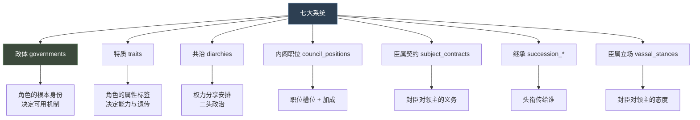
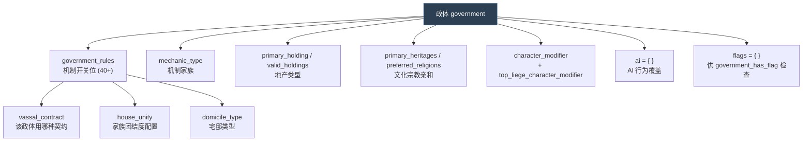
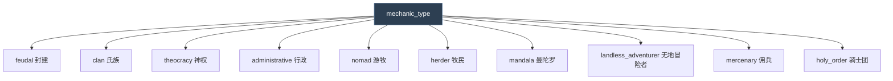
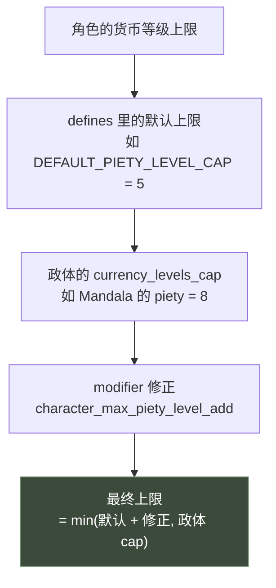
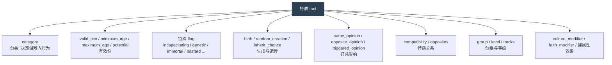
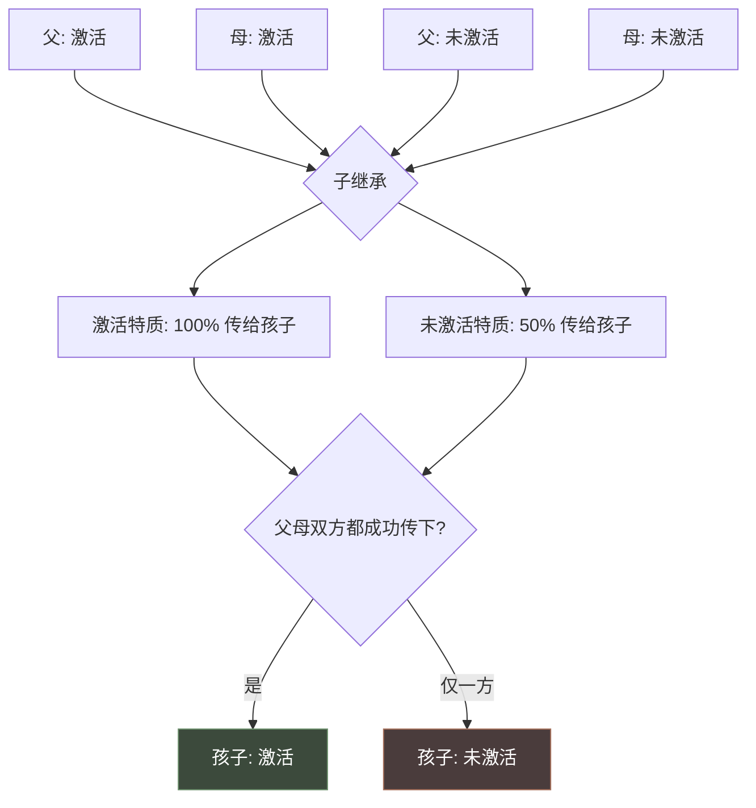
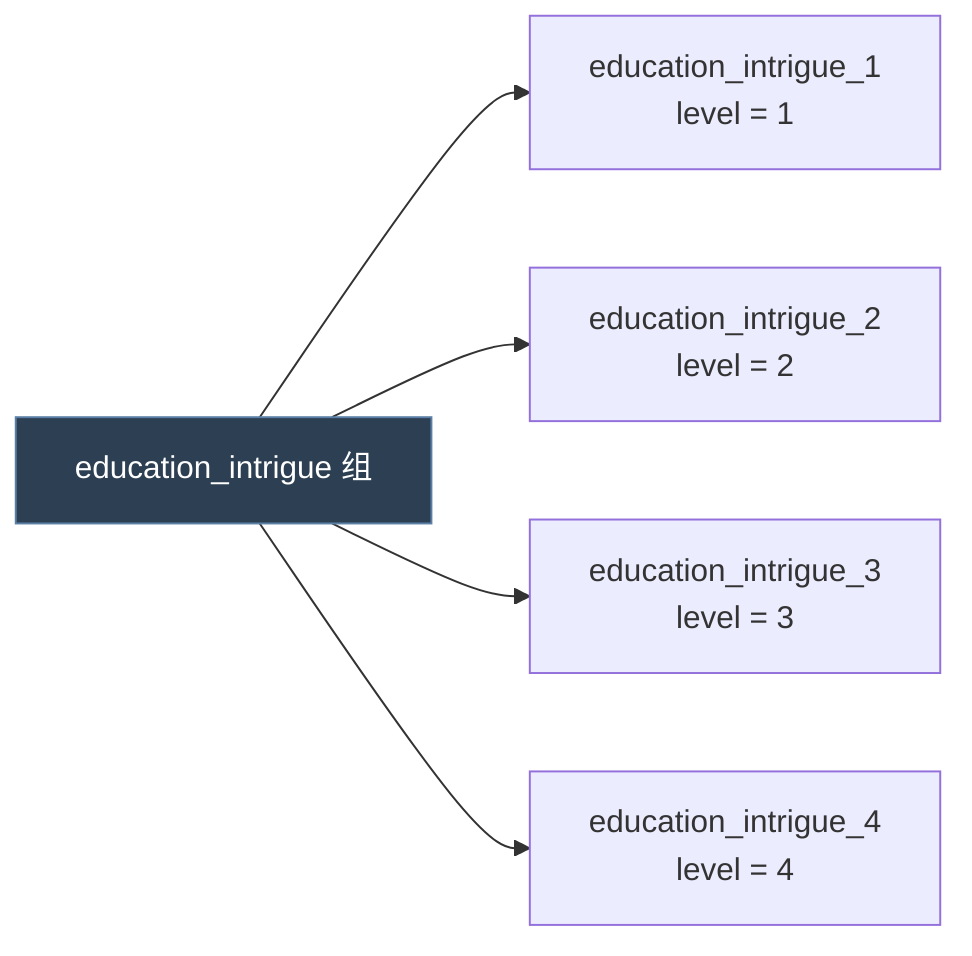
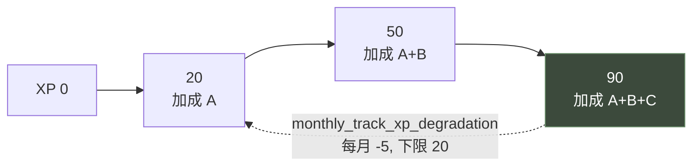
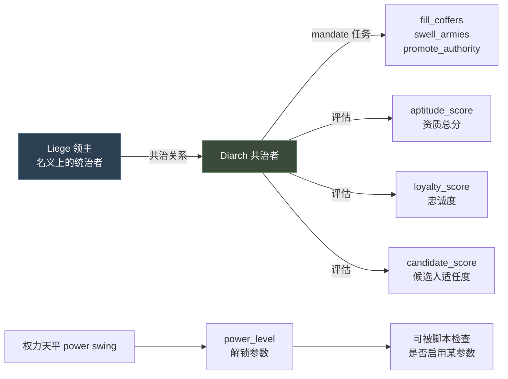
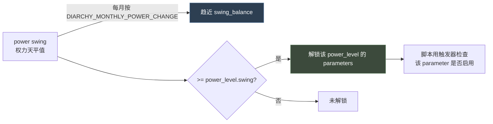

# 13 政体、特质与共治

> 三个定义"角色是什么"的系统：**政体**决定机制开关，**特质**决定属性标签，**共治**决定权力分享。

## 本篇导读

| 维度 | 政体 `governments/` | 特质 `traits/` | 共治 `diarchies/` |
|---|---|---|---|
| 回答 | 这个统治者属于什么制度 | 这个角色有什么属性 | 权力怎么分给两个人 |
| 主要产出 | 40+ 个 `government_rules` 开关 | modifier + 好感 + 遗传 | parameter + modifier |
| 互斥性 | 是（一个政体） | 否（可多特质） | 是 |
| `.info` 规模 | **25.84 KB**（全游戏第二大） | 12.71 KB | 1.53 KB |

### 政体的关键约束

> "Modifiers referenced by a government object can be only generic (hardcoded) modifiers, or modifiers generated from: **schemes / holdings / lifestyles / regions**. Other generated modifiers are *not* allowed."

**货币等级上限**：`modifier` 加的值**永远不能超过** `currency_levels_cap`。

### 特质的核心设计

> "Any other unknown property is treated as a modifier for the character with the trait."

即：特质块里**所有引擎不认识的属性，直接当 modifier 读** —— 这是 P 语言"约定优于配置"的极致。

### 共治的权力天平

```
power swing 每月按 DIARCHY_MONTHLY_POWER_CHANGE 趋近 swing_balance
   ↓ 达到 power_level.swing
解锁该级的 parameters（供脚本用触发器检查）
```

## 文档关联

- **前置**：[03 触发器与效果](03-触发器与效果.md)、[04 修饰符与数值计算](04-修饰符与数值计算.md)
- **下游**：[10 法律与继承](10-法律与继承.md)（政体 `government_rules` 决定哪些继承机制可用；特质 `culture_succession_prio` 影响排序）
- **下游**：[14 内阁职位、臣属契约与臣属立场](14-内阁职位、臣属契约与臣属立场.md)（政体的 `vassal_contract` 指向契约；`council` 开关决定能否用内阁）
- **交叉**：[12 活动与战争](12-活动与战争.md)（政体规则影响战争与活动可用性）

## 目录

| 章 | 章节 |
|---|---|
| 对比 | 七者定位对比 |
| 第一章 政体 | 概念 · `mechanic_type` 九大家族 · 40+ `government_rules` 开关 · 其他关键属性（含货币上限、AI 覆盖、Modifier 限制） |
| 第二章 特质 | 概念 · 本地化与图标 · `category` · 有效性 · 16 个特殊 flag · 生成与遗传 · 立绘影响 · 好感影响 · 特质关系 · 分组等级 · `tracks` 等级轨道 · Modifier 三种来源 · 存档兼容 · 实例 |
| 第三章 共治 | 概念 · `diarchy_types` · `diarchy_mandates` · 权力天平 · 幼帝共治实例 · 类型分类 |

---

## 0. 七者定位对比



| 维度 | 政体 | 特质 | 共治 | 内阁职位 | 臣属契约 | 继承 | 臣属立场 |
|---|---|---|---|---|---|---|---|
| 目录 | `governments/` | `traits/` | `diarchies/` | `council_positions/` | `subject_contracts/` | `laws/`+`succession_*` | `vassal_stances/` |
| 文件数 | 20 | 22 | 4 + 2 info | 9 + info | 17 + 2 info | 5 + 2 info | 1 + info |
| 绑定对象 | 角色 | 角色 | 领主 + 共治者 | 统治者 + 廷臣 | 领主 + 封臣 | 头衔/王国 | 封臣 |
| 触发方式 | 自动/切换 | 出生/授予 | 脚本/law | 任命 | 政体决定 | 死亡/事件 | AI 周期评估 |
| 主要产出 | 机制开关 | modifier | 参数 + 修正 | modifier | 税/兵/好感 | 继承人 | modifier（自动生成） |
| 是否互斥 | 是（一个政体） | 否（可多特质） | 是 | 否 | 每组一条 | 每组一条 | 是（一个立场） |

---

# 第一章 政体（Government）

## 1.1 概念

**政体 = 统治者所属的制度类型，决定他能使用哪些机制、持有哪些地产、如何继承。**

`governments/_governments.info` 有 **25.84 KB**，是全游戏第二大语法说明。



## 1.2 `mechanic_type` —— 机制家族

```paradox
mechanic_type = feudal / mercenary / holy_order / clan / theocracy
              / administrative / landless_adventurer / herder / nomad / mandala

is_mechanic_type_default = yes/no   # 该家族的默认政体，每种家族应有一个
```



> **继承限制**：`inherit_from_dynastic_government` 把政体分为**强宗族**与**非宗族**两组。非宗族政体不能从宗族政体继承 —— 防止低级宗族政体通过继承"偷走"土地与封臣。

## 1.3 `government_rules` —— 机制开关位

这是政体最核心的部分，共 **40+ 个布尔开关**。按功能分类：

### ① 统治与继承

| 规则 | 默认 | 作用 |
|---|---|---|
| `council` | yes | 是否可用内阁 |
| `legitimacy` | yes | 是否可有正统性 |
| `create_cadet_branches` | no | 能否创建旁系家族 |
| `inherit_from_dynastic_government` | yes | 能否从宗族政体继承 |
| `allow_out_of_realm_inheritance` | no | 是否允许境外继承 |
| `sticky_government` | no | 政体是否"粘住"不自动切换 |
| `noble_families` | no | 是否允许贵族家族头衔 |
| `house_aspirations` | no | 是否使用家族抱负 |
| `compatible_government_type_succession` | — | 继承时可接受的其他政体 |

### ② 地产与建筑

| 规则 | 默认 | 作用 |
|---|---|---|
| `buildings` | yes | 能否在建筑槽里造建筑 |
| `affected_by_development` | yes | 领地是否受发展度影响 |
| `uses_county_fertility` | no | 是否使用伯爵领肥沃度 |
| `replenishes_county_fertility` | no | 是否恢复肥沃度 |
| `no_capital_movement_cooldown` | no | 迁都是否无冷却 |
| `disable_regnal_numbers` | no | 是否禁用王号数字 |

### ③ 军事

| 规则 | 默认 | 作用 |
|---|---|---|
| `regiments_prestige_as_gold` | no | 用威望而非金币买兵士 |
| `use_maa_maintenance` | yes | 是否支付兵士维护费 |
| `conditional_maa_refill` | no | 兵士是否只在特定条件下补充（**性能杀手，慎用**） |
| `subject_men_at_arms` | no | 封臣兵士机制 |
| `mercenary` | no | 无地者能否当佣兵 |
| `redirects_wars_to_overlord` | no | 战争是否重定向给上级领主 |

### ④ 资源与货币

| 规则 | 默认 | 作用 |
|---|---|---|
| `treasury` | no | 使用帝国国库资源 |
| `merit` | no | 使用功绩资源 |
| `obedience` | no | 使用服从度 |
| `radiance` | no | 使用荣光机制 |
| `barter` | no | 启用以物易物 |
| `replace_gold_cost_by_treasury` | no | 用国库替代金币支付 |
| `state_faith` | no | 使用国教 |

### ⑤ 外交与头衔

| 规则 | 默认 | 作用 |
|---|---|---|
| `ask_for_tribute` | no | 能否要求他人成为朝贡国 |
| `count_tributaries_for_title_requirements` | no | 创建头衔时是否计入朝贡国 |
| `considers_piety_for_title_creation` | no | 创建头衔是否考量虔诚 |
| `use_title_tier_modifiers` | yes | 是否启用头衔层级的威望增益 |
| `deny_powerful_vassal` | no | 该政体角色永不成为权势封臣 |
| `religious` | no | 是否被视为神职人员 |
| `rulers_should_have_dynasty` | no | 统治者是否生成宗族 |
| `court_generate_spouses` | yes | 是否生成配偶 |
| `court_generate_commanders` | yes | 是否生成指挥官 |

### ⑥ 行政（Administrative）

| 规则 | 默认 | 作用 |
|---|---|---|
| `administrative` | no | 行政制：可有无地封臣、可雇佣头衔兵士 |
| `admin_allows_holding_multiple_primary_tier_titles` | no | 行政统治者能否持多个主层级头衔 |
| `deny_powerful_vassal` | no | 同上 |

### ⑦ 命名与显示

| 规则 | 默认 | 作用 |
|---|---|---|
| `dynasty_named_realms` | no | 王国名用宗族名 |
| `uses_culture_and_house_head_named_realms` | no | 用文化 + 家族长名 |
| `always_use_patronym` | no | 是否总是显示父名 |
| `landless_playable` | no | 无地是否可玩（需 DLC） |

### ⑧ 婚姻

| 规则 | 默认 | 作用 |
|---|---|---|
| `block_alliance_child_marriage` | no | 禁止通过童婚结盟 |
| `block_alliance_non_dominant_gender_child_marriage` | no | 禁止非主导性别子女童婚结盟 |

> **性能警告原文**（info:100-107）：
> "conditional_maa_refill: Make sure only a very small number of rulers use this option, because it can negatively affect performance. Rulers with this government flag also do not pay upkeep for their MAAs."

## 1.4 其他关键属性

```paradox
fallback = 0                        # 兜底优先级，1 优先于 2；0 = 非兜底

can_get_government = { }            # root = character，获得领地时是否能用此政体
can_move_realm_capital = { }        # root = character，能否迁都

primary_holding   = castle_holding  # 主地产类型
valid_holdings    = { church_holding }        # 可持有的地产
required_county_holdings = { castle_holding city_holding }   # 建其他地产前必须先有

generated_character_template = herder_character  # 生成角色用的模板

primary_heritages  = { ... }   # 适配的文化传承（空 = 无限制）
preferred_religions = { ... }  # 偏好的宗教

royal_court = none / any / top_liege   # 宫廷规则
blocked_subject_courts = { ... }       # 禁止哪些政体的封臣拥有宫廷

main_administrative_tier = county / duchy / kingdom   # 启用行政机制的层级
min_appointment_tier     = county / duchy / kingdom   # 启用任命继承的层级
minimum_provincial_maa_tier = county / duchy / kingdom  # 可拥有头衔兵士的最低层级（默认 duchy）
title_maa_setup = main_administrative_tier_and_top_liege / vassals_and_top_liege / top_vassals_and_top_liege

vassal_contract = { ... }   # 该政体使用的臣属契约
house_unity     = key       # 指向 common/house_unities
domicile_type   = key       # 指向 common/domiciles

supply_limit_mult_for_others = 0     # 其他政体军队在此的补给上限倍率
prestige_opinion_override = { -20 10 ... }   # 覆盖威望等级的好感加成
color = { 100 100 100 }              # 地图模式颜色

currency_levels_cap = { piety = 5  prestige = 5  influence = 5  merit = 9 }
```

### ① `opinion_of_liege` 系列

```paradox
opinion_of_liege      = { value ... }   # 变量: liege, vassal
opinion_of_liege_desc = { dynamic_desc }
opinion_of_suzerain      = { }          # 变量: suzerain, tributary
opinion_of_suzerain_desc = { }
opinion_of_overlord      = { }          # 变量: overlord, subject（同时适用于领主与宗主）
opinion_of_overlord_desc = { }
```

> 官方提示（info:516-517）："Please fill this in if defining a custom opinion_of_liege" —— 自定义数值时**务必**同时提供 desc。

### ② AI 覆盖

```paradox
ai = {
	use_lifestyle                  = yes   # 是否检查生活方式
	arrange_marriage               = yes   # 是否主动安排婚姻
	use_goals                      = yes   # 是否使用长期目标
	use_decisions                  = yes   # 是否使用小决议
	use_scripted_guis              = yes   # 是否评估 scripted guis
	use_legends                    = yes   # 是否创建传说
	perform_religious_reformation  = yes   # 是否改革宗教
	use_great_projects             = no    # 是否评估伟大工程
}

ai_ruler_desired_kingdom_titles = -1   # AI 想保留几个王国头衔，负数 = 全保留
ai_ruler_desired_empire_titles  = -1
ai_can_reassign_council_positions = { }   # root = council owner
```

### ③ Modifier 限制（重要）

> 官方原文（info:684-696）：
> "Modifiers referenced by a government object can be only generic (hardcoded) modifiers, or modifiers generated from the following databases:
> - schemes
> - holdings
> - lifestyles
> - regions
>
> Other generated modifiers are **_not_ allowed**, such as those from other governments, men_at_arms_types, cultures, or terrain types."

**这是硬约束** —— 政体的 modifier 里不能引用来自其他政体、兵士、文化、地形的生成 modifier。

### ④ 货币等级上限机制



> 关键：**modifier 加的值永远不能超过政体的 cap**。想让某政体的角色能达到更高等级，必须先放宽 `currency_levels_cap`。

---

# 第二章 特质（Trait）

## 2.1 概念

**特质 = 挂在角色身上的属性标签，提供 modifier、影响好感、可被遗传。**



## 2.2 本地化与图标

**默认约定**（`_traits.info:2-4`）：

```
名字键：trait_<key>
描述键：trait_<key>_desc
图标：  gfx/interface/icons/traits/<trait>.dds
```

三个参数（`name` / `desc` / `icon`）**都支持动态描述**，root = character。

> ### ⚠ 动态描述的必备兜底
>
> 官方原文（info:20）："Note that in some cases there may be no root, so make sure your first check is a fallback for `NOT = { exists = this }` if you add dynamic names, descs, or icons."

```paradox
icon = {
	first_valid = {
		triggered_desc = {
			trigger = { NOT = { exists = this } }      # ← 必须放最前
			desc = "gfx/interface/icons/traits/diligent.dds"
		}
		triggered_desc = {
			trigger = { gold > 1000 }
			desc = "gfx/interface/icons/traits/diligent.dds"
		}
		desc = "gfx/interface/icons/traits/deceitful.dds"
	}
}
```

## 2.3 `category` 分类

| category | 含义 | 是否自动生成 |
|---|---|---|
| `personality` | 核心性格 | **是**（角色自带若干） |
| `education` | 教育 | **是**，同时只能有一个 |
| `childhood` | 童年性格 | **是**，会成长为人格特质 |
| `commander` | 指挥官特质 | **是**（需要时） |
| `winter_commander` | 冬季指挥官特质 | **是**（仅冬季地区） |
| `lifestyle` | 生活方式进度特质 | 否 |
| `court_type` | 宫廷类型特质 | 否 |
| `fame` | 声望/恶名特质 | 否 |
| `health` | 健康状况特质 | 否 |

## 2.4 有效性

```paradox
valid_sex   = all / male / female    # 默认 all
minimum_age = int
maximum_age = int

potential = {                        # 授予前检查，授予后不再复查
	<triggers>                       # 不在统治者设计器里运行
}                                    # 不满足 potential 的特质会在开局被清除
```

> **重要**：`potential` 只在**授予时**检查一次。官方原文（info:60）："This is not re-checked after it's been applied."

## 2.5 特殊 flag 全表

| Flag | 默认 | 作用 |
|---|---|---|
| `inheritance_blocker` | none | `none/dynasty/all`，阻止继承（dynasty = 仅同宗族内） |
| `claim_inheritance_blocker` | none | 阻止宣称继承 |
| `add_commander_trait` | no | 生成的角色应添加指挥官特质 |
| `incapacitating` | no | **无法亲政，需要摄政** |
| `physical` | no | 身体特征 |
| `disables_combat_leadership` | no | **禁止担任指挥官** |
| `can_have_children` | yes | 能否生育 |
| `genetic` | no | 遗传特质（与手动遗传几率互斥） |
| `good` | no | 是否为"好的"遗传特质 |
| `inherit_from_real_father` | yes | 是否从生父遗传 |
| `inherit_from_real_mother` | yes | 是否从生母遗传 |
| `enables_inbred` | no | 使子女可被判定为近亲繁殖 |
| `shown_in_encyclopedia` | yes | 是否在百科显示 |
| `shown_in_ruler_designer` | yes | 是否在统治者设计器显示 |
| `immortal` | no | 停止视觉老化 + 免疫自然死亡（**脚本仍可杀**） |
| `bastard` | none | `none/illegitimate/legitimate` |

### ① `genetic` 的遗传规则

官方原文（info:79-83）整理：



> `genetic = yes` 与 `inherit_chance` **互斥** —— 二选一。

### ② `immortal` 的细节

官方原文（info:99）："Will stop visual aging, and make the character immune to natural death. Can still be killed by script. Fertility will match visual age. You can use `set_immortal_age` to change the visual age"

- 免疫**自然死亡**，脚本仍可杀
- 生育力匹配**视觉年龄**
- 用 `set_immortal_age` 改视觉年龄

### ③ 指挥官地形

```paradox
trait_exclusive_if_realm_contains = { ... }   # 地形类型列表
```

> 只有当指挥官的文化**包含**列表中任一地形的省份时，该特质才会被考虑/分配。

## 2.6 生成与遗传

```paradox
birth = X                    # 0-100，非遗传情况下出生于世的百分比
random_creation = X          # 0-100，角色"创建"时获得的百分比（用于生成角色、脚本角色）
random_creation_weight = X   # 正数权重，默认 1；0 = 永不随机选中
                             # 仅对 personality / education / childhood 类别生效
                             # 遗传与可继承特质忽略此项

inherit_chance = 50                          # 0-100，遗传概率（遗传特质不可设）
both_parent_has_trait_inherit_chance = 25    # 双亲都有时的概率（遗传特质不可设）

parent_inheritance_sex = male/female/all     # 可从哪种性别的父母继承，默认 all
child_inheritance_sex  = male/female/all     # 哪种性别的子女可继承，默认 all
```

> **`birth` vs `random_creation`**（info:110）：
> "`random_creation` — As opposed to actually being born; this is for things like generated characters, script characters, etc."

> **`random_creation_weight` 的语义**（info:111-115）：
> "randomizing by weight sums up all available weights and then picks a random among them, meaning it is fully dependent on the value difference between the weights"
> —— 是**相对权重**，不是百分比。全部相同时概率相同。

## 2.7 立绘影响

```paradox
genetic_constraint_all    = beauty    # 获得特质时应用的基因约束
genetic_constraint_men    = beauty
genetic_constraint_women  = beauty

portrait_extremity_shift = 0.25
# 获得此特质时，每个 morph 基因都朝 0 或 1（取更近者）偏移该百分比
# 例：0.4 偏移 25% 朝 0 → 0.3

ugliness_portrait_extremity_shift = 0.75
# 与"最极端单个特质"关联（定义在 common/genes）的 morph 基因的偏移
# "最极端" = 基因平均偏离 50% 强度最大的那个特征
```

## 2.8 好感影响

```paradox
same_opinion              = 10    # 双方都有此特质时的好感
same_opinion_if_same_faith = 10   # 双方都有 + 同信仰
opposite_opinion          = 10    # 双方持相反特质时

triggered_opinion = {
	opinion_modifier = opinion_modifier_key

	# 以下全部可选
	parameter = doctrine_parameter_key    # 要检查的布尔教义参数
	check_missing = yes                   # 检查该参数"未设置"而非"设为真"

	same_faith = yes
	same_dynasty = yes
	ignore_opinion_value_if_same_trait = yes   # 双方都有时忽略好感效果（惩罚理由仍适用）
	male_only = yes                            # 仅特质持有者为男性
	female_only = yes                          # 仅女性（与 male_only 互斥）
}
```

## 2.9 特质关系

```paradox
compatibility = {          # 不是 opinion modifier！
	gluttonous = 20        # 供 compatibility_modifier 与 trait_compatibility 触发器使用
	drunkard = @pos_compat_low
}

opposites = { <trait list> }   # 相反特质
```

> 原版用文件级常量定义标准值（`00_traits.txt:2-8`）：
> ```
> @pos_compat_high = 30     @pos_compat_medium = 15    @pos_compat_low = 5
> @neg_compat_high = -30    @neg_compat_medium = -15   @neg_compat_low = -5
> ```

## 2.10 分组与等级

```paradox
level = integer            # 组内等级
group = name               # 分组，同时用于继承与等价
group_equivelence = name   # 只用于等价
group_inheritance = name   # 只用于继承
```



## 2.11 等级轨道 `tracks`（1.9 版本后的新机制）

**可成长特质**：通过累积 XP 解锁不同加成。

```paradox
tracks = {
	<track_name> = {
		20 = { <modifiers> }     # XP 阈值必须升序，范围 0-100
		50 = { <modifiers> }
		90 = { <modifiers> }
	}
	<track_name_2> = {
		30 = { <modifiers> }
		55 = { <modifiers> }
	}
}

# 只需一条轨道时的简写（轨道名 = 特质名）
track = {
	20 = { <modifiers> }
	40 = { <modifiers> }
}

# XP 衰减：每月减 5，但永不低于 20
monthly_track_xp_degradation = { min = 20  change = 5 }
```



**配套语法**：

| 用途 | 语法 |
|---|---|
| 加 XP | `add_trait_xp = { trait = X  value = N }` |
| 查 XP | `has_trait_xp` 触发器 |
| 本地化 | `trait_track_<key>` 与 `trait_track_<key>_desc` |

## 2.12 Modifier 三种来源

```paradox
culture_modifier = {        # 文化有该参数时生效
	parameter = can_blind_prisoners
	diplomacy = 5
}

faith_modifier = {          # 信仰有该教义参数时生效
	parameter = great_holy_wars_active
	stewardship = 1
}

# 任何其他未知属性都被当作"持有该特质者的 modifier"
intrigue = 2
domain_limit = -1
monthly_intrigue_lifestyle_xp_gain_mult = 0.1
```

> **关键设计**：特质的效果就是"**把所有不认识的属性直接当 modifier 读**"（info:247）。这是 P 语言"约定优于配置"的极致体现。

## 2.13 其他属性

```paradox
ruler_designer_cost = int          # 统治者设计器中的花费，默认 0
flag = <name>                      # 可多个，本地化为 TRAIT_FLAG_DESC_name

# 传承头衔者所属文化有此 flag 时，带此特质的子女被视为"生于紫室"（最年长/最年幼）
# 只影响按年龄排序，不影响性别偏好
culture_succession_prio = children_can_be_born_in_the_purple
```

## 2.14 存档兼容

```paradox
# trait_conversion.lookup
# 旧特质名 → 新特质名的映射
# 用于删除某特质后把它转成另一个有效特质
# 例：1.9 之前的层级生活方式特质 → 新的等级轨道特质

# old_trait_indexes.lookup
# 与 1.4 之前手动索引特质对应的有序列表，null 填充空缺
# 若希望 1.3 存档在 1.4 可用，需要为 mod 的特质调整此文件
```

## 2.15 真实示例解析

出处：`common/traits/00_traits.txt`

```paradox
@pos_compat_high   = 30      # 文件级常量
@pos_compat_medium = 15
@pos_compat_low    = 5
@neg_compat_high   = -30
@neg_compat_medium = -15
@neg_compat_low    = -5

education_intrigue_1 = {
	minimum_age = 16                                  # 16 岁才能有
	intrigue = 2                                      # 裸属性 → 直接当 modifier
	category = education
	monthly_intrigue_lifestyle_xp_gain_mult = 0.1
	domain_limit = -1

	ruler_designer_cost = 0

	culture_modifier = {                              # 文化参数条件化
		parameter = poorly_educated_leaders_distrusted
		feudal_government_opinion = -10
	}

	desc = {
		first_valid = {
			triggered_desc = {
				trigger = { NOT = { exists = this } }      # 无根域兜底
				desc = trait_education_intrigue_1_desc
			}
			desc = trait_education_intrigue_1_character_desc
		}
	}

	group = education_intrigue
	level = 1
	flag = level_1_education
	flag = civilian_province
}
```

**要点**：

1. `minimum_age = 16` 限制教育特质的年龄
2. `intrigue = 2` 与 `domain_limit = -1` 是"裸属性" —— 引擎自动当 modifier 读取
3. `culture_modifier` 让文化参数决定是否额外扣封建好感
4. `desc` 的第一条必须是 `NOT = { exists = this }` 兜底
5. `group` + `level` 构成教育特质的层级组
6. 两个 `flag`（`level_1_education`、`civilian_province`）供其他脚本查询

---

# 第三章 共治（Diarchy）

## 3.1 概念

**共治 = 一个统治者与一名"共治者（diarch）"分享权力的安排。**

典型场景：摄政（未成年统治者 + 摄政者）、共治皇帝（Junior Emperorship）、首相制。



## 3.2 共治类型 `diarchy_types`

官方结构（`_diarchies.info` 全文）：

```paradox
key = {
	start = {}                # 共治开始时必须为真
	end = {}                  # 为真时共治结束；空 = 只能靠脚本结束

	succession = yes/no       # 是否使用共治继承机制

	candidate_score = {       # root = 被评估的候选人
		value = 0
		add = this.age
	}

	aptitude_score = {        # 共治者总体资质
		add = mandate_type_qualification:some_mandate_type
		# 警告: 避免循环依赖, 不要用 aptitude 做 mandate 的 qualification
	}

	loyalty_score = {         # 忠诚度
		if = {
			limit = {
				opinion = { target = liege  value > 50 }
			}
			add = 50
		}
	}

	mandate = mandate_type_1        # 可多个
	mandate = mandate_type_n

	power_level = {                 # 可多个
		swing = 15                  # 激活所需的权力天平刻度
		parameter = limited_power   # 动态参数名，可多个
		parameter = unlimited_power
	}

	swing_balance = {               # 权力天平每月按 DIARCHY_MONTHLY_POWER_CHANGE 趋近的值
		value = 40
	}

	end_interation = interaction_name   # 用于结束共治的角色交互（原文拼写如此）

	liege_modifier = {}             # 施加给领主
	liege_modifier = {}             # 施加给共治者（info 原文的重复键，实际第二个应为 diarch_modifier）
}
```

## 3.3 任务类型 `diarchy_mandates`

官方结构（`_mandates.info` 全文）：

```paradox
key = {
	qualification_score = {       # 共治者/候选人在该任务上的适任度
		value = 0
		add = this.age
	}

	ai_score = {                  # 领主选这个任务的倾向
		value = 0
		add = this.stewardship
	}
}
```

**引用语法**：`mandate_type_qualification:<mandate_key>` 可在 script value 里取值。

## 3.4 权力天平机制



## 3.5 真实示例解析：幼帝共治

出处：`common/diarchies/diarchy_types/00_co_rulerships.txt`

```paradox
# Junior Emperors.
junior_emperorship = {
	start = { always = yes }

	end = {
		liege = {
			NOT = { has_realm_law = acclamation_succession_law }
		}
	}

	# ── 可用任务 ──
	mandate = fill_coffers
	mandate = swell_armies
	mandate = promote_authority

	# ── 资质 = 三项任务适任度之和 ──
	aptitude_score = {
		add = mandate_type_qualification:fill_coffers
		add = mandate_type_qualification:swell_armies
		add = mandate_type_qualification:promote_authority
	}

	# ── 权力等级阶梯 ──
	power_level = {
		swing = 0
		parameter = diarch_is_preferred_liege_heir
		parameter = diarchy_transition_into_co_emperorship_on_majority
		parameter = half_sop_swing_transfer_over_on_majority
		parameter = liege_may_voluntarily_cede_authority
	}
	power_level = {
		swing = 20
		parameter = diarch_gain_skill_on_majority_t1
		parameter = diarch_more_efficient_administrative_emperor_promotion_candidate_mild
	}
	power_level = {
		swing = 40
		parameter = diarch_gain_skill_on_majority_t2
		parameter = diarch_more_efficient_administrative_emperor_promotion_candidate_medium
	}
	power_level = {
		swing = 60
		parameter = diarch_gain_skill_on_majority_t3
		parameter = diarch_more_efficient_administrative_emperor_promotion_candidate_major
	}
	power_level = {
		swing = 80
		parameter = diarch_gain_skill_on_majority_t4
		parameter = diarch_more_efficient_administrative_emperor_promotion_candidate_massive
	}

	# ── 天平基准值：孩子越大，权力越多 ──
	swing_balance = {
		value = 0
		if = {
			limit = { child_is_teen_trigger = yes }
			add = 30
		}
		else_if = {
			limit = { child_old_enough_for_responsibility_trigger = yes }
			add = 20
		}
		else_if = {
			limit = { child_not_infant_trigger = yes }
			add = 10
		}
	}

	succession = no
}
```

**设计要点**：

1. **`power_level` 阶梯**：swing 0/20/40/60/80 五级，每级解锁一组 parameter
2. **parameter 是"开关"而非数值** —— 脚本用触发器检查共治是否启用了某功能
3. **`swing_balance` 按年龄动态**：婴儿 0 → 非婴儿 +10 → 够年龄 +20 → 青少年 +30
4. **`aptitude_score` 由三项任务适任度相加** —— 直接引用 `mandate_type_qualification:<key>`
5. 原文注释点明设计意图：*"Co-rule for children, going a long ways towards securing their succession but depriving the realm of leadership during a regency"*

## 3.6 共治类型分类

原版 4 个文件代表三种模式：

| 文件 | 模式 | 特点 |
|---|---|---|
| `00_regencies.txt` | 摄政 | 统治者无行为能力时代理 |
| `00_co_rulerships.txt` | 共治 | 权力分享，共治者永久持有权威 |
| `00_primeministerships.txt` | 首相制 | 行政制下的委任治理 |

---
