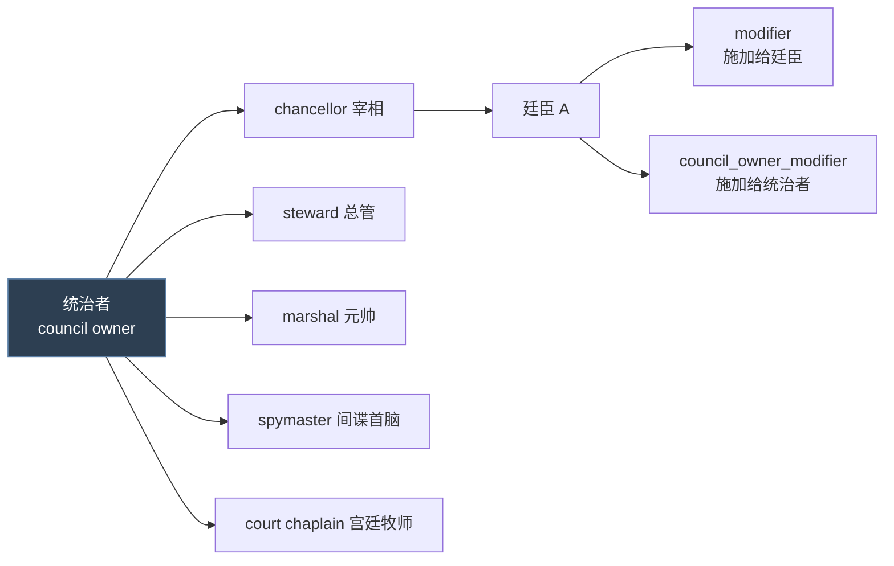

# 14 内阁职位

> **内阁职位**（`council_positions`）是廷臣职务定义，与 `council_tasks` 配套决定廷臣能做什么。

## 本篇导读

- **职位**：`council_positions/` 定义槽位、权限与本地化。
- **任务**：`council_tasks/` 定义廷臣执行的具体动作。
- **臣属契约与臣属立场已拆出** → [22 臣属契约与臣属立场](22-臣属契约与臣属立场.md)。

## 文档关联

- **配套**：[22 臣属契约与臣属立场](22-臣属契约与臣属立场.md)

---
## 1.1 概念

**内阁职位 = 统治者任命廷臣担任的职务槽位，提供 modifier 与职能。**



## 1.2 属性全表

### ① 基础

| 属性 | 说明 |
|---|---|
| `skill = diplomacy` | 排序角色列表时主要看哪项能力；不设则按总和 |
| `auto_fill = yes/no/{ triggers }` | 自动填充，玩家无法选择。Trigger 域 = council owner。**空 trigger 视为 no** |
| `fill_from_pool = yes/no` | 默认 no。仅当 `auto_fill` 为真/trigger 时有意义。从角色池填充，否则从宫廷与封臣 |
| `is_clergy_position = yes/no` | 默认 no。为真则该职位者被计为神职人员 |
| `inherit = yes/no/{ triggers }` | 主要继承人继承该职位（若合格）。Trigger 域 = council owner。空 trigger = no |
| `can_fire = yes/no/{ triggers }` | 能否解雇。**默认 yes**。空 trigger = **yes** |
| `can_reassign = yes/no/{ triggers }` | 能否调任。**默认 yes**。空 trigger = **yes** |
| `can_change_once = yes/no/{ triggers }` | 任命后终身不可调任/解雇。**默认 no**。空 trigger = no |
| `use_for_scheme_phase_duration = yes/no` | 是否用于阴谋阶段时长计算 |
| `use_for_scheme_resistance = yes/no` | 是否用于阴谋抵抗计算 |
| `portrait_animation = X` | 内阁窗口中该职位者的立绘动画 |

> **注意空 trigger 的两种处理**（info:8-14）：
> - `auto_fill` / `inherit` / `can_change_once`：空 trigger = **no**
> - `can_fire` / `can_reassign`：空 trigger = **yes**

### ② 文本

```paradox
name = loc_key
name = {                     # SCOPE = 角色的领主，事件目标 'councillor' = 该廷臣
	first_valid = { ... }    # 无角色领主时回退到 position 的 key 而非走触发本地化
}

tooltip = loc_key
tooltip = {                  # SCOPE = councillor，事件目标 'councillor_liege' = 统治者
	first_valid = { ... }
}
```

### ③ Modifier

```paradox
modifier = {                 # 施加给担任该职位的角色
	name = councillor_chancellor_modifier
	fellow_vassal_opinion = 5
	monthly_diplomacy_lifestyle_xp_gain_mult = 0.05
	scale = council_scaled_by_liege_tier     # 可缩放
}

council_owner_modifier = { } # 施加给该角色的领主
```

> 两者都可带 `scale`（script value），**最多可定义 5 个**不同 scale 的 modifier。

### ④ 校验

```paradox
valid_position  = { }   # 该职位是否可用。[SCOPE = 内阁所有者]
valid_character = { }   # 某角色是否合格。[SCOPE = 申请该职位的角色]
                        # 在"任命职位"列表显示时与任命时都会检查
```

### ⑤ 回调

| 钩子 | Root | 额外域 |
|---|---|---|
| `on_get_position` | 获得职位的角色 | `councillor_liege`（统治者）、`swapped_position`（**仅在职位互换时存在**） |
| `on_lose_position` | 失去职位的角色 | `councillor_liege` |
| `on_fired_from_position` | 被解雇的角色 | `councillor_liege`、`new_councillor`（可能为空） |

> **执行顺序**：解雇时先 `on_lose_position`，再 `on_fired_from_position`（info:54、63）。

```paradox
barbershop_data = {          # 理发店（角色创建器）内阁预设用
	position = { ... }
	click_to_front = yes/no
}
```

## 1.3 本地化函数

| 函数 | 返回 |
|---|---|
| `CHARACTER.GetCouncilTitle` | 角色的内阁职位名，无职位则空 |
| `CHARACTER.GetCouncilTitlePossessive` | 所有格形式 |
| `CHARACTER.GetCouncilTitleForPosition('key', council_owner)` | 若担任指定职位会叫什么 |
| `CHARACTER.GetMyCouncillorsTitle('key')` | 角色的某职位廷臣的称谓，无廷臣则用默认 |
| `COUNCIL_POSITION.GetName` | 职位默认名（本地化键） |
| `COUNCIL_POSITION.GetKey` | 未本地化的 key |
| `COUNCIL_POSITION.GetPortraitAnimation` | 立绘动画名，无则回退默认 |

## 1.4 真实示例解析：宰相

出处：`common/council_positions/00_council_positions.txt`

```paradox
councillor_chancellor = {
	skill = diplomacy

	# ── 条件化职位名（按政体 + 头衔层级）──
	name = {
		first_valid = {
			triggered_desc = {     # 霸权 + 有 Merit 的独立统治者
				trigger = {
					highest_held_title_tier >= tier_hegemony
					government_has_flag = government_has_merit
					is_independent_ruler = yes
				}
				desc = councillor_chancellor_celestial_government_imperial
			}
			triggered_desc = {     # 帝国/王国 + Merit
				trigger = {
					OR = {
						highest_held_title_tier = tier_empire
						highest_held_title_tier = tier_kingdom
					}
					government_has_flag = government_has_merit
					is_independent_ruler = yes
				}
				desc = councillor_chancellor_non_celestial_government_imperial
			}
			triggered_desc = {     # 天朝制下的总督
				trigger = {
					highest_held_title_tier < tier_hegemony
					government_has_flag = government_has_merit
					is_governor_or_admin_count = yes
				}
				desc = councillor_chancellor_celestial_government_non_imperial
			}
			triggered_desc = {
				trigger = { government_has_flag = government_is_japan_administrative }
				desc = councillor_chancellor_japan_administrative
			}
			triggered_desc = {
				trigger = { government_has_flag = government_is_japan_feudal }
				desc = councillor_chancellor_japan_feudal
			}
			triggered_desc = {     # 天朝制下的家族长
				trigger = {
					highest_held_title_tier < tier_kingdom
					government_has_flag = government_has_merit
					is_governor_or_admin_count = no
				}
				desc = councillor_chancellor_celestial_family_head
			}
			desc = councillor_chancellor      # 兜底
		}
	}

	# ── 何时该职位不可用 ──
	valid_position = {
		NOR = {
			government_has_flag = government_is_landless_adventurer
			government_has_flag = government_is_nomadic
		}
	}

	# ── 悬浮提示 ──
	tooltip = {
		first_valid = {
			triggered_desc = {
				trigger = {
					scope:councillor_liege = { tgp_has_access_to_ministry_trigger = yes }
				}
				desc = game_concept_minister_grand_chancellor_desc
			}
			desc = game_concept_chancellor_desc
		}
	}

	auto_fill = { }        # 空 trigger → 视为 no

	modifier = {
		name = councillor_chancellor_modifier
		fellow_vassal_opinion = 5
		monthly_diplomacy_lifestyle_xp_gain_mult = 0.05
		scale = council_scaled_by_liege_tier
	}
}
```

**设计要点**：

1. **同一个职位在不同政体下有不同称谓** —— 7 级 `first_valid` 链，最后是通用兜底
2. `valid_position` 用 `NOR` 排除无地冒险者与游牧政体
3. `tooltip` 里用 `scope:councillor_liege` 访问统治者（tooltip 的 root 是廷臣）
4. `auto_fill = { }` 空块 = no（**易错点**）
5. `scale = council_scaled_by_liege_tier` —— 职位加成按领主头衔层级缩放

## 1.5 相关：内阁任务 `council_tasks`

`common/council_tasks/`（9 文件 + 7.3 KB info）定义廷臣执行的具体任务（如"提升发展度"、"伪造宣称"），与 `council_positions` 配套使用。

---

