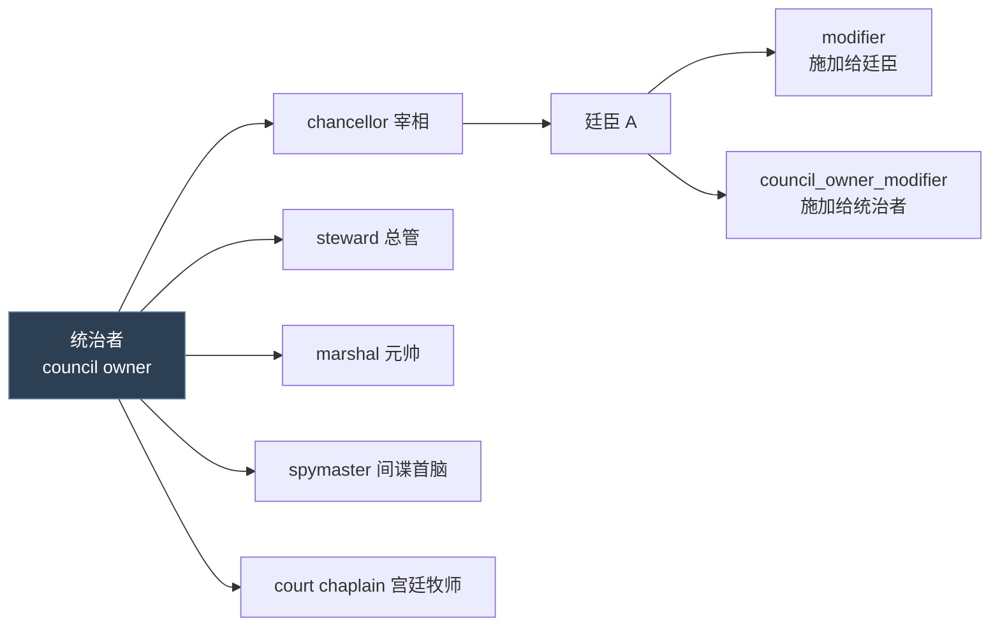
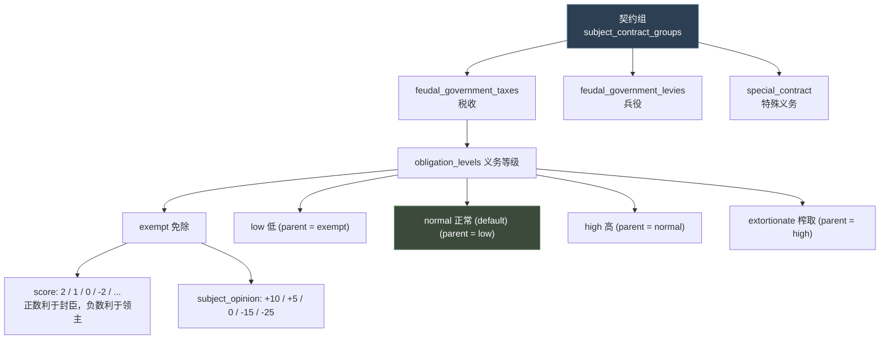
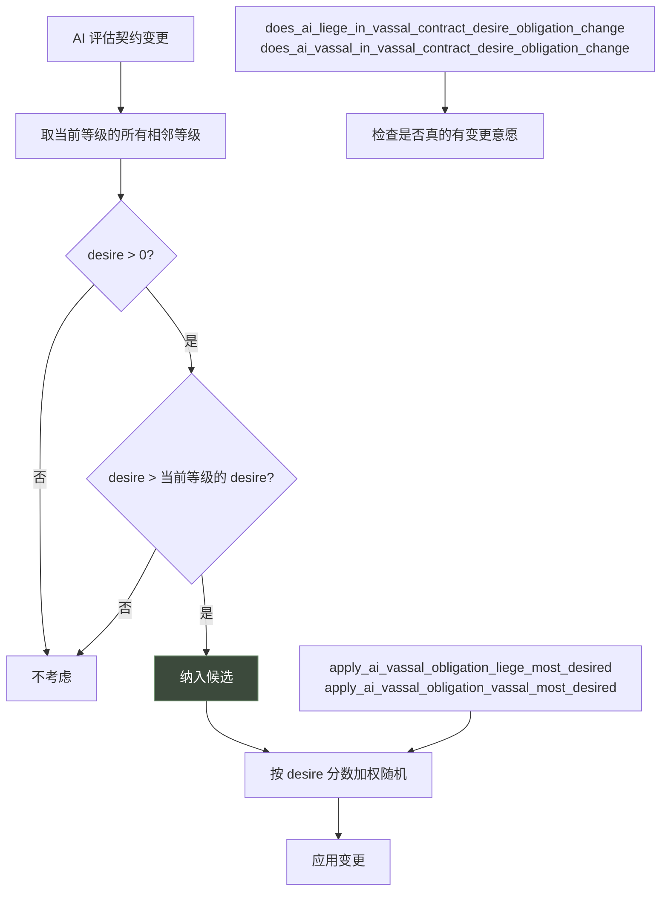
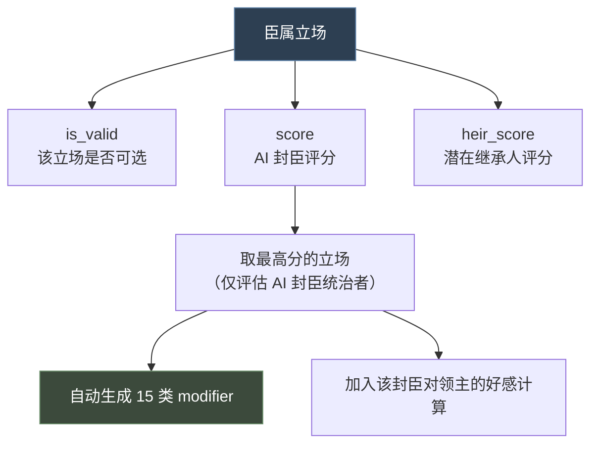
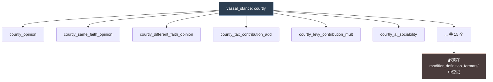

# 14 内阁职位、臣属契约与臣属立场

> 三个围绕"**上下级关系**"的配置型系统：**内阁职位**是廷臣职务，**臣属契约**是封臣义务，**臣属立场**是 AI 封臣的态度。

## 本篇导读

| 维度 | 内阁职位 `council_positions/` | 臣属契约 `subject_contracts/` | 臣属立场 `vassal_stances/` |
|---|---|---|---|
| 关系 | 统治者 → 廷臣 | 领主 → 封臣 | AI 封臣 → 领主 |
| 主要产出 | modifier（双向） | 税 / 兵 / 畜群 / 实物 | **自动生成 15 个 modifier** |
| 谁决定 | 统治者任命 | 政体的 `vassal_contract` | AI 评分自动选 |
| 玩家可见 | 是（内阁窗口） | 是（谈判契约） | 间接（通过好感与贡献） |

### 三个系统的共同陷阱

1. **内阁职位**：空 trigger 的两种相反处理 —— `auto_fill` / `inherit` / `can_change_once` 视为 **no**，而 `can_fire` / `can_reassign` 视为 **yes**。
2. **臣属契约**：`is_shown` 为假的等级**同时无效**（不只是隐藏）。
3. **臣属立场**：新增立场后**必须**在 `common/modifier_definition_formats/` 登记，否则 15 个自动生成的 modifier 全不生效。

### 臣属立场自动生成的 15 个 Modifier

```
<key>_opinion                      <key>_ai_honor
<key>_same_faith_opinion           <key>_ai_greed
<key>_different_faith_opinion      <key>_ai_rationality
<key>_same_culture_opinion         <key>_ai_energy
<key>_different_culture_opinion    <key>_ai_boldness
<key>_tax_contribution_add         <key>_ai_zeal
<key>_tax_contribution_mult        <key>_ai_vengefulness
<key>_levy_contribution_add        <key>_ai_compassion
<key>_levy_contribution_mult       <key>_ai_sociability
```

## 文档关联

- **前置**：[03 触发器与效果](03-触发器与效果.md)、[04 修饰符与数值计算](04-修饰符与数值计算.md)
- **上游**：[13 政体、特质与共治](13-政体、特质与共治.md)（政体的 `vassal_contract` 决定用哪套契约；`council` 开关决定能否用内阁）
- **交叉**：[10 法律与继承](10-法律与继承.md)（契约的 `appointment_trait_flag` 影响任命继承资格）
- **选型**：[16 多系统选型指南与开发实践](16-多系统选型指南与开发实践.md)

## 目录

| 章 | 章节 |
|---|---|
| 第一章 内阁职位 | 概念 · 属性全表（7 类开关及默认值）· 本地化函数 · 宰相实例 · 内阁任务 |
| 第二章 臣属契约 | 概念 · 契约定义 · 义务等级 30+ 属性 · AI 决策逻辑 · 契约组 · 额外作用域 · 封建税实例 |
| 第三章 臣属立场 | 概念 · 完整语法 · 自动生成的 Modifier · 评估时机 · 宫廷派实例 |

---

# 第一章 内阁职位（Council Position）

## 1.1 概念

**内阁职位 = 统治者任命廷臣担任的职务槽位，提供 modifier 与职能。**



## 1.2 属性全表

### ① 基础

| 属性 | 说明 |
|---|---|
| `skill = diplomacy` | 排序角色列表时主要看哪项能力；不设则按总和 |
| `auto_fill = yes/no/{ triggers }` | 自动填充，玩家无法选择。Trigger 域 = council owner。**空 trigger 视为 no** |
| `fill_from_pool = yes/no` | 默认 no。仅当 `auto_fill` 为真/trigger 时有意义。从角色池填充，否则从宫廷与封臣 |
| `is_clergy_position = yes/no` | 默认 no。为真则该职位者被计为神职人员 |
| `inherit = yes/no/{ triggers }` | 主要继承人继承该职位（若合格）。Trigger 域 = council owner。空 trigger = no |
| `can_fire = yes/no/{ triggers }` | 能否解雇。**默认 yes**。空 trigger = **yes** |
| `can_reassign = yes/no/{ triggers }` | 能否调任。**默认 yes**。空 trigger = **yes** |
| `can_change_once = yes/no/{ triggers }` | 任命后终身不可调任/解雇。**默认 no**。空 trigger = no |
| `use_for_scheme_phase_duration = yes/no` | 是否用于阴谋阶段时长计算 |
| `use_for_scheme_resistance = yes/no` | 是否用于阴谋抵抗计算 |
| `portrait_animation = X` | 内阁窗口中该职位者的立绘动画 |

> **注意空 trigger 的两种处理**（info:8-14）：
> - `auto_fill` / `inherit` / `can_change_once`：空 trigger = **no**
> - `can_fire` / `can_reassign`：空 trigger = **yes**

### ② 文本

```paradox
name = loc_key
name = {                     # SCOPE = 角色的领主，事件目标 'councillor' = 该廷臣
	first_valid = { ... }    # 无角色领主时回退到 position 的 key 而非走触发本地化
}

tooltip = loc_key
tooltip = {                  # SCOPE = councillor，事件目标 'councillor_liege' = 统治者
	first_valid = { ... }
}
```

### ③ Modifier

```paradox
modifier = {                 # 施加给担任该职位的角色
	name = councillor_chancellor_modifier
	fellow_vassal_opinion = 5
	monthly_diplomacy_lifestyle_xp_gain_mult = 0.05
	scale = council_scaled_by_liege_tier     # 可缩放
}

council_owner_modifier = { } # 施加给该角色的领主
```

> 两者都可带 `scale`（script value），**最多可定义 5 个**不同 scale 的 modifier。

### ④ 校验

```paradox
valid_position  = { }   # 该职位是否可用。[SCOPE = 内阁所有者]
valid_character = { }   # 某角色是否合格。[SCOPE = 申请该职位的角色]
                        # 在"任命职位"列表显示时与任命时都会检查
```

### ⑤ 回调

| 钩子 | Root | 额外域 |
|---|---|---|
| `on_get_position` | 获得职位的角色 | `councillor_liege`（统治者）、`swapped_position`（**仅在职位互换时存在**） |
| `on_lose_position` | 失去职位的角色 | `councillor_liege` |
| `on_fired_from_position` | 被解雇的角色 | `councillor_liege`、`new_councillor`（可能为空） |

> **执行顺序**：解雇时先 `on_lose_position`，再 `on_fired_from_position`（info:54、63）。

```paradox
barbershop_data = {          # 理发店（角色创建器）内阁预设用
	position = { ... }
	click_to_front = yes/no
}
```

## 1.3 本地化函数

| 函数 | 返回 |
|---|---|
| `CHARACTER.GetCouncilTitle` | 角色的内阁职位名，无职位则空 |
| `CHARACTER.GetCouncilTitlePossessive` | 所有格形式 |
| `CHARACTER.GetCouncilTitleForPosition('key', council_owner)` | 若担任指定职位会叫什么 |
| `CHARACTER.GetMyCouncillorsTitle('key')` | 角色的某职位廷臣的称谓，无廷臣则用默认 |
| `COUNCIL_POSITION.GetName` | 职位默认名（本地化键） |
| `COUNCIL_POSITION.GetKey` | 未本地化的 key |
| `COUNCIL_POSITION.GetPortraitAnimation` | 立绘动画名，无则回退默认 |

## 1.4 真实示例解析：宰相

出处：`common/council_positions/00_council_positions.txt`

```paradox
councillor_chancellor = {
	skill = diplomacy

	# ── 条件化职位名（按政体 + 头衔层级）──
	name = {
		first_valid = {
			triggered_desc = {     # 霸权 + 有 Merit 的独立统治者
				trigger = {
					highest_held_title_tier >= tier_hegemony
					government_has_flag = government_has_merit
					is_independent_ruler = yes
				}
				desc = councillor_chancellor_celestial_government_imperial
			}
			triggered_desc = {     # 帝国/王国 + Merit
				trigger = {
					OR = {
						highest_held_title_tier = tier_empire
						highest_held_title_tier = tier_kingdom
					}
					government_has_flag = government_has_merit
					is_independent_ruler = yes
				}
				desc = councillor_chancellor_non_celestial_government_imperial
			}
			triggered_desc = {     # 天朝制下的总督
				trigger = {
					highest_held_title_tier < tier_hegemony
					government_has_flag = government_has_merit
					is_governor_or_admin_count = yes
				}
				desc = councillor_chancellor_celestial_government_non_imperial
			}
			triggered_desc = {
				trigger = { government_has_flag = government_is_japan_administrative }
				desc = councillor_chancellor_japan_administrative
			}
			triggered_desc = {
				trigger = { government_has_flag = government_is_japan_feudal }
				desc = councillor_chancellor_japan_feudal
			}
			triggered_desc = {     # 天朝制下的家族长
				trigger = {
					highest_held_title_tier < tier_kingdom
					government_has_flag = government_has_merit
					is_governor_or_admin_count = no
				}
				desc = councillor_chancellor_celestial_family_head
			}
			desc = councillor_chancellor      # 兜底
		}
	}

	# ── 何时该职位不可用 ──
	valid_position = {
		NOR = {
			government_has_flag = government_is_landless_adventurer
			government_has_flag = government_is_nomadic
		}
	}

	# ── 悬浮提示 ──
	tooltip = {
		first_valid = {
			triggered_desc = {
				trigger = {
					scope:councillor_liege = { tgp_has_access_to_ministry_trigger = yes }
				}
				desc = game_concept_minister_grand_chancellor_desc
			}
			desc = game_concept_chancellor_desc
		}
	}

	auto_fill = { }        # 空 trigger → 视为 no

	modifier = {
		name = councillor_chancellor_modifier
		fellow_vassal_opinion = 5
		monthly_diplomacy_lifestyle_xp_gain_mult = 0.05
		scale = council_scaled_by_liege_tier
	}
}
```

**设计要点**：

1. **同一个职位在不同政体下有不同称谓** —— 7 级 `first_valid` 链，最后是通用兜底
2. `valid_position` 用 `NOR` 排除无地冒险者与游牧政体
3. `tooltip` 里用 `scope:councillor_liege` 访问统治者（tooltip 的 root 是廷臣）
4. `auto_fill = { }` 空块 = no（**易错点**）
5. `scale = council_scaled_by_liege_tier` —— 职位加成按领主头衔层级缩放

## 1.5 相关：内阁任务 `council_tasks`

`common/council_tasks/`（9 文件 + 7.3 KB info）定义廷臣执行的具体任务（如"提升发展度"、"伪造宣称"），与 `council_positions` 配套使用。

---

# 第二章 臣属契约（Subject Contract）

## 2.1 概念

**臣属契约 = 封臣对领主的义务量（税、兵、畜群、实物），可在"谈判契约"界面调整。**



> **决定关系**：封臣的**政体**决定使用哪套契约（`government.vassal_contract`）。

## 2.2 契约定义

```paradox
subject_contract = {
	uses_opinion_of_liege = yes/no   # 启用后可在 script math 里用 scope:opinion_of_liege
	                                 # 玩家契约每日更新，AI 用 NSubjectContract::OPINION_OF_LIEGE_UPDATE_INTERVAL
	                                 # 默认 no（性能考虑）

	is_shown = { }                   # 该义务是否显示

	display_mode = tree / radiobutton / checkbox / hidden   # UI 呈现，默认 radiobutton

	defaults_to_highest_valid_level = yes/no    # 是否默认取（评分）最高的等级，默认 no

	can_be_changed = { }             # 能否修改；不满足则可见但不可点，tooltip 里显示阻碍原因
	                                 # 可用域: liege / subject / vassal / tax_slot / tax_collector / opinion_of_liege

	obligation_levels = { ... }
}

joins_suzerain_wars = yes/no        # 朝贡国是否自动加入宗主战争，默认 no
```

## 2.3 义务等级 `obligation_levels`

**可用域**：

| 域 | 含义 |
|---|---|
| `scope:liege` | 契约中的领主或宗主 |
| `scope:subject` | 契约中的臣属 |
| `scope:vassal` | 同 `scope:subject`（向后兼容保留） |
| `scope:opinion_of_liege` | 需 `uses_opinion_of_liege = yes` |
| `scope:tax_slot` | 所在的/考虑放入的税槽 |
| `scope:tax_collector` | 上述税槽的收税人 |

**属性全表**：

```paradox
subject_obligation_low = {
	# ── 义务量（均可用 script math）──
	levies = 0.5              # 兵役比例 0..1，默认 0
	tax = 0.2                 # 金币收入比例 0..1，默认 0
	herd = 0.2                # 畜群收入比例 0..1，默认 0
	barter_goods = 0.2        # 实物收入比例 0..1，默认 0

	min_levies = 0.1          # 兵役下限
	min_tax = 0.0             # 税下限
	min_herd = 0.0            # 畜群下限
	min_barter_goods = 0.0    # 实物下限

	# ── 界面文本 ──
	contribution_desc  = { ... }                # 贡献明细的动态描述
	tax_contribution_postfix = "..."            # 税明细后缀
	levies_contribution_postfix = "..."         # 兵役明细后缀
	herd_contribution_postfix = "..."           # 畜群明细后缀
	unclamped_contribution_label = "..."        # 未钳制值的明细标签
	min_contribution_label = "..."              # 钳制下限的明细标签

	# ── 好感 ──
	subject_opinion = 0       # 加到封臣对领主的好感上

	# ── 标记与标签 ──
	flag = token              # 任意 flag，脚本可检查当前契约是否含某 flag
	gui_tags = { tag_1 tag_2 }   # GUI 标签，用于设置大小/颜色等

	# ── 评分 ──
	score = int               # 正数利于封臣，0 中性，负数利于领主
	                          # 修改时比较新旧 score 判断倾向与幅度
	                          # 默认按定义顺序

	ai_liege_desire = <script value>     # 领主多想要此选项
	ai_subject_desire = <script value>   # 封臣多想要此选项

	# ── Modifier ──
	liege_modifier   = { }    # 施加给领主
	subject_modifier = { }    # 施加给封臣

	# ── 有效性 ──
	is_shown = { }            # 是否可见（不可见的等级同样无效）
	is_valid = { }            # 是否对该封臣有效

	# ── 兵士开关 ──
	enable_title_maa     = yes/no   # 能否基于头衔禁用兵士（需政体有 administrative 规则）
	enable_character_maa = yes/no   # 能否禁用角色兵士
	                                # 在多个义务中定义时，取契约组里第一个

	# ── 乘算因子（小心叠加）──
	tax_factor    = <script value>
	levies_factor = <script value>
	herd_factor   = <script value>

	# ── 任命继承 ──
	appointment_trait_flag = some_trait_flag
	# 继承人与候选人必须带有此 flag 的特质才有资格
	# 带 appointment flag 的契约义务在载入游戏时视为有效，避免初始化顺序问题

	# ── 树形布局 ──
	default = yes             # 标记为默认（否则第一个为默认）
	parent = subject_obligation_low   # 可从此等级升级而来 / 可退回此等级
	position = { x y }        # 图标位置，乘以 NSubjectContract::OBLIGATION_OFFSET
	icon = "path/to/image.dds"
}
```

## 2.4 AI 决策逻辑

官方原文（`_subject_contracts.info:106-112`）：

```
The liege and subject desire are used as follows:
When finding the most desired level to change we check if any adjacent obligation level
to the currently active ones are desired by them more. Desires less than or equal to zero
are not considered and if the score is less then or equal to the desire of the current level
it is also not considered.
```



**配套语法**：

| 类型 | 语法 |
|---|---|
| Trigger | `does_ai_liege_in_vassal_contract_desire_obligation_change` |
| Trigger | `does_ai_vassal_in_vassal_contract_desire_obligation_change` |
| Effect | `apply_ai_vassal_obligation_liege_most_desired` |
| Effect | `apply_ai_vassal_obligation_vassal_most_desired` |

## 2.5 契约组 `subject_contract_groups`

```paradox
feudal_contract_group = {
	admin_province_contract = administrative_themes   # 该组的"行政省份"契约，界面用

	contracts = {                      # 组内的契约
		feudal_government_taxes
		feudal_government_levies
		special_contract
	}

	modify_contract_layout = clan      # GUI 用 SubjectContract.HasModifyContractLayout 查询

	# ── 以下仅对朝贡契约有效 ──
	is_tributary = no

	is_valid_tributary_contract = { }  # ROOT = 臣属, scope:suzerain = 宗主
	tributary_can_break_free = { }     # 臣属能否自行脱离

	suzerain_line_type = line_suzerain       # 地图上画宗主线的线型
	tributary_line_type = line_tributary     # 地图上画朝贡线的线型

	should_show_as_suzerain_realm_name  = yes/no   # 地图名是否用宗主的
	should_show_as_suzerain_realm_color = yes/no   # 地图色是否用宗主的（按比例插值）

	tributary_heir_succession = yes/no   # 朝贡者继承人是否继任朝贡，默认 yes
	suzerain_heir_succession  = yes/no   # 宗主继承人是否继任宗主，默认 yes
}
```

## 2.6 修改契约时的额外作用域

```
scope:changed_obligations   # 窗口中所有已变更的契约义务列表
scope:new_value             # 变更对封臣有利程度的数值（基于 score 增量）
```

## 2.7 需要本地化的键

```
<contract_level>              # 契约等级名
<obligation_level>            # 义务等级名
<obligation_level>_short      # 短名
<obligation_level>_desc       # 描述
```

## 2.8 真实示例解析：封建税

出处：`common/subject_contracts/contracts/feudal.txt`

```paradox
feudal_government_taxes = {
	display_mode = tree          # 树形显示，等级间可逐级升降
	icon = gold_icon

	obligation_levels = {
		feudal_tax_exempt = {
			position = { 0 0 }
			tax = exempt_feudal_tax        # 引用 script value
			subject_opinion = 10           # 免税 → 封臣好感 +10
			ai_liege_desire = 1
			ai_subject_desire = 5
			score = 2                      # 最利于封臣
		}

		feudal_tax_low = {
			parent = feudal_tax_exempt     # 树形结构的父节点
			position = { 1 0 }
			tax = low_feudal_tax
			subject_opinion = 5
			ai_liege_desire = {
				value = 2
				if = {
					limit = {
						scope:liege = {
							ai_should_focus_on_building_in_their_capital = yes
						}
						scope:subject = {
							AND = {
								government_has_flag = government_is_feudal
								vassal_contract_obligation_level:feudal_government_taxes <= feudal_tax_exempt_level
							}
						}
					}
					add = 8                 # 领主想建首都 + 封臣当前是免税 → 强烈想加税
				}
			}
			ai_subject_desire = 4
			score = 1
		}

		feudal_tax_normal = {
			default = yes                  # 默认等级
			parent = feudal_tax_low
			position = { 2 0 }
			tax = normal_feudal_tax
			ai_liege_desire = { value = 3  if = { ... add = 7 } }
			ai_subject_desire = 3
			score = 0                      # 中性基准
		}

		feudal_tax_high = {
			parent = feudal_tax_normal
			position = { 3 0 }
			tax = high_feudal_tax
			subject_opinion = -15
			ai_liege_desire = { value = 5  if = { ... add = 6 } }
			ai_subject_desire = 2
			score = -2
			flag = obligation_high_taxes   # 供脚本检查
		}

		feudal_tax_extortionate = {
			parent = feudal_tax_high
			position = { 4 0 }
			tax = extortionate_feudal_tax
			subject_opinion = -25
			...
		}
	}
}
```

**设计要点**：

1. **`parent` 链构成树形结构** —— exempt → low → normal → high → extortionate，只能逐级调整
2. **`score` 的符号语义**：正 = 利于封臣，负 = 利于领主，0 = 中性基准
3. **`subject_opinion` 与 score 配套**：+10 / +5 / 0 / -15 / -25
4. **`ai_liege_desire` 用 script value 做条件增益** —— 领主"想建首都"且封臣当前免税时，加税欲望 +8
5. **`vassal_contract_obligation_level:<key>` 语法** —— 读取当前契约等级，可与 `<level>_level` 常量比较
6. `flag = obligation_high_taxes` 让其他脚本能检查"这个封臣是否被重税"

---

# 第三章 臣属立场（Vassal Stance）

## 3.1 概念

**臣属立场 = AI 封臣对领主采取的态度姿态，自动影响税/兵贡献与 AI 性格。**

这是本文**最小的**系统 —— `_vassal_stances.info` 只有 1.09 KB。



## 3.2 完整语法

官方 `_vassal_stances.info` 全文：

```paradox
key = {
	# root = ai character evaluating stance
	# scope:liege = their liege
	is_valid = {
		<trigger>
	}

	# root = ai character evaluating stance
	# scope:liege = their liege
	score = {
		<script value>
	}

	# root = potential heir
	# scope:liege = their liege
	heir_score = {
		<script value>
	}
}
```

| 属性 | Root | 额外域 | 用途 |
|---|---|---|---|
| `is_valid` | 评估立场的 AI 角色 | `scope:liege` | 该立场是否可选 |
| `score` | 评估立场的 AI 角色 | `scope:liege` | AI 评分，**取最高分** |
| `heir_score` | 潜在继承人 | `scope:liege` | 继承人评分 |

## 3.3 自动生成的 Modifier

**每个立场会自动生成 15 个 modifier**，官方原文（info:21-41）：

```
key_opinion                        key_ai_honor
key_same_faith_opinion             key_ai_greed
key_different_faith_opinion        key_ai_rationality
key_same_culture_opinion           key_ai_energy
key_different_culture_opinion      key_ai_boldness
key_tax_contribution_add           key_ai_zeal
key_tax_contribution_mult          key_ai_vengefulness
key_levy_contribution_add          key_ai_compassion
key_levy_contribution_mult         key_ai_sociability
```

> **官方要求**（info:21）："Each defined stance will generate multiple modifiers, so make sure to add it to the modifier definition formats too."
> —— 定义新立场后**必须**在 `common/modifier_definition_formats/` 里登记这些 modifier，否则不生效。



## 3.4 评估时机

官方原文（info:43-46）：

```
Vassal stances are evaluated in the RARE_TASK_TICK AI update only for vassal rulers.
The top scoring one of all valid options is chosen for the AI to use.

The active vassal stance will add its opinion values for that vassal towards their ruler
when calculating opinion.
```

**三条要点**：

1. **时机**：只在 `RARE_TASK_TICK` AI 更新时评估
2. **对象**：**仅**对身为统治者的封臣（vassal rulers）
3. **效果**：活跃立场的好感值会加进"该封臣对统治者"的好感计算

## 3.5 真实示例解析：宫廷派

出处：`common/vassal_stances/00_vassal_stances.txt`

```paradox
courtly = {
	score = {
		value = ai_sociability                    # 基数 = AI 社交性
		add = {                                   # + 社交性/2
			value = ai_sociability
			divide = 2
		}
		add = {                                   # - 贪婪
			value = ai_greed
			multiply = -1
		}
		add = {                                   # + 同情/2
			value = ai_compassion
			divide = 2
		}

		if = { limit = { has_trait = gregarious }   add = 50 }
		if = { limit = { has_trait = fickle }       add = 50 }
		if = { limit = { has_trait = honest }       add = 50 }
		if = {
			limit = { culture = { has_cultural_pillar = ethos_courtly } }
			add = 50
		}
		if = {
			limit = {
				scope:liege = { has_royal_court = yes  has_court_type = court_diplomatic }
			}
			add = 30                              # 领主是外交型宫廷 → 加分
		}
		if = {
			limit = {
				scope:liege = { has_royal_court = yes  has_court_type = court_intrigue }
			}
			add = 15                              # 阴谋型宫廷 → 加较少
		}
		if = {
			limit = {
				top_participant_group:dynastic_cycle ?= {
					participant_group_type = pro_hegemon_movement
				}
			}
			add = 250                             # 局势参与组 → 巨幅加分
		}
	}
}
```

**设计要点**：

1. **基数来自 AI 性格属性**（`ai_sociability`、`ai_greed`、`ai_compassion`）—— 立场是性格的延伸
2. **script value 的运算符链**：`value` → `add`（divide）→ `add`（multiply -1）→ `add`（divide）
3. **特质加分**：gregarious / fickle / honest 各 +50
4. **文化支柱加分**：`ethos_courtly` +50
5. **领主宫廷类型影响**：外交型 +30 > 阴谋型 +15
6. **`?=` 弱比较**：`top_participant_group:dynastic_cycle ?=` —— 该局势参与组可能不存在
7. **局势参与组给 +250** —— 压倒性加分，体现"站队"的优先级

