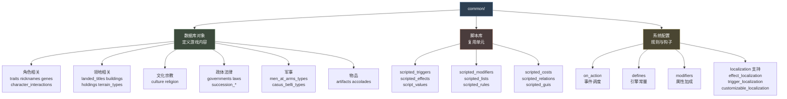
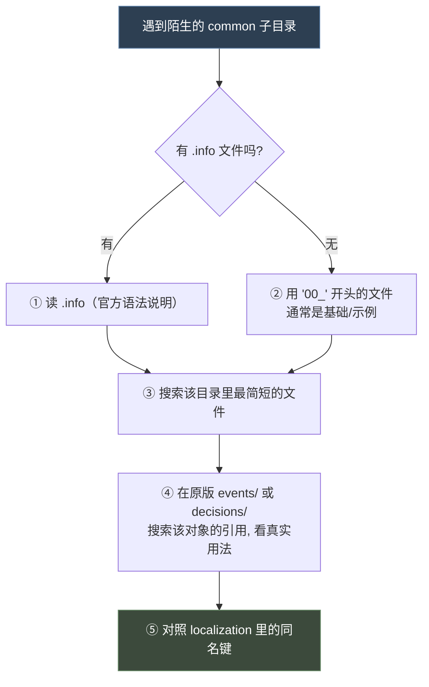

# 15 common 目录清单

> 参考手册（第一部）：`common/` 下 100+ 个子目录各自是什么、怎么写、`.info` 在哪。

## 本篇导读

- 按 **脚本库 / 事件调度 / 角色 / 领地 / 文化宗教 / 政体法律 / 军事 / 派系计谋 / 物品 / 活动 / 故事情境 / 数值提示 / 本地化支持 / 事件表现 / UI** 分类速查。
- **陌生目录四步上手法**：先读 `.info` → 找原版实例 → 抄骨架 → 改名。
- **速查表与排错已拆出** → [23 速查手册](23-速查手册.md)、[24 排错与调试](24-排错与调试.md)。

## 文档关联

- **配套**：[23 速查手册](23-速查手册.md)、[24 排错与调试](24-排错与调试.md)

---
## 1. 总览分类图



---

## 2. 脚本库目录（Mod 最常用）

### 🔵 `common/scripted_triggers/`（135 文件）

```paradox
my_trigger = {
	<triggers>
}
my_trigger_with_param = {
	$PARAM$ = { ... }
}
```

调用：`my_trigger = yes` 或 `my_trigger = { PARAM = value }`

### 🔵 `common/scripted_effects/`（166 文件）

```paradox
my_effect = {
	<effects>
}
```

调用：`my_effect = yes` 或 `my_effect = { PARAM = value }`

### 🔵 `common/script_values/`（113 文件 + `_script_values.info`）

```paradox
static_value = 10
formula_value = { value = 10  add = 5  round = yes }
```

### 🔵 `common/scripted_modifiers/`（43 文件 + info）

```paradox
my_modifier = {
	modifier = { ... }
	opinion_modifier = { target = X  who = Y  multiplier = Z }
	compare_modifier = { target = X  value = V  multiplier = M }
}
```

### `common/scripted_lists/`（1 文件）

```paradox
my_list = {
	base = <已有列表>
	conditions = { <triggers> }
}
```

### `common/scripted_rules/`（1 文件，39 KB）

```paradox
my_rule = {
	custom_description = {
		text = <loc_key>
		<trigger>
	}
	<triggers>
}
```

### 其他脚本库

| 目录 | 用途 |
|---|---|
| 🔵 `scripted_relations/` | 关系判定脚本化 |
| 🔵 `scripted_animations/` | 立绘动画序列 |
| `scripted_costs/` | 成本计算 |
| `scripted_guis/` | 界面定义 |
| `scripted_character_templates/`（42 文件） | 角色生成模板，`create_character = { template = X }` |

---

## 3. 事件与调度

### 🔵 `common/on_action/`（165 文件 + `_on_actions.info`）

见 [06-事件系统与on_action](06-事件系统与on_action.md)。

```paradox
my_on_action = {
	trigger = { }
	weight_multiplier = { base = 1  modifier = { add = 1  <trig> } }
	events = { ns.0001  delay = { days = 365 }  ns.0002 }
	random_events = { chance_to_happen = 25  100 = ns.0001  100 = 0 }
	first_valid = { ns.0001  ns.0002 }
	on_actions = { other_on_action }
	effect = { }
	fallback = another_on_action
}
```

### `common/decisions/`（69 文件 + 🔵 `_decisions.info`）

```paradox
my_decision = {
	picture = "gfx/interface/illustrations/decisions/xxx"
	is_shown = { <triggers> }
	can_pick = { <triggers> }
	cost = { gold = 50 }
	effect = { <effects> }
}
```

### `common/important_actions/`（33 文件 + 🔵 info）

重要行动（角色可做的重要事项提示）。

---

## 4. 角色系统

| 目录 | 内容 | info |
|---|---|---|
| `traits/` | 特质定义 | 🔵 `_traits.info` |
| `nicknames/` | 绰号 | 🔵 `_nicknames.info` |
| `genes/` | 基因（外貌遗传） | 🔵 `_genes.info` |
| 🔵 `character_interactions/`（57 文件） | 角色交互（外交动作） | 🔵 26 KB 说明 |
| `character_interaction_categories/` | 交互分类 | — |
| `character_backgrounds/` | 角色背景 | — |
| `character_memory_types/` | 角色记忆类型 | 🔵 info |
| `dna_data/` | DNA 数据 | 🔵 info |
| `ethnicities/` | 族裔 | — |
| `pool_character_selectors/` | 角色池选择器 | 🔵 info |
| `portrait_types/` | 立绘类型 | — |
| `deathreasons/` | 死因 | 🔵 info |
| `focuses/` | 童年/教育重心 | 🔵 info |
| `lifestyles/`（含 perks） | 生活方式 | 🔵 info |
| `lifestyle_perks/` | 生活方式特长 | 🔵 info |
| `house_relation_types/` | 家族关系 | 🔵 info |
| 🔵 `puppets/`（2 文件） | **1.20 新增**：傀儡类型（`types/`）与傀儡动作（`actions/`）；`set_puppet` / `scope:puppet_or_actor`，见 [19 篇](19-宗教与灵性满足与压力.md) | 🔵 `_puppet_types.info`、`_puppet_actions.info` |

### traits 结构（基于 `00_traits.txt` 中大量 `first_valid`）

```paradox
my_trait = {
	# 特质属性
	# 常配合 first_valid = { ... } 做条件化图标/描述
}
```

---

## 5. 领地与建筑

| 目录 | 内容 | info |
|---|---|---|
| 🔵 `landed_titles/`（10 文件 + `_landed_titles.info`） | 头衔层级树 | 🔵 7.88 KB |
| 🔵 `buildings/`（21 文件） | 建筑 | 🔵 14.91 KB |
| 🔵 `holdings/` | 地产类型 | 🔵 info |
| 🔵 `terrain_types/` | 地形 | 🔵 info |
| 🔵 `province_terrain/` | 省份地形 | — |
| 🔵 `great_projects/` | 伟大工程 | — |
| 🔵 `domiciles/`（7 文件） | 宅邸 | 🔵 info |
| 🔵 `tax_slots/` | 税槽 | — |

### landed_titles 结构（实证）

```paradox
# 出处: common/landed_titles/00_landed_titles.txt
@correct_culture_primary_score = 100          # 文件级常量

h_roman_empire = {
	color = { 167 10 0 }
	capital = c_roma
	definite_form = yes
	can_be_named_after_dynasty = no
	can_create = {
		rule_title_creation_imperial_power_projection_title_creation_trigger = yes
	}
}
```

常用键：`color` `capital` `definite_form` `no_automatic_claims` `always_follows_primary_heir`
`destroy_if_invalid_heir` `can_use_nomadic_naming` `can_create` `can_destroy`

---

## 6. 文化与宗教

| 目录 | 内容 | info |
|---|---|---|
| 🔵 `culture/`（141 文件） | 文化、文化传统、文化支柱、革新、时代 | 🔵 `_cultural_traits.info` |
| 🔵 `religion/`（**68 文件**，1.19 为 59） | 宗教、信仰、**仪轨**、教义、**信条**、圣所、圣职 | 🔵 各子目录均有 `_*.info`，另 `great_holy_wars.info` |

### `religion/` 的 1.20 分层（重构要点见 [19 篇 §1](19-宗教与灵性满足与压力.md)）

| 子目录 | 1.20 文件数 | 说明 |
|---|---|---|
| `religion_types/` | 49 | 宗教组 |
| `faith_types/` | 1 | 信仰（`00_faith_types.txt`，+4867 行） |
| **`rite_types/`** | 3 | **1.20 新增**：仪轨（Rite），教义的承载体 |
| **`tenet_types/`** | 2 | **1.20 新增**：信条本体；旧的 `doctrine_types/30_core_tenets.txt` **已整份删除** |
| `doctrine_types/` | 6 | 教义 |
| **`doctrine_category_types/`** | 1 | **1.20 新增** |
| **`doctrine_group_types/`** | 1 | **1.20 新增** |
| `holy_site_types/` | 2 | 圣所；新增 `01_dynamic_holy_site_types.txt`（动态圣所） |
| **`rite_icons/`**、**`rite_names/`** | 各 1 | **1.20 新增** |
| `religion_family_types/` | 1 | 宗教族 |

> ⚠ **教义读取已从 faith 迁至 rite**：`faith = { has_doctrine = X }` 在 1.20 已归零（1.19 有 91 处），请改用 `rite = { rite_has_doctrine = X }` 或 `faith = { main_rite = { rite_has_doctrine = X } }`。

---

## 7. 政体与法律

| 目录 | 内容 | info |
|---|---|---|
| 🔵 `governments/` | 政体 | 🔵 25.84 KB（最大） |
| 🔵 `laws/` | 法律**本体**（1.20 起为扁平顶层条目，**必须**带 `law_group_type` + `index`） | 🔵 11.88 KB |
| 🔵 `law_groups/`（6 文件） | **1.20 新增**：法律**组**定义（`required_government_flag` / `is_treasury_budget_group` / `can_have_group` 等） | 🔵 `_law_groups.info` |
| 🔵 `succession_election/` | 选举继承制 | 🔵 info |
| 🔵 `succession_appointment/`（8 文件） | 任命继承制 | 🔵 info |
| 🔵 `council_positions/` | 议会职位 | 🔵 info |
| 🔵 `council_tasks/`（9 文件） | 议会任务 | 🔵 info |
| 🔵 `court_positions/`（45 文件） | 宫廷职位 | 🔵 18.57 KB |
| 🔵 `court_amenities/` | 宫廷设施 | 🔵 info |
| 🔵 `court_types/` | 宫廷类型 | 🔵 info |
| 🔵 `vassal_stances/` | 封臣立场 | 🔵 info |
| 🔵 `subject_contracts/`（16 文件） | 附庸契约 | 🔵 info |
| 🔵 `lease_contracts/` | 租约 | 🔵 info |
| 🔵 `confederation_types/` | 邦联类型 | 🔵 info |
| 🔵 `diarchies/` | 二头政治 | — |
| 🔵 `legitimacy/` | 正统性 | 🔵 info |

---

## 8. 军事

| 目录 | 内容 | info |
|---|---|---|
| 🔵 `men_at_arms_types/`（10 文件） | 兵士类型 | 🔵 3.63 KB |
| 🔵 `casus_belli_types/`（26 文件） | 宣战理由（战争规则主体） | [12](12-活动.md) §2 |
| `casus_belli_groups/` | 宣战理由分组（组级额外限制） | [12](12-活动.md) §2.10 |
| 🔵 `ai_war_stances/` | AI 战争姿态与目标优先级 | [12](12-活动.md) §2.12 |
| 🔵 `combat_effects/` | 战斗效果 | 🔵 info |
| 🔵 `combat_phase_events/` | 战斗阶段事件 | 🔵 info |
| 🔵 `raids/` | 劫掠 | — |
| 🔵 `siege`（若有） | 围城 | — |

---

## 9. 派系、计谋、秘密

| 目录 | 内容 | info |
|---|---|---|
| 🔵 `factions/`（5 文件） | 派系 | [11](11-阴谋与派系.md) §2 |
| 🔵 `schemes/`（39 文件 + 4 info） | 阴谋（scheme_types / agent_types / pulse_actions / scheme_countermeasures） | [11](11-阴谋与派系.md) §1 |
| 🔵 `secret_types/` | 秘密类型 | 🔵 info |
| 🔵 `hooks`（`hook_types/`） | 人情 | 🔵 info |
| 🔵 `inspirations/` | 灵感 | 🔵 info |

---

## 10. 物品与荣誉

| 目录 | 内容 | info |
|---|---|---|
| 🔵 `artifacts/`（20 文件 + 子目录） | 宝物（features/blueprints/templates/types/visuals） | 🔵 多个 info |
| 🔵 `accolade_types/` / `accolade_icons/` / `accolade_names/` | 骑士团荣誉 | 🔵 info |
| 🔵 `dynasty_legacies/`（9 文件） | 宗族传承 | 🔵 info |
| 🔵 `dynasty_perks/`（10 文件） | 宗族特长 | 🔵 info |
| `dynasty_houses/` | 家族 | — |
| `dynasty_house_mottos/` | 家族箴言 | 🔵 info |
| `dynasty_house_motto_inserts/` | 箴言插入语 | 🔵 info |
| 🔵 `house_unities/` | 家族团结度 | 🔵 info |
| 🔵 `house_aspirations/` | 家族抱负 | 🔵 info |

---

## 11. 活动与旅行

| 目录 | 内容 | info |
|---|---|---|
| 🔵 `activities/`（62 文件 + 6 info） | 活动系统（activity_types / activity_locales / intents / pulse_actions / guest_invite_rules / activity_group_types） | [12](12-活动.md) §1 |
| 🔵 `travel/` | 旅行系统 | — |
| 🔵 `courtier_guest_management/` | 廷臣/宾客管理 | — |
| 🔵 `guest_system/` | 宾客系统 | — |

---

## 12. 故事与情境

| 目录 | 内容 | info |
|---|---|---|
| 🔵 `story_cycles/`（52 文件） | 故事循环 | 🔵 4.56 KB |
| 🔵 `situation/`（16 文件） | 情境 | 🔵 info |
| 🔵 `struggle/` | 局势 | — |
| 🔵 `epidemics/` | 瘟疫 | 🔵 4.72 KB |

---

## 13. 数值与提示系统

| 目录 | 内容 | info |
|---|---|---|
| 🔵 `defines/`（12 文件） | 引擎常量表 | — |
| 🔵 `modifiers/`（131 文件） | 修饰符定义 | 🔵 `_modifiers.info` |
| 🔵 `modifier_definition_formats/`（13 文件） | 修饰符定义格式 | 🔵 info |
| 🔵 `opinion_modifiers/`（70 文件） | 好感度修正 | 🔵 info |
| 🔵 `messages/`（39 文件） | 消息类型 | 🔵 info |
| `message_filter_types/` / `message_group_types/` | 消息过滤/分组 | 🔵 info |
| 🔵 `named_colors/` | 具名颜色 | — |
| 🔵 `scripted_rules/` | 规则 | — |

### defines 结构（实证）

```paradox
# 出处: common/defines/00_defines.txt
NGame = {
	END_DATE = "1453.1.1"
	GAME_SPEED_TICKS = {
		2
		1
		0.5
		0.2
		0.0
	}
	MULTIPLAYER_EVENT_TIME_OUT = 90
	COURT_EVENT_TIME_OUT = 180
	BENCHMARK_OBSERVE_CHARACTER = k_england
}

NSetup = {
	COURTLESS_CHARACTER_GUEST_CHANCE = 0
	GENERATED_POOL_CHARACTERS = { 2 6 }
	GENERATED_POOL_CHARACTER_TEMPLATES = { "pool_repopulate_spouse" }
}
```

> defines 按 **命名空间块**（`NGame` / `NSetup`）组织。Mod 只能覆盖已有键。

---

## 14. 本地化支持目录

| 目录 | 用途 | 详见 |
|---|---|---|
| 🔵 `customizable_localization/`（149 文件） | 可定制文本 | [07-history历史脚本](07-history历史脚本.md) 第二部 §5 |
| 🔵 `effect_localization/`（35 文件） | 效果的人话描述 | [07-history历史脚本](07-history历史脚本.md) 第二部 §6 |
| 🔵 `trigger_localization/`（51 文件） | 触发器的人话描述 | [03-触发器与效果](03-触发器与效果.md) §8 |
| 🔵 `flavorization/`（8 文件） | 风味文本 | 🔵 10 KB |

---

## 15. 事件表现

| 目录 | 用途 |
|---|---|
| 🔵 `event_themes/` | 事件主题（背景/图标/音效组合） |
| 🔵 `event_backgrounds/` | 事件背景 |
| 🔵 `event_transitions/` | 事件转场 |
| 🔵 `event_2d_effects/` | 2D 特效 |
| 🔵 `bookmarks/`（含 groups/challenge_characters） | 开局书签 |
| `bookmark_portraits/`（332 文件） | 书签立绘 |
| 🔵 `coat_of_arms/`（含 dynamic_definitions） | 纹章 |

---

## 16. UI / 教学 / 成就

| 目录 | 用途 |
|---|---|
| 🔵 `game_concepts/`（15 文件） | 游戏概念（百科词条） |
| 🔵 `game_rules/` | 游戏规则（开局选项） |
| 🔵 `suggestions/` | 建议提示 |
| 🔵 `tutorial_lessons/`（9 文件） | 教学课程 |
| 🔵 `tutorial_lesson_chains/` | 教学课程链 |
| 🔵 `achievements/`（10 文件 + json） | 成就 |
| `achievement_groups.txt` | 成就分组 |
| 🔵 `console_groups/` | 控制台命令分组 |
| 🔵 `ai_goaltypes/` | AI 目标类型 |

---

## 17. 其他

| 目录 | 用途 |
|---|---|
| 🔵 `graphical_unit_types/` | 图形单位类型 |
| 🔵 `connection_arrows/` | 连接箭头 |
| 🔵 `ruler_objective_advice_types/` | 统治者目标建议 |
| 🔵 `task_contracts/`（11 文件） | 任务契约 |
| 🔵 `playable_difficulty_infos/` | 难度信息 |
| 🔵 `legends/` | 传说 |

---

## 18. 如何快速上手一个陌生目录



**四步法**：

1. **读 `.info`** —— 官方语法说明，最权威
2. **读 `00_*.txt`** —— 基础定义与注释最全
3. **搜引用** —— 在 `events/`、`decisions/` 里 grep 该对象名，看它怎么用
4. **对本地化** —— 在 `localization/english/` 里搜同名键，理解语义

---

## 19. `.info` 文件清单的作用

`common/` 下共 **138 个 `.info` 文件**，它们是**官方自带的语法文档**，是学习 P 语言最权威的一手资料。

部分重点 `.info`：

| 文件 | 大小 | 内容 |
|---|---|---|
| `activities/activity_types/_activity_type.info` | 36.76 KB | 活动系统（最复杂） |
| `governments/_governments.info` | 25.84 KB | 政体 |
| `character_interactions/_character_interactions.info` | 26.59 KB | 角色交互 |
| `court_positions/types/_court_positions.info` | 18.57 KB | 宫廷职位 |
| `buildings/_buildings.info` | 14.91 KB | 建筑 |
| `traits/_traits.info` | 12.71 KB | 特质 |
| `laws/_laws.info` | 11.88 KB | 法律 |
| `factions/_factions.info` | 10.53 KB | 派系 |
| `scripted_relations/_scripted_relations.info` | 3.24 KB | 脚本关系 |

> **强烈建议**：写任何 Mod 功能前，先读对应目录的 `.info`。

---

