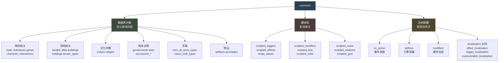
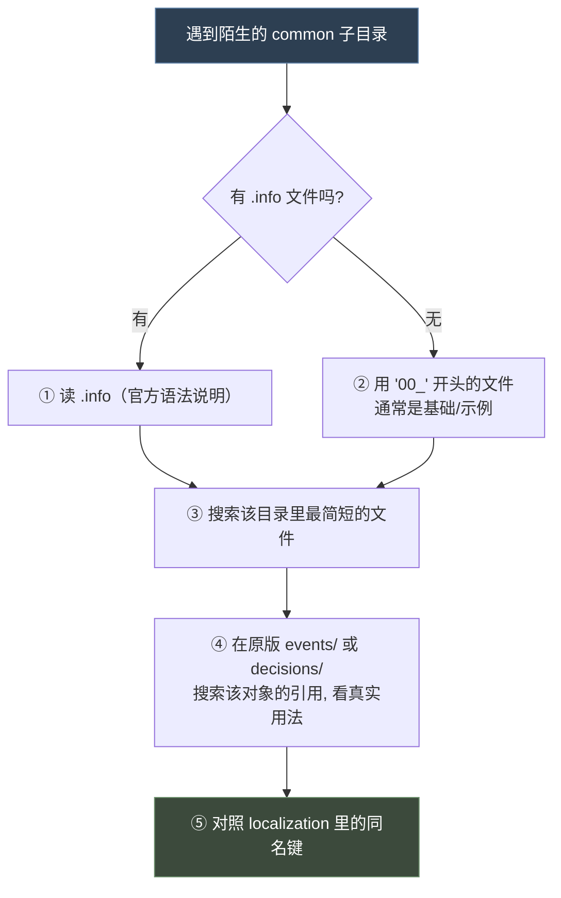
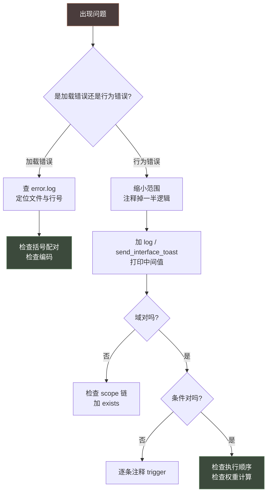
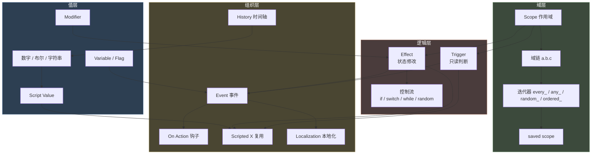

# 15 common 目录清单与速查表

> 参考手册：100+ 个 `common/` 子目录各自是什么、怎么写；以及全套语法速查与排错对照表。

## 本篇导读

- **第一部 common 目录对象清单** —— 按"脚本库 / 事件调度 / 角色 / 领地 / 文化宗教 / 政体法律 / 军事 / 派系计谋 / 物品 / 活动 / 故事情境 / 数值提示 / 本地化支持 / 事件表现 / UI / 其他"分类，并给出**陌生目录四步上手法**。
- **第二部 速查表与排错** —— 语法速查卡、事件 / on_action / history / 本地化速查、常见报错对照、调试方法论、`ftr_` 命名前缀总表、概念关系总图。

**为什么合并**：二者都是"不用通读、按需查阅"的参考性质内容，放在一起构成完整的随手手册。

## 文档关联

- **配套**：[00 总览与文档地图](00-总览与文档地图.md)（导航）、[16 多系统选型指南与开发实践](16-多系统选型指南与开发实践.md)（决策）
- **深入**：各系统专篇 08-14

---

# 第一部 `common/` 目录对象清单

> `common/` 是游戏数据库的主目录，共 **100+ 个子目录**，每个子目录定义一类游戏对象。
> 标注 🔵 = 有官方 `.info` 语法说明（优先阅读该文件）。

---

## 1. 总览分类图



---

## 2. 脚本库目录（Mod 最常用）

### 🔵 `common/scripted_triggers/`（135 文件）

```paradox
my_trigger = {
	<triggers>
}
my_trigger_with_param = {
	$PARAM$ = { ... }
}
```

调用：`my_trigger = yes` 或 `my_trigger = { PARAM = value }`

### 🔵 `common/scripted_effects/`（166 文件）

```paradox
my_effect = {
	<effects>
}
```

调用：`my_effect = yes` 或 `my_effect = { PARAM = value }`

### 🔵 `common/script_values/`（113 文件 + `_script_values.info`）

```paradox
static_value = 10
formula_value = { value = 10  add = 5  round = yes }
```

### 🔵 `common/scripted_modifiers/`（43 文件 + info）

```paradox
my_modifier = {
	modifier = { ... }
	opinion_modifier = { target = X  who = Y  multiplier = Z }
	compare_modifier = { target = X  value = V  multiplier = M }
}
```

### `common/scripted_lists/`（1 文件）

```paradox
my_list = {
	base = <已有列表>
	conditions = { <triggers> }
}
```

### `common/scripted_rules/`（1 文件，39 KB）

```paradox
my_rule = {
	custom_description = {
		text = <loc_key>
		<trigger>
	}
	<triggers>
}
```

### 其他脚本库

| 目录 | 用途 |
|---|---|
| 🔵 `scripted_relations/` | 关系判定脚本化 |
| 🔵 `scripted_animations/` | 立绘动画序列 |
| `scripted_costs/` | 成本计算 |
| `scripted_guis/` | 界面定义 |
| `scripted_character_templates/`（42 文件） | 角色生成模板，`create_character = { template = X }` |

---

## 3. 事件与调度

### 🔵 `common/on_action/`（165 文件 + `_on_actions.info`）

见 [06-事件系统与on_action](06-事件系统与on_action.md)。

```paradox
my_on_action = {
	trigger = { }
	weight_multiplier = { base = 1  modifier = { add = 1  <trig> } }
	events = { ns.0001  delay = { days = 365 }  ns.0002 }
	random_events = { chance_to_happen = 25  100 = ns.0001  100 = 0 }
	first_valid = { ns.0001  ns.0002 }
	on_actions = { other_on_action }
	effect = { }
	fallback = another_on_action
}
```

### `common/decisions/`（69 文件 + 🔵 `_decisions.info`）

```paradox
my_decision = {
	picture = "gfx/interface/illustrations/decisions/xxx"
	is_shown = { <triggers> }
	can_pick = { <triggers> }
	cost = { gold = 50 }
	effect = { <effects> }
}
```

### `common/important_actions/`（33 文件 + 🔵 info）

重要行动（角色可做的重要事项提示）。

---

## 4. 角色系统

| 目录 | 内容 | info |
|---|---|---|
| `traits/` | 特质定义 | 🔵 `_traits.info` |
| `nicknames/` | 绰号 | 🔵 `_nicknames.info` |
| `genes/` | 基因（外貌遗传） | 🔵 `_genes.info` |
| 🔵 `character_interactions/`（57 文件） | 角色交互（外交动作） | 🔵 26 KB 说明 |
| `character_interaction_categories/` | 交互分类 | — |
| `character_backgrounds/` | 角色背景 | — |
| `character_memory_types/` | 角色记忆类型 | 🔵 info |
| `dna_data/` | DNA 数据 | 🔵 info |
| `ethnicities/` | 族裔 | — |
| `pool_character_selectors/` | 角色池选择器 | 🔵 info |
| `portrait_types/` | 立绘类型 | — |
| `deathreasons/` | 死因 | 🔵 info |
| `focuses/` | 童年/教育重心 | 🔵 info |
| `lifestyles/`（含 perks） | 生活方式 | 🔵 info |
| `lifestyle_perks/` | 生活方式特长 | 🔵 info |
| `house_relation_types/` | 家族关系 | 🔵 info |

### traits 结构（基于 `00_traits.txt` 中大量 `first_valid`）

```paradox
my_trait = {
	# 特质属性
	# 常配合 first_valid = { ... } 做条件化图标/描述
}
```

---

## 5. 领地与建筑

| 目录 | 内容 | info |
|---|---|---|
| 🔵 `landed_titles/`（10 文件 + `_landed_titles.info`） | 头衔层级树 | 🔵 7.88 KB |
| 🔵 `buildings/`（21 文件） | 建筑 | 🔵 14.91 KB |
| 🔵 `holdings/` | 地产类型 | 🔵 info |
| 🔵 `terrain_types/` | 地形 | 🔵 info |
| 🔵 `province_terrain/` | 省份地形 | — |
| 🔵 `great_projects/` | 伟大工程 | — |
| 🔵 `domiciles/`（7 文件） | 宅邸 | 🔵 info |
| 🔵 `tax_slots/` | 税槽 | — |

### landed_titles 结构（实证）

```paradox
# 出处: common/landed_titles/00_landed_titles.txt
@correct_culture_primary_score = 100          # 文件级常量

h_roman_empire = {
	color = { 167 10 0 }
	capital = c_roma
	definite_form = yes
	can_be_named_after_dynasty = no
	can_create = {
		rule_title_creation_imperial_power_projection_title_creation_trigger = yes
	}
}
```

常用键：`color` `capital` `definite_form` `no_automatic_claims` `always_follows_primary_heir`
`destroy_if_invalid_heir` `can_use_nomadic_naming` `can_create` `can_destroy`

---

## 6. 文化与宗教

| 目录 | 内容 | info |
|---|---|---|
| 🔵 `culture/`（141 文件） | 文化、文化传统、文化支柱、革新、时代 | 🔵 `_cultural_traits.info` |
| 🔵 `religion/`（59 文件） | 宗教、信仰、教义、圣职 | 🔵 `great_holy_wars.info` |

---

## 7. 政体与法律

| 目录 | 内容 | info |
|---|---|---|
| 🔵 `governments/` | 政体 | 🔵 25.84 KB（最大） |
| 🔵 `laws/` | 法律 | 🔵 11.88 KB |
| 🔵 `succession_election/` | 选举继承制 | 🔵 info |
| 🔵 `succession_appointment/`（8 文件） | 任命继承制 | 🔵 info |
| 🔵 `council_positions/` | 议会职位 | 🔵 info |
| 🔵 `council_tasks/`（9 文件） | 议会任务 | 🔵 info |
| 🔵 `court_positions/`（45 文件） | 宫廷职位 | 🔵 18.57 KB |
| 🔵 `court_amenities/` | 宫廷设施 | 🔵 info |
| 🔵 `court_types/` | 宫廷类型 | 🔵 info |
| 🔵 `vassal_stances/` | 封臣立场 | 🔵 info |
| 🔵 `subject_contracts/`（16 文件） | 附庸契约 | 🔵 info |
| 🔵 `lease_contracts/` | 租约 | 🔵 info |
| 🔵 `confederation_types/` | 邦联类型 | 🔵 info |
| 🔵 `diarchies/` | 二头政治 | — |
| 🔵 `legitimacy/` | 正统性 | 🔵 info |

---

## 8. 军事

| 目录 | 内容 | info |
|---|---|---|
| 🔵 `men_at_arms_types/`（10 文件） | 兵士类型 | 🔵 3.63 KB |
| 🔵 `casus_belli_types/`（26 文件） | 宣战理由（战争规则主体） | [12](12-活动与战争.md) §2 |
| `casus_belli_groups/` | 宣战理由分组（组级额外限制） | [12](12-活动与战争.md) §2.10 |
| 🔵 `ai_war_stances/` | AI 战争姿态与目标优先级 | [12](12-活动与战争.md) §2.12 |
| 🔵 `combat_effects/` | 战斗效果 | 🔵 info |
| 🔵 `combat_phase_events/` | 战斗阶段事件 | 🔵 info |
| 🔵 `raids/` | 劫掠 | — |
| 🔵 `siege`（若有） | 围城 | — |

---

## 9. 派系、计谋、秘密

| 目录 | 内容 | info |
|---|---|---|
| 🔵 `factions/`（5 文件） | 派系 | [11](11-阴谋与派系.md) §2 |
| 🔵 `schemes/`（39 文件 + 4 info） | 阴谋（scheme_types / agent_types / pulse_actions / scheme_countermeasures） | [11](11-阴谋与派系.md) §1 |
| 🔵 `secret_types/` | 秘密类型 | 🔵 info |
| 🔵 `hooks`（`hook_types/`） | 人情 | 🔵 info |
| 🔵 `inspirations/` | 灵感 | 🔵 info |

---

## 10. 物品与荣誉

| 目录 | 内容 | info |
|---|---|---|
| 🔵 `artifacts/`（20 文件 + 子目录） | 宝物（features/blueprints/templates/types/visuals） | 🔵 多个 info |
| 🔵 `accolade_types/` / `accolade_icons/` / `accolade_names/` | 骑士团荣誉 | 🔵 info |
| 🔵 `dynasty_legacies/`（9 文件） | 宗族传承 | 🔵 info |
| 🔵 `dynasty_perks/`（10 文件） | 宗族特长 | 🔵 info |
| `dynasty_houses/` | 家族 | — |
| `dynasty_house_mottos/` | 家族箴言 | 🔵 info |
| `dynasty_house_motto_inserts/` | 箴言插入语 | 🔵 info |
| 🔵 `house_unities/` | 家族团结度 | 🔵 info |
| 🔵 `house_aspirations/` | 家族抱负 | 🔵 info |

---

## 11. 活动与旅行

| 目录 | 内容 | info |
|---|---|---|
| 🔵 `activities/`（62 文件 + 6 info） | 活动系统（activity_types / activity_locales / intents / pulse_actions / guest_invite_rules / activity_group_types） | [12](12-活动与战争.md) §1 |
| 🔵 `travel/` | 旅行系统 | — |
| 🔵 `courtier_guest_management/` | 廷臣/宾客管理 | — |
| 🔵 `guest_system/` | 宾客系统 | — |

---

## 12. 故事与情境

| 目录 | 内容 | info |
|---|---|---|
| 🔵 `story_cycles/`（52 文件） | 故事循环 | 🔵 4.56 KB |
| 🔵 `situation/`（16 文件） | 情境 | 🔵 info |
| 🔵 `struggle/` | 局势 | — |
| 🔵 `epidemics/` | 瘟疫 | 🔵 4.72 KB |

---

## 13. 数值与提示系统

| 目录 | 内容 | info |
|---|---|---|
| 🔵 `defines/`（12 文件） | 引擎常量表 | — |
| 🔵 `modifiers/`（131 文件） | 修饰符定义 | 🔵 `_modifiers.info` |
| 🔵 `modifier_definition_formats/`（13 文件） | 修饰符定义格式 | 🔵 info |
| 🔵 `opinion_modifiers/`（70 文件） | 好感度修正 | 🔵 info |
| 🔵 `messages/`（39 文件） | 消息类型 | 🔵 info |
| `message_filter_types/` / `message_group_types/` | 消息过滤/分组 | 🔵 info |
| 🔵 `named_colors/` | 具名颜色 | — |
| 🔵 `scripted_rules/` | 规则 | — |

### defines 结构（实证）

```paradox
# 出处: common/defines/00_defines.txt
NGame = {
	END_DATE = "1453.1.1"
	GAME_SPEED_TICKS = {
		2
		1
		0.5
		0.2
		0.0
	}
	MULTIPLAYER_EVENT_TIME_OUT = 90
	COURT_EVENT_TIME_OUT = 180
	BENCHMARK_OBSERVE_CHARACTER = k_england
}

NSetup = {
	COURTLESS_CHARACTER_GUEST_CHANCE = 0
	GENERATED_POOL_CHARACTERS = { 2 6 }
	GENERATED_POOL_CHARACTER_TEMPLATES = { "pool_repopulate_spouse" }
}
```

> defines 按 **命名空间块**（`NGame` / `NSetup`）组织。Mod 只能覆盖已有键。

---

## 14. 本地化支持目录

| 目录 | 用途 | 详见 |
|---|---|---|
| 🔵 `customizable_localization/`（149 文件） | 可定制文本 | [07-history历史脚本与本地化](07-history历史脚本与本地化.md) 第二部 §5 |
| 🔵 `effect_localization/`（35 文件） | 效果的人话描述 | [07-history历史脚本与本地化](07-history历史脚本与本地化.md) 第二部 §6 |
| 🔵 `trigger_localization/`（51 文件） | 触发器的人话描述 | [03-触发器与效果](03-触发器与效果.md) §8 |
| 🔵 `flavorization/`（8 文件） | 风味文本 | 🔵 10 KB |

---

## 15. 事件表现

| 目录 | 用途 |
|---|---|
| 🔵 `event_themes/` | 事件主题（背景/图标/音效组合） |
| 🔵 `event_backgrounds/` | 事件背景 |
| 🔵 `event_transitions/` | 事件转场 |
| 🔵 `event_2d_effects/` | 2D 特效 |
| 🔵 `bookmarks/`（含 groups/challenge_characters） | 开局书签 |
| `bookmark_portraits/`（332 文件） | 书签立绘 |
| 🔵 `coat_of_arms/`（含 dynamic_definitions） | 纹章 |

---

## 16. UI / 教学 / 成就

| 目录 | 用途 |
|---|---|
| 🔵 `game_concepts/`（15 文件） | 游戏概念（百科词条） |
| 🔵 `game_rules/` | 游戏规则（开局选项） |
| 🔵 `suggestions/` | 建议提示 |
| 🔵 `tutorial_lessons/`（9 文件） | 教学课程 |
| 🔵 `tutorial_lesson_chains/` | 教学课程链 |
| 🔵 `achievements/`（10 文件 + json） | 成就 |
| `achievement_groups.txt` | 成就分组 |
| 🔵 `console_groups/` | 控制台命令分组 |
| 🔵 `ai_goaltypes/` | AI 目标类型 |

---

## 17. 其他

| 目录 | 用途 |
|---|---|
| 🔵 `graphical_unit_types/` | 图形单位类型 |
| 🔵 `connection_arrows/` | 连接箭头 |
| 🔵 `ruler_objective_advice_types/` | 统治者目标建议 |
| 🔵 `task_contracts/`（11 文件） | 任务契约 |
| 🔵 `playable_difficulty_infos/` | 难度信息 |
| 🔵 `legends/` | 传说 |

---

## 18. 如何快速上手一个陌生目录



**四步法**：

1. **读 `.info`** —— 官方语法说明，最权威
2. **读 `00_*.txt`** —— 基础定义与注释最全
3. **搜引用** —— 在 `events/`、`decisions/` 里 grep 该对象名，看它怎么用
4. **对本地化** —— 在 `localization/english/` 里搜同名键，理解语义

---

## 19. `.info` 文件清单的作用

`common/` 下共 **138 个 `.info` 文件**，它们是**官方自带的语法文档**，是学习 P 语言最权威的一手资料。

部分重点 `.info`：

| 文件 | 大小 | 内容 |
|---|---|---|
| `activities/activity_types/_activity_type.info` | 36.76 KB | 活动系统（最复杂） |
| `governments/_governments.info` | 25.84 KB | 政体 |
| `character_interactions/_character_interactions.info` | 26.59 KB | 角色交互 |
| `court_positions/types/_court_positions.info` | 18.57 KB | 宫廷职位 |
| `buildings/_buildings.info` | 14.91 KB | 建筑 |
| `traits/_traits.info` | 12.71 KB | 特质 |
| `laws/_laws.info` | 11.88 KB | 法律 |
| `factions/_factions.info` | 10.53 KB | 派系 |
| `scripted_relations/_scripted_relations.info` | 3.24 KB | 脚本关系 |

> **强烈建议**：写任何 Mod 功能前，先读对应目录的 `.info`。

---

# 第二部 速查表与排错

---

## 1. 语法速查卡

### 1.1 基本结构

| 语法 | 含义 |
|---|---|
| `key = value` | 赋值（标量） |
| `key = { ... }` | 块 |
| `key = { a b c }` | 裸列表 / 范围 / 颜色 |
| `key >= value` | 比较（Trigger） |
| `# text` | 注释 |
| `@NAME = value` | 文件级常量（引用时不带 `@`） |
| `$PARAM$` | 宏参数 |
| `namespace = name` | 事件命名空间（每文件一次） |
| `name.number = { }` | 事件定义 |

### 1.2 作用域

| 语法 | 含义 |
|---|---|
| `this` | 当前域 |
| `root` | 根域 |
| `prev` / `prev.prev` | 上一层 / 上两层 |
| `scope:name` | 具名保存域 |
| `father.mother` | 域链 |
| `save_scope_as = n` | 保存域（脚本链） |
| `save_temporary_scope_as = n` | 临时域（当前块） |
| `save_scope_value_as = { name = n value = V }` | 保存数值 |
| `exists = scope:x` | 存在性检查 |
| `?=` | 弱比较（不存在时返回假而非报错） |

### 1.3 逻辑（Trigger）

| 语法 | 含义 |
|---|---|
| 并列多条 | **默认 AND** |
| `AND = { }` | 显式 AND |
| `OR = { }` | 或 |
| `NOT = { }` | 非 |
| `NOR = { }` | 全假才真 |
| `NAND = { }` | 不全真才真 |
| `count >= N` | 迭代器内计数条件 |
| `count = all` | 全部满足 |

> **CK3 无 `XOR`**（全目录实测 0 命中）。

### 1.4 控制流（Effect）

| 语法 | 含义 |
|---|---|
| `if = { limit = {} ... }` | 条件分支 |
| `else_if = { limit = {} ... }` | 否则若 |
| `else = { ... }` | 否则 |
| `switch = { trigger = X  v = {} }` | 按值分支 |
| `while = { limit = {} ... }` | 条件循环 |
| `while = { count = N  limit = {} ... }` | 带上限的循环 |
| `trigger_if / trigger_else` | **Trigger 上下文**的条件化 |

> **CK3 无 `repeat` / `break` / `continue`**（全目录实测 0 命中）。

### 1.5 迭代器

| 前缀 | 上下文 | 含义 |
|---|---|---|
| `every_*` | Effect | 遍历全部 |
| `any_*` | Trigger | 至少一个满足 |
| `random_*` | Effect | 随机取一个 |
| `ordered_*` | Effect | 排序后遍历（配 `order_by`） |
| `count_*` | 统计 | 计数 |

### 1.6 随机

```paradox
random_list = { 10 = { ... }  20 = { ... } }
random = { chance = 25  modifier = { add = 5 <trig> }  modifier = { factor = 0.5 <trig> }  <effects> }
ai_chance      = { base = 10  modifier = { add / factor + trigger } }
ai_will_select = { base = 10  if = { limit = {} add = 5 }  else_if = { limit = {} multiply = 0.5 } }
```

### 1.7 数值

```paradox
# Script Value
name = { value = V  add = N  subtract = N  multiply = N  divide = N  modulo = N
         max = N  min = N  round = yes  ceiling = yes  floor = yes
         if = { limit = {} ... }  else_if = {}  else = {}
         fixed_range = { min = a  max = b }  integer_range = { min = a  max = b } }

# Variable
set_variable = { name = X  value = V }
change_variable = { name = X  add = V }
remove_variable = X
clamp_variable = { name = X  min = a  max = b }
```

| 前缀 | 含义 |
|---|---|
| `var:X` | 对象变量 |
| `local_var:X` | 局部变量 |
| `global_var:X` | 全局变量 |
| `list:X` / `list_size:X` | 作用域内临时 list 遍历 / 大小（`add_to_list` 建的名单用） |
| `flag:X` | 标记（可作 switch 分支键） |

> 注：`add_to_variable_list` 建的 **variable list** 遍历用 `variable = X`、存在用 `has_variable_list`、大小用 `variable_list_size`（trigger），**不要**对 variable list 用 `list =` / `list_size:`（详见 [01-词法 §4.3](01-词法、数据类型与值系统.md#43-变量列表List)）。

---

## 2. 事件速查

```paradox
namespace = ns

ns.0001 = {
	# 元信息
	type = character_event / letter_event / court_event / activity_event
	scope = character / landed_title / province / ...
	window = character_event / big_event_window / letter_event / ...
	content_source = my_mod
	theme = my_theme
	orphan = no

	# 触发
	hidden = no
	major = no
	major_trigger = { }
	cooldown = { days / weeks / months / years = X }

	# 文本（静态键 或 动态块）
	title = ns.0001.t
	desc = { first_valid = { triggered_desc = { trigger = {} desc = k }  desc = fallback } }
	opening = ns.0001.opening      # letter_event

	# 立绘
	left_portrait = { character = root  animation = X  triggered_animation = { trigger = {} animation = Y } }
	right_portrait = scope:guest
	sender = scope:author          # letter_event 必需

	# 逻辑
	trigger = { }
	immediate = { }

	option = {
		name = ns.0001.a
		trigger = { }
		show_as_unavailable = { }
		fallback = yes
		exclusive = yes
		ai_chance = { base = 10  modifier = { add = 5  <trig> } }
		add_gold = 100
	}

	after = { }
	on_trigger_fail = { }
}
```

### 2.1 动态描述节点

| 节点 | 作用 |
|---|---|
| `desc` | 追加文本 |
| `triggered_desc` | 条件文本（`trigger` + `desc`） |
| `first_valid` | 取第一个有效子项 |
| `random_valid` | 随机取 N 个（`count = N`，默认 1） |
| `switch` | 按值分支（`trigger` + case + `fallback`） |

---

## 3. On Action 速查

```paradox
my_on_action = {
	trigger = { }
	weight_multiplier = { base = 1  modifier = { add = 1  <trig> } }
	events = { ns.0001  delay = { days = 365 }  ns.0002 }
	random_events = { chance_to_happen = 25  chance_of_no_event = { value = 0 }  100 = ns.0001  100 = 0 }
	first_valid = { ns.0001  ns.0002 }
	on_actions = { other }
	random_on_actions = { 100 = a  200 = b }
	first_valid_on_action = { a  b }
	effect = { }
	fallback = another_on_action
}

# 触发
trigger_event = ns.0001
trigger_event = { id = ns.0001  days = 5 }
trigger_event = { on_action = my_on_action  days = 5 }
```

### 3.1 周期钩子

| on_action | 频率 | root |
|---|---|---|
| `yearly_global_pulse` | 每年 1/1 | **无 root** |
| `on_yearly_playable` | 每年（按生日） | 可玩角色 |
| `three_year_playable_pulse` | 每 3 年 | 可玩角色 |
| `five_year_playable_pulse` | 每 5 年 | 可玩角色 |
| `quarterly_playable_pulse` | 每季度（带 `scope:quarter` 1-4） | 可玩角色 |
| `random_yearly_playable_pulse` | 每年随机 | 可玩角色 |
| `random_yearly_everyone_pulse` | 每年随机 | 所有角色 |
| `five_year_everyone_pulse` | 每 5 年 | 所有角色 |
| `three_year_pool_pulse` | 每 3 年 | 角色池角色 |

---

## 4. History 速查

```paradox
# characters/<culture>.txt
char_id_string = {
	name = "Name"
	dynasty = X   faith = X   culture = X
	disallow_random_traits = yes
	trait = brave
	martial = 15   prowess = 12
	1033.1.1 = { birth = yes }
	1066.1.1 = { learn_language_of_culture = culture:greek }
	1082.1.1 = { death = yes }
}

# titles/<title>.txt
k_france = {
	867.1.1  = { change_development_level = 5 }
	481.1.1  = { holder = 168673  name = WEST_FRANCIA  succession_laws = { male_only_law } }
	511.11.27 = { holder = 168681 }
}

# provinces/<kingdom>.txt
2154 = {	#VANNES
	culture = breton
	religion = catholic
	holding = castle_holding / city_holding / church_holding / none / auto
	1104.1.1 = { holding = city_holding }
}

# cultures/<culture>.txt
800.1.1 = {
	discover_innovation = innovation_x
	add_innovation_progress = { culture_innovation = innovation_y  progress = 50 }
	join_era = culture_era_2
	progress_era = 50
}
```

---

## 5. 本地化速查

```yaml
l_simp_chinese:
 key:0 "value"
 key:1 "变体"
 key:0 "带 [ROOT.Char.GetTitledFirstName] 的动态文本"
 key:0 "首字母大写: [ROOT.Char.GetSheHe|U]"
 key:0 "概念链接: [claim|E]"
 key:0 "强调 #EMP 文本#!\n\n换行"
 key:0 "可定制: [ROOT.Char.Custom('FemaleMale')]"
 key:0 "变量: $some_key$"
```

| 规则 | 说明 |
|---|---|
| 编码 | **UTF-8 with BOM** |
| 语言头 | 顶格，如 `l_simp_chinese:` |
| 条目缩进 | 至少 1 空格 |
| 注释 | `#` |
| 转义 | `\"` `\\"` `\n` |
| 标记 | `#EMP ... #!` `#HIGH ... #!` `#help ... #!` |

---

## 6. 常见报错与排错

### 6.1 加载期错误

| 报错 / 症状 | 原因 | 解法 |
|---|---|---|
| 中文乱码 | 文件不是 UTF-8 with BOM | 用支持 BOM 的编辑器另存 |
| `Unknown token` / `Unexpected token` | 括号不匹配、缺 `=`、Tab/空格混用 | 检查括号配对 |
| `Missing closing brace` | 缺 `}` | 逐层检查缩进 |
| 数据库对象重复定义 | 两个 Mod 定义了同名 ID | 加前缀 |
| 事件 ID 冲突 | namespace + number 重复 | 换编号 |

### 6.2 运行期错误

| 报错 / 症状 | 原因 | 解法 |
|---|---|---|
| `Invalid scope` / `Scope type mismatch` | 在错误域上用了不匹配的 Trigger/Effect | 确认当前域类型 |
| `No scope` | 访问了不存在的域 | 先 `exists = scope:x`；或用 `?=` |
| `Effect used in trigger context` | Trigger 块里写了 Effect | 移到 `limit` 外或改用 `trigger_if` |
| `Trigger used in effect context` | Effect 块里裸写了 Trigger | 包进 `limit = { }` |
| 事件不触发 | on_action trigger / 事件 trigger / cooldown | 逐层排查 |
| 延迟事件不触发 | 延迟到期时**二次校验** trigger | 检查条件是否仍成立 |
| 事件里读不到局部变量 | on_action 的 effect 与事件是**两条域链** | 改用 `save_scope_as` |
| 游戏卡住 | `while` 死循环 / on_action `fallback` 死循环 | 加 `count`；检查 fallback 链 |
| 稀有事件总触发 | `random_events` 缺 `0` 权重条目 | 加 `100 = 0` |

### 6.3 逻辑错误（不报错但行为异常）

| 症状 | 原因 | 解法 |
|---|---|---|
| 权重计算不符预期 | 忘了 `factor` 是在所有 `add` 之后连乘 | 按 base → Σadd → Πfactor 手算 |
| script value 结果不对 | 运算**严格自上而下**，`max` 位置很关键 | 检查运算顺序 |
| `add_gold = gold` 变成翻倍 | `gold` 被解析为当前域的金币属性 | 改用不同名或显式变量 |
| 参数没替换 | `$PARAM$` 大小写不一致 | 统一大小写 |
| 变量自增报错 | 对不存在的变量 `change_variable` | 先 `exists` 检查 |
| 历史人物被随机加特质 | 缺 `disallow_random_traits = yes` | 补上 |
| 开局人物不存在/已死 | `birth`/`death` 日期与开局日期关系错了 | 检查日期 |
| `|U` 原样显示 | 用了中文竖线 `｜` | 改成英文 `\|` |

---

## 7. 调试方法论



**实用技巧**：

1. **二分法**：注释掉一半逻辑，快速定位
2. **控制台**：用 `effect` 命令直接跑脚本片段
3. **`send_interface_toast`**：把中间值打到界面上
4. **最小复现**：把问题逻辑抽到独立的测试事件
5. **对比原版**：找一个功能相似的原版实现对照
6. **读 `.info`**：官方语法说明永远是最准的

---

## 8. 命名前缀总表（Mod 建议）

| 类别 | 建议前缀 | 示例 |
|---|---|---|
| 事件命名空间 | `ftr` | `ftr.0001` |
| 脚本触发器 | `ftr_` + `_trigger` | `ftr_can_convert_trigger` |
| 脚本效果 | `ftr_` + `_effect` | `ftr_grant_merit_effect` |
| 脚本值 | `ftr_` + `_value` | `ftr_war_tax_value` |
| on_action | `ftr_` | `ftr_vassal_independence` |
| 变量 | `ftr_` | `var:ftr_merit_level` |
| 标记 | `ftr_` | `has_character_flag = ftr_is_governor` |
| 修饰符 | `ftr_` + `_modifier` | `ftr_war_exhaustion_modifier` |
| 本地化键 | `ftr_` | `ftr_war_tax_name` |
| 特质 | `ftr_` | `ftr_commander_trait` |
| 决议 | `ftr_` | `ftr_declare_bankruptcy` |
| 交互 | `ftr_` | `ftr_buy_land_interaction` |
| 参数 | 全大写 | `$CHARACTER$` `$SCALE$` |

---

## 9. 文件编码与工具清单

| 项目 | 要求 |
|---|---|
| `.txt` 脚本编码 | UTF-8 with BOM |
| `.yml` 本地化编码 | UTF-8 with BOM |
| 行尾 | LF（原版），CRLF 通常也能用 |
| 缩进 | Tab（原版统一） |
| 编辑器推荐 | VS Code（装 CK3 语法高亮插件）+ 显存 BOM 设置 |

**VS Code 设置建议**：

```json
{
  "files.encoding": "utf8bom",
  "files.eol": "\n",
  "editor.insertSpaces": false,
  "editor.tabSize": 4
}
```

---

## 10. 概念关系总图


