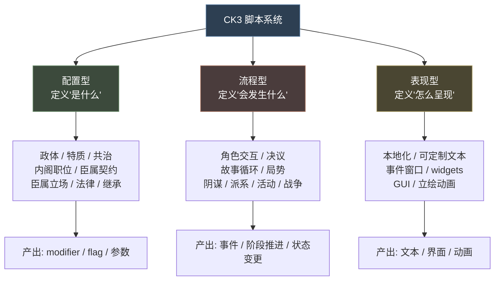
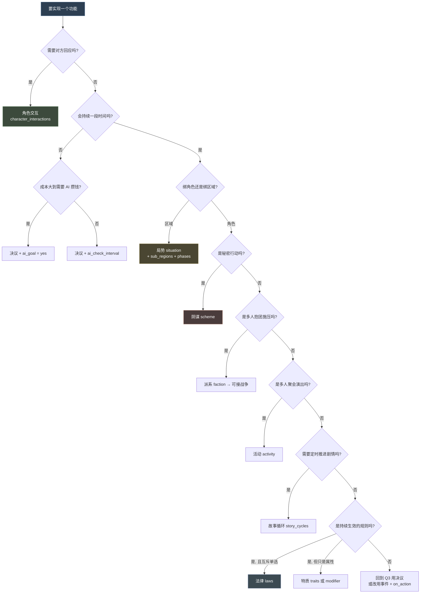
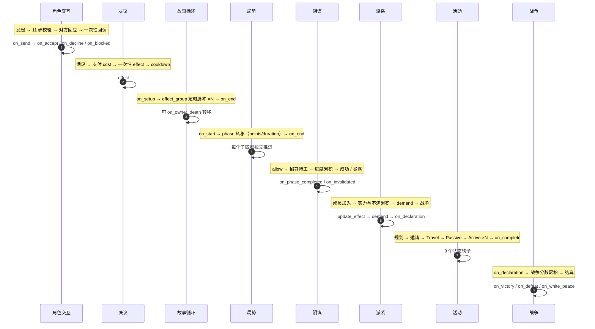

# 16 多系统选型指南

> 08-14 各系统专篇的**横向整合层**：不确定该用哪个系统、或需要跨系统对照时，从这里入手。

---

## 1. 全系统地图

CK3 的脚本系统可分为三大类。理解这个分类，是选型的第一步。



### 1.1 配置型系统（13 / 14 / 10）

| 系统 | 文档 | 绑定对象 | 主要产出 |
|---|---|---|---|
| 政体 | [13](13-政体与特质.md) §1 | 角色 | 40+ 机制开关、modifier |
| 特质 | [13](13-政体与特质.md) §2 | 角色 | modifier、好感、遗传 |
| 共治 | [13](13-政体与特质.md) §3 | 领主 + 共治者 | parameter、modifier |
| 内阁职位 | [14](14-内阁职位.md) §1 | 统治者 + 廷臣 | 双向 modifier |
| 臣属契约 | [14](14-内阁职位.md) §2 | 领主 + 封臣 | 税 / 兵 / 畜群 |
| 臣属立场 | [14](14-内阁职位.md) §3 | AI 封臣 | 自动生成的 15 个 modifier |
| 法律 | [10](10-法律与继承.md) §1 | 统治者 / 头衔 | modifier + flag |
| 继承 | [10](10-法律与继承.md) §2 | 头衔 / 王国 | 继承人 |

### 1.2 流程型系统（08 / 09 / 11 / 12）

| 系统 | 文档 | 发起者 | 参与方 | 核心数值 |
|---|---|---|---|---|
| 角色交互 | [08](08-角色交互与决议.md) §1 | 单人 | 对方（需同意） | 接受度 |
| 决议 | [08](08-角色交互与决议.md) §2 | 单人 | — | 成本 |
| 故事循环 | [09](09-故事循环与局势.md) §1 | 单人 | 可选 | 定时进度 |
| 局势 | [09](09-故事循环与局势.md) §2 | 区域 | 多组 | 催化剂点数 + 阶段 |
| 阴谋 | [11](11-阴谋与派系.md) §1 | owner | agents | 进度 / 成功率 / 隐秘度 |
| 派系 | [11](11-阴谋与派系.md) §2 | 自发 | members | 实力 + 不满 |
| 活动 | [12](12-活动.md) §1 | host | guests | 阶段进度 |
| 战争 | [12](12-活动.md) §2 | attacker | 双方阵营 | 战争分数 0-100 |

---

## 2. 统一选型决策树



### 2.1 边界情况的判断

| 情形 | 建议 | 理由 |
|---|---|---|
| 想做一个"一次性但有 UI 选择"的功能 | **事件**（[06](06-事件系统与on_action.md)） | 事件本身就是带 UI 的交互单元 |
| 想让 AI 定期做某事 | **on_action 脉冲**（[06](06-事件系统与on_action.md) §2） | 比决议的 `ai_check_interval` 更可控 |
| 想给角色加一个永久属性 | **特质**（[13](13-政体与特质.md) §2）或 **modifier** | 特质可被 UI 展示、可被遗传 |
| 想让某个区域有特殊规则 | **局势**（[09](09-故事循环与局势.md) §2） | 唯一绑地理区域的系统 |
| 想让两个角色长期互动 | **故事循环**（[09](09-故事循环与局势.md) §1） | 自带定时器，可转移所有者 |
| 想在 UI 上加一个可点按钮 | **决议**（[08](08-角色交互与决议.md) §2） | 决议天然出现在决议视图 |
| 想做跨角色的外交动作 | **角色交互**（[08](08-角色交互与决议.md) §1） | 唯一支持"对方回应"的系统 |

---

## 3. 各系统作用域速查

这是跨系统开发时**最容易出错**的地方：同一个 `scope:xxx` 在不同系统里含义完全不同。

```mermaid
graph TD
    SC["作用域命名空间"] --> GEN["通用<br/>this / root / prev / scope:name"]
    SC --> CI["角色交互<br/>actor / recipient<br/>secondary_actor / secondary_recipient<br/>intermediary"]
    SC --> SCY["故事循环<br/>root=story / scope:story<br/>story_owner"]
    SC --> ST["局势<br/>root=situation<br/>situation_sub_region<br/>situation_participant_group"]
    SC --> SCM["阴谋<br/>scope:scheme / scope:owner<br/>scope:target / scope:agent<br/>scheme_owner / scheme_target_*"]
    SC --> FA["派系<br/>faction_target / faction_leader<br/>faction_war / special_character<br/>special_title"]
    SC --> AC["活动<br/>scope:activity / scope:host<br/>scope:special_option<br/>scope:&lt;special_guest_key&gt;<br/>scope:&lt;option_category_key&gt;"]
    SC --> WA["战争<br/>scope:attacker / scope:defender<br/>scope:target / scope:claimant"]
    SC --> SUB["臣属契约<br/>scope:liege / scope:subject<br/>scope:vassal / scope:opinion_of_liege<br/>scope:tax_slot / scope:tax_collector"]
    SC --> DIA["共治<br/>liege / diarch<br/>scope:liege（评估时）"]

    style SC fill:#2d3f52,stroke:#5b7fa6,color:#fff
```



### 3.1 各系统的 root 与预置域

| 系统 | root | 预置域 | 详见 |
|---|---|---|---|
| 事件 | 接收者 | `scope:*`（saved scope 跨链传递） | [06](06-事件系统与on_action.md) §1 |
| on_action | 代码指定（`yearly_global_pulse` **无 root**） | 同事件 | [06](06-事件系统与on_action.md) §2 |
| 角色交互 | `scope:actor` | 另见 4 个 | [08](08-角色交互与决议.md) §1.2 |
| 决议 | 角色 | — | [08](08-角色交互与决议.md) §2 |
| 故事循环 | `root` = story | `scope:story`、`story_owner` | [09](09-故事循环与局势.md) §1.2 |
| 局势 | `root` = situation | `scope:situation`、`_sub_region`、`_participant_group` | [09](09-故事循环与局势.md) §2.8 |
| 阴谋 | `scope:scheme` | `scope:owner`、`scope:target`、`scope:agent` | [11](11-阴谋与派系.md) §1.2 |
| 派系 | faction | `faction_target`、`faction_leader`、… | [11](11-阴谋与派系.md) §2.2 |
| 活动 | `scope:activity` | `scope:host`、`scope:special_option`、… | [12](12-活动.md) §1.14 |
| 战争（CB） | 视 Trigger 而定 | `scope:attacker`、`scope:defender`、… | [12](12-活动.md) §2.2 |
| 法律 | 统治者 / 头衔 | `scope:title`（头衔法律时） | [10](10-法律与继承.md) §1 |
| 内阁职位 | 视 Trigger 而定 | `councillor_liege`、`swapped_position`、… | [14](14-内阁职位.md) §1.2 |
| 臣属契约 | 义务内视 script 而定 | `scope:liege`、`scope:subject`、… | [14](14-内阁职位.md) §2.3 |
| 臣属立场 | 评估立场的 AI 角色 | `scope:liege` | [14](14-内阁职位.md) §3.2 |
| 共治 | 视 script 而定 | `liege`、`scope:liege` | [13](13-政体与特质.md) §3 |
| 政体 | 角色 | — | [13](13-政体与特质.md) §1 |
| 特质 | 角色（**可能不存在**） | — | [13](13-政体与特质.md) §2.2 |

---

## 4. 生命周期时序总览



### 4.1 回调钩子总表

| 系统 | 主要回调 |
|---|---|
| 角色交互 | `on_send` `pre_auto_accept` `on_auto_accept` `on_intermediary_accept` `on_intermediary_decline` `on_accept` `on_decline` `on_blocked_effect` |
| 决议 | `effect`（唯一） |
| 故事循环 | `on_setup` `on_end` `on_owner_death` + `effect_group` |
| 局势 | `on_start` `on_end` `on_monthly` `on_yearly` `on_join` `on_leave` + 阶段 `on_start` / `on_end` |
| 阴谋 | `on_phase_completed` `on_hud_click` `on_monthly` `on_semiyearly` `on_invalidated` + pulse actions |
| 派系 | `on_creation` `on_destroy` `demand` `update_effect` `on_declaration` `character_leaves` `leader_leaves` |
| 活动 | `on_start` `on_complete` `on_invalidated` `on_host_death` + 9 个状态钩子 + 阶段钩子 |
| 战争 | `on_declaration` `on_victory` `on_white_peace` `on_defeat` `on_invalidated` |
| 法律 | `on_pass` `on_after_pass` `on_revoke` |
| 内阁职位 | `on_get_position` `on_lose_position` `on_fired_from_position` |
| 局势参与组 | `on_join` `on_leave` |

---

## 5. 通用关键字索引

### 6.1 跨系统通用效果

| 效果 | 适用系统 |
|---|---|
| `end_story = yes` / `start_story = { }` | 故事循环 |
| `add_realm_law = X` / `add_realm_law_skip_effects = X` | 法律 |
| `send_interface_message = { }` / `send_interface_toast = { }` | 角色交互、事件 |
| `custom_tooltip = <key>` / `custom_description = { }` | 全系统（**提供失败原因的标准做法**） |
| `save_scope_as` / `save_temporary_scope_as` / `save_scope_value_as` | 全系统 |
| `trigger_event = { }` | 全系统 |
| `add_character_modifier = { modifier = X }` | 全系统 |
| `set_variable` / `change_variable` / `remove_variable` | 全系统 |
| `random_list = { }` / `random = { chance = X modifier = {} }` | 全系统 |

### 6.2 跨系统通用触发器

| 触发器 | 适用系统 |
|---|---|
| `has_trait = X` / `has_character_flag = X` / `has_variable = X` | 角色域 |
| `has_realm_law = X` / `has_realm_law_flag = X` | 法律 |
| `government_has_flag = X` | 政体 |
| `exists = scope:x` / `?=` | 全系统 |
| `is_ai = yes` / `is_playable_character = yes` | 角色域 |
| `highest_held_title_tier >= tier_X` | 角色域 |
| `faith = { has_doctrine_parameter = X }` | 信仰域 |
| `culture = { has_cultural_parameter = X }` | 文化域 |

### 6.3 系统专属迭代器

| 迭代器 | 系统 |
|---|---|
| `every_attending_character` | 活动 |
| `every_situation_county` / `every_situation_group_participant` | 局势 |
| `every_faction_member` | 派系 |
| `every_in_list` / `any_in_list` / `ordered_in_list` | 变量列表 |
| `any_in_global_list` / `ordered_in_global_list` | 全局列表 |
| `every_guest_subset_current_phase` | 活动 |

---

## 6. Mod 落点总表

| 想做的事 | 落点 |
|---|---|
| 新增外交动作 | `common/character_interactions/ftr_interactions.txt` |
| 新增一次性大动作 | `common/decisions/ftr_decisions.txt` |
| 新增长线剧情 | `common/story_cycles/ftr_xxx.txt` + `events/ftr_xxx_events.txt` |
| 新增区域系统 | `common/situation/situations/ftr_xxx.txt` + `common/situation/catalysts/ftr_catalysts.txt` |
| 新增阴谋 | `common/schemes/scheme_types/ftr_xxx_scheme.txt` + 配套事件 |
| 新增阴谋脉冲 | `common/schemes/pulse_actions/ftr_pulse_actions.txt` |
| 新增特工槽位 | `common/schemes/agent_types/ftr_agent_types.txt` |
| 新增反制措施 | `common/schemes/scheme_countermeasures/ftr_countermeasures.txt` |
| 新增派系 | `common/factions/ftr_factions.txt` + 一个 CB |
| 新增活动 | `common/activities/activity_types/ftr_xxx.txt` + 配套事件 |
| 新增活动场所 | `common/activities/activity_locales/ftr_locales.txt` |
| 新增活动意图 | `common/activities/intents/ftr_intents.txt` |
| 新增战争类型 | `common/casus_belli_types/ftr_wars.txt` |
| 新增 AI 战争姿态 | `common/ai_war_stances/ftr_stances.txt` |
| 新增政体 | `common/governments/ftr_governments.txt` |
| 新增特质 | `common/traits/ftr_traits.txt` + `localization/*/ftr_traits_l_*.yml` |
| 新增共治 | `common/diarchies/diarchy_types/ftr_*.txt` + `diarchy_mandates/` |
| 新增内阁职位 | `common/council_positions/ftr_positions.txt` |
| 新增臣属契约 | `common/subject_contracts/contracts/ftr_*.txt` + 注册到 `groups/` |
| 新增选举 / 任命继承 | `common/succession_election/` 或 `common/succession_appointment/` |
| 新增法律 | `common/laws/ftr_laws.txt` |
| 新增臣属立场 | `common/vassal_stances/ftr_stances.txt` + `modifier_definition_formats/` |
| 扩展原版 on_action | 建自己的 `common/on_action/ftr_on_actions.txt`，用 `on_actions = { ftr_xxx }` 挂载 |

### 8.1 非侵入式扩展模式（强烈推荐）

**不要覆盖原版文件**。扩展原版 on_action 的标准做法：

```paradox
# common/on_action/ftr_on_actions.txt
on_birthday = {
	on_actions = { ftr_birthday }
}

ftr_birthday = {
	trigger = { is_adult = yes }
	effect = {
		ftr_my_custom_birthday_effect = yes
	}
}
```

> 官方明确警告：不能给同一 on_action 追加第二个 `trigger` 或 `effect` 块。用 `on_actions = { 自己的钩子 }` 是唯一安全的方式。

---

## 7. 文档关联

- **入口**：[00 总览与文档地图](00-总览与文档地图.md)
- **基础**：[01 词法、数据类型与值系统](01-词法、数据类型与值系统.md) · [02 作用域 Scope 体系](02-作用域Scope体系.md) · [03 触发器与效果](03-触发器与效果.md)
- **工具**：[04 修饰符与数值计算](04-修饰符与数值计算.md) · [05 脚本复用机制](05-脚本复用机制.md)
- **调度**：[06 事件系统与 on_action](06-事件系统与on_action.md)
- **参考**：[15 common 目录清单与速查表](15-common目录清单.md)
