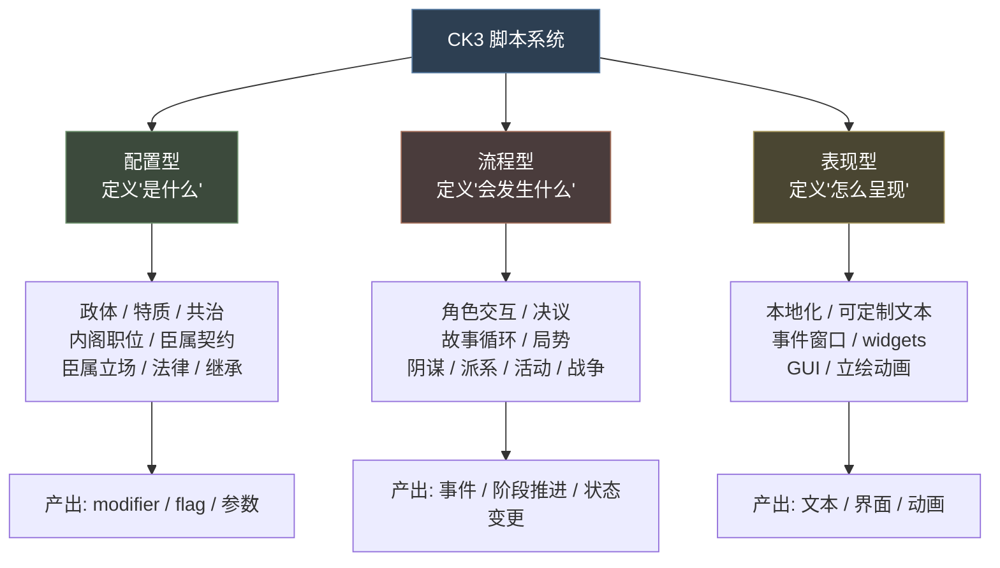
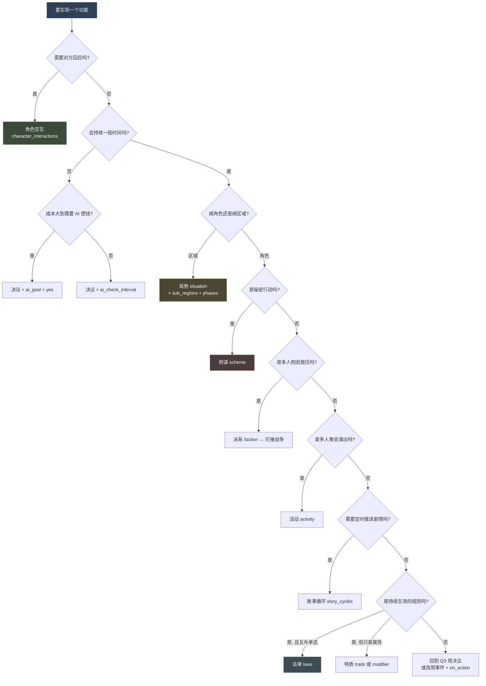
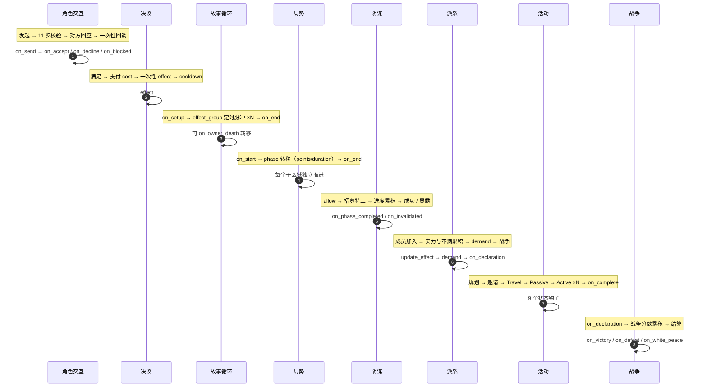
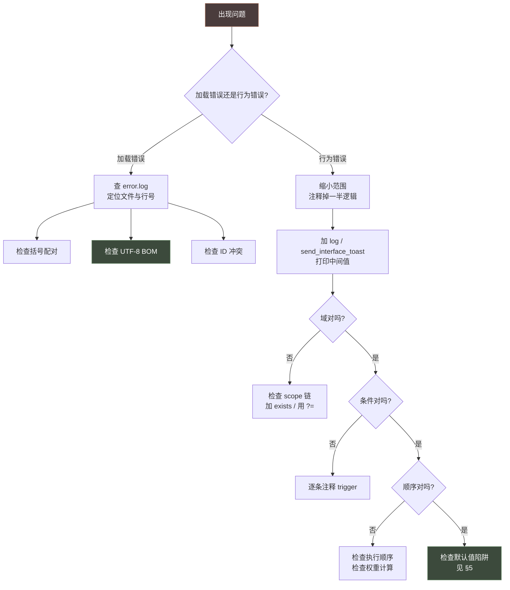

# 16 多系统选型指南与开发实践

> 本文是 08-14 各系统专篇的**横向整合层**：当你不确定该用哪个系统、或需要跨系统排查时，从这里入手。

---

## 1. 全系统地图

CK3 的脚本系统可分为三大类。理解这个分类，是选型的第一步。



### 1.1 配置型系统（13 / 14 / 10）

| 系统 | 文档 | 绑定对象 | 主要产出 |
|---|---|---|---|
| 政体 | [13](13-政体、特质与共治.md) §1 | 角色 | 40+ 机制开关、modifier |
| 特质 | [13](13-政体、特质与共治.md) §2 | 角色 | modifier、好感、遗传 |
| 共治 | [13](13-政体、特质与共治.md) §3 | 领主 + 共治者 | parameter、modifier |
| 内阁职位 | [14](14-内阁职位、臣属契约与臣属立场.md) §1 | 统治者 + 廷臣 | 双向 modifier |
| 臣属契约 | [14](14-内阁职位、臣属契约与臣属立场.md) §2 | 领主 + 封臣 | 税 / 兵 / 畜群 |
| 臣属立场 | [14](14-内阁职位、臣属契约与臣属立场.md) §3 | AI 封臣 | 自动生成的 15 个 modifier |
| 法律 | [10](10-法律与继承.md) §1 | 统治者 / 头衔 | modifier + flag |
| 继承 | [10](10-法律与继承.md) §2 | 头衔 / 王国 | 继承人 |

### 1.2 流程型系统（08 / 09 / 11 / 12）

| 系统 | 文档 | 发起者 | 参与方 | 核心数值 |
|---|---|---|---|---|
| 角色交互 | [08](08-角色交互与决议.md) §1 | 单人 | 对方（需同意） | 接受度 |
| 决议 | [08](08-角色交互与决议.md) §2 | 单人 | — | 成本 |
| 故事循环 | [09](09-故事循环与局势.md) §1 | 单人 | 可选 | 定时进度 |
| 局势 | [09](09-故事循环与局势.md) §2 | 区域 | 多组 | 催化剂点数 + 阶段 |
| 阴谋 | [11](11-阴谋与派系.md) §1 | owner | agents | 进度 / 成功率 / 隐秘度 |
| 派系 | [11](11-阴谋与派系.md) §2 | 自发 | members | 实力 + 不满 |
| 活动 | [12](12-活动与战争.md) §1 | host | guests | 阶段进度 |
| 战争 | [12](12-活动与战争.md) §2 | attacker | 双方阵营 | 战争分数 0-100 |

---

## 2. 统一选型决策树



### 2.1 边界情况的判断

| 情形 | 建议 | 理由 |
|---|---|---|
| 想做一个"一次性但有 UI 选择"的功能 | **事件**（[06](06-事件系统与on_action.md)） | 事件本身就是带 UI 的交互单元 |
| 想让 AI 定期做某事 | **on_action 脉冲**（[06](06-事件系统与on_action.md) §2） | 比决议的 `ai_check_interval` 更可控 |
| 想给角色加一个永久属性 | **特质**（[13](13-政体、特质与共治.md) §2）或 **modifier** | 特质可被 UI 展示、可被遗传 |
| 想让某个区域有特殊规则 | **局势**（[09](09-故事循环与局势.md) §2） | 唯一绑地理区域的系统 |
| 想让两个角色长期互动 | **故事循环**（[09](09-故事循环与局势.md) §1） | 自带定时器，可转移所有者 |
| 想在 UI 上加一个可点按钮 | **决议**（[08](08-角色交互与决议.md) §2） | 决议天然出现在决议视图 |
| 想做跨角色的外交动作 | **角色交互**（[08](08-角色交互与决议.md) §1） | 唯一支持"对方回应"的系统 |

---

## 3. 各系统作用域速查

这是跨系统开发时**最容易出错**的地方：同一个 `scope:xxx` 在不同系统里含义完全不同。

```mermaid
graph TD
    SC["作用域命名空间"] --> GEN["通用<br/>this / root / prev / scope:name"]
    SC --> CI["角色交互<br/>actor / recipient<br/>secondary_actor / secondary_recipient<br/>intermediary"]
    SC --> SCY["故事循环<br/>root=story / scope:story<br/>story_owner"]
    SC --> ST["局势<br/>root=situation<br/>situation_sub_region<br/>situation_participant_group"]
    SC --> SCM["阴谋<br/>scope:scheme / scope:owner<br/>scope:target / scope:agent<br/>scheme_owner / scheme_target_*"]
    SC --> FA["派系<br/>faction_target / faction_leader<br/>faction_war / special_character<br/>special_title"]
    SC --> AC["活动<br/>scope:activity / scope:host<br/>scope:special_option<br/>scope:&lt;special_guest_key&gt;<br/>scope:&lt;option_category_key&gt;"]
    SC --> WA["战争<br/>scope:attacker / scope:defender<br/>scope:target / scope:claimant"]
    SC --> SUB["臣属契约<br/>scope:liege / scope:subject<br/>scope:vassal / scope:opinion_of_liege<br/>scope:tax_slot / scope:tax_collector"]
    SC --> DIA["共治<br/>liege / diarch<br/>scope:liege（评估时）"]

    style SC fill:#2d3f52,stroke:#5b7fa6,color:#fff
```



### 3.1 各系统的 root 与预置域

| 系统 | root | 预置域 | 详见 |
|---|---|---|---|
| 事件 | 接收者 | `scope:*`（saved scope 跨链传递） | [06](06-事件系统与on_action.md) §1 |
| on_action | 代码指定（`yearly_global_pulse` **无 root**） | 同事件 | [06](06-事件系统与on_action.md) §2 |
| 角色交互 | `scope:actor` | 另见 4 个 | [08](08-角色交互与决议.md) §1.2 |
| 决议 | 角色 | — | [08](08-角色交互与决议.md) §2 |
| 故事循环 | `root` = story | `scope:story`、`story_owner` | [09](09-故事循环与局势.md) §1.2 |
| 局势 | `root` = situation | `scope:situation`、`_sub_region`、`_participant_group` | [09](09-故事循环与局势.md) §2.8 |
| 阴谋 | `scope:scheme` | `scope:owner`、`scope:target`、`scope:agent` | [11](11-阴谋与派系.md) §1.2 |
| 派系 | faction | `faction_target`、`faction_leader`、… | [11](11-阴谋与派系.md) §2.2 |
| 活动 | `scope:activity` | `scope:host`、`scope:special_option`、… | [12](12-活动与战争.md) §1.14 |
| 战争（CB） | 视 Trigger 而定 | `scope:attacker`、`scope:defender`、… | [12](12-活动与战争.md) §2.2 |
| 法律 | 统治者 / 头衔 | `scope:title`（头衔法律时） | [10](10-法律与继承.md) §1 |
| 内阁职位 | 视 Trigger 而定 | `councillor_liege`、`swapped_position`、… | [14](14-内阁职位、臣属契约与臣属立场.md) §1.2 |
| 臣属契约 | 义务内视 script 而定 | `scope:liege`、`scope:subject`、… | [14](14-内阁职位、臣属契约与臣属立场.md) §2.3 |
| 臣属立场 | 评估立场的 AI 角色 | `scope:liege` | [14](14-内阁职位、臣属契约与臣属立场.md) §3.2 |
| 共治 | 视 script 而定 | `liege`、`scope:liege` | [13](13-政体、特质与共治.md) §3 |
| 政体 | 角色 | — | [13](13-政体、特质与共治.md) §1 |
| 特质 | 角色（**可能不存在**） | — | [13](13-政体、特质与共治.md) §2.2 |

---

## 4. 生命周期时序总览



### 4.1 回调钩子总表

| 系统 | 主要回调 |
|---|---|
| 角色交互 | `on_send` `pre_auto_accept` `on_auto_accept` `on_intermediary_accept` `on_intermediary_decline` `on_accept` `on_decline` `on_blocked_effect` |
| 决议 | `effect`（唯一） |
| 故事循环 | `on_setup` `on_end` `on_owner_death` + `effect_group` |
| 局势 | `on_start` `on_end` `on_monthly` `on_yearly` `on_join` `on_leave` + 阶段 `on_start` / `on_end` |
| 阴谋 | `on_phase_completed` `on_hud_click` `on_monthly` `on_semiyearly` `on_invalidated` + pulse actions |
| 派系 | `on_creation` `on_destroy` `demand` `update_effect` `on_declaration` `character_leaves` `leader_leaves` |
| 活动 | `on_start` `on_complete` `on_invalidated` `on_host_death` + 9 个状态钩子 + 阶段钩子 |
| 战争 | `on_declaration` `on_victory` `on_white_peace` `on_defeat` `on_invalidated` |
| 法律 | `on_pass` `on_after_pass` `on_revoke` |
| 内阁职位 | `on_get_position` `on_lose_position` `on_fired_from_position` |
| 局势参与组 | `on_join` `on_leave` |

---

## 5. 跨系统默认值陷阱汇总

这是实战中最容易踩的坑。**同一类写法在不同系统里默认值不同**。

### 5.1 空 trigger 的两种相反处理

| 系统 | 属性 | 空 trigger 的含义 |
|---|---|---|
| 内阁职位 | `auto_fill = { }` | **no** |
| 内阁职位 | `inherit = { }` | **no** |
| 内阁职位 | `can_change_once = { }` | **no** |
| 内阁职位 | `can_fire = { }` | **yes** |
| 内阁职位 | `can_reassign = { }` | **yes** |

> 记住口诀：**"能否不要"类的默认 no，"能否做"类的默认 yes。**

### 5.2 默认恒假（不写 = 禁用）

| 系统 | 属性 | 默认 |
|---|---|---|
| 法律 | `can_title_have` | **恒假** |
| 法律 | `can_realm_have` | **恒假** |
| 臣属契约 | `is_shown`（未写） | 该等级**同时无效** |
| 故事循环 | `visible` | **no**（不在界面显示） |

### 5.3 默认恒真（不写 = 无条件通过）

| 系统 | 属性 |
|---|---|
| 角色交互 | `is_available` `is_shown` `is_valid` `is_valid_showing_failures_only` `has_valid_target` `can_send` |
| 决议 | `is_shown` `is_valid` `is_valid_showing_failures_only` |
| 法律 | `can_keep` `can_have` `can_pass` |
| 政体 | `council` `legitimacy` `buildings` `affected_by_development` `use_maa_maintenance` |

### 5.4 排序方向的差异

| 系统 | 属性 | 方向 |
|---|---|---|
| 活动 | `sort_order` | **大者在前** |
| 决议 | `sort_order` | **大者在前** |
| 战争（CB） | `interface_priority` | **大者在前** |
| 派系 | `sort_order` | **小者在前** ⚠ |
| 事件窗口 | `interface_priority` | **大者在前** |

> **派系是唯一的例外**，极易记反。

### 5.5 默认值的其他陷阱

| 系统 | 陷阱 |
|---|---|
| 派系 | `requires_character` 默认 **yes**（允许纯伯爵领派系要显式设 no） |
| 派系 | `multiple_targeting` 默认 **no** |
| 阴谋 | `maximum_breaches` 默认 7（谋杀用 5） |
| 阴谋 | `uses_resistance` 默认 **yes** |
| 阴谋 | `freeze_scheme_when_traveling` 等 4 项默认 **no** |
| 活动 | `is_single_location` 默认 **yes** |
| 活动 | `can_always_plan` 默认 **yes** |
| 活动 | `allow_zero_guest_invites` 默认 **no** |
| 政体 | `inherit_from_dynastic_government` 默认 **yes** |
| 政体 | `royal_court` 默认 `none` |
| 局势 | `is_unique` 默认 **no** |
| 局势 | `auto_add_rulers` 默认 **yes** |
| 局势 | `require_realm_in_sub_region` 默认 **yes** |
| 战争 | `ai = no` 时 AI 完全忽略该 CB |
| 战争 | `white_peace_possible` 默认 **yes** |
| 共治 | `succession` 默认 **no** |

---

## 6. 通用关键字索引

### 6.1 跨系统通用效果

| 效果 | 适用系统 |
|---|---|
| `end_story = yes` / `start_story = { }` | 故事循环 |
| `add_realm_law = X` / `add_realm_law_skip_effects = X` | 法律 |
| `send_interface_message = { }` / `send_interface_toast = { }` | 角色交互、事件 |
| `custom_tooltip = <key>` / `custom_description = { }` | 全系统（**提供失败原因的标准做法**） |
| `save_scope_as` / `save_temporary_scope_as` / `save_scope_value_as` | 全系统 |
| `trigger_event = { }` | 全系统 |
| `add_character_modifier = { modifier = X }` | 全系统 |
| `set_variable` / `change_variable` / `remove_variable` | 全系统 |
| `random_list = { }` / `random = { chance = X modifier = {} }` | 全系统 |

### 6.2 跨系统通用触发器

| 触发器 | 适用系统 |
|---|---|
| `has_trait = X` / `has_character_flag = X` / `has_variable = X` | 角色域 |
| `has_realm_law = X` / `has_realm_law_flag = X` | 法律 |
| `government_has_flag = X` | 政体 |
| `exists = scope:x` / `?=` | 全系统 |
| `is_ai = yes` / `is_playable_character = yes` | 角色域 |
| `highest_held_title_tier >= tier_X` | 角色域 |
| `faith = { has_doctrine_parameter = X }` | 信仰域 |
| `culture = { has_cultural_parameter = X }` | 文化域 |

### 6.3 系统专属迭代器

| 迭代器 | 系统 |
|---|---|
| `every_attending_character` | 活动 |
| `every_situation_county` / `every_situation_group_participant` | 局势 |
| `every_faction_member` | 派系 |
| `every_in_list` / `any_in_list` / `ordered_in_list` | 变量列表 |
| `any_in_global_list` / `ordered_in_global_list` | 全局列表 |
| `every_guest_subset_current_phase` | 活动 |

---

## 7. `ftr_` 命名规范总表

统一前缀是 Mod 长期可维护的基础。**所有自定义 ID 都应加 `ftr_` 前缀**以避免与原版冲突。

| 类别 | 规范 | 示例 |
|---|---|---|
| 事件命名空间 | `ftr` | `ftr.0001` |
| 脚本触发器 | `ftr_` + 描述 + `_trigger` | `ftr_can_convert_trigger` |
| 脚本效果 | `ftr_` + 描述 + `_effect` | `ftr_grant_merit_effect` |
| 脚本值 | `ftr_` + 描述 + `_value` | `ftr_war_tax_value` |
| on_action | `ftr_` + 描述 | `ftr_vassal_independence` |
| 变量 | `ftr_` 前缀 | `var:ftr_merit_level` |
| 标记 | `ftr_` 前缀 | `has_character_flag = ftr_is_governor` |
| 修饰符 | `ftr_` + 描述 + `_modifier` | `ftr_war_exhaustion_modifier` |
| 本地化键 | `ftr_` 前缀 | `ftr_war_tax_name` |
| 特质 | `ftr_` 前缀 | `ftr_commander_trait` |
| 决议 | `ftr_` 前缀 | `ftr_declare_bankruptcy` |
| 角色交互 | `ftr_` + 动作 + `_interaction` | `ftr_buy_land_interaction` |
| 政体 | `ftr_` + 类型 + `_government` | `ftr_theocratic_government` |
| 共治类型 | `ftr_` + 模式 | `ftr_coregency` |
| 共治任务 | `ftr_` + 任务名 | `ftr_fill_coffers` |
| 内阁职位 | `councillor_ftr_` + 职位名 | `councillor_ftr_spymaster` |
| 契约 | `ftr_` + 义务 + `_contract` | `ftr_tithe_contract` |
| 义务等级 | `ftr_` + 义务 + `_` + 等级 | `ftr_tithe_high` |
| 选举制 | `ftr_` + 类型 + `_elective` | `ftr_tanistry_elective` |
| 任命制 | `ftr_` + 类型 + `_appointment` | `ftr_merit_appointment` |
| 臣属立场 | `ftr_` + 立场名 | `ftr_zealous_stance` |
| CB | `ftr_` + 理由 + `_cb` | `ftr_border_dispute_cb` |
| 战争姿态 | `ftr_` + 姿态名 + `_stance` | `ftr_turtle_stance` |
| 活动 | `activity_ftr_` + 名称 | `activity_ftr_hunt` |
| 故事循环 | `ftr_story_cycle_` + 主题 | `ftr_story_cycle_exile` |
| 局势 | `ftr_` + 区域系统 | `ftr_silk_road` |
| 宏参数 | 全大写 + 下划线 | `$CHARACTER$` `$SCALE$` |

---

## 8. Mod 落点总表

| 想做的事 | 落点 |
|---|---|
| 新增外交动作 | `common/character_interactions/ftr_interactions.txt` |
| 新增一次性大动作 | `common/decisions/ftr_decisions.txt` |
| 新增长线剧情 | `common/story_cycles/ftr_xxx.txt` + `events/ftr_xxx_events.txt` |
| 新增区域系统 | `common/situation/situations/ftr_xxx.txt` + `common/situation/catalysts/ftr_catalysts.txt` |
| 新增阴谋 | `common/schemes/scheme_types/ftr_xxx_scheme.txt` + 配套事件 |
| 新增阴谋脉冲 | `common/schemes/pulse_actions/ftr_pulse_actions.txt` |
| 新增特工槽位 | `common/schemes/agent_types/ftr_agent_types.txt` |
| 新增反制措施 | `common/schemes/scheme_countermeasures/ftr_countermeasures.txt` |
| 新增派系 | `common/factions/ftr_factions.txt` + 一个 CB |
| 新增活动 | `common/activities/activity_types/ftr_xxx.txt` + 配套事件 |
| 新增活动场所 | `common/activities/activity_locales/ftr_locales.txt` |
| 新增活动意图 | `common/activities/intents/ftr_intents.txt` |
| 新增战争类型 | `common/casus_belli_types/ftr_wars.txt` |
| 新增 AI 战争姿态 | `common/ai_war_stances/ftr_stances.txt` |
| 新增政体 | `common/governments/ftr_governments.txt` |
| 新增特质 | `common/traits/ftr_traits.txt` + `localization/*/ftr_traits_l_*.yml` |
| 新增共治 | `common/diarchies/diarchy_types/ftr_*.txt` + `diarchy_mandates/` |
| 新增内阁职位 | `common/council_positions/ftr_positions.txt` |
| 新增臣属契约 | `common/subject_contracts/contracts/ftr_*.txt` + 注册到 `groups/` |
| 新增选举 / 任命继承 | `common/succession_election/` 或 `common/succession_appointment/` |
| 新增法律 | `common/laws/ftr_laws.txt` |
| 新增臣属立场 | `common/vassal_stances/ftr_stances.txt` + `modifier_definition_formats/` |
| 扩展原版 on_action | 建自己的 `common/on_action/ftr_on_actions.txt`，用 `on_actions = { ftr_xxx }` 挂载 |

### 8.1 非侵入式扩展模式（强烈推荐）

**不要覆盖原版文件**。扩展原版 on_action 的标准做法：

```paradox
# common/on_action/ftr_on_actions.txt
on_birthday = {
	on_actions = { ftr_birthday }
}

ftr_birthday = {
	trigger = { is_adult = yes }
	effect = {
		ftr_my_custom_birthday_effect = yes
	}
}
```

> 官方明确警告：不能给同一 on_action 追加第二个 `trigger` 或 `effect` 块。用 `on_actions = { 自己的钩子 }` 是唯一安全的方式。

---

## 9. 常见坑总表

### 9.1 语法层

| 坑 | 规避 |
|---|---|
| 中文乱码 | 文件必须是 **UTF-8 with BOM** |
| `|U` 原样显示 | 用了中文竖线 `｜`，必须是英文 `\|` |
| `add_gold = gold` 变成翻倍 | `gold` 被解析为当前域的金币属性（数字位置先查 script value 表，再查域链） |
| 参数没替换 | `$PARAM$` 大小写不一致 |
| script value 结果不对 | 运算**严格自上而下**，`max` 的位置很关键 |
| 权重计算不符预期 | `factor` 是在所有 `add` **之后**连乘 |
| 用了不存在的语法 | CK3 **无** `XOR`、无 `repeat` / `break` / `continue`、无 `inline_script`、无 `parameters = {}` 声明块 |
| 改了金币却用 `change_gold` | **不存在**，资金效果用 `add_gold`（曾误用报错） |
| trigger 块里写 `add_trait` | 加特质是效果，条件里用 `has_trait`；曾把 `add_trait = blind` 当条件写进 court trigger |
| 作用域拼成 `scop:` | `scope:` 少个 e → 作用域读不到（曾致死亡凶手/好感丢失），校验脚本能抓 |
| `is_vassal_of` 拼成 `is_vassl_of` | 曾使决议段解析失败 |
| 枚举比较用 `scope:transfer_type ?= { flag:xxx }` | 应仿原版直接 `scope:transfer_type = flag:xxx` 并列在 `OR`；`?= {}` 内放裸 `flag:` 值不成立 |

### 9.2 作用域层

| 坑 | 规避 |
|---|---|
| `Invalid scope` | 确认当前域类型，用 `exists` 或 `?=` |
| 事件里读不到局部变量 | on_action 的 `effect` 与事件是**两条独立域链**，必须用 `save_scope_as` |
| `scope:<option_category_key>` 报错 | 该 flag 可能不存在，必须用 `?=` |
| 特质的动态描述崩溃 | 第一条必须是 `NOT = { exists = this }` |
| 域链外访问 `scheme_owner` | 写全 `scope:scheme.scheme_owner` |

### 9.3 系统层

| 系统 | 坑 | 规避 |
|---|---|---|
| 角色交互 | `is_shown` 里塞了只测 actor 的条件 | 移到 `is_available`（性能） |
| 角色交互 | 非互斥 `send_option` 超过 5 个 | 控制在 4-5 个内 |
| 角色交互 | 忘了 AI 不会接受就无法发送 | 检查 `ai_accept` |
| 角色交互 | 多个顶层决策块互相嵌套、缺 `}` | 一个决议会吞掉后续决议（曾致 ease/investigate/use_leverage 三个决议全部失效）——用 `validate_scripts` 顶层对象检查或括号配对 |
| 角色交互 | send_option 的 `is_valid` 未包 `scope:actor` | promise 类 send_option 的空 `is_valid = {}` 会空作用域报错 |
| 决议 | 没写 `ai_check_interval` 也没写 `ai_goal` | **必须二选一**，否则报错 |
| 决议 | 大额决议用了 `ai_goal` 但成本很小 | 只在真正需要预算时用 |
| 故事循环 | `triggered_effect` 写了多条 | **只能一条**，改用 `first_valid` / `random_valid` |
| 故事循环 | `visualization` 变量名类型不匹配 | 会抛错且不显示 |
| 局势 | 子区域超过 255 或重叠 | 拆分或合并 |
| 局势 | 参与者组顺序错误 | 记住"**第一个满足的组胜出**" |
| 局势 | `takeover_points` 与 `takeover_duration` 同用 | **二选一** |
| 阴谋 | `valid_agent` 写得太重 | 该检查**极频繁**，只放必要条件 |
| 阴谋 | 想降低对方隐秘度却给了正值 | `enemy_scheme_secrecy_add` 要**负值** |
| 派系 | `can_character_join` 里重复写 `is_character_valid` | 已自动包含，不要重复 |
| 派系 | `sort_order` 以为是"大者在前" | 派系是**小者在前** |
| 活动 | `province_filter = all` | 严重性能问题，AI 更不能用 |
| 活动 | `max_guests` 设太高 | 大量角色旅行 + 大量意图目标 |
| 活动 | `on_invalidated` 只写一种处理 | 应按失效原因分情况给不同事件 |
| 战争 | `scope:defender` 可能不存在 | 所有 CB Trigger 都要做容错 |
| 战争 | `enemy_unit_province` 的 area 重叠 | 同一 area 不能在多个 block 出现 |
| 战争 | 优先级超过 1000 | 官方要求保持在 1-1000 |
| 法律 | 以为 `on_pass` 总会执行 | **default 初始化 / 继承时都不执行** |
| 法律 | 法律切换后旧 modifier 残留 | 在 `on_pass` 里清理 |
| 内阁 | `auto_fill = { }` 以为等于 yes | 空 trigger = **no** |
| 内阁 | `can_fire = { }` 以为等于 no | 空 trigger = **yes** |
| 契约 | 新增契约后 modifier 不生效 | 检查 `modifier_definition_formats/` |
| 契约 | `parent` 链断了 | 树形结构必须连通 |
| 立场 | 立场对玩家封臣生效 | 只对 **AI** 封臣统治者评估 |
| 政体 | 引用了不合法的 modifier | 只能用 hardcoded / schemes / holdings / lifestyles / regions |
| 政体 | `currency_levels_cap` 卡住 | modifier 加的值**不能超过**此 cap |
| 共治 | `aptitude_score` 引用了 mandate 的 aptitude | 会**循环依赖** |
| 继承 | 期望当前持有者参选 | 硬规则：持有者**永不**参选 |
| 选举 | 期望非统治者能投票 | 只有**统治者**能当选举人 |
| 特质 | 等级轨道阈值未升序 | XP 阈值必须升序，范围 0-100 |
| 特质 | `genetic` 与 `inherit_chance` 同用 | **互斥**，二选一 |

---

## 10. 调试方法论



### 10.1 六大调试技巧

1. **二分法** —— 注释掉一半逻辑，快速定位问题区段
2. **控制台** —— 用 `effect` 命令直接跑脚本片段，跳过 UI
3. **`send_interface_toast`** —— 把中间值打到界面上，比 log 直观
4. **最小复现** —— 把问题逻辑抽到独立的测试事件（`orphan = yes`）
5. **对比原版** —— 找一个功能相似的原版实现对照
6. **读 `.info`** —— 官方语法说明永远是最准的一手资料

**0 号技巧（先做这个）：跑静态校验** —— `python tools/validate_scripts.py --game-path "<游戏 game 目录>"`。
该脚本在启动游戏前就能查出：括号配对、缺失 BOM、决议缺 `ai_check_interval`、引用不存在的
trait/law/effect/trigger、`scop:` 拼写、`change_gold`、GUI ScriptValue/未本地化文本等。
> 注意其**扫描局限已内置规避**：`scripted_effect/trigger` 顶层关键词定义会从**整个 mod 任意 .txt**
> 收集；`save_scope_value_as` 动态名与 scheme 内建触发 `is_valid_agent_standard_trigger` 不会误报。

### 10.2 症状 → 排查对照表

| 症状 | 排查 |
|---|---|
| 中文全部乱码 | 文件不是 UTF-8 with BOM |
| 键显示成原始 key 名 | 键拼写不一致 / 语言头写错 |
| 事件从不触发 | on_action 的 `trigger` → 事件自身 `trigger` → `cooldown` |
| 延迟事件不触发 | 延迟到期时**二次校验** trigger，条件可能已不成立 |
| 游戏卡住 | `while` 死循环 / on_action `fallback` 死循环 |
| 稀有事件总触发 | 在 `random_events` 里加 `100 = 0` 条目 |
| 覆盖原版报错 | 改用 `on_actions = { 自己的钩子 }` 扩展模式 |
| 同一 `on_action` 重复写 `effect` | 报 "There is more than one 'effect' defined" —— 原版钩子已有 effect 时，Mod 应改用**独立命名子钩子 + `on_actions` 追加** |
| error.log 反复刷同一 trigger/effect 报错 | 常是**顶层 scripted 组件内部引用空域/错类型**（曾 2.7 万次类型比较 + 8 千次空域），用 validate_scripts 定位后优先修定义处 |
| 事件/效果没生效但无直接报错 | 检查 `scope:` 是否拼成 `scop:`；`target`/`modifier` 是否落在已死/不存在作用域 |
| 死亡结算后某些"凶手/好感"字段为空 | 死亡链中曾用 `scop:recipient`（拼错）且对**已死角色**加好感 —— 用 `scope:` 且先 `is_alive` |
| 阴谋不出现 | 检查 `allow`；检查 `max_*_schemes_add` 上限 |
| 阴谋进度为 0 | 速度 ≤ 抵抗；检查 `speed_per_skill_point` |
| 阴谋总是暴露 | 检查 `base_secrecy` 与 `maximum_breaches` |
| 派系不成立 | 检查 `can_character_create` 与 `ai_create_score` |
| 派系不满不涨 | 实力未超 `power_threshold` |
| 活动无宾客 | 检查 `guest_invite_rules`、`guest_join_chance` |
| 活动立即失效 | 检查 `is_valid`；常见原因是"没人来" |
| 无法宣战 | 检查 `allowed_for_character` / `valid_to_start` / CB 组限制 |
| 战争分数不动 | 检查 `*_ticking_warscore_delay` 与 `*_wargoal_percentage` |
| 法律不出现 | 检查 `can_have`、`can_pass` |
| 法律自动回退 | `can_keep` 失败 → 一个月内回退到 `default` |
| 内阁职位空缺 | 检查 `valid_character` 与 `auto_fill` |
| 契约无法调整 | 检查 `can_be_changed` 与 `parent` 链 |
| 立场不切换 | 只对 AI 统治者封臣生效，且在 `RARE_TASK_TICK` 评估 |
| 政体不出现 | 检查 `can_get_government`、`fallback`、`primary_heritages` |
| 特质不显示 | 检查 `category`、`potential`、`shown_in_encyclopedia` |
| 特质加成不生效 | 确认属性名拼写（未知属性会当 modifier，拼错会静默失败） |

---

## 11. 官方 `.info` 索引总表

`common/` 下共 **138 个 `.info` 文件**，是 Paradox 官方自带的语法文档，也是学习 P 语言最权威的一手资料。

### 11.1 按系统归类

| 系统 | `.info` 路径 | 大小 |
|---|---|---|
| 活动 | `activities/activity_types/_activity_type.info` | **36.76 KB（全游戏最长）** |
| 政府 | `governments/_governments.info` | 25.84 KB |
| 角色交互 | `character_interactions/_character_interactions.info` | 26.59 KB |
| 宫廷职位 | `court_positions/types/_court_positions.info` | 18.57 KB |
| 局势 | `situation/situations/_situations.info` | 14.28 KB |
| 特质 | `traits/_traits.info` | 12.71 KB |
| 法律 | `laws/_laws.info` | 11.88 KB |
| 阴谋 | `schemes/scheme_types/_schemes.info` | 10.82 KB |
| 派系 | `factions/_factions.info` | 10.53 KB |
| 决议 | `decisions/_decisions.info` | 9.25 KB |
| 宣战理由 | `casus_belli_types/_casus_belli.info` | 9.42 KB |
| 内阁任务 | `council_tasks/_council_tasks.info` | 7.30 KB |
| 内阁职位 | `council_positions/_council_positions.info` | 4.92 KB |
| 故事循环 | `story_cycles/_story_cycles.info` | 4.56 KB |
| 活动意图 | `activities/intents/_intents.info` | 3.12 KB |
| 活动场所 | `activities/activity_locales/_activity_locales.info` | 2.66 KB |
| 继承选举 | `succession_election/_succession_election.info` | 2.25 KB |
| 契约组 | `subject_contracts/groups/_subject_contract_groups.info` | 2.07 KB |
| 共治 | `diarchies/diarchy_types/_diarchies.info` | 1.53 KB |
| 继承任命 | `succession_appointment/_succession_appointment.info` | 1.61 KB |
| 臣属立场 | `vassal_stances/_vassal_stances.info` | 1.09 KB |
| 臣属契约 | `subject_contracts/contracts/_subject_contracts.info` | 5.11 KB |
| 事件 | `events/_events.info` | — |
| on_action | `common/on_action/_on_actions.info` | — |
| script value | `common/script_values/_script_values.info` | — |
| scripted modifier | `common/scripted_modifiers/_scripted_modifiers.info` | — |
| modifier | `common/modifiers/_modifiers.info` | — |
| customizable loc | `common/customizable_localization/_custom_loc.info` | — |
| effect loc | `common/effect_localization/_effect_localization.info` | — |
| trigger loc | `common/trigger_localization/_trigger_localization.info` | — |

### 11.2 使用建议

1. **动手写任何系统前，先读对应 `.info`** —— 它比任何二手文档都准
2. 用 `search_file` 模式 `*.info` 可一次性列出全部
3. `.info` 里的注释常含有**官方的性能警告与设计意图**，不要跳过

---

## 12. 编码规范清单

| 项目 | 要求 |
|---|---|
| `.txt` 脚本编码 | **UTF-8 with BOM** |
| `.yml` 本地化编码 | **UTF-8 with BOM** |
| 行尾 | LF（原版），CRLF 通常也能用 |
| 缩进 | **Tab**（原版统一），一个 Tab = 一层嵌套 |
| 等号两侧空格 | 建议保留（`gold = 100`） |
| 注释 | `#` 行注释，无块注释 |
| 文件级常量 | `@NAME = value` 定义在文件顶部 |

**VS Code 推荐设置**：

```json
{
  "files.encoding": "utf8bom",
  "files.eol": "\n",
  "editor.insertSpaces": false,
  "editor.tabSize": 4
}
```

---

## 13. 文档关联

- **入口**：[00 总览与文档地图](00-总览与文档地图.md)
- **基础**：[01 词法、数据类型与值系统](01-词法、数据类型与值系统.md) · [02 作用域 Scope 体系](02-作用域Scope体系.md) · [03 触发器与效果](03-触发器与效果.md)
- **工具**：[04 修饰符与数值计算](04-修饰符与数值计算.md) · [05 脚本复用机制](05-脚本复用机制.md)
- **调度**：[06 事件系统与 on_action](06-事件系统与on_action.md)
- **参考**：[15 common 目录清单与速查表](15-common目录清单与速查表.md)
