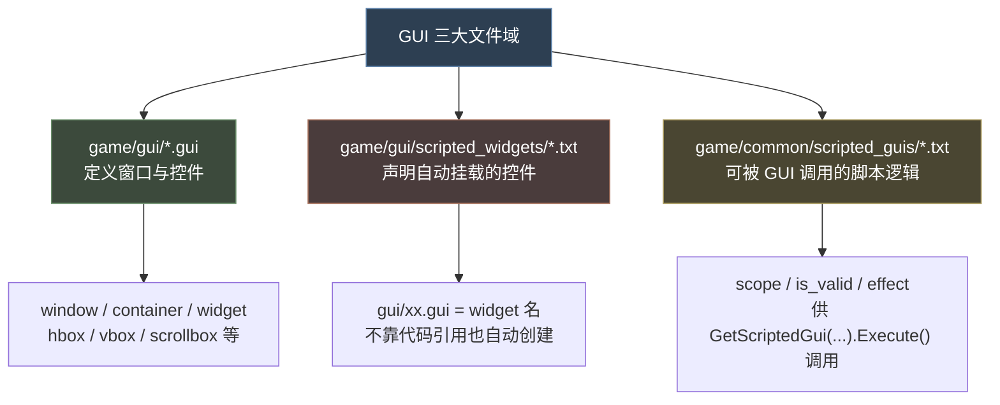

# 17 GUI 界面设计与 scripted_guis

> 本文基于 `Crusader Kings III\game\gui`、`game\gui\scripted_widgets`、`game\common\scripted_guis` 三个目录的原版脚本实证整理。
> 文中语法示例均取自官方原版 `.gui` 文件，并辅以本 Mod 的 `gui/ftr_court_struggle_window.gui` 等真实实践对照。

---

## 1. GUI 三大文件域与心智模型

CK3 的界面层由**三个互相配合的目录**构成。理解"谁定义界面、谁挂载界面、谁提供数据/逻辑"，是掌握 GUI 的第一步。



| 目录 | 角色 | 加载时机 | 内容示例 |
|---|---|---|---|
| `game/gui/*.gui` | **定义界面外观与布局** | 启动建库 | `window = {}`、`types X {}`、`@宏` |
| `game/gui/scripted_widgets/*.txt` | **声明"未被代码引用的控件"也要挂到根** | 启动建库 | `gui/xx.gui = widget_name` |
| `game/common/scripted_guis/*.txt` | **界面侧可执行的脚本逻辑**（数据同步、校验） | 启动建库 | `scope` + `is_valid` + `effect` |

> **一句话区分**：`.gui` 文件是"HTML/CSS"，`scripted_widgets` 是"把脚本写好的标签挂上页面"，`scripted_guis` 是"页面按钮触发时跑的 JS"。

---

## 2. `.gui` 文件语法

### 2.1 顶层结构：四类

一个 `.gui` 文件顶层可以有四类东西，**任意数量、顺序无关**：

| 顶层结构 | 含义 | 例子 |
|---|---|---|
| `window = {}` | 一个**独立窗口**（可移动/可关） | `window = { name = "decisions_view" }` |
| `container = {}` | 一个**容器**（不自动弹窗，供 HUD 等嵌入） | `container = { name = "in_front_topbar" }` |
| `widget = {}` | 一个**控件/子控件**（可被引用、可嵌入） | `widget = { name = "ftr_hud_court_struggle" }` |
| `types X {}` | **命名空间内定义可复用类型** | `types Lists { type ftr_court_small_icon = vbox {} }` |
| `@宏名 = 值` | **文件级常量**（可被 `.gui` 里 `@宏名` 引用） | `@scrollbar_outside_tweak = 15` |

**顶层 window 的最小骨架**（来自原版 `window_decisions.gui`）：

```paradox
window = {
	name = "decisions_view"
	parentanchor = top|right
	layer = windows_layer
	movable = no
	using = Window_Size_MainTab

	state = { name = _show  using = Animation_FadeIn_Quick }
	state = { name = _hide  using = Animation_FadeOut_Quick }

	margin_widget = {
		size = { 100% 100% }
		widget = {
			size = { 100% 100% }
			vbox = { using = Window_Margins ... }
		}
	}
}
```

### 2.2 window 通用属性表

| 属性 | 作用 | 原版例子 |
|---|---|---|
| `name` | 窗口唯一标识 | `name = "title_view_window"` |
| `parentanchor` | 相对父级哪个点定位 | `top\|right`、`hcenter\|top`、`center` |
| `position = { x y }` | 相对锚点的偏移 | `position = { 420 70 }` |
| `size = { w h }` | 尺寸，支持 `100%` | `size = { 650 100% }` |
| `minimumsize` / `maximumsize` | 尺寸上下限 | `minimumsize = { 508 420 }` |
| `layer` | 渲染层级 | `windows_layer` / `middle` / `top` / `hud_layer` |
| `movable` | 是否可拖动 | `movable = no` |
| `allow_outside` | 允许绘制在窗口外 | `allow_outside = yes` |
| `alwaystransparent` | 始终不拦截鼠标 | `alwaystransparent = yes` |
| `visible` | 可见性（布尔表达式） | `visible = "[GetVariableSystem.Exists( 'xx' )]"` |
| `using = 模板` | 复用已定义的窗口/控件模板 | `using = Window_Background` |
| `state = {}` | 状态机块（见 §2.5） | `state = { name = _show }` |
| `widgetid` | 供引擎代码定位的字符串 ID | `widgetid = "character_interaction_menu_window"` |

> `size` 与 `position` 中可以使用 **百分比**（相对父级）与 **负数**（反向/越界）。

### 2.3 三类嵌套控件（widget 类型）

`.gui` 的嵌套控件按职责分三类：**布局类、显示类、交互类**。它们都用 `xxx = {}` 声明，控件名即类型名。

#### 布局类（容器）

| 类型 | 作用 | 关键子属性 |
|---|---|---|
| `hbox` | 水平排列子项 | `spacing`、`layoutpolicy_horizontal` |
| `vbox` | 垂直排列子项 | `spacing`、`layoutpolicy_vertical` |
| `gridbox` | 自动网格 | `addcolumn`、`addrow`、`datamodel`、`item` |
| `fixedgridbox` | 固定单元格网格（列表） | `addcolumn`、`addrow`、`datamodel_wrap`、`flipdirection`、`item` |
| `scrollbox` | 可滚动区域 | `layoutpolicy_*`、`scrollbox_content`/`scrollbox_expand` 子块 |
| `flowcontainer` | 自动换行流式容器 | `direction`、`ignoreinvisible` |
| `expand = {}` | 占满剩余空间的弹性占位 | 无需参数 |
| `margin_widget` | 带边距的单子容器 | `margin`、`scissor` |

**hbox / vbox 典型用法**（项目 `ftr_court_struggle_window.gui`）：

```paradox
hbox = {
	layoutpolicy_horizontal = expanding
	spacing = 24
	widget = {
		layoutpolicy_horizontal = expanding
		layoutanchor = topleft
		vbox = {
			layoutpolicy_horizontal = fixed
			portrait_head = { size = { 96 96 } }
		}
	}
	text_single = { text = "FTR_COURT_SWING_LOYAL" }
	expand = {}
	text_single = { text = "FTR_COURT_SWING_DIARCH" }
}
```

#### 显示类

| 类型 | 作用 | 关键子属性 |
|---|---|---|
| `text_single` | 单行文本 | `text`、`fontsize`、`default_format`、`align`、`max_width` |
| `text_multi` | 多行文本 | 同上 + `autoresize` |
| `text_label_center` | 居中标签 | `text` |
| `icon` | 图标（单帧/帧动画） | `texture`、`size`、`framesize`、`frame` |
| `highlight_icon` | 高亮图标 | `texture`、`size` |
| `proportional_icon` | 按比例裁剪的图 | `texture`、`size = { % % }` |
| `portrait_head` | 角色大头像 | `datacontext`、`size`、`tooltip_enabled` |
| `portrait_head_small` | 角色小头像 | `datacontext`、`size` |
| `coa_*` | 纹章（王朝/头衔等） | `datacontext`、`size` |
| `progressbar` | 进度条 | `value`、`direction`、`size`、`alwaystransparent` |
| `background` | 背景纹理 | `texture`、`spriteType`、`spriteborder`、`alpha` |

#### 交互类（按钮）

| 类型 | 作用 | 关键子属性 |
|---|---|---|
| `button_standard` / `button_primary` | 标准/主按钮 | `onclick`、`enabled`、`tooltip`、`down` |
| `button_normal` | 普通按钮 | `onclick`、`shortcut` |
| `button_tab` | 选项卡按钮 | `down`、`alwaystransparent`、`shortcut`、`blockoverride` |
| `button_expandable_toggle_field` | 可折叠标题栏 | `blockoverride "text"` |
| `button_standard_clean` | 干净按钮（无边框） | `onclick`、`size` |

**按钮完整示例**（原版 `window_message_popup.gui` + 项目 HUD）：

```paradox
button_tab = {
	name = "open_decisions_tab"
	shortcut = "tab_1"
	down = "[GetVariableSystem.Exists( 'decision' )]"
	onclick = "[GetVariableSystem.Set( 'decision', 'true' )]"
	onclick = "[GetVariableSystem.Clear( 'great_projects' )]"
	alwaystransparent = "[GetVariableSystem.Exists( 'decision' )]"
	blockoverride "tab_label" { text = "DECISIONS_VIEW_DECISIONS" }
}
```

### 2.4 通用控件属性（几乎每个控件都有）

| 属性 | 作用 | 示例 |
|---|---|---|
| `name` | 控件 ID（供 blockoverride / 引擎定位） | `name = "title"` |
| `size = { w h }` | 尺寸 | `size = { 100% 100% }` |
| `position = { x y }` | 相对父锚点偏移 | `position = { 0 -5 }` |
| `parentanchor` | 相对父级锚点 | `parentanchor = right\|vcenter` |
| `layoutanchor` | 布局锚点 | `layoutanchor = topleft` |
| `layoutpolicy_horizontal / vertical` | 布局策略 | `expanding` / `fixed` / `growing` |
| `visible` | 可见性表达式 | `visible = "[Character.IsValid]"` |
| `alpha` | 透明度 0-1 | `alpha = 0.6` |
| `datacontext` | 设置数据上下文（供子控件取值） | `datacontext = "[GetPlayer]"` |
| `datamodel` | 绑定列表数据（配合 `item`） | `datamodel = "[DecisionsView.GetDecisionGroupItems]"` |
| `tooltip` | 悬停提示文本/表达式 | `tooltip = "ftr_court_ui_title"` |
| `tooltip_enabled` | 是否启用提示 | `tooltip_enabled = "[Character.IsValid]"` |
| `enabled` | 是否可交互 | `enabled = "[CharacterInteractionConfirmationWindow.CanSend]"` |
| `margin = { l t }` | 外边距（**仅 2 值**：水平 l、垂直 t，左右/上下对称；**不支持 4 值** `{ l t r b }`，4 值会报 `Cannot read this many items into array: margin`） | `margin = { 10 26 }` |
| `margin_left` / `margin_top` / `margin_right` / `margin_bottom` | 单边距（需要不对称边距时用） | `margin_top = 30` |
| `using = 模板` | 复用模板 | `using = Animation_ShowHide_Quick` |
| `block = "名" {}` | 定义可被覆盖的命名块 | `block "title_visible" { visible = no }` |
| `state = {}` | 子控件状态机 | `state = { name = _show }` |
| `oncreate` / `onclick` / `on_start` | 事件回调（§2.6） | `oncreate = "[BindFoldOutContext]"` |

> **`using` 的两种含义**：① 在 window/container 上复用整套模板（背景+装饰+边距，如 `Window_Background`）；② 在任何控件上复用动画/字体/提示模板（如 `Animation_FadeIn_Quick`、`character_tooltip`）。

### 2.5 状态机 `state`

`state = {}` 是 GUI 的**显隐/动画状态机**。每个窗口/控件可定义多个命名状态，最常见的是 `_show` 与 `_hide`。

```paradox
state = {
	name = _show
	using = Animation_FadeIn_Quick
	using = Sound_WindowShow_Standard
}

state = {
	name = _hide
	using = Animation_FadeOut_Quick
	using = Sound_WindowHide_Standard
}
```

| 状态名 | 含义 |
|---|---|
| `_show` | 窗口/控件显示时 |
| `_hide` | 窗口/控件隐藏时 |
| `_on_create` / `_on_destroy` | 创建/销毁时 |
| `_mouse_hierarchy_enter` / `_mouse_hierarchy_leave` | 鼠标进入/离开层级时 |
| 自定义名 | 可通过 `PdxGuiTriggerAnimation` 等触发 |

**状态块内的常用子键**：

| 子键 | 作用 | 示例 |
|---|---|---|
| `on_start` | 进入状态时执行的命令 | `on_start = "[GetVariableSystem.Clear( 'xx' )]"` |
| `using = Animation_*` | 复用动画模板 | `using = Animation_FadeIn_Quick` |
| `alpha` | 透明度 | `alpha = 1` |
| `duration` | 时长（秒） | `duration = 0.1` |
| `position` / `position_x` | 位移 | `position_x = -60` |
| `trigger_on_create = yes` | 创建时立即触发 | `trigger_on_create = yes` |

> **`on_create` vs `oncreate`**：`on_create` 是窗口状态名（state 的 name）；`oncreate` 是控件上的事件回调属性。二者不同。

### 2.6 事件回调

控件上可挂这些"命令回调"，值都是**方括号表达式**：

| 回调 | 触发时机 |
|---|---|
| `onclick` | 点击 |
| `oncreate` | 控件创建时 |
| `onclose` | 关闭时 |
| `on_start`（state 内） | 进入某状态时 |
| `on_mouse_enter` / `on_mouse_hover` | 鼠标悬停 |
| `on_mouse_leave` | 鼠标离开 |

```paradox
onclick = "[GetScriptedGui('ftr_court_sync_ui_data').Execute( GuiScope.SetRoot( GetPlayer.MakeScope ).End )]"
onclick = "[GetVariableSystem.Toggle( 'ftr_court_struggle_window_open' )]"
onclick = "[DecisionsView.Close]"
```

> 一个控件可以有**多条** `onclick`，自上而下依次执行（项目 HUD 按钮就链式挂了 4 条）。

---

## 3. 数据绑定：datacontext 与 datamodel

这是 GUI 与游戏数据交互的核心。**所有取值表达式都要用方括号 `[...]` 包起来**。

### 3.1 `datacontext`：设置"当前数据对象"

`datacontext` 把当前控件及其所有子控件的取值上下文切换到某个对象。子控件里可以直接用该对象的属性/方法。

```paradox
widget = {
	datacontext = "[GetPlayer.MakeScope.Var('ftr_court_ui_monarch_char').Char]"
	vbox = {
		portrait_head = { size = { 96 96 } }
	}
}
```

### 3.2 从玩家域读变量 / 变量列表（Mod 常用）

CK3 的 GUI 无法直接访问 story/effect 里的变量，因此本 Mod 的做法是：**用 scripted_gui 把数据镜像到玩家域变量，GUI 再去读**（详见 §7.3）。

```paradox
# 读数值变量（GetValue）
visible = "[NotZero_CFixedPoint( GetPlayer.MakeScope.Var('ftr_court_ui_has_diarch').GetValue )]"
# 进度条取值
value = "[GetPlayer.MakeScope.Var('ftr_court_ui_swing').GetValue]"
# 读角色变量（.Char 后缀把 scope 转成可显示对象）
datacontext = "[GetPlayer.MakeScope.Var('ftr_court_ui_monarch_char').Char]"
# 读变量列表（.GetList）
datamodel = "[GetPlayer.MakeScope.GetList('ftr_court_ui_spouses')]"
```

| 取值后缀 | 含义 |
|---|---|
| `.GetValue` | 数值（CFixedPoint） |
| `.Char` / `.Title` / `.Artifact` | 作用域变量转为对应类型对象 |
| `.GetList( 'name' )` | 读取角色上的变量列表 |

> **原版对照**（`window_situation_list.gui`）：`[Story.MakeScope.GetList( StoryCycleVariableVisualization.GetVariableName )]`、`[Story.MakeScope.Var( StoryCycleCounterVisualization.GetVariableName ).GetValue]` —— 原版也是"MakeScope 某个对象 + Var/GetList"的模式。

### 3.3 `datamodel`：绑定列表 + `item`

`datamodel` 绑定一个**列表**，配合 `item` 定义"每一行的模板"。列表项会在运行时重复渲染。

```paradox
fixedgridbox = {
	margin = { 10 0 }
	addcolumn = 90
	addrow = 100
	datamodel_wrap = 4          # 每行几个
	flipdirection = yes
	setitemsizefromcell = yes
	datamodel = "[GetPlayer.MakeScope.GetList('ftr_court_ui_spouses')]"
	layoutpolicy_horizontal = expanding
	item = {
		ftr_court_small_icon = {   # 复用自定义类型
			datacontext = "[CharacterListItem.GetCharacter]"
		}
	}
}
```

**列表项上下文的转换**：`datamodel` 里每项默认是 `CharacterListItem`/`DecisionGroupItem` 等**列表项对象**，需要用 `[CharacterListItem.GetCharacter]` 等取回真正的数据对象，再交给子控件做 `datacontext`。

> 绑定列表后，控件通常还要配合 `visible = "[Not( IsDataModelEmpty( ... ) )]"` 判断列表是否为空（原版 `window_decisions.gui` 大量使用 `IsDataModelEmpty`）。

---

## 4. `types`：定义可复用类型

`types 命名空间 {}` 用来把一段重复的控件结构封装成"自定义类型"，用 `type 名字 = 基础类型 {}` 定义，之后可用 `名字 = {}` 直接实例化。

```paradox
types Lists
{
	type ftr_court_small_icon = vbox {
		datacontext = "[Scope.GetCharacter]"
		layoutpolicy_horizontal = expanding
		portrait_head_small = {
			size = { 64 64 }
			tooltip_enabled = "[Character.IsValid]"
			using = character_tooltip
		}
	}
}
```

实例化：

```paradox
item = {
	ftr_court_small_icon = {
		datacontext = "[CharacterListItem.GetCharacter]"
	}
}
```

| 关键点 | 说明 |
|---|---|
| 命名空间 | `types X {}` 里的 X 是命名空间，用于组织（如 `CharacterInteraction`、`Decisions`） |
| 基础类型 | `type xxx = vbox / hbox / widget / button_standard / icon ...` |
| 模板 override | 自定义类型内可用 `block "名" {}` 定义命名块，实例化时用 `blockoverride` 覆盖（§5） |

---

## 5. `block` / `blockoverride`：模板覆盖机制

GUI 的复用核心是"**预置命名块 + 实例化时覆盖**"。被复用的模板里用 `block "名" {}` 标记可覆盖段，引用方用 `blockoverride "名" {}` 重写。

**模板内定义块**（原版 `button_decision_entry`）：

```paradox
type button_decision_entry = button_standard {
	block "button_size" { size = { 300 45 } }
	block "default_format" { default_format = "#clickable" }
}
```

**实例化时覆盖**：

```paradox
button_decision_entry_cached = {
	blockoverride "button_size" {
		minimumsize = "[Select_CVector2f( ... )]"
	}
	blockoverride "default_format" {
		default_format = "#low"
	}
}
```

> **本 Mod 实践**：HUD 按钮复用原版 `widget_hud_main_tab`，用 `blockoverride "maintab_button" { ... }` 替换成自定义图标纹理与点击逻辑；窗口复用 `widget_header_with_picture`，用 `blockoverride "header_text"` 改标题、`blockoverride "button_close"` 改关闭逻辑。

**为什么能覆盖原版模板**：只要不修改原版 `.gui` 文件，直接在自己的 `widget = {}` 里 `using = 原版模板` + `blockoverride` 即可定制，属于**非侵入式扩展**。

---

## 6. GUI 表达式（方括号取值）速查

方括号 `[...]` 里的内容会在运行时求值。常见几类：

### 6.1 全局函数

| 表达式 | 作用 |
|---|---|
| `GetPlayer` | 玩家角色 |
| `GetPlayer.MakeScope` | 玩家角色的 scope（用于 `.Var()`/`.GetList()`） |
| `GetVariableSystem.Set( 'key', 'val' )` | 设置界面变量 |
| `GetVariableSystem.Clear( 'key' )` | 清除界面变量 |
| `GetVariableSystem.Exists( 'key' )` | 界面变量是否存在 |
| `GetVariableSystem.Toggle( 'key' )` | 切换界面变量存在性 |
| `GetScriptedGui('name').Execute( GuiScope.xxx.End )` | 执行一个 scripted_gui |
| `IsDataModelEmpty( ... )` | 数据模型（列表）是否为空 |
| `IsObserver` | 是否观战模式 |
| `IsDefaultGUIMode` | 是否默认 UI 模式 |
| `InDebugMode` | 是否调试模式 |

### 6.2 类型比较 / 数值函数

| 表达式 | 作用 |
|---|---|
| `NotZero_CFixedPoint( x )` | x 不为 0（CFixedPoint 专用） |
| `GreaterThan_CFixedPoint( a, b )` | a > b |
| `LessThanOrEqualTo_CFixedPoint( a, b )` | a <= b |
| `Select_float( 条件, 'a', 'b' )` | 条件真取 a 假取 b（float） |
| `Select_int32( 条件, 'a', 'b' )` | 同上（int） |
| `Select_CVector2f( 条件, 'a', 'b' )` | 同上（二维向量） |
| `And(...)` / `Or(...)` / `Not(...)` | 逻辑运算 |
| `ObjectsEqual( a, b )` | 两个对象是否相等 |

> 注意 CK3 GUI 用 `NotZero_CFixedPoint`/`GreaterThan_CFixedPoint` 这类**带类型后缀**的函数比较数值变量；用 `And/Or/Not` 组合布尔。

### 6.3 字符串管道符（格式化）

在取文本表达式的末尾可加 `|` + 格式符：

```paradox
text = "[Character.GetNameNoTooltip|U]"   # U = 首字母大写
text = "[TitleViewWindow.GetTitle.GetNameNoTooltip|U]"
```

### 6.4 文本内嵌格式（default_format / 文案里）

GUI 文本支持 `#` 开头的格式标记与 `#!` 复位：

```paradox
default_format = "#clickable"                    # 可点击高亮
default_format = "#high" / "#low"                # 高/低亮
default_format = "#Bold;high"                    # 加粗 + 高亮
default_format = "#glow_color:{0.1,0.1,0.1,1.0}" # 发光颜色
```

> 这些格式标记同样可用在本地化文案里（`#clickable 文本 #!`）。

---

## 7. scripted_guis（common/scripted_guis）

### 7.1 定义结构

`scripted_guis/*.txt` 定义可被 GUI 调用的"逻辑对象"。核心字段：

```paradox
ftr_court_sync_ui_data = {
	scope = character
	is_valid = { ... }          # 可选：校验
	is_shown = { always = yes } # 控制是否可用
	effect = { ... }            # 执行的动作
}
```

| 字段 | 作用 | 示例 |
|---|---|---|
| `scope` | 执行时所在作用域 | `scope = character` |
| `is_valid` | 有效性条件 | `is_valid = { is_capable_adult = yes }` |
| `is_shown` | 是否显示/可执行 | `is_shown = { always = yes }` |
| `saved_scopes` | 额外保存的具名域 | `saved_scopes = { host }` |
| `effect` | 实际执行的脚本效果 | `effect = { set_variable = ... }` |

### 7.2 从 GUI 调用 scripted_gui

```paradox
onclick = "[GetScriptedGui('ftr_court_sync_ui_data').Execute( GuiScope.SetRoot( GetPlayer.MakeScope ).End )]"
```

- `GetScriptedGui('名字')` 取对象
- `.Execute( GuiScope.xxx.End )` 构造一个 GUI 作用域（`GuiScope.SetRoot(玩家 scope).End`）并执行其 `effect`

### 7.3 本 Mod 的数据同步范式（重要）

**痛点**：GUI 的 `datacontext` 表达式无法直接访问 story / effect 里产生的变量或复杂计算结果。原版靠引擎把数据塞给 `GetXxx` 数据函数，但 Mod 自己造的 story/变量拿不到。

**本 Mod 解法**（`common/scripted_guis/ftr_scripted_guis.txt` 的 `ftr_court_sync_ui_data`）：

```
HUD 点击 / 窗口打开
   │  onclick = [GetScriptedGui('ftr_court_sync_ui_data').Execute(...)]
   ▼
scripted_gui.effect：
   把 story 的竞争者/追随者/数值
   用 set_variable / add_to_variable_list
   镜像到「玩家角色」的 ftr_court_ui_* 变量/列表
   ▼
GUI datacontext：
   [GetPlayer.MakeScope.Var('ftr_court_ui_swing').GetValue]
   [GetPlayer.MakeScope.GetList('ftr_court_ui_spouses')]
```

```paradox
ftr_court_sync_ui_data = {
	scope = character
	effect = {
		set_variable = { name = ftr_court_ui_active  value = 0 }
		set_variable = { name = ftr_court_ui_swing  value = 0 }
		clear_variable_list = ftr_court_ui_spouses
		clear_variable_list = ftr_court_ui_ministers
		# ... 根据数据源（自己的朝堂 / 宗主 / 雇主）填充 ...
		ftr_court_sync_ui_from_story_effect = yes
		ftr_court_sync_courtiers_effect = yes
	}
}
```

> **原则**：GUI 只读"玩家角色域变量"，所有复杂计算放到 scripted_gui 里做，再镜像过去。这样 GUI 层保持"纯展示"，逻辑集中在脚本层，易维护、易调试。

---

## 8. scripted_widgets（挂载 HUD 按钮等）

`game/gui/scripted_widgets/*.txt` 的用途：**让一个写在 `.gui` 文件里、但没有任何引擎代码引用的控件，在启动时自动挂到根界面上**。

> ⚠ **停用的功能要删文件，不能只注释挂载行**：`.gui` 文件即使没有挂载，仍会被引擎解析；
> 若其内部引用已不存在的交互 / ScriptValue / 文本键，会持续刷 `Unlocalized text` 与 ScriptValue 报错。
> 本 Mod 曾保留停用的"政治博弈"窗口（`ftr_political_game_window.gui` / `ftr_hud_political_game.gui`，
> 其交互 `ftr_change_law_*` 已删除），导致整组 GUI 加载错误 —— 已整体删除文件并清掉挂载注释。
> 通用原则：废弃子系统应**删除文件**，而不是把 scripted_widgets 行注释掉。

### 8.1 本 Mod 用法（`gui/scripted_widgets/ftr_scripted_widgets.txt`）

```paradox
#gui/ftr_hud_political_game.gui = ftr_hud_political_game
#gui/ftr_political_game_window.gui = ftr_political_game_window

# 朝堂局势 HUD 单元（独立小按钮，挂载于 right|vcenter，避免与原版 HUD 冲突）
gui/ftr_hud_court_struggle.gui = ftr_hud_court_struggle
# 朝堂局势窗口（点击 HUD 单元开关）
gui/ftr_court_struggle_window.gui = ftr_court_struggle_window
```

| 语法 | 含义 |
|---|---|
| `gui/文件名.gui = 控件名` | 把该 `.gui` 文件里 `name = "控件名"` 的顶层 `widget`/`window` 自动挂到根 |

> 官方 `.info` 原文（`_scripted_widgets.info`）：文件里写"文件路径 + 控件名"，用于**自动创建未被代码正式引用的控件**；同一个控件可以挂多次（会出现在相同位置）。

### 8.2 为什么要用 scripted_widgets

原生 `.gui` 里的 `window`/`widget` 必须被引擎代码或某个入口**引用**才会显示。Mod 没有引擎代码，所以要靠 scripted_widgets 这个"注册表"把我们的窗口/HUD 按钮"接上线"，让游戏启动时就创建它们。

### 8.3 一个 HUD 小按钮的完整实例（`gui/ftr_hud_court_struggle.gui`）

```paradox
widget = {
	name = "ftr_hud_court_struggle"
	size = { 50 50 }
	allow_outside = yes
	parentanchor = vcenter|right
	position = { -36 80 }            # 贴住右缘、避开原版按钮
	layer = hud_layer
	alwaystransparent = yes
	visible = "[And(Not(IsObserver),IsDefaultGUIMode)]"
	using = Animation_ShowHide_Quick
	widget = {
		visible = "[Not(IsRightWindowOpen)]"
		size = { 100% 100% }
		state = { name = _show  alpha = 1  duration = 0.1  using = Animation_Curve_Default }
		state = { name = _hide  duration = 0.6  alpha = 0  using = Animation_Curve_Default }
		widget_hud_main_tab = {
			name = "ftr_court_struggle_hud_btn"
			tooltip = "ftr_court_ui_title"
			blockoverride "maintab_button" {
				texture = "gfx/interface/icons/icon_ftr_court_struggle.dds"
				onclick = "[GetScriptedGui('ftr_court_sync_ui_data').Execute( GuiScope.SetRoot( GetPlayer.MakeScope ).End )]"
				onclick = "[GetVariableSystem.Toggle( 'ftr_court_struggle_window_open' )]"
				onclick = "[GetVariableSystem.Clear('ftr_show_my_realm_tab_toggle')]"
				onclick = "[GetVariableSystem.Clear('ftr_show_liege_realm_tab_toggle')]"
			}
			state = { name = _mouse_hierarchy_enter  on_start = "[PdxGuiInterruptThenTriggerAllAnimations('hud_tab_glow_institutions_leave','hud_tab_glow_institutions_enter')]" }
			state = { name = _mouse_hierarchy_leave  on_start = "[PdxGuiInterruptThenTriggerAllAnimations('hud_tab_glow_institutions_enter','hud_tab_glow_institutions_leave')]" }
		}
	}
}
```

**要点**：
- 复用原版 HUD 模板 `widget_hud_main_tab`，通过 `blockoverride "maintab_button"` 定制图标和点击行为 —— 非侵入式。
- 点击逻辑："先同步数据，再开关窗口"（链式 onclick）。
- 窗口显隐用 **GetVariableSystem 变量** `ftr_court_struggle_window_open` 控制（见 §9）。

---

## 9. 常见业务流程（案例）

### 9.1 流程 A：HUD 按钮 → 打开自研窗口

```
玩家点击 HUD 按钮
  ├─ onclick① GetScriptedGui('ftr_court_sync_ui_data').Execute(...)   # 同步数据到玩家域
  └─ onclick② GetVariableSystem.Toggle('ftr_court_struggle_window_open')  # 切换开关
          ▼
窗口 visible = "[GetVariableSystem.Exists('ftr_court_struggle_window_open')]"
          ▼
窗口 on_create（首次）→ 同步数据 → 渲染变量/列表 → 关闭按钮 Clear 开关
```

窗口端 `visible` 属性（`gui/ftr_court_struggle_window.gui`）：

```paradox
window = {
	name = "ftr_court_struggle_window"
	parentanchor = center
	size = { 760 900 }
	layer = windows_layer
	visible = "[GetVariableSystem.Exists( 'ftr_court_struggle_window_open' )]"
	using = Window_Background
	using = Window_Decoration
	# ... 内容 ...
	blockoverride "button_close" {
		onclick = "[GetVariableSystem.Clear('ftr_court_struggle_window_open')]"
	}
}
```

### 9.2 流程 B：列表数据展示

```
scripted_gui.effect
  └─ clear_variable_list + every_in_list { add_to_variable_list }   # 填玩家域 ftr_court_ui_spouses
          ▼
GUI fixedgridbox
  ├─ datamodel = "[GetPlayer.MakeScope.GetList('ftr_court_ui_spouses')]"
  ├─ addcolumn/addrow/datamodel_wrap   # 网格布局
  └─ item = { 自定义类型 { datacontext = "[CharacterListItem.GetCharacter]" } }
```

### 9.3 流程 C：条件显隐 + 进度条

```paradox
# 有摄政才显示
widget = {
	visible = "[NotZero_CFixedPoint( GetPlayer.MakeScope.Var('ftr_court_ui_has_diarch').GetValue )]"
	progressbar = {
		size = { 600 16 }
		value = "[GetPlayer.MakeScope.Var('ftr_court_ui_swing').GetValue]"
	}
}
```

### 9.4 流程 D：多级滚动列表窗口

原版 `window_decisions.gui` 展示了完整模式：窗口 → `margin_widget` → `vbox` → `scrollbox` → `scrollbox_content` 里的 `datamodel` 列表。本项目窗口也是"scrollbox 包多个 fixedgridbox 区块"（配偶 / 权臣 / 继任者 / 追随者）。

---

## 10. GUI 开发 SOP（结合本 Mod 约定）

1. **文件放哪**：窗口/HUD 放 `gui/ftr_*.gui`；要自动挂载的，在 `gui/scripted_widgets/ftr_scripted_widgets.txt` 注册 `gui/xx.gui = 控件名`。
2. **编码/缩进**：`.gui` 与 `.txt` 一样 **UTF-8 with BOM**、**Tab 缩进**。
3. **命名**：窗口/控件/HUD 一律 `ftr_` 前缀（`ftr_court_struggle_window`）；自定义 `types` 类型也加前缀（`ftr_court_small_icon`）。
4. **数据源**：GUI 不直接算逻辑，先写 `common/scripted_guis/ftr_scripted_guis.txt` 的 scripted_gui 把数据镜像到玩家域变量/列表，再在 GUI 里 `GetPlayer.MakeScope.Var/GetList` 读取。
5. **窗口开关**：用 `GetVariableSystem.Set/Clear/Toggle/Exists` 控制 `visible`。
6. **复用原版模板**：`using = 原版模板` + `blockoverride "块名"` 定制，不覆盖原版 `.gui` 文件。
7. **本地化**：`text = "本地化键"`，新增可见文本同步双语 + `<FTR>` 前缀。
8. **图标**：自定义图标放 `gfx/interface/icons/`，用 `texture = "gfx/interface/icons/icon_ftr_*.dds"` 引用。

---

## 11. 常见坑与排查

| 坑 | 说明 |
|---|---|
| GUI 表达式**忘加方括号** | 所有取值必须 `[...]`，否则被当字符串字面量 |
| 变量读不到 | GUI 无法直接访问 story 变量 —— 必须经 scripted_gui 镜像到玩家域 |
| 变量列表取不到 | 用 `GetPlayer.MakeScope.GetList('名字')`；列表项需 `[CharacterListItem.GetCharacter]` 转回对象 |
| 数值变量比较 | 用 `NotZero_CFixedPoint` / `GreaterThan_CFixedPoint` 等带类型后缀函数，别用裸比较 |
| 窗口不显示 | 未在 `scripted_widgets` 注册；或 `visible` 条件里的变量从未 Set |
| 覆盖原版模板失效 | `block` 块名必须与模板里完全一致；用 `blockoverride` 而非重写整个模板 |
| 界面变量名冲突 | 用 `ftr_` 前缀，避免与原版/其他 Mod 撞 `GetVariableSystem` 键 |
| 中文乱码 | `.gui` 文件也必须 UTF-8 with BOM |
| `item` 里 datacontext 拿不到数据 | `datamodel` 列表项的默认上下文是列表项对象（如 `CharacterListItem`），要先 `.GetCharacter` 再设给子控件 |
| 普通 `widget = { }` 顶层写 `margin_top` / `margin_bottom` | 报 `Property 'margin_top' not handled` —— 普通 widget 不是布局容器，单边 margin 不生效 | 用双值 `margin = { 水平 垂直 }`（如 `margin = { 0 12 }`），或改放 hbox/vbox 子项上 |
| `ScriptValue('x')` 报未定义 | ScriptValue 要求名字是**已定义的 script value**；读普通角色变量请用 `Var('...').GetValue` | 在 `common/script_values/` 定义同名值，或改用 Var |
| 停用功能后仍报 GUI 文本/数据错误 | 只注释了 scripted_widgets 挂载，`.gui` 文件仍被解析 | **删除废弃 GUI 文件**并同步清理挂载注释与本地化引用 |

---

## 12. 术语对照

| 英文 | 中文 | 说明 |
|---|---|---|
| Widget | 控件 | GUI 里任意可视元素（按钮/文本/容器…） |
| Window | 窗口 | 独立弹窗（可移动/关闭） |
| Container | 容器 | 嵌入用容器，不自动弹窗 |
| State | 状态 | 窗口/控件的显隐动画状态 |
| Datacontext | 数据上下文 | 子控件取值的对象 |
| Datamodel | 数据模型 | 绑定的列表数据 |
| Layout policy | 布局策略 | expanding/fixed/growing |
| Block / Blockoverride | 命名块 / 覆盖块 | 模板复用与定制 |
| Scripted Widget | 脚本控件 | 靠 scripted_widgets 注册自动挂载的控件 |
| Scripted GUI | 脚本 GUI | 被 GUI 调用的脚本逻辑对象 |
| VariableSystem | 界面变量系统 | 控制显隐/开关的键值系统 |
