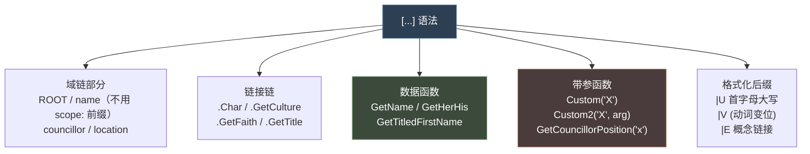
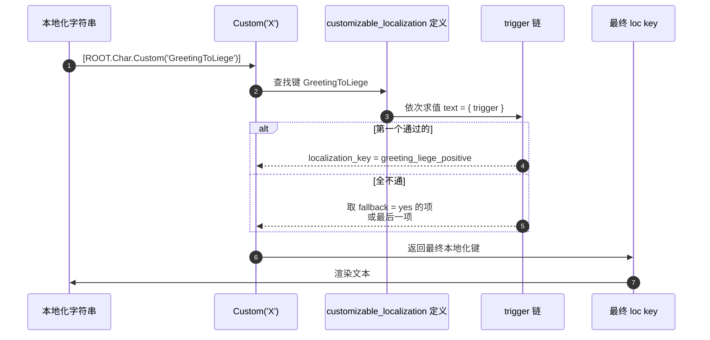
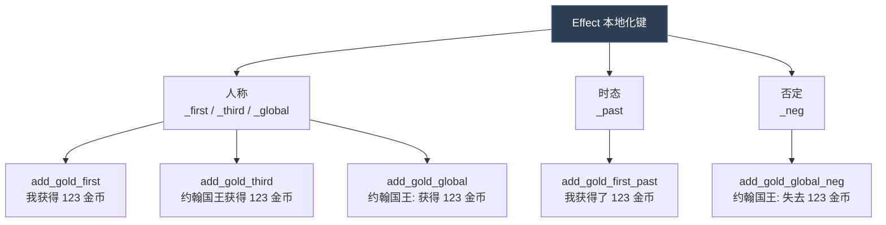
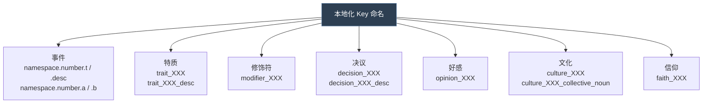

# 20 本地化与 yml

> `localization/` 是独立于脚本之外的文本层：`.yml` 格式、方括号动态取值、customizable / effect / trigger localization。

## 本篇导读

- **格式**：`l_english:` 起头、键值表、方括号 `[Scope.Function]` 动态取值。
- **三类可复用文本**：`customizable_localization` / `effect_localization` / `trigger_localization`。
- **约定**：`english/` 与 `simp_chinese/` 目录结构严格一一对应、键名一致；`.yml` 必须带 UTF-8 BOM，缩进用 1 个空格。

## 文档关联

- **前置**：[01 词法、数据类型与值系统](01-词法、数据类型与值系统.md)
- **配套**：[07 history 历史脚本](07-history历史脚本.md)

---
## 1. 目录结构

```
game/localization/
├── languages.yml                 # 语言总表
├── english/            (~1174 个 .yml)
├── simp_chinese/       (~1187 个 .yml)
├── french/  german/  japanese/  korean/  polish/  russian/  spanish/
├── jomini/script_system/         # 引擎级本地化
```

`localization/english/` 的子目录（用于分类组织）：

```
accolades/  activities/  artifacts/  bookmark/  contracts/  credits/
culture/    custom_localization/  diarchies/  dlc/  domiciles/
dynasties/  dynasty_legacies/  effects/  enum/  event_localization/
great_projects/  gui/  hold_court_events/  hostages/  interactions/
inventory/  ledger/  lifestyles/  load_tips/  map/  modifiers/
names/  no_translation/  opinions/  portraits/  religion/
situations/  struggles/  travel/  triggers/  tutorial/
```

> 其中 `event_localization/`（284 个文件）和 `custom_localization/`（56 个）是最大的两块。

---

## 2. 文件格式

### 2.1 语言头

每个 `.yml` 文件**第一列**写语言头：

| 语言 | 文件头 |
|---|---|
| 英语 | `l_english:` |
| 简体中文 | `l_simp_chinese:` |
| 法语 | `l_french:` |
| 德语 | `l_german:` |
| 波兰语 | `l_polish:` |
| 西班牙语 | `l_spanish:` |
| 俄语 | `l_russian:` |
| 韩语 | `l_korean:` |
| 日语 | `l_japanese:` |

### 2.2 编码：**UTF-8 with BOM**

实测（`localization/english/editor_l_english.yml` 44 字节 vs 可见文本 41 字节，差 3 字节 = `EF BB BF`）。

> **这是本地化最常见的失效原因**：不带 BOM 会导致中文全部乱码或整份本地化不加载。

### 2.3 缩进

- 语言头**顶格**写
- 之后所有条目**至少 1 个空格缩进**（YAML 语义上是 `l_english:` 的子项）
- 惯例用 **1 个空格**
- 缩进量不敏感，甚至完全不缩进引擎也接受（但不推荐）

```yaml
l_english:
 key:0 "value"
 another_key:0 "another value"
```

### 2.4 注释

`#` 开头，可顶格也可行尾：

```yaml
# 这是注释
 key:0 "value"    # 行尾注释
## 双井号只是习惯
```

---

## 3. 条目语法

### 3.1 基本形式

```yaml
l_english:
 key:0 "value"
```

### 3.2 数字后缀（版本号）

```yaml
l_english:
 key:0 "value A"
 key:1 "value B"
```

出处：`localization/languages.yml` 第 4-11 行

```yaml
l_english:
 l_english:0 "English"
 l_french:0 "Français"
 l_german:0 "Deutsch"
 l_polish:1 "Polski"           # ← 版本号是 1，其他是 0
 l_spanish:0 "Español"
 l_simp_chinese:0 "中文"
 l_russian:0 "Русский"
 l_korean:0 "한국어"
 l_japanese:0 "日本語"
```

> **结论**：版本号在不同语言间**不要求一致**。它是"同一 key 的多个变体槽位"，具体语义由使用该 key 的脚本决定（如特质描述按性别/年龄选变体）。

### 3.3 转义

| 写法 | 含义 |
|---|---|
| `\"` | 双引号 |
| `\\"` | 双反斜杠转义（用于通过校验钩子） |
| `\n` | 换行 |
| `§Y` `§G` `§R` `§!` | 颜色/格式标记 |
| `#EMP ... #!` | 强调 |
| `#HIGH ... #!` | 高亮 |
| `#font:Russian ... #!` | 字体切换 |
| `#help ... #!` | 帮助文本 |

真实示例（`localization/english/tutorial_objectives_l_english.yml:36`）：

```yaml
 hint_fabricate_claim: "Fabricate a [claim|E] using your [ROOT.Char.GetCouncillorPosition( 'councillor_court_chaplain' ).GetPositionName] [chaplain.GetFirstNamePossessive] #HIGH $task_fabricate_claim$#! [councillor_task|E].\n\n#help [ROOT.Char.GetCouncillorPosition( 'councillor_court_chaplain' ).GetPositionName] with higher [learning_skill|E] have a higher chance of getting the claim on the [title_duchy.GetName]. It will always be an [unpressed_claim|E], so your [children|E] won't inherit it, you have to act fast. $hint_claim_benefits$#!"
```

---

## 4. 方括号动态取值系统

这是本地化最强大的部分：`[ ... ]` 内可以写**域链 + 数据函数**。



### 4.1 常用数据函数（实证）

| 函数 | 返回 | 出处 |
|---|---|---|
| `GetName` | 名字 | 通用 |
| `GetFirstName` | 名 | 通用 |
| `GetFirstNameNoTooltip` | 名（无悬浮提示） | `traits_l_english.yml:94` |
| `GetFirstNamePossessive` | 名的所有格 | `tutorial_objectives_l_english.yml:36` |
| `GetTitledFirstName` | 带头衔的名字 | `traits_l_english.yml:857` |
| `GetSheHe` | 他/她 | `traits_l_english.yml:128` |
| `GetHerHis` | 他的/她的 | `traits_l_english.yml:124` |
| `GetHerHim` | 他/她（宾格） | `traits_l_english.yml:339` |
| `GetWomanMan` | 女人/男人 | `traits_l_english.yml:124` |
| `HighGodName` | 信仰的至高神名 | `war_declared_overview_window_l_english.yml:10` |
| `GetNameNoTierNoTooltip` | 名字（无层级无提示） | `oltner_travel_l_english.yml:109` |
| `GetAdjective` | 形容词形式 | `tourism_destinations_l_english.yml:344` |
| `GetCollectiveNoun` | 集体名词 | `tourism_destinations_l_english.yml:344` |
| `GetPositionName` | 职位名 | `tutorial_objectives_l_english.yml:36` |

### 4.2 域链写法

```yaml
 # 从 ROOT 出发（出处: traits_l_english.yml:94）
 trait_x_desc:0 "[ROOT.GetCharacter.GetFirstNameNoTooltip] is known as ..."

 # ROOT.Char 形式（更常见）
 trait_x_desc:0 "[ROOT.Char.GetCulture.GetName] warrior practices."

 # 跨域链（出处: war_declared_overview_window_l_english.yml:10）
 war_flavor:2 "[ROOT.Char.GetFaith.HighGodName] have mercy on you!"

 # 长链（出处: tourism_destinations_l_english.yml:344）
 desc: "... [location.GetTitle.GetHolder.Custom('ComplimentAdjective')] [location.GetCounty.GetTitle.GetAdjective] [location.GetCulture.GetCollectiveNoun] ..."
```

### 4.3 格式化后缀

| 后缀 | 作用 | 出处 |
|---|---|---|
| `\|U` | 首字母大写（Uppercase first） | `traits_l_english.yml:128` `[ROOT.Char.GetSheHe\|U]` |
| `\|E` | 概念链接（Concept link） | `tutorial_objectives_l_english.yml:36` `[claim\|E]` |
| `\|V` | 动词形式 | — |

```yaml
 # 首字母大写（出处: traits_l_english.yml:128）
 trait_august_character_desc:0 "[ROOT.Char.GetSheHe|U] is honored as a true ruler!"

 # 概念链接（出处: tutorial_objectives_l_english.yml:36）
 hint: "Fabricate a [claim|E] using your ... [councillor_task|E]."
```

### 4.4 `Custom()` 与 `Custom2()` —— 可定制文本

```yaml
 # 单参（出处: traits_l_english.yml:583）
 desc:1 "... a pleasing [ROOT.Char.Custom('FemaleMale')] physique."

 # 双参（出处: traits_l_english.yml:857）
 desc_ancestor:0 "[ROOT.Char.Custom2('RelationToMe', ROOT.Var('reincarnation_of').Char)]"

 # 定义在 customizable_localization/（出处: tutorial_objectives_l_english.yml:8）
 desc: "[councillor.Custom2('AppropriateGreetingPositive', ROOT.Char)] you've been doing a great service..."

 # 无参数形式（出处: tutorial_objectives_l_english.yml:52）
 hint: "Hire [ROOT.Char.Custom('KnightCulturePluralNoTooltip')]"
```

> `Custom('X')` 对应 `common/customizable_localization/` 里定义的 `X` 键。

### 4.5 `$KEY$` 变量替换

```yaml
 # 出处: tutorial_objectives_l_english.yml:36
 "... #HIGH $task_fabricate_claim$#! ... $hint_claim_benefits$#!"
```

---

## 5. Customizable Localization（可定制本地化）

定义目录：`common/customizable_localization/*.txt`（149 个文件）

### 5.1 官方语法

`common/customizable_localization/_custom_loc.info` 全文：

```paradox
The following scope types can be defined as the "type" in a "type = X" argument.
It should match whatever scope you use the custom loc command in.

artifact
character
landed_title
province
activity
secret
scheme
combat
combat_side
title_and_vassal_change
faith
dynasty
all # Accepts any scope type, but you can then only really check triggers that can be used on anything

== format ==
key = {
	type = scope

	text = {
		# Run before the trigger is evaluated, can save scopes which you then check
		# for in the trigger directly. These scopes can be referenced in the loc key.
		# Only interface effects are valid so the game state can not be modified
		setup_scope = {
			<interface effects>
		}

		# What triggers should be true for this to be a valid text entry
		# Interface triggers are valid such as checking if a window is open
		# The first trigger that matches returns the relevant localization_key text
		trigger = {
			<interface triggers>
		}

		# The localization key, has the scopes from setup_scope accessible
		localization_key = string

		# Optional; will cause this one to be picked if no entry is valid
		fallback = yes
	}

	...

	random_valid = yes # Optional, will randomize instead of picking first valid
}

You can also add variants:
key = {
	parent = some_custom_loc_key
	suffix = "_suffix"
}
The logic of the parent will be run, then the suffix is added to the custom loc key.
```

### 5.2 真实示例

`common/customizable_localization/00_greeting_custom_loc.txt`：

```paradox
#GREETINGS MY LOVER
GreetingToLover = {
	type = character

	text = {
		trigger = {
			scope:second = {
				object_of_importance_exist_trigger = {
					LOVER = root
				}
			}
		}
		localization_key = greeting_lover_object
	}

	text = {
		localization_key = greeting_lover_fallback
	}
}

#GREETINGS MY LIEGE
GreetingToLiege = {
	type = character

	text = {
		trigger = {
			opinion = {
				target = scope:second
				value >= 20
			}
		}
		localization_key = greeting_liege_positive
	}

	text = {
		trigger = {
			opinion = {
				target = scope:second
				value <= -40
			}
		}
		localization_key = greeting_liege_negative
	}

	text = {
		trigger = {
			scope:second = { tgp_is_ceremonial_regent_trigger = yes }
		}
		localization_key = greeting_ceremonial_liege_fallback
	}

	text = {
		localization_key = greeting_liege_fallback
	}
}
```

### 5.3 工作机制



> **要点**：
> 1. `text` 块按书写顺序求值，**取第一个 trigger 通过的**
> 2. 无 trigger 的 `text` 块作为兜底（等价于 `fallback = yes`）
> 3. `random_valid = yes` 时改为随机选取
> 4. `setup_scope` 只能执行**界面效果**（不改游戏状态）
> 5. `parent` + `suffix` 可复用逻辑并加后缀

---

## 6. Effect Localization

定义目录：`common/effect_localization/*.txt`（35 个文件）

官方说明（`common/effect_localization/_effect_localization.info` 全文）：

```paradox
- _category = { ... } creates a new group with name category ( lead with '_' to create a group )
- first and third indicates first person or third person, default is no or global pronoun
- past indicates past tense, default is future/present
- neg indicates that this is used for negative output values, ie "gain x gold" versus "lose x gold"
- the value given to the localization of a neg version will always be positive

# Default format
You do not need to define an effect_localization entry, the system will look at localization keys like this:

<effect_name>_first         # "I gain 123 gold"
<effect_name>_first_past    # "I gained 123 gold"
<effect_name>_third         # "King John gains 123 gold"
<effect_name>_third_past    # "King John gained 123 gold"
<effect_name>_global 		# King John: "Gains 123 gold"
<effect_name>_global_past 	# King John: "Gained 123 gold"

If you want to provide a custom negation localization, add a '_neg' postfix - primarily for Value changing effects.

<effect_name>_global_neg    # King John: "Lost 123 gold"
```



> **零配置**：只要给出 `<effect_name>_first` 等键，引擎会自动识别，**无需**在 `effect_localization/` 里定义。该目录用于**分组管理**（`_category = { }`）。

---

## 7. Trigger Localization

定义目录：`common/trigger_localization/*.txt`（51 个文件）

详见 [03-触发器与效果](03-触发器与效果.md) 第 8 节。

```paradox
my_trigger = {
	global = <localization_key>    # 无人称："Is an adult"
	first  = <localization_key>    # 第一人称："I am an adult"
	third  = <localization_key>    # 第三人称："[CHARACTER.GetName] is an adult"
}
```

必需的本地化键：

```
<KEY>          # 肯定版
NOT_<KEY>      # 否定版
```

可用 `$COMPARATOR$`（比较运算符的人话）与 `$NUM$`（数值）。

---

## 8. Key 命名约定



### 8.1 事件键命名

```
birth.1001.t              # title
birth.1001.desc           # desc
birth.1001.heir.t         # title 变体（继承人的情况）
birth.1001.first_birth_good.desc
birth.1001.a              # option a
birth.1001.b              # option b
```

### 8.2 文件命名

```
<模块名>_l_<语言>.yml
例：
  traits_l_english.yml
  traits_l_simp_chinese.yml
  event_localization/birth_events_l_english.yml
```

> **Mod 建议**：原版用 `l_simp_chinese`，中文 Mod 应同时提供 `localization/simp_chinese/` 目录。

---

## 9. Mod 本地化组织建议

```
for_the_realm/
└── localization/
    ├── english/
    │   ├── ftr_mod_l_english.yml          # Mod 主条目
    │   ├── ftr_traits_l_english.yml
    │   └── ftr_events_l_english.yml
    └── simp_chinese/
        ├── ftr_mod_l_simp_chinese.yml
        ├── ftr_traits_l_simp_chinese.yml
        └── ftr_events_l_simp_chinese.yml
```

**规则**：

1. 每个语言的**文件名可不同**但**键必须一致**
2. 用 `ftr_` 前缀避免与原版键冲突
3. 文件必须 **UTF-8 with BOM**
4. 每个文件只需一个语言头
5. 键名建议全大写 + 下划线

**最小完整示例**：

```yaml
l_simp_chinese:
 ftr_war_tax_name: "征收战争税"
 ftr_war_tax_desc: "在全国范围内征收特别战争税，以充实国库。\n\n#EMP 封臣好感将大幅下降。#!"
 ftr_war_tax_confirm: "确定征收"
 ftr_war_tax_cancel: "算了"

 ftr.0001.t: "战争税"
 ftr.0001.desc: "[ROOT.Char.GetTitledFirstName] 下令征收战争税。"
 ftr.0001.a: "[ROOT.Char.GetHerHis|U] 臣民会理解的。"
 ftr.0001.b: "还是不要冒险了。"
```

---

## 10. 常见错误

| 症状 | 原因 |
|---|---|
| 中文全部乱码 | 文件不是 UTF-8 with BOM |
| 键显示成原始 key 名 | 键拼写不一致 / 语言头写错 |
| 整份文件失效 | YAML 缩进错误（条目未缩进） |
| `|U` 之类的文本原样显示 | 用了中文竖线 `｜` 而不是英文 `\|` |
| 动态取值不生效 | 域链在当前上下文不存在 |
| 事件里 `[ROOT.Char...]` 为空 | 该事件无 root（如 `yearly_global_pulse`） |
| 引号截断 | 字符串内引号未转义 |

---

