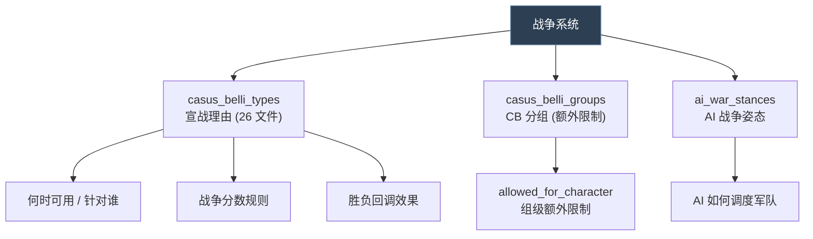
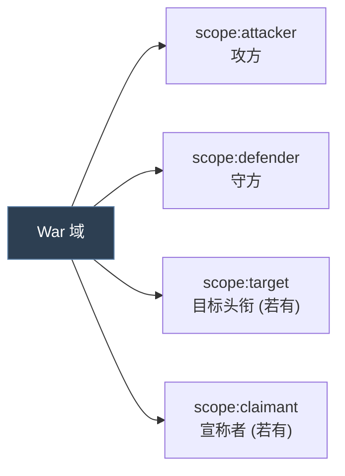
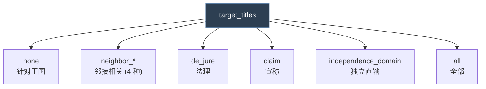
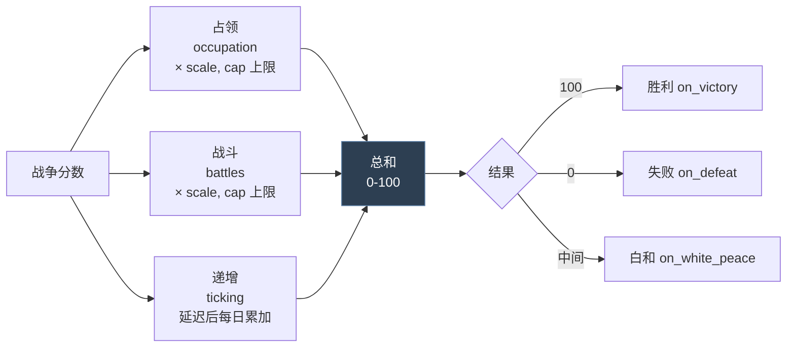
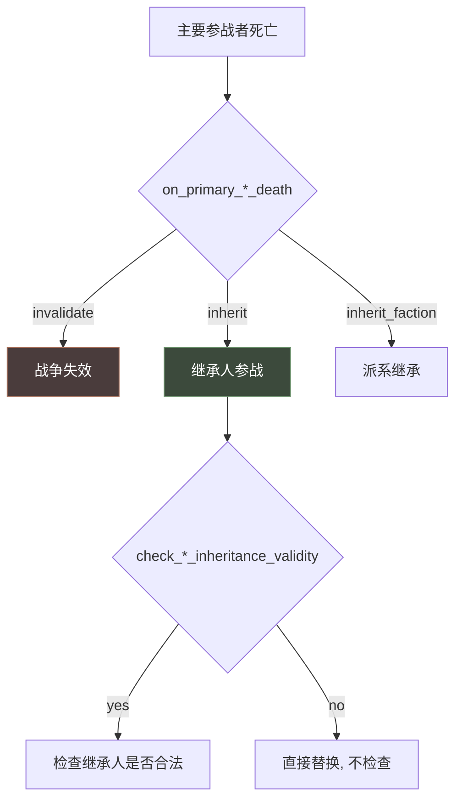
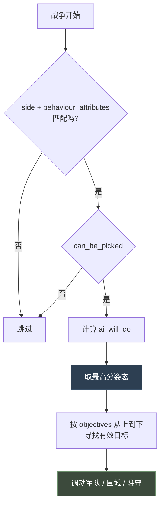

# 21 战争与宣战理由

> 战争没有独立定义文件，由**宣战理由（CB）**驱动：`casus_belli_types` 定义开战条件，`casus_belli_groups` 做分组约束。

## 本篇导读

- **三方作用域**：attacker / defender / overlord（附庸被宣时领主介入）。
- **战争分数**：递增分数、占领、战斗、参与度倍率。
- **CB 分组**：`allowed_for_character` 里的各种禁令触发器（和平主义、神权、游牧约束等）。
- **本 Mod**：`ftr_casus_belli_types/`（继位内战、天朝战争）、`ftr_casus_belli_groups/`（覆写 `de_jure`）。

## 文档关联

- **前置**：[03 触发器与效果](03-触发器与效果.md)
- **配套**：[12 活动](12-活动.md)、[13 政体与特质](13-政体与特质.md)

---
## 2.1 概念

**战争没有独立的"war 定义文件"**。CK3 的战争系统由三部分组成：



| 目录 | 角色 |
|---|---|
| `common/casus_belli_types/` | **核心**：每个 CB 定义一场"战争类型"的全部规则 |
| `common/casus_belli_groups/` | CB 分组，组级可加额外限制 |
| `common/ai_war_stances/` | AI 在战争中的行为姿态与军事目标优先级 |

## 2.2 战争的三方作用域



各 Trigger 的 root：

| Trigger | Root | 作用域 |
|---|---|---|
| `allowed_for_character` | **attacker** | `scope:attacker` `scope:defender` |
| `allowed_against_character` | **defender** | `scope:attacker` `scope:defender` |
| `valid_to_start` | **attacker** | `scope:attacker` `scope:defender` `scope:target` |
| `is_allowed_claim_title` | **title** | `scope:attacker` `scope:defender` `scope:claimant` |

> **官方警告**（`_casus_belli.info:51-52`）："Note that `scope:defender` may or may not be valid depending on how the trigger is tested, make accommodations to ensure the trigger works as intended no matter if defender exists or not"
> —— `scope:defender` **可能不存在**，必须做容错！

### `*_display_regardless` 变体

```paradox
allowed_for_character                     = { }   # 失败则隐藏
allowed_for_character_display_regardless  = { }   # 失败仍显示（标灰）

allowed_against_character                     = { }
allowed_against_character_display_regardless  = { }

valid_to_start                         = { }
valid_to_start_display_regardless      = { }
```

> 用途：让"你暂时不能宣战，但能看到这个 CB 存在" —— 与决议的 `is_valid` / `is_valid_showing_failures_only` 异曲同工。

## 2.3 目标选择

```paradox
target_titles = <枚举>            # 可针对哪些头衔
target_title_tier = tier          # 限定目标层级
target_de_jure_regions_above = yes   # 可针对持有该头衔法理领地者，而非仅持有者本人

use_de_jure_wargoal_only = yes    # 战争目标只算法理领地
mutually_exclusive_titles = { }   # 为真则只能针对一个头衔
combine_into_one = yes            # 多个实例合并为一个可选目标的条目
```

**`target_titles` 全部取值**（info:67）：

| 值 | 含义 |
|---|---|
| `none` | 不针对头衔，针对整个王国 |
| `neighbor_land` | 陆地邻国 |
| `neighbor_land_or_water` | 陆海邻国 |
| `neighbor_land_tributary` | 陆地邻国（含附庸） |
| `neighbor_land_or_water_tributary` | 陆海邻国（含附庸） |
| `de_jure` | 法理领地 |
| `claim` | 宣称 |
| `independence_domain` | 独立直辖 |
| `all` | 全部 |



## 2.4 战争分数规则

这是 CB 里参数最多的一块。

```paradox
# ── 递增战争分数（Ticking Warscore）──
attacker_ticking_warscore_delay = { months = 12 }   # 多久后开始递增
defender_ticking_warscore_delay = { months = 12 }
attacker_ticking_warscore = 0.1                     # 每日递增
defender_ticking_warscore = 0.1
attacker_wargoal_percentage = 0.75                  # 需占领战争目标多少比例才开始递增
defender_wargoal_percentage = 0.75                  # 0.0 = 至少占领一处

# ── 来自占领的分数 ──
attacker_score_from_occupation_scale = 100
defender_score_from_occupation_scale = 100
max_attacker_score_from_occupation = 50
max_defender_score_from_occupation = 100

# ── 来自战斗的分数 ──
attacker_score_from_battles_scale = 40
defender_score_from_battles_scale = 50
max_attacker_score_from_battles = 50
max_defender_score_from_battles = 100

# ── 参与度倍率 ──
occupation_participation_mult = 1.0
siege_participation_mult = 1.0
battle_participation_mult = 1.0

# ── 特殊规则 ──
full_occupation_by_defender_gives_victory = no
full_occupation_by_attacker_gives_victory = no
landless_attacker_needs_armies = no
attacker_capital_gives_war_score = no
defender_capital_gives_war_score = no
imprisonment_by_attacker_give_war_score = no
imprisonment_by_defender_give_war_score = no
check_all_defenders_for_ticking_war_score = yes   # 检查所有守方在战争目标内的领地
ticking_war_score_targets_entire_realm = yes      # 检查整个王国而非仅战争目标
```

> **默认值来源**：这些值在 CB 里未设置时，全部取自 defines（info:5）。



## 2.5 战争回调

```paradox
on_declaration = { }   # 宣战时
on_victory     = { }   # 胜利
on_white_peace = { }   # 白和
on_defeat      = { }   # 失败
on_invalidated = { }   # 失效

on_victory_desc     = { }   # 动态描述：胜利后果
on_defeat_desc      = { }
on_white_peace_desc = { }

should_invalidate = { }     # 是否应失效
cost = { gold piety prestige }   # 宣战成本

truce_days = int              # 停战天数
ignore_effect = <effect name> # 在效果描述里跳过的效果，可定义多条
                              # 例: ignore_effect = change_title_holder
```

## 2.6 死亡与继承

```paradox
on_primary_attacker_death = invalidate/inherit/inherit_faction
on_primary_defender_death = invalidate/inherit/inherit_faction
transfer_behavior = invalidate/transfer

check_attacker_inheritance_validity = yes/no   # no = 替换前不检查合法性
check_defender_inheritance_validity = yes/no
attacker_allies_inherit = yes/no               # 盟友是否继承参战
defender_allies_inherit = yes/no
```



## 2.7 名称与界面

```paradox
war_name = string                    # 战争名
my_war_name = string                 # 宣称者与攻方同一人时使用
war_name_base = string
my_war_name_base = string

interface_priority = int             # 排序，高者在前，平手按定义顺序
should_check_for_interface_availability = no   # no = 不参与 has_any_cb_on 检查
target_top_liege_if_outside_realm = no  # 绕过"境外只能针对顶头领主"检查
                                        # 仅用于脚本战争（如农民起义），UI 里无效
```

## 2.8 宗教战争相关

```paradox
is_great_holy_war = yes                    # 是否是圣战
defender_faith_can_join = yes              # 同信仰者可防御性加入
gui_attacker_faith_might_join = yes        # 仅 UI 警告，无实际效果
gui_defender_faith_might_join = yes        # 同上
```

> **区分**：`gui_*` 只是提示；`defender_faith_can_join` 才真的会加人。

```paradox
white_peace_possible = no   # 禁止白和，只有胜/败/失效
allow_hostages = yes        # 和谈能否用人质
```

## 2.9 AI 配置

```paradox
ai = no                          # 设为 no 则 AI 完全忽略此 CB
ai_only_against_liege = yes      # AI 只对自己的领主用
ai_only_against_neighbors = yes  # AI 只对陆海邻国用
max_ai_diplo_distance_to_title = int   # 超过此距离的标题 AI 永不考虑

ai_can_target_all_titles = {     # 命中则用脚本目标，否则用 neighbor_land_or_water
	# Trigger, character scope
}

ai_score = { }        # script value, 加到硬编码的标题评分上
ai_score_mult = { }   # script value, 与标题评分相乘

ai_overlord_defensive_power_impact = {}   # 附庸被攻时领主介入概率 0-1
# root/attacker = 评估宣战的角色
# defender = 被针对的附庸
# overlord = 会介入的领主
```

> **`ai_overlord_defensive_power_impact` 的语义**（info:101-106）：
> "0.4 = 40% of the power of the overlord, 60% of the power of the subject"
> `0` = AI 认为领主不会来救；`1` = AI 按领主全实力评估。

## 2.10 CB 分组 `casus_belli_groups`

```paradox
religious = {
	allowed_for_character = {
		OR = {   # 领主信仰不同则不能圣战
			top_liege = this
			any_liege_or_above = {
				faith = prev.faith
				count = all
			}
		}
		faith = {
			NOR = {
				has_doctrine_parameter = unreformed          # 未改革异教不能圣战
				AND = {
					has_doctrine_parameter = holy_wars_forbidden   # 和平主义不能圣战
					NOT = { prev = { has_character_flag = bonus_major_holy_war } }
				}
			}
		}
		herders_and_tributary_constraints = yes
		tgp_dynastic_cycle_offensive_wars_ban_trigger = yes
		tgp_war_ban_all_ministers_trigger = yes
	}
}
```

> 出处：`common/casus_belli_groups/00_casus_belli_groups.txt`
> 分组的作用是**把一组 CB 的共同限制抽出来**，避免在每个 CB 里重复写。

## 2.11 真实示例解析：宣称战争

出处：`common/casus_belli_types/00_claim.txt`

```paradox
claim_cb = {
	icon = claim_cb
	group = claim

	# 能否同时推多个宣称
	mutually_exclusive_titles = {
		NOT = {
			trigger_if = {
				limit = { scope:attacker = scope:claimant }   # 推自己的宣称
				scope:attacker = {
					OR = {
						culture = { has_innovation = innovation_chronicle_writing }
						AND = {
							government_has_flag = government_is_landless_adventurer
							has_realm_law = camp_purpose_legitimists
							has_variable = legitimist_claimed_title
							var:legitimist_claimed_title = {
								OR = {
									holder = scope:defender
									de_jure_liege.holder = scope:defender
								}
							}
						}
					}
				}
			}
			trigger_else = {    # 替别人推宣称：需要更高时代的革新
				scope:attacker = {
					culture = { has_innovation = innovation_divine_right }
				}
			}
		}
	}

	# Root is the title
	# scope:claimant is the claimant
	# scope:attacker is the attacker
	# scope:defender is the defender
	is_allowed_claim_title = {
		trigger_if = {
			limit = {
				scope:attacker = { is_ai = yes  has_variable = conqueror }
			}
			tier >= tier_duchy
		}

		custom_description = {
			text = "claimant_titles_held_by_you_or_vassal"
			NOR = {
				holder = scope:attacker
				holder = { target_is_liege_or_above = scope:attacker }
			}
		}

		scope:claimant = {
			NOT = { has_trait = incapable }
			is_hostage = no
			custom_description = {
				text = is_not_a_minister_desc
				...
			}
		}
	}
}
```

**设计要点**：

1. **`trigger_if` / `trigger_else` 用在 Trigger 上下文** —— CB 的判定几乎全是 Trigger
2. `mutually_exclusive_titles` 用 `NOT = { ... }` 包裹，逻辑是"**若不满足多选条件，则只能选一个**"
3. `custom_description` 给玩家解释"为什么这个宣称不能推"
4. 时代革新（编年史书写 → 神圣权利）决定能否多推 —— **经典的时代进步设计**
5. `var:legitimist_claimed_title = { ... }` —— 变量存的是头衔，可以直接当域用

## 2.12 AI 战争姿态 `ai_war_stances`

定义目录：`common/ai_war_stances/`（`_ai_war_stances.info`）

**战争姿态 = AI 在战争中的行为模式与目标优先级。**

```paradox
war_stance = {
	side = attacker/defender          # 必须设置

	behaviour_attributes = {          # 至少一项为 yes
		stronger  = yes   # 我方更强时评估
		weaker    = yes   # 我方更弱时评估
		desperate = yes   # 显著更弱且即将战败/只剩一个头衔（仅守方）
	}

	can_be_picked = {}   # root = War
	ai_will_do = {}      # root = War, 权重

	enemy_unit_priority = x   # 敌方单位的优先分

	objectives = { ... }
}
```

### 目标类型 `objectives`

| 目标 | 含义 |
|---|---|
| `wargoal_province` | 战争目标省份 |
| `enemy_unit_province` | 有敌方部队的省份（可见的） |
| `enemy_capital_province` | 敌方首都 |
| `capital_province` | 我方首都 |
| `enemy_province` | 敌方省份 |
| `enemy_ally_province` | 敌方盟友省份 |
| `province` | 我方省份 |
| `defend_wargoal_province` | 退守战争目标（忽略"无意义的围城/战斗"过滤） |

```paradox
objectives = {
	enemy_province = 200                 # 简单形式：目标名 = 优先级 (0-1000)

	enemy_unit_province = {              # 对象形式：仅 enemy_unit_province 支持
		priority = 250
		area = wargoal                   # 可多个
	}
}
```

**`area` 全部取值**：`wargoal` `primary_attacker` `primary_attacker_ally` `primary_defender` `primary_defender_ally`

> ### ⚠ 区域不可重叠
>
> 官方原文（`_ai_war_stances.info:151-152`）："enemy_unit_province areas may not overlap. if you define an area objective in a block you may not use it anywhere else in the objectives definition."
>
> 下面的写法会**报错**且第二个 objective 不会创建：
> ```paradox
> enemy_unit_province = { priority = 50   area = wargoal }
> enemy_unit_province = { priority = 100  area = wargoal  area = primary_attacker }  # ← 重叠!
> ```



**官方示例**（info:167-187）：

```paradox
# 激进但专注：打战争目标 + 追击目标区/守方领地内的敌军
objectives = {
	wargoal_province = 500

	enemy_unit_province = {
		priority = 250
		area = wargoal
		area = primary_defender
	}
}

# 防御姿态：放在激进目标之后, 极低优先级
# 协调员在没有更高优先级目标时知道该做什么
objectives = {
	defend_wargoal_province = 5
}
```

---

## 附 跨系统对照

> 活动与战争的横向对比（生命周期、数值系统、协作模式、选型、专用语法、`.info` 索引）已统一整合到
> [16 多系统选型指南与开发实践](16-多系统选型指南.md)。
> 下表仅列出本篇两个系统的**专用语法速查**，便于就近参考。

### 活动专属语法

| 语法 | 含义 |
|---|---|
| `scope:activity` / `scope:host` | 活动本体 / 主人 |
| `scope:special_option` | 已选特殊选项的 flag |
| `scope:magnificence` | 活动华丽度（intents 里可用） |
| `scope:<special_guest_key>` | 已选的特殊宾客 |
| `scope:<option_category_key>` | 已选选项的 flag（**可能不存在，用 `?=`**） |
| `every_attending_character` | 遍历所有在场的角色 |
| `has_attending_activity_guests` | 是否有宾客到场 |
| `is_current_phase_active` | 当前阶段是否进行中 |
| `is_activity_type_on_cooldown = <key>` | 该活动类型是否在冷却 |
| `add_to_guest_subset` / `remove_from_guest_subset` | 宾客子集增删 |
| `every_guest_subset_current_phase` | 遍历当前阶段的某个宾客子集 |

### 战争专属语法

| 语法 | 含义 |
|---|---|
| `scope:attacker` / `scope:defender` | 攻方 / 守方（**可能不存在**，需容错） |
| `scope:target` | 目标头衔 |
| `scope:claimant` | 宣称者 |
| `has_any_cb_on` | Trigger：能否对某角色宣战 |
| `vassal_contract_obligation_level:<key>` | 读取臣属契约的当前义务等级 |

### 官方 `.info` 索引

| 系统 | `.info` 路径 | 大小 |
|---|---|---|
| 活动 | `activities/activity_types/_activity_type.info` | **36.76 KB（全游戏最长）** |
| 活动场所 | `activities/activity_locales/_activity_locales.info` | 2.66 KB |
| 活动意图 | `activities/intents/_intents.info` | 3.12 KB |
| 活动分组 | `activities/activity_group_types/_activity_group_types.info` | 337 B |
| 邀请规则 | `activities/guest_invite_rules/_invite_rules.info` | 646 B |
| 宣战理由 | `casus_belli_types/_casus_belli.info` | 9.42 KB |
| 战争姿态 | `ai_war_stances/_ai_war_stances.info` | 5.53 KB |

---

