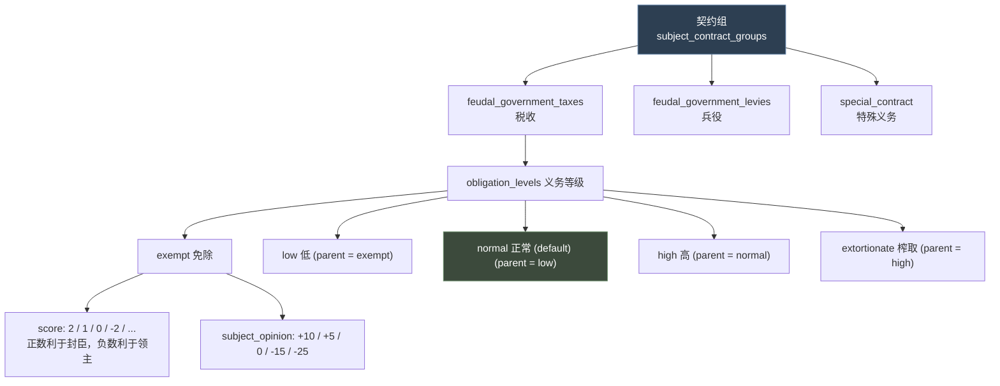
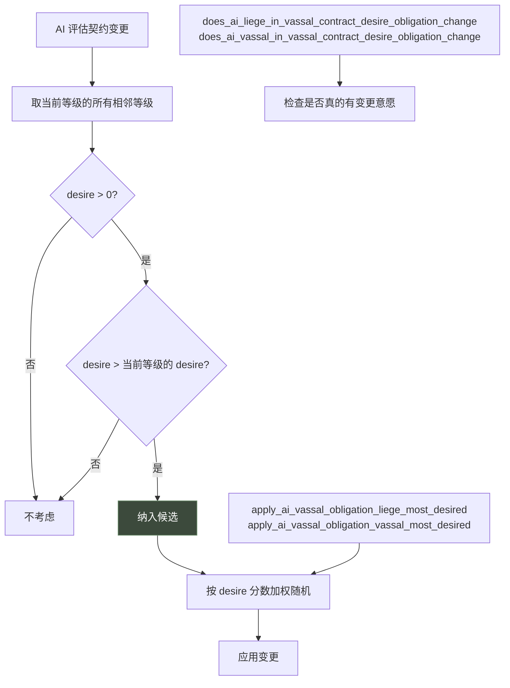
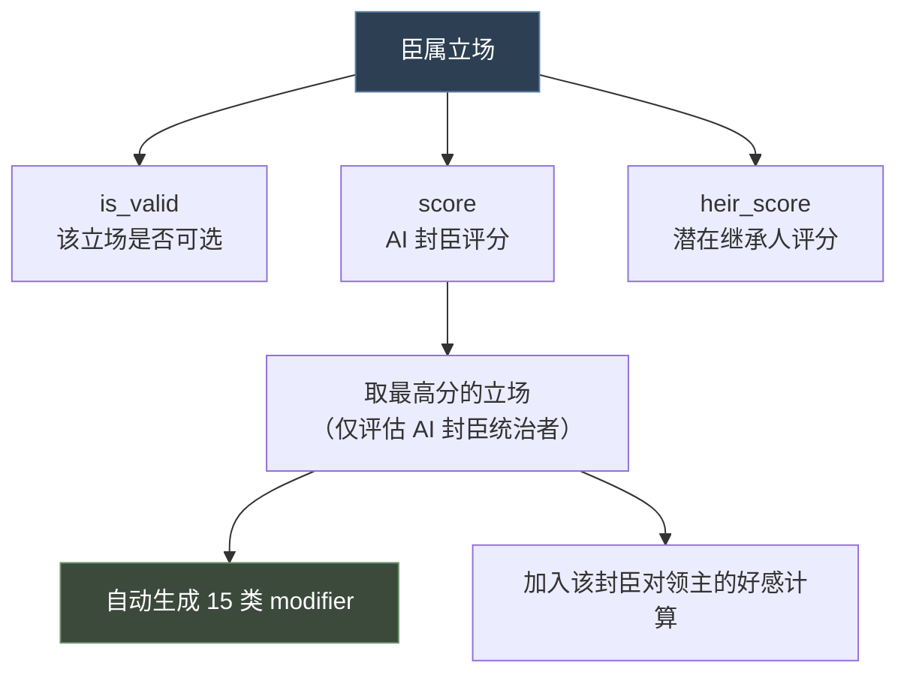
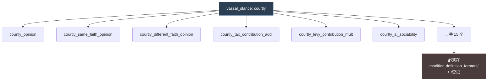

# 22 臣属契约与臣属立场

> 围绕「下级对上级」的两个系统：**臣属契约**定义封臣义务，**臣属立场**定义 AI 封臣的态度。

## 本篇导读

- **契约**：`obligation_levels` 义务等级、`subject_contract_groups` 分组、修改契约时的额外作用域。
- **立场**：完整语法、自动生成的 modifier、评估时机。
- **本 Mod**：`ftr_celestial.txt` 覆写 `celestial_provinces`，属本系统。

## 文档关联

- **配套**：[14 内阁职位](14-内阁职位.md)、[13 政体与特质](13-政体与特质.md)

---
## 1.1 概念

**臣属契约 = 封臣对领主的义务量（税、兵、畜群、实物），可在"谈判契约"界面调整。**



> **决定关系**：封臣的**政体**决定使用哪套契约（`government.vassal_contract`）。

## 1.2 契约定义

```paradox
subject_contract = {
	uses_opinion_of_liege = yes/no   # 启用后可在 script math 里用 scope:opinion_of_liege
	                                 # 玩家契约每日更新，AI 用 NSubjectContract::OPINION_OF_LIEGE_UPDATE_INTERVAL
	                                 # 默认 no（性能考虑）

	is_shown = { }                   # 该义务是否显示

	display_mode = tree / radiobutton / checkbox / hidden   # UI 呈现，默认 radiobutton

	defaults_to_highest_valid_level = yes/no    # 是否默认取（评分）最高的等级，默认 no

	can_be_changed = { }             # 能否修改；不满足则可见但不可点，tooltip 里显示阻碍原因
	                                 # 可用域: liege / subject / vassal / tax_slot / tax_collector / opinion_of_liege

	obligation_levels = { ... }
}

joins_suzerain_wars = yes/no        # 朝贡国是否自动加入宗主战争，默认 no
```

## 1.3 义务等级 `obligation_levels`

**可用域**：

| 域 | 含义 |
|---|---|
| `scope:liege` | 契约中的领主或宗主 |
| `scope:subject` | 契约中的臣属 |
| `scope:vassal` | 同 `scope:subject`（向后兼容保留） |
| `scope:opinion_of_liege` | 需 `uses_opinion_of_liege = yes` |
| `scope:tax_slot` | 所在的/考虑放入的税槽 |
| `scope:tax_collector` | 上述税槽的收税人 |

**属性全表**：

```paradox
subject_obligation_low = {
	# ── 义务量（均可用 script math）──
	levies = 0.5              # 兵役比例 0..1，默认 0
	tax = 0.2                 # 金币收入比例 0..1，默认 0
	herd = 0.2                # 畜群收入比例 0..1，默认 0
	barter_goods = 0.2        # 实物收入比例 0..1，默认 0

	min_levies = 0.1          # 兵役下限
	min_tax = 0.0             # 税下限
	min_herd = 0.0            # 畜群下限
	min_barter_goods = 0.0    # 实物下限

	# ── 界面文本 ──
	contribution_desc  = { ... }                # 贡献明细的动态描述
	tax_contribution_postfix = "..."            # 税明细后缀
	levies_contribution_postfix = "..."         # 兵役明细后缀
	herd_contribution_postfix = "..."           # 畜群明细后缀
	unclamped_contribution_label = "..."        # 未钳制值的明细标签
	min_contribution_label = "..."              # 钳制下限的明细标签

	# ── 好感 ──
	subject_opinion = 0       # 加到封臣对领主的好感上

	# ── 标记与标签 ──
	flag = token              # 任意 flag，脚本可检查当前契约是否含某 flag
	gui_tags = { tag_1 tag_2 }   # GUI 标签，用于设置大小/颜色等

	# ── 评分 ──
	score = int               # 正数利于封臣，0 中性，负数利于领主
	                          # 修改时比较新旧 score 判断倾向与幅度
	                          # 默认按定义顺序

	ai_liege_desire = <script value>     # 领主多想要此选项
	ai_subject_desire = <script value>   # 封臣多想要此选项

	# ── Modifier ──
	liege_modifier   = { }    # 施加给领主
	subject_modifier = { }    # 施加给封臣

	# ── 有效性 ──
	is_shown = { }            # 是否可见（不可见的等级同样无效）
	is_valid = { }            # 是否对该封臣有效

	# ── 兵士开关 ──
	enable_title_maa     = yes/no   # 能否基于头衔禁用兵士（需政体有 administrative 规则）
	enable_character_maa = yes/no   # 能否禁用角色兵士
	                                # 在多个义务中定义时，取契约组里第一个

	# ── 乘算因子（小心叠加）──
	tax_factor    = <script value>
	levies_factor = <script value>
	herd_factor   = <script value>

	# ── 任命继承 ──
	appointment_trait_flag = some_trait_flag
	# 继承人与候选人必须带有此 flag 的特质才有资格
	# 带 appointment flag 的契约义务在载入游戏时视为有效，避免初始化顺序问题

	# ── 树形布局 ──
	default = yes             # 标记为默认（否则第一个为默认）
	parent = subject_obligation_low   # 可从此等级升级而来 / 可退回此等级
	position = { x y }        # 图标位置，乘以 NSubjectContract::OBLIGATION_OFFSET
	icon = "path/to/image.dds"
}
```

## 1.4 AI 决策逻辑

官方原文（`_subject_contracts.info:106-112`）：

```
The liege and subject desire are used as follows:
When finding the most desired level to change we check if any adjacent obligation level
to the currently active ones are desired by them more. Desires less than or equal to zero
are not considered and if the score is less then or equal to the desire of the current level
it is also not considered.
```



**配套语法**：

| 类型 | 语法 |
|---|---|
| Trigger | `does_ai_liege_in_vassal_contract_desire_obligation_change` |
| Trigger | `does_ai_vassal_in_vassal_contract_desire_obligation_change` |
| Effect | `apply_ai_vassal_obligation_liege_most_desired` |
| Effect | `apply_ai_vassal_obligation_vassal_most_desired` |

## 1.5 契约组 `subject_contract_groups`

```paradox
feudal_contract_group = {
	admin_province_contract = administrative_themes   # 该组的"行政省份"契约，界面用

	contracts = {                      # 组内的契约
		feudal_government_taxes
		feudal_government_levies
		special_contract
	}

	modify_contract_layout = clan      # GUI 用 SubjectContract.HasModifyContractLayout 查询

	# ── 以下仅对朝贡契约有效 ──
	is_tributary = no

	is_valid_tributary_contract = { }  # ROOT = 臣属, scope:suzerain = 宗主
	tributary_can_break_free = { }     # 臣属能否自行脱离

	suzerain_line_type = line_suzerain       # 地图上画宗主线的线型
	tributary_line_type = line_tributary     # 地图上画朝贡线的线型

	should_show_as_suzerain_realm_name  = yes/no   # 地图名是否用宗主的
	should_show_as_suzerain_realm_color = yes/no   # 地图色是否用宗主的（按比例插值）

	tributary_heir_succession = yes/no   # 朝贡者继承人是否继任朝贡，默认 yes
	suzerain_heir_succession  = yes/no   # 宗主继承人是否继任宗主，默认 yes
}
```

## 1.6 修改契约时的额外作用域

```
scope:changed_obligations   # 窗口中所有已变更的契约义务列表
scope:new_value             # 变更对封臣有利程度的数值（基于 score 增量）
```

## 1.7 需要本地化的键

```
<contract_level>              # 契约等级名
<obligation_level>            # 义务等级名
<obligation_level>_short      # 短名
<obligation_level>_desc       # 描述
```

## 1.8 真实示例解析：封建税

出处：`common/subject_contracts/contracts/feudal.txt`

```paradox
feudal_government_taxes = {
	display_mode = tree          # 树形显示，等级间可逐级升降
	icon = gold_icon

	obligation_levels = {
		feudal_tax_exempt = {
			position = { 0 0 }
			tax = exempt_feudal_tax        # 引用 script value
			subject_opinion = 10           # 免税 → 封臣好感 +10
			ai_liege_desire = 1
			ai_subject_desire = 5
			score = 2                      # 最利于封臣
		}

		feudal_tax_low = {
			parent = feudal_tax_exempt     # 树形结构的父节点
			position = { 1 0 }
			tax = low_feudal_tax
			subject_opinion = 5
			ai_liege_desire = {
				value = 2
				if = {
					limit = {
						scope:liege = {
							ai_should_focus_on_building_in_their_capital = yes
						}
						scope:subject = {
							AND = {
								government_has_flag = government_is_feudal
								vassal_contract_obligation_level:feudal_government_taxes <= feudal_tax_exempt_level
							}
						}
					}
					add = 8                 # 领主想建首都 + 封臣当前是免税 → 强烈想加税
				}
			}
			ai_subject_desire = 4
			score = 1
		}

		feudal_tax_normal = {
			default = yes                  # 默认等级
			parent = feudal_tax_low
			position = { 2 0 }
			tax = normal_feudal_tax
			ai_liege_desire = { value = 3  if = { ... add = 7 } }
			ai_subject_desire = 3
			score = 0                      # 中性基准
		}

		feudal_tax_high = {
			parent = feudal_tax_normal
			position = { 3 0 }
			tax = high_feudal_tax
			subject_opinion = -15
			ai_liege_desire = { value = 5  if = { ... add = 6 } }
			ai_subject_desire = 2
			score = -2
			flag = obligation_high_taxes   # 供脚本检查
		}

		feudal_tax_extortionate = {
			parent = feudal_tax_high
			position = { 4 0 }
			tax = extortionate_feudal_tax
			subject_opinion = -25
			...
		}
	}
}
```

**设计要点**：

1. **`parent` 链构成树形结构** —— exempt → low → normal → high → extortionate，只能逐级调整
2. **`score` 的符号语义**：正 = 利于封臣，负 = 利于领主，0 = 中性基准
3. **`subject_opinion` 与 score 配套**：+10 / +5 / 0 / -15 / -25
4. **`ai_liege_desire` 用 script value 做条件增益** —— 领主"想建首都"且封臣当前免税时，加税欲望 +8
5. **`vassal_contract_obligation_level:<key>` 语法** —— 读取当前契约等级，可与 `<level>_level` 常量比较
6. `flag = obligation_high_taxes` 让其他脚本能检查"这个封臣是否被重税"

---

# 第二章 臣属立场（Vassal Stance）

## 2.1 概念

**臣属立场 = AI 封臣对领主采取的态度姿态，自动影响税/兵贡献与 AI 性格。**

这是本文**最小的**系统 —— `_vassal_stances.info` 只有 1.09 KB。



## 2.2 完整语法

官方 `_vassal_stances.info` 全文：

```paradox
key = {
	# root = ai character evaluating stance
	# scope:liege = their liege
	is_valid = {
		<trigger>
	}

	# root = ai character evaluating stance
	# scope:liege = their liege
	score = {
		<script value>
	}

	# root = potential heir
	# scope:liege = their liege
	heir_score = {
		<script value>
	}
}
```

| 属性 | Root | 额外域 | 用途 |
|---|---|---|---|
| `is_valid` | 评估立场的 AI 角色 | `scope:liege` | 该立场是否可选 |
| `score` | 评估立场的 AI 角色 | `scope:liege` | AI 评分，**取最高分** |
| `heir_score` | 潜在继承人 | `scope:liege` | 继承人评分 |

## 2.3 自动生成的 Modifier

**每个立场会自动生成 15 个 modifier**，官方原文（info:21-41）：

```
key_opinion                        key_ai_honor
key_same_faith_opinion             key_ai_greed
key_different_faith_opinion        key_ai_rationality
key_same_culture_opinion           key_ai_energy
key_different_culture_opinion      key_ai_boldness
key_tax_contribution_add           key_ai_zeal
key_tax_contribution_mult          key_ai_vengefulness
key_levy_contribution_add          key_ai_compassion
key_levy_contribution_mult         key_ai_sociability
```

> **官方要求**（info:21）："Each defined stance will generate multiple modifiers, so make sure to add it to the modifier definition formats too."
> —— 定义新立场后**必须**在 `common/modifier_definition_formats/` 里登记这些 modifier，否则不生效。



## 2.4 评估时机

官方原文（info:43-46）：

```
Vassal stances are evaluated in the RARE_TASK_TICK AI update only for vassal rulers.
The top scoring one of all valid options is chosen for the AI to use.

The active vassal stance will add its opinion values for that vassal towards their ruler
when calculating opinion.
```

**三条要点**：

1. **时机**：只在 `RARE_TASK_TICK` AI 更新时评估
2. **对象**：**仅**对身为统治者的封臣（vassal rulers）
3. **效果**：活跃立场的好感值会加进"该封臣对统治者"的好感计算

## 2.5 真实示例解析：宫廷派

出处：`common/vassal_stances/00_vassal_stances.txt`

```paradox
courtly = {
	score = {
		value = ai_sociability                    # 基数 = AI 社交性
		add = {                                   # + 社交性/2
			value = ai_sociability
			divide = 2
		}
		add = {                                   # - 贪婪
			value = ai_greed
			multiply = -1
		}
		add = {                                   # + 同情/2
			value = ai_compassion
			divide = 2
		}

		if = { limit = { has_trait = gregarious }   add = 50 }
		if = { limit = { has_trait = fickle }       add = 50 }
		if = { limit = { has_trait = honest }       add = 50 }
		if = {
			limit = { culture = { has_cultural_pillar = ethos_courtly } }
			add = 50
		}
		if = {
			limit = {
				scope:liege = { has_royal_court = yes  has_court_type = court_diplomatic }
			}
			add = 30                              # 领主是外交型宫廷 → 加分
		}
		if = {
			limit = {
				scope:liege = { has_royal_court = yes  has_court_type = court_intrigue }
			}
			add = 15                              # 阴谋型宫廷 → 加较少
		}
		if = {
			limit = {
				top_participant_group:dynastic_cycle ?= {
					participant_group_type = pro_hegemon_movement
				}
			}
			add = 250                             # 局势参与组 → 巨幅加分
		}
	}
}
```

**设计要点**：

1. **基数来自 AI 性格属性**（`ai_sociability`、`ai_greed`、`ai_compassion`）—— 立场是性格的延伸
2. **script value 的运算符链**：`value` → `add`（divide）→ `add`（multiply -1）→ `add`（divide）
3. **特质加分**：gregarious / fickle / honest 各 +50
4. **文化支柱加分**：`ethos_courtly` +50
5. **领主宫廷类型影响**：外交型 +30 > 阴谋型 +15
6. **`?=` 弱比较**：`top_participant_group:dynastic_cycle ?=` —— 该局势参与组可能不存在
7. **局势参与组给 +250** —— 压倒性加分，体现"站队"的优先级

---

