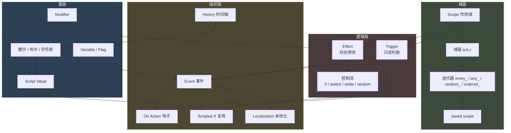

# 23 速查手册

> 随手查阅：语法卡片、事件 / on_action / history / 本地化速查、命名前缀、编码与工具清单、概念关系总图。

## 本篇导读

- **语法速查卡**：基本结构 / 作用域 / 逻辑 / 控制流 / 迭代器 / 随机 / 数值。
- **四大速查**：事件、on_action、history、本地化。
- **规范**：`ftr_` 命名前缀总表、文件编码与工具清单。
- **排错与调试已拆出** → [24 排错与调试](24-排错与调试.md)。

## 文档关联

- **配套**：[15 common 目录清单](15-common目录清单.md)、[24 排错与调试](24-排错与调试.md)、[16 多系统选型指南](16-多系统选型指南.md)

---


## 1. 语法速查卡

### 1.1 基本结构

| 语法 | 含义 |
|---|---|
| `key = value` | 赋值（标量） |
| `key = { ... }` | 块 |
| `key = { a b c }` | 裸列表 / 范围 / 颜色 |
| `key >= value` | 比较（Trigger） |
| `# text` | 注释 |
| `@NAME = value` | 文件级常量（引用时不带 `@`） |
| `$PARAM$` | 宏参数 |
| `namespace = name` | 事件命名空间（每文件一次） |
| `name.number = { }` | 事件定义 |

### 1.2 作用域

| 语法 | 含义 |
|---|---|
| `this` | 当前域 |
| `root` | 根域 |
| `prev` / `prev.prev` | 上一层 / 上两层 |
| `scope:name` | 具名保存域 |
| `father.mother` | 域链 |
| `save_scope_as = n` | 保存域（脚本链） |
| `save_temporary_scope_as = n` | 临时域（当前块） |
| `save_scope_value_as = { name = n value = V }` | 保存数值 |
| `exists = scope:x` | 存在性检查 |
| `?=` | 弱比较（不存在时返回假而非报错） |

### 1.3 逻辑（Trigger）

| 语法 | 含义 |
|---|---|
| 并列多条 | **默认 AND** |
| `AND = { }` | 显式 AND |
| `OR = { }` | 或 |
| `NOT = { }` | 非 |
| `NOR = { }` | 全假才真 |
| `NAND = { }` | 不全真才真 |
| `count >= N` | 迭代器内计数条件 |
| `count = all` | 全部满足 |

> **CK3 无 `XOR`**（全目录实测 0 命中）。

### 1.4 控制流（Effect）

| 语法 | 含义 |
|---|---|
| `if = { limit = {} ... }` | 条件分支 |
| `else_if = { limit = {} ... }` | 否则若 |
| `else = { ... }` | 否则 |
| `switch = { trigger = X  v = {} }` | 按值分支 |
| `while = { limit = {} ... }` | 条件循环 |
| `while = { count = N  limit = {} ... }` | 带上限的循环 |
| `trigger_if / trigger_else` | **Trigger 上下文**的条件化 |

> **CK3 无 `repeat` / `break` / `continue`**（全目录实测 0 命中）。

### 1.5 迭代器

| 前缀 | 上下文 | 含义 |
|---|---|---|
| `every_*` | Effect | 遍历全部 |
| `any_*` | Trigger | 至少一个满足 |
| `random_*` | Effect | 随机取一个 |
| `ordered_*` | Effect | 排序后遍历（配 `order_by`） |
| `count_*` | 统计 | 计数 |

### 1.6 随机

```paradox
random_list = { 10 = { ... }  20 = { ... } }
random = { chance = 25  modifier = { add = 5 <trig> }  modifier = { factor = 0.5 <trig> }  <effects> }
ai_chance      = { base = 10  modifier = { add / factor + trigger } }
ai_will_select = { base = 10  if = { limit = {} add = 5 }  else_if = { limit = {} multiply = 0.5 } }
```

### 1.7 数值

```paradox
# Script Value
name = { value = V  add = N  subtract = N  multiply = N  divide = N  modulo = N
         max = N  min = N  round = yes  ceiling = yes  floor = yes
         if = { limit = {} ... }  else_if = {}  else = {}
         fixed_range = { min = a  max = b }  integer_range = { min = a  max = b } }

# Variable
set_variable = { name = X  value = V }
change_variable = { name = X  add = V }
remove_variable = X
clamp_variable = { name = X  min = a  max = b }
```

| 前缀 | 含义 |
|---|---|
| `var:X` | 对象变量 |
| `local_var:X` | 局部变量 |
| `global_var:X` | 全局变量 |
| `list:X` / `list_size:X` | 作用域内临时 list 遍历 / 大小（`add_to_list` 建的名单用） |
| `flag:X` | 标记（可作 switch 分支键） |

> 注：`add_to_variable_list` 建的 **variable list** 遍历用 `variable = X`、存在用 `has_variable_list`、大小用 `variable_list_size`（trigger），**不要**对 variable list 用 `list =` / `list_size:`（详见 [01-词法 §4.3](01-词法、数据类型与值系统.md#43-变量列表List)）。

---

## 2. 事件速查

```paradox
namespace = ns

ns.0001 = {
	# 元信息
	type = character_event / letter_event / court_event / activity_event
	scope = character / landed_title / province / ...
	window = character_event / big_event_window / letter_event / ...
	content_source = my_mod
	theme = my_theme
	orphan = no

	# 触发
	hidden = no
	major = no
	major_trigger = { }
	cooldown = { days / weeks / months / years = X }

	# 文本（静态键 或 动态块）
	title = ns.0001.t
	desc = { first_valid = { triggered_desc = { trigger = {} desc = k }  desc = fallback } }
	opening = ns.0001.opening      # letter_event

	# 立绘
	left_portrait = { character = root  animation = X  triggered_animation = { trigger = {} animation = Y } }
	right_portrait = scope:guest
	sender = scope:author          # letter_event 必需

	# 逻辑
	trigger = { }
	immediate = { }

	option = {
		name = ns.0001.a
		trigger = { }
		show_as_unavailable = { }
		fallback = yes
		exclusive = yes
		ai_chance = { base = 10  modifier = { add = 5  <trig> } }
		add_gold = 100
	}

	after = { }
	on_trigger_fail = { }
}
```

### 2.1 动态描述节点

| 节点 | 作用 |
|---|---|
| `desc` | 追加文本 |
| `triggered_desc` | 条件文本（`trigger` + `desc`） |
| `first_valid` | 取第一个有效子项 |
| `random_valid` | 随机取 N 个（`count = N`，默认 1） |
| `switch` | 按值分支（`trigger` + case + `fallback`） |

---

## 3. On Action 速查

```paradox
my_on_action = {
	trigger = { }
	weight_multiplier = { base = 1  modifier = { add = 1  <trig> } }
	events = { ns.0001  delay = { days = 365 }  ns.0002 }
	random_events = { chance_to_happen = 25  chance_of_no_event = { value = 0 }  100 = ns.0001  100 = 0 }
	first_valid = { ns.0001  ns.0002 }
	on_actions = { other }
	random_on_actions = { 100 = a  200 = b }
	first_valid_on_action = { a  b }
	effect = { }
	fallback = another_on_action
}

# 触发
trigger_event = ns.0001
trigger_event = { id = ns.0001  days = 5 }
trigger_event = { on_action = my_on_action  days = 5 }
```

### 3.1 周期钩子

| on_action | 频率 | root |
|---|---|---|
| `yearly_global_pulse` | 每年 1/1 | **无 root** |
| `on_yearly_playable` | 每年（按生日） | 可玩角色 |
| `three_year_playable_pulse` | 每 3 年 | 可玩角色 |
| `five_year_playable_pulse` | 每 5 年 | 可玩角色 |
| `quarterly_playable_pulse` | 每季度（带 `scope:quarter` 1-4） | 可玩角色 |
| `random_yearly_playable_pulse` | 每年随机 | 可玩角色 |
| `random_yearly_everyone_pulse` | 每年随机 | 所有角色 |
| `five_year_everyone_pulse` | 每 5 年 | 所有角色 |
| `three_year_pool_pulse` | 每 3 年 | 角色池角色 |

---

## 4. History 速查

```paradox
# characters/<culture>.txt
char_id_string = {
	name = "Name"
	dynasty = X   faith = X   culture = X
	disallow_random_traits = yes
	trait = brave
	martial = 15   prowess = 12
	1033.1.1 = { birth = yes }
	1066.1.1 = { learn_language_of_culture = culture:greek }
	1082.1.1 = { death = yes }
}

# titles/<title>.txt
k_france = {
	867.1.1  = { change_development_level = 5 }
	481.1.1  = { holder = 168673  name = WEST_FRANCIA  succession_laws = { male_only_law } }
	511.11.27 = { holder = 168681 }
}

# provinces/<kingdom>.txt
2154 = {	#VANNES
	culture = breton
	religion = catholic
	holding = castle_holding / city_holding / church_holding / none / auto
	1104.1.1 = { holding = city_holding }
}

# cultures/<culture>.txt
800.1.1 = {
	discover_innovation = innovation_x
	add_innovation_progress = { culture_innovation = innovation_y  progress = 50 }
	join_era = culture_era_2
	progress_era = 50
}
```

---

## 5. 本地化速查

```yaml
l_simp_chinese:
 key:0 "value"
 key:1 "变体"
 key:0 "带 [ROOT.Char.GetTitledFirstName] 的动态文本"
 key:0 "首字母大写: [ROOT.Char.GetSheHe|U]"
 key:0 "概念链接: [claim|E]"
 key:0 "强调 #EMP 文本#!\n\n换行"
 key:0 "可定制: [ROOT.Char.Custom('FemaleMale')]"
 key:0 "变量: $some_key$"
```

| 规则 | 说明 |
|---|---|
| 编码 | **UTF-8 with BOM** |
| 语言头 | 顶格，如 `l_simp_chinese:` |
| 条目缩进 | 至少 1 空格 |
| 注释 | `#` |
| 转义 | `\"` `\\"` `\n` |
| 标记 | `#EMP ... #!` `#HIGH ... #!` `#help ... #!` |

---

## 6. 命名前缀总表（Mod 建议）

| 类别 | 建议前缀 | 示例 |
|---|---|---|
| 事件命名空间 | `ftr` | `ftr.0001` |
| 脚本触发器 | `ftr_` + `_trigger` | `ftr_can_convert_trigger` |
| 脚本效果 | `ftr_` + `_effect` | `ftr_grant_merit_effect` |
| 脚本值 | `ftr_` + `_value` | `ftr_war_tax_value` |
| on_action | `ftr_` | `ftr_vassal_independence` |
| 变量 | `ftr_` | `var:ftr_merit_level` |
| 标记 | `ftr_` | `has_character_flag = ftr_is_governor` |
| 修饰符 | `ftr_` + `_modifier` | `ftr_war_exhaustion_modifier` |
| 本地化键 | `ftr_` | `ftr_war_tax_name` |
| 特质 | `ftr_` | `ftr_commander_trait` |
| 决议 | `ftr_` | `ftr_declare_bankruptcy` |
| 交互 | `ftr_` | `ftr_buy_land_interaction` |
| 参数 | 全大写 | `$CHARACTER$` `$SCALE$` |

---

## 7. 文件编码与工具清单

| 项目 | 要求 |
|---|---|
| `.txt` 脚本编码 | UTF-8 with BOM |
| `.yml` 本地化编码 | UTF-8 with BOM |
| 行尾 | LF（原版），CRLF 通常也能用 |
| 缩进 | Tab（原版统一） |
| 编辑器推荐 | VS Code（装 CK3 语法高亮插件）+ 显存 BOM 设置 |

**VS Code 设置建议**：

```json
{
  "files.encoding": "utf8bom",
  "files.eol": "\n",
  "editor.insertSpaces": false,
  "editor.tabSize": 4
}
```

---


## 8. 官方 `.info` 索引总表


`common/` 下共 **138 个 `.info` 文件**，是 Paradox 官方自带的语法文档，也是学习 P 语言最权威的一手资料。

### 11.1 按系统归类

| 系统 | `.info` 路径 | 大小 |
|---|---|---|
| 活动 | `activities/activity_types/_activity_type.info` | **36.76 KB（全游戏最长）** |
| 政府 | `governments/_governments.info` | 25.84 KB |
| 角色交互 | `character_interactions/_character_interactions.info` | 26.59 KB |
| 宫廷职位 | `court_positions/types/_court_positions.info` | 18.57 KB |
| 局势 | `situation/situations/_situations.info` | 14.28 KB |
| 特质 | `traits/_traits.info` | 12.71 KB |
| 法律 | `laws/_laws.info` | 11.88 KB |
| 阴谋 | `schemes/scheme_types/_schemes.info` | 10.82 KB |
| 派系 | `factions/_factions.info` | 10.53 KB |
| 决议 | `decisions/_decisions.info` | 9.25 KB |
| 宣战理由 | `casus_belli_types/_casus_belli.info` | 9.42 KB |
| 内阁任务 | `council_tasks/_council_tasks.info` | 7.30 KB |
| 内阁职位 | `council_positions/_council_positions.info` | 4.92 KB |
| 故事循环 | `story_cycles/_story_cycles.info` | 4.56 KB |
| 活动意图 | `activities/intents/_intents.info` | 3.12 KB |
| 活动场所 | `activities/activity_locales/_activity_locales.info` | 2.66 KB |
| 继承选举 | `succession_election/_succession_election.info` | 2.25 KB |
| 契约组 | `subject_contracts/groups/_subject_contract_groups.info` | 2.07 KB |
| 共治 | `diarchies/diarchy_types/_diarchies.info` | 1.53 KB |
| 继承任命 | `succession_appointment/_succession_appointment.info` | 1.61 KB |
| 臣属立场 | `vassal_stances/_vassal_stances.info` | 1.09 KB |
| 臣属契约 | `subject_contracts/contracts/_subject_contracts.info` | 5.11 KB |
| 事件 | `events/_events.info` | — |
| on_action | `common/on_action/_on_actions.info` | — |
| script value | `common/script_values/_script_values.info` | — |
| scripted modifier | `common/scripted_modifiers/_scripted_modifiers.info` | — |
| modifier | `common/modifiers/_modifiers.info` | — |
| customizable loc | `common/customizable_localization/_custom_loc.info` | — |
| effect loc | `common/effect_localization/_effect_localization.info` | — |
| trigger loc | `common/trigger_localization/_trigger_localization.info` | — |

### 11.2 使用建议

1. **动手写任何系统前，先读对应 `.info`** —— 它比任何二手文档都准
2. 用 `search_file` 模式 `*.info` 可一次性列出全部
3. `.info` 里的注释常含有**官方的性能警告与设计意图**，不要跳过

---


## 9. 概念关系总图



