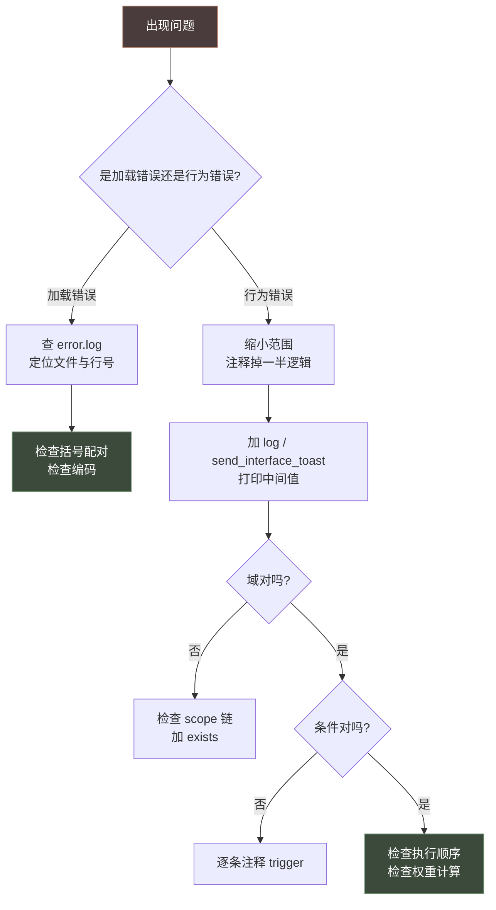
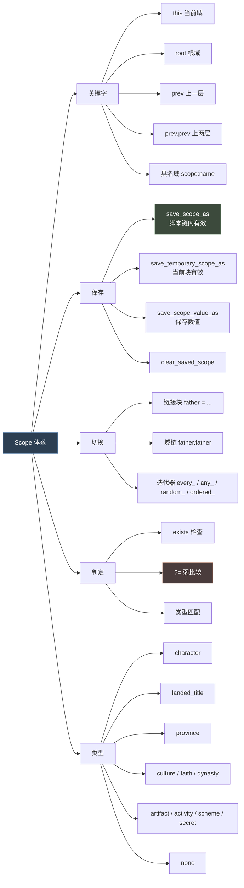

# 24 排错与调试

> 出问题时先看这里：怎么读 `error.log`、怎么定位「不报错但行为异常」、以及各系统的默认值约定。

## 本篇导读

- **报错对照**：加载期 / 运行期错误信息的含义与处理。
- **调试方法论**：控制台、日志、二分法、最小复现。
- **默认值约定**：跨系统「不写是什么、写了会怎样」。
- **行为异常排查**：没有报错但结果不对时的检查顺序。

## 文档关联

- **配套**：[23 速查手册](23-速查手册.md)、[15 common 目录清单](15-common目录清单.md)
- **工具**：[23 速查手册](23-速查手册.md) §7 文件编码与工具清单

---

## 1. 加载期与运行期报错

### 6.1 加载期错误

| 报错 / 症状 | 原因 | 解法 |
|---|---|---|
| 中文乱码 | 文件不是 UTF-8 with BOM | 用支持 BOM 的编辑器另存 |
| `Unknown token` / `Unexpected token` | 括号不匹配、缺 `=`、Tab/空格混用 | 检查括号配对 |
| `Missing closing brace` | 缺 `}` | 逐层检查缩进 |
| 数据库对象重复定义 | 两个 Mod 定义了同名 ID | 加前缀 |
| 事件 ID 冲突 | namespace + number 重复 | 换编号 |
| 多个顶层决议/对象互相嵌套 | 前一个决议缺 `}`，后一个决议被吞进前块（曾致 ease/investigate/use_leverage 全部失效） | 用 validate_scripts 的顶层对象配对检查重建该文件 |
| 引用了不存在的法律 / 特质 / 效果 / 脚本值 | 拼写错误，或照抄了他处的名称 | 用 `validate_scripts --game-path` 的引用一致性检查定位并改正 |

### 6.2 运行期错误

| 报错 / 症状 | 原因 | 解法 |
|---|---|---|
| `Invalid scope` / `Scope type mismatch` | 在错误域上用了不匹配的 Trigger/Effect | 确认当前域类型 |
| `No scope` | 访问了不存在的域 | 先 `exists = scope:x`；或用 `?=` |
| `Effect used in trigger context` | Trigger 块里写了 Effect | 移到 `limit` 外或改用 `trigger_if` |
| `Trigger used in effect context` | Effect 块里裸写了 Trigger | 包进 `limit = { }` |
| 事件不触发 | on_action trigger / 事件 trigger / cooldown | 逐层排查 |
| 延迟事件不触发 | 延迟到期时**二次校验** trigger | 检查条件是否仍成立 |
| 事件里读不到局部变量 | on_action 的 effect 与事件是**两条域链** | 改用 `save_scope_as` |
| 游戏卡住 | `while` 死循环 / on_action `fallback` 死循环 | 加 `count`；检查 fallback 链 |
| 稀有事件总触发 | `random_events` 缺 `0` 权重条目 | 加 `100 = 0` |
| 效果 `imprison`/`add_opinion` 无效果 | 缺 `target` / `opinion` 值（曾在 court 事件漏写） | 补 `target = scope:x` 与好感数值 |
| 死亡结算后 `killer`/好感为空 | 作用域拼成 `scop:recipient`，且对**已死角色**操作 | 改 `scope:` 并在对死者操作前判 `is_alive` |
| 反复刷"此作用域不支持变量" | 在死亡/失效作用域上 `remove_list_variable`（常在 death 链误触） | 先 `exists` / `is_alive` 再清理 |
| `scope:transfer_type = flag:x` 报"Invalid right side" | 用 `?= { OR = { flag:x } }` 嵌套写法（右值解析为 none） | 改成与 `title_on_actions.txt` 一致的直接枚举比较 |

### 6.3 逻辑错误（不报错但行为异常）

| 症状 | 原因 | 解法 |
|---|---|---|
| 权重计算不符预期 | 忘了 `factor` 是在所有 `add` 之后连乘 | 按 base → Σadd → Πfactor 手算 |
| script value 结果不对 | 运算**严格自上而下**，`max` 位置很关键 | 检查运算顺序 |
| `add_gold = gold` 变成翻倍 | `gold` 被解析为当前域的金币属性 | 改用不同名或显式变量 |
| 参数没替换 | `$PARAM$` 大小写不一致 | 统一大小写 |
| 变量自增报错 | 对不存在的变量 `change_variable` | 先 `exists` 检查 |
| 历史人物被随机加特质 | 缺 `disallow_random_traits = yes` | 补上 |
| 开局人物不存在/已死 | `birth`/`death` 日期与开局日期关系错了 | 检查日期 |
| `|U` 原样显示 | 用了中文竖线 `｜` | 改成英文 `\|` |

---

## 2. 调试方法论

**实用技巧**：

1. **二分法**：注释掉一半逻辑，快速定位
2. **控制台**：用 `effect` 命令直接跑脚本片段
3. **`send_interface_toast`**：把中间值打到界面上
4. **最小复现**：把问题逻辑抽到独立的测试事件
5. **对比原版**：找一个功能相似的原版实现对照
6. **读 `.info`**：官方语法说明永远是最准的

---

## 3. 各系统默认值约定

这是实战中最容易踩的坑。**同一类写法在不同系统里默认值不同**。

### 5.1 空 trigger 的两种相反处理

| 系统 | 属性 | 空 trigger 的含义 |
|---|---|---|
| 内阁职位 | `auto_fill = { }` | **no** |
| 内阁职位 | `inherit = { }` | **no** |
| 内阁职位 | `can_change_once = { }` | **no** |
| 内阁职位 | `can_fire = { }` | **yes** |
| 内阁职位 | `can_reassign = { }` | **yes** |

> 记住口诀：**"能否不要"类的默认 no，"能否做"类的默认 yes。**

### 5.2 默认恒假（不写 = 禁用）

| 系统 | 属性 | 默认 |
|---|---|---|
| 法律 | `can_title_have` | **恒假** |
| 法律 | `can_realm_have` | **恒假** |
| 臣属契约 | `is_shown`（未写） | 该等级**同时无效** |
| 故事循环 | `visible` | **no**（不在界面显示） |

### 5.3 默认恒真（不写 = 无条件通过）

| 系统 | 属性 |
|---|---|
| 角色交互 | `is_available` `is_shown` `is_valid` `is_valid_showing_failures_only` `has_valid_target` `can_send` |
| 决议 | `is_shown` `is_valid` `is_valid_showing_failures_only` |
| 法律 | `can_keep` `can_have` `can_pass` |
| 政体 | `council` `legitimacy` `buildings` `affected_by_development` `use_maa_maintenance` |

### 5.4 排序方向的差异

| 系统 | 属性 | 方向 |
|---|---|---|
| 活动 | `sort_order` | **大者在前** |
| 决议 | `sort_order` | **大者在前** |
| 战争（CB） | `interface_priority` | **大者在前** |
| 派系 | `sort_order` | **小者在前** ⚠ |
| 事件窗口 | `interface_priority` | **大者在前** |

> **派系是唯一的例外**，极易记反。

### 5.5 默认值的其他陷阱

| 系统 | 陷阱 |
|---|---|
| 派系 | `requires_character` 默认 **yes**（允许纯伯爵领派系要显式设 no） |
| 派系 | `multiple_targeting` 默认 **no** |
| 阴谋 | `maximum_breaches` 默认 7（谋杀用 5） |
| 阴谋 | `uses_resistance` 默认 **yes** |
| 阴谋 | `freeze_scheme_when_traveling` 等 4 项默认 **no** |
| 活动 | `is_single_location` 默认 **yes** |
| 活动 | `can_always_plan` 默认 **yes** |
| 活动 | `allow_zero_guest_invites` 默认 **no** |
| 政体 | `inherit_from_dynastic_government` 默认 **yes** |
| 政体 | `royal_court` 默认 `none` |
| 局势 | `is_unique` 默认 **no** |
| 局势 | `auto_add_rulers` 默认 **yes** |
| 局势 | `require_realm_in_sub_region` 默认 **yes** |
| 战争 | `ai = no` 时 AI 完全忽略该 CB |
| 战争 | `white_peace_possible` 默认 **yes** |
| 共治 | `succession` 默认 **no** |

---

## 4. 行为异常排查

### 9.1 语法层

| 坑 | 规避 |
|---|---|
| 中文乱码 | 文件必须是 **UTF-8 with BOM** |
| `|U` 原样显示 | 用了中文竖线 `｜`，必须是英文 `\|` |
| `add_gold = gold` 变成翻倍 | `gold` 被解析为当前域的金币属性（数字位置先查 script value 表，再查域链） |
| 参数没替换 | `$PARAM$` 大小写不一致 |
| script value 结果不对 | 运算**严格自上而下**，`max` 的位置很关键 |
| 权重计算不符预期 | `factor` 是在所有 `add` **之后**连乘 |
| 用了不存在的语法 | CK3 **无** `XOR`、无 `repeat` / `break` / `continue`、无 `inline_script`、无 `parameters = {}` 声明块 |
| 改了金币却用 `change_gold` | **不存在**，资金效果用 `add_gold`（曾误用报错） |
| trigger 块里写 `add_trait` | 加特质是效果，条件里用 `has_trait`；曾把 `add_trait = blind` 当条件写进 court trigger |
| 作用域拼成 `scop:` | `scope:` 少个 e → 作用域读不到（曾致死亡凶手/好感丢失），校验脚本能抓 |
| 触发器 / 效果名拼写错误（漏字母、多字母） | 语法检查pass，但引用一致性检查会报「不存在的名字」；用 `validate_scripts --game-path` 定位 |
| 枚举比较用 `scope:transfer_type ?= { flag:xxx }` | 应仿原版直接 `scope:transfer_type = flag:xxx` 并列在 `OR`；`?= {}` 内放裸 `flag:` 值不成立 |
| 效果域 `custom_tooltip` / `custom_description` 内写了 `trigger = {}` | 效果域只接受 effects，写了**不报错但提示不按条件显示**；条件显示须外套 `if = { limit = { … } custom_tooltip = { text = … } }`。判定域（`is_valid` / `is_shown` / `limit` / `send_option.is_valid`）则直接裸写触发器（[03](03-触发器与效果.md) §7.1） |

### 9.2 作用域层

| 坑 | 规避 |
|---|---|
| `Invalid scope` | 确认当前域类型，用 `exists` 或 `?=` |
| 事件里读不到局部变量 | on_action 的 `effect` 与事件是**两条独立域链**，必须用 `save_scope_as` |
| `scope:<option_category_key>` 报错 | 该 flag 可能不存在，必须用 `?=` |
| 特质的动态描述崩溃 | 第一条必须是 `NOT = { exists = this }` |
| 域链外访问 `scheme_owner` | 写全 `scope:scheme.scheme_owner` |

### 9.3 系统层

| 系统 | 坑 | 规避 |
|---|---|---|
| 角色交互 | `is_shown` 里塞了只测 actor 的条件 | 移到 `is_available`（性能） |
| 角色交互 | 非互斥 `send_option` 超过 5 个 | 控制在 4-5 个内 |
| 角色交互 | 忘了 AI 不会接受就无法发送 | 检查 `ai_accept` |
| 角色交互 | 多个顶层决策块互相嵌套、缺 `}` | 一个决议会吞掉后续决议（曾致 ease/investigate/use_leverage 三个决议全部失效）——用 `validate_scripts` 顶层对象检查或括号配对 |
| 角色交互 | send_option 的 `is_valid` 未包 `scope:actor` | promise 类 send_option 的空 `is_valid = {}` 会空作用域报错 |
| 决议 | 没写 `ai_check_interval` 也没写 `ai_goal` | **必须二选一**，否则报错 |
| 决议 | 大额决议用了 `ai_goal` 但成本很小 | 只在真正需要预算时用 |
| 故事循环 | `triggered_effect` 写了多条 | **只能一条**，改用 `first_valid` / `random_valid` |
| 故事循环 | `visualization` 变量名类型不匹配 | 会抛错且不显示 |
| 局势 | 子区域超过 255 或重叠 | 拆分或合并 |
| 局势 | 参与者组顺序错误 | 记住"**第一个满足的组胜出**" |
| 局势 | `takeover_points` 与 `takeover_duration` 同用 | **二选一** |
| 阴谋 | `valid_agent` 写得太重 | 该检查**极频繁**，只放必要条件 |
| 阴谋 | 想降低对方隐秘度却给了正值 | `enemy_scheme_secrecy_add` 要**负值** |
| 派系 | `can_character_join` 里重复写 `is_character_valid` | 已自动包含，不要重复 |
| 派系 | `sort_order` 以为是"大者在前" | 派系是**小者在前** |
| 活动 | `province_filter = all` | 严重性能问题，AI 更不能用 |
| 活动 | `max_guests` 设太高 | 大量角色旅行 + 大量意图目标 |
| 活动 | `on_invalidated` 只写一种处理 | 应按失效原因分情况给不同事件 |
| 战争 | `scope:defender` 可能不存在 | 所有 CB Trigger 都要做容错 |
| 战争 | `enemy_unit_province` 的 area 重叠 | 同一 area 不能在多个 block 出现 |
| 战争 | 优先级超过 1000 | 官方要求保持在 1-1000 |
| 法律 | 以为 `on_pass` 总会执行 | **default 初始化 / 继承时都不执行** |
| 法律 | 法律切换后旧 modifier 残留 | 在 `on_pass` 里清理 |
| 内阁 | `auto_fill = { }` 以为等于 yes | 空 trigger = **no** |
| 内阁 | `can_fire = { }` 以为等于 no | 空 trigger = **yes** |
| 契约 | 新增契约后 modifier 不生效 | 检查 `modifier_definition_formats/` |
| 契约 | `parent` 链断了 | 树形结构必须连通 |
| 立场 | 立场对玩家封臣生效 | 只对 **AI** 封臣统治者评估 |
| 政体 | 引用了不合法的 modifier | 只能用 hardcoded / schemes / holdings / lifestyles / regions |
| 政体 | `currency_levels_cap` 卡住 | modifier 加的值**不能超过**此 cap |
| 共治 | `aptitude_score` 引用了 mandate 的 aptitude | 会**循环依赖** |
| 继承 | 期望当前持有者参选 | 硬规则：持有者**永不**参选 |
| 选举 | 期望非统治者能投票 | 只有**统治者**能当选举人 |
| 特质 | 等级轨道阈值未升序 | XP 阈值必须升序，范围 0-100 |
| 特质 | `genetic` 与 `inherit_chance` 同用 | **互斥**，二选一 |

---

## 5. Scope 与域链排查

| 技巧 | 做法 |
|---|---|
| 打印当前域 | `log_scope = yes`（如果有）或用控制台 |
| 检查域有效性 | 先 `exists = scope:xxx` 再使用 |
| 防报错 | 用 `?=` 代替 `=` |
| 排查类型不匹配 | 报错信息会指出期望类型 vs 实际类型 |
| 临时域污染 | 局部用途一律用 `save_temporary_scope_as` |

---

## 11. 思维导图总结

## 6. 事件与法律类排查

| 问题 | 排查方向 |
|---|---|
| 事件从不触发 | 检查 on_action 的 `trigger`；检查事件自身 `trigger`；检查 `cooldown` |
| 延迟事件不触发 | 延迟到期时**二次校验** trigger，条件可能已不成立 |
| 事件里读不到 scope | on_action 的 `effect` 里用 `save_scope_as`，不要用局部变量 |
| 游戏卡住 | 检查 `fallback` 是否形成死循环 |
| 稀有事件总触发 | 在 `random_events` 里加 `100 = 0` 条目 |
| 覆盖原版报错 | 改用 `on_actions = { 自己的钩子 }` 扩展模式 |

| 症状 | 排查 |
|---|---|
| 法律不出现 | 检查 `is_shown`（若有）、`can_have`、`can_pass` |
| 法律自动回退 | `can_keep` 失败 → 一个月内回退到 `default` |
| 法律效果没生效 | 检查 modifier 是否合法；检查是否因继承而未执行 `on_pass` |
| 继承顺序不符预期 | 检查 `gender_law`、`traversal_order`、`rank`、`faith` |
| 选举无候选人 | 检查候选集类型与 `limit`；确认把持有者排除在外 |
| 任命继承报错 | 检查 `level` 与 `default_candidates` 是否同时设置（`level` 优先并忽略后者） |

