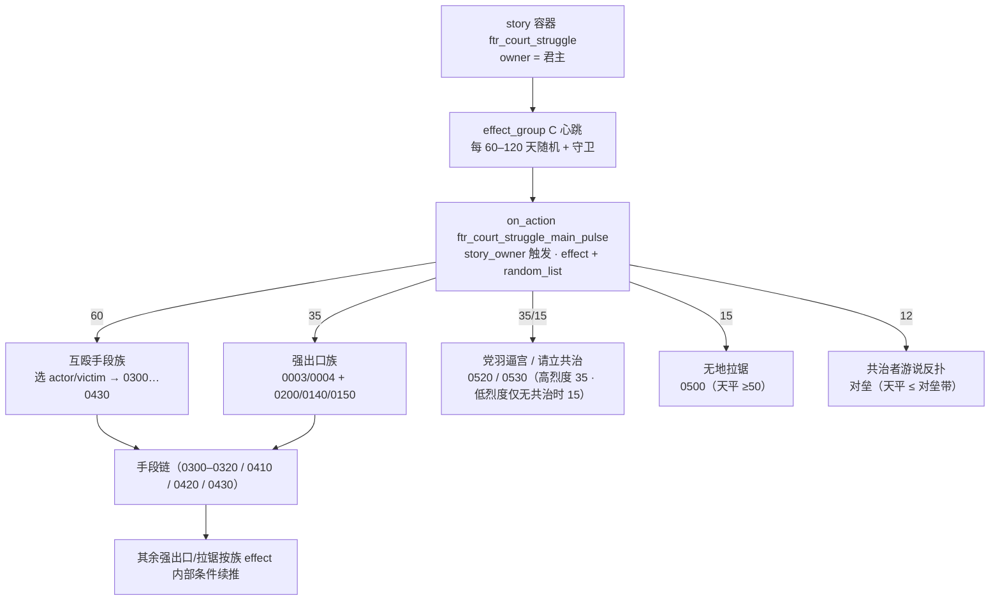

# 朝堂权力角逐（Court Struggle）系统设计

> 本文件是「朝堂权力角逐」系统的**唯一设计出处**。
> **修改任何相关脚本代码前先读本文件，改完代码后必须同步更新本文件。**
>
> 对应议题：议题 1（继任者之争）、议题 2（共治夺权）。
> 议题 3（异族异教）、议题 4（对外战争）不在范围内。
>
> **定稿口径**：本系统以 **烈度（0–200）+ 60–120 天内斗主时钟** 为唯一推进架构；**权力天平统一 0–100（50 中性）**。
> **编写约定**：见 AGENTS §3.9（只留最终结论、不留占位描述；语法写进 `document/` 语法文档、约定写进 AGENTS）。

---

## 1. 目标与范围

### 1.1 设计目标

在**独立王国 / 帝国 / 霸权**级别政权内部，模拟一场围绕大位的持续权力角逐：

- **议题 1 — 继任者之争**：潜在继任者（子女/手足/继承顺位者）**自愿选择参与角逐**（上限 5 人），以「竞争力评分」排名，彼此排挤、拉拢支持者；势均力敌时爆发政变或内战。
- **议题 2 — 共治夺权**：君主因年老体衰或精神异常不能正常履职时，权臣与潜在继任者尝试获取共治权力乃至夺取大位；保皇派与拥立派围绕「权力天平」拉锯，双方以官位、契约为筹码争取支持者。

**设计核心**：继任者**主动选择是否参与**角逐。最高统治者、共治者与参与角逐的继任者同为可被支持的「权贵」，各自拥有支持者列表。GUI 展示君主与共治者的支持者；story 面板可视化用 `character_list` 横向展示参与角逐的继任者头像。

### 1.2 准入条件（本节是唯一出处，§12 引用此处）

由 `ftr_court_struggle_valid_trigger` 统一判定，三条必须同时满足：

| 条件 | 实现 |
|---|---|
| 独立政权 | `is_independent_ruler = yes` |
| 等级 ≥ 王国 | `highest_held_title_tier >= tier_kingdom` |
| **主头衔存在继承顺位** | `primary_title = { any_title_heir = { always = yes } }` |

附加限制：`is_ruler = yes`、未被囚禁、非战时、不在冷却期内。
准入只要求主头衔继承顺位非空即触发，无需候选人达标或君主衰弱/竞争者众多。

### 1.3 触发入口与参与者

**Story cycle 的 `owner` 恒为在位君主**，君主是系统唯一持有者。

| 身份 | 参与方式 |
|---|---|
| 君主 | 作为 recipient 被请愿共治 / 表态支持（含被背书）|
| **参与角逐的继任者** | 事件 0230 选择参与（+`ftr_court_participating`）→ 内斗出手 / 0140 政变·起兵 |
| **明确不参与者** | 事件 0230 选择不参与（+终身 `ftr_court_declined_contest`，防止被他人主动支持） |
| 权臣 | 请愿共治、废黜昏君（0150）、参与拉锯事件（0500） |
| 无地廷臣 | **仅事件路径**（0200 站队、0140 择主起兵）——无地者不能主动发起交互 |
| 其它封臣 | 事件 0200 站队、被拉锯事件派发（0500）、战时响应召集 |

故事启动后自动触发事件 0230 询问利益相关方是否参与角逐：
- **血缘继承**：询问君主子女 / 兄弟姐妹（按性别继承法 `ftr_court_gender_succession_allows_trigger` 过滤）。
- **性别规范判定（2026-09，三源合一）**：某性别是否「偏向」，综合 **① 头衔继承法（君主主头衔）② 信仰教义 ③ 文化参数** 三源（任一源偏向即算偏向；多源冲突则两性同受抑）：
  - **硬性排除**（`ftr_court_gender_succession_allows_trigger`）：仅当**严格限定某性别**时排除对立性别——头衔法 `male/female_only_law`、或文化参数 `male/female_only_inheritance`；`*_preference` / `doctrine_gender_*_dominated` 一律**不再硬排除**。
  - **软性抑制**（`ftr_court_gender_norms_oppose_trigger`）：凡偏向某性别（law / culture 的 `*_preference`、`*_only`，faith 的 `doctrine_gender_*_dominated`），对立性别者**仍可入局、但 AI 意愿下调**——0230.a（参与角逐）与 0701.a（重回角逐）的 `ai_chance` 各 `-35`。
  - 三源判据助手：`ftr_court_realm_gender_favors_male/female_trigger`（偏男 / 偏女）、`ftr_court_realm_gender_only_allows_male/female_trigger`（严格仅某性别）。
- **选举继承**：按主头衔继承顺位依次询问。
- 参与上限 5 人；已明确不参与者不再询问。
- 定期（30–60 天随机）刷新 `ftr_court_launch_participation_asks_effect`：给未表态且未拒绝的潜在继承人一次选择机会。
- 0230 参与询问**不设 `is_landed` 门槛**：无地皇子/无地继承顺位者同样能入局（进入 `ftr_court_claimants`，评分并按评分参与排序）。无地者不能主动发起交互与决议，一切主动出手依赖事件（约束见 §9.0）。

---

## 2. 技术选型：故事循环

| 方案 | 结论 | 理由 |
|---|---|---|
| **局势 Situation** | ❌ | `sub_regions` 绑定静态地理区域（上限 255 且不可重叠），无法按政治实体开实例。 |
| **故事循环 Story Cycle** | ✅ | 绑角色（`owner` = 君主）、可多实例（全球每个王国各持一个）、`on_owner_death` 对应「君主驾崩重洗牌」、`visualization` 原生支持名单与拉锯条。 |
| **纯脚本状态机** | ❌ | 无原生面板、无生命周期管理、清理易泄漏。 |

**子议题驱动模型**：议题 1 与议题 2 共存于同一 story 实例，不设独立开关：

- 议题 1 由 **烈度** `ftr_court_struggle_intensity`（0–200）驱动
- 议题 2 由 **权力天平** 官方 `diarchy_swing`（0–100，50 中性）驱动

两议题共享参与者、支持者记账与政治资源。

### 2.1 关键接口（原版实测确认）

| 用途 | 接口 |
|---|---|
| 启动故事 | `create_story = <key>`（角色域执行，owner = 当前角色；原版无 `start_story`） |
| 结束故事 | `end_story = yes` |
| 防重复 | `any_owned_story = { type = <key> }` |
| 排序遍历列表 | `ordered_in_list = { variable = X  order_by = <script value 或数值> }`（court 名单是 variable list，遍历用 `variable =`） |
| 「有兵」判定 | `max_military_strength > 0`（**没有** `has_army`） |
| 列表长度 | 判断用 `variable_list_size = { name = X value … }`；数值计数引用对应 `*_count_value`（不用 `list_size:`） |
| 无地头衔 | `create_dynamic_title` + `set_landless_title` + `set_delete_on_destroy` |
| 剥夺继承权 | `disinherit_effect = { DISINHERITOR = <君主 scope> }`（在被剥夺者域执行） |
| 停战协定 | `add_truce_both_ways = { character = X  days = N  war = W  result = R }` |
| 宣战 | `start_war = { casus_belli = X  target = Y }` |
| 拉人入战 | `scope:war = { add_attacker / add_defender = scope:X }` |
| 内阁实授 | `assign_appropriate_councillor_position_effect = { NEW_COUNCILLOR = X }` |
| 强权封臣 | `is_powerful_vassal = yes` |

---

## 3. 双驱动机制

### 3.1 烈度系统（议题 1，0–200）

`var:ftr_court_struggle_intensity` 范围 **0–200**（默认 0；参与者加入或手段成功后上升）：

| 区间 | 命名 | 局面定性 | 手段池与派发档 |
|---|---|---|---|
| 0–40 | 平静 / 潜伏 | 竞争暗藏、尚无公开冲突 | 不派发互殴手段（静默期） |
| 40–90 | 酝酿 | 竞争者开始结党、拉拢支持 | 文明争斗族（弹劾 / 论战 / 名分之争） |
| 90–140 | 对立 | 公开倾轧、势均力敌 | 手段档 ①（0300 放谣 / 0410 牵制 / 0200 站队） |
| 140–170 | 濒危 | 剑拔弩张 | 手段档 ②（0310 伪造 / 0420 绑架 / 0430 谋杀 / 0140 政变·起兵） |
| 170–200 | 临界 | 局面一触即发 | 手段档 ③（0320 下毒 / 0150 废黜昏君） |

阈值常量（`ftr_court_struggle_values.txt`）：`ftr_court_intensity_quiet_bound_value = 40`、`ftr_court_intensity_stir_bound_value = 90`、`ftr_court_intensity_high_bound_value = 140`、`ftr_court_intensity_critical_bound_value = 170`。

**烈度驱动源**：
- 内斗手段成功 → 按档加烈度：`ftr_court_strife_low_intensity_value = 8`、`ftr_court_strife_mid_intensity_value = 20`、`ftr_court_strife_high_intensity_value = 35`。
- **交互层党争摩擦**（§7.3）：`ftr_charge_interaction` / `ftr_sow_discord_interaction` 在**发起者与目标各自都有背书对象**时，抬升烈度 `ftr_court_interaction_clash_intensity_value = 4`（两交互均 `auto_accept`，**发起即生效**）。落点 `ftr_court_realm_intensity_add_effect = { OTHER = 对方  AMOUNT = … }`：**仅当双方最高领主为同一人、且该领主持有朝堂角逐故事循环**时，给该政权的 story 烈度加值（跨政权或该政权无故事一律不加）。
- 参与者加入（0230.a / `ftr_court_join_contest_effect`）→ 抬升烈度（`ftr_court_on_participant_join_effect`）。
- 君主状态偏置（衰弱 / 失能 → `ftr_court_intensity_weak_bias_value = 6`；声望充足强势 → `ftr_court_intensity_strong_bias_value = −4`）。
- 竞争者支持者差距悬殊或前两名评分接近 → `ftr_court_intensity_tension_bias_value = 8`。
- 年度自然回落 `ftr_court_intensity_yearly_decay_value = 2`，向 0 回归，防单向锁死。
- 缓和决议成功 → 一次性下调 `ftr_court_ease_intensity_drop_value = 40` × **君主外交乘数**（`ftr_court_ease_diplomacy_multiplier_value`，§10）：外交 10 = 基准 1.0；<10 每点 −0.025（外交 0 → 0.75）；>10 每点 +0.075（外交 ≥30 封顶 **2.5**）。实际降幅区间 **30–100**。

> **死区规避（实测修正）**：内斗手段族只在烈度 ≥90 时才能出手，而拉升烈度的手段本身也在门内——若门外的自增（张力）弱于门外衰减，烈度会钉在 40–90 永不回升。故**张力 4→8、年衰减 5→2、缓和降幅 80→40**，使「门口净增速」为正、且缓和不再把系统砸进死区。
> **2026-09 更新**：死区问题已由其它手段修复，故高外交侧加成上调——外交乘数上限由 1.4 提到 **2.5**（外交 30 时降幅 100，即一次可从临界 170 直落到 70）。

### 3.2 权力天平（议题 2，0–100，50 中性）

天平已**迁移至官方 diarchy swing**（`diarchy_swing`，引擎 0–100：0 = 君权完全稳固、50 = 中性、100 = 共治完全得势）；移动统一调用官方 `update_diarchy_swing_with_perspective_effect`，自然回落由官方 `swing_balance` + `DIARCHY_MONTHLY_POWER_CHANGE`（0.25）维护。触发阈值（`ftr_court_struggle_values.txt`）：

| 值 | 含义 |
|---|---|
| 0 | 君权稳固（下限） |
| 30 | ≤30 视为「君主强势」（`ftr_court_loyalists_hold_trigger`，只读判定） |
| 50 | 中性；**拉锯事件 0500 的派发门槛**（2026-09 起，原取 70） |
| 70 | 强权下沿：请愿落地时的初始天平另取 80（`ftr_court_petition_regency_initial_swing_value`，见 §7.1）。**太子立储另设两档初值**：主动立储（指定继承人）= 10、被逼立储（请愿・逼宫）= 40（03 §2.2 / §6） |
| 90 | ≥90 且君主失能 → 打开「废黜昏君」窗口（`ftr_court_can_attempt_usurp_trigger`） |

> **请愿门槛（2026-09 调整）**：请愿仅在「朝中尚无共治者」时开放（交互 `is_shown` 独占限制）；天平是 diarchy 的属性、**无共治时恒为 0**，故不参与判定。**已移除「烈度 ≥ 90」门槛**，并进一步放宽为**「存在朝堂角逐故事 + 君主有合法继承人」**（2026-09；原「参与者达标」要求亦撤，`ftr_court_has_legitimate_heir_trigger` 见 §7.1-8）。`is_shown` 仍以**君主失能**为可见前提（`ftr_court_monarch_infirm_trigger` = 精神 / 感官特质 + **健康类** `infirm` / `fragile_bones` / `incapable` / `health ≤ poor` + 高龄 ≥ 60）。君主裁决时会权衡请愿者阵营军力，**拒绝使烈度 +25**。落地规则见 §7.1。

**变动来源**（单次移轴 ±5 量级，统一经 `update_diarchy_swing_with_perspective_effect`）：

| 来源 | 幅度 | 说明 |
|---|---|---|
| 拉锯事件 0500（暗中策动） | −5 | 天平 ≥50 且存在共治者时派发（无地参与者，**85%** 成功；亦可花 60 金收买共治者左右；「静观其变」权重已由 20 降到 10） |
| 游说对垒（共治者反扑；2026-09 **取代事件 0510**） | +5 / −5 | **任意天平值**均可启动（无档位门槛；前置仅「共治者党羽不落后于君主」）：双方各随机抽一名党羽按「智谋 + 外交」对垒，胜方推动 ±5；政权 2 年 / 参战者 3 年冷却；结果发**事件通报**（`ftr_diarchy.0800` / `0801`，仅确认选项） |
| 请愿获准（事件 0220.a） | +5 | 君主允诺共治（落地后再推轴） |
| 引擎月度回落 | 0.25/月 | 向该类型的 `swing_balance` 收敛 |
| 君主 / 共治者摆动天平（原版 `swing_scales_currency_interaction`） | −20 / +10 | 冷却 2 年。君主侧因太子类型带 `lieges_swing_more_against_diarchs` 为 **−20**（带 `power_at_home` 特性且在旅途中 −30）；共治者侧 +10（同前条件 +20）。**太子类型不带 `liege_may_voluntarily_cede_authority`**，故窗口内不再出现「自愿让权」选项（原为给共治者 +20/+30/+40） |
| 03 季度背书 drift | 封顶 +1 ~ −3/季 | 净背书领先数 × 1，**君主党羽按 1.5 折算**；**正值须加权领先 ≥ 2** 才生效、负值无门槛（`ftr_diarchy_backer_swing_drift_value`，03 §7.2） |

---

## 4. 系统架构

### 4.1 Story 容器与生命周期

单一 story cycle 类型 `ftr_court_struggle`，挂在最高统治者身上（`common/story_cycles/ftr_court_struggle.txt`）：

```
ftr_court_struggle (story cycle, owner = 最高统治者)
├── on_setup        初始化变量、启动参与询问（0230）与开始通知（0001）
├── effect_group A  年度维护（1 年）：天平自然回落、烈度年度维护
├── effect_group B  参与者询问刷新（30–60 天随机）
├── effect_group C  内斗主时钟（60–120 天随机，§4.3）：只留心跳，选族交 on_action 池
├── on_owner_death  驾崩 → end_story（清理统一交给 on_end）
└── on_end          清理临时头衔、变量与 flag（ftr_court_cleanup_effect）
```

每个 effect_group 均有 `fallback = { end_story = yes }`（政权不再符合准入即收场）。

> **事件触发必须写成 `owner = { trigger_event = ... }`**：`trigger_event` 的 root 取当前作用域，直接调用会让 root 变成故事本体。例外：0150 的 root 应为权臣本人，故对 `scope:ftr_court_usurper` 直接触发。

### 4.2 on_action 调度（`ftr_court_on_actions.txt`）

| 钩子 | 挂载点 | 作用 |
|---|---|---|
| `ftr_court_try_start_on_action` | `random_yearly_everyone_pulse` | 为符合条件的新君建立故事 |
| `ftr_court_validate_on_action` | `random_yearly_everyone_pulse` | 政权失效（被征服/降级/绝嗣）时收场兜底 |

设计原则：story 建立后的所有推进全部交给 effect_group；on_action 只负责**准入创建、收场兜底**。君主驾崩后新君是否重启角逐由下一年度检查处理——避开继承结算时序风险。

### 4.3 内斗主时钟（唯一推进源）

`effect_group C` 每 **60–120 天**（`ftr_court_strife_interval_min_value/max_value`）触发一次，但**只做校验与心跳**：守卫通过后 `story_owner = { trigger_event = { on_action = ftr_court_struggle_main_pulse } }`；on_action 以 `effect + random_list` **每拍按权重随机选一族**，直接调用各族既有 effect（root = story_owner，经 `every_owned_story` 定位故事）完成选角与概率派发。

```
心跳守卫（effect_group C）：
  政权仍准入（ftr_court_struggle_valid_trigger）
  参与者 ≥2（ftr_court_has_active_struggle_trigger）
  君主不在缓和休战期（无 ftr_court_eased_struggle）
  （**不含烈度门槛**：烈度由池内各族 trigger 自行排除，故低烈度拍同样进池）

选族（on_action ftr_court_struggle_main_pulse：求值域落到 story，random_list **按烈度分档**；
      外层 4 档由互补 trigger 互斥、每拍恒中恰一档，档内一行为一个族，自带 trigger 做排除）：
  · 低烈度（<90）  ：文明 100 ＋ 空过 100（＋ 无共治时请立共治 50）
  · 对立（90–139）：互殴 55 / 强出口 50 / 逼宫 50 / 拉锯 50 / 反扑 50 / 文明 50 / 空过 90
  · 濒危（140–169）：互殴 85 / 强出口 75 / 逼宫 50 / 拉锯 50 / 反扑 50 / 文明 30 / 空过 55
  · 临界（≥170）  ：互殴 120 / 强出口 95 / 逼宫 60 / 拉锯 50 / 反扑 50 / 文明 20 / 空过 25
  ⇒ 临界档：互殴 28.6% · 空过 6%；濒危档：互殴 21.5% · 空过 13.9%
  （注：分档权重直接写在 on_action 表内，不入 script_values；语法原因见 [03](../03-触发器与效果.md) §13.3）
```

**互殴手段族内部档位（由族 effect 在 actor 域命中，保留静默率；每轮至多命中一条）**：

| 烈度档 | 手段入口 | 强出口（族 effect 内独立分支） |
|---|---|---|
| 90–139 | 0300 放谣（40%）/ 0410 牵制（35%）→ 出手 75% | — |
| 140–169 | 0310 伪造（30%）/ 0420 绑架（30%）/ 0430 谋杀（30%）→ 出手 90% | 0200 站队（存在未站队者时）；0140 推给竞争力最高且未询问者 |
| 170–200 | 0320 下毒（35%）/ 0430 谋杀（35%）/ 0420 绑架（25%）→ 出手 95% | 0200；0140；0150（天平 ≥90 且君主失能 → 推给朝堂最强势力） |
| 0–90 | 不派发互殴手段 | **文明争斗族**（M1 弹劾 25 / M2 立场辩论 22 / M3 名分之争 18 / M4 司法决斗 15 / M5 清议 12 / M6 祥瑞 8；2 年节流；M5 非行政类政体内部回落 M2）+ **党羽请立共治**（低烈度档 50 权重，仅在尚无共治时） |
| ≥90 | 上表各档（脏手段 + 强出口 + 拉锯） | 文明族按档递减（对立 50 → 濒危 30 → 临界 20），高烈度亦可触发低烈度事件 |



> 手段 2.2 / 2.6 不进入 actor→victim 派发，各有独立入口（见 §7.1、§7.3、§9.2、§9.6）。

### 4.4 面板可视化（story `visualization`）

| 组件 | 绑定 | 说明 |
|---|---|---|
| `character_list` | `ftr_court_participant_list` | 参与角逐者名单（最多 5 人） |
| `basic_counter` | `ftr_court_struggle_intensity` | 烈度进度（0 平静 ↔ 200 临界） |
| `custom_string_key` | `FTR_COURT_STRINGS` | 面板说明文案 |
| `decisions` | `ftr_court_ease_struggle_decision`<br/>`ftr_diarchy_abolish_crown_prince_decision` | 面板内决策按钮，由官方 story 面板渲染、君主可直接点击办理，引擎处理可点/灰显与执行：① 缓和内部矛盾一键入口（§10）；② **废太子**（03 §3.2）——仅君主已是「太子共治」时出现，可见/可用由决议自身 `is_shown` / `is_valid` 决定，面板不重复设条件 |

烈度 ≥140 时图标切换为征服者剑图标，其余用宫廷政治图标。**权力天平（议题 2）不自建面板条**——swing 迁至官方 diarchy 体系后由官方共治面板呈现（§3.2）。

### 4.5 窗口数据同步（个人变量列表方案）

参与者与支持者数据**主存储放在角色（权贵）的个人变量列表上**，GUI 与 story 都从角色身上获取：

- **参与者列表主存储**：最高统治者身上的 `ftr_court_claimants`。角色参与（事件 0230）时直接写入并同步到 story 的 `ftr_court_participant_list`（供 story 逻辑与侧栏可视化），无定期同步。
- **支持者列表主存储**：各权贵身上的 `ftr_court_supporters`。站队时把自己加入被支持者的 `ftr_court_supporters`；退出 / 转投时从旧主列表移除自己。

**GUI 同步链路**（`ftr_court_sync_ui_data`）：
1. `ftr_court_sync_ui_from_story_effect`：`ftr_court_claimants` → 玩家域 `ftr_court_ui_claimants`，并计算 `ftr_court_ui_count`。
2. `ftr_court_sync_courtiers_effect`：各权贵的 `ftr_court_supporters` → 玩家域 `ftr_court_ui_monarch_backers` / `ftr_court_ui_diarch_backers` / 各参与者 `ftr_court_heir_backers`。
3. GUI 读取玩家域列表及各参与者身上的 `ftr_court_heir_backers`。

任何角色打开窗口都读到最新数据。

---

## 5. 数据模型

### 5.1 Story 域变量

| 变量 | 类型 | 用途 |
|---|---|---|
| `ftr_court_struggle_intensity` | int 0–200 | 烈度（阶段判定唯一依据） |
| `ftr_court_candidate_count` / `ftr_court_participant_count` | int | 参与角逐人数（上限 5，两值保持一致） |
| `ftr_court_participant_list` | char list | 参与角逐者名单（参与事件直接写入，无定期同步） |

### 5.2 角色域变量

| 变量 | 挂在谁身上 | 用途 |
|---|---|---|
| `ftr_court_backer_of` | 支持者 | 我支持谁（站队记账） |
| `ftr_court_claimants` | **最高统治者** | 参与角逐者列表（主存储） |
| `ftr_court_supporters` | **权贵（君主/共治者/参与者）** | 各权贵的支持者列表（主存储） |
| `ftr_court_temp_duchy` | 起兵者 | 临时独立公国引用（战后回收） |
| `ftr_court_rebel_target` | 起兵者 | 起兵目标君主（起兵者独立后失去 top_liege/employer，供触发器回溯朝堂故事；收场清除） |
| `ftr_court_strife_actor` | victim（当次） | 攻击者引用（手段事件写入，供结果事件读取） |
| `ftr_court_strife_victim` | actor（当次） | 目标引用（调度写入，供手段入口读取） |

> 记账约定：站队记在支持者身上（`ftr_court_backer_of`），支持者名单记在被支持权贵身上（`ftr_court_supporters`）。

### 5.3 角色 flag

| flag | 时限 | 用途 |
|---|---|---|
| `ftr_court_participating` | 故事存续期 | 选择参与角逐 |
| `ftr_court_declined_contest` | 终身 | 明确不参与 |
| `ftr_court_asked_participation` | 刷新清除 | 已被询问参与 |
| `ftr_court_cooldown` | 5 年 | 危机结算后冷却 |
| `ftr_court_disinherited` | 永久 | 已被剥夺继承权 |
| `ftr_court_asked_stance` | 3 年 | 已被询问站队（防骚扰） |
| `ftr_court_asked_to_rebel` | 3 年 | 已被询问起兵（防骚扰） |
| `ftr_court_asked_usurp` | 3 年 | 已被询问废黜（防骚扰） |
| `ftr_court_arrest_succeeded` | 事件内临时 | 0110.b 逮捕成功标记（互斥失败兜底判定，用毕移除） |
| `ftr_court_strife_active` | 1–2 年 | actor 出手冷却（调度过滤近期待触发者） |
| `ftr_court_strife_lying_low` | 2 年 | victim 隐忍（后续易被针对的弱态） |
| `ftr_court_has_leverage` | 5 年 | 持有把柄（0410.a 生产，0411/0412 消费） |
| `ftr_court_coerced` | 2 年 | 被绑架胁迫（0420.a 生产，0421 抉择消费） |
| `ftr_court_eased_struggle` | 休战窗口 | 缓和决议后休战期（期间主时钟不派发手段） |
| `ftr_court_targeted` | 事件内临时 | 当次手段锁定对象 |
| `ftr_court_coup_ask_cooldown` | 2 年 | 0160 临界政变征询防骚扰（同意 / 拒绝均打） |
| `ftr_court_rebel_troops_spawned` | 起兵期间 | 起兵精锐部队已生成（`on_declaration` 兜底去重；收场清除） |

### 5.4 竞争力评分（议题 1 的排名依据）

**不使用真实继承顺位**（原因见 [10 法律与继承](../10-法律与继承.md) §E）。`ftr_court_claim_strength_value` 构成：

| 维度 | 分值 |
|---|---|
| 年龄 | 成年 +20，青壮年(16–45) +10，老年 −10 |
| 能力 | 五维平均值 × 2 |
| 特质 | ambitious +30、genius +20、brave +10；content −30、craven −20、incapable −100、lunatic −25 等 |
| **实时硬实力** | 头衔等级（皇帝 +45 / 国王 +30 / 公爵 +15 / 伯爵 +5）、兵力（最大军力 ×0.01）、威望等级（每级 +6）、影响力（行政制每 100 影响力 +1） |
| 身份地位 | 内阁 +15、共治者 +40、配偶 +10、法定继承人 +25 |
| 君主好感 | ≥50 → +15；≥0 → +5；<0 → −10 |
| 支持者 | 每人 +5 |

最终 `min = 0` 防负分（`min` / `max` 的语义区别见 [04 修饰符与数值计算](../04-修饰符与数值计算.md) §8.1）。用于竞争者排序、选头目、事件 0140 选劝说对象、0400 取头号竞争者等。

> **评分不落快照**：排序 / 选头目处一律**实时求值**本 script value（`order_by = ftr_court_claim_strength_value`），评分随头衔、兵力、威望、影响力动态浮动。求值需候选人为 `this`、`scope:ftr_court_monarch` 指向在位君主；在 story 域排序前须先 `story_owner = { save_scope_as = ftr_court_monarch }`（`order_by` 的域要求见 [04](../04-修饰符与数值计算.md) §8.1）。

### 5.5 修饰符与好感修正

**Character modifiers**（`ftr_court_modifiers.txt`）：

| modifier | 用途 |
|---|---|
| `ftr_court_struggle_ongoing` | 角逐进行中国力内耗（prestige −0.1/月）；已定义但未在运行逻辑中挂载 |

**Opinion modifiers**（`ftr_opinion_modifiers.txt`）：

| modifier | 数值 | 场景 |
|---|---|---|
| `ftr_court_backer_opinion` | +15 | 曾拥戴我 |
| `ftr_court_loyalist_opinion` | +25 | 获君主宽赦（事件 0130.d） |
| `ftr_court_rival_claimant_opinion` | −30 | 曾拥戴我的对手 |
| `ftr_court_betrayed_opinion` | −50 | 背弃／赖账 |

---

## 6. 战争：继位内战

### 6.1 CB 设计（`ftr_succession_war`，组 `ftr_civil_war`）

> **储君不造反（2026-09 修复）**：`ftr_court_can_declare_succession_war_trigger` 追加 `NOT = { ftr_court_is_designated_heir_of_realm_trigger = yes }`——**已被其领主（或雇主，廷臣路径）指定为继承人（储君）的角色不得发起 01 继位内战**（其夺位出口是 03 的篡位链，见 03 §3.1「太子只能走篡位线」）。原因：立储时会把有地封臣「辞官回宫」→ 变成无地者，恰好满足 01 的无地起兵条件（`ftr_court_landless_rebel_valid_trigger` 要求 `is_landed = no`），危机档事件 0140 随即推给他 → 受立后当场宣战。

| 参数 | 取值 | 说明 |
|---|---|---|
| `target_titles` | `none` | 目标是整个政权而非某个头衔 |
| `landless_attacker_needs_armies` | `no` | 无地皇子不会因无兵自动判负 |
| `ai_only_against_liege` | `yes` | 仅封臣对宗主 |
| `white_peace_possible` | `no` | 造反不能白和平（§6.4） |
| `on_primary_attacker_death` | `inherit_faction` | 主攻方死亡后阵营不崩盘 |
| `cost` | 威望 350 | 发动门槛 |
| `allowed_against_character` | 封臣对宗主 **或** 独立同宗持临时独立公国 | 无地者先建独立公国脱离臣属，故走第二分支 |

### 6.2 起兵准备：临时独立公国 ＋ 精锐部队（对齐原版民粹起义）

起兵顺序固定为 **临时头衔 → 部队 → 宣战**（`ftr_court_prepare_rebellion_effect`）：

| 阶段 | 位置 | 说明 |
|---|---|---|
| ① 临时独立公国 | `ftr_court_prepare_rebellion_effect`（0110.b / 0120.a / 0140.a / 0160.c） | **仅无地者**：`ftr_court_create_temp_duchy_effect` 建公国 → `create_title_and_vassal_change(type = independency)` + `becomes_independent`，**脱离对君主的臣属**（独立头衔）。**建好后另起一块 `generate_coa = yes` 补盾徽**——`create_dynamic_title` 生成的头衔默认**无 CoA**（空盾）；原版惯例要求 `generate_coa` 在头衔已有持有者之后调用（见 `casus_belli_types/01_fp1_wars.txt:709-712` 注释） |
| ② 精锐部队 | 同上 → `ftr_court_spawn_rebel_troops_effect` | 重装步兵 / 重装骑兵各 `ftr_court_rebel_maa_stacks_value` 队（**随时代递增**：部族 / 867 = 3、早期 4、高级 5、晚期 6，按 `has_cultural_era_or_later` 判定起兵者文化时代）＋ 攻城器械 `ftr_court_rebel_siege_stacks_value(1)` 队（投石机 / 射石机 / 抛石机，按已发现革新）；出兵地 = 临时公国首都，兜底君主首都 |
| ③ 宣战 | 同上 → `start_war` | CB `ftr_succession_war` |
| 兜底 | CB `on_declaration` | 漏建头衔则补建；未生成部队则补生成（`ftr_court_rebel_troops_spawned` flag 去重） |

创建内容（`ftr_court_create_temp_duchy_effect`）：`create_dynamic_title`（tier = duchy，名 `FTR_COURT_TEMP_DUCHY_NAME`）→ `set_landless_title` / `set_destroy_on_succession` / `set_delete_on_destroy` / `set_no_automatic_claims` → 首都取王国境内随机伯爵领 → `change_title_holder` → **独立事务** → 记入 `ftr_court_temp_duchy`。

**有地起兵者不建临时公国**（否则其真实领地会一并脱离王国），但同样获得 ② 的精锐部队。

**收场**：临时公国的销毁效果（`ftr_court_revoke_temp_duchy_effect` / `ftr_court_destroy_temp_duchy_effect`）内部统一调用 `ftr_court_return_from_rebellion_effect`——清 `ftr_court_rebel_target` / `ftr_court_rebel_troops_spawned`，无地者 `set_employer` 回到目标君主宫廷，避免遗留「无地独立统治者」。因此覆盖 `on_victory` / `on_defeat` / `on_white_peace` / `on_invalidated` 以及 story 清理、退赛、死亡三条内务路径。

**触发器回溯**：起兵者独立后失去 `top_liege` / `employer`，`ftr_court_own_struggle_in_crisis_trigger` 增加第三路 `var:ftr_court_rebel_target`（起兵时存入目标君主），保证 `ftr_court_can_declare_succession_war_trigger` 在独立后仍成立。

### 6.3 支持者响应

宣战时自动召集（以 `is_participant_in_war` 查重）：
- **叛乱方**：`ftr_court_call_backers_to_war_effect` → 站队对象 = 起兵者且有地者 → `add_attacker`
- **保皇派**：`ftr_court_call_loyalists_to_war_effect` → 未站队或站队对象非起兵者、且对君主好感 ≥ 0 → `add_defender`

### 6.4 造反不能白和平（核心规则）

**叛乱只有三种结局：胜、败、战争失效。不存在「打完握手言和」。**

| 结局 | 处理 |
|---|---|
| **胜利** `on_victory` | `ftr_court_usurp_throne_effect`（夺位 + 囚禁 + 清算链 0100→0110→0120 + 冷却 + 收场） |
| **失败** `on_defeat` | 剥夺继承权 + 声望 −300 / 虔诚 −100 + 双向停战 1825 天 + 事件 0130（终身监禁 / 流放 / 处死 / 宽恕）；君主侧加 5 年冷却 |
| **失效** `on_invalidated` | 仅回收临时头衔，不追究 |
| ~~白和平~~ | 不可达。`on_white_peace` 保留为引擎异常兜底，按失败同等代价处理 |

---

## 7. 交互与支持者工具箱

### 7.1 朝堂交互与决议（`ftr_court_interactions.txt` / `ftr_court_struggle_decisions.txt`）

**核心限制：无地廷臣不能主动发起角色交互**，其参与一律依赖事件（§7.2）。下表交互 actor 均要求 `is_landed = yes`；**表态支持已由交互改为决议**（见下行）。

| 交互 / 决议 | 议题 | 作用 | 天平(0–100) | 无地者 |
|---|---|---|---|---|
| `ftr_court_declare_backing_decision`（→ 事件 0200） | 1 | 主动表态支持：可选目标 = **前五候选 + 君主 + 共治者**（后两者为独立选项，候选位重复时去重）；经 0210 由被支持者首肯后落地；改投新主有惩罚 | — | ✅ 事件 0200（含被推送路径） |
| `ftr_court_withdraw_backing_interaction` | 1 | 撤回支持（**2026-09：`auto_accept = yes`、取消 `ai_accept`**——撤回是单方行为，被支持者无从拒绝；AI 是否撤销改由 `ai_will_do` 按关系判定，见下） | — | ❌ 无事件路径 |
| `ftr_court_petition_coregency_interaction` | 2 | 奏请共治（门槛见下；**获准后真正建立共治**：指定继承人 → 太子，否则请愿者 → 摄政） | +5（获准） | — |
| `ftr_court_persuade_backing_interaction` | 1 | 劝人背书（02 功勋驱动）：游说同僚公开拥立自己所支持之人 | — | — |

> 主动移轴不设交互：拉锯由事件 `0500` 与「党羽游说对垒」（`ftr_diarchy_backer_lobby_pk_effect`，§9.6）承担。权贵争取支持的回报走个人功勋论赏（`02-功勋系统设计.md`），见 §8.2。

**撤回支持的关系化 AI 意愿（2026-09）**：`ftr_court_withdraw_backing_interaction.ai_will_do` 除既有「对目标好感 < 20 → +40」外，按**双方关系**分档——**朋友 −30 / 挚友 −50 / 姻亲 −20**（更不易撤销）；**敌人（rival）+30 / 死敌（nemesis）+50 / 怨恨者（grudge）+25**（更容易撤销）。姻亲判定 = 「配偶与目标为近亲」或「本人近亲与目标结为配偶」（`any_spouse.is_close_family_of` / `any_close_family_member.any_spouse`）。

**党羽征召入派系（2026-09 新增）**：覆盖原版 `force_join_faction_interaction`（`ftr_override_interations.txt`）新增一个 `send_option`（flag `ftr_court_backer`，本地化 `ftr_court_backer_force_join_option`）——**角逐中的竞争者**（`ftr_court_is_active_claimant_trigger`）可**无偿强制自己的党羽**（recipient 的 `ftr_court_backer_of` 指向 actor）加入自己所在的派系（落地沿用原版 `join_faction_forced`，锁 10 年）。准入 OR 链（行政 / 非行政两条）同步补该分支，使这条路径单独成立时交互仍可发；`send_options_exclusive = yes` 下与「人情 / 影响力 / 家主」选项并列互斥。

`ftr_court_apply_backing_effect` 的「倒戈改投」内置于记账：若已支持他人却改投新主，会破坏与旧主及其支持者的关系。资源成本为**双轨制**（双方行政制消耗官方影响力，任一方非行政制消耗威望）。

**背书目标扩展与改投摩擦（新）**：

1. **可选目标**（事件 0200）：前五候选（选项 a–e）+ **君主**（g）+ **共治者**（h）。后两者为**独立选项**——君主选项恒列（君主不会占候选位）；共治者选项仅在「存在共治者 ∧ 其非表态者本人 ∧ 其**未占前五候选位**」时出现（`ftr_court_claimant_slots_contain_trigger` 去重；**共治者与竞争者可能是同一人**，故必须去重）。三者同走 0210「拥立需得首肯」→ 接受后由 `ftr_court_apply_backing_effect` 统一记账。
2. **支持君主 / 共治者的记账特性**（沿用既有分支，无需新逻辑）：支持君主**不产拥立功勋、不触发君主通报**；支持共治者可产拥立功勋、可能被通报（interface_message，见 §7.4）。二者都写入 `ftr_court_backer_of` + 被支持者 `ftr_court_supporters`，因而**直接喂给 03 的季度背书差**（`ftr_diarchy_liege_backer_count_value` / `ftr_diarchy_diarch_backer_count_value`）与 GUI 的「君主支持者 / 共治者支持者」栏。
3. **改投摩擦（AI 更不愿频繁变更背书对象）**：
   - **选项层**（`ftr_court_back_stickiness_ai_modifier`，a–e / g / h **全部平级引用**）：「忠诚惯性」——候选 = 本方现任支持对象 → **+70**；本方已支持他人 → 其余候选 **−35**（权重直接写在 AI 块内）；
   - **决策层**（`ftr_court_declare_backing_decision.ai_will_do`）：已站队者再表态 **−35**；**刚改投过者**额外 **−40**——「刚改投」由 `ftr_court_apply_backing_effect` 改投分支打 `ftr_court_switched_backing` flag，**安定期 5 年**（`ftr_court_backing_switch_cooldown_years_value`）；
   - 原有双向好感加减（现任器重此人 → −30 ×2；现任已交恶 / 已厌弃 → +30 ×2）**保留**，供策略性换边。
4. **背书君主 / 共治者的 AI 倾向**（**专用权重**，不套用候选的通用权重——通用权重含双向好感 ×0.5、黑马、拥挤惩罚、立场契合，对在位目标不适用）：
   - **君主**（`ftr_court_back_monarch_ai_modifier`）：选项 **base 由 20 压到 5**（投资君主不如投资继承人）；**弱化双向好感**，改由 **忠顺**（`loyal` +25 / `courtly` 立场 +20）、**公正**（`just` +20）、**私人纽带**（联盟 +30 / 好友 +25 / 挚友 +35 / 情人 +35）驱动；另加两条情境加成——① **皇权受威胁**：君主已有共治者且 `diarchy_swing ≥ 50`（均势，`ftr_swing_tier_even_mid_value`）→ +25；② **主要继承人党羽太众多**（继承人自身支持者 ≥ 3，`ftr_court_backing_heir_crowd_min_value`）**且与我关系一般**（双向好感均 < 40，判为「谈不上交好」）→ +25；
   - **共治者**（`ftr_court_back_diarch_ai_modifier`）：按**共治类型分流**——① `ftr_diarchy_is_heir_co_rule_type_trigger` 成立（**太子・共治皇帝・共治君主・幼主共治**）**且与本人关系较好**（任一向好感 ≥ 40）→ +30；② **官职线共治者**（原版摄政 / 宰相 / 大秘书处等）**且本人与君主关系不好**（任一向好感 < 0）→ +25；③ **私人纽带**（联盟 +30 / 好友 +25 / 挚友 +35 / 情人 +35）——本项**不分类型**、可叠加。
5. **仅约束 AI**：以上摩擦与倾向只进 AI 权重，不改交互 / 选项的可见性与触发条件，玩家仍可自由表态与改投。

> 相关常量集中在 `ftr_court_struggle_values.txt`（改投摩擦 4 项 + 君主/共治者倾向 15 项 + 2 个分界值 + 共治请愿补偿/收敛 2 项）；`ftr_diarchy_is_heir_co_rule_type_trigger` 定义在 `ftr_diarchy_triggers.txt`（03）。

**共治请愿落地规则**（新；事件 `ftr_court_struggle.0220` 允准分支调用 `ftr_court_establish_coregency_effect`——01 效果文件，求值域 = 君主，参数 `PETITIONER` = 请愿者）：

1. **定授权对象**（2026-09 定案，**替代原「太子优先」**；**顺序不可颠倒**）：① 请愿者若有**背书对象**（且非君主本人）→ **授其背书对象**——"为他人请愿"时席位**不得被请愿者自己取走**（初版误把「actor 是参与者」排在前面，导致请愿者本人顶替其被背书者受封，已修正）；② 否则 → **授请愿者本人**（自身即角逐竞争者 / 无背书对象的兜底）。落地作用域变量 `ftr_court_petition_grantee`；
2. **按对象属性分流类型**：授权对象属**合法继承人之一**（`ftr_court_is_legitimate_heir_of_trigger`：主头衔继承顺位上的非私生 / 未被剥夺者）→ 复用 03 的 `ftr_court_establish_champion_coregency_effect` 按政体分流——**罗马 / 欢呼法 → 共治皇帝 `co_emperorship`｜其他行政制 → 太子 `ftr_diarchy_crown_prince`｜其他政体 → 共治君主 `co_monarchy`｜缺省 → 固化摄政**（**初值分流**：太子 = **40**（被逼立储基线）`ftr_diarchy_crown_prince_imposed_initial_swing_value`；其余类型 = **80** `ftr_court_backer_demand_initial_swing_value`）；授权对象**不属**继承人线 → 走第 3 步 `regency`；
3. **回退摄政**：由**授权对象**（非必然请愿者）取得原版摄政位——`try_start_diarchy = regency` + `set_diarch = 授权对象`，天平**直接置于强权上沿**（`ftr_court_petition_regency_initial_swing_value` = **80**）——逼宫所得不可虚位，高初值可**延长原版「可免费还政」（swing ≤ 20）的抵达时间**（引擎每月按 0.25 向 `regency` 的 `swing_balance = 50` 回落）。**前置**：授权对象须满足 `ftr_court_champion_eligible_diarch_trigger`（成年能力者）——**未成年授权对象不即时共治**，待其成年由 03 的 `ftr_diarchy_promote_adult_heir_effect` 补立（§2.2 1.3）；
4. 落地后由 03 的身份分流接管：`regency` 属**官职线**（先索官索地、过阈值走废立），太子属**继承人线**（只能走夺位线）。
5. **请愿者补偿**：若最终共治者**不是请愿者本人**（授权对象 = 其背书对象）→ 请愿者获 **君主好感**（`ftr_political_alliance_opinion`）+ **「从龙之功」拥立账**（记到新共治者名下，`ftr_court_petition_consolation_merit_value` = 15）。注：02 拥立账「目标唯一」，故请愿者已有旧拥立账时**只给好感**，避免清空其在继位角逐中的记账；
6. **AI 动机**：见 §7.1-8「AI 动机」条（2026-09 重写为**按身份分档**：竞争者本人 +80 ＞ 竞争者党羽 +40 ＞ 其他 −20）；
7. **与立储的相互作用（2026-09 调整）**：本落地若属**共治型**（共帝 / 共治君主 / 太子 / 幼主）会使 `designate_heir_interaction` 的 `is_valid` 失效（口径见 03 §2.2 1.1）；**官职线（原版 `regency` 等）不再冻结储位**——期间可正常立储 / 改储，但因建储侧 `ftr_diarchy_can_start_crown_prince_trigger` 仍要求「当前无任何共治」，此时**只改写继位、不建立太子共治**。

> 本规则不涉及「还政」：摄政的罢免 / 结束沿用原版（`regency` 走 `liege_dismiss_entrenched_regency_interaction`：**swing 0 需礼物、≤20 可免费结束**；门槛见 18 §4.1）与 03 既有机制（清君侧、废黜、篡位链）。原版还政路径被接受（不另加「失能期间不可还政」护栏），仅以较高初始天平延长其抵达时间；清君侧不限政体，非行政制政权的摄政同样可被武力替换。

**8. 发动条件与裁决权衡（2026-09 调整）**：
- **`is_valid` 放宽**：只要「**存在朝堂角逐故事**（`any_owned_story = { type = ftr_court_struggle }`）+ **君主有合法继承人**（新触发器 `ftr_court_has_legitimate_heir_trigger` = 主头衔继承顺位上有非私生、未被剥夺继承权者）」即可发动；保留三项底线——请愿者成年可用 / 未囚 / **出得起代价**（`on_accept` 恒走 `ftr_court_pay_cost_effect`，故不能删支付检查）。`is_shown` 仍是「君主失能（`ftr_court_monarch_infirm_trigger`）+ 尚无共治 + 请愿者为其内阁成员或封臣」。
- **`auto_accept`（2026-09 定案）**：君主的选择在 **0220 事件内**完成（可允可拒），故交互侧 `auto_accept = yes`、**不设 `ai_accept`**——发送即受理并进场，`ai_will_do` 只决定 AI 是否发起请愿。
- **接收方冷却（2026-09）**：`on_accept` 给君主挂 `ftr_court_petition_cooldown`（年限取 `ftr_court_petition_cooldown_years_value` = **2 年**，flag 到期自动失效）；`is_valid_showing_failures_only` 侧用 `ftr_court_petition_in_cooldown_trigger` 拦下冷却期内的新请愿——**防「多名权贵排队逼请」刷屏**（此前多份请愿可同日递到同一君主）。
- **0220 为 `letter_event`（2026-09 改造）**：`sender = 请愿者`（带 `beg` 姿态）、`opening` 用 `AppropriateGreeting` 抬头、正文两版——`desc.backed`（**为他人请愿**，点名被举荐者）/ `desc.self`（自请），措辞**委婉恳切**；选项 a / b 改为君主**回书口吻**（"准其所请，共理庶务" / "朕尚能持之，此事不必再提"）。原 character_event 的左右立绘已移除。**loc 取值**：`immediate` 显式保存 `ftr_court_petition_sender` / `ftr_court_petition_nominee`，loc 一律按**裸名**取值（原因与写法见 [07 本地化](../07-history历史脚本与本地化.md) §11）。
- **AI 动机（`ai_will_do`，2026-09 重写为「按身份分档」）**：`base = 0`；**竞争者本人 +80**（`ftr_court_is_active_claimant_trigger`）＞ **竞争者党羽 +40**（`ftr_court_backer_of` 指向的正是角逐中的竞争者）＞ **既非竞争者、亦非竞争者党羽 −20**（含保皇党羽 / 未站队者）。原「背书对象即君主指定继承人 +40」「君主失能 +50 / 病重再加 +40」「野心 +50 / 强力封臣 +25 / 多疑 −20」均已移除——其中君主失能两项在 `is_shown` 已要求 `ftr_court_monarch_infirm_trigger` 的前提下恒为真，等同常量偏移。
- **君主裁决（`0220`）双向权衡阵营军力**（2026-09 补全君主一侧）——① **请愿者阵营**（"拒绝会不会引发冲突"）：`ftr_court_petition_camp_strength_value`（＝请愿者自身 + 其背书对象 + 该对象党羽的军力之和，事件 `immediate` 写入君主变量）：达 `ftr_court_petition_camp_strong_value`（4000）→ 允准 **+30 / 拒绝 −25**；达 `ftr_court_petition_camp_overwhelming_value`（9000）→ 允准 **+40 / 拒绝 −50**；② **君主自身阵营**（"朕自有强援"）：`ftr_court_petition_monarch_camp_strength_value`（＝君主自身 + **其自身支持者**（`ftr_court_supporters`）的军力之和，`immediate` 写入 `ftr_court_petition_monarch_camp_strength`），取两侧**比值** `ftr_court_petition_camp_ratio_value`（除数下限 1 防除零）：**≥ 2 倍**（`ftr_court_petition_camp_ratio_advantage_value`）→ 允准 **−25 / 拒绝 +25**；**≤ 0.5 倍**（`ftr_court_petition_camp_ratio_outgunned_value`）→ 允准 **+25 / 拒绝 −25**。用比值而非绝对值：绝对值在大 Realm 里两侧会同时越档、互相抵消而失去区分度。两个君主侧变量随选项结算一并 `remove_variable`。
- **拒绝的代价**：朝堂烈度 **+25**（`ftr_court_petition_refuse_intensity_value`，对照文明档 4/8/15 与逼宫族 20）——被拒的党羽把奏章记成对抗理由；该增量以 `custom_tooltip`（`ftr_court_petition_refuse_tt`）明示。

**表态支持的 AI**：`ftr_court_declare_backing_decision.ai_will_do` 按改投摩擦核算（见上）。**君主健康驱动**——AI 押注意愿以最高统治者（actor 的 `top_liege`）健康值做**线性加成**：`加成 = 55 − 10 × health`（官方健康档 dying=0 / poor=1 / fine=3 / medium=4 / good=5 / excellent=7 → 约 +55 / +45 / +25 / +15 / +5 / −15，系数内联在决议 `ai_will_do`），健康越低加成越高。被支持者一侧经事件 0210 裁决（`ftr_court_struggle.0210` 的 `ai_chance`）。

### 7.2 无地角色的参与路径（事件驱动）

| 事件 | root | 触发来源 | 作用 |
|---|---|---|---|
| **0200 择主而事** | 朝堂成员（封臣或廷臣） | 内斗主时钟（烈度 ≥140） | 从参与角逐者中择主站队，或静观其变 |
| **0140 良机已至** | 竞争者 | 内斗主时钟（烈度 ≥140，推给评分最高且未询问者） | 举旗起兵（预建临时独立公国 + 精锐部队）/ 政变（coup 密谋，不限政体）/ 从长计议 |

无地竞争者亦可成为竞争者（0230 不设 `is_landed` 门槛）；因不能主动发起交互与决议，其主动出手一律依赖事件，详见 §9.0 通用约束。

### 7.3 支持者的工具箱（复用 `ftr_pg_interaction`）

**支持者的既有工具**（actor = 同殿有地权贵，即支持者主体）：

| 交互 | 在朝堂角逐中的作用 | 目标过滤 | 朝堂代价 / 连锁 |
|---|---|---|---|
| `ftr_sow_discord_interaction`（散布不和，intrigue / deceitful 门槛） | 打击敌对阵营支持网络：离间其封臣/邻里（0200 成功交恶 / 0201 未果 / 0203 被识破反噬） | recipient 有地且 tier ≥ county；非盟友/宿敌；AI 侧优先其他党羽、本方党羽内不打（见下表） | 被识破则声望受损；成功可推高烈度；**双方均为党羽且同属一位持有朝堂故事的君主时，发起即烈度 +4**（§3.1） |
| `ftr_charge_interaction`（公开指控，须君主已握囚禁理由） | 借君主之手清除对手（触发 0600 君主处置） | 同殿 peer vassal；有囚禁理由且非战时；AI 侧优先其他党羽、不对本方党羽动手（见下表） | 失败 / 宽大处置反遭记恨；**双方均为党羽且同属一位持有朝堂故事的君主时，发起即烈度 +4**（§3.1） |

**AI 决策逻辑（根据「我支持的候选人 C」决定是否出手）**：

决策输入：`C = var:ftr_court_backer_of`；C 的实时竞争力（`ftr_court_claim_strength_value`，头衔等级/兵力/威望/影响力/支持者综合）、支持者数（`ftr_court_supporters_count_value`，variable list 数值计数）、排行；我是否被君主警告（`ftr_liege_warn_not_support_heir`，由敲打党羽交互设置，见 §7.4）。

| C 的状况 | AI 倾向 | 行为 |
|---|---|---|
| 未站队任何人 | 低活跃 | 看好某继承人 / 参与者且与君主无嫌隙时，用 `ftr_court_apply_backing_effect` 秘密支持作伏笔 |
| C 明显领先 | 保守巩固，不树新敌 | `ftr_court_apply_backing_effect` 公开背书抬声望与正统性 |
| C 与头号接近 / 落后 | 进攻干预 | 对领先者阵营 `sow_discord`；君主握对方囚禁理由时 `charge`；保持站队 |
| C 被君主猜忌 / 我被警告 | 收敛转地下 | 停用公开分支，改用秘密支持 / `sow_discord` |
| C 出局 / 被清算 | 停止出手 | 清空目标，回归未站队或转投新主 |

**党羽立场过滤（AI 权重，进两者 `ai_will_do`）**：阵营判定统一走 `ftr_court_same_camp_trigger`，**双向对称**——①「我是党羽 ∧ 对方属我方党羽」（对方在我支持党首的 `ftr_court_supporters` 名单内，或对方正是我支持的党首本人）；②「**我是党首** ∧ 对方在我的支持者名单内」（党首不会背书自己，身上没有背书账，故必须用**自己的名单**判一次，否则「党首 ↔ 自己的党羽」会被误判为不同阵营，`charge` / `sow_discord` 的「不对自己人下手」抑制失效）。记账口径见 §5.2；两账皆无者视为无阵营，既不加成也不抑制。

| 交互 | 情形 | 权重 |
|---|---|---|
| `ftr_charge_interaction` | 目标属**其他党羽**（双方均已站队且非同一党首）→ 优先清除政敌 | +40 |
| | 目标属**我方党羽**（含党首本人）→ 不对自己人下手 | −80 |
| | **性格修正（发起方）**：公正 +40 / 狡诈 +30 / 野心 +25 / 睚眦必报且与目标交恶 +35 / 冷酷 +20；慈悲 −40 / 宽容 −30 / 忠厚 −25 / 怯懦 −25 / 懒惰 −20 / 知足 −15 | ±15~40 |
| | **性格修正（目标方）**：目标正直 −20（指控牵强）/ 目标懦弱 +20（易于拿捏）/ 目标睚眦必报 −20（怕反扑） | ±20 |
| `ftr_sow_discord_interaction` | 目标属**其他党羽** → 打击敌对阵营 | +30 |
| | 且被离间的两方（recipient 与 secondary_actor）**同属一个外营** → **在其他党羽之间散谣**，离间敌营内部 | +30 |
| | 目标属**我方党羽** → **党羽内不内斗** | −50 |
| | 且另选中的 `secondary_actor` **也是我方党羽**（纯内斗） | −70 |

权重直接内联在交互 `ai_will_do`（就地可调）。

人格 / 局势修正：ambitious / deceitful 提高进攻与公开背书倾向；just / honest / content 降低；烈度 ≥140 时进攻类更积极；被警告时公开背书 base 大减（转秘密）。

**落地约定**：表态与背书只走 `ftr_court_apply_backing_effect` 一套账，杜绝双轨；`sow_discord` / `charge` 结果联动烈度走 `ftr_court_strife_*_intensity_value` 常量；目标池收窄到朝堂角逐相关方，本方阵营的排除走上述 AI 权重（不改 `is_shown` / `can_be_picked`，玩家仍可自由出手）。

### 7.4 君主反制：敲打党羽（交互 `ftr_court_discipline_backer_interaction`）

最高领主对**党羽的背书对象**（结党的权贵本人：持非空 `ftr_court_supporters` 名单的共治者 / 参与者，非君主）当众施压，其**党羽成员**各自掷退出判定：

- **通报（原 0041 退场）**：公开背书对君主的「警觉」不再弹事件，改为按原谋略对抗概率发 **interface_message**（`ftr_court_backing_alert_message`，`ftr_court_apply_backing_effect` 第 6 步）；0041 事件已删除。
- **退出判定**（逐名）：基础 10%，顺从性格加分——懦弱 +20 / 谦卑・忠信（loyal）+15 / 轻信・公正・安于现状 +10，对君主好感 ≥40 再 +15；反向——傲慢・野心勃勃 −15 / 勇敢 −10，好感 <0 再 −15；夹在 0–60（`ftr_court_discipline_exit_chance_value`）。屈服者解除背书（清 `ftr_court_backer_of` 与拥立账）并从党首名单除名，有屈服才 interface_message 通报君主。实现口径：先打 2 天临时 flag 标记屈服者，再逐个排干名单（清空写法与遍历安全见 [03](../03-触发器与效果.md) §13.2）。
- **代价**：被敲打的权贵记恨（`ftr_court_disciplined_opinion` −25/10 年，可叠加）。
- **惊君处置承接**：党首是君主的子女 / 继承人时，其党羽全体打上 3 年警告 flag `ftr_liege_warn_not_support_heir`（原 0041 选项 a 语义）。
- **AI**（权重内联）：烈度 ≥ 酝酿档 +30；多疑 / 记仇 +20；公正 / 安于现状 −25；与目标交恶 +20。5 年冷却。

---

## 8. 夺位出口、论功与清算

### 8.1 三条夺位路径

| 路径 | 入口 | 适用 |
|---|---|---|
| **宫廷政变（0150.a）** | 天平 ≥90 且君主失能 → 主时钟临界档推给朝堂最强势力（按兵力排序）→ 立即 `ftr_court_usurp_throne_effect` | 全政体；无需战争 |
| **密谋政变（0140.b / 0160.a）** | 主时钟濒危档推给最强竞争者 / 临界季度循环征询 AI 竞争者 → `start_scheme = coup`（ftr 的 coup scheme）＋ **党羽按 agent 能力强制拉入**（`force_add_to_agent_slot` 锁 10 年） | 不限政体（密谋不要求领地；发起者须为君主朝堂成员） |
| **内战（0110.b / 0120.a / 0140.a / 0160.c）** | 竞争者起兵 → CB `ftr_succession_war` | 全政体；无地者先建**临时独立公国** ＋ 生成**精锐部队**（§6.2） |

**usurp 效果统一收尾**（`ftr_court_usurp_throne_effect`）：夺取主头衔 → 囚禁旧君 → 排清算事件 0100 → 新君冷却 5 年 → 朝堂通报「大位易主」→ 旧君名下 story `end_story`（新君是否重启由下一年度准入检查判定）。支持者回报走功勋论赏（见 §8.2）。

### 8.2 论功行赏（机制见 02）

权贵不设"许诺拉票"；支持者的回报统一为**个人功勋论赏**（背书 / 从征积累功勋，押注对象登基后用其本人名下功勋兑现）。本朝堂侧的功勋接线点（背书落地 `ftr_court_apply_backing_effect`、撤回、劝人背书 `ftr_court_persuade_backing_interaction`、从征战斗、年度论功）见 `02-功勋系统设计.md`。

### 8.3 清算与处置链

- **夺位清算链**：`0100 → 0110 → 0120`。新君先定老君王，再定其余竞争者，最后握有领地与军队者可起兵再战。
- **擒贼擒王（0110.b）**：只处置**威胁最大**的竞争者（有地、有兵且未被囚禁者中兵力最强者）。成功（基础 75%，`ftr_court_arrest_success_base_value`）→ 囚禁 + 废其竞争资格；失败 → 对方被迫举兵（`ftr_court_prepare_rebellion_effect`），新君威望受损、其余竞争者人人自危。其余竞争者不再“尽数清算”。

### 8.4 朝堂通报（toast）

`ftr_court_send_court_toast_effect` 向 notify 名单（权势封臣 + 内阁 + 共治者）推送 toast：

| 节点 | 调用位置 | 键 |
|---|---|---|
| 公开表态 | `ftr_court_apply_backing_effect` | `ftr_court_notice_backing` |
| 共治请愿呈递 | `petition_coregency` on_accept | `ftr_court_notice_petition` |
| 继位之战爆发 | CB `on_declaration` | `ftr_court_notice_war` |
| 大位易主 | usurp 效果尾部 | `ftr_court_notice_usurp` |
| 参与者加入角逐 | 事件 0230.a | `ftr_court_notice_join_contest` |

---

## 9. 内斗手段事件链（2.1–2.8）

命名空间沿用 `ftr_court_struggle`；手段事件 ID 自 0300 起。事件 `type = character_event`；入口由内斗主时钟派发；文本双语新增内容加 `<FTR>`；AI 倾向用 `ai_chance` 内 `base + modifier`；每个事件 `left_portrait` / `right_portrait` 均带匹配 `animation`（发起方密谋用 `scheme`、被夺位者用 `shock`/`fear`、上位者用 `personality_bold` 等）。

**链结构图例**：`◉` 入口事件（主时钟派发）｜`→` 链内后继｜`◇` 后续节点。

### 9.0 通用约束（无地参与者与调度）

1. 参与者（actor / victim）可为无地廷臣。调度器选 actor / victim **不做 `is_landed` 过滤**；互殴类手段（2.1/2.3/2.4/2.5）入口一律走 `trigger_event`，无地者出手等同有地者。
2. 凡入口本质是交互 / 决议的能力（主动站队、请愿共治、用把柄逼退、废黜昏君等），无地 actor 一律不可达；如需覆盖须补事件等价入口（见各链）。**例外**：拉锯本就是事件 `0500` 与「党羽游说对垒」，无地者可被派发。
3. 事件定位君主 / story 兜底：封臣走 `top_liege`、廷臣走 `employer`。

| 能力 | 有地参与者 | 无地参与者 | 无地者替代路径 |
|---|---|---|---|
| 互殴链出手（2.1/2.3/2.4/2.5） | 事件 | 事件（等同） | — |
| 政变夺位（2.7 / coup） | 事件 + coup | 事件 + coup | — |
| 起兵（2.7 / §6） | 事件 + 战争 | 事件 + 临时独立公国 + 精锐部队预建 | —（0160.c 仅供 AI） |
| 主动站队 / 撤回 | 决议 + 交互 | ❌ | 0200 被询问（含被派发） |
| 请愿共治 | 交互 | ❌ | — |
| 拉锯 | 事件 0500 与「党羽游说对垒」 | ✅ | 无地者本就由事件派发 |
| 缓和矛盾决议 | 君主专用 | ❌ | — |

### 9.1 手段 2.1 — 暗算链：放谣 → 伪造 → 下毒（事件族 `0300+`）

三个**独立入口**（0300/0310/0320）由主时钟按烈度档择机派发，链内不互相串接（升级 = 调度在更高烈度档派发更高阶入口）：

| 节点 | 事件 | root | 触发 | 选项（AI 倾向） | 效果 / 链转 |
|---|---|---|---|---|---|
| ◉ 入口 | `0300` 放谣诋毁 | actor | 主时钟 90+ 档 | a 放谣（base 55，ambitious+25，deceitful+15，honest−30）<br>b 收敛（base 45，honest+30） | a → 触发 0330（victim，1 日）；victim 对 actor 记敌意；烈度 +8；两路 actor 均加 `ftr_court_strife_active`（1 年） |
| → 后继 | `0330` 受害者知情 | victim | 0300.a | a 反放谣（base 45）<br>b 隐忍（base 55，patient+20） | b → victim + `ftr_court_strife_lying_low`（2 年） |
| ◉ 入口 | `0310` 伪造证据 | actor | 主时钟 140+ 档 | a 递呈（base 60，ambitious+25，intrigue≥12+20，just−35）<br>b 收手（base 40） | a → 触发 0340（victim，2 日） |
| → 后继 | `0340` 君主裁决 | victim | 0310.a | a 自辩（base 70，just+20，diplomacy≥12+20）<br>b 缄默（base 30） | arbiter 为君主；君主 just/honest → 洗清；否则 / 缄默 → victim 声望受损 |
| ◉ 入口 | `0320` 下毒 | actor | 主时钟 170+ 档 | a 剧毒（base 40，callous+30，intrigue≥12+25）<br>b 虚弱毒（base 30，callous+25）<br>c 收手（base 30，just+40） | a → 触发 0350；b → 触发 0360 |
| → 后继 | `0350` 毒发 | victim | 0320.a | 单选项 | victim 获 `failing_health`（`ftr_court_severe_poison_days_value`），烈度 +35 |
| → 后继 | `0360` 慢性虚弱 | victim | 0320.b | 单选项 | victim 获弱化 modifier（`travel_ate_poisonous_plant_modifier`，`ftr_court_chronic_poison_days_value`），烈度 +20 |

**后续节点**：`0370` 双向舆论战升级（0330.a 反放谣后链式：升级令双方声望受损并推高烈度，或收手隐忍）；`0401` 君主查实伪证后追责伪造者（0340 洗清分支链式，君主收押 / 斥责 / 宽宥三选）；`0390` 中毒后追凶（0350/0360 后链式：追查令 actor 声望受损、烈度微升，或息事）。

### 9.2 手段 2.2 — 派间谍调查（权贵反制，事件 `0400`）

**触发者资格池**（root 合法来源）：

| # | 触发者 | 资格 |
|---|---|---|
| 1 | 最高统治者（story owner） | 恒可 |
| 2 | 有头衔 / 领地的参与者 | `is_landed = yes` 或持有任何头衔 |
| 3 | 参与者的有头衔 / 领地支持者 | 登记于 `ftr_court_backer_of` / 权贵 `ftr_court_supporters` 且有领地 / 头衔 |

无地廷臣不在池内。调查对象 = 头号竞争者（参与者评分最高者，排除发起者自身）。

| 节点 | 事件 | root | 选项（AI 倾向） | 效果 |
|---|---|---|---|---|
| ◉ 入口 | `0400` 派间谍调查 | 触发池任一人 | a 彻查并揭发（base 55，paranoid+30，ambitious+20）<br>b 按兵不动（base 45，patient+20） | a → ringleader 声望受损 + 与发起者交恶，烈度 +8 |

**0400 root 泛化**：root 取自触发池（独立统治者 → 自身 story；封臣 → `top_liege`；廷臣 → `employer`；ringleader 排除 root、交恶对象为发起者）；资格由 `ftr_court_can_order_investigation_trigger` 过滤；主动入口 = 决议 `ftr_court_investigate_decision`（3 年冷却、烈度 ≥90、AI 依「我支持的候选人」与人格决定）。后续节点 `0061`（君主分级处置）/ `0062`（非君主把柄留存与呈报）不在本期范围。

### 9.3 手段 2.3 — 制造牵制（事件 `0410`）

| 节点 | 事件 | root | 触发 | 选项（AI 倾向） | 效果 |
|---|---|---|---|---|---|
| ◉ 入口 | `0410` 制造牵制 | actor | 主时钟 90+ 档 | a 留把柄（base 55，deceitful+25，intrigue≥12+20）<br>b 公开敲打（base 45，ambitious+25） | a → actor 获 `ftr_court_has_leverage`（5 年）；b → victim 声望受损 |

**后续节点**：`0411` 用把柄（新增决议 `ftr_court_use_leverage_decision` 入口；选项：逼其让利 / 当众揭穿 / 归还把柄换人情，目标密谋 ≥12 时 40% 触发反噬）；`0412` 把柄被识破反噬（声望受损、交恶）。实现中「退让」以目标声望受损与关系交恶体现，未直接移出参与名单。

### 9.4 手段 2.4 — 绑架（事件 `0420`）

| 节点 | 事件 | root | 触发 | 选项（AI 倾向） | 效果 |
|---|---|---|---|---|---|
| ◉ 入口 | `0420` 绑架 | actor | 主时钟 140+ 档 | a 掳走（base 40，ambitious+30，intrigue≥12+20，just−30）<br>b 恐吓即放（base 30，deceitful+25）<br>c 收手（base 30，just+35） | a → victim 记 `ftr_court_coerced`（2 年）+ 烈度 +35；b → victim 声望受损 |

**后续节点**：`0421` victim 被掳抉择（0420.a 链式；屈服认栽 = 其支持者离心退出（`ftr_court_discourage_backers_effect`，随机一名支持者退出、其余好感下降），宁死不从 = 掳人者声望受损、烈度微升，伺机反扑 = 链 0422）；`0422` 掳人者遭反扑（声望受损、交恶、烈度微升）。动态削弱统一以「支持者离心」实现；「退赛」不硬移除名单，避免破坏参与者列表不变量。

### 9.5 手段 2.5 — 谋杀（事件 `0430`）

| 节点 | 事件 | root | 触发 | 选项（AI 倾向） | 效果 |
|---|---|---|---|---|---|
| ◉ 入口 | `0430` 谋杀 | actor | 主时钟 140+ 档 | a 收买刺客（base 35，callous+30，intrigue≥12+25，just−40）<br>b 降级牵制（base 40，deceitful+20）<br>c 收手（base 25，just+40） | a → `start_scheme { type = murder target_character = victim }`，actor `ftr_court_strife_active` 2 年 |

底层判定走官方 murder scheme，事件只负责发起入口；暗杀成功 / 暴露的朝堂震动与舆论由官方 murder scheme 原生结果事件反馈。

### 9.6 手段 2.6 — 推翻共治者（拉锯事件族，无独立交互）

拉锯**完全由事件族承担**。**`0500` 暗中策动**：天平 ≥50 且存在共治者时，主时钟随机派发无地参与者（每轮 25%），成功（**85%**）push swing −5 向君主，失败则风声走漏、声望受损并与君主交恶；另可选花 60 金币稳妥收买共治者左右。**共治者反扑**：原 `0510` 事件已于 2026-09 **删除**，由「党羽游说对垒」（`ftr_diarchy_backer_lobby_pk_effect`）承接——**任意 swing 值**均可发动，前置仅「共治者党羽不落后于君主」（`ftr_diarchy_backer_lead_value >= 0`）；双方各抽一名党羽按「智谋 + 外交」对垒，胜方把天平推动 ±5，并以事件 `ftr_diarchy.0800` / `0801`（**仅一个确认选项**）通报主君、共治者与两名说客。

### 9.7 手段 2.7 — 继承顺位靠后宫廷政变（事件 `0140` / `0160`）

| 节点 | 事件 | root | 触发 | 选项 | 效果 |
|---|---|---|---|---|---|
| ◉ 入口 | `0140` 良机已至 | 评分最高竞争者 | 主时钟 140+ 档 | a 举旗起兵<br>b 政变<br>c 从长计议 | a → 战争出口（临时独立公国 ＋ 精锐部队）；b → ftr 的 `coup` scheme；c → 静默 |
| ◉ 临界限入口 | `0160` 临界之议 | 随机一名 **AI** 竞争者 | story 临界专属季度循环（≥170，约 3 个月一拍） | a 政变<br>b 按兵不动<br>c 举兵 | a → `coup` scheme ＋ **党羽按 agent 能力强制拉入**；b → 烈度 **−20**（下限保护）且 2 年内不再征询（`ftr_court_coup_ask_cooldown`）；c → 战争出口。AI 依性格 ＋ 党羽/君主兵力比（`ftr_court_coup_strength_ratio_value`）定夺 |

**政变不再「中途散伙」**：ftr 的 `coup` 计谋 `agent_leave_threshold` 压到 **−1000**（退出阈值极低）；`0160.a` 另用 `try_to_force_assign_character_to_random_agent_slot_effect` → `force_add_to_agent_slot`（锁 `ftr_court_coup_agent_lock_years_value = 10` 年，期间不可自愿退出）。

无地竞争者三个选项全部可用；coup 密谋不限领地。夺位成功走清算链 0100→0110→0120。

### 9.8 手段 2.8 — 选举制收买投票者（不开发）

CK3 官僚选举无直接指定投票 effect，收买只能经好感 / 牵制间接影响选举权重；本手段不实现，留待本 mod 选举系统整体开发时一并处理。

### 9.9 手段事件链总规则

- **链结构**：`◉ 入口 →（链内）后继 →（后续）扩展`。入口由主时钟择机派发；后继只由入口的选项命中触发，链内不串接触发（防事件轰炸）。
- **强手段走官方机制**：政变 → ftr 的 `coup` scheme；谋杀 → 官方 murder scheme；举旗 → 战争出口。事件只做入口与结果加工。
- **成功与否**由「选项 + 既有判定」决定；成功即按 §3.1 推高烈度。
- **防骚扰 / 防叠砸**：actor 与 victim 各打短期 flag（`ftr_court_strife_active` / `ftr_court_targeted`），调度派发前过滤。
- **无地约束**：调度不做 `is_landed` 过滤，入口事件不写领地前置；交互 / 决议型能力须补事件等价入口或明示有地限定。
- **续写约定**：继承 root / scope（actor / victim 经 `ftr_court_strife_actor` / `ftr_court_strife_victim` 传递，无地廷臣走 `employer` / `top_liege` 定位）；ID 沿用 `0300+` 顺排并避开已用号；选项 `name` 三段式编号且双语同步；烈度增量走 `ftr_court_strife_{low|mid|high}_intensity_value`，禁硬编码。

---

## 10. 缓和内部矛盾决议

最高统治者（story owner）对烈度的主动刹车，给玩家一条主动管理烈度的路径：

| 项 | 取值 |
|---|---|
| 决议 id | `ftr_court_ease_struggle_decision` |
| 冷却 | 10 年（`ftr_court_ease_cooldown_years_value`） |
| 成本 | **定义在决议 `cost` 块**（行政制 `influence = ftr_court_ease_influence_cost_value(200)`；非行政制 `prestige = ftr_court_ease_prestige_cost_value(400)`），引擎自动收取并在资源不足时灰显（语义见 [08](../08-角色交互与决议.md) §3）；效果内不再扣除，`is_valid` 只留烈度门槛 |
| 作用 | ① 一次性下调烈度 = `ftr_court_ease_intensity_drop_value(40)` × **君主外交乘数**（`ftr_court_ease_diplomacy_multiplier_value`：外交 10 = 1.0；<10 每点 −0.025、0 → 0.75；>10 每点 +0.075、≥30 → 2.5），实际降幅 **30–100**。乘数须在君主域先行求值并 `save_scope_value_as`（进入 story 域后读不到君主技能）；② 缓和与主要竞争者关系（清对抗 opinion）；③ 设**休战窗口 3 年**（`ftr_court_eased_struggle` / `ftr_court_ease_truce_years_value`，期间主时钟整拍停摆；与决议冷却 10 年**分离**——休战短、冷却长） |
| 可见 | 朝政决策列表（`decision_group_type = realm`）；story 面板可视化 `decisions` 一键入口（§4.4） |
| AI | `ai_check_interval = 60`；烈度 ≥140 必救火，90–140 视资源酌情，资源不足大减 |

---

## 11. 事件总表（`events/ftr_court_struggle_events.txt`）

> **编号分带**（按功能聚合，同族相邻、预留空位）：`00xx` 阶段与生命周期 / `01xx` 继位与内战善后 / `02xx` 站队·背书·共治·参与 / `03xx` 暗算链（放谣→伪造→下毒及后续）/ `04xx` 调查·牵制·绑架·谋杀 / `05xx` 强出口与党羽逼宫 / `06xx` 文明争斗族 M1–M6。下表按此顺序排列。
>
> **事件级过滤（2026-09）**：凡由派发方写入变量、延迟 2 天再触发的节点，均在事件上自带 `trigger`（= 变量存在 + 相关人物在世；写法与"延迟到期二次校验"语义见 [06](../06-事件系统与on_action.md) §12）。已加：`0600`（弹劾对象）、`0601`（弹劾者 + 对象）、`0610`/`0612`（对手 + 议题）、`0611`（挑战者 + 议题）、`0620`/`0621`（争讼双方）、`0630`/`0631`（被评议者）、`0640`/`0641`（造势者 / 抗查底数）、`0520`（被拥立者）、`0530`（拟登基共治者）；03 的 `0700` 除人物外还要求 `has_active_diarchy` + `exists = diarch`。**人物失效时事件不触发**（静默丢弃），避免出现空头像 / 空目标的坏事件；代价是该拍已落账的冷却照常消耗（下一次节流窗口内不再派发）。

| ID | root | 触发来源 | 说明 |
|---|---|---|---|
| 0001 | 君主 | story `on_setup` | 朝堂权力角逐开始通知 |
| 0003 | 君主 | 主时钟（对立区 90–139） | 势均力敌 |
| 0004 | 君主 | 主时钟（濒危区 ≥140） | 一触即发 |
| 0100 | 新君 | usurp 效果 | 老君王的命运：软禁 / 地牢 / 处决 |
| 0110 | 新君 | 0100 链式 | 其余竞争者：a 赦免 / b 擒贼擒王（逮捕威胁最大者，失手则其举兵）/ c 留地监视（→0120） |
| 0120 | 竞争者 | 0110.c 链式 | 臣服或再起兵（起兵走备战效果） |
| 0130 | 君主 | CB `on_defeat` | 处置叛乱者：终身监禁 / 流放 / 处死 / 宽恕 |
| 0140 | 竞争者 | 主时钟（≥140，评分最高者） | 良机已至：起兵 / 政变 / 隐忍 |
| 0150 | 朝堂最强势力 | 主时钟（≥170，天平 ≥90 且失能） | 提线在手：宫廷政变夺位 / 垂帘 |
| 0160 | 竞争者（仅 AI） | **story 临界专属季度循环**（≥170，约 3 个月一拍） | **临界之议**：随机征询一名 AI 竞争者——同意 → `start_scheme = coup` 并把**党羽按 agent 能力强制拉入阴谋**；举兵 → `ftr_court_prepare_rebellion_effect`（临时独立公国 ＋ 精锐部队 ＋ 宣战）；按兵不动 → 烈度 **−20**（带下限保护）且 2 年内不再征询（`ftr_court_coup_ask_cooldown`）。AI 依性格 + 党羽/君主兵力比定夺 |
| 0200 | 朝堂成员 | 主时钟（≥140）/ 表态决议 | 择主而事：候选 a–e + **君主 g / 共治者 h**（独立选项、候选位去重）；无地廷臣的站队入口 |
| 0220 | 君主 | 请愿交互（**0220 为 `letter_event` 书信） | 裁决共治请愿（允准 → **按授权对象分流**：**背书对象优先**、否则请愿者本人；属合法继承人 → 太子・共治皇帝・共治君主，否则其任摄政；裁决权衡对方阵营军力，**拒绝使烈度 +25**；受理后君主进入 **2 年接收冷却**，见 §7.1） |
| 0230 | 潜在继任者 | on_setup / 定期刷新 | 是否参与角逐 |
| 0240 | 竞争者 | story 主时钟（`effect_group` 定期） | **离开政权 → 自动退场**（2026-09 新增）：竞争者不再属于故事拥有者政权（非其封臣 `top_liege` / `liege`、非其廷臣 `employer`）时，`ftr_court_expel_out_of_realm_claimants_effect` 经变量传参派发 0240，由事件调 `ftr_court_leave_contest_effect` 退场；排除**现役叛军**（`ftr_court_temp_duchy` / `ftr_court_rebel_target`）与**在押者** |
| 0300 / 0310 / 0320 | actor | 主时钟（90+/140+/170+） | 手段 2.1 三入口（放谣 / 伪造 / 下毒） |
| 0330–0360 | victim | 手段 2.1 选项链 | 受害者知情 / 君主裁决 / 毒发 / 慢性虚弱 |
| 0400 | 触发池任一人 | 决议 `ftr_court_investigate_decision` | 派间谍调查 |
| 0410 / 0420 / 0430 | actor | 主时钟 | 制造牵制 / 绑架 / 谋杀 |
| 0500 | 无地参与者 | 主时钟（无地拉锯）/ 03 季度背书 drift | 暗中策动：天平 ≥50 且有共治者时向君主侧移轴；花 60 金稳妥收买（§9.6） |
| 0520 | 君主 | 主时钟（强出口族） | 党羽请立共治（按政体分流：共治皇帝 / 太子 / 共治君主 / 固化摄政，见 §13） |
| 0530 | 君主 | 主时钟（强出口族） | 党羽逼宫退位：共治者直接登基 |
| 0600 | 有党羽的封臣 | 文明族 `ftr_court_impeach_pulse_effect` | 弹劾内阁・发起：具疏弹劾（→0601）／按下 |
| 0601 | 最高领主 | 0600.a（letter_event） | 弹劾裁决：准奏开除内阁 / 留中 / 亲自调停（外交≥高技能，降温）/ 含糊拖延；**站边均耗威望** |
| 0610 | 有党羽的封臣 A | 文明族 `ftr_court_debate_pulse_effect`（topic=1）/ `ftr_court_claim_debate_pulse_effect`（topic=2） | 朝堂论战・发起：当廷发难（→0611）／隐忍 |
| 0611 | 被挑战者 B | 0610.a | 接战抉择：应战（→0612）／避战（声望损 + 烈度小涨 + **回执发起方**） |
| 0612 | 发起者 A | 0611.a | 当廷结算：按辩论力掷胜负，胜方本人与其拥护者得声望（行政制另加影响力），败方额外损失；烈度 +8；**结果以 interface 消息回执对手**（胜负各一条，`event_diplomacy_*_with_text`） |
| 0620 | 最高领主 | 文明族 `ftr_court_duel_pulse_effect` | 管辖纠纷・御前裁断：命当廷比武（→0621）／判原告得直／判被告得直／各打五十大板；四路**均回执双方** |
| 0621 | 最高领主 | 0620.a | 当廷比武：按角力（勇武 + 军事×0.5 + 威望 1%）掷胜负，胜者 +200 威望、败者 −120 且其党羽离心（`ftr_court_discourage_backers_effect`）；烈度 +4；结果回执双方 |
| 0630 | 有党羽的封臣 A | 文明族 `ftr_court_appraisal_pulse_effect`（仅行政类政体；否则回落 M2） | 月旦评・发起：褒而扬之（→0631）／清议贬之（→0631）／罢手 |
| 0631 | 评议者 A | 0630.a / 0630.b | 当众定评：掷成算（评议资本＝学识 + 外交×0.5 + 威望 1%）；褒成 → 被评者按政体得**功绩（天朝制）/ 影响力（行政类）/ 声望（余者）**且感恩；贬成 → 被评者声望 −100 并结怨；评议失当 → 我方 −100 反噬。烈度 +4；结果回执被评者 |
| 0640 | 最高领主 | 文明族 `ftr_court_omen_pulse_effect` | 祥瑞上奏・御前处置：嘉奖（造势者 +150 威望，烈度 +4）／遣学者勘验（→0641）／置之不理（烈度 +6）；均回执造势者 |
| 0641 | 最高领主 | 0640.b | 天象勘验：成算＝40 + 君主学识×2 − 造势者抗查底数；识破 → 造势者 −250 威望、朝廷 +100、烈度 +4；无果 → 造势者 +150 威望、烈度 +6；结果回执造势者 |

> 补充：`ftr_pg_interaction_event` 与 `ftr_pg_daily_events` 属于复用交互的事件（见 §7.3）；`ftr_pg_ai_decisions.txt` 中 `ftr_pg_ai_expande_influence_decision` 为空壳，属另一子系统，不在本方案范围。

---

## 12. 频率控制

| 层级 | 手段 | 值 |
|---|---|---|
| 准入 | §1.2 | 排除绝大多数领地 |
| 参与询问刷新 | story effect_group B | 每 30–60 天 |
| **内斗主时钟** | story effect_group C 心跳 + on_action 池选族 | 每 60–120 天（节奏不变）；**池内按烈度分档**（§4.3）：互殴权重 对立 55 / 濒危 85 / 临界 120，空过 90 / 55 / 25，文明族 50 / 30 / 20 |
| **临界政变征询** | story effect_group（临界专属，0160） | 每 **3 个月**一拍（`ftr_court_coup_ask_interval_months_value`）；烈度 ≥170 且非休战期 |
| 双边结怨 | `ftr_court_rival_grudge_effect` | 内斗 / 共治中凡负向 `add_opinion` 处，按 `ftr_court_rival_grudge_chance_value(35%)` 追加 `progress_towards_rival`（`OPINION = ftr_court_rival_grudge_opinion_value`；双方在世且尚未为仇敌） |
| 文明争斗节流 | `ftr_court_civil_cooldown` | 同一政权 2 年内最多一次文明事件（M1–M3 共用；发起者另有 `ftr_court_civil_actor_cooldown`） |
| 出手概率 | 按烈度档 | 90+ 出手 75%；140+ 出手 90%；170+ 出手 95%（其余静默） |
| 收手抑制 | `ftr_court_strife_peace_ai_modifier` | 收手 / 隐忍 / 观望分支按档扣权：≥90 **−15**、≥140 **−30**、≥170 **−45**（挂 0200.f / 0140.c / 0150.b / 0300.b / 0310.b / 0320.c / 0420.c / 0430.c；判据 `ftr_court_struggle_intensity_of_realm_at_least_trigger` 走自身 story → top_liege → employer 三路兜底） |
| 防骚扰 | 短期 flag | `ftr_court_strife_active` / `asked_stance` / `asked_to_rebel` / `asked_usurp`（3 年）；`ftr_court_coup_ask_cooldown`（2 年，0160） |
| 党羽逼宫冷却 | `ftr_court_backer_demand_cooldown` | 3 年（同一政权防连续逼宫，见 §13） |
| 结算冷却 | `ftr_court_cooldown` | 5 年 |
| 缓和休战 | `ftr_court_eased_struggle` | 休战窗口 3 年（`ftr_court_ease_truce_years_value`；与决议冷却 10 年分离） |
| 失效收场 | effect_group `fallback` + on_action 兜底 | 自动 `end_story` |

---

## 13. 党羽逼宫（Backer Demand）

**定位**：议题 1 / 议题 2 的「党羽（背书者）出口」——当某**资格权贵**（参与角逐的竞争者 / 现任共治者）的**党羽规模**达到门槛时，其党羽（背书者）不再止于私下站队，而是**集体向最高领主发难**：朝中无共治者时要求拥立自己的对象共治；已有共治者且该共治者**正是党羽拥立的对象**、天平已达强权上沿时，直接逼宫退位。

**触发（唯一入口）**：内斗主时钟「强出口族」分支（`ftr_court_struggle_main_pulse`，与 `ftr_court_strife_exit_pulse_effect` 同族一并推进）→ `ftr_court_backer_demand_pulse_effect`（story 域）。守卫：

| 门 | 判定 |
|---|---|
| 政权仍准入 | `ftr_court_struggle_valid_trigger`（story_owner） |
| 非冷却 | 君主无 `ftr_court_backer_demand_cooldown`（逼宫后 3 年） |
| 党羽规模 | 资格权贵满足 `ftr_court_backer_demand_scale_reached_trigger`（见下） |

**党羽规模（`ftr_court_backer_demand_scale_reached_trigger`，求值域 = 该权贵）**：

1. 最少党羽人数：`ftr_court_supporters` 列表 `variable_list_size ≥ ftr_court_backer_demand_min_count_value`（=3）；
2. 规模综合值：`ftr_court_backer_demand_scale_value ≥ ftr_court_backer_demand_threshold_value`（=4）。规模 = 支持者人数 + 每名**强力封臣**党羽 `ftr_court_backer_demand_powerful_weight_value`（=1）——体现「分量」而非纯人头。

**两条分支**：

| 分支 | 条件 | 事件 | 结果 |
|---|---|---|---|
| ① 请立共治 | 君主**无共治者**（`NOT has_active_diarchy`），且存在党羽规模达标的合格参与者 | `0520`（root = 君主） | 允准 → `ftr_court_establish_champion_coregency_effect` 按其政体建立对应共治；拒绝 → 党羽交恶 + 烈度上升 |
| ② 逼宫退位 | 君主**有共治者**、该共治者**正是党羽拥立的对象**（`diarch` 满足规模门），且 `diarchy_swing ≥ ftr_court_backer_demand_abdication_swing_value`（=80） | `0530`（root = 君主） | 两种选项**均**促成共治者直接登基；差别只在体面（禅位）与否（负隅顽抗） |

> 分支①的合格参与者由 `ftr_court_backer_demand_scale_value` **降序**取首个同时满足规模门与 `ftr_court_champion_eligible_diarch_trigger`（在世 / 成年 / 未被囚 / 非失能）者。跨事件传参用君主身上的临时变量 `ftr_court_demand_champion` / `ftr_court_demand_diarch` / `ftr_court_demand_agitator`（`days = 30`）。

**共治类型按政体分流**（`ftr_court_establish_champion_coregency_effect`，求值域 = 君主，参数 `CHAMPION`）：

| 序 | 政体条件 | 共治类型 |
|---|---|---|
| 1 | `may_appoint_co_emperors_trigger`（欢呼法 + 帝国级 + 罗马皇帝头衔或文化 `unlock_co_emperors`） | **共治皇帝** `co_emperorship` |
| 2 | 其他行政类政体（`ftr_diarchy_can_start_crown_prince_trigger`：`government_allows = administrative` + 独立 + ≥王国 + 无共治；**不排除欢呼法**） | **太子** `ftr_diarchy_crown_prince` |
| 3 | 其他政体（`may_appoint_co_monarchs_trigger`） | **共治君主** `co_monarchy` |
| 4 | 缺省 | **固化摄政** `regency` |

落地后统一 `set_diarch = CHAMPION` + `set_diarchy_swing`——**初值按类型分流**：太子（`ftr_diarchy_crown_prince`）= `ftr_diarchy_crown_prince_imposed_initial_swing_value`（**40**，被逼立储基线），其余类型（共帝 / 共治君主 / 摄政）= `ftr_court_backer_demand_initial_swing_value`（**80** 强权上沿，逼宫所得不可虚位，对齐 §7.1 共治请愿落地）。

**逼宫退位（分支②）的落地**：`ftr_court_backer_force_abdication_effect`（story 域，参数 `DIARCH`）——调用 03 共用结局 `ftr_diarchy_oust_liege_to_self_effect`（旧君失位被囚 → 共治者接手全部头衔 → 排 `ftr_diarchy.0100` 发落），随后给新君打逼宫冷却；**仅当故事仍挂在旧君名下时**（`story_owner ≠ 新君`）才调用 `ftr_court_transfer_story_effect` 移交故事——因 `on_title_gain` 的 `ftr_court_handover_on_title_gain_effect` 可能已先行移交，旧君==新君时再移交会清空竞争者名单。

**频率控制**：并入「强出口族」（与 0003/0004 + 0200/0140/0150 同拍推进），另有自身规模门与冷却门；逼宫后君主获 `ftr_court_backer_demand_cooldown`（3 年），防同一政权连续逼宫。

> **实现注记**：分支②**不新造共治类型**，直接复用 03 的「共治者自立」结局与 01 的故事交接，保证「共治者登基」只有一条权威路径；标题转移用合法 `transfer_type = usurped`，以便对接 `on_title_gain` 的朝堂故事交接钩子。分支①的「无地竞争者亦可被拥立为共治者」沿用既有 03 §4.0 授土提醒路径。

---

## 14. 文件清单

| 文件 | 内容 |
|---|---|
| `common/story_cycles/ftr_court_struggle.txt` | 容器、可视化、effect_group A/B/C、生命周期（主时钟 = 心跳 + on_action 选族；参与询问刷新带「未询问候选」短路）、**临界政变征询季度 effect_group**（0160，`months = ftr_court_coup_ask_interval_months_value`）（**注**：原「幼主成年补立太子共治」的 triggered_effect **已移除**——立储后的异步询问改由 03 的**单路** on_action 负责，见 03 §2.2 1.2） |
| `common/script_values/ftr_court_struggle_values.txt` | 烈度 / 天平阈值、幅度常量、背书改投安定期年限、党羽逼宫常量组与规模值（`ftr_court_backer_demand_*`，见 §13）、朝堂行为节流常量组（§九）、缓和休战年限 `ftr_court_ease_truce_years_value`（与决议冷却分离）、**缓和外交乘数 `ftr_court_ease_diplomacy_multiplier_value`**（§十）、**临界政变征询常量组**（`ftr_court_coup_ask_*` / `ftr_court_coup_*_value`）与**起兵部队队数**（`ftr_court_rebel_*_stacks_value`）、**双边结怨常量**（`ftr_court_rival_grudge_*`）、文明争斗常量组（`ftr_court_civil_strife_*` / `ftr_court_impeach_urge_*` / `ftr_court_debate_*` / `ftr_court_duel_*` / `ftr_court_appraisal_*` / `ftr_court_omen_*`） |
| `common/scripted_triggers/ftr_court_struggle_triggers.txt` | 准入、烈度判定、行动门槛（共治请愿 = 故事存在 + 合法继承人，**原 `ftr_court_can_petition_coregency_trigger` 已退役**）、双轨支付、0400 资格触发器、0200 候选位去重 `ftr_court_claimant_slots_contain_trigger`、党羽逼宫规模 / 人选 / 冷却触发器（§13）、参与询问刷新短路 `ftr_court_has_unasked_candidate_trigger`、党羽同阵营判定 `ftr_court_same_camp_trigger`（§7.3）、政权烈度门槛判定 `ftr_court_struggle_intensity_of_realm_at_least_trigger`（§12 收手抑制用）、**`ftr_court_own_struggle_in_crisis_trigger` 的第三路 `var:ftr_court_rebel_target`（独立起兵者回溯，§6.2）**、内阁称职判定 `ftr_court_is_incompetent_councillor_trigger`、立场差异判定 `ftr_court_has_different_vassal_stance_trigger`（文明争斗族 M1–M6）、**君主失能判定 `ftr_court_monarch_infirm_trigger`（含健康类特质与 `health ≤ poor`）**、**合法继承人判定 `ftr_court_has_legitimate_heir_trigger`（2026-09 新增，供共治请愿）** |
| `common/scripted_effects/ftr_court_struggle_effects.txt` | 参与者维护、评分、**临时独立公国 / 起兵精锐部队 / 起兵收场**（`ftr_court_create_temp_duchy_effect` / `ftr_court_spawn_rebel_troops_effect` / `ftr_court_return_from_rebellion_effect`，§6.2）、召集、结算、通报、内斗派发、强出口轮、缓和效果、**临界政变征询**（`ftr_court_coup_ask_effect` / `ftr_court_coup_pull_backers_effect`）、**双边结怨**（`ftr_court_rival_grudge_effect`）、共治请愿落地（`ftr_court_establish_coregency_effect`，见 §7.1）、改投安定期 flag、党羽逼宫派发 / 按政体建立共治 / 逼宫退位（§13）、烈度小额抬升 `ftr_court_realm_intensity_add_effect` / `ftr_court_intensity_add_effect`（§3.1 交互摩擦）、文明争斗族 `ftr_court_civil_strife_effect` 与 M1–M6 派发 / 结算（`ftr_court_impeach_pulse_effect` / `ftr_court_impeach_aftermath_effect` / `ftr_court_debate_pulse_effect` / `ftr_court_claim_debate_pulse_effect` / `ftr_court_debate_settle_effect` / `ftr_court_duel_pulse_effect` / `ftr_court_duel_settle_effect` / `ftr_court_appraisal_pulse_effect` / `ftr_court_appraisal_settle_effect` / `ftr_court_omen_pulse_effect` / `ftr_court_omen_inquiry_effect`） |
| `common/scripted_modifiers/ftr_court_scripted_modifiers.txt` | 背书/站队 AI 权重 `ftr_court_back_support_ai_modifier`（含忠诚惯性：维持现状 +70 / 改投 −35）；内斗**收手抑制** `ftr_court_strife_peace_ai_modifier`（§12：按烈度档 −15 / −30 / −45） |
| `common/casus_belli_types/ftr_succession_war.txt` | 继位内战 CB（`target_titles = none`；起兵分支 `allowed_against_character` 接受**独立同宗持临时独立公国**者；`on_declaration` 兜底补建头衔 / 部队；四条结算分支统一走临时公国销毁 → 起兵收场） |
| `common/casus_belli_groups/ftr_cb_groups.txt` | `ftr_civil_war` 组 |
| `common/on_action/ftr_court_on_actions.txt` | 准入创建、失效收场 + `ftr_court_struggle_main_pulse`（**按烈度分档**：外层 4 档互补 trigger 互斥，档内一行为一族；低烈度文明族常驻、无事发生按档递减） |
| `common/character_interactions/ftr_court_interactions.txt` | 4 个交互（`withdraw_backing` / `petition_coregency` / `persuade_backing` / `discipline_backer` 敲打党羽） |
| `common/character_interactions/ftr_pg_interaction.txt` | charge / sow_discord（AI 权重含党羽立场过滤，§7.3） |
| `common/modifiers/ftr_court_modifiers.txt` | `ftr_court_struggle_ongoing`（已定义但未挂载） |
| `common/opinion_modifiers/ftr_opinion_modifiers.txt` | 4 个好感修正 |
| `events/ftr_court_struggle_events.txt` | **按功能分带编号**：00xx 阶段与生命周期（0001–0004）/ 01xx 继位善后（0100–0160）/ 02xx 站队·背书·共治（0200–0230）/ 03xx 暗算链（0300–0390）/ 04xx 调查·牵制·绑架·谋杀（0400–0430）/ 05xx 强出口与逼宫（0500–0530）/ 06xx 文明争斗族 M1–M6（0600–0641）（无 0091/0092 scheme 加工链；0211–0215 调度并入 on_action——均为历史编号） |
| `events/ftr_pg_interaction_events.txt` | charge / sow_discord 复用事件 |
| `common/decisions/ftr_court_struggle_decisions.txt` | `ftr_court_ease_struggle_decision`（**成本定义在决议 `cost` 块**，§10）/ `ftr_court_investigate_decision` / `ftr_court_use_leverage_decision` / `ftr_court_declare_backing_decision`（后者含改投摩擦权重） |
| `common/scripted_guis/` + `gui/ftr_court_struggle_window.gui` | GUI 数据镜像与窗口 |
| 双语本地化（`ftr_court_struggle_l_*.yml` + `events/`） | 各文本（english / simp_chinese 成对） |

> 方案边界：暗杀舆论走官方 murder scheme 原生结果（不设 0091/0092 加工链）；缓和决议入口由官方 story 面板可视化 `decisions` 承担（§4.4 / §10），不做窗口内嵌执行；`ftr_pg_ai_expande_influence_decision` 属另一子系统，不在本方案范围。