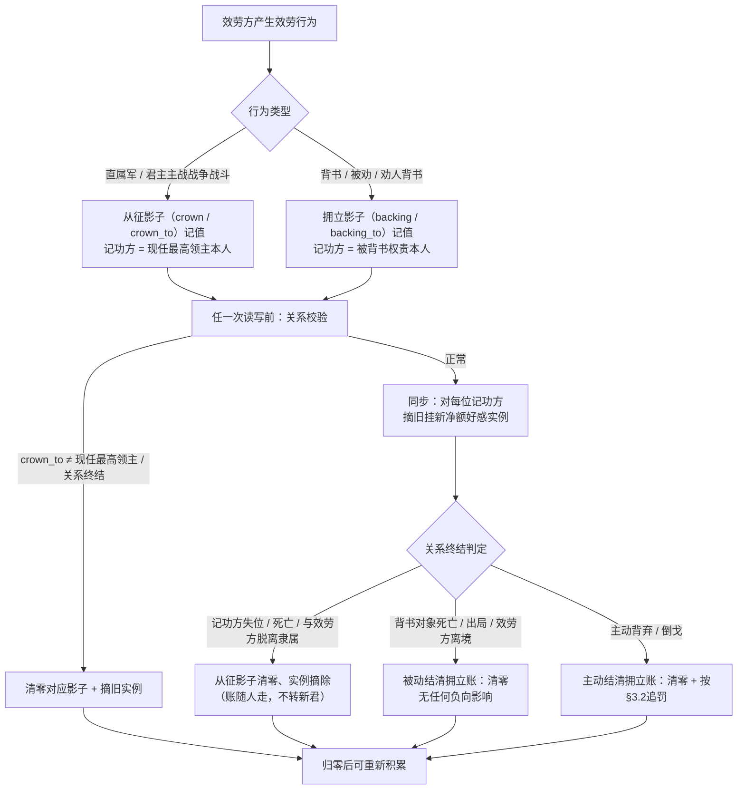
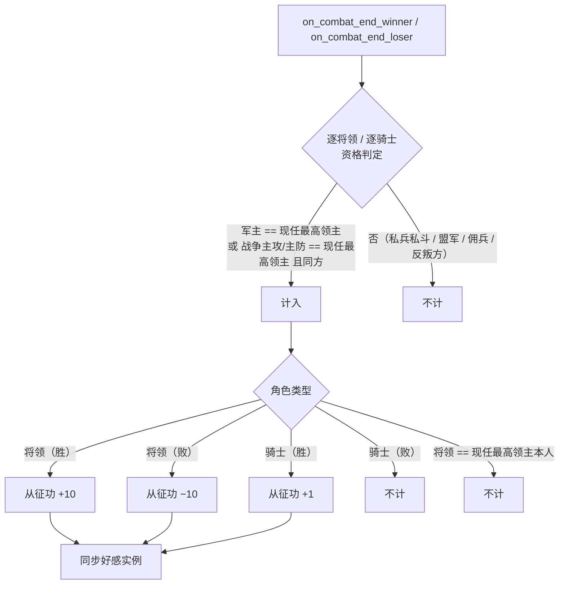
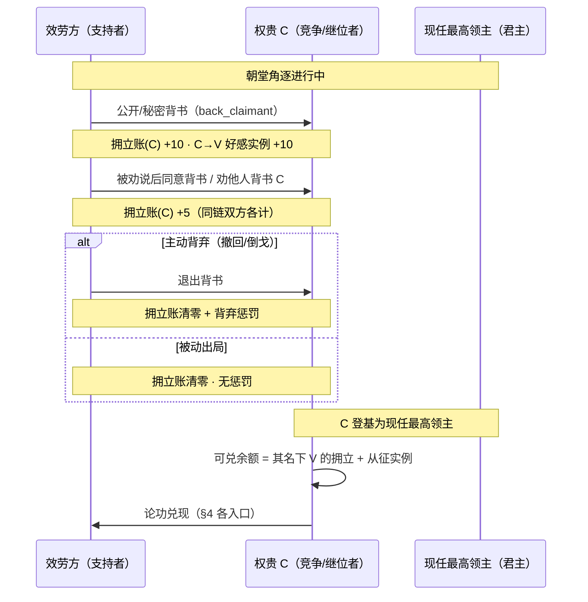
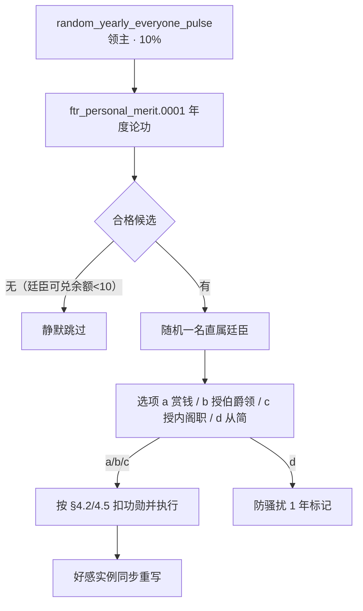

# 个人功勋（Personal Merit）系统设计

> 本文件是「个人功勋」系统的**唯一设计出处**。
> **动手修改任何相关脚本代码前先读本文件，改完代码后必须同步更新本文件。**
>
> 关联文档：`01-朝堂权力角逐-系统设计.md`（同仓同目录）。本文是 01 的**并行新系统**，并承担 01 内**政治许诺机制（原 §7.1 许诺交互、§8.2 承诺记账链，已在 01 中标记废弃并改为"论功行赏"）**的取代改造；涉及 01 的改动以「§5 取代与接线」为唯一口径，不在 01 中另留旧方案。
>
> **状态约定**：本文全部条目现为**设计稿（状态：未实现）**；沿用 01 的「状态：已实现 / 未实现」标记习惯，未实现项只给一句确定结论，不保留"或 / 待权衡 / 预留 / 待接线"等占位描述。
>
> **定稿口径**（本文件按以下决策写作，不再反复权衡）：
> - **对象命名**：系统正式名称 **个人功勋（`personal_merit`）**，用于与原版 `merit` 统计量区隔；**全部脚本标识统一 `ftr_personal_merit_*` 前缀**（符合 AGENTS §3.3 与校验器 `validate_scripts.py` 顶层前缀检查），意见修饰符键 = `ftr_personal_merit_opinion`，影子变量 = `var:ftr_personal_merit_*`。它独立于官方 `merit` 统计量，因好感受所有政体支持，**使用原版 merit 的政体（行政制/天朝/日本行政府等）同样适用本机制**。
> - **记账方式**：功勋数值**只以「好感」方式记录**——每条功勋关系 = 记功方对效劳方的一枚 `ftr_personal_merit_opinion` 净额实例（1:1，无压缩换算）；为满足引擎运算，效劳方身内另存**隐藏运算影子**（仅用于效果内部算新值/判阈值，不面向玩家、不算记录）。
> - **记账方向**：功勋是**定向个人功**：背书所得指向**被背书权贵本人**（拥立功），战斗所得指向**统军/主战所属最高领主本人**（从征功）。账随人走，**不随君位自动平移**；跨继位的回报由"预先押注（拥立未来君主）"实现。
> - **战斗计入范围**：计入条件为"**军队归属最高领主**或**该战为以最高领主为主要进攻方 / 主要防御方之战**"（详见 §3.1）。
> - **取代范围**：政治许诺机制**全链移除**（许诺交互、记账变量、兑现事件链、兑现效果与相关 modifier），支持者回报统一走功勋论赏。

---

## 1. 目标与范围

### 1.1 设计目标

在**最高领主与其麾下臣属（含直属廷臣）**之间建立一套「个人功勋」关系记账，作为对忠诚效劳、征战沙场、站队拥立等行为的**统一回报货币**：

- 功勋可**积累**（不随时间衰减、可叠加）、可**消耗**（被领主赏赐/授土抵扣，可到 0 为止），不设总量上限；
- 功勋是**双向互动货币**：领主可主动论功行赏，臣属亦可凭功请赏；
- 功勋**替代**朝堂权力角逐中靠许诺拉票的旧机制：支持者不再收"空头承诺"，而是凭实打实的「拥立功」在未来君主登基后兑奖。

### 1.2 范围边界

| 纳入 | 不纳入（明确排除） |
|---|---|
| 效劳方对**现任最高领主本人**的从征功（直属军 / 其为主攻或主防的战争） | 臣属私兵互斗等**非效忠现任最高领主**的私人冲突战绩 |
| 效劳方对**具备继位前景权贵**的拥立功（背书/被劝背书/劝人背书） | 支持**现任君主**本人（属日常表忠，走既有 loyalty/backer 好感，不产功勋） |
| 领主→臣属的钱财/领土/职位赏功 | 婚姻、外交联盟、密谋等不产功勋、不耗功勋 |
| 功勋 = 真实好感（opinion 值） | 功勋值参与选举权重、官方 `merit` 统计、合法性计算等其它系统 |

> 术语约定见 §2.1。所有效劳行为仅在有明确「记功方」时记账；无主行为一律不计。

### 1.3 与官方「merit」的区分与通用性

原版行政制等政权存在官方统计量 `merit`（本项目天朝吏制 `ftr_realm_decisions.txt` 的 `merit > N` 判定即用它，用于科举另轨）。本系统**不复用该统计量**，也不要求任何政体启用官方 merit——`personal_merit` 以**意见修饰符（好感）**为载体，任何政体下的角色（封建 / 部落 / 氏族 / 行政 / 天朝 / 无地冒险者等）天然可持有好感关系，因此**官方 merit 政体同样可运行本机制**。两套体系键名、数值、展示互不相干（已检索原版与本 Mod：`personal_merit` 0 冲突）。

---

## 2. 数据模型与记账约定

### 2.1 角色与方向（术语表）

| 术语 | 定义 | 举例 |
|---|---|---|
| **效劳方** | 功勋关系中的被记功人 | 臣属、直属廷臣、从征将领与骑士、朝堂背书者/劝说者 |
| **记功方** | 对效劳方持有人功勋好感、日后可兑现者 | 现任最高领主（从征功）、被背书的权贵本人（拥立功） |
| **现役最高领主** | 效劳方当前所处政权的最高君主 | 封臣走 `top_liege`、廷臣走 `employer` 链路顶端 |
| **从征功（账）** | 效劳方在记功方战争/直属军中的功劳，指向**记功当时的最高领主本人** | 战功、随主征伐 |
| **拥立功（账）** | 效劳方对某权贵的拥立功劳，指向**该权贵本人** | 背书、被劝背书、劝人背书 |
| **可兑余额** | 某记功方视角下可立即消费的功勋合计 | = 以该记功方为持有者、指向该效劳方的各好感实例净额之和 |

**账随人走（定稿）**：个人功勋是**某人与某人之间**的好感，不抽象为"君位/社稷"——现任最高领主驾崩/被废后，其名下从征功**不自动转给新君**。跨继位的回报通道是**拥立账**：支持者在位时背书某候选人，候选人在其名下积功，候选人登基为现役最高领主后即用本人名下好感直接论功，**无需任何继位搬运/转换**。

### 2.2 记录载体：好感实例 + 隐藏运算影子

**唯一面向玩家的记录 = 好感实例（净额制）**：

- 每条功勋关系 = 记功方对效劳方的一枚意见修饰符 `ftr_personal_merit_opinion`，其 `opinion` 值即该对关系的**净功勋**（可为负，负值由败仗产生；净 0 = 无实例）；
- 意见修饰符**无逐月自然衰减**，只在系统"摘旧挂新"时变化，天然满足"不随时间减少、可叠加"；
- 一名效劳方**同一时刻至多两条功勋关系**：一条从征功（记功方 = 现任最高领主）+ 一条拥立功（记功方 = 当前背书对象，可为同一人）；两关系各自独立、互不合并。

**隐藏运算影子（仅引擎内部）**：引擎只提供 `add/remove_opinion` 与"读角色总好感"，**不能按修饰符读取净额**。为使"摘旧挂新"能算出新值，每名效劳方身上保留四条影子（**不算记录、不展示、不参与任何业务语义**）：

| 影子 | 类型 | 语义 |
|---|---|---|
| `var:ftr_personal_merit_crown` | int | 从征功净额影子 |
| `var:ftr_personal_merit_crown_to` | character | 从征功记功方引用（记功时的现任最高领主本人）；用于检测君位更替 |
| `var:ftr_personal_merit_backing` | int | 拥立功净额影子 |
| `var:ftr_personal_merit_backing_to` | character | 拥立功记功方引用（无背书对象则不存在） |

**同步与关系校验**（由 `ftr_personal_merit_sync_effect` + 前导 `ftr_personal_merit_validate_effect` 共同维护）：

1. **任意读写（加功 / 判可兑 / 消耗 / 重写实例）前先跑关系校验**：若 `crown_to` 存在且 ≠ 效劳方现任最高领主 → 从征影子清零、摘除旧从征实例（账随人走）；背书对象死亡/出局/效劳方离境但尚未结清 → 一并清理拥立影子。
2. 记账变动先改影子，再由同步效果对每位记功方**摘旧挂新**写好感实例；
3. 记功方 X 名下净额 = 指向 X 的全部影子之和：`从征影子（若 crown_to == X）+ 拥立影子（若 backing_to == X）`；和为 0 → 摘除实例；
4. **可兑判定与消耗计算只读影子**（读不到真实净额的好感实例不参与逻辑）。

### 2.3 关系生命周期

- **从征账的"人走账清"**：现任最高领主驾崩 / 被废、效劳方转隶他国或独立 → 从征影子清零并摘除该关系实例；新君不继承前任名下好感。效劳方在新君麾下重新从征，从零计。该结清在**下一次任何功勋读写**时惰性完成，无需依赖继位结算期的 on_action（规避 AGENTS 提示的继承时序风险）。
- **被动结清**（效劳方未负心）：背书对象出局 / 被清算 / 死亡、效劳方被迫离境 → 拥立影子清零，**不影响**从征影子，不施加任何好感/信用惩罚（对应需求"被动放弃背书不影响"）。
- **主动结清**（效劳方负心）：撤回支持、倒戈改投另一权贵 → 拥立影子清零，并沿用 01 既有背弃惩罚链（`ftr_court_betrayed_opinion`、旧主及其支持者敌意等），从征影子不动。

### 2.4 好感即数值（无第二套展示）

- 功勋净额**1:1**直接就是好感数值：`ftr_personal_merit_opinion` 实例的 opinion 值即玩家在角色界面看到的"×× 对我的个人功勋好感 +40 / −10"；
- 无档位换算、无第二资源栏、无独立 UI 计数器；
- 好感实例只表示**存在与量级**，精确判定一律走影子（见 §2.2 第 4 条）。

### 2.5 读写封装与命名

所有记账变动**只经由**唯一封装效果，禁止在业务处散写 `change_variable` / `add_opinion`：

| 效果 / 触发器 / 值 | 用途 |
|---|---|
| `ftr_personal_merit_validate_effect` | **前导关系校验**（§2.2 第 1 条）：君位更替/离境/对象出局的惰性结清 |
| `ftr_personal_merit_crown_add_effect`（参数 `AMOUNT`） | 加/减从征影子（记功方 = 现任最高领主）并触发同步 |
| `ftr_personal_merit_backing_add_effect`（参数 `CLAIMANT`/`AMOUNT`） | 设/累加拥立影子（对象唯一，先校验） |
| `ftr_personal_merit_backing_clear_effect` | 被动/主动结清拥立影子（主动由调用方补惩罚） |
| `ftr_personal_merit_sync_effect` | 按影子摘旧挂新重写该效劳方全部好感实例 |
| `ftr_personal_merit_consume_effect`（参数 `AMOUNT`） | 扣可兑余额（影子运算），永不为负并同步实例 |
| `ftr_personal_merit_redeemable_value`（script value，参数 `HOLDER`） | 某记功方视角下对效劳方的可兑净额 |
| `ftr_personal_merit_battle_counts_trigger` / `ftr_personal_merit_has_credit_trigger` / `ftr_personal_merit_backing_eligible_trigger` | 战斗计入 / 是否可赏 / 背书对象是否可产功勋 |

> 全部顶层脚本对象均带 `ftr_` 前缀，可通过 `validate_scripts.py` 命名检查（意见修饰符与变量键为 `ftr_personal_merit_*`，不含前缀）。

---

## 3. 功勋获得

### 3.1 战斗功勋（需求 1）

**计入口径（定稿，两条满足其一即计入）**：

1. **军队归属最高领主**：战斗方中某军 `army_owner` = 效劳方所在政权的现任最高领主（直属军）；
2. **主战方为最高领主**：该战所属战争（`combat.combat_war`）的 `primary_attacker` 或 `primary_defender` = 效劳方现任最高领主，且效劳方**在同一方参战**（从征；若效劳方站其对立面——如叛乱——不计）。

逐条细则：

- 计入对象 = 参战的**统兵将领**（commander）与**骑士**（side knight），其记功方 = 现任最高领主；
- 将领 **胜 +10 / 负 −10**；骑士 **胜 +1**（败不扣）；
- **将领本人即记功方（最高领主亲自统军）→ 不计**（不给自己记功）；
- 胜负以战斗结算为准；战役（war）整体胜败不在此列（只按单场 battle 计）。

**挂钩点**（沿用原版 on_action 追加回调，按 AGENTS §3.4 属合并语义，不加 OVERRIDE 标记）：

| on_action | root | 取数 |
|---|---|---|
| `on_combat_end_winner` | 获胜战斗方 | `every_side_commander` → 将领 +10；`every_side_knight` → 骑士 +1（先各自经 `commanding_army.army_owner` / `knight_army.army_owner` / `combat.combat_war` 校验口径） |
| `on_combat_end_loser` | 战败战斗方 | `every_side_commander` → 将领 −10（骑士不动） |

> 实现要点（编码期核对）：`on_combat_end_*` 的 `root` 为战斗方；每条侧含多个 army（各有 owner）与多个参战者。遍历时应以**军为单位**定位 owner / 判定战争主攻主防，避免把"同侧盟军私兵"或"同侧他国援军"误记。

### 3.2 背书功勋（需求 2，主动背弃清账）

**背书对象资格**（`ftr_personal_merit_backing_eligible_trigger`）：效劳方所在政权正处朝堂角逐、被背书者为该朝堂内**非现任君主**的权贵（参与角逐者 / 共治者 / 具备继位前景的继承人、子女），且效劳方与其同殿（同一故事）。

| 行为 | 触发点（01 既有入口） | 功勋 |
|---|---|---|
| **主动公开背书**某合格权贵 C | `back_claimant` 公开分支 on_accept | 拥立账(C) **+10** |
| **主动秘密背书**某合格权贵 C | `back_claimant` 秘密分支 on_accept | 拥立账(C) **+10**（密账照记，登基后兑奖时才揭晓） |
| **被动被劝而后背书** C | 游说/0014 链中"接受劝进" | 拥立账(C) **+5**（非主动发起，减半） |
| **劝人背书**成功（劝说者本人背书对象即 C） | 游说成功分支 | 拥立账(C) **+5**（并入劝说者既有拥立账；若劝说者并无背书对象，则本次不计——防止无主账漂移） |
| **主动背弃 C**（撤回 / 倒戈改投） | `withdraw_backing` on_accept、`back_claimant` 改投分支 | 拥立账(C) **清零** + 01 背弃惩罚链（`ftr_court_betrayed_opinion` 等）；**从征账不受影响** |
| **被动放弃背书**（C 出局 / 被清算 / 死亡 / 政权瓦解） | 01 收场与清理链 | 拥立账(C) 清零（被动结清），**无任何惩罚** |

> 支持现任君主（身为权贵的 `back_claimant` 目标为君主本人）不产功勋：该行为走 01 既有"表忠/拥戴君主"回馈（backer_opinion / 忠诚好感 / 天平影响），不入功勋账。

### 3.3 无地廷臣的背书路径（01 约束的延续）

无地廷臣不能主动发起交互；其背书只能经**事件等价入口**：0014（择主站队，主动表态）、被游说成功、或年度论功事件前后缀。凡由事件促成且为**效劳方主动决断**者按「主动背书 +10」计；凡**经劝说后才同意**按「+5」计；二者不叠加（同一次站队只取其一）。

### 3.4 其他来源（政变拥立；不设更多）

- **coup_scheme 参与者（从龙功）**：密谋政变**成功后**，每位参与者对**密谋发起人（登基新君）**获得 **+20 拥立功**（`ftr_personal_merit_coup_support_value`），替代原即时好感类奖励；走 §2 同一 `backing` 记账。若发起人此后成为该参与者现任最高领主，由 validate 自动折叠入从征账。
- 战斗与背书仍为两大主要来源。辅政、纳贡、献策等日常义务**不产功勋**（回报已在既有 loyalty/assist 体系中，避免双计）。
- 如需再扩充（如献城、救驾），按 §5.3 的接线点追加即可，本文不预埋。

---

## 4. 功勋兑现（消耗侧）

### 4.1 领主主动赏钱（需求：作用 1）

**新交互** `ftr_personal_merit_reward_gold_interaction`（领主 → 功勋臣属）：

| 项 | 取值 |
|---|---|
| actor | 现任最高领主 |
| recipient | 其直属臣属 / 直属廷臣，且 actor 对 recipient 的可兑余额 ≥ 10 |
| 方案 | 两档 send_option（金额/耗功勋见 §8 常量表） |
| 结算 | 付金 + `ftr_personal_merit_consume_effect` 扣对应额度；附 `grateful_opinion`（可选） |
| AI | `ai_will_do` 按国库与对象功勋/品格核算（§6） |

### 4.2 授地自动抵扣（需求：作用 2）

**凡领主授予臣属头衔**（领主对受勋者可兑余额为正），一律按**头衔档位**抵扣功勋，最高扣至 0：

| 接入口 | 处理 |
|---|---|
| 原版 `grant_titles_interaction` on_accept | 在 on_accept 尾部追加 `ftr_personal_merit_consume_on_grant_effect`。原版无授地后置合并式 on_action（已检索），故对原版交互做**最小 override**：保留原对象其余字段，仅在 on_accept 内追加一行效果引用，改动块按 `###### OVERRIDE ######` 包裹；若实施时引擎要求整块重写，则整对象复制原内容后追加（同 AGENTS §4.3 口径） |
| 本 mod 事件直接授土（含 §4.4 年度授伯爵领） | 同一消费效果显式调用（事件路径不经过原版 grant 交互，须自扣） |
| `grant_governorship_interaction`（行政授总督） | 与 `grant_titles_interaction` 一致追加同一消费效果（保持一致口径，防止行政制漏扣） |

> 抵扣上限 = 头衔档位值，若可兑余额不足档位值则**全额扣光**，剩余照常授地；负余额绝不因授地而进一步减少。

### 4.3 臣属请求（需求：作用 3）

两条**反向交互**（actor = 效劳方，recipient = 现任最高领主）：

| 交互 | 请求内容 | 门槛 | 接受后 |
|---|---|---|---|
| `ftr_personal_merit_request_gold_interaction` | 请赏金钱（小额 / 大额） | 可兑余额 ≥ 对应耗值 | 领主付金、按 §4.5 扣功勋 |
| `ftr_personal_merit_request_council_interaction` | 请以内阁职位抵赏 | 可兑余额 ≥ 职位耗值；对应职位空位 | 按对方最高属性（武艺/管理/外交/谋略，**学识除外**）实授；扣功勋；打 5 年保护（§4.6） |

### 4.4 年度论功事件（需求：作用 4）

**触发**：现任最高领主每年一次**10% 概率**（挂 `random_yearly_everyone_pulse`，同 §9 频率表）触发 `ftr_personal_merit.0001`；无合格候选则静默跳过。

**选人**：从领主**直属廷臣**中随机挑一名"领主对其可兑余额 ≥ 10"者（均衡随机；资历/近臣不作加权）。若合格者仅含直属臣属（无廷臣），本年度不触发。

**选项**（root = 领主；随时按候选可用性灰显）：

| 选项 | 条件 | 效果 |
|---|---|---|
| a. 赏钱 | 领主金库足额 | 付金（中档）+ 扣功勋 |
| b. 授以随机伯爵领 | 存在可授伯爵领（直属/可分割、无特殊限制） | 随机选领 → `ftr_personal_merit_consume_on_grant_effect`（county 档） |
| c. 授以内阁职位 | 有对应空位（按其最高属性定职，学识除外） | 实授 + 扣职位档功勋 + 5 年保护 |
| d. 从简不发 | 恒可 | 无消耗；1 年内不再触发（防骚扰标记） |

### 4.5 消耗顺序与底线

1. 消耗只对**记功方 == 现任最高领主**的关系实例执行（他人名下好感不可被现任君主消费）；任何消耗**永不为负**。
2. 顺序：先扣该君主名下的**拥立影子**（若其同时是背书对象），再扣**从征影子**；不足时依次滚入，余量不足档位则**耗尽即止**。
3. 影子为负时不因消耗进一步下降；负值只能由"胜仗为正抵消"或"主动立新功"逐步抬高。
4. 消耗前先跑关系校验（`ftr_personal_merit_validate_effect`），消耗后立即同步好感实例（摘旧挂新）。

### 4.6 内阁职位 5 年保护

| 项 | 取值 |
|---|---|
| 授予标记 | 受勋者打 `ftr_personal_merit_council_tenure`（5 年，计时到自动清除） |
| 效力 | 届期内，领主（含 AI）无法通过本 mod 的撤换/改任入口将其换下；原版改任入口若会绕过，则按 01 覆盖约定加 `### OVERRIDE` 单行过滤（实施时核对原版键名） |
| 失效 | 受勋者死亡 / 丧失职位资格（被监禁、叛国定罪等）→ 标记清除，席位正常轮换 |

---

## 5. 对朝堂权力角逐的取代与接线

### 5.1 取代原则

旧机制：权贵以"许诺"（内阁席位 / 宽免义务 / 直接赠金 / 示好）换取支持者，许诺记账跨继位兑现（01 原 §8.2「政治承诺（筹码机制）」，已在 01 中作废；另含 0016/0017 与 `ftr_court_on_council_promise_check_on_action`）。

新机制：支持者以**实绩**累积个人功勋（背书 / 从征 / 被劝背书 / 劝人背书），权贵（尤其未来君主）登基后**凭功论赏**（§3–§4）。**许诺不再存在**——拉票不再有"空头支票"，兑现不再依赖继位事件链；支持者押注对象登基后，其名下既有拥立好感即自然可用。

### 5.2 移除清单（全链移除）

| 类别 | 移除对象 | 说明 |
|---|---|---|
| 交互 | `ftr_court_promise_interaction`（含 4 个 send_option 分支与全部选项感知 AI 段） | 承诺交互整体删除 |
| 变量 | `ftr_court_owes_council`、`ftr_court_promise_council`、`ftr_court_promise_contract`、`ftr_court_promised_by` | 记账全清 |
| 事件 | `ftr_court_struggle.0016`（欠席提醒）、`.0017`（耐心耗尽） | 兑现链删除 |
| 效果 | `ftr_court_schedule_council_reminder_effect`、`ftr_court_queue_next_council_reminder_effect`、`ftr_court_clear_council_promise_effect`、`ftr_court_fulfill_promises_effect`、`ftr_court_appoint_promised_councillor_effect` | 兑现/提醒效果删除（实授能力由功勋交互的授职路径承接） |
| on_action | `ftr_court_on_council_promise_check_on_action`（on_death 钩子） | 删除 |
| modifier | `ftr_court_promised_wage_modifier`、`ftr_court_promised_contract_modifier` | 删除 |
| 常量 | `ftr_court_promise_*_prestige/influence_cost_value` 等承诺计价常量 | 删除 |
| usurp 尾部 | `ftr_court_usurp_throne_effect` 内"安排内阁承诺提醒"段 | 改为**无动作**（登基后凭本人名下功勋账自然生效） |
| 0011 链 | 0011.a「赦免兑现承诺」对契约承诺的处理分支 | 删除承诺兑现语义，仅保留赦免本身 |

> 保留：`ftr_court_betrayed_opinion`（供背书背弃惩罚使用）、`ftr_political_alliance_opinion`（供背书/联盟好感使用）继续存在，二者与许诺无关。

### 5.3 接线点改动（新增功勋产出）

| 01 既有入口 | 改动 |
|---|---|
| `back_claimant`（公开/秘密 on_accept） | 若目标合格（§3.2）→ `ftr_personal_merit_backing_add_effect(C, +10)` |
| `withdraw_backing` on_accept | 主动结清拥立影子（清零）；沿用背弃惩罚 |
| `back_claimant` 改投分支 | 先清旧主拥立账（清零）再记新主（如合格则 +10） |
| 游说成功 / 0014 择主（劝进分支） | 按 §3.2/§3.3 记 +5/+10 |
| 现任最高领主的战斗结算 | 挂 §3.1 的 `on_combat_end_*` 回调 |
| 年度论功 | 新增 `random_yearly_everyone_pulse` 10% 钩子 + 事件族（§4.4） |

> 说明：01 中 `ftr_court_fulfill_promises_effect` 承担的"支持者回报"现在由登基后任意时点的**功勋兑现**（§4 全部入口）替代，君主可以分次、分批论功，不再需要赶在继位结算期统一处理（规避 AGENTS 提示的继承时序风险）。

### 5.4 新旧对照（迁移映射）

| 旧许诺场景 | 新个人功勋场景 |
|---|---|
| 权贵向支持者"许以内阁席位"买票 | 支持者**先背书**（+10 拥立功），权贵登基后凭功**请授/被授**职位 |
| 权贵"许以宽免义务/加俸" | 由**论功赏钱 / 授地 / 授职**统一替代（无义务承诺形态） |
| 承诺记账跨继位 | **拥立账跨继位**（对象登基即本人名下可用，零搬运）；从征账不跨君（账随人走） |
| 0016/0017 提醒与拒绝背信 | 删除；换取回报的入口变为**交互自选**（请求/年度事件） |
| 继位结算期的批量兑现 | 任何时期凭可兑余额随时论功（玩家节奏可控） |

---

## 6. AI 决策规则

所有 AI 决策只作因子，不改触发条件（沿用 01 §7.1 的做法）。

| 入口 | AI 决策要点 |
|---|---|
| 领主主动赏钱 `ftr_personal_merit_reward_gold_interaction` | `ai_will_do`：国库充足（>月收入 ×N）加分；对象功勋高 / 曾从征 / 强权封臣加分；greedy 减、charitable/just 加。两档选择：国库紧则小额。 |
| 臣属请赏 `ftr_personal_merit_request_gold_interaction` | `ai_accept`：按对方功勋与国库核算；功勋高者大幅接受，关系差者不接受。 |
| 臣属请内阁职 `ftr_personal_merit_request_council_interaction` | `ai_accept`：对方能力与职位匹配（最高属性即职位）加分；ambitious 者高；职位有人占用则大减（本设计仅空位可请）。 |
| 年度论功事件 | `ai_chance` 选项：国库宽裕偏 a；地多且对方从征偏 b；空职且能力适配偏 c；国库紧 / 多次触发偏 d。 |
| 支持者背书（产功勋侧） | 沿用 01 `back_claimant` 既有 AI；新增因子：功勋可兑且本人未来收益预期高（对方登基概率高）时更愿**公开背书**。 |

---

## 7. 事件 / 交互 / 决议总表

| ID / 键 | 类型 | 说明 | 状态 |
|---|---|---|---|
| `ftr_personal_merit.0001` | 年度论功事件（root = 现任最高领主） | §4.4 四选项 | 未实现 |
| `ftr_personal_merit_reward_gold_interaction` | 角色交互（领主→臣属） | 主动赏钱，两档 | 未实现 |
| `ftr_personal_merit_request_gold_interaction` | 角色交互（臣属→领主） | 请赏钱 | 未实现 |
| `ftr_personal_merit_request_council_interaction` | 角色交互（臣属→领主） | 请以内阁职位抵赏（5 年保护） | 未实现 |
| `ftr_personal_merit_annual_reward_effect_group`（on_action 回调族） | on_action（`random_yearly_everyone_pulse`） | 10% 触发 + 选人 + 调度 | 未实现 |
| 授地抵扣 | 原版 `grant_titles_interaction` / `grant_governorship_interaction` override | §4.2 挂接 | 未实现 |
| 内阁保护 | 撤换入口过滤 | §4.6 | 未实现 |

> 交互的本地化键：`<key>` + `_desc` + `_tooltip` + `_confirm` 双语成对，文本前加 `<FTR>`；事件 title/desc/option 双语成对。数值文本走 custom tooltip 引用 script value，不硬编码进文案。

---

## 8. 数值常量表（全部走 `common/script_values/ftr_personal_merit_values.txt`）

| 常量 | 默认值 | 用途 |
|---|---|---|
| `ftr_personal_merit_battle_win_value` | +10 | 将领胜战 |
| `ftr_personal_merit_battle_lose_value` | −10 | 将领败战 |
| `ftr_personal_merit_knight_win_value` | +1 | 骑士胜战 |
| `ftr_personal_merit_backing_public_value` | +10 | 主动背书（公开/秘密同） |
| `ftr_personal_merit_backing_persuaded_value` | +5 | 被劝背书 |
| `ftr_personal_merit_persuading_value` | +5 | 劝人背书（劝说者） |
| `ftr_personal_merit_coup_support_value` | +20 | coup 成功：参与者对发起人（新君）的拥立功 |
| `ftr_personal_merit_reward_small_gold_value` / `..._cost_value` | 150 金 / 耗 10 | 小赏 |
| `ftr_personal_merit_reward_large_gold_value` / `..._cost_value` | 400 金 / 耗 30 | 大赏 |
| `ftr_personal_merit_annual_gold_value` | 400 金（耗 30） | 年度赏钱档 |
| `ftr_personal_merit_title_consume_county_value` / `..._duchy/kingdom/empire_value` | 10 / 25 / 40 / 60 | 授地抵扣 |
| `ftr_personal_merit_council_cost_value` | 40 | 内阁职位抵功 |
| `ftr_personal_merit_annual_chance_value` | 10（%） | 年度触发概率 |
| `ftr_personal_merit_annual_min_value` | 10 | 可入选下限（≥10） |
| `ftr_personal_merit_reward_min_value` | 10 | 各种兑现入口共同门槛 |

---

## 9. 频率控制

| 层级 | 手段 | 值 |
|---|---|---|
| 战斗 | `on_combat_end_*` 回调 | 每场结算一次，字段级过滤后极低频 |
| 背书 | 交互 / 事件本身 | 事件自身节奏（01 防骚扰 flag 沿用） |
| 年度论功 | `random_yearly_everyone_pulse` | 每年每领主 10%；触发后若选 d 加 1 年防骚扰标记 |
| 内阁保护 | `ftr_personal_merit_council_tenure` | 5 年（计时标记） |

---

## 10. 文件清单与实现状态

| 文件 | 内容 | 状态 |
|---|---|---|
| `common/opinion_modifiers/`（并入既有文件亦可） | 意见修饰符 `ftr_personal_merit_opinion` | 未实现 |
| `common/script_values/ftr_personal_merit_values.txt` | §8 全部常量 | 未实现 |
| `common/scripted_effects/ftr_personal_merit_effects.txt` | 影子记账封装（含关系校验前导）/ 同步 / 消耗 / 授地抵扣 | 未实现 |
| `common/scripted_triggers/ftr_personal_merit_triggers.txt` | 资格 / 可兑 / 计入判定 | 未实现 |
| `common/character_interactions/ftr_personal_merit_interactions.txt` | 3 条交互（主动赏 / 请赏 / 请职） | 未实现 |
| `events/ftr_personal_merit_events.txt` | `.0001` 年度论功 | 未实现 |
| `common/on_action/ftr_personal_merit_on_actions.txt` | 战斗结算 + 年度脉冲回调（追加语义） | 未实现 |
| `common/modifiers/` | `ftr_personal_merit_council_tenure`（计时标记用临时 modifier，若用 flag 则无需） | 未实现 |
| 双语本地化 | 交互/事件/修饰符文案（`<FTR>`、english/simp_chinese 成对） | 未实现 |

**联动（01 系统内删除项，见 §5.2）**：`ftr_court_interactions.txt` 删 promise 块、`ftr_court_struggle_events.txt` 删 0016/0017、`ftr_court_struggle_effects.txt` 删兑现效果族、`ftr_court_on_actions.txt` 删承诺检查钩子、`ftr_court_modifiers.txt` 删两个兑现 modifier、常量表删 promise 计价常量、usurp 尾部删提醒段、01 文档同步 §5.2 口径。

**实施期登记项**：
1. `tools/validate_scripts.py` 的 `VANILLA_ON_ACTION_HOOKS` 补登记挂载点 `on_combat_end_winner`、`on_combat_end_loser`（`random_yearly_everyone_pulse` 已在册），否则新 on_action 文件会误报前缀提示；
2. 授地抵扣涉及对原版 `grant_titles_interaction` / `grant_governorship_interaction` 的 override，提交前核对 AGENTS §4.3 覆盖清单口径并保留原字段。

---

## 11. 测试要点（实施后人工确认）

1. 直属军胜/败、**君主为主攻或主防之战中的从征部队**胜/败各打一场：只记两类，将领 ±、骑士 +1、亲自统军不计；私兵私斗 / 反叛方不计。
2. 背书→倒戈→再背书：旧拥立账清零惩罚到位；从征账完好。
3. 被劝背书 +5、劝人背书 +5：同一人只产生一条拥立账。
4. 授伯爵领 / 公爵领：抵扣分别 10 / 25，余额不足则扣光、不为负；行政授总督同样抵扣。
5. 请内阁职位后 5 年内撤换入口灰显；届满自动解除。
6. 年度事件：无合格廷臣不触发；有则四选项可用性正确（缺地/缺职位时灰显）。
7. 现任最高领主驾崩：**下次功勋读写**时旧从征账惰性清零、不转新君，新君不会误花前任名下功勋；新君只论其本人名下拥立账（曾押注新君的支持者可立即被论功）。
8. 好感实例经"摘旧挂新"后净额正确（+10、−10、清零、+5+10 合流等），好感面板数值与影子一致。
9. 行政制 / 天朝等**官方 merit 政体**下全套功勋交互与事件可正常运行，且与官方 `merit` 数值互不影响。
10. 许诺旧链全部移除后，error.log 无 0016/0017/promise 相关引用报错；双语本地化无孤儿键。
11. `validate_scripts.py --game-path` 全量校验通过（含新增 on_action 挂载点白名单登记、全部顶层对象带 `ftr_` 前缀）。
12. coup 成功后每位参与者名下出现指向发起人（新君）的 +20 拥立账好感实例；发起人登基后该账可随其论功兑现；发起人未成为其现任最高领主时（如政变失败前撤销）不折叠。
