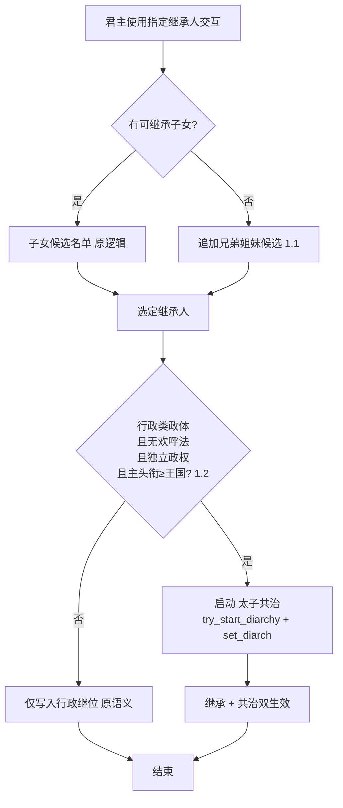
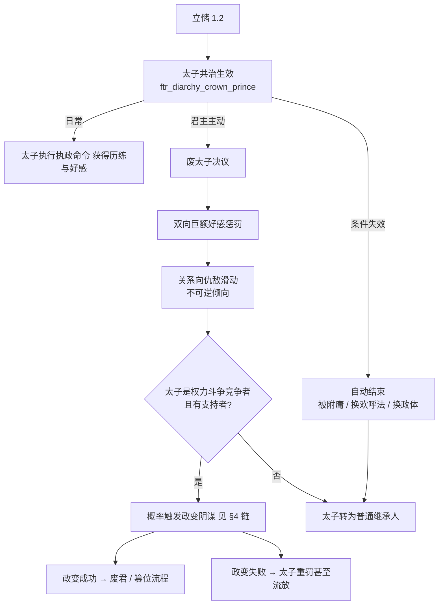
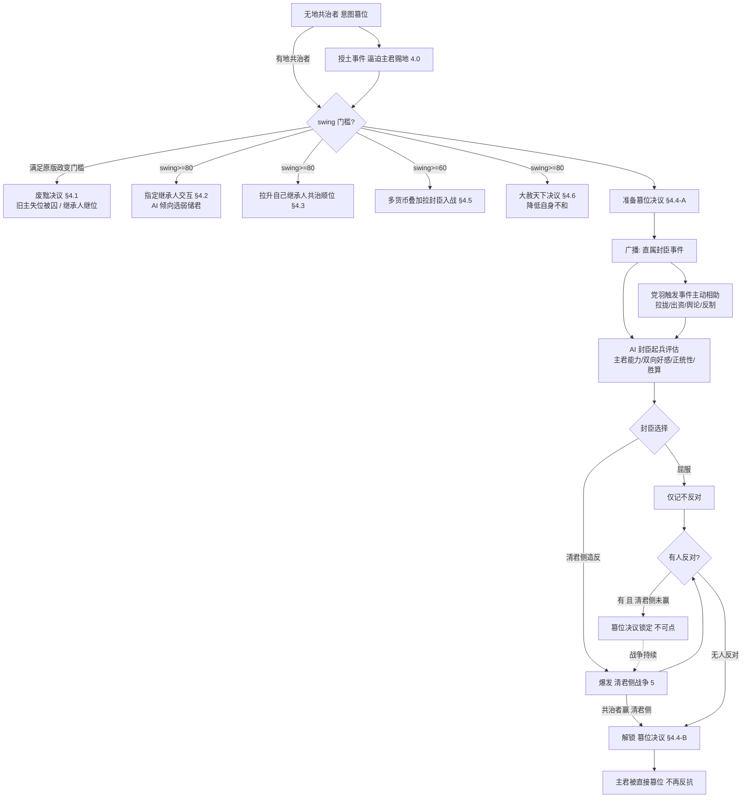
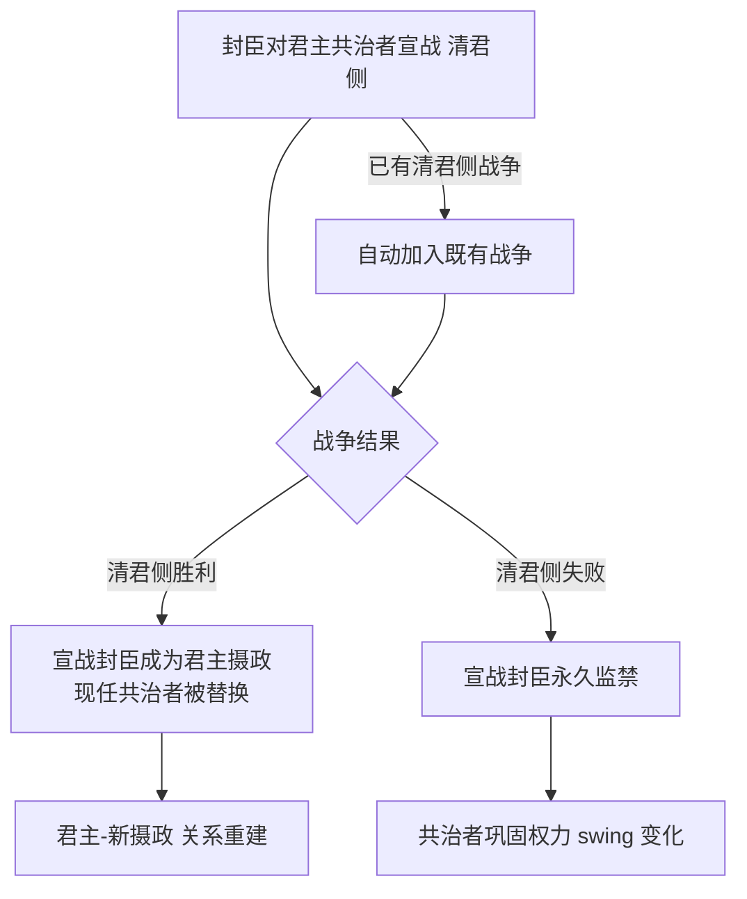

# 共治者机制强化设计

> 本文件是「共治者机制强化」系统的**唯一设计出处**。
> **修改任何相关脚本代码前先读本文件，改完代码后必须同步更新本文件。**
>
> 基线知识：[18 共治系统详解（原版代码基线）](../18-共治系统详解.md)。凡涉及原版 diarchy / 交互 / 决议 / CB 的对象名、行号、参数均以该文为准。
> 关联设计：[01 朝堂权力角逐（权力斗争参与者 / 支持者 / 无地者事件路径）](01-朝堂权力角逐-系统设计.md)、[02 功勋系统](02-功勋系统设计.md)。
>
> **开发硬约束（本任务不可违反）**：**只允许在 `ftr_` 前缀文件下开发，禁止编辑原版任何文件**。「覆盖」一律通过 mod 内同名重定义 + `###### OVERRIDE ######` 标记实现（见 AGENTS §3.4/§4.3）。
> **状态标注约定**：沿用 01/02 ——「状态：已实现 / 未实现」；**未实现项只给确定结论，不留「或 / 待权衡」占位描述**。

---

## 1. 目标与范围

### 1.1 设计目标

在原版 diarchy（共治）机制基础上，为本 mod 的**行政类政体**建立一套贴合「储君 / 权臣 / 篡位」叙事的可玩闭环：

1. 行政类政体的**指定继承人**流程扩展为可立储（含无子立手足、无欢呼法立**太子共治**）；
2. 新增**太子**共治类型（区别于原版仅限欢呼法的幼帝/共治皇帝），配套「废太子」权力博弈；
3. **重做共治者篡位链**：从「一拍即合的政变决议」改为「索官索地 → 铺垫 → 舆论战 → 清君侧 → 最终篡位」的多段流程（**继承人线**走夺位、**非继承人线**走官职积累后废立，见 §1.3 / §4.4）；
4. 新增**清君侧**宣战理由，让封臣能以武力介入君主与共治者的关系（胜者**顶替现任共治者**成为摄政）。

### 1.2 需求总览

| # | 需求 | 本文件章节 |
|---|---|---|
| 0 | **通用口径（差异化）**：**继承人共治者（太子）只能走夺位线**；**非继承人共治者先索官索地、过阈值后走废立线** | §1.3 / §3 / §4 |
| 1 | ftr 重写指定继承人：1.1 无继承子女时可选手足；1.2 无欢呼法的行政独立政权立储触发「太子共治」 | §2 |
| 2 | 新增「太子」共治类型：无欢呼法行政政体可用、附庸后失效、废太子双向重罚且复位靠 `coup` 计谋 | §3 |
| 3 | 重做共治者篡位：4.0 无地共治者定期授土提醒、4.1 废黜（旧主失位被囚、继承人继位）、4.2 swing≥80 指定继承人、4.3 swing≥80 拉升继承人共治顺位、4.4 准备篡位→清君侧→最终篡位、4.5 swing≥60 拉封臣入战、4.6 swing≥80 大赦天下 | §4 |
| 4 | 新增「清君侧」CB：封臣对君主共治者宣战，胜则**顶替共治者成为摄政**，败则**永久监禁** | §5 |

### 1.3 适用范围与硬约束

| 项 | 口径 |
|---|---|
| 生效政体 | **太子共治准入**：`government_has_flag = government_is_administrative`（mod 覆盖的 `administrative_government` 已带该 flag，零改动、语义最稳）；**其余机制（官职线权力、废立 / 篡位链、清君侧）不限政体**——只要求政权存在共治者（裁定 Q3：清君侧去掉行政制闸门，让非行政制政权经 01 请愿取得摄政后也有替换入口） |
| 生效等级 | 独立政权为主；**主头衔等级 ≥ 王国**（篡位链同此约束）；被附庸后太子共治失效 |
| 对象范围 | **mod 政体下的所有共治**——含原版 `regency` / `co_monarchy` / `vizierate` 等类型与 mod 新建类型；**身份分流**：主君 `designated_heir` / `designated_diarch` 走**夺位线**，其余走**官职/废立线** |
| 无地限制 | 沿用 01 约束：**无地者不能主动发起决议与交互**；无地共治者的土地诉求改由**事件路径**承载（§4.0 每 3 年提醒） |
| 术语 | 统一用「**不和**」（= 原版 `strife_opinion`，引擎共治面板显示「不和度」） |
| 不可触碰 | 原版所有文件；覆盖全部收口到 ftr 同名对象 |

### 1.4 术语速查

| 词 | 含义 |
|---|---|
| swing / 权力天平 | diarchy 的 0–100 天平，`has_diarchy_active_parameter` 解锁权力档（详见 18 §3/§6） |
| 顺位（共治者顺位） | diarchy 继任候选序列 `every_diarchy_succession_character` / `candidate_score` |
| 欢呼法 | 原版 `acclamation_succession_law`（幼帝/共帝三型的存续前提） |
| 摄政 | 本文指：清君侧胜利后**直接顶替现任共治者**取得的辅政位（`depose_diarch = yes` + `set_diarch = 清君侧者`） |
| 不和 | = 原版 **strife / `strife_opinion`**（引擎共治面板显示「不和度」）。共治者**胡作非为**（越权剥夺 / 收回 / 监禁 / 搜刮等 diarch powers、强制命令事件）时累积的角色值（0–100，月衰减 0.2），令**同领主直属封臣（同僚）**对自己产生 opinion 惩罚；§4.6 大赦天下直接削减该值。**全文统一用「不和」**（早期稿件的「争议值」即此值） |

---

## 2. 需求一：ftr 重写指定继承人

### 2.1 现状问题

- 原版行政/欢呼法体系的「指定继承人」交互只能从符合继承资格的子女（继承顺位）中选取，**无子即无法指定**；
- 未采用欢呼法的行政独立政权立储后**只影响继位，不产生共治体验**，储君无实际权力博弈；
- 1.2 需求要在不碰原版文件的前提下，把「立储」接到 mod 自己的共治类型上。

### 2.2 设计要点

**1.1 候选池扩展**：**同名覆盖**原版 `designate_heir_interaction`（`common/character_interactions/00_heir.txt`；该对象**被引擎代码引用**，必须沿用原名，只放宽 `is_shown`，其余字段全保留）：
- 原候选逻辑保留（子女 / 继承顺位）；
- 当 `没有可继承的子女` 时，追加展示**兄弟姐妹**（按性别继承法过滤，复用 01 的性别过滤口径）；
- 候选资格**沿用原版 `is_valid` 排除链**（剥夺继承 / 献身 / 骑士团 / 私生）+ 同宗族；
- **独占与锁定**：**实现口径 = `NOT = { has_active_diarchy = yes }`（任何共治期间均不得立储 / 改储）**，比原版「只挡共治型共治者」更严。**裁定取舍（Q1）**：接受该严格口径——摄政 / 宰相府 / 大秘书处 / 幼主摄政期间**储位一律冻结**；代价是 `ftr_diarchy_abolish_crown_prince_decision` 只对 `ftr_diarchy_crown_prince` 可见 ⇒ **原版 `regency` 期间既不能立储、也无"废储"入口**，须先结束共治（原版 `end_interaction` 或 03 的 `depose_diarch`）。**已存在继承人线共治者（共治皇帝 / 共治国王 / 幼年皇帝 / 太子）时不可再重新指定**——改储必须先走废立（§3.2）。锁定锚点 = **已在共治位的继承人线共治者**；仅被 `designate_heir` 指定、尚未形成共治时仍允许更换；
- 写入沿用引擎效果 `set_designated_heir`；**不支持清空**，只支持再指定他人覆盖。

**1.2 太子共治接线**：当「行政类政体 + 无欢呼法 + 独立政权 + **主头衔等级 ≥ 王国**」四条件同时成立时，指定继承人动作除了改写继位外，额外启动 `try_start_diarchy = ftr_diarchy_crown_prince` + `set_diarch = 目标`（§3 的太子类型），形成**太子共治**。

### 2.3 改动项评估

| 改动 | 类型 | 落点（均 ftr 文件） | 说明 |
|---|---|---|---|
| 指定继承人交互重定义（`designate_heir_interaction`） | 覆盖 | `common/character_interactions/ftr_diarchy_interactions.txt` | 同名重定义原版对象 + `###### OVERRIDE ######`；1.1 扩展候选 + 1.2 分支 + 独占/锁定判定 |
| 候选人资格触发器 | 新增 | `common/scripted_triggers/ftr_*.txt` | 手足候选人合法集合、性别法过滤 |
| 立储-太子启动效果 | 新增 | `common/scripted_effects/ftr_*.txt` | 判型三条件 + try_start_diarchy 封装 |
| 太子类型（§3 前置依赖） | 新增 | `common/diarchies/diarchy_types/ftr_*.txt` | 被 1.2 引用的类型必须先存在 |
| 双语本地化 | 新增 | `localization/{english,simp_chinese}/…` | `<FTR>` 前缀、文件成对 |

---

## 3. 需求二：新增「太子」共治类型

### 3.1 定位与生命周期

- **类型 key（设计占位）**：`ftr_diarchy_crown_prince`（放 `common/diarchies/diarchy_types/ftr_*.txt`，**新增对象，非覆盖**）。
- **准入**：主君为行政类政体、未采用欢呼法（`NOT = { has_realm_law = acclamation_succession_law }`）、独立政权（`is_independent_ruler = yes`）、**主头衔等级 ≥ 王国**（`highest_held_title_tier >= tier_kingdom`，参照 01 准入口径）、主君与太子间拟启动共治。
- **退出（自动）**：`end` 触发 = 主君失去独立（成为附庸）、或政体/法律不再满足（改用了欢呼法、政体切换）。
- **与幼帝共治的关系**：参照 18 §4.2 的 `junior_emperorship` 做减法——它不需要欢呼法、不自动「转正为共治皇帝」，而是作为**长期储君位**存在。
- **主君驾崩时**：太子共治**结束并登基**，**原版会自动建立新摄政**（`temporary_regency` 是代码默认类型且 `succession = yes`），大权随之交给摄政——**mod 不设兜底**（实测确认原版自动建立如期发生即可）。摄政人选交引擎（`candidate_score` / `diarchy_regent_succession_score_value` 排序）。
- **mandate / 能力**：**照抄原版 `junior_emperorship` 档案**——`power_level` 阶梯 swing 0/20/40/60/80，mandate 三件套（`fill_coffers` / `swell_armies` / `promote_authority`），并叠加「辅政历练」加成；`succession = no`（太子即指定继承人，太子位悬空时按行政继位补，而不是 diarchy 补选）。
- **太子权限边界**：太子**可用索官索地类手段**（§4.0 / §4.2 / §4.3），但**不得走废立君主线**（§4.1 对其永久关闭），**只能走篡位线**（§4.4；太子类型在 swing ≥ 80 解锁原版参数 `regents_can_try_to_overthrow_present_lieges`）。

### 3.2 废除太子

- **废太子走决议**（`common/decisions/ftr_major_decisions.txt` 或 `ftr_charactor_decisions.txt`），只有主君可见可用。
- **落地效果**：**参考原版废除继承权机制**——`disinherit_effect = { DISINHERITOR = ... }`（加 `disinherited` trait，mod 已在 `ftr_succession_war.on_defeat` 使用）+ `depose_diarch = yes` 结束共治、清除储位，降为普通封臣；`disinherited` trait 天然被 `designate_heir_interaction.is_valid` 排除，与 §2.2 口径闭环。
- **代价（双向）**：双向**固定值**好感惩罚 + **直接推向仇敌**——复用原版三个 opinion modifier：`designated_me_regent_opinion` / `passed_me_over_for_regent_opinion` / `designated_bad_regent_opinion`。
- **AI 口径（主君是否动手）**：三部分共同决定——① **双向好感**（`opinion_modifier` 双向，我与太子互相越厌恶越倾向换，权重 −0.4）；② **党羽压力**（`ftr_diarchy_abolish_prince_pressure_value`：太子党羽中**强力封臣数 ×8**、**内阁成员数 ×6**、**党羽总军力 ×0.005**，封顶 80——**党羽越强，越有换太子的动力**）；③ 太子野心勃勃 +40 / 忠厚老实 −30，天平 ≥ 60 再 +25。
- **复辟政变**：被废太子**用本 mod 的 `coup` 计谋**复辟（`common/schemes/scheme_types/ftr_coup_scheme.txt` + `ftr_coup_success_effect` / `ftr_coup_failure_effect`）；成功 = 推翻自立，失败 = 囚禁或流放（由计谋机制自然触发，不做决议后的硬概率触发）。
  - **实现口径**：`coup` 计谋**保持通用**（不为本系统加「必须是前共治者」的硬前置，否则会破坏 01 既有政变用途）；废太子时只在其身上打 `ftr_diarchy_deposed_prince` 标记，供计谋结局后续分级使用。

### 3.3 改动项评估

| 改动 | 类型 | 落点 | 说明 |
|---|---|---|---|
| 太子 diarchy 类型 | 新增 | `common/diarchies/diarchy_types/ftr_*.txt` | 准入/退出/参数/两向 modifier |
| 太子 hidden 判型参数 | 新增 | 同上 | `ftr_diarchy_type_is_crown_prince`（供 §2/§4 判型） |
| 废太子决议 | 新增 | `common/decisions/…` | is_shown 判型 + effect 见下 |
| 废太子-恶感效果 | 新增 | `common/scripted_effects/ftr_*.txt` | 双向好感惩罚 + 仇敌推进 |
| 废太子-政变检测 | 新增 | `common/script_values` / `scripted_triggers` | 竞争者+支持者判定、概率常量 |
| 双语本地化 | 新增 | 中英成对 | `<FTR>` |

---

## 4. 需求三：重做共治者篡位机制

### 4.0 前导：无地共治者授土事件

- **问题**：决议与交互对无地廷臣（含无地共治者）不可用，原版政变链路对无地者失效。
- **方案**：无地共治者**每 3 年**收到一次授土提醒事件（事件路径，符合 01 无地者约束），**三选一**：
  1. **索取**——无条件获取土地；
  2. **暂不考虑**——本次放弃，后续仍会再刷；
  3. **忠心事主**——打角色 flag，此后**不再刷**。
- **索取的土地来源**：主君若持有**除首都外的额外伯爵领**，直接划出一块给共治者；若主君持有**公爵级头衔**，则**随机分封一个公国**，并把该公国**下属伯爵领与封臣一并转移**给共治者。可复用 mod 现成授土/转移路径（`ftr_personal_merit_grant_random_county_effect`、`common/on_action/ftr_title_transfer_on_actions.txt`）。
- **与 §4.1–4.4 的关系**：**不再作为决议链的前置门槛**（原稿「被拒授土才解锁决议」已废弃）；授土是共治者的**土地诉求**通道，决议链只受 swing 与身份线约束。

### 4.1 废黜决议：旧主失位被囚

- **发起人**：**仅非继承人共治者**（太子**不可**使用本决议，只能走 §4.4 篡位线，见 §3.1 权限边界）；且需先完成官职/土地积累。
- **条件**：共治者 swing 满足原版政变门槛（即 `has_diarchy_active_parameter = regents_can_try_to_overthrow_present_lieges` 激活，详见 18 §8.1 门槛表）。
- **行为**：旧主**失去所有头衔**——头衔交给**主君已指定的 `designated_heir`**（未指定时回退到原版继承法）；旧主**被共治者囚禁**，随后弹事件交共治者发落；共治者以「从龙 / 定策功」换取功勋（接入 02 功勋）与合法性，而非直接登基。
- **与 §4.4 的关系**：两者**只差「谁上位」**——§4.1 由继承人继位（共治者隐于幕后）、§4.4 由共治者自立，**其余结局完全一致** ⇒ 抽成**同一个结局效果**（参数化「上位者」），避免两套重复逻辑。

### 4.2 指定继承人交互：共治者为主君指定储君

- **条件**：swing ≥ 80（= 强权上沿，与废黜 / 大赦同档；实现取 `ftr_diarchy_designate_heir_swing_value = ftr_swing_tier_strong_high_value`）；**仅非继承人共治者可用**（太子本身即储君，本交互对其无意义）。
- **行为**：新增交互，共治者越过主君直接为主君设定继承人（复用引擎效果 `set_designated_heir` 写入）。
- **AI 倾向**：AI 共治者优先挑选**年幼、能力差、性格懦弱老实**的继承人（便于日后架空）；并按**与候选人的双向好感**加权（越亲近越想扶上位）。**若现有太子对共治者满意（好感 ≥ 阈值）或性情温顺易摆布，则不再另立储君**。

### 4.3 拉升自己继承人共治顺位：swing ≥ 80

- **行为**：新增交互；当共治者自己的继承人同时也是主君**直属封臣**时（**非直属不可用**），可对该继承人做**扶植**，确保自己离开共治位后由自己人继任，**顺位可拉到第一**。
- **机制取向（实现口径）**：交互成功后在**主君**身上登记候任变量 `ftr_diarchy_boosted_candidate`；挂载原版 `on_diarch_change` 的追加回调，在共治者换届时把该候任者直接 `set_diarch` 上位（随即清空变量）。**不覆盖**原版 `diarchy_regent_succession_score_value` 与任何原版对象——比"改 score"更直接，且无覆盖冲突面。

### 4.4 重做共治篡位决议：两段式「准备 → 落地」

**阶段 A — 准备篡位（新增决议）**：
- **前置**：`swing` 门槛 + **支持者数量门槛**；决议对主君**可见**（这是警告而非秘密），主君可反制（降 swing、拉拢封臣）。
- 点击后向主君**全部直属封臣**（`every_vassal`）广播事件「共治者准备篡位」，**全部表态后即时结算**（不引入等待窗口）。
- 每个封臣选择：**向共治者屈服** 或 **以「清君侧」名义造反**；已有清君侧战争进行中的封臣自动加入（§5）。
- **屈服产出**：屈服者**仅记「不反对」**——**不产生支持者、不直接影响战争阵容**；支持者只来自主动站队（§4.5 拉拢 / §4.3 扶植）。
- **AI 起兵评估**：AI 封臣按下述因素加权评估是否造反——主君能力（属性 / 威望 / 军事 / 统治表现）、主君 ↔ 该封臣的**双向好感 opinion_modifier**、主君**正统性**（legitimacy 等级与趋势）、共治者支持者规模与本方胜算；统一收敛为一个「起兵倾向」script value，超过阈值才选择造反，避免 AI 无差别乱反。
- **党羽主动相助**：共治者若持有支持者（党羽，复用 01 支持者记账），准备阶段支持者会**触发事件主动帮助共治者**——拉拢摇摆封臣、出资出人、散布舆论、对清君侧方示警或反制；帮助结果写回支持者列表并进入 AI 起兵评估（抬高造反难度/我方胜算）。**频率与代价**：每党羽每阶段**至多出手 1 次、无自身代价**（`add_character_flag` 带 `days` 限频；`ftr_update_powerful_subjects_list_effect` 驱动"谁出手"）。

**阶段 B — 落地篡位**：
- 篡位决议在阶段 A 未完成前**不可点击**；
- **解锁条件（双通道）**：①有反对且**清君侧未胜** → 锁定；②另设**超时自动解锁**（`add_character_flag` 带 `days` 计时）；技术实现用原版**二段决议** `decision_to_second_step_button`。
- **技术路线（实现口径，替代「同名覆盖」）**：太子共治类型**刻意不授予**原版参数 `regents_can_try_to_overthrow_present_lieges`，使原版 `diarch_attempt_to_overthrow_liege` 对太子共治**天然不出现**；ftr 篡位链自持门槛——**阶段 A 准备 = 强权上沿（≥80）**、**阶段 B 落地 = 独断档（≥90，与 01 夺位同档）**。由此**无需覆盖任何原版决议**即可保证「只有一个篡位入口」，同时原版行为对其他共治类型完全不变。
- **结局**：主君被直接篡位、**囚禁**——复用 mod 现成 `ftr_court_usurp_throne_effect`（取代君主并囚禁），不走原版随机对峙事件链。

### 4.5 高阶权限：拉封臣入战（swing ≥ 60）

- **条件**：共治者 swing ≥ 60，且**共治者有地**（无地者无影响力收入，避免成本死锁）；
- **行为**：支付货币**可多选叠加**（金钱 / hook / 影响力，照抄 `ftr_diarch_request_support_interaction` 的 `send_option` 结构），**多给可提高接收者同意倾向**；要求**主君直属封臣加入自己的战争**（含 §5 清君侧、§4 篡位相关战争）；
- **请求门槛**：**对方不会同意时不允许送出请求**——用 `is_shown` / `is_valid` 对 recipient 加意愿判定，把必然拒绝者从候选列表隐藏（判定须与接受逻辑一致，避免"显示却不接受"）；
- **结算**：接受者实际加入战争并消耗已付报酬。
- **AI 决策**：出手意愿由三部分决定——① **send_option 激活越多越不愿出手**（每项减分，两项以上叠加递增，见 `ftr_diarchy_levy_vassal_option_cost_value`）；② **「敌我比」方向化判定**（我方 = 共治者所在方，军力由 `every_war_attacker/defender` 求和）：**任一场战争敌我比 ≥ 2（我方被压制）→ 加分、需要拉人**（取 `any_character_war`）；**所有战争敌我比都 ≤ 0.5 且确实在打仗 → 处处压倒性优势，减分、不必拉人**（取 `is_at_war = yes` + `every_character_war`，`ftr_diarchy_war_outnumbered_trigger` / `ftr_diarchy_war_overwhelming_trigger`）；③ 天平 ≥ 80 加分、目标对共治者的好感加权。

### 4.6 高阶权限：大赦天下（swing ≥ 80）

- **条件**：共治者 swing ≥ 80，且**共治者有地**；
- **行为**：新增「大赦天下」决议，共治者以主君名义颁行大赦——① **大幅削减自身不和（`strife_opinion`）**，以引擎效果 `change_strife_opinion = 负值` 实现（参照原版「邀请权势共治同僚到场可降不和」）；② **赦免主君所有直属封臣的罪行**：借原版赦免机制 `consume_all_criminal_reasons_effect = { LIEGE = 主君  CRIMINAL = 该封臣 }`（内部逐项 `consume_imprisonment_reasons` / `consume_banish_reasons` / `consume_execute_reasons` / `consume_revoke_title_reason`），把四类可处罚理由一律记为**已处罚**；③ **释放囚犯**：`every_prisoner = { release_from_prison = yes }`，范围 = **主君监狱 + 共治者自己监狱**的全部囚犯；
- **受益者回流**：**所有受益者**（被赦封臣 + 被释囚犯）**大幅提升对共治者的好感**（`ftr_diarchy_amnesty_beneficiary_opinion`，+50/25 年）；并按好感**分档概率**触发 `ftr_diarchy.0300`「大赦之恩」引导其为共治者**背书**（好感 ≥ 40 → 25%，≥ 0 → 10%）。背书按 01 双记账规范登记（`ftr_court_backer_of` + 被支持者 `ftr_court_supporters` 名单），并按 02 记拥立功。
- **代价**：**固定值削减 + 冷却 5 年**（`cooldown = { years = 5 }`）+ 主君好感与正统性小幅代价，防止连续滥用无限洗白。

### 4.7 改动项评估

| 改动 | 类型 | 落点 | 说明 |
|---|---|---|---|
| 授土提醒事件（4.0） | 新增 | `events/ftr_diarchy_events.txt` | 无地共治者每 3 年提醒，三选一（索取 / 暂不考虑 / 忠心事主） |
| 废黜决议（4.1） | 新增 | `common/decisions/ftr_major_decisions.txt` | 旧主失位被囚 + 头衔移交 `designated_heir`（回退继承法）；仅非继承人线 |
| 指定继承人交互（4.2） | 新增 | `common/character_interactions/ftr_*.txt` | 共治者替主君立储（`set_designated_heir`）；仅非继承人线；AI 偏置 |
| 拉升共治顺位交互（4.3） | 新增 | `common/character_interactions/ftr_*.txt` | 条件：直属封臣 + swing≥80；只做 succession score 加成 |
| 准备篡位决议（4.4-A） | 新增 | `common/decisions/ftr_*.txt` | swing + 支持者双门槛；广播入口（对主君可见，属警告） |
| 篡位落地决议（4.4-B） | **覆盖** | `common/decisions/ftr_*.txt` | **同名覆盖** `diarch_attempt_to_overthrow_liege`（原字段保留 + OVERRIDE），用 `is_shown` / `is_valid` 把太子共治路由到 ftr 分支；原版逻辑对其他共治仍可用 |
| 篡位事件链 | 新增 | `events/ftr_diarchy_events.txt` | 封臣表态、无人反对判定、直接篡位结算 |
| AI 起兵倾向 script value | 新增 | `common/script_values|scripted_triggers/ftr_diarchy_*.txt` | 主君能力 / 双向好感 / 正统性 / 胜算 → 造反阈值 |
| 党羽相助事件 | 新增 | `events/ftr_diarchy_events.txt` | 支持者主动帮助（拉拢 / 出资 / 舆论 / 反制） |
| 拉封臣入战入口（4.5） | 新增 | `common/character_interactions/ftr_*.txt` | 多货币可叠加拉主君封臣入伍；**必拒者不出现在候选**；成本常量走 §7 |
| 大赦天下决议（4.6） | 新增 | `common/decisions/ftr_major_decisions.txt` | 固定值降自身不和；冷却 5 年 + 代价 |
| 全局判定触发器/效果 | 新增 | `common/scripted_triggers|effects/ftr_*.txt` | 阶段互锁、解锁条件、结局过户（参照 18 §8.4） |
| 双语本地化 | 新增 | 中英成对 | `<FTR>` |

**AI 口径**：AI 可用全部决议与交互——决议写 `ai_check_interval` 或 `ai_goal`（二选一），交互写 `ai_accept`；**两类共治者（继承人线 / 官职线）各写一套权重**，不共用 `ai_will_do`。

---

## 5. 需求四：新增「清君侧」宣战理由

### 5.1 定义与规则

- **CB**：新增 ftr CB（参照既有 `ftr_succession_war` / `ftr_celestial_wars` 的写法），目标 = **主君当前共治者**；宣战主体 = 主君直属封臣（含被事件动员者，见 §4.4）。
- **准入闸门（裁定 Q3）**：宣战方 = `ftr_qingjunce_can_declare_trigger`（有地 / 成年 / 未囚 / 非独立 / 主君有共治者且 diarch ≠ 本人 / 无进行中的清君侧战争）；目标主君 = `ftr_qingjunce_target_eligible_trigger`（**独立 + 主头衔 ≥ 王国 + 有共治者**，**不再要求行政制**）。
- **胜败结局**：
  - 封臣（清君侧方）**胜利** → **直接顶替现任共治者**：`depose_diarch = yes` + `set_diarch = 清君侧者`（必要时 `set_diarchy_type`），该封臣成为君主摄政；
  - **现任共治者战败** → **被囚**（需额外监禁与释放逻辑）；
  - 封臣（清君侧方）**失败** → **永久监禁**（战争失败结算时直接执行）；
  - **主君惩罚** → **不设**：主君不额外惩罚清君侧方，只走战争结算；`ftr_court_struggle.0013` 保留为叙事 / 后续钩子，不挂惩罚选项。
- **与 §4.4 的接线**：已有清君侧战争时，新表态的造反封臣直接加入该战争（不重复开战）；清君侧战败 = 共治者篡位链解锁。

### 5.2 改动项评估

| 改动 | 类型 | 落点 | 说明 |
|---|---|---|---|
| 清君侧 CB 定义 | 新增 | `common/casus_belli_types/ftr_*.txt` | 目标共治者、允许方、胜负结算效果 |
| 胜负结算效果 | 新增 | `common/scripted_effects/ftr_*.txt` | 胜→`depose_diarch` + `set_diarch` 顶替；现任共治者败→被囚；清君侧封臣败→**永久监禁** |
| 自动加入战争 | 新增 | 同上 / 事件 | 已有清君侧战争时，表态造反的封臣直接加入（`add_attacker`） |
| CB 本土化文案 | 新增 | 中英成对 | `<FTR>` |
| （可选）监禁/释放钩子 | 新增 | `common/on_action/ftr_*.txt` | 追加语义，非覆盖 |

---

## 6. 与既有系统接线与风险

| 系统 | 接线点 | 风险 / 说明 |
|---|---|---|
| 01 朝堂权力角逐 | 废太子→`coup` 计谋（§3.2）、清君侧可动员支持者、无地者事件路径、**共治请愿落地**（`ftr_court_establish_coregency_effect`） | **共用同一根轴**：01 的自研变量只有「朝堂烈度 `ftr_court_struggle_intensity`」；其**共治类门槛已直接读写引擎 `diarchy_swing`**（请愿共治 ≥70、夺位 ≥90、君主强势 ≤30、**操纵内阁 ≥70**），并与本文共享 swing 移动手段。阈值需统一，见 §7.1。**新增接线**：01 的共治请愿获准后直接复用本文的落地件——**太子优先**（`ftr_diarchy_can_start_crown_prince_trigger` + `ftr_diarchy_try_start_crown_prince_effect`），否则请愿者取得原版 `regency` 摄政位并置 swing = 70；**无共治者时 swing 恒为 0**，故 01 该门槛改以「朝堂对立区（烈度 ≥90）」代理（01 §3.2 / §7.1） |
| 02 功勋 | 废黜（4.1）给「从龙功」、清君侧胜利给拥立功 | **复用 02 既有记账**（`ftr_personal_merit_backing_add_effect` / `ftr_personal_merit_crown_add_effect`），勿再造第二套 |
| 原版 co_emperorship / regency / vizierate 等类型 | 4.x swing 档、政变门槛沿 18 §8.1 | **纳入**：mod 政体下所有共治都走官职/废立线；身份分流用 `designated_heir` / `designated_diarch` 判定，**不改原版 diarchy 类型定义** |
| 无地限制 | 全文（尤其 §4.0） | 所有「主动出手」都要给事件出口，禁止出现无地玩家点不到的局面 |

## 7. 数值常量建议

> 全部 AI 阈值与权重**由 mod 给默认值**，集中进 `common/script_values/ftr_diarchy_values.txt`（禁止硬编码，见 AGENTS §6）。下表为常量清单与既定取值。

| 常量（占位） | 用途 |
|---|---|
| `ftr_diarchy_depose_like_threshold_value` | 废黜决议 swing 门槛（沿用原版政变门槛值） |
| `ftr_diarchy_designate_heir_swing_value` | = 80（§4.2，与废黜 / 大赦同档） |
| `ftr_diarchy_boost_line_swing_value` | = 80（§4.3） |
| `ftr_diarchy_abolish_opinion_mutual_value` | 废太子双向好感惩罚 |
| `ftr_diarchy_ai_prefer_incompetent_weight` | AI 指定继承人偏置（幼/弱/怯） |
| `ftr_diarchy_grant_land_reminder_years_value` | 无地共治者授土提醒间隔 = **3 年** |
| `ftr_diarchy_grant_land_min_tier` | 授土最低层级（伯爵领）；公国级按 §4.0 连下属伯爵领与封臣一并转移 |
| `ftr_diarchy_ai_revolt_weight_*` | AI 起兵评估各因子权重（主君能力/双向好感/正统性/胜算） |
| `ftr_diarchy_supporter_help_chance_value` | 党羽主动相助触发概率 |
| `ftr_diarchy_supporter_help_effect_value` | 单次相助对 AI 造反难度的抬升量 |
| `ftr_diarchy_levy_vassal_accept_weight_{gold,hook,influence}_value` | 拉封臣入战（4.5）各货币对同意倾向的加权（**可叠加**，多给更易同意） |
| `ftr_diarchy_amnesty_strife_reduction_value` | 大赦天下（4.6）单次不和削减量（固定值） |
| `ftr_diarchy_amnesty_cooldown_years_value` | 大赦天下冷却 = **5 年** |
| `ftr_qingjunce_*` 系列 | 清君侧战争胜负结算的 swing / 好感 / 监禁时长（败方**永久监禁**） |

### 7.1 swing 档位梳理与整合评估

**结论先行**：引擎 `diarchy_swing`（0–100）是本 mod **唯一**的权力轴。01 朝堂角逐除自研「烈度 `ftr_court_struggle_intensity`」外，**共治类门槛直接用 swing**——两套系统早已共用一根轴，所以问题不是"能否融入"，而是"阈值与手段需要统一"。

| 来源 | 读取 swing 的门槛 | 移动 swing 的手段（量级） |
|---|---|---|
| 01 朝堂角逐 | 请愿共治 ≥70；夺位 ≥90（+ 君主失能）；君主强势 ≤30（只读判定）；操纵内阁 ≥70 | 拉锯事件 00A1（−5，暗中策动）/ 00A2（+5，共治者反击）、请愿获准 0020（+5）、警觉；**原「辅政」「游说」交互已移除**（移轴语义由 00A1 / 00A2 承担） |
| 本文（03） | 拉封臣入战 ≥60；废黜 / 篡位准备 / 大赦 / 替主君立储 ≥80 | 阶段 A 党羽相助（每党羽每阶段限 1 次，`minor_sop_swing_diarch_gain`）；清君侧胜利 +10 |

**建议统一档位**（两套系统共用一组常量，消除"同一数值两种解释"）：

| 档 | swing | 语义 | 解锁 |
|---|---|---|---|
| 辅政稳固 | ≤30 | 君主压制 | 01 保皇派胜利判定 |
| 均势 | 40–60 | 日常博弈 | 征调封臣入战（≥60） |
| 强权 | 70–80 | 权臣成型 | 请愿共治（≥70）；废黜 / 篡位准备 / 大赦（≥80） |
| 独断 | ≥90 | 君王虚位 | 夺位落地（01 夺位 + 本文 §4.4-B） |

**缺口（评估时的发现）——太子够不到篡位门槛**：太子类型 `swing_balance` 抄自 `junior_emperorship`（按年龄 0/10/20/30），而引擎每月按 `DIARCHY_MONTHLY_POWER_CHANGE = 0.25` 把 swing **向该值回落**；单次抬升仅 `minor_sop_swing_diarch_gain` 量级（≈+5）。⇒ 无持续经营时，太子几乎无法抵达独断档。

### 7.2 已落地的整合（实现记录）

**① 统一档位（已落地）**：新增全 mod 共用的档位常量组 `ftr_swing_tier_loyal_value = 30` / `_even_mid_value = 50` / `_even_high_value = 60` / `_strong_low_value = 70` / `_strong_high_value = 80` / `_absolute_value = 90`（`common/script_values/ftr_diarchy_values.txt`）。两套系统全部改为引用：
- 01：`ftr_court_swing_loyal_threshold_value`（30）、`..._regency_threshold_value`（70）、`..._usurp_threshold_value`（90）、操纵内阁门槛（**本轮由 50 提到强权下沿 70**，改引 `ftr_swing_tier_strong_low_value`）；
- 本文：征调封臣入战 = 均势上沿（60）；废黜 / 篡位准备 / 大赦 / 立储 / 扶植 = 强权上沿（80）；**篡位落地 = 独断档（90，与 01 夺位同档）**。

**② swing 的人工成长：季度背书博弈（已落地，无被动月度修正）**
- 挂载点：`quarterly_playable_pulse`（原版季度脉冲，root = 可玩角色）→ `ftr_diarchy_quarterly_drift_on_action`（仅**君主**一侧执行，`is_diarch = no` 防重复）；
- 效果 `ftr_diarchy_quarterly_swing_drift_effect`：
  1. **背书差 → swing**：`ftr_diarchy_backer_swing_drift_value` =（背书共治者人数 − 背书君主人数）× **1 点/人**，**夹在 ±3**，经 `hidden_effect = { change_diarchy_swing = ... }` 静默施加（不走带 tooltip 的原版封装，避免刷提示）；
  2. **档位派发拉锯事件**：天平 ≥ 70（共治者强势）→ 25% 概率派 `ftr_court_struggle.00A1` 给一名**非共治者党羽**的有地封臣；天平 ≤ 30（君主强势）→ 25% 概率派 `ftr_court_struggle.00A2` 给共治者本人。
- 与「大赦收买党羽」形成闭环：**大赦背书 → 背书差 → 季度 swing 上移 → 解锁 80 / 90 档**。
- **背书来源（01 侧，已扩展）**：事件 `ftr_court_struggle.0014` 的表态目标除前五候选外，新增**君主**与**共治者**独立选项（共治者与竞争者同一人时按候选位去重）。两条路径都记账为 `ftr_court_backer_of` + 被支持者 `ftr_court_supporters`，因此**直接计入本节背书差**；AI 侧另有「忠诚惯性」抑制频繁改投。01 的共治者倾向按**共治类型**分流，故本文件新增 `ftr_diarchy_is_heir_co_rule_type_trigger`（太子・共治皇帝・共治君主・幼主 = 继承人/共治型，其余为官职线；见 01 §7.1）。
- 已知限制：`quarterly_playable_pulse` 只覆盖 **playable** 角色；AI 政权侧无此季度漂移（仍靠 01 的 story 链与引擎 `swing_balance` 自然演化）。如需覆盖 AI，可另挂 `random_yearly_everyone_pulse`（年度、全角色）。

**③ 00A1 / 00A2 泛化（已落地）**：在两个事件的 `immediate` 末尾加作用域兜底——当**不存在朝堂角逐 story** 时，用共治关系补全 `scope:ftr_court_story_owner`（取 `liege` → `top_liege`）。由此这两个事件脱离 01 的 story 也能工作，成为**共治期的日常 swing 拉锯层**，补上 §4.4 只能"一次性摊牌"的空档。事件本身的作用域依赖与 swing 移动逻辑未改动。

**④ 主君反制工具**：§4.4-A 的"主君可降 swing / 拉拢封臣"**不再依赖主动交互**——原「辅政」（`ftr_court_assist_monarch_interaction`）与「游说」（`ftr_court_lobby_interaction`）已**移除**，拉锯改由事件族承担：`00A1`（≥70 时主时钟派发，push swing 向君主）+ 君主侧的背书（01 事件 0014 的君主选项）经季度背书差回拉，无需新代码。

**本轮触及的 01 文件**（跨系统改动，提交前需注意）：`common/script_values/ftr_court_struggle_values.txt`、`common/character_interactions/ftr_councillor_intercation.txt`、`events/ftr_court_struggle_events.txt`。

## 8. 实施顺序建议

1. 立太子类型 `ftr_diarchy_crown_prince`（照抄 `junior_emperorship` 档位）——被 §2 依赖，先落最小可用；
2. **覆盖** `designate_heir_interaction`（手足候选 + 独占 / 锁定判定）+ 立储→太子共治接线（§2）；
3. 身份分流判定（`designated_heir` / `designated_diarch`）与两线权限开关（§3.1）；
4. 索官索地线：授土提醒事件（§4.0）+ 替主君立储（§4.2）+ 拉升顺位（§4.3）+ 拉封臣入战（§4.5）+ 大赦天下（§4.6）；
5. 废太子决议（§3.2：`disinherit_effect` + `depose_diarch`）与 `coup` 复辟接线（复用既有计谋）；
6. 废黜决议（§4.1，与篡位**共用结局效果**）与清君侧 CB 及胜负结算（§5）；
7. **覆盖** `diarch_attempt_to_overthrow_liege`，完成两段式篡位链闭环（§4.4）。

## 9. 文件清单与实现状态

| 文件 | 内容 | 状态 |
|---|---|---|
| `common/diarchies/diarchy_types/ftr_diarchy_types.txt` | 太子共治类型（含 `ftr_diarchy_type_is_crown_prince` 隐藏参数） | **已实现** |
| `common/decisions/ftr_diarchy_decisions.txt` | 废太子 / 废黜 / 准备篡位 / 篡位落地 / 大赦天下 | **已实现** |
| `common/character_interactions/ftr_diarch_interactions.txt` | **覆盖** `designate_heir_interaction`（手足候选 + 独占锁定 + 立储接线）；新增 代君立储 / 扶植继任 / 征调封臣 | **已实现** |
| `common/casus_belli_types/ftr_diarchy_wars.txt` | 清君侧 CB（胜=顶替共治者、败=永久监禁、现任共治者败=被囚） | **已实现** |
| `events/ftr_diarchy_events.txt` | 0010 警告 / 0020 表态 / 0100 发落废君 / 0200 授土提醒 | **已实现** |
| `common/scripted_effects/ftr_diarchy_effects.txt` | 立储接线 / 授土 / 共用结局 / 废太子 / 大赦 / 阶段 A / 清君侧结算 / 征调入战 | **已实现** |
| `common/scripted_triggers/ftr_diarchy_triggers.txt` | 准入 / 身份分流 / 天平门槛 / 候补 / 阶段互锁 | **已实现** |
| `common/script_values/ftr_diarchy_values.txt` | 全部门槛、成本与 AI 权重常量 | **已实现** |
| `common/on_action/ftr_diarchy_on_actions.txt` | 授土提醒年脉冲 + `on_diarch_change` 候任顶替钩子 | **已实现** |
| `common/opinion_modifiers/ftr_opinion_modifiers.txt` | 新增 3 个 opinion modifier（大赦 / 废君 / 清君侧恶名） | **已实现** |
| `localization/{english,simp_chinese}/ftr_diarchy_l_*.yml` | 上述全部可见文本（`<FTR>` 成对） | **已实现** |
| 原版 `diarch_attempt_to_overthrow_liege` | **无需覆盖**（见 §4.4 技术路线实现口径） | 不适用 |

**实施期登记项**：
1. **待进游戏实测**：`set_designated_heir = none` 能否置空、`death = { death_reason = death_execution }`、脚本 `start_war` 能否通过 CB 校验、`pay_short_term_gold` / `change_influence` 在 `on_accept` 的扣款时机、幼帝继位是否由原版自动建立摄政（预期：自动，**无需 mod 兜底**）；
2. **已验证无需覆盖**：原版 `diarch_attempt_to_overthrow_liege`（§4.4 技术路线实现口径）——本系统覆盖对象**仅** `designate_heir_interaction` 一项，提交前按 AGENTS §4.3 复核；
3. `on_diarch_change` / `random_yearly_everyone_pulse` 属**追加式挂载点**，按 AGENTS §3.4 例外**不加** override 标记（校验脚本会提示 Warning，属预期）；
4. `tools/validate_scripts.py` 白名单：`ftr_diarchy_*` 对象由脚本自动纳入，无需手工登记。

## 10. 测试要点（实施后人工确认）

1. 有子无子两分支立储 + 手足立储；无欢呼法行政独立国立储后太子共治出现、控制台验证类型已挂载。
2. **独占 / 锁定**：已有共治者（如摄政）时立太子入口消失；已存在继承人线共治者时**无法重新指定**（须先废太子）。
3. **身份分流**：同一共治类型内，`designated_heir` / `designated_diarch` 共治者只出现**篡位线**（§4.4）；其余共治者出现**官职 / 废立线**（§4.1–4.6），且废立决议对太子不可见。
4. 太子被废：双向固定值惩罚 + 直接仇敌；`disinherited` trait 已加、储位已清；前共治者可用 `coup` 计谋发起复辟（成=自立，败=囚 / 流放）。
5. 无地共治者：每 3 年授土提醒可正常触发；三选一各打一遍——索取（主君非首都伯爵领划出 / 公国连下属转移）、暂不考虑（后续再刷）、忠心事主（此后不再刷）。
6. 篡位链：阶段 A 前置（swing + 支持者）与决议锁定生效；"清君侧未胜被锁 / 超时自动解锁 / 无人反对" 三种走向各打一遍；阶段 B 后旧主**被囚**。
7. 清君侧 CB：胜→`depose_diarch` + `set_diarch` **顶替**；清君侧方败→**永久监禁**；现任共治者败→**被囚**；已有战争时新动员方自动加入不重复开战。
8. AI 共治者执行 §4.2 时偏好年幼 / 弱能 / 怯懦继承人。
9. swing≥60 拉封臣入战（§4.5）：货币可多选叠加、多给更易同意；**必然拒绝者不出现在候选列表**；接受者实际参战并扣款。
10. swing≥80 大赦天下（§4.6）：自身不和显著下降、同僚 opinion 惩罚随之回落；**5 年冷却**内不可重复；主君好感 / 正统性代价生效。
11. 准备篡位阶段：AI 封臣按「主君能力 / 双向好感 / 正统性 / 胜算」的起兵倾向阈值行动——强主低造反、弱主高造反；有党羽时相助事件每阶段至多触发 1 次并抬高造反难度。
12. 主君驾崩 + 太子年幼：太子共治结束并登基、**原版自动建立新摄政**（`temporary_regency`）——实测确认该自动建立如期发生即可，mod 不设兜底。
13. 全程 error.log 无本 mod 报错；覆盖对象（`designate_heir_interaction`、`diarch_attempt_to_overthrow_liege`）在 ftr 文件内正常覆盖且未改动原版文件。
14. **01 共治请愿落地**（§6 接线）：君主失能且朝堂无共治时，`ftr_court_petition_coregency_interaction` 可见可用（门槛 = 参与者达标 + 烈度 ≥90，**单通道**，裁定 R1）；获准后——① 行政制 + 无欢呼法 + 有可用指定继承人 → 出现 `ftr_diarchy_crown_prince` 太子共治、**共治者 = 指定继承人**，且**请愿者获君主好感 + 「从龙之功」拥立账**（裁定 Q4）；② 其余情形 → 请愿者取得原版 `regency` 摄政位且天平被置为 **80**（`ftr_court_petition_regency_initial_swing_value`）；③ 非行政制政权即使有指定继承人也走 ②，且不出现「建立即自动结束」的空共治；④ AI 在「君主已有可用指定继承人且非本人」时发起意愿 −40。
15. **摄政还政（原版路径，裁定 R2）**：请愿所得 `regency` 初始天平 = 80；引擎每月向 `swing_balance = 50` 回落，**swing ≤ 20 时君主可用 `liege_dismiss_entrenched_regency_interaction` 免费结束**（swing 0 需礼物）——这是设计接受的原版还政路径，不另加护栏。
16. **清君侧不限政体（裁定 Q3）**：非行政制政权（封建等）经 01 请愿取得 `regency` 后，直属封臣可正常宣战清君侧；目标主君仅需 独立 + 主头衔 ≥ 王国 + 有共治者（`ftr_qingjunce_target_eligible_trigger`）。
