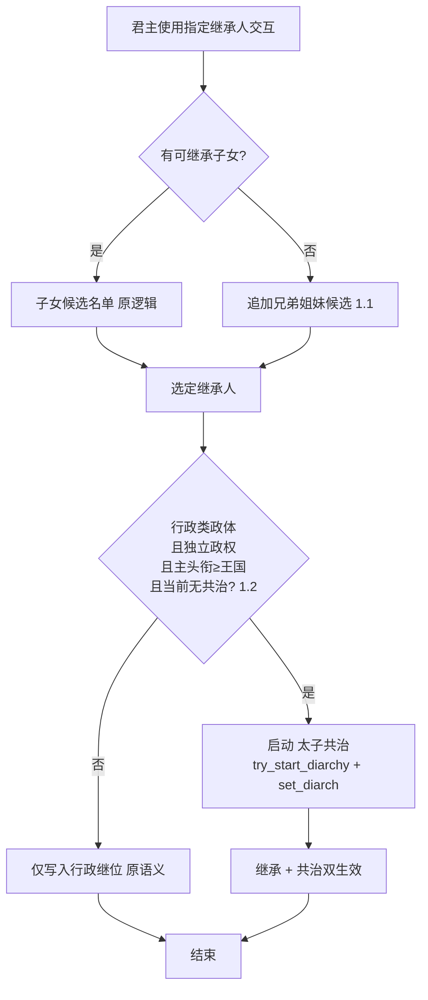
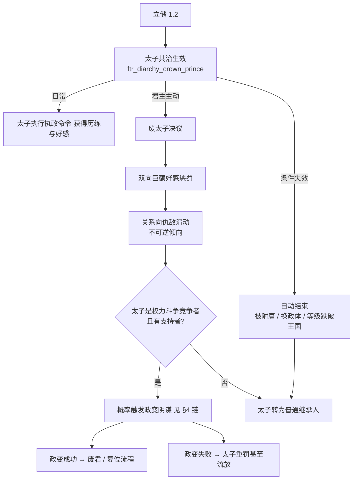
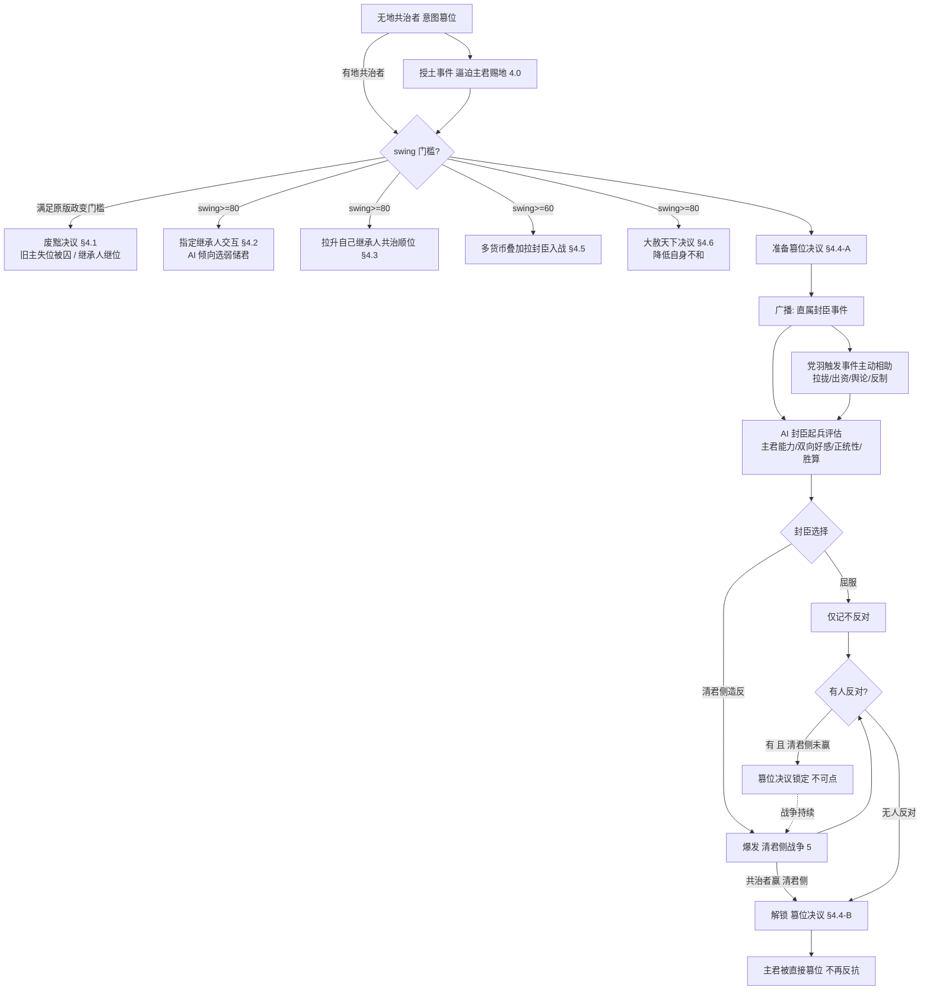
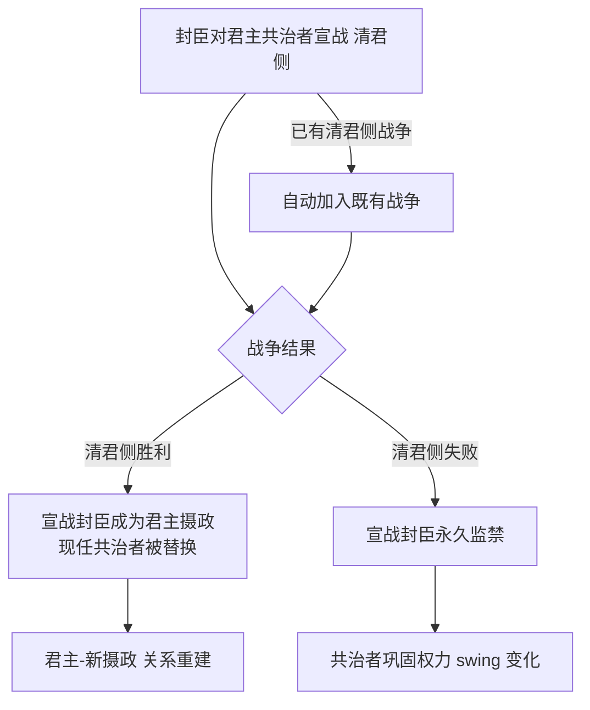

# 共治者机制强化设计

> 本文件是「共治者机制强化」系统的**唯一设计出处**。
> **修改任何相关脚本代码前先读本文件，改完代码后必须同步更新本文件。**
>
> 基线知识：[18 共治系统详解（原版代码基线）](../18-共治系统详解.md)。凡涉及原版 diarchy / 交互 / 决议 / CB 的对象名、行号、参数均以该文为准。
> 关联设计：[01 朝堂权力角逐（权力斗争参与者 / 支持者 / 无地者事件路径）](01-朝堂权力角逐-系统设计.md)、[02 功勋系统](02-功勋系统设计.md)。
>
> **开发硬约束（本任务不可违反）**：**只允许在 `ftr_` 前缀文件下开发，禁止编辑原版任何文件**。「覆盖」一律通过 mod 内同名重定义 + `###### OVERRIDE ######` 标记实现（见 AGENTS §3.4/§4.3）。
> **编写约定**：本文只保留最终结论，不记录变更历史，也不使用落地状态标注；不保留「或 / 待权衡」等占位描述。

---

## 1. 目标与范围

### 1.1 设计目标

在原版 diarchy（共治）机制基础上，为本 mod 的**行政类政体**建立一套贴合「储君 / 权臣 / 篡位」叙事的可玩闭环：

1. 行政类政体的**指定继承人**流程扩展为可立储（含无子立手足、立**太子共治**）；
2. 新增**太子**共治类型（长期储君位，不自动转正为共治皇帝），配套「废太子」权力博弈；
3. **重做共治者篡位链**：从「一拍即合的政变决议」改为「索官索地 → 铺垫 → 舆论战 → 清君侧 → 最终篡位」的多段流程（**继承人线**走夺位、**非继承人线**走官职积累后废立，见 §1.3 / §4.4）；
4. 新增**清君侧**宣战理由，让封臣能以武力介入君主与共治者的关系（胜者**顶替现任共治者**成为摄政）。

### 1.2 需求总览

| # | 需求 | 本文件章节 |
|---|---|---|
| 0 | **通用口径（差异化）**：**继承人共治者（太子）只能走夺位线**；**非继承人共治者先索官索地、过阈值后走废立线** | §1.3 / §3 / §4 |
| 1 | ftr 重写指定继承人：1.1 无继承子女时可选手足；1.2 行政独立政权立储触发「太子共治」 | §2 |
| 2 | 新增「太子」共治类型：行政政体可用（欢呼法亦可）、附庸后失效、废太子双向重罚且复位靠 `coup` 计谋 | §3 |
| 3 | 重做共治者篡位：4.0 无地共治者定期授土提醒、4.1 废黜（旧主失位被囚、继承人继位）、4.2 swing≥80 指定继承人、4.3 swing≥80 拉升继承人共治顺位、4.4 准备篡位→清君侧→最终篡位、4.5 swing≥60 拉封臣入战、4.6 swing≥80 大赦天下 | §4 |
| 4 | 新增「清君侧」CB：封臣对君主共治者宣战，胜则**顶替共治者成为摄政**，败则**永久监禁** | §5 |

### 1.3 适用范围与硬约束

| 项 | 口径 |
|---|---|
| 生效政体 | **太子共治准入**：`government_allows = administrative`（= `government_rules: administrative = yes`，覆盖行政制 / 天朝 / 日本行政 / 官僚制 / 草原行政）；**不可用 `government_has_flag = government_is_administrative`**——该 flag 仅 `administrative_government` 独有，会把其余行政型政体误判出局（表现为立储后毫无反应）。**其余机制（官职线权力、废立 / 篡位链、清君侧）不限政体**——只要求政权存在共治者（清君侧不限行政制，非行政制政权经 01 请愿取得摄政后也有替换入口） |
| 生效等级 | 独立政权为主；**主头衔等级 ≥ 王国**（篡位链同此约束）；被附庸后太子共治失效 |
| 对象范围 | **mod 政体下的所有共治**——含原版 `regency` / `co_monarchy` / `vizierate` 等类型与 mod 新建类型；**身份分流**：主君 `designated_heir` / `designated_diarch` 走**夺位线**，其余走**官职/废立线** |
| 无地限制 | 沿用 01 约束：**无地者不能主动发起决议与交互**；无地共治者的土地诉求改由**事件路径**承载（§4.0 每 3 年提醒） |
| 术语 | 统一用「**不和**」（= 原版 `strife_opinion`，引擎共治面板显示「不和度」） |
| 不可触碰 | 原版所有文件；覆盖全部收口到 ftr 同名对象 |

### 1.4 术语速查

| 词 | 含义 |
|---|---|
| swing / 权力天平 | diarchy 的 0–100 天平，`has_diarchy_active_parameter` 解锁权力档（详见 18 §3/§6） |
| 顺位（共治者顺位） | diarchy 继任候选序列 `every_diarchy_succession_character` / `candidate_score` |
| 欢呼法 | 原版 `acclamation_succession_law`（幼帝/共帝三型的存续前提） |
| 摄政 | 本文指：清君侧胜利后**直接顶替现任共治者**取得的辅政位（`depose_diarch = yes` + `set_diarch = 清君侧者`） |
| 不和 | = 原版 **strife / `strife_opinion`**（引擎共治面板显示「不和度」）。共治者**胡作非为**（越权剥夺 / 收回 / 监禁 / 搜刮等 diarch powers、强制命令事件）时累积的角色值（0–100，月衰减 0.2），令**同领主直属封臣（同僚）**对自己产生 opinion 惩罚；§4.6 大赦天下直接削减该值。 |

---

## 2. 需求一：ftr 重写指定继承人

### 2.1 现状问题

- 原版行政/欢呼法体系的「指定继承人」交互只能从符合继承资格的子女（继承顺位）中选取，**无子即无法指定**；
- 未采用欢呼法的行政独立政权立储后**只影响继位，不产生共治体验**，储君无实际权力博弈；
- 1.2 需求要在不碰原版文件的前提下，把「立储」接到 mod 自己的共治类型上。

### 2.2 设计要点

**1.1 候选池扩展**：**同名覆盖**原版 `designate_heir_interaction`（`common/character_interactions/00_heir.txt`；该对象**被引擎代码引用**，必须沿用原名，只放宽 `is_shown`，其余字段全保留）：
- 原候选逻辑保留（子女 / 继承顺位）；
- 当 `没有可继承的子女` 时，追加展示**兄弟姐妹**（按性别继承法过滤，复用 01 的性别过滤口径）；
- 候选资格**沿用原版 `is_valid` 排除链**（剥夺继承 / 献身 / 骑士团 / 私生）+ 同宗族；
- **独占与锁定**：`NOT = { has_active_diarchy = yes }`——**任何共治期间均不得立储 / 改储**（比原版更严）。此外**候选人本人**也须 `has_active_diarchy = no`（原版 `is_diarch_able_trigger` 硬规则）：该条件由 `designate_heir_interaction.is_valid_showing_failures_only` **前置拦截**——不满足时交互直接失败并给出原因，效果侧不再重复判定。摄政 / 宰相府 / 大秘书处 / 幼主摄政期间**储位一律冻结**；`ftr_diarchy_abolish_crown_prince_decision` 只对 `ftr_diarchy_crown_prince` 可见 ⇒ **原版 `regency` 期间既不能立储、也无"废储"入口**，须先结束共治（原版 `end_interaction` 或 03 的 `depose_diarch`）。**已存在继承人线共治者（共治皇帝 / 共治国王 / 幼年皇帝 / 太子）时不可再重新指定**——改储必须先走废立（§3.2）。锁定锚点 = **已在共治位的继承人线共治者**；仅被 `designate_heir` 指定、尚未形成共治时仍允许更换；
- 写入沿用引擎效果 `set_designated_heir`；**不支持清空**，只支持再指定他人覆盖。

**1.2 太子共治接线**：当「行政类政体（`government_allows = administrative`）+ 独立政权 + **主头衔等级 ≥ 王国** + 当前无共治」四条件同时成立时，指定继承人动作除了改写继位外，额外启动 `try_start_diarchy = ftr_diarchy_crown_prince` + `set_diarch = 目标`（§3 的太子类型），形成**太子共治**。两者**连写、不得加 `has_active_diarchy` 守卫**（原版起手式，见 §9 维护注记）。**主动立储的太子初始天平 = 10**（`ftr_diarchy_crown_prince_voluntary_initial_swing_value`）——低起点，太子须靠经营（索官索地 / 季度背书 drift / 党羽相助）抬升；被逼立储的初值见 §6 接线。

**1.3 未成年指定继承人：不即建共治，成年后补立**（口径）：
- 立储时若指定继承人**未成年**，**不建立太子共治**（`ftr_diarchy_try_start_crown_prince_effect` / `ftr_court_establish_coregency_effect` 的 `is_adult` 守卫**保留**）——共治者须能自理政事（原版 `is_diarch_able` 规则经 `regency_for_personal_reasons_trigger` 判定，未成年仅在带 `diarchy_type_is_junior_emperorship` 参数的类型下豁免，而太子类型不携带该参数）；
- 待其**成年**后，由 **01 故事循环主时钟**（`common/story_cycles/ftr_court_struggle.txt` 的 `effect_group`，60–120 天一拍）调用 `ftr_diarchy_promote_adult_heir_effect` **补建**太子共治，并触发事件 **`ftr_diarchy.0700`** 告知君主、以 interface 消息回执新太子本人；
- 补立同样受「当前无共治」约束：**已有任何共治（含摄政）时不补立**，须先结束共治（储位冻结口径，§2.2 1.1）；
- 共治请愿（01 `0220`）路径：授权对象 = **其背书对象**（若有，且非君主本人），否则请愿者本人；若该对象未成年则不即时共治（`ftr_court_champion_eligible_diarch_trigger` 拦截）→ 待其成年同样由上述补立链路处理（**请愿路径不再单独偏袒 `designated_heir`**）；
- **交互提示**：`designate_heir_interaction.on_accept` 预告两条分支——成年（`ftr_diarchy_heir_corule_immediate_tt`：立储即建共治）／未成年（`ftr_diarchy_minor_heir_promotion_tt`：暂不建共治、成年后依制补立）。写法为**效果域惯用式** `if = { limit = { … } custom_tooltip = { text = … } }`（效果域的 `custom_tooltip` 不接受 `trigger` 子键，见 AGENTS §6.1）。两条提示均以 `ftr_diarchy_can_start_crown_prince_trigger` 为条件，非行政类政体不显示，避免误导；同时替代了 `ftr_diarchy_try_start_crown_prince_effect` 的裸效果行。

### 2.3 改动项评估

| 改动 | 类型 | 落点（均 ftr 文件） | 说明 |
|---|---|---|---|
| 指定继承人交互重定义（`designate_heir_interaction`） | 覆盖 | `common/character_interactions/ftr_diarchy_interactions.txt` | 同名重定义原版对象 + `###### OVERRIDE ######`；1.1 扩展候选 + 1.2 分支 + 独占/锁定判定 |
| 候选人资格触发器 | 新增 | `common/scripted_triggers/ftr_*.txt` | 手足候选人合法集合、性别法过滤 |
| 立储-太子启动效果 | 新增 | `common/scripted_effects/ftr_*.txt` | 判型三条件 + try_start_diarchy 封装 |
| 太子类型（§3 前置依赖） | 新增 | `common/diarchies/diarchy_types/ftr_*.txt` | 被 1.2 引用的类型必须先存在 |
| 双语本地化 | 新增 | `localization/{english,simp_chinese}/…` | `<FTR>` 前缀、文件成对 |

---

## 3. 需求二：新增「太子」共治类型

### 3.1 定位与生命周期

- **类型 key**：`ftr_diarchy_crown_prince`（放 `common/diarchies/diarchy_types/ftr_*.txt`，**新增对象，非覆盖**）。
- **准入**：主君为行政类政体（`government_allows = administrative`，判定口径见 §1.3）、独立政权（`is_independent_ruler = yes`）、**主头衔等级 ≥ 王国**（`highest_held_title_tier >= tier_kingdom`，参照 01 准入口径）、当前无共治；**不排除欢呼法**（欢呼法行政政权若为罗马 / 文化解锁共帝则优先走 `co_emperorship`，其余退用太子）。
- **退出（自动）**：`end` 触发 = 主君失去独立（成为附庸）、或政体不再满足（`NOT = { government_allows = administrative }`，与准入同一口径）、或等级跌破王国。**欢呼法不再导致结束**——避免与 mod 的 `ftr_ursurp_tyrant_succession_effects`（会强加欢呼法）互斥而立即解体。
- **与幼帝共治的关系**：参照 18 §4.2 的 `junior_emperorship` 做减法——它不需要欢呼法、不自动「转正为共治皇帝」，而是作为**长期储君位**存在。
- **结束共治入口（引擎必填）**：`end_interaction = systematically_maim_character_interaction`（与 `junior_emperorship` / `co_emperorship` 同款）。**该键缺失会使引擎报 `End diarchy interaction '' not found` 并导致该类型不可用（`try_start_diarchy` 静默失败）**；共治型不提供主动解散入口，解散一律走废太子决议 / 篡位链。
- **主君驾崩时**：太子共治**结束并登基**，**原版会自动建立新摄政**（`temporary_regency` 是代码默认类型且 `succession = yes`），大权随之交给摄政——**mod 不设兜底**（实测确认原版自动建立如期发生即可）。摄政人选交引擎（`candidate_score` / `diarchy_regent_succession_score_value` 排序）。
- **mandate / 能力**：**照抄原版 `junior_emperorship` 档案**——`power_level` 阶梯 swing 0/20/40/60/80，mandate 三件套（`fill_coffers` / `swell_armies` / `promote_authority`），并叠加「辅政历练」加成；`succession = no`（太子即指定继承人，太子位悬空时按行政继位补，而不是 diarchy 补选）。
- **参数裁剪（2026-09 修正，摆平「君主摆动天平反被共治者受益」）**：**不带** `liege_may_voluntarily_cede_authority`——它是原版 `junior_emperorship` 的「父皇主动放权」专用参数，**全游戏唯一作用**是给君主的「摆动天平」交互解锁「自愿让权」选项，选中即给共治者 **+20 / +30 / +40** swing（原版 `00_diarch_interactions.txt` 的 `swing_cede_authority` 分支，且该参数还会跳过「天平已到底」校验、AI 君主对它的选择权重最高）；**改为带** `lieges_swing_more_against_diarchs`，使君主摆动天平的拉回幅度加倍（**−10 → −20**，带 `power_at_home` 特性且在旅途中为 −30），与共治者侧（+10 / 同前条件 +20）对称。
- **太子权限边界**：太子**可用索官索地类手段**（§4.0 / §4.2 / §4.3），但**不得走废立君主线**（§4.1 对其永久关闭），**只能走篡位线**（§4.4；太子类型在 swing ≥ 80 解锁原版参数 `regents_can_try_to_overthrow_present_lieges`）。

### 3.2 废除太子

- **废太子走决议**（`common/decisions/ftr_diarchy_decisions.txt`），只有主君可见可用。为便于烈度高企时直接动手，该决议**同时挂进 01 朝堂角逐面板**（`common/story_cycles/ftr_court_struggle.txt` 的 `visualization.decisions`，与 `ftr_court_ease_struggle_decision` 同列）——可见/可用仍由决议自身的 `is_shown`（独立 + 能理政成年 + 已是太子共治）/ `is_valid`（有在世共治者 + 太子天平 ≤ 可废门槛）决定，非太子共治期间面板不显示该按钮。
- **时机门槛**：决议**仅在太子天平 `swing ≤ 60`**（`ftr_diarchy_abolish_prince_swing_cap_value = ftr_swing_tier_even_high_value`）时可点击（`is_valid` 内以 `custom_tooltip` 包裹，提示键 `ftr_diarchy_abolish_prince_swing_tt`）——太子羽翼已丰（`swing > 60`）则主君不可轻废，只能转由篡位 / 清君侧链应对。
- **落地效果**：**参考原版废除继承权机制**——`disinherit_effect = { DISINHERITOR = ... }`（加 `disinherited` trait，mod 已在 `ftr_succession_war.on_defeat` 使用）+ `depose_diarch = yes` 结束共治、清除储位，降为普通封臣；`disinherited` trait 天然被 `designate_heir_interaction.is_valid` 排除，与 §2.2 口径闭环。
- **代价（双向）**：双向**固定值**好感惩罚 + **直接推向仇敌**——复用原版三个 opinion modifier：`designated_me_regent_opinion` / `passed_me_over_for_regent_opinion` / `designated_bad_regent_opinion`；**太子党羽**（太子 `ftr_court_supporters` 支持者名单，01 双记账）一并记恨主君（`ftr_diarchy_abolish_backer_opinion_value`）；**主君正统性惩罚**（`ftr_diarchy_abolish_legitimacy_value = -400`）——**仅当主君无正当理由时施加**。
- **正当理由免罚（2026-09 新增）**：`ftr_diarchy_abolish_prince_just_cause_trigger`（§九）= 太子犯有可拘押 / 可夺爵的实罪（`has_imprisonment_reason` / `has_revoke_title_reason`，覆盖 mod 的谋逆 / 谋杀 / 贪墨罪行）或本人已在押。命中则属「执行家法」，**正统性丝毫无损**。两种情形都在决议提示框内以 `custom_tooltip` 明示（`ftr_diarchy_abolish_prince_justified_tt` / `_unjustified_tt`）。
- **党羽去留（2026-09 新增）**：废储当场，逐名在世党羽（太子 `ftr_court_supporters`）以变量指针（`ftr_diarchy_abolished_prince` / `_liege`，`days = 60` 自过期）+ 延迟 2 天派发 `ftr_diarchy.0400`，由其自行选择：**切割退党**（解除 `ftr_court_backer_of`、结清拥立账、自名单除名；废太子记恨 −50，主君视其为可留之人 +20）或**继续留守**（废太子好感 +15，主君记恨 −20）。AI 退党基准 65（怯懦 / 知足更倾向退，忠直 / 情深 / 野心者倾向留守）。
- **AI 口径（主君是否动手）**：三部分共同决定——① **双向好感**（`opinion_modifier` 双向，我与太子互相越厌恶越倾向换，权重 −0.4）；② **党羽压力**（`ftr_diarchy_abolish_prince_pressure_value`：太子党羽中**强力封臣数 ×8**、**内阁成员数 ×6**、**党羽总军力 ×0.005**，封顶 80——**党羽越强，越有换太子的动力**）；③ 太子野心勃勃 +40 / 忠厚老实 −30，天平 ≤ 50 再 +25（趁其羽翼未丰，天平过高时决议已不可点）。
- **复辟政变**：被废太子**用本 mod 的 `coup` 计谋**复辟（`common/schemes/scheme_types/ftr_coup_scheme.txt` + `ftr_coup_success_effect` / `ftr_coup_failure_effect`）；成功 = 推翻自立，失败 = 囚禁或流放（由计谋机制自然触发，不做决议后的硬概率触发）。
  - **实现口径**：`coup` 计谋**保持通用**（不为本系统加「必须是前共治者」的硬前置，否则会破坏 01 既有政变用途）；废太子时只在其身上打 `ftr_diarchy_deposed_prince` 标记，供计谋结局后续分级使用。

### 3.3 改动项评估

| 改动 | 类型 | 落点 | 说明 |
|---|---|---|---|
| 太子 diarchy 类型 | 新增 | `common/diarchies/diarchy_types/ftr_*.txt` | 准入/退出/参数/两向 modifier |
| 太子 hidden 判型参数 | 新增 | 同上 | `ftr_diarchy_type_is_crown_prince`（供 §2/§4 判型） |
| 废太子决议 | 新增 | `common/decisions/ftr_diarchy_decisions.txt` | is_shown 判型 + effect 见下 |
| 废太子-恶感效果 | 新增 | `common/scripted_effects/ftr_*.txt` | 双向好感惩罚 + 仇敌推进 |
| 废太子-政变检测 | 新增 | `common/script_values` / `scripted_triggers` | 竞争者+支持者判定、概率常量 |
| 双语本地化 | 新增 | 中英成对 | `<FTR>` |

---

## 4. 需求三：重做共治者篡位机制

### 4.0 前导：无地共治者授土事件

- **问题**：决议与交互对无地廷臣（含无地共治者）不可用，原版政变链路对无地者失效。
- **方案**：无地共治者**每 3 年**收到一次授土提醒事件（事件路径，符合 01 无地者约束），**三选一**：
  1. **索取**——无条件获取土地；
  2. **暂不考虑**——本次放弃，后续仍会再刷；
  3. **忠心事主**——打角色 flag，此后**不再刷**。
- **索取的土地来源**：主君若持有**除首都外的额外伯爵领**，直接划出一块给共治者；若主君持有**公爵级头衔**，则**随机分封一个公国**，并把该公国**下属伯爵领与封臣一并转移**给共治者。可复用 mod 现成授土/转移路径（`ftr_personal_merit_grant_random_county_effect`、`common/on_action/ftr_title_transfer_on_actions.txt`）。
- **与 §4.1–4.4 的关系**：授土是共治者的**土地诉求**通道；决议链只受 swing 与身份线约束。
- **【2026-09 修复】世族头衔绝不外授**：原筛选只按 `tier = tier_county` / `tier = tier_duchy` 取 `random_held_title`，会把**世族（贵族家族）头衔**当普通地产划出去——该头衔在天朝制为**伯爵级**、行政制为**公爵级**，且与原版家主身份绑定（`00_administrative_effects.txt` 的 `every_noble_family` → `set_house_head = 头衔持有人`），转移后主君**静默失去家主之位**（`change_title_holder type = granted` 不产生任何提示）⇒ 表现为「太子忽然成了家主」。修复：`ftr_diarchy_grant_land_effect` 与门槛触发器 `ftr_diarchy_liege_has_land_to_give_trigger` **两处同步**加 `is_noble_family_title = no`（口径对齐 `ftr_realm_events.txt` / `ftr_realm_on_actions.txt` / `ftr_vassal_interactions.txt`）；`ftr_personal_merit_grant_random_county_effect`（论功授地）同源问题一并加固。
- **【2026-09 修复】授土全程可见**：① 0200 的文案原写成主君视角，但该事件**发给共治者**（`ftr_diarchy_landless_reminder_trigger` 求值域 = 共治者）——AI 太子点「索取」时主君**完全不知情**；现已改为共治者视角；② 划地完成后向**双方各发一条 interface_message**，明写「划出的是哪一个头衔」；③ 选项加 `custom_tooltip` 明示划地规则与「世族头衔不在其列」。
- **【2026-09 重做】按天平分档的两种口气**（阈值 `ftr_diarchy_land_request_swing_value = 60`，读主君一侧的 `diarchy_swing`）：
  - **swing ≥ 60（羽翼已丰）**：0200 选项 a「开口索要」——**保留原逻辑**，共治者直接划地，主君侧通报改为「共治者径直索地」（`ftr_diarchy_take_land_liege_*`，`event_diplomacy_bad` 语气），只是事后知情、拦不住。
  - **swing < 60（羽翼未丰）**：0200 选项 a2「委婉奏请」——请地者写入主君变量 `ftr_diarchy_land_requester`（`days = 60` 自过期）并延迟 2 天派发**主君事件 `ftr_diarchy.0210`**（root = 主君），由**主君裁断**：① 允其所请 → 走同一 `ftr_diarchy_grant_land_effect`（通报文案用「允其所请」语境），共治者 +30 好感（`ftr_diarchy_land_granted_opinion`）；② 温言推托 → 共治者 −20 好感（`ftr_diarchy_land_denied_opinion`）并收到回执。主君侧 AI 取舍：宽厚/公正/仁爱 +20、请地者为继承人 +15、好感 ≥ 40 +15；贪婪/多疑/专断 −20、好感 ≤ −20 −15；无地可划时必然推托。
  - 0200 四项补齐 `ai_chance`（原为四项皆缺省 = 近乎等权随机）：强索 60（野心 +20 / 知足 −20）、奏请 65（同）、暂不考虑 30、忠心事主 5（永久关闭通道，故只偶一为之）。

### 4.1 废黜决议：旧主失位被囚

- **发起人**：**仅非继承人共治者**（太子**不可**使用本决议，只能走 §4.4 篡位线，见 §3.1 权限边界）；且需先完成官职/土地积累。
- **条件**：共治者 swing 满足原版政变门槛（即 `has_diarchy_active_parameter = regents_can_try_to_overthrow_present_lieges` 激活，详见 18 §8.1 门槛表）。
- **行为**：旧主**失去所有头衔**——头衔交给**主君已指定的 `designated_heir`**（未指定时回退到原版继承法）；旧主**被共治者囚禁**，随后弹事件交共治者发落；共治者以「从龙 / 定策功」换取功勋（接入 02 功勋）与合法性，而非直接登基。
- **与 §4.4 的关系**：两者**只差「谁上位」**——§4.1 由继承人继位（共治者隐于幕后）、§4.4 由共治者自立，**其余结局完全一致** ⇒ 抽成**同一个结局效果**（参数化「上位者」），避免两套重复逻辑。

### 4.2 指定继承人交互：共治者为主君指定储君

- **条件**：swing ≥ 80（= 强权上沿，与废黜 / 大赦同档；实现取 `ftr_diarchy_designate_heir_swing_value = ftr_swing_tier_strong_high_value`）；**仅非继承人共治者可用**（太子本身即储君，本交互对其无意义）。
- **行为**：新增交互，共治者越过主君直接为主君设定继承人（复用引擎效果 `set_designated_heir` 写入）。
- **AI 倾向**：AI 共治者优先挑选**年幼、能力差、性格懦弱老实**的继承人（便于日后架空）；并按**与候选人的双向好感**加权（越亲近越想扶上位）。**若现有太子对共治者满意（好感 ≥ 阈值）或性情温顺易摆布，则不再另立储君**。

### 4.3 拉升自己继承人共治顺位：swing ≥ 80

- **行为**：新增交互；当共治者自己的继承人同时也是主君**直属封臣**时（**非直属不可用**），可对该继承人做**扶植**，确保自己离开共治位后由自己人继任，**顺位可拉到第一**。
- **机制取向（实现口径）**：交互成功后在**主君**身上登记候任变量 `ftr_diarchy_boosted_candidate`；挂载原版 `on_diarch_change` 的追加回调，在共治者换届时把该候任者直接 `set_diarch` 上位（随即清空变量）。**不覆盖**原版 `diarchy_regent_succession_score_value` 与任何原版对象——比"改 score"更直接，且无覆盖冲突面。

### 4.4 重做共治篡位决议：两段式「准备 → 落地」

**阶段 A — 准备篡位（新增决议）**：
- **前置**：`swing` 门槛 + **支持者数量门槛**；决议对主君**可见**（这是警告而非秘密），主君可反制（降 swing、拉拢封臣）。
- 点击后向主君**全部直属封臣**（`every_vassal`）广播事件「共治者准备篡位」，并开启**表态窗口**（`ftr_diarchy_phase_a_settle_days_value = 30` 天）；窗口结束即结算（`ftr_diarchy.0021` → `ftr_diarchy_phase_a_settle_effect` 置 `ftr_diarchy_phase_a_done`）。
- 每个封臣选择：**向共治者屈服** 或 **以「清君侧」名义造反**；已有清君侧战争进行中的封臣自动加入（§5）。
- **屈服产出**：屈服者**仅记「不反对」**——**不产生支持者、不直接影响战争阵容、也不移动天平**（原实现「每名屈服者 +5 swing 给共治者」与本节矛盾，且阶段 A 广播全体封臣时可叠出 +50，已删除）；支持者只来自主动站队（§4.5 拉拢 / §4.3 扶植）。
- **AI 起兵评估**：AI 封臣按下述因素加权评估是否造反——主君能力（属性 / 威望 / 军事 / 统治表现）、主君 ↔ 该封臣的**双向好感 opinion_modifier**、主君**正统性**（legitimacy 等级与趋势）、共治者支持者规模与本方胜算；统一收敛为一个「起兵倾向」script value，超过阈值才选择造反，避免 AI 无差别乱反。
- **党羽主动相助**：共治者若持有支持者（党羽，复用 01 支持者记账），准备阶段支持者会**触发事件主动帮助共治者**——拉拢摇摆封臣、出资出人、散布舆论、对清君侧方示警或反制；帮助结果写回支持者列表并进入 AI 起兵评估（抬高造反难度/我方胜算）。**频率与代价**：每党羽每阶段**至多出手 1 次、无自身代价**（`add_character_flag` 带 `days` 限频；`ftr_update_powerful_subjects_list_effect` 驱动"谁出手"）。

**阶段 B — 落地篡位（`ftr_diarchy_coup_landing_decision`，新增决议）**：
- 篡位决议在阶段 A 未完成前**不可点击**：要求 `ftr_diarchy_phase_a_done`（表态窗口已结算）。
- **解锁条件（双通道）**：①无人反对（无 `ftr_diarchy_phase_a_opposed`）→ 解锁；②有反对且**清君侧久拖不决** → `ftr_diarchy.0022` 在 `ftr_diarchy_phase_a_timeout_days_value = 365` 天后置 `ftr_diarchy_phase_a_timeout` 强制解锁（清君侧战败亦由 `ftr_qingjunce_defeat_effect` 置该标记并清除反对）。
- **单一入口**：决议 `is_shown` 排除「原版政变参数已生效」的类型（`NOT liege = { has_diarchy_active_parameter = regents_can_try_to_overthrow_present_lieges }`）——已带该参数的共治皇帝 / 共治君主 / 摄政 / 宰相走原版 `diarch_attempt_to_overthrow_liege`，ftr 链只服务不授予该参数的类型（太子）。ftr 自持门槛——**阶段 A 准备 = 强权上沿（≥80）**、**阶段 B 落地 = 独断档（≥90，与 01 夺位同档）**。
- **结局**：主君被直接篡位、**囚禁**——复用 §4.1 共用结局 `ftr_diarchy_oust_liege_to_self_effect`（共治者接手全部头衔 → 排 `ftr_diarchy.0100` 发落），不走原版随机对峙事件链。

### 4.5 高阶权限：拉封臣入战（swing ≥ 60）

- **条件**：共治者 swing ≥ 60，且**共治者有地**（无地者无影响力收入，避免成本死锁）；
- **行为**：支付货币**可多选叠加**（金钱 / hook / 影响力，照抄 `ftr_diarch_request_support_interaction` 的 `send_option` 结构），**多给可提高接收者同意倾向**；要求**主君直属封臣加入自己的战争**（含 §5 清君侧、§4 篡位相关战争）；
- **请求门槛**：**对方不会同意时不允许送出请求**——用 `is_shown` / `is_valid` 对 recipient 加意愿判定，把必然拒绝者从候选列表隐藏（判定须与接受逻辑一致，避免"显示却不接受"）；
- **结算**：接受者实际加入战争并消耗已付报酬。
- **AI 决策**：出手意愿由三部分决定——① **send_option 激活越多越不愿出手**（每项减分，两项以上叠加递增，见 `ftr_diarchy_levy_vassal_option_cost_value`）；② **「敌我比」方向化判定**（我方 = 共治者所在方，军力由 `every_war_attacker/defender` 求和）：**任一场战争敌我比 ≥ 2（我方被压制）→ 加分、需要拉人**（取 `any_character_war`）；**所有战争敌我比都 ≤ 0.5 且确实在打仗 → 处处压倒性优势，减分、不必拉人**（取 `is_at_war = yes` + `every_character_war`，`ftr_diarchy_war_outnumbered_trigger` / `ftr_diarchy_war_overwhelming_trigger`）；③ 天平 ≥ 80 加分、目标对共治者的好感加权。

### 4.6 高阶权限：大赦天下（swing ≥ 80）

- **条件**：共治者 swing ≥ 80，且**共治者有地**；
- **行为**：新增「大赦天下」决议，共治者以主君名义颁行大赦——① **大幅削减自身不和（`strife_opinion`）**，以引擎效果 `change_strife_opinion = 负值` 实现（参照原版「邀请权势共治同僚到场可降不和」）；② **赦免主君所有直属封臣的罪行**：借原版赦免机制 `consume_all_criminal_reasons_effect = { LIEGE = 主君  CRIMINAL = 该封臣 }`（内部逐项 `consume_imprisonment_reasons` / `consume_banish_reasons` / `consume_execute_reasons` / `consume_revoke_title_reason`），把四类可处罚理由一律记为**已处罚**；③ **释放囚犯**：`every_prisoner = { release_from_prison = yes }`，范围 = **主君监狱 + 共治者自己监狱**的全部囚犯；
- **受益者回流**：**所有受益者**（被赦封臣 + 被释囚犯）**大幅提升对共治者的好感**（`ftr_diarchy_amnesty_beneficiary_opinion`，+50/25 年）；并按好感**分档概率**触发 `ftr_diarchy.0300`「大赦之恩」引导其为共治者**背书**（好感 ≥ 40 → 25%，≥ 0 → 10%）。背书按 01 双记账规范登记（`ftr_court_backer_of` + 被支持者 `ftr_court_supporters` 名单），并按 02 记拥立功。
- **代价**：**固定值削减 + 冷却 5 年**（`cooldown = { years = 5 }`）+ 主君好感与正统性小幅代价，防止连续滥用无限洗白。

### 4.7 改动项评估

| 改动 | 类型 | 落点 | 说明 |
|---|---|---|---|
| 授土提醒事件（4.0） | 新增 | `events/ftr_diarchy_events.txt` | 无地共治者每 3 年提醒，三选一（索取 / 暂不考虑 / 忠心事主） |
| 废黜决议（4.1） | 新增 | `common/decisions/ftr_diarchy_decisions.txt` | 旧主失位被囚 + 头衔移交 `designated_heir`（回退继承法）；仅非继承人线 |
| 指定继承人交互（4.2） | 新增 | `common/character_interactions/ftr_*.txt` | 共治者替主君立储（`set_designated_heir`）；仅非继承人线；AI 偏置 |
| 拉升共治顺位交互（4.3） | 新增 | `common/character_interactions/ftr_diarch_interactions.txt` | 条件：直属封臣 + swing≥80；登记候任变量 `ftr_diarchy_boosted_candidate` + `on_diarch_change` 顶替 |
| 准备篡位决议（4.4-A） | 新增 | `common/decisions/ftr_*.txt` | swing + 支持者双门槛；广播入口（对主君可见，属警告） |
| 篡位落地决议（4.4-B） | 新增 | `common/decisions/ftr_diarchy_decisions.txt` | 新增 `ftr_diarchy_coup_landing_decision`；原版 `diarch_attempt_to_overthrow_liege` 对已带政变参数的类型仍可用（ftr 决议对其隐藏） |
| 篡位事件链 | 新增 | `events/ftr_diarchy_events.txt` | 封臣表态、无人反对判定、直接篡位结算 |
| AI 起兵倾向 script value | 新增 | `common/script_values|scripted_triggers/ftr_diarchy_*.txt` | 主君能力 / 双向好感 / 正统性 / 胜算 → 造反阈值 |
| 党羽相助事件 | 新增 | `events/ftr_diarchy_events.txt` | 支持者主动帮助（拉拢 / 出资 / 舆论 / 反制） |
| 拉封臣入战入口（4.5） | 新增 | `common/character_interactions/ftr_*.txt` | 多货币可叠加拉主君封臣入伍；**必拒者不出现在候选**；成本常量走 §7 |
| 大赦天下决议（4.6） | 新增 | `common/decisions/ftr_diarchy_decisions.txt` | 固定值降自身不和；冷却 5 年 + 代价 |
| 全局判定触发器/效果 | 新增 | `common/scripted_triggers|effects/ftr_*.txt` | 阶段互锁、解锁条件、结局过户（参照 18 §8.4） |
| 双语本地化 | 新增 | 中英成对 | `<FTR>` |

**AI 口径**：AI 可用全部决议与交互——决议写 `ai_check_interval` 或 `ai_goal`（二选一），交互写 `ai_accept`；**两类共治者（继承人线 / 官职线）各写一套权重**，不共用 `ai_will_do`。

---

## 5. 需求四：新增「清君侧」宣战理由

### 5.1 定义与规则

- **CB**：新增 ftr CB（参照既有 `ftr_succession_war` / `ftr_celestial_wars` 的写法），目标 = **主君当前共治者**；宣战主体 = 主君直属封臣（含被事件动员者，见 §4.4）。
- **准入闸门**：宣战方 = `ftr_qingjunce_can_declare_trigger`（有地 / 成年 / 未囚 / 非独立 / 主君有共治者且 diarch ≠ 本人 / 无进行中的清君侧战争）；目标主君 = `ftr_qingjunce_target_eligible_trigger`（**独立 + 主头衔 ≥ 王国 + 有共治者**，**不再要求行政制**）。
- **胜败结局**：
  - 封臣（清君侧方）**胜利** → **直接顶替现任共治者**：`depose_diarch = yes` + `set_diarch = 清君侧者`（必要时 `set_diarchy_type`），该封臣成为君主摄政；
  - **现任共治者战败** → **被囚**（需额外监禁与释放逻辑）；
  - 封臣（清君侧方）**失败** → **永久监禁**（战争失败结算时直接执行）；
  - **主君惩罚** → **不设**：主君不额外惩罚清君侧方，只走战争结算；`ftr_court_struggle.0130` 保留为叙事 / 后续钩子，不挂惩罚选项。
- **与 §4.4 的接线**：已有清君侧战争时，新表态的造反封臣直接加入该战争（不重复开战）；清君侧战败 = 共治者篡位链解锁。

### 5.2 改动项评估

| 改动 | 类型 | 落点 | 说明 |
|---|---|---|---|
| 清君侧 CB 定义 | 新增 | `common/casus_belli_types/ftr_*.txt` | 目标共治者、允许方、胜负结算效果 |
| 胜负结算效果 | 新增 | `common/scripted_effects/ftr_*.txt` | 胜→`depose_diarch` + `set_diarch` 顶替；现任共治者败→被囚；清君侧封臣败→**永久监禁** |
| 自动加入战争 | 新增 | 同上 / 事件 | 已有清君侧战争时，表态造反的封臣直接加入（`add_attacker`） |
| CB 本土化文案 | 新增 | 中英成对 | `<FTR>` |
| （可选）监禁/释放钩子 | 新增 | `common/on_action/ftr_*.txt` | 追加语义，非覆盖 |

---

## 6. 与既有系统接线与风险

| 系统 | 接线点 | 风险 / 说明 |
|---|---|---|
| 01 朝堂权力角逐 | 废太子 → `coup` 计谋（§3.2）、清君侧可动员支持者、无地者事件路径、**共治请愿落地**（`ftr_court_establish_coregency_effect`） | **共用同一根轴**：01 自研变量只有「朝堂烈度 `ftr_court_struggle_intensity`」，其共治类门槛直接读写引擎 `diarchy_swing`，阈值与本文统一（§7.1 / §7.2）。**请愿落地（2026-09 定案）**：**授权对象分类（背书对象优先）**——① 请愿者若有**背书对象**（非君主本人）→ 授其背书对象；② 否则授请愿者本人。授权对象属**合法继承人之一**（`ftr_court_is_legitimate_heir_of_trigger`）→ 复用 `ftr_court_establish_champion_coregency_effect` 按政体分流（**共治皇帝 / 太子 / 共治君主 / 缺省固化摄政**）；否则由授权对象取得原版 `regency` 并置 swing = 80。**发动门槛**：只要「存在朝堂角逐故事 + 君主有合法继承人」（原「烈度 ≥ 90」与「参与者达标」均已撤；失能口径含 `infirm` / `fragile_bones` / `health ≤ poor`，01 §7.1）；另设**接收方冷却**——同一君主受理一份请愿后 **2 年**（`ftr_court_petition_cooldown_years_value`）内不受理新的（`ftr_court_petition_in_cooldown_trigger`）。**党羽逼宫**（01 §13）按政体分流直接建立四类共治，并复用本文 §4.4「共治者自立」结局实现「共治者直接登基」 |
| 02 功勋 | 废黜（4.1）给「从龙功」、清君侧胜利给拥立功 | **复用 02 既有记账**（`ftr_personal_merit_backing_add_effect` / `ftr_personal_merit_crown_add_effect`），勿再造第二套 |
| 原版 co_emperorship / regency / vizierate 等类型 | 4.x swing 档、政变门槛沿 18 §8.1 | **纳入**：mod 政体下所有共治都走官职/废立线；身份分流用 `designated_heir` / `designated_diarch` 判定，**不改原版 diarchy 类型定义** |
| 无地限制 | 全文（尤其 §4.0） | 所有「主动出手」都要给事件出口，禁止出现无地玩家点不到的局面 |

---

## 7. 数值常量

> **阈值与跨文件共用常量**集中在 `common/script_values/ftr_diarchy_values.txt`；**AI 权重**（`ai_will_do` / `ai_accept` / `ai_chance` 内的加减分与 AI 内部阈值）**一律直接写字面数字**，就地可读、便于调参，不再抽常量。

| 常量 | 用途 |
|---|---|
| `ftr_swing_tier_loyal_value` = 30 / `_even_mid_value` = 50 / `_even_high_value` = 60 / `_strong_low_value` = 70 / `_strong_high_value` = 80 / `_absolute_value` = 90 | **全 mod 共用 swing 档位**（01 与本系统均引用，见 §7.1） |
| `ftr_diarchy_depose_like_threshold_value` | 废黜决议 swing 门槛（= 强权上沿 80） |
| `ftr_diarchy_coup_landing_swing_value` | 篡位落地门槛（= 独断档 90） |
| `ftr_diarchy_designate_heir_swing_value` / `ftr_diarchy_boost_line_swing_value` / `ftr_diarchy_amnesty_swing_value` | 立储 / 拉升顺位 / 大赦门槛（= 80） |
| `ftr_diarchy_levy_vassal_swing_value` | 拉封臣入战门槛（= 均势上沿 60） |
| `ftr_diarchy_prepare_coup_supporter_threshold_value` | 准备篡位的支持者数量门槛（= 2） |
| `ftr_diarchy_swing_drift_per_backer_value` / `_swing_drift_liege_backer_multiplier_value` / `_swing_drift_cap_value` / `_swing_drift_cap_min_value` / `_swing_drift_positive_min_value` / `_swing_event_chance_value` / `ftr_diarch_counter_swing_threshold_value` / `ftr_diarch_backlash_event_chance_value` | 季度背书 drift 的折算 / 君主党羽折算溢价（1.5）/ 上下限（+1 ~ −3）/ 正值生效门槛（2）/ 0500 派发概率 / 0500 派发门槛（中性 50）/ 0510 派发概率（15）（§7.2） |
| `ftr_diarchy_abolish_opinion_mutual_value` / `_abolish_backer_opinion_value` / `_abolish_prince_swing_cap_value` / `_abolish_legitimacy_value` / `_abolish_*_backer_weight_value` / `_abolish_pressure_cap_value` | 废太子的双向好感惩罚 / 党羽好感惩罚 / 可废 swing 门槛 / 正统性代价，以及与 AI 党羽压力（§3.2）；双向好感权重 −0.4 已内联在决议 `ai_will_do` |
| （无常量，内联在交互 `ai_will_do`） | 替主君立储的 AI 偏置（§4.2）：幼弱者 +40 / 弱能怯懦 +20 / 现有太子令人满意 −60（满意好感阈值 50） |
| `ftr_diarchy_grant_land_reminder_years_value` | 无地共治者授土提醒间隔 = 3 年（§4.0） |
| `ftr_diarchy_crown_prince_voluntary_initial_swing_value` / `_imposed_initial_swing_value` | 太子初始天平：主动立储 = 10 / 被逼立储（请愿・逼宫）= 40（§2.2 / §6） |
| `ftr_diarchy_ai_revolt_weight_*` / `_ai_revolt_threshold_value` | AI 起兵倾向权重与阈值（§4.4-A）；大动作决议的最低意愿 30 已内联在交互 `ai_will_do` |
| `ftr_diarchy_supporter_help_chance_value` / `_supporter_help_effect_value` | 党羽主动相助的概率与效果（§4.4-A） |
| `ftr_diarchy_levy_vassal_*` | 拉封臣入战（§4.5）常量：货币成本 / 必拒门槛 / 选项惩罚；**AI 同意加权（黄金 20 / 人情 10 / 影响力 20 / 基础 −20）与敌我比加减分（+40 / −50）已内联在交互 `ai_accept` / `ai_will_do`** |
| `ftr_diarchy_amnesty_*` | 大赦天下（§4.6）：不和削减 / 冷却 / 代价 / 背书引导分档 |
| `ftr_qingjunce_*` | 清君侧（§5）：swing / 不和 / 威望成本 / 功勋 |
| `ftr_diarchy_phase_a_settle_days_value` / `_phase_a_done_days_value` / `_phase_a_timeout_days_value` | 准备篡位阶段 A 的窗口 / 结算存续 / 超时（§4.4） |

---

### 7.1 swing 档位

引擎 `diarchy_swing`（0–100）是本 mod **唯一**的权力轴；档位常量组（§7 首行）由 01 与本系统共用：

| 档 | swing | 语义 | 解锁 |
|---|---|---|---|
| 辅政稳固 | ≤30 | 君主压制 | 01 保皇派胜利判定 |
| 均势 | 40–60 | 日常博弈 | 征调封臣入战（≥60） |
| 强权 | 70–80 | 权臣成型 | 请愿共治（≥70）；废黜 / 篡位准备 / 大赦 / 立储 / 扶植（≥80） |
| 独断 | ≥90 | 君王虚位 | 夺位落地（01 夺位 + 本文 §4.4-B） |

**已知缺口——太子难达篡位门槛**：太子类型 `swing_balance` 抄自 `junior_emperorship`（按年龄 0/10/20/30），引擎每月按 `DIARCHY_MONTHLY_POWER_CHANGE = 0.25` 把 swing **向该值回落**；单次抬升仅 `minor_sop_swing_diarch_gain` 量级（≈+5）。故无持续经营时太子几乎无法抵达独断档，须依赖 §7.2 的季度背书 drift 与党羽相助。**太子初始天平两档**：主动立储 = **10**（`ftr_diarchy_crown_prince_voluntary_initial_swing_value`）、被逼立储（共治请愿 / 党羽逼宫）= **40**（`ftr_diarchy_crown_prince_imposed_initial_swing_value`，`ftr_court_establish_champion_coregency_effect` 内按 `has_diarchy_type = ftr_diarchy_crown_prince` 分流）。**历史坑**：该效果原本对四种类型一视同仁地 `set_diarchy_swing = 80`（取自党羽逼宫的「逼宫所得不可虚位」口径），导致请愿立太子后 swing 一次到位 80（0220 再 +5 → 85），与本节"太子须慢慢经营"的设计相互矛盾。

### 7.2 整合实现

**① 统一档位**：全 mod 共用档位常量组 `ftr_swing_tier_*`（§7 首行，`common/script_values/ftr_diarchy_values.txt`）。两套系统全部引用：

- 01：`ftr_court_swing_loyal_threshold_value`（30）、`..._usurp_threshold_value`（90）、操纵内阁门槛（强权下沿 70，`ftr_swing_tier_strong_low_value`）、0500 派发门槛（中性 50，实测为 `ftr_diarch_counter_swing_threshold_value`）；
- 本文：征调封臣入战 = 均势上沿（60）；废黜 / 篡位准备 / 大赦 / 立储 / 扶植 = 强权上沿（80）；**篡位落地 = 独断档（90，与 01 夺位同档）**。

**② swing 的人工成长：季度背书博弈**
- 挂载点：`quarterly_playable_pulse`（原版季度脉冲，root = 可玩角色）→ `ftr_diarchy_quarterly_drift_on_action`（仅**君主**一侧执行，`is_diarch = no` 防重复）；
- 效果 `ftr_diarchy_quarterly_swing_drift_effect`：
  1. **背书差 → swing**：`ftr_diarchy_backer_swing_drift_value` =（背书共治者人数 − 背书君主人数 × **1.5 折算溢价**）× **1 点/人**，**夹在 −3 ~ +1**（正向上限刻意低于负向），且**正值另设生效门槛**——加权领先须 ≥ `ftr_diarchy_swing_drift_positive_min_value`（= 2）才推共治者一侧，否则「共治者党羽略多」会退化成每季恒定的上行泵；负值不设门槛，保证君主领先时必能拉回。经 `hidden_effect = { change_diarchy_swing = ... }` 静默施加（不走带 tooltip 的原版封装，避免刷提示）。**溢价理由**：共治者天然更易积累党羽（大赦天下 / 请愿 / 逼宫都把党羽记在其名下），原「共治者人数 − 君主人数」的对称算法使 drift **长期单向上行（+3/季 ≈ +12/年）**——引擎侧每月只回落 0.25（≈ −3/年），故天平会「只涨不跌」；
  2. **档位派发拉锯事件**（2026-09 二次收紧，两侧有效度对齐）：天平 ≥ **50（中性）**（`ftr_diarch_counter_swing_threshold_value`）→ 25% 概率派 `ftr_court_struggle.0500` 给一名**非共治者党羽**的有地封臣（其选项 a 成功率由 55% 提到 **85%**、选项 c「静观其变」权重 20 → 10，避免君主侧回拉被掷骰与消极选项吃掉）；反之（**任意天平值**，2026-09 起不再设档位门槛、含共治者已占优时）→ **必发**（`ftr_diarch_backlash_event_chance_value` 已调为 100，实际频率由对垒自身冷却把关）**启动「党羽游说对垒」**（`ftr_diarchy_backer_lobby_pk_effect`，**2026-09 起取代原 `0510` 事件**）：双方各从自己的 `ftr_court_supporters` 随机抽一人，按「智谋 + 外交」对垒，胜方一次推动 **±5**（政权 **2 年**冷却 + 参战者个人 **3 年**冷却兜底，且不变量「政权冷却 < 个人冷却」以保证阵营内轮换）；结算结果以**事件通报**（`ftr_diarchy.0800` 共治者方得手 / `ftr_diarchy.0801` 君主方得手，均**只有一个确认选项**）发给主君、共治者与两名说客；**前置：共治者党羽不落后于君主**（`ftr_diarchy_backer_lead_value >= 0`——有党羽撑腰才谈反扑）。该入口从主时钟与季度 drift **两个通道**均可到达。
- 与「大赦收买党羽」形成闭环：**大赦背书 → 背书差 → 季度 swing 上移 → 解锁 80 / 90 档**。
- **背书来源（01 侧，已扩展）**：事件 `ftr_court_struggle.0200` 的表态目标除前五候选外，新增**君主**与**共治者**独立选项（共治者与竞争者同一人时按候选位去重）。两条路径都记账为 `ftr_court_backer_of` + 被支持者 `ftr_court_supporters`，因此**直接计入本节背书差**；AI 侧另有「忠诚惯性」抑制频繁改投。01 的共治者倾向按**共治类型**分流，故本文件新增 `ftr_diarchy_is_heir_co_rule_type_trigger`（太子・共治皇帝・共治君主・幼主 = 继承人/共治型，其余为官职线；见 01 §7.1）。
- 已知限制：`quarterly_playable_pulse` 只覆盖 **playable** 角色；AI 政权侧无此季度漂移（仍靠 01 的 story 链与引擎 `swing_balance` 自然演化）。如需覆盖 AI，可另挂 `random_yearly_everyone_pulse`（年度、全角色）。

**③ 0500 / 0510 泛化**：两个事件的 `immediate` 末尾带作用域兜底——当**不存在朝堂角逐 story** 时，用共治关系补全 `scope:ftr_court_story_owner`（取 `liege` → `top_liege`）。由此两事件脱离 01 的 story 也能工作，成为**共治期的日常 swing 拉锯层**，补上 §4.4 只能"一次性摊牌"的空档。

**④ 主君反制**：§4.4-A 的"主君可降 swing / 拉拢封臣"不依赖主动交互——拉锯由事件族承担：`0500`（≥50 时派发，push swing 向君主）+ 君主侧的背书（01 事件 0200 的君主选项）经季度背书差回拉；此外原版「摆动天平」交互本身即主君的反制窗口（一次 −20，见 §3.1），无需新代码。

**⑤ 党羽逼宫按政体分流建立共治（01 §13）**：01 的「党羽逼宫」出口——某资格权贵（竞争者 / 共治者）的党羽规模达标后，其党羽向最高领主发难。分支①（朝中无共治者）由 `ftr_court_establish_champion_coregency_effect` **按政体分流**建立本文四类共治：**东罗马 / 拜占庭（欢呼法 + 罗马皇帝头衔或文化 `unlock_co_emperors`，`may_appoint_co_emperors_trigger`）→ 共治皇帝 `co_emperorship`**、**其他行政类政体（`government_allows = administrative`）→ 太子 `ftr_diarchy_crown_prince`**、**其他政体 → 共治君主 `co_monarchy`**、**缺省 → 固化摄政 `regency`**，并统一置 `diarchy_swing = 80`（强权上沿）。分支②（君主已有共治者、且该共治者**正是党羽拥立的对象**、`swing ≥ 80`）复用本文 §4.4「共治者自立」结局 `ftr_diarchy_oust_liege_to_self_effect`，令共治者**直接登基**，随后由 01 把朝堂角逐故事移交新君。**本文不新增 diarchy 类型 / 决议**，全部复用既有件。

**涉及 01 的文件**（跨系统改动时须同步）：`common/script_values/ftr_court_struggle_values.txt`、`common/character_interactions/ftr_councillor_intercation.txt`、`events/ftr_court_struggle_events.txt`。

## 8. 文件清单

| 文件 | 内容 |
|---|---|
| `common/diarchies/diarchy_types/ftr_diarchy_types.txt` | 太子共治类型（含 `ftr_diarchy_type_is_crown_prince` 隐藏参数） |
| `common/decisions/ftr_diarchy_decisions.txt` | 废太子 / 废黜 / 准备篡位 / 篡位落地（新增，不覆盖原版）/ 大赦天下 |
| `common/character_interactions/ftr_diarch_interactions.txt` | 覆盖 `designate_heir_interaction`（手足候选 + 独占锁定 + 立储接线 + **成年/未成年分支条件提示**）；新增 代君立储 / 扶植继任 / 征调封臣 |
| `common/casus_belli_types/ftr_diarchy_wars.txt` | 清君侧 CB（胜=顶替共治者、败=永久监禁、现任共治者败=被囚） |
| `events/ftr_diarchy_events.txt` | 0010 警告 / 0020 表态 / 0002 阶段 A 结算（hidden）/ 0210 超时兜底（hidden）/ 0600 发落废君 / 0200 授土提醒 / **0700 成年晋位太子共治（告知君主 + 回执太子，自带 `trigger`：`has_active_diarchy` + `exists = diarch`，补立失败即不触发）** |
| `common/scripted_effects/ftr_diarchy_effects.txt` | 立储接线 / **成年补立太子共治 `ftr_diarchy_promote_adult_heir_effect`（由 01 主时钟调用）** / 授土 / 共用结局 / 废太子 / 大赦 / 阶段 A 计时与结算 / 清君侧结算 / 征调入战 |
| `common/scripted_triggers/ftr_diarchy_triggers.txt` | 准入 / 身份分流 / 天平门槛 / 候补 / 阶段互锁 |
| `common/script_values/ftr_diarchy_values.txt` | 全部门槛、成本与 AI 权重常量 |
| `common/on_action/ftr_diarchy_on_actions.txt` | 授土提醒年脉冲 + `on_diarch_change` 候任顶替钩子 |
| `common/opinion_modifiers/ftr_opinion_modifiers.txt` | 3 个 opinion modifier（大赦 / 废君 / 清君侧恶名） |
| `localization/{english,simp_chinese}/ftr_diarchy_l_*.yml` | 上述全部可见文本（`<FTR>` 成对） |
| 原版 `diarch_attempt_to_overthrow_liege` | **不覆盖**；对已带政变参数的类型保持原版行为 |

**维护注记**：
1. **已确认的引擎约束（必须遵守，否则静默失败或刷 error.log）**：
   - 清空储位只能用原版 `clear_designated_heir = yes`（`set_designated_heir = none` 报 `target: field not set`）；
   - `vassal_stance` 只能作为 `every_vassal` 的**直连过滤器**（放进 `limit` 报 `Unknown trigger`）；
   - 触发器语境下没有 `every_character_war`（仅效果语境可用），「全部战争」须写成 `NOT = { any_character_war = { NOT = { ... } } }`；列表迭代器在**触发器语境**下不能包 `limit`（报 `Unknown trigger: limit`）；
   - `update_diarchy_swing_with_perspective_effect` 在无共治时调用会报 `no active diarchy`，调用前须判 `has_active_diarchy = yes`；
   - diarchy 类型必须给 `end_interaction`（见 §3.1）；
   - diarchy 类型必须提供**两条本地化键**：`<type>_diarchy_type`（类型名——共治窗口标题，以及 `update_diarchy_swing_with_perspective_effect.preamble` 里的 `GetDiarchyTypeName`）与 `<type>_diarch_title`（共治者头衔）；键名规范对照原版 `diarchies_l_*.yml` 的「Diarchy Types」段，缺任一条 UI 会显示裸键；
   - 交互 AI 块的 `base` 不接受脚本值（报 `Malformed token`），脚本值一律走 `modifier = { add = ... }`；
   - 裁决类决议需补 `<key>_confirm` 本地化键；CB 需补 `war_name`；
   - 事件 ID 只能为纯数字（`00A1` 这类含字母的 ID 会被判为非法）；
   - **全 mod 凡表「行政类政体」一律用 `government_allows = administrative`**，不可用 `government_has_flag = government_is_administrative`（该 flag 仅 `administrative_government` 独有，天朝 / 日本行政 / 官僚制 / 草原行政只是 `government_rules: administrative = yes`）；该 flag 只允许用于**专指行政制本体**的场合（如转政体决议的 `become_admin_decision` 选项）；
   - `try_start_diarchy` 与 `set_diarch` 必须**连写、不加 `has_active_diarchy` 守卫**（原版 `faction_demands` / `grand_ambitions` 均如此）；用守卫包住会因标志未及时置位而跳过 `set_diarch`，形成「共治类型建立了但共治者位空置」；
   - diarchy 的共治者候选还须满足引擎硬规则（原版代码引用）`is_diarch_able_trigger` / `is_diarch_valid_trigger`：`is_imprisoned = no`、`NOT = { has_active_diarchy = yes }`、`regency_for_personal_reasons_trigger = no`——其中 `has_active_diarchy = no` **前置**到 `designate_heir_interaction` 的校验层拦截，不在效果内静默判定。
2. **仍需进游戏确认**：`death = { death_reason = death_execution }`、脚本 `start_war` 能否通过 CB 校验、`pay_short_term_gold` / `change_influence` 在 `on_accept` 的扣款时机、幼帝继位是否由原版自动建立摄政（预期：自动，无需 mod 兜底）；
3. **不覆盖原版**：`diarch_attempt_to_overthrow_liege` 保持原样（§4.4）；本系统覆盖对象**仅** `designate_heir_interaction` 一项，改动前按 AGENTS §4.3 复核；
4. `on_diarch_change` / `random_yearly_everyone_pulse` 属**追加式挂载点**，按 AGENTS §3.4 不加 override 标记（校验脚本的 Warning 属预期）；
5. `tools/validate_scripts.py` 白名单：`ftr_diarchy_*` 对象由脚本自动纳入，无需手工登记。

## 9. 测试要点（人工确认）

1. 有子无子两分支立储 + 手足立储；行政独立国立储后太子共治出现、控制台验证类型已挂载。
2. **独占 / 锁定**：已有共治者（如摄政）时立太子入口消失；已存在继承人线共治者时**无法重新指定**（须先废太子）。
3. **身份分流**：同一共治类型内，`designated_heir` / `designated_diarch` 共治者只出现**篡位线**（§4.4）；其余共治者出现**官职 / 废立线**（§4.1–4.6），且废立决议对太子不可见。
4. 太子被废：双向固定值惩罚 + 直接仇敌；`disinherited` trait 已加、储位已清；前共治者可用 `coup` 计谋发起复辟（成=自立，败=囚 / 流放）。
5. 无地共治者：每 3 年授土提醒可正常触发；三选一各打一遍——索取（主君非首都伯爵领划出 / 公国连下属转移）、暂不考虑（后续再刷）、忠心事主（此后不再刷）。
6. 篡位链：阶段 A 前置（swing + 支持者）与决议锁定生效；"清君侧未胜被锁 / 超时自动解锁 / 无人反对" 三种走向各打一遍；阶段 B 后旧主**被囚**。
7. 清君侧 CB：胜→`depose_diarch` + `set_diarch` **顶替**；清君侧方败→**永久监禁**；现任共治者败→**被囚**；已有战争时新动员方自动加入不重复开战。
8. AI 共治者执行 §4.2 时偏好年幼 / 弱能 / 怯懦继承人。
9. swing≥60 拉封臣入战（§4.5）：货币可多选叠加、多给更易同意；**必然拒绝者不出现在候选列表**；接受者实际参战并扣款。
10. swing≥80 大赦天下（§4.6）：自身不和显著下降、同僚 opinion 惩罚随之回落；**5 年冷却**内不可重复；主君好感 / 正统性代价生效。
11. 准备篡位阶段：AI 封臣按「主君能力 / 双向好感 / 正统性 / 胜算」的起兵倾向阈值行动——强主低造反、弱主高造反；**党羽游说（2026-09 重做）**：阶段 A 开局时，君主与共治者各从自己的 `ftr_court_supporters` 名单中**随机抽一人**对垒，评分 = **智谋 + 外交**，共治者方胜率 = 50 +（评分差 × 2.5），夹在 10~90，胜方一次推动 swing **±5**——不再按党羽人数逐名 +5。频率闸门四重：① 仅阶段 A 开局一次；② 同政权冷却 **1 年**；③ 任一方无人可派时不出手；④ **参战者个人冷却 1 年**（阵营内轮换，防「人少但强」的一方每次派同一强手形成一边倒）。
12. 主君驾崩 + 太子年幼：太子共治结束并登基、**原版自动建立新摄政**（`temporary_regency`）——实测确认该自动建立如期发生即可，mod 不设兜底。
13. 全程 error.log 无本 mod 报错；覆盖对象仅 `designate_heir_interaction` 一项；原版 `diarch_attempt_to_overthrow_liege` 保持原样，未改动原版文件。
14. **01 共治请愿落地**（§6 接线）：君主失能且朝堂无共治时，`ftr_court_petition_coregency_interaction` 可见可用（门槛 = 故事存在 + 君主有合法继承人；**烈度 / 参与者条件已于 2026-09 移除**，失能口径含 `infirm` / `fragile_bones` / `health ≤ poor`）；获准后——① **授权对象分类（背书对象优先）**：请愿者有背书对象（非君主本人）→ **授其背书对象**（不得由请愿者自据其位）；否则授请愿者本人；② 授权对象属**合法继承人之一** → 按政体分流：欢呼法 / 罗马 → `co_emperorship`、其他行政制 → `ftr_diarchy_crown_prince` 太子共治、其他政体 → `co_monarchy` 共治君主、缺省 → 固化摄政（**初值按类型分流：太子 = 被迫立储基线 40** `ftr_diarchy_crown_prince_imposed_initial_swing_value`；其余类型 = 强权上沿 80 `ftr_court_backer_demand_initial_swing_value`）；③ 授权对象不属继承人线 → 由其取得原版 `regency` 且天平置 **80**（`ftr_court_petition_regency_initial_swing_value`）；④ 授权对象**未成年**（不满足 `ftr_court_champion_eligible_diarch_trigger`）→ **不即时共治**，待成年由 §2.2 1.3 的补立链路处理；⑤ 请愿者若未自据其位（授权对象 = 其背书对象）→ 获君主好感 + 「从龙之功」拥立账；⑥ AI 动机（按身份分档）：竞争者本人 +80 ＞ 竞争者的党羽 +40 ＞ 既非竞争者亦非其党羽 −20；⑦ **0220 为 `letter_event` 书信体**（`sender` = 请愿者、抬头用 `AppropriateGreeting`、正文分「为他人请愿 / 自请」两版），交互侧 `auto_accept = yes` 且**无 `ai_accept`**；受理后君主进入 **2 年接收冷却**（防排队逼请）。
15. **摄政还政（原版路径）**：请愿所得 `regency` 初始天平 = 80；引擎每月向 `swing_balance = 50` 回落，**swing ≤ 20 时君主可用 `liege_dismiss_entrenched_regency_interaction` 免费结束**（swing 0 需礼物）——这是设计接受的原版还政路径，不另加护栏。
16. **清君侧不限政体**：非行政制政权（封建等）经 01 请愿取得 `regency` 后，直属封臣可正常宣战清君侧；目标主君仅需 独立 + 主头衔 ≥ 王国 + 有共治者（`ftr_qingjunce_target_eligible_trigger`）。
17. **天平拉锯对称性（2026-09 修复）**：太子共治下，君主「摆动天平」窗口**不再出现**「自愿让权」选项（参数已删）；君主一次拉回 **−20**（带 `power_at_home` 特性 + 旅途中 −30）、共治者一次 **+10**（同前条件 +20），冷却各 2 年；季度 drift 夹在 **+2 ~ −3**，且天平 ≥ 50 起由 0500 回拉、≤ 30 起由「党羽游说对垒」（±5，受政权 / 参战者各 1 年冷却）反扑 —— 长期应在 20–80 区间摆动，不再单向爬满。
