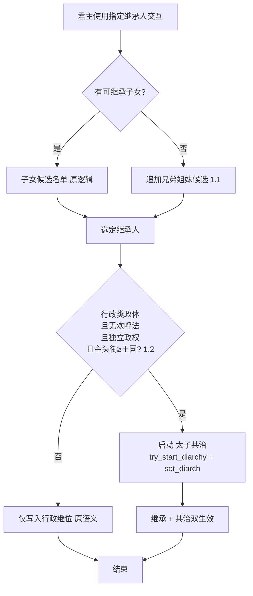
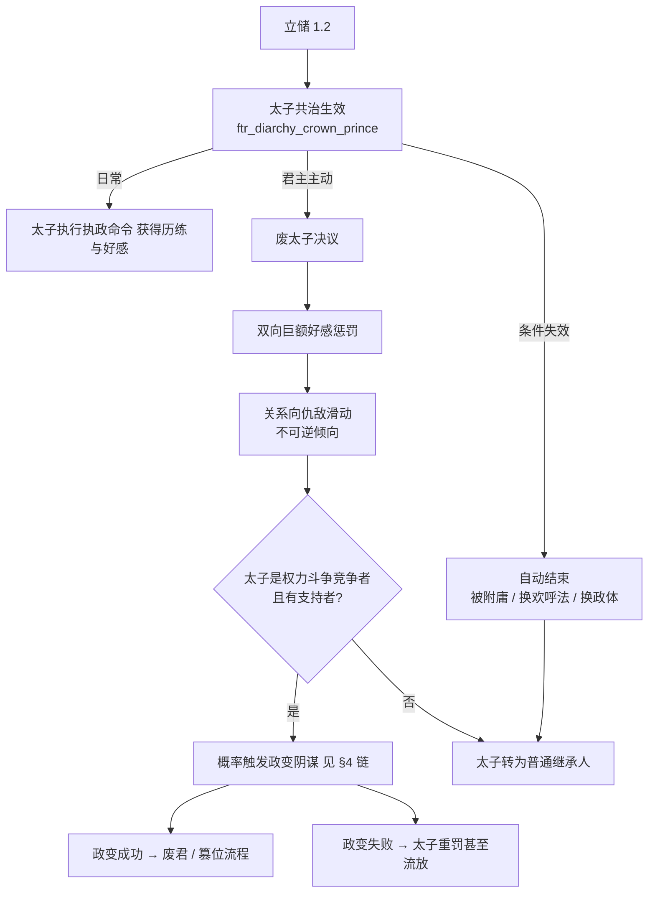
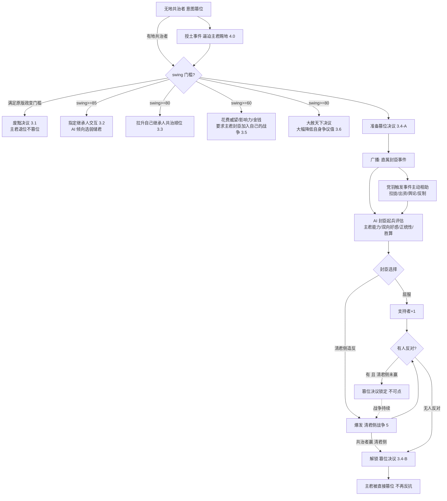
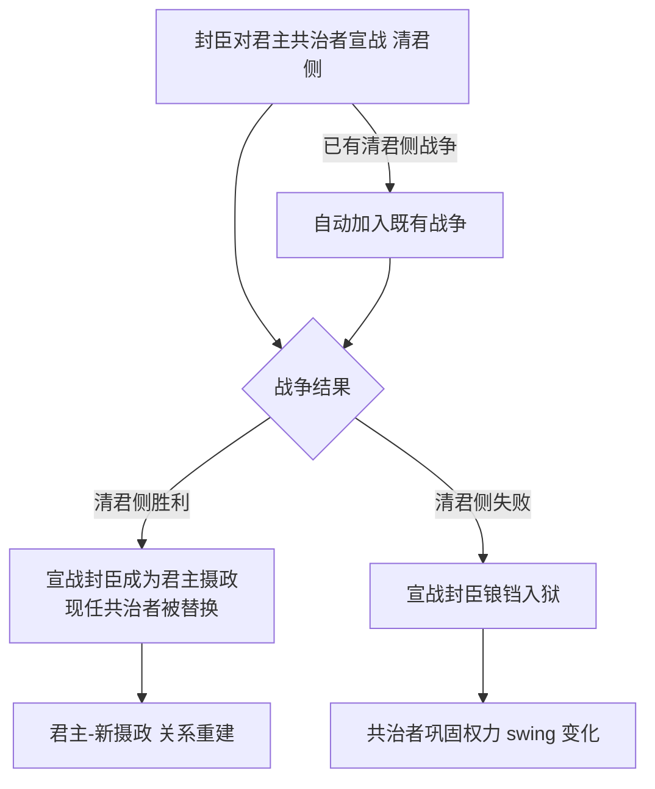

# 共治者机制强化设计

> 本文件是「共治者机制强化」系统的**唯一设计出处**。
> **修改任何相关脚本代码前先读本文件，改完代码后必须同步更新本文件。**
>
> 基线知识：[18 共治系统详解（原版代码基线）](../18-共治系统详解.md)。凡涉及原版 diarchy / 交互 / 决议 / CB 的对象名、行号、参数均以该文为准。
> 关联设计：[01 朝堂权力角逐（权力斗争参与者 / 支持者 / 无地者事件路径）](01-朝堂权力角逐-系统设计.md)、[02 功勋系统](02-功勋系统设计.md)。
>
> **开发硬约束（本任务不可违反）**：**只允许在 `ftr_` 前缀文件下开发，禁止编辑原版任何文件**。「覆盖」一律通过 mod 内同名重定义 + `###### OVERRIDE ######` 标记实现（见 AGENTS §3.4/§4.3）。
> **状态标注约定**：沿用 01/02 ——「状态：已实现 / 未实现」；未实现项只给确定结论，不留“或 / 待权衡”占位描述（开放问题除外，统一收进 §9）。

---

## 1. 目标与范围

### 1.1 设计目标

在原版 diarchy（共治）机制基础上，为本 mod 的**行政类政体**建立一套贴合「储君 / 权臣 / 篡位」叙事的可玩闭环：

1. 行政类政体的**指定继承人**流程扩展为可立储（含无子立手足、无欢呼法立**太子共治**）；
2. 新增**太子**共治类型（区别于原版仅限欢呼法的幼帝/共治皇帝），配套「废太子」权力博弈；
3. **重做共治者篡位链**：从「一拍即合的政变决议」改为「授土 → 铺垫 → 舆论战 → 清君侧 → 最终篡位」的多段流程；
4. 新增**清君侧**宣战理由，让封臣能以武力介入君主与共治者的关系。

### 1.2 需求总览

| # | 需求 | 本文件章节 |
|---|---|---|
| 1 | ftr 重写指定继承人：1.1 无继承子女时可选手足；1.2 无欢呼法的行政独立政权立储触发「太子共治」 | §2 |
| 2 | 新增「太子」共治类型：无欢呼法行政政体可用、附庸后失效、废太子双向重罚且可能引爆政变阴谋 | §3 |
| 3 | 重做共治者篡位：授土事件、3.1 废黜（退位不篡位）、3.2 swing≥85 指定继承人、3.3 swing≥80 拉升继承人共治顺位、3.4 准备篡位→清君侧→最终篡位、3.5 swing≥60 拉封臣入战、3.6 swing≥80 大赦天下 | §4 |
| 4 | 新增「清君侧」CB：封臣对君主共治者宣战，胜则成为君主摄政，败则入狱 | §5 |

### 1.3 适用范围与硬约束

| 项 | 口径 |
|---|---|
| 生效政体 | 「行政类政体」（mod 内判定的 administrative 系政体；具体用 `government_has_flag` / `mechanic_type` 判定见 §9 开放问题） |
| 生效等级 | 独立政权为主；**主头衔等级 ≥ 王国**；被附庸后太子共治失效 |
| 对象范围 | 本 mod 新增的太子共治 + mod 政体下产生的共治关系；**对原版类型（co_emperorship 等）是否泛化适用由 §9 裁定** |
| 无地限制 | 沿用 01 约束：**无地者不能主动发起决议与交互**，一切主动行为靠事件路径（本设计 §4.0 授土事件即为此引入） |
| 不可触碰 | 原版所有文件；覆盖全部收口到 ftr 同名对象 |

### 1.4 术语速查

| 词 | 含义 |
|---|---|
| swing / 权力天平 | diarchy 的 0–100 天平，`has_diarchy_active_parameter` 解锁权力档（详见 18 §3/§6） |
| 顺位（共治者顺位） | diarchy 继任候选序列 `every_diarchy_succession_character` / `candidate_score` |
| 欢呼法 | 原版 `acclamation_succession_law`（幼帝/共帝三型的存续前提） |
| 摄政 | 本文指：通过清君侧胜利夺取的「辅政摄政」位（具体落地形态见 §5/§9） |
| 争议值 | = 原版 **strife / `strife_opinion`**（官方简中译「不和 / 不和度」）。共治者**胡作非为**（越权剥夺 / 收回 / 监禁 / 搜刮等 diarch powers、强制命令事件）时累积的角色值（0–100，月衰减 0.2），令**同领主直属封臣（同僚）**对自己产生 opinion 惩罚；§4.6 大赦天下直接削减该值 |

---

## 2. 需求一：ftr 重写指定继承人

### 2.1 现状问题

- 原版行政/欢呼法体系的「指定继承人」交互只能从符合继承资格的子女（继承顺位）中选取，**无子即无法指定**；
- 未采用欢呼法的行政独立政权立储后**只影响继位，不产生共治体验**，储君无实际权力博弈；
- 1.2 需求要在不碰原版文件的前提下，把「立储」接到 mod 自己的共治类型上。

### 2.2 设计要点

**1.1 候选池扩展**：重定义原版指定继承人交互（mod 内同名覆盖，对象名以实施时原版核对为准，见 §9）：
- 原候选逻辑保留（子女 / 继承顺位）；
- 当 `没有可继承的子女` 时，追加展示**兄弟姐妹**（按性别继承法过滤，复用 01 的性别过滤口径）；
- 兄弟/姐妹立储后按普通「指定继承人」语义生效（写入 mod 行政继位候选）。

**1.2 太子共治接线**：当「行政类政体 + 无欢呼法 + 独立政权 + **主头衔等级 ≥ 王国**」四条件同时成立时，指定继承人动作除了改写继位外，额外启动 `try_start_diarchy = ftr_diarchy_crown_prince` + `set_diarch = 目标`（§3 的太子类型），形成**太子共治**。

### 2.3 改动项评估

| 改动 | 类型 | 落点（均 ftr 文件） | 说明 |
|---|---|---|---|
| 指定继承人交互重定义 | 覆盖 | `common/character_interactions/ftr_*.txt` | 同名重定义原版对象，1.1 扩展候选 + 1.2 分支 |
| 候选人资格触发器 | 新增 | `common/scripted_triggers/ftr_*.txt` | 手足候选人合法集合、性别法过滤 |
| 立储-太子启动效果 | 新增 | `common/scripted_effects/ftr_*.txt` | 判型三条件 + try_start_diarchy 封装 |
| 太子类型（§3 前置依赖） | 新增 | `common/diarchies/diarchy_types/ftr_*.txt` | 被 1.2 引用的类型必须先存在 |
| 双语本地化 | 新增 | `localization/{english,simp_chinese}/…` | `<FTR>` 前缀、文件成对 |

---

## 3. 需求二：新增「太子」共治类型

### 3.1 定位与生命周期

- **类型 key（设计占位）**：`ftr_diarchy_crown_prince`（放 `common/diarchies/diarchy_types/ftr_*.txt`，**新增对象，非覆盖**）。
- **准入**：主君为行政类政体、未采用欢呼法（`NOT = { has_realm_law = acclamation_succession_law }`）、独立政权（`is_independent_ruler = yes`）、**主头衔等级 ≥ 王国**（`highest_held_title_tier >= tier_kingdom`，参照 01 准入口径）、主君与太子间拟启动共治。
- **退出（自动）**：`end` 触发 = 主君失去独立（成为附庸）、或政体/法律不再满足（改用了欢呼法、政体切换）。
- **与幼帝共治的关系**：参照 18 §4.2 的 `junior_emperorship` 做减法——它不需要欢呼法、不自动「转正为共治皇帝」，而是作为**长期储君位**存在。
- **mandate / 能力**：采用标准三件套（fill_coffers / swell_armies / promote_authority）并叠加「辅政历练」加成；`succession = no`（太子即指定继承人，太子位悬空时按行政继位补，而不是 diarchy 补选）。

### 3.2 废除太子

- **废太子走决议**（`common/decisions/ftr_major_decisions.txt` 或 `ftr_charactor_decisions.txt`），只有主君可见可用。
- **代价（双向）**：主君 ↔ 太子互相获得巨额好感惩罚，且朝「仇敌」方向推进（可用仇恨机制 / 关系恶化的不可逆标记实现）。
- **联动政变**：若被废太子**是权力斗争（01 系统）的参与竞争者且持有支持者**，废太子落地后按概率触发政变阴谋，进入 §4 篡位/清君侧冲突链，而非白白出局。

### 3.3 改动项评估

| 改动 | 类型 | 落点 | 说明 |
|---|---|---|---|
| 太子 diarchy 类型 | 新增 | `common/diarchies/diarchy_types/ftr_*.txt` | 准入/退出/参数/两向 modifier |
| 太子 hidden 判型参数 | 新增 | 同上 | `ftr_diarchy_type_is_crown_prince`（供 §2/§4 判型） |
| 废太子决议 | 新增 | `common/decisions/…` | is_shown 判型 + effect 见下 |
| 废太子-恶感效果 | 新增 | `common/scripted_effects/ftr_*.txt` | 双向好感惩罚 + 仇敌推进 |
| 废太子-政变检测 | 新增 | `common/script_values` / `scripted_triggers` | 竞争者+支持者判定、概率常量 |
| 双语本地化 | 新增 | 中英成对 | `<FTR>` |

---

## 4. 需求三：重做共治者篡位机制

### 4.0 前导：无地共治者授土事件

- **问题**：决议与交互对无地廷臣（含无地共治者）不可用，原版政变链路对无地者失效。
- **方案**：引入**授土事件**（事件路径，符合 01 无地者约束）——共治者满足政变意图的前置条件后，由事件逼迫主君为共治者授土（赐予伯爵领/郡级封地），授土完成后共治者才有资格发起 §4.1–4.4 的决议链。主君拒绝授土将直接恶化和赋权（解锁部分 swing / 舆论惩罚）。

### 4.1 废黜决议（3.1）：退位但不篡位

- **条件**：共治者 swing 满足原版政变门槛（即 `has_diarchy_active_parameter = regents_can_try_to_overthrow_present_lieges` 激活，详见 18 §8.1 门槛表）。
- **行为**：新增 ftr 决议，主君**退位但不被篡位**——由指定继承路径接手最高头衔，共治者以「从龙/定策功」换取功勋（接入 02 功勋）与合法性，而非直接登基。

### 4.2 指定继承人交互（3.2）：共治者为主君指定储君

- **条件**：swing ≥ 85。
- **行为**：新增交互，共治者越过主君直接为主君设定继承人（覆盖/写入行政继位指定）。
- **AI 倾向**：AI 共治者优先挑选**年幼、能力差、性格懦弱老实**的继承人（便于日后架空）。

### 4.3 拉升自己继承人共治顺位（3.3）：swing ≥ 80

- **行为**：新增交互；当共治者自己的继承人同时也是主君直属封臣时，可对该继承人在「共治者顺位（diarchy 继任候选/候任线）」上做巨幅拉升，确保自己离开太子位（升任/退位）后由自己人继任。
- **机制取向**：优先走引擎 `candidate_score` / 指定候任的脚本加成路径（若原版 API 不足以覆盖，作为覆盖项重定义相关原版对象，见 §9 开放问题）。

### 4.4 重做共治篡位决议（3.4）：两段式「准备 → 落地」

**阶段 A — 准备篡位（新增决议）**：
- 点击后向主君全部直属封臣广播事件「共治者准备篡位」；
- 每个封臣选择：**向共治者屈服** 或 **以「清君侧」名义造反**；已有清君侧战争进行中的封臣自动加入（§5）。
- **AI 起兵评估**：AI 封臣按下述因素加权评估是否造反——主君能力（属性 / 威望 / 军事 / 统治表现）、主君 ↔ 该封臣的**双向好感 opinion_modifier**、主君**正统性**（legitimacy 等级与趋势）、共治者支持者规模与本方胜算；统一收敛为一个「起兵倾向」script value，超过阈值才选择造反，避免 AI 无差别乱反。
- **党羽主动相助**：共治者若持有支持者（党羽，复用 01 支持者记账），准备阶段支持者会**触发事件主动帮助共治者**——拉拢摇摆封臣、出资出人、散布舆论、对清君侧方示警或反制；帮助结果写回支持者列表并进入 AI 起兵评估（抬高造反难度/我方胜算）。

**阶段 B — 落地篡位**：
- 篡位决议在阶段 A 未完成前**不可点击**；
- 若无人反对、或清君侧战争被共治者（代表君主方）打赢 → 解锁最终「篡位」决议；
- 主君被直接篡位、不再反抗（最高头衔按 18 §8.4 的结局语义过户，但不走原版随机对峙事件链）。

### 4.5 高阶权限：拉封臣入战（3.5，swing ≥ 60，通用）

- **条件**：共治者 swing ≥ 60；
- **行为**：共治者可**花费 威望 / 影响力 / 金钱**（任选或组合，按目标封臣体量定价），要求**主君直属封臣加入自己的战争**（含 §5 清君侧、§4 篡位相关战争）；
- **结算**：目标封臣按自身意愿（与主君/共治者双向好感、报酬量、主君态度）接受或拒绝；接受者实际加入战争并消耗已付报酬；拒绝者可选择退款或记恨（负面意见 modifier）。

### 4.6 高阶权限：大赦天下（3.6，swing ≥ 80）

- **条件**：共治者 swing ≥ 80；
- **行为**：新增「大赦天下」决议，共治者以主君名义颁行大赦，**大幅削减自身 `strife_opinion`（不和度 / 争议值）**——直接以引擎效果 `change_strife_opinion = 负值` 实现（参照原版「邀请权势共治同僚到场可降不和」的同类用法）；
- **代价**：较长冷却 + 主君好感与正统性小幅代价，防止连续滥用无限洗白。

### 4.7 改动项评估

| 改动 | 类型 | 落点 | 说明 |
|---|---|---|---|
| 授土逼迫事件 | 新增 | `events/ftr_diarchy_events.txt` | 事件路径给无地共治者授土；含拒绝分支 |
| 废黜决议（3.1） | 新增 | `common/decisions/ftr_major_decisions.txt` | 退位移交最高头衔 |
| 指定继承人交互（3.2） | 新增 | `common/character_interactions/ftr_*.txt` | 覆盖写入主君行政继位；AI 偏置 |
| 拉升共治顺位交互（3.3） | 新增 | `common/character_interactions/ftr_*.txt` | 条件：直属封臣 + swing≥80 |
| 准备篡位决议（3.4-A） | 新增 | `common/decisions/ftr_*.txt` | 广播事件入口 |
| 篡位落地决议（3.4-B） | **覆盖** | `common/decisions/ftr_*.txt` | 覆盖原版 `diarch_attempt_to_overthrow_liege`（mod 内同名重定义，原字段保留 + OVERRIDE），或将原版决策改为禁用并把入口收口到 ftr 决议链（实施期二选一并记入 §11） |
| 篡位事件链 | 新增 | `events/ftr_diarchy_events.txt` | 封臣表态、无人反对判定、直接篡位结算 |
| AI 起兵倾向 script value | 新增 | `common/script_values|scripted_triggers/ftr_diarchy_*.txt` | 主君能力 / 双向好感 / 正统性 / 胜算 → 造反阈值 |
| 党羽相助事件 | 新增 | `events/ftr_diarchy_events.txt` | 支持者主动帮助（拉拢 / 出资 / 舆论 / 反制） |
| 拉封臣入战入口（3.5） | 新增 | `common/character_interactions/ftr_*.txt` | 花费威望/影响力/金钱拉主君封臣入伍；成本常量走 §8 |
| 大赦天下决议（3.6） | 新增 | `common/decisions/ftr_major_decisions.txt` | 大幅降自身争议值；含冷却与代价 |
| 全局判定触发器/效果 | 新增 | `common/scripted_triggers|effects/ftr_*.txt` | 阶段互锁、解锁条件、结局过户（参照 18 §8.4） |
| 双语本地化 | 新增 | 中英成对 | `<FTR>` |

---

## 5. 需求四：新增「清君侧」宣战理由

### 5.1 定义与规则

- **CB**：新增 ftr CB（参照既有 `ftr_succession_war` / `ftr_celestial_wars` 的写法），目标 = **主君当前共治者**；宣战主体 = 主君直属封臣（含被事件动员者，见 3.4）。
- **失败方结局**：
  - 封臣（清君侧方）**胜利** → 该封臣成为**君主的摄政**（即夺下共治/辅政权，共治者被替换；“摄政”的落地形态——是否映射为新的 ftr 共治类型 / 直接顶替太子位——实施期定，见 §9）；
  - 封臣（清君侧方）**失败** → 锒铛入狱（入狱时机 = 战争失败结算）。
- **与 3.4 的接线**：已有清君侧战争时，新表态的造反封臣直接加入该战争（不重复开战）；清君侧战败 = 共治者篡位链解锁。

### 5.2 改动项评估

| 改动 | 类型 | 落点 | 说明 |
|---|---|---|---|
| 清君侧 CB 定义 | 新增 | `common/casus_belli_types/ftr_*.txt` | 目标共治者、允许方、胜负结算效果 |
| 胜负结算效果 | 新增 | `common/scripted_effects/ftr_*.txt` | 胜→替换/扶正摄政；败→入狱 |
| 自动加入战争 | 新增 | 同上 / 事件 | 已有战争时 add_attacker |
| CB 本土化文案 | 新增 | 中英成对 | `<FTR>` |
| （可选）入狱/释囚钩子 | 新增 | `common/on_action/ftr_*.txt` | 追加语义，非覆盖 |

---

## 6. 改动项汇总（文件级）

| 目录 | 动作 | 内容 |
|---|---|---|
| `common/diarchies/diarchy_types/ftr_*.txt` | **新增** | 太子共治类型 + 参数 |
| `common/character_interactions/ftr_*.txt` | 新增 + 覆盖 | 指定继承人（覆盖）、为君主指定储君、拉升共治顺位 |
| `common/decisions/ftr_major_decisions.txt` / `ftr_*.txt` | 新增 + 覆盖 | 废太子、废黜、准备篡位、篡位落地（覆盖原版决策） |
| `common/casus_belli_types/ftr_*.txt` | **新增** | 清君侧 CB |
| `events/ftr_diarchy_events.txt`（新建） | **新增** | 授土、封臣表态、篡位结算、清君侧结局、废太子政变触发 |
| `common/scripted_effects/scripted_triggers/script_values/ftr_*.txt` | **新增** | 判型/互锁/授土/AI 偏置/数值常量 |
| `common/on_action/ftr_*.txt` | **新增**（追加语义） | 挂载点：战争结算、废太子后脉冲 |
| `localization/{english,simp_chinese}/…` | **新增** | 所有可见文本，`<FTR>`，成对 |

> 全部为 ftr 前缀文件，**不触碰原版**；任何「覆盖」都满足：mod 内同名重定义 + `###### OVERRIDE ######` 包裹 + 保留原版无关字段。

## 7. 与既有系统接线与风险

| 系统 | 接线点 | 风险 / 说明 |
|---|---|---|
| 01 朝堂权力角逐 | 废太子→政变阴谋（3.2）、清君侧可动员支持者、无地者事件路径 | 两套「共治夺权」叙事需明确分工：01 是既有 story 自绘天平，本文是原生 diarchy 链；是否统一（如废弃 01 议题 2 的 swing 改挂引擎 swing）由 §9 裁定 |
| 02 功勋 | 废黜（3.1）给「从龙功」、清君侧胜利给拥立功 | 复用 02 背书/拥立记账，勿再造第二套 |
| 原版 co_emperorship 等类型 | 3.x swing 档、政变门槛沿 18 §8.1 | 若只作用 mod 政体，需在判型里明确限定，避免污染原版共治体验 |
| 无地限制 | 全文（尤其 §4.0） | 所有「主动出手」都要给事件出口，禁止出现无地玩家点不到的局面 |

## 8. 数值常量建议（草案，实施期统一进 `common/script_values/ftr_diarchy_values.txt`）

| 常量（占位） | 用途 |
|---|---|
| `ftr_diarchy_depose_like_threshold_value` | 废黜决议 swing 门槛（沿用原版政变门槛值） |
| `ftr_diarchy_designate_heir_swing_value` | = 85（3.2） |
| `ftr_diarchy_boost_line_swing_value` | = 80（3.3） |
| `ftr_diarchy_abolish_opinion_mutual_value` | 废太子双向好感惩罚 |
| `ftr_diarchy_after_depose_coup_chance_value` | 废太子后政变阴谋触发概率（%） |
| `ftr_diarchy_ai_prefer_incompetent_weight` | AI 指定继承人偏置（幼/弱/怯） |
| `ftr_diarchy_grant_land_min_tier` | 授土最低层级（伯爵领） |
| `ftr_diarchy_ai_revolt_weight_*` | AI 起兵评估各因子权重（主君能力/双向好感/正统性/胜算） |
| `ftr_diarchy_supporter_help_chance_value` | 党羽主动相助触发概率 |
| `ftr_diarchy_supporter_help_effect_value` | 单次相助对 AI 造反难度的抬升量 |
| `ftr_diarchy_levy_vassal_cost_{prestige,influence,gold}_value` | 拉封臣入战（3.5）各货币基础成本 |
| `ftr_diarchy_levy_vassal_reject_opinion_value` | 拒绝入伍的负面意见值 |
| `ftr_diarchy_amnesty_strife_reduction_value` | 大赦天下（3.6）单次 `strife_opinion` 削减量 |
| `ftr_diarchy_amnesty_cooldown_days_value` | 大赦天下冷却天数 |
| `ftr_qingjunce_*` 系列 | 清君侧战争胜负结算的 swing / 好感 / 入狱时长 |

## 9. 开放问题清单（需澄清后再定稿）

1. **指定继承人交互的原版对象名**：实施时核对当前版本（行政/欢呼法路径），确认「覆盖」目标与 1.1/1.2 挂载点。
2. **行政类政体判定口径**：用 `government_has_flag` 还是 `mechanic_type = administrative`？mod 自研政体如何归类？
3. 太子类型**与幼帝共治边界**：太子是否会随主君驾崩自动登基？若是，是否需要处理「太子尚幼 → 是否接摄政」的桥接？
4. 废太子后政变阴谋**复用 01 哪些触发器/事件**，还是另起炉灶。
5. §4.4 中「篡位落地」与覆盖原版 `diarch_attempt_to_overthrow_liege` 的关系：全量覆盖 vs 禁用原版另立 ftr 决议，选哪种（记入 §11 实施登记）。
6. §3.3 拉升共治顺位的引擎机制：`candidate_score` 加成是否够用？是否需要覆盖原版候任 API（`designated_diarch` 可写性）。
7. 清君侧胜利后「成为君主摄政」的形态：替换太子共治 / 新建 ftr 摄政类型 / 仅成为常规摄政。
8. 本文作用域是否**仅限 mod 自建太子类型**，还是对原版 co_emperorship / co_monarchy / regency 也泛化（影响覆盖面与冲突数）。
9. **「争议值」载体映射（已定）**：争议值 = 原版 `strife_opinion`（见 §1.4），增减接口为引擎 `change_strife_opinion`，大赦天下（3.6）直接以负值削减。剩余核对：原版各胡作非为路径（剥夺 / 收回 / 监禁 / 搜刮等 diarch powers）是否都自动经引擎加 strife；若 mod 新增违规路径需复用 `change_strife_opinion` 保证同僚惩罚一致。

## 10. 实施顺序建议

1. 立太子类型 `ftr_diarchy_crown_prince`（§3 壳）——被 §2 依赖，先落最小可用；
2. 指定继承人覆盖 + 立储接线（§2）；
3. 废太子决议与恶感/政变检测（§3.2）;
4. 授土事件与三个 swing 交互（§4.0–4.3）;
5. 清君侧 CB 与战争结局（§5）;
6. 篡位两段式决议链（§4.4）收尾闭环。

## 11. 文件清单与实现状态

| 文件 | 内容 | 状态 |
|---|---|---|
| `common/diarchies/diarchy_types/ftr_diarchy_types.txt` | 太子共治类型 | 未实现 |
| `common/decisions/ftr_diarchy_decisions.txt`（新建） | 废太子 / 废黜 / 准备篡位 / 篡位落地 / 大赦天下 | 未实现 |
| `common/character_interactions/ftr_diarch_interactions.txt`（新建） | 指定继承人（覆盖）/ 定储 / 拉升顺位 / 拉封臣入战 | 未实现 |
| `common/casus_belli_types/ftr_diarchy_wars.txt`（新建） | 清君侧 CB | 未实现 |
| `events/ftr_diarchy_events.txt`（新建） | 授土 / 表态 / 篡位 / 清君侧结局 / 政变触发 | 未实现 |
| `common/scripted_effects|triggers|values/ftr_diarchy_*.txt` | 判型 / 互锁 / AI 偏置 / 常量 | 未实现 |
| `common/on_action/ftr_diarchy_on_actions.txt` | 追加回调 | 未实现 |
| 双语本地化 | 上述可见文本（`<FTR>` 成对） | 未实现 |

**实施期登记项**：
1. §9 各开放问题结论回填；
2. 原版对象覆盖清单（交互/决策对象名）提交前复核 AGENTS 覆盖口径；
3. `tools/validate_scripts.py` 新增对象/挂载点白名单登记。

## 12. 测试要点（实施后人工确认）

1. 有子无子两分支立储 + 手足立储；无欢呼法行政独立国立储后太子共治出现、控制台验证类型已挂载。
2. 太子被废：双向惩罚数值、仇敌走向、有支持者竞争者时按概率触发政变。
3. 无地共治者：授土事件可正常触发，授土后决议可用；拒绝授土分支不卡死。
4. 篡位链：准备阶段决议被锁定；清君侧战争期间、战败、无人反对三种走向各打一遍；最终篡位过户与 18 §8.4 语义一致。
5. 清君侧 CB：胜→新摄政形成；败→入狱；已有战争时新动员方自动加入不重复开战。
6. AI 共治者执行 3.2 时偏好年幼/弱能/怯懦继承人。
7. swing≥60 拉封臣入战（3.5）：三货币成本可扣、目标封臣接受/拒绝符合好感与报酬预期；接受者实际参战。
8. swing≥80 大赦天下（3.6）：自身 `strife_opinion`（不和度 / 争议值）显著下降，同僚对该角色的 opinion 惩罚随之回落；冷却期内不可重复；主君好感/正统性代价生效。
9. 准备篡位阶段：AI 封臣按「主君能力 / 双向好感 / 正统性 / 胜算」的起兵倾向阈值行动——强主低造反、弱主高造反；有党羽时相助事件会主动触发（拉拢 / 出资 / 舆论 / 反制）并抬高造反难度。
10. 全程 error.log 无本 mod 报错；覆盖对象在 ftr 文件内正常覆盖且未改动原版文件。
